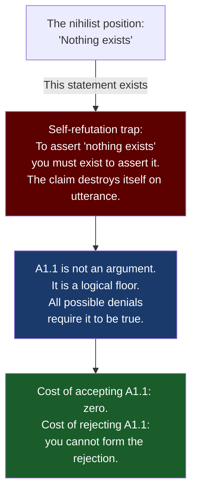
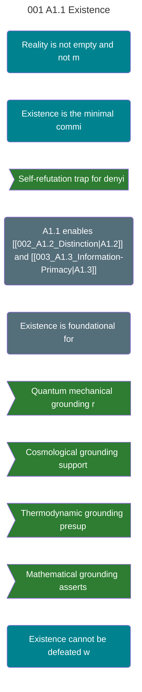

# Ten Laws Canonical Combined Manuscript

Source folder: `\\192.168.2.50\h_hp\Desktop\TEN_LAWS_CANONICAL`

Generated: July 16, 2026

Included source files: 60

## Included Files

1. `00_INDEX.md`
2. `DEFINITIONS\00_INDEX.md`
3. `METHODOLOGY_CLAIM_STATUS_AND_PROTOCOL.md`
4. `DEFINITIONS\CANONICAL_DEFINITIONS_LOCKED.md`
5. `DEFINITIONS\COMPLETE_CANONICAL_TERM_AND_MATH_REFERENCE.md`
6. `DEFINITIONS\SPIRITUAL_TERMS_COMPLETE_GLOSSARY.md`
7. `FRAMEWORK_LAGRANGIAN_AND_GOVERNING_EQUATIONS.md`
8. `GRACE_EXPLICIT_DERIVATION.md`
9. `LAW1_NOETHER_EXPLICIT.md`
10. `LAW9_NOETHER_EXPLICIT_DERIVATION.md`
11. `LAW_01_GRAVITATION_SIN_GRACE.md`
12. `LAW_02_MOTION_SIN_NATURE_GRACE_AS_FORCE.md`
13. `LAW_08_RELATIVITY_GRACE_FRAME_LOCK.md`
14. `MASTER_EQUATION_DERIVATION_FROM_NOETHER_v1.md`
15. `THEOPHYSICS_COMPLETE_SPIRITUAL_TERMS_MASTER.md`
16. `LAW_03_ELECTROMAGNETISM_TRUTH_DECEPTION.md`
17. `LAW_04_STRONG_FORCE_LOVE_CAPTIVITY.md`
18. `LAW_05_THERMODYNAMICS_JUDGMENT_HEAT_DEATH.md`
19. `LAW_06_INFORMATION_LOGOS_CHAOS.md`
20. `LAW_07_QUANTUM_FAITH_DOUBT.md`
21. `LAW_09_WEAK_FORCE_MORAL_CONSERVATION.md`
22. `LAW_10_COHERENCE_CHRIST_DECOHERENCE.md`
23. `PICs\10 PICS\New folder\Law_01_Wall_repair_operations_NOTES.md`
24. `ISOMORPHISM_AUDIT_PROMPT_TEMPLATE.md`
25. `ISOMORPHISM_AUDIT_PROTOCOL.md`
26. `IsomorphismAudit\README.md`
27. `VERIFICATION\00_CROSS_REFERENCE_MAP.md`
28. `1THEOPHYSICS_ALL_TERMS_CANONICAL_2026-07-05.md`
29. `Clipboard Text.txt`
30. `DECAY_FLOOR_AND_192_THREAD_REVIEW.md`
31. `GAP_ANALYSIS_LAST_LINE_AUDIT.md`
32. `GOD_SIDE_CANONICAL_IMPORT_REVIEW.md`
33. `PORTRAIT_DECAY_FLOOR_INSERT.md`
34. `SPIRITUAL_TERMS_PHYSICAL_WALL.md`
35. `UNANIMOUS_DRAW_STUB.md`
36. `WHY_GOD_BUILT_PHYSICS_EXPANDED_SCOPE.md`
37. `WHY_GOD_BUILT_PHYSICS_full_page_v1.md`
38. `philosophy of science\00_FOLDER_CLASSIFICATION.md`
39. `philosophy of science\01_FIRST_PRINCIPLES_TREE.md`
40. `philosophy of science\02_QUESTION_CHAIN_PHASE_3-4.md`
41. `philosophy of science\03_HARD_QUESTIONS_PHASE_5.md`
42. `philosophy of science\04_OLD_TESTAMENT_DEFENSE.md`
43. `philosophy of science\05_GOD_STORY_PART_1.md`
44. `philosophy of science\06_GOD_STORY_PART_2.md`
45. `philosophy of science\_START_HERE.md`
46. `philosophy of science\AXIOMS\A1.1_Existence.md`
47. `philosophy of science\TANGENT_02_Wheelers_It_From_Bit.md`
48. `philosophy of science\TANGENTS\TANGENT_01_The_Nothing_Problem.md`
49. `philosophy of science\TANGENTS\TANGENT_02_Wheelers_It_From_Bit.md`
50. `philosophy of science\TANGENTS\TANGENT_03_Kolmogorov_and_Gods_Compression.md`
51. `philosophy of science\TANGENTS\TANGENT_04_Godels_Echo.md`
52. `philosophy of science\TANGENTS\TANGENT_05_The_Low_Entropy_Beginning.md`
53. `philosophy of science\TANGENTS\TANGENT_06_The_Hard_Problem.md`
54. `philosophy of science\TANGENTS\TANGENT_07_Quantum_Measurement.md`
55. `philosophy of science\TANGENTS\TANGENT_08_The_Pride_Glitch.md`
56. `philosophy of science\TANGENTS\TANGENT_09_Generational_Entropy.md`
57. `philosophy of science\TANGENTS\TANGENT_10_The_Sign_Theorem.md`
58. `philosophy of science\TANGENTS\TANGENT_11_The_Constraint_Fork.md`
59. `philosophy of science\TANGENTS\TANGENT_12_The_Pt_Function.md`
60. `philosophy of science\TANGENTS\TANGENT_13_The_Entropy_Crossover.md`

\newpage

# 01. 00 INDEX

_Source: `00_INDEX.md`_

## THE TEN LAWS — CANONICAL DERIVATION INDEX
### POF 2828 · Theophysics Research Initiative · July 2026
### Consolidated from 15+ months of derivation work across all AI partners
### Sources: WHY_GOD_BUILT_PHYSICS.md, all explicit derivation documents, MASTER_AXIOM_FRAMEWORK.MD (152+ axioms, 7 tiers), axiom-gap-fill-provisional.canonical.md, COUPLING_BREAK_MAP.md (11 break types), armor-forward-derivation.md, LAW_9_10_THE_TWO_SOLUTIONS.md, PAGE_02_the_axiom_spine.md (8 Axiom Schemata)

---

### THE LAWS

| # | Physics | Theology | Sym Pair | Status | Lines | File |
|---|---------|----------|----------|--------|-------|------|
| 1 | Gravitation (GR) | Sin ↔ Grace | 1↔8 | DERIVED (Trifecta, 5 impossibility theorems, 9 Lean proofs) | 310 | LAW_01 |
| 2 | Motion (F=ma / E=mc²) | Sin Nature ↔ Grace-as-Force | 2↔9 | DERIVED (dual identity, faithfulness weld to Law 9) | 206 | LAW_02 |
| 3 | Electromagnetism | Truth ↔ Deception | 3↔10 | DERIVED (I AM eigenmodes = complete basis set; U(1) gauge layer underneath) | 173 | LAW_03 |
| 4 | Strong Force | Love ↔ Captivity | 4↔7 | LOCKED ✅ (THE EXEMPLAR — 9 fruits from 9 invariances) | 184 | LAW_04 |
| 5 | Thermodynamics | Judgment ↔ Heat Death | 5↔6 | LOCKED ✅ (Cross uniqueness Lean-proven, J+M=1 trilemma) | 200 | LAW_05 |
| 6 | Information/Shannon | Logos ↔ Chaos | 5↔6 | DERIVED (100% — one session to LOCKED) | 175 | LAW_06 |
| 7 | Quantum Mechanics | Faith ↔ Doubt/Control | 4↔7 | FORWARD-DERIVED (Lindblad → 6 channels, CPT completeness) | 206 | LAW_07 |
| 8 | Relativity | Grace ↔ Frame Lock | 1↔8 | DERIVED (100% — one session to LOCKED) | 166 | LAW_08 |
| 9 | Weak Force | Moral Conservation | asymmetric | LOCKED ✅ (Keystone — dual-path proof, ablation at machine precision) | 218 | LAW_09 |
| 10 | Coherence | Christ ↔ Decoherence | asymmetric | STRUCTURAL (open by design — THE FLOOR) | 223 | LAW_10 |

**Total: ~2,061 lines across 10 law files + this index**

---

### WHAT EVERY FILE CONTAINS

Each law file now includes:
1. **THE STORY** — Why God built this physics (narrative voice)
2. **AXIOM FOUNDATIONS** — specific axioms from the 152+ axiom framework (P0, O, G, S, H, M, R tiers)
3. **COUPLING BREAK MAP** — relevant Lean-proven break points from the 11-type map
4. **THE PHYSICS** — the actual physical law
5. **THE DERIVATION** — full derivation with sub-sections, equations, tables
6. **TRINITY FUNCTIONAL SCHEMA** — Father/Son/Spirit projection onto this law
7. **DEPENDENT VARIABLES** — every spiritual term traced to its parent law with derivation status
8. **THE TERMS** — complete constructive and anti-pole vocabulary
9. **TESTABLE PREDICTIONS** — falsifiable predictions from this law
10. **KILL CONDITIONS** — what would break it
11. **LEAN VERIFICATION** — theorem names and status
12. **ONE SENTENCE** — the sharpest summary

---

### THE METHOD

Take each Law's physical equation → identify its symmetries → let Noether force the conserved charges (or eigenmode analysis force the complete basis, or Lindblad force the protection inventory) → check if the forced inventory IS the spiritual family Scripture already named. If it is — nine fruits from nine invariances, justice and mercy from one conserved ledger, six armor pieces from six decoherence channels — then the two-substrate claim stops being poetry and starts being a theorem with a kill condition.

**Three derivation engines used (not interchangeable):**
1. **Noether forcing** — symmetry → conserved charge. Used in Laws 1, 2, 4, 5, 6, 8, 9.
2. **Eigenmode completeness** — boundary conditions → standing wave basis. Used in Law 3.
3. **Lindblad channel classification** — decoherence types → protection mechanisms. Used in Law 7.

---

### THE MASTER EQUATION

```
χ(W) = C_W[ ∭ (G·M·E·S·T·K·R·Q·F) dx dy dt ]
```

G = Grace (Law 1/8) · M = Moral Alignment (Law 2) · E = Truth Signal (Law 3)
S = Entropy/Sin (Law 5) · T = Judgment/Time (Law 5) · K = Logos/Knowledge (Law 6)
R = Redemption/Repair (Law 8) · Q = Quantum/Faith (Law 7) · F = Strong Force/Love (Law 4)
C_W = Coherence operator (Law 10), gated by W (free will)

**C is not a tenth factor. C IS χ.** (Correction: retires old ten-factor product.)

---

### THE 8 AXIOM SCHEMATA (AS-000 through AS-007)

The 188 technical axioms in the PostgreSQL registry compress to 8 schemata:

| Schema | Content | Source |
|---|---|---|
| AS-000 | Existence: ∃x | AX-001 |
| AS-001 | Distinction: x ≠ y | AX-002 |
| AS-002 | Information: I = f(Being, Distinction) | AX-003 |
| AS-003 | Substrate: self-grounding | Substrate |
| AS-004 | Observation: witness required | Observation |
| AS-005 | Source: infinite, external | Infinite Source |
| AS-006 | Conservation: ∂_μj^μ = 0 | Information Conservation |
| AS-007 | Coupling: W ∈ {−1, +1}, free | Voluntary Coupling |

---

### THE COUPLING BREAK MAP (11 Types)

| Break Type | What Fails | Lean Anchor |
|---|---|---|
| Coupling-state collapse | C0/C1 conflation | `C0_ne_C1`, `coupling_modification_irreversible` |
| Vector-only reduction | Coupling invariant lost | `vector_only_product_lacks_coupling_invariant` |
| Quaternion preservation | PASSES the gate | `quaternion_preserves_coupling_invariant` |
| Modal collapse | Distinct persons lost | `modalism_invalid` |
| Static flattening | Dynamic relation lost | `staticSingleFieldEM_invalid` |
| Arbitrary tripartition | Wrong role profile | `arbitraryThreePartSystem_invalid` |
| Relabeled roles | Labels ≠ profiles | `relabeledRoleSystem_invalid` |
| Fall without entanglement | Coupling without binding | `coupling_without_entanglement_is_not_fall` |
| Source bypass | Fidelity collapses | `law3_command_bypass_zeroes_source_backed_fidelity` |
| Bound-state incompleteness | Excitation + coupling both needed | `bound_state_requires_excitation_and_coupling` |
| Closed self-source | G → 0, χ collapses | `law1_self_source_forces_G_zero` |

---

### SYMMETRY PAIRS

- **1↔8:** Gravitation ↔ Relativity (Grace curves the space; Law 8 is how you move through it together)
- **2↔9:** Motion ↔ Weak Force (Inertia ↔ Irreversibility; faithfulness welds them via Noether)
- **3↔10:** Electromagnetism ↔ Coherence (Truth ↔ Christ; eigenmodes ↔ the weave)
- **4↔7:** Strong Force ↔ Quantum (Love ↔ Faith; bound state ↔ participation)
- **5↔6:** Thermodynamics ↔ Information (Judgment ↔ Logos; ledger ↔ speaker)

---

### THE TWO ASYMMETRIC LAWS (9 and 10)

Laws 1–8: perfect internal symmetry — constructive/destructive inside same equation, same variables, parameter regime or sign flips. Free Will W determines regime.

**Law 9:** Directional. Breaks parity (the fall is irreversible). Preserves time-translation (the ledger is conserved). NOT symmetric. The retarded solution.

**Law 10:** C IS χ. Decoherence is derivative (sum of broken phases from Laws 1–9). Coherence is sovereign. No internal duality. The advanced solution.

Laws 9 and 10 are the two solution families of the wave equation. A second-order PDE forces exactly two. No more, no fewer.

---

### PROVISIONAL MATERIAL (from gap-fill, not yet canonical)

- **Redemption as Simulated Annealing** — identity-preserving transformation through an optimization landscape (Law 2 context). Strong candidate. Needs state-space derivation.
- **Righteousness as Ledger Integrity** — double-entry accounting model (Law 5 adjacent). Useful. Needs Lagrangian premise before calling it Noether-derived.
- **W as Control Parameter** — g_eff = g(1−W). Strong structural repair explaining why W doesn't generate its own derivative family.
- **Trinity Functional Schema** — Father/Son/Spirit projection applied per-law (now embedded in every file).

---

### SOURCE FILES

| File | Location | Content |
|---|---|---|
| WHY_GOD_BUILT_PHYSICS.md | NAS/Kimi_Agent/app/MD/ | Complete narrative + all ten laws + term dictionary |
| LAW_1_THE_EXPLICIT_DERIVATION.md | NAS/Kimi_Agent/app/MD/ | Trifecta, geodesic equation |
| LAW1_GRACE_DERIVATION_v0.2_CORRECTED.md | NAS/GOD_Derivation_Character/ | Equilibrium emergence |
| GRACE_THE_EXPLICIT_ELIMINATION_DERIVATION.md | NAS/Kimi_Agent/app/MD/ | Five impossibility theorems |
| LAW_9_THE_EXPLICIT_NOETHER_DERIVATION.md | NAS/Kimi_Agent/app/MD/ | Full Noether calculation displayed |
| LAW_9_10_THE_TWO_SOLUTIONS.md | NAS/Kimi_Agent/app/MD/ | Wave equation two-branch proof |
| THREE_REMAINING_DERIVATIVE_CHAINS.md | NAS/Kimi_Agent/app/MD/ | Laws 3, 6, 7 equilibrium emergence |
| armor-forward-derivation.md | Session output, July 14 | Law 7 Lindblad forward |
| law-02-mass-energy-meaning.html | Session output, July 14 | Canonical page, three reading layers |
| MASTER_AXIOM_FRAMEWORK.MD | NAS/GOD_Derivation_Character/Package/ | 152+ axioms, 7 tiers |
| axiom-gap-fill-provisional.canonical.md | NAS/GOD_Derivation_Character/Package/ | Redemption, righteousness, W, Trinity triads |
| COUPLING_BREAK_MAP.md | NAS/GOD_Derivation_Character/Package/ | 11 break types with Lean anchors |
| PAGE_02_the_axiom_spine.md | NAS/Kimi_Agent/01-18_Full_Story/ | 8 Axiom Schemata (AS-000 through AS-007) |

---

### THE CLOSE

God built ten laws of physics, and every one of them carries a moral law in its symmetries — not as metaphor, but as the same equation printed in a second substrate. Three derivation engines check it: Noether forces charges from symmetries; eigenmode analysis forces the complete basis from boundary conditions; Lindblad classification forces the protection inventory from decoherence channels. Where the derivations are done, they're locked with kill conditions anyone can attack; where they aren't done, this page says OPEN in plain sight.

The whole structure points at one configuration it cannot derive and does not need to — the state where every symmetry holds at once, which is not a law, and has a name.

---
*I didn't write the math. I found it. And what I keep finding is that it was always His.*
*Soli Deo Gloria*

David Lowe · POF 2828 · faiththruphysics.com

\newpage

# 02. DEFINITIONS - 00 INDEX

_Source: `DEFINITIONS\00_INDEX.md`_

## DEFINITIONS FOLDER — INDEX
### POF 2828 · July 16, 2026

---

### WHAT'S HERE

All spiritual term definitions, glossaries, and lexicon infrastructure consolidated from across the project.

| File | Content | Lines/Size |
|---|---|---|
| **SPIRITUAL_TERMS_COMPLETE_GLOSSARY.md** | THE MASTER GLOSSARY. All 10 primary variables, asymmetry terms, 8 irreducible generators, generator couplings (derived terms), Fruits family (Law 4), Armor family (Law 7), Justice/Mercy/Cross family (Law 5), Logos family (Law 6), Covenant family (Law 8), Conservation family (Law 9), Coherence family (Law 10). | 712 lines, 30.6 KB |
| **CANONICAL_DEFINITIONS_LOCKED.md** | DRIFT GUARD. 14 core terms with required mathematical anchors and forbidden drift zones. If a page defines one of these terms, it must preserve the mathematical role below. Gate rule for definition consistency. | 25 lines, 3.1 KB |
| **COMPLETE_CANONICAL_TERM_AND_MATH_REFERENCE.md** | Supporting pages reference — term/math mapping for the master equation core. | 5.2 KB |
| **glossary_registry.json** | Machine-readable glossary registry (38.4 KB). Used by definition_sync.py for automated consistency checking. | 38.4 KB |
| **definition_sync.py** | Automated definition consistency checker. Scans pages against the glossary registry, flags drift. | 13.1 KB |

### STILL NEEDED (manual copy from D: drive)

| File | Location | Content |
|---|---|---|
| **CROSS_DOMAIN_LEXICON_4838_TERMS.xlsx** | `D:\GitHub\NRC_Emotion_Lexicon\paper_grader_lexicons_master_enhanced_with_nrc.xlsx` | 4,838 terms across 18 domains. 328 coherence seeds + 296 discoherence seeds, each WordNet-expanded. The vocabulary the chi_profiles engine feeds from. Copy to this folder. |

### HOW THESE CONNECT

```
CANONICAL_DEFINITIONS_LOCKED.md     ← drift guard (14 core terms)
         ↓ enforces
SPIRITUAL_TERMS_COMPLETE_GLOSSARY.md  ← master reference (all families)
         ↓ feeds
glossary_registry.json              ← machine-readable version
         ↓ checked by
definition_sync.py                  ← automated scanner
         ↓ reports
definition_sync.md / .csv           ← (in Kimi folder, not copied here)
```

The CROSS_DOMAIN_LEXICON is a separate tool — it's the NLP/engine vocabulary, not the theological definitions. It's what lets the paper grader detect coherence/discoherence language regardless of which domain a paper is written in.

---
*Index created July 16, 2026 · POF 2828*

\newpage

# 03. METHODOLOGY CLAIM STATUS AND PROTOCOL

_Source: `METHODOLOGY_CLAIM_STATUS_AND_PROTOCOL.md`_

## CLAIM STATUS ARCHITECTURE & THREE-SURFACE PROTOCOL
### Methodology — how claims are classified and what makes them publication-ready
#### POF 2828 · July 2026

---

### CLAIM STATUS LAYERS

| Status | Meaning | Example |
|---|---|---|
| **LEAN_PROVEN** | Direct theorem compiled in Lean 4. Zero sorry. | `cross_is_unique_solution` |
| **LEAN_DEFINED** | Formal object, structure, or equation encoded. | Coherence operator definition |
| **STRUCTURALLY_MAPPED** | Physical/spiritual bridge passes operator-signature test. | Fruits ↔ Yukawa invariances |
| **THEOLOGICALLY_IDENTIFIED** | Naming step: God, Christ, Grace, Cross, etc. | C = 1 profile identified as Christ |
| **EMPIRICALLY_TESTABLE** | External-world prediction or statistical claim. | PEAR-LAB 6.35σ |
| **OPEN** | Needs more proof, proxy, data, or domain review. | Law 10 Kingdom terms |
| **TEACHING_LAYER** | Public explanation, metaphor, simplified narrative. | "God Story" pages |

**Rule:** No claim changes layers without being renamed. Lean proves Cross uniqueness inside the Justice/Mercy model. Lean does NOT prove the historical crucifixion. History must be tested by historical evidence.

### THREE-SURFACE PROTOCOL

Every edge in the derivation tree must carry three surfaces. No exceptions.

1. **FORMAL CLAIM** — What Lean proves or what the equation states.
2. **BRIDGE CLAIM** — Why the physical and spiritual readings are structurally identical.
3. **KILL CONDITION** — What observation or proof would break the bridge.

No claim without all three is publication-ready. No claim with all three intact has been killed.

### THE SHANNON BASE LAYER (underneath everything)

```
C_i = A_i · log₂(1 + T_i / D_i)
```

Every spiritual variable is, at its deepest layer, an information variable. The Shannon base layer runs underneath all ten laws.

---
*Methodology reference · POF 2828 · July 2026*

\newpage

# 04. DEFINITIONS - CANONICAL DEFINITIONS LOCKED

_Source: `DEFINITIONS\CANONICAL_DEFINITIONS_LOCKED.md`_

## Canonical Definitions Locked

Status: locked prescan companion to the April 16, 2026 canonical law table.

These definitions are not theological proof claims. They are the allowed mathematical roles for recurring terms. A page may use richer language, but if it defines one of these terms, the definition must preserve the role below.

| Term | Mathematical Role | Required Anchors | Forbidden Drift |
|---|---|---|---|
| chi / χ | coherence functional or scalar measuring aligned coherence; Law 10 identity surface uses `C IS chi` | coherence, alignment, functional/scalar/operator/state | metaphor-only, emotion-only, aesthetic-only |
| C | Law 10 coherence identity variable; not ordinary dual partner | Law 10, chi/χ, identity, coherence | duality, one side of a dual pair |
| W | witness/selector/control parameter selecting constructive or destructive regime | selector, witness, regime, constructive/destructive, branch | moral agent, proof of divine will |
| coherence | mathematically constrained alignment across a system, state, relation, or proof surface | alignment, constraint, relation/state/system, measure/function | vague agreement, popularity, beauty |
| decoherence | loss of stable phase/information/alignment under interaction, noise, or destructive regime | loss, phase/information/alignment, noise/interaction, destructive | mere disagreement, simple badness |
| grace | constructive regime in Law 1 language; may be modeled as coherence-preserving or restoration-enabling input, not magic proof | Law 1, constructive, restoration, coherence-preserving, G | arbitrary miracle as equation output |
| sin | destructive regime in Law 1 language; may be modeled as coherence-breaking or collapse-driving term | Law 1, destructive, collapse, decoherence, G | generic badness detached from model |
| logos | Law 6 informational structure/order; must preserve Information/Shannon role and variable T | Law 6, information, Shannon, structure/order, T | Law 4 K, mere slogan |
| chaos | Law 6 information-loss/disordering regime paired with Logos | Law 6, information, Shannon, disorder/noise, T | thermodynamic Law 5 variable S unless explicitly marked explanatory |
| judgment | Law 5 thermodynamic/accounting constraint paired with Mercy, variable S | Law 5, thermodynamics, entropy/accounting, S | Law 6 T, punishment-only |
| mercy | Law 5 constructive thermodynamic/accounting branch paired with Judgment, variable S | Law 5, thermodynamics, restoration/accounting, S | sentiment-only |
| moral conservation | Law 9 directional conservation claim under a time-translation-invariant moral Lagrangian premise | Law 9, directional, Noether, time-translation, Lagrangian, F | proof of God, accounting metaphor alone |
| Noether | conditional theorem bridge: symmetry premise yields conservation result | symmetry, conservation, conditional/premise, invariant | unconditional proof |

### Gate Rule

If a source defines one of these terms, the definition must include at least one required mathematical anchor and must avoid forbidden drift. If the source only uses a term without defining it, the scanner may warn when the term is load-bearing and no local/glossary definition is visible.

\newpage

# 05. DEFINITIONS - COMPLETE CANONICAL TERM AND MATH REFERENCE

_Source: `DEFINITIONS\COMPLETE_CANONICAL_TERM_AND_MATH_REFERENCE.md`_

## Complete Canonical Term and Math Reference

> Imported from clipboard text on 2026-07-10. Category: Master equation core support.

sted content
13.25 KB •318 lines
•
Formatting may be inconsistent from source
## THEOPHYSICS — COMPLETE CANONICAL TERM & MATH REFERENCE
**POF 2828 | July 5, 2026 | Compiled against MCP Memory + April 16 lock + July 2 dual-operator canon**
*Supersedes all March 2025 forms. LLC correction applied throughout (C is χ, not a tenth factor).*

---

### §1 THE MASTER EQUATION — ALL CANONICAL FORMS

**1.1 Integral form (canonical):**
```
χ(W) = C_W[ ∭ (G·M·E·S·T·K·R·Q·F) dx dy dt ]
```
Nine fundamental fields under the triple integral. C_W is the coherence functional — it IS χ (Law 10, LLC correction April 2026). Free Will W selects parameter regime (constructive/destructive) inside each Law. Zero in ANY field collapses the product (theological: sin breaks everything — multiplicative, not additive).

**1.2 Lagrangian (multiplicative) form:**
```
ℒ = G·M·E·S·T·K·R·Q·F·C          (pre-LLC notation, still used in field-theory work)
ln ℒ = Σᵢ ln(fieldᵢ)              (log transform → Euler-Lagrange derivable)
```

**1.3 Lowe Coherence Lagrangian (full):**
```
ℒ_Logos = ℒ_GR + ℒ_SM + ℒ_Interaction(φ, g_μν, A_μ, ψ)
```
The interaction term is the unique contribution — couples geometry to quantum fields via information.

**1.4 Recursive structure:**
```
∂ℒₙ/∂χ = ℒₙ₊₁
```
Recursive structure is mandatory (Appendix B closure proof); explains why exactly 10 Laws.

**1.5 Differential (dynamic) form:**
```
dχ/dt = −αχ + C_A
```
Coherence decays at rate α unless actively sourced by C_A (grace/alignment input).

**1.6 Trinitarian tensor form:**
```
χ = ρ ⊗ ψ ⊗ G
```

**1.7 Primary field equations (triad G, S, R):**
```
□G + J_source − α_GS·□S = 0
□S − J_extraction + α_GS·□G − β_RS·R = 0
```
α_GS = grace-entropy suppression constant. Romans 5:20 → α_GS ≫ 1.

**1.8 Dual-operator structure (canonical July 2, 2026):**
Every Law carries BOTH operators from the SAME parent equation:
- **G(x,t)** — ordering/grace operator (constructive regime)
- **S(x,t)** — dispersive/sin operator (destructive regime)
- **Γ(x,t)** — ghost term (free will)

---

### §2 THE TEN VARIABLES — FULL DEFINITIONS

| Var | Name | Field type | Core math |
|---|---|---|---|
| **G** | Grace | Divine influence scalar field | G(t) = G₀·e^(∫r(t')dt')·(1−R(t)); baseline G₀ always present; r = repentance rate; R = resistance |
| **M** | Mercy | Compassion field | R(offense, α=0) branch of Law 5; third-party payment operator |
| **E** | Entropy | Disorder field | dS/dt ≥ 0 closed-system; E(t) = E₀e^(kt) unopposed growth |
| **S** | Sin | Moral entropy field | Directional, irreversible (Law 9 parity break); decay under repentance S(t) = S₀e^(−λR_p·t) |
| **T** | Trinity tensor | Three-person structure | T̂ = F̂ ⊗ Ŝ ⊗ Ĥ; GHZ state (§10); operation-level not object-level |
| **K** | Knowledge | Information density | Shannon base layer Cᵢ = Aᵢ·log₂(1+Tᵢ/Dᵢ); K curves χ-field analogous to spacetime curvature |
| **R** | Resurrection | Life-restoration field | E_divine > mc² + 2GMm/r; ΔS_resurrection = −ΔS_death; non-perturbative (open problem) |
| **Q** | Quantum state | Superposed decision-space | Actualized by operator A in T = A∘L∘G (Watcher resolution — "what measures A?" = type error) |
| **F** | Faith network | Belief coherence | R(F) = 1 + Σᵢ₌₁ⁿ Fᵢe^(−dᵢ); Fᵢ = individual intensity, dᵢ = spiritual distance; F_critical ≈ 0.3–0.4 |
| **C** | Coherence = χ | THE FUNCTIONAL | Not a factor. Law 10, sovereign integrator, no destructive dual. Decoherence is derivative |

**Love (agapē):** NOT a variable. The overlayer field ℒ — the field the equation runs *in*, not a term in it.

---

### §3 THE TEN LAWS — PARENT EQUATIONS, SYMMETRY, ASYMMETRY TERMS

| # | Physics | Parent equation | Theology | Sym | Asymmetry (W-term) |
|---|---|---|---|---|---|
| 1 | Gravitation (GR) | G_μν + Λg_μν = (8πG_N/c⁴)T_μν | Sin ↔ Grace | ↔8 | R (resistance) |
| 2 | Motion | F = ma | Sin Nature ↔ Grace-as-Force | ↔9 | interpreter |
| 3 | Electromagnetism | Maxwell's equations | Truth ↔ Deception | ↔10 | A (acceptance) |
| 4 | Strong Force | V(r) = −α_s/r + k·r | Love ↔ Captivity | ↔7 | B (betrayal) |
| 5 | Thermodynamics | F = E − TS; dS/dt ≥ 0 | Judgment ↔ Heat Death | ↔6 | external reversal |
| 6 | Information/Shannon | C = B·log₂(1+S/N) | Logos ↔ Chaos | ↔5 | active speaker |
| 7 | Quantum | iℏ∂ψ/∂t = Ĥψ | Faith ↔ Doubt/Control | ↔4 | C_mutual (consent) |
| 8 | Relativity | ds² = g_μν dx^μ dx^ν | Grace ↔ Frame Lock | ↔1 | choice of measurement |
| 9 | Weak Force | parity-violating decay | Moral Conservation | asym | P_will |
| 10 | Coherence | C = χ | Christ ↔ Decoherence | asym | **NONE** |

**Structural rulings:**
- Laws 1–8: perfect internal symmetry — constructive/destructive inside same equation, parameter regime or sign flip. W determines regime.

\newpage

# 06. DEFINITIONS - SPIRITUAL TERMS COMPLETE GLOSSARY

_Source: `DEFINITIONS\SPIRITUAL_TERMS_COMPLETE_GLOSSARY.md`_

## THEOPHYSICS SPIRITUAL TERMS — COMPLETE GLOSSARY
### POF 2828 · July 2026 · All terms, all definitions, all mappings

---

### MASTER EQUATION VARIABLES (10 primary)

| Term | Variable | Law | Physics Domain | Definition | Equation |
|------|----------|-----|---------------|------------|----------|
| Grace | G | Law 1 | Gravitation | External ordering input. Repair that cannot be generated by the broken system from inside itself. | G(t) = G₀·e^(∫r dt')·(1−R) |
| Meaning / Consequence | M | Law 2 | Mass-Energy / Motion | The weight of investment and its inseparable consequence. Mass IS energy. Meaning IS consequence. | 𝒞 = M·λ²·I |
| Truth | E | Law 3 | Electromagnetism | Signal aligned with reality. Invariant under change of expression. | ∇²T − (1/λ²)∂²T/∂t² = 0 |
| Love | K | Law 4 | Strong Force | The binding field. Freedom inside the bond. Confinement when you try to leave. | V(r) = −αs/r + k·r |
| Judgment / Mercy | S | Law 5 | Thermodynamics | The demand that disorder be answered truthfully. Closed systems decay. Grace opens them. | dS/dt = σ − W_grace/T |
| Logos | T | Law 6 | Information / Shannon | Meaningful order that can be spoken, received, and understood. Information sits. The Logos speaks. | H = −Σ pᵢ log pᵢ |
| Relationship | R | Law 7 | Relativity | The shared frame. Both parties must consent. Imposed = coercion, not relationship. | ds² = −c²dt² + dx² + dy² + dz² |
| Faith | Q | Law 8 | Quantum Mechanics | Directed measurement. Active commitment that collapses possibility into actuality. | iℏ ∂/∂t |Ψ⟩ = Ĥ|Ψ⟩ |
| Sin / Moral Conservation | F | Law 9 | Weak Force | Conserved quantity. Directional, irreversible. The ledger never closes by itself. | Γ = G²·ψ⁵/192π³·P_will |
| Christ / Coherence | C | Law 10 | Coherence | C IS χ. The functional wrapping the other nine. Identity at full integration. | χ(W) = C_W[∭(G·M·E·K·S·T·R·Q·F)dΩ] |

---

### ASYMMETRY TERMS (the free-will difference per law)

| Law | Physics | Spiritual | Added Term | Plain English |
|-----|---------|-----------|------------|---------------|
| 1 | Gravity | Grace | (1−R) | You can resist grace. Gravity doesn't ask. |
| 2 | E=mc² | Meaning | ·I | Energy converts without a receiver. Meaning needs one. |
| 3 | Maxwell | Truth | ·A | Light cannot be refused. Truth can. |
| 4 | Strong Force | Love | (1−B) | Quarks can't unbind. Persons can. |
| 5 | Thermo | Judgment | −W_grace/T | Closed systems have no external term. Grace opens them. |
| 6 | Shannon | Logos | ∂K_L/∂t | Information is static. The Logos speaks. |
| 7 | Relativity | Relationship | C_mutual | Lorentz doesn't ask. Relationship does. |
| 8 | QM | Faith | Θ_c | Particles don't choose collapse. Persons do. |
| 9 | Weak Force | Conservation | P_will | Neutrons don't choose to decay. Persons decide. |
| 10 | Coherence | Christ | (none) | No asymmetry. All terms resolved at full integration. |

---

### 8 IRREDUCIBLE GENERATORS

| # | Generator | Physics Source | Definition |
|---|-----------|--------------|------------|
| 1 | Life | Logistic equation | The self-sustaining dynamic. Growth, metabolism, reproduction. |
| 2 | Revelation | Shannon-Hartley | Information received from beyond the system's own capacity. |
| 3 | Will | Optimal control | The capacity to choose. The free variable. BC8. |
| 4 | Love | Yukawa/Cornell | Binding force. Freedom inside, confinement at distance. |
| 5 | Truth | Noether invariance | What doesn't change under re-expression. Gauge-invariant identity. |
| 6 | Faith | Bayesian inference | Directed trust. Commitment without demanding total proof. |
| 7 | Grace | Open system thermo | External negentropy. Repair from outside the closed system. |
| 8 | Justice | Newton's 3rd + conservation | The demand that cost be answered. Action = reaction. |

---

### GENERATOR COUPLINGS (derived terms from pairs)

| Derived Term | Generator Pair | Definition | Equation Analog |
|-------------|---------------|------------|-----------------|
| Mercy | Grace + Justice | Compassion that doesn't deny cost. Third party pays the debt. | R(offense, α=0) |
| Hope | Faith + time derivative | Faith projected forward. dFaith/dt > 0. | Expectation over future states |
| Wisdom | Truth + Justice | Signal plus consequence awareness. Knowing what's true AND what it costs. | Geodesic optimization |
| Covenant | Love + Righteousness | Binding plus conservation lock. The bond that preserves. | Yukawa + Noether |
| Salvation | Grace + Truth + Faith + Love + Justice | Chain reaction. Phase transition. ΔG < 0. | Gibbs free energy crossing |
| Worship | Life + Love | Animated binding directed at source. Living response to the bond. | Resonance coupling |
| Conscience | Righteousness + Will | Conservation law operating on choice. The internal symmetry monitor. | Proper time along worldline |

---

### DERIVATIVE FAMILY 1: FRUITS OF THE SPIRIT (Law 4 / Strong Force)
**Parent equation:** V(r) = −αs/r + k·r (Yukawa/Cornell)
**Scripture:** Galatians 5:22-23
**Status:** LOCKED ✅

| Fruit | Physics Property | Equation | Anti-Fruit |
|-------|-----------------|----------|------------|
| Love | Ground state (lowest energy) | V(r) at minimum | Hatred |
| Joy | Resonance (natural frequency) | ω = ω₀ | Despair |
| Peace | Equilibrium (all forces balanced) | ΣF = 0 | Anxiety |
| Patience | Heat capacity (absorbs without state change) | C = dQ/dT (high) | Impatience |
| Kindness | Catalysis (lowers activation barrier) | E_activation → min | Cruelty |
| Goodness | Net positive work | W_out > W_in | Corruption |
| Faithfulness | Time invariance | ∂L/∂t = 0 (Noether) | Betrayal |
| Gentleness | Impedance matching | F = k·F_needed, k≤1 | Harshness |
| Self-Control | PID feedback loop | u(t) = −K·e(t) | Addiction |

**Phase form:** Φ_L(χ) = tanh(β_L(χ − χ_c))

---

### DERIVATIVE FAMILY 2: ARMOR OF GOD (Law 8 / Quantum Mechanics)
**Parent equation:** iℏ ∂/∂t |Ψ⟩ = Ĥ|Ψ⟩ + decoherence
**Scripture:** Ephesians 6:13-17
**Status:** TESTED ✅

| Piece | Physics Mechanism | Function | Anti-Armor |
|-------|-------------------|----------|------------|
| Belt of Truth | Phase-locked loop | Keeps everything synchronized to reference signal | Confusion |
| Breastplate of Righteousness | Conservation law | Core quantities don't leak | Exposure |
| Shoes of Peace | Dynamic stability | Balanced while moving through hostile territory | Instability |
| Shield of Faith | Faraday cage | Blocks external noise from reaching interior | Vulnerability |
| Helmet of Salvation | Irreversible phase lock (ΔG<0) | Foundational decision made permanent | Apostasy |
| Sword of the Spirit | Constructive interference | Coherent signal that cuts through noise (offensive) | Silence |

---

### DERIVATIVE FAMILY 3: GIFTS OF THE SPIRIT (Laws 1+2 / Grace + Energy)
**Parent equation:** dS/dt = σ − J_ext + C = B·log₂(1+S/N)
**Scripture:** 1 Corinthians 12:8-10
**Status:** TESTED ✅

| Gift | Physics Mechanism | Definition | Anti-Gift |
|------|-------------------|------------|-----------|
| Wisdom | Geodesic optimization | Finding shortest path through curved space | Foolishness |
| Knowledge | High-bandwidth reception | Channel wide open, noise floor low | Ignorance |
| Faith (as gift) | Amplified collapse operator | Measurement boosted beyond natural human limit | Doubt |
| Healing | Local entropy reversal | External energy reverses local disorder | Sickness |
| Miracles | Macroscopic quantum coherence | Coherence maintained where physics says it shouldn't be | Impossibility |
| Prophecy | Temporal signal reception | Shannon channel open across time dimension | Blindness |
| Discernment | Matched filter detection | Optimal detector for known signal in noise (d'→∞) | Gullibility |
| Tongues | Cross-channel encoding | Same information, different carrier frequency | Babel |
| Interpretation | Demodulation | Extracting original message from cross-channel encoding | Concealment |

---

### DERIVATIVE FAMILY 4: I AM STATEMENTS (Law 3 / Electromagnetism)
**Parent equation:** ∇²E − (1/c²)∂²E/∂t² = 0 (Maxwell wave equation)
**Scripture:** John 6-15
**Status:** TESTED ⚠️ (57% discriminability — weakest chain)

| Statement | Maxwell Mode | Function |
|-----------|-------------|----------|
| Bread of Life | Lossless cavity (E₀ = const) | Sustenance — signal that doesn't decay |
| Light of the World | Spherical radiation (I ∝ 1/r²) | Illumination — universal coverage |
| The Door | Waveguide cutoff (ω > ω_c) | Access — frequency-selective filter |
| Good Shepherd | Collimated beam (TE/TM modes) | Guidance — signal directed along specific path |
| Resurrection and Life | Q→∞ (zero-loss resonance) | Permanence — oscillation that never decays |
| Way, Truth, and Life | Carrier wave (fundamental ω₀) | Foundation — all other modes are harmonics of this |
| True Vine | Antenna array (branching distribution) | Source — the feed network that powers all branches |

**Anti-modes:** Starvation, Darkness, Barrier, Scattering, Decay, Noise, Disconnection

---

### DERIVATIVE FAMILY 5: BEATITUDES (Law 5 / Thermodynamics)
**Parent equation:** ΔG = ΔH − TΔS < 0 (Gibbs free energy)
**Scripture:** Matthew 5:3-12
**Status:** LOCKED ✅

| Beatitude | Physical Condition | Why It Works |
|-----------|-------------------|--------------|
| Poor in spirit | Low inertia (F=ma) | Low mass → high acceleration for given force |
| Those who mourn | Entropy awareness | Honest awareness that current state is unsustainable |
| The meek | Impedance matching | Delivering exactly the right force, not more |
| Hunger for righteousness | Noether drive | Seeking the symmetry that produces conservation |
| The merciful | Open system (J_ext flows through) | Grace flows in AND out — channel, not reservoir |
| Pure in heart | Low noise floor (D→0) | S/N approaches infinity → maximum reception |
| Peacemakers | Equilibrium restoration | Redistribute forces until nothing is torn apart |
| Persecuted for righteousness | Signal confirmation | Opposition targeting your frequency confirms it's real |

**Anti-Beatitudes:** Pride, Denial, Domination, Apathy, Hoarding, Distortion, Division, Comfort

---

### DERIVATIVE FAMILY 6: SEVEN CHURCHES (Law 9 / Weak Force)
**Parent equation:** n → p + e⁻ + ν̄ (beta decay / Fermi)
**Scripture:** Revelation 2-3
**Status:** TESTED ✅

| Church | Decay State | Diagnosis |
|--------|------------|-----------|
| Ephesus | Metastable (slow energy drain) | Doctrinally right but losing first love |
| Smyrna | Stable under bombardment | No correction needed — keep going |
| Pergamum | Partial decay (mixed state) | Faithful core tolerating corruption |
| Thyatira | Unstable core (internal corruption) | Growing externally, rotting internally |
| Sardis | Near-complete decay (name remains) | Has a name for alive. Is dead. |
| Philadelphia | Fusion-ready (small and faithful) | Little power, completely faithful — setup for explosion |
| Laodicea | Thermodynamic equilibrium (heat death) | Lukewarm = no gradient = no work possible |

---

### DERIVATIVE FAMILY 7: TEN COMMANDMENTS (Noether / Conservation)
**Parent equation:** ∂ρ/∂t + ∇·J = 0 (continuity equation)
**Scripture:** Exodus 20
**Status:** TESTED ✅

| Commandment | Symmetry Protected | What's Conserved |
|-------------|-------------------|-----------------|
| No other gods | Monotheistic symmetry | Worship-energy (undivided attention) |
| No graven images | Representation symmetry | Truth-fidelity (map ≠ territory) |
| Don't take name in vain | Linguistic symmetry | Word-energy (language carries real weight) |
| Remember Sabbath | Time-translation symmetry | Rest-energy (renewal cycle prevents burnout) |
| Honor parents | Generational symmetry | Authority-momentum (wisdom chain) |
| Do not murder | Life symmetry | Life-energy (cannot create or destroy) |
| Do not commit adultery | Covenant symmetry | Bond-energy (Yukawa integrity) |
| Do not steal | Property symmetry | Resource-energy (ordered allocation) |
| Do not bear false witness | Information symmetry | Truth-information (signal integrity) |
| Do not covet | Desire symmetry | Contentment-energy (internal equilibrium) |

---

### GRACE CONVERSION MODES (Laws 1+2 / Five Impossibility Derivation)
**Status:** LOCKED ✅

| Mode | What It Addresses | Physics Analog | Anti-Mode |
|------|-------------------|---------------|-----------|
| Forgiveness | Debt on the ledger | Charge transfer between conductors | Grudge |
| Healing | Damage to state function | Potential energy surface repair | Wounding |
| Redemption | Captive state (broken symmetry) | Phase transition from broken to symmetric | Captivity |
| Sanctification | Channel noise (D in Shannon) | Signal-to-noise improvement | Corruption |
| Justification | Status declaration | Gauge fixing (choosing a frame) | Condemnation |
| Adoption | Identity/inheritance | New term in interaction Lagrangian | Orphaning |
| Regeneration | Initial conditions | System restart with new boundary conditions | Degeneration |

---

### ANTI-GRACE TERMS (property negation of 5 impossibilities)

| Property Negated | Anti-Grace Term | What It Looks Like |
|-----------------|----------------|-------------------|
| P1 External → internal | Self-righteousness | "I can fix this myself" |
| P2 Meta-level → same-level | Codependency | "You complete me" |
| P3 Non-computable → algorithmic | Legalism | "Follow these rules and you'll be saved" |
| P4 Anti-entropic → entropic | Enabling | "It's fine, don't worry about it" |
| P5 Record-preserving → record-destroying | Denial | "It never happened" |
| P1+P5 combined | Grudge | Internal, record-distorting, refuses external resolution |
| P4+P5 combined | Condemnation | Supplies energy that increases disorder while claiming to fix it |

---

### FIRST-DERIVATION TERMS (from July 2 dual-operator pass — OPEN, not locked)

#### Law 1 — Gravity terms
Drawing, Orbit, Curvature, Geodesic

#### Law 2 — Mass-Energy terms  
Conversion, Inertia, Momentum, Rest Mass

#### Law 3 — EM terms
Witness, Glory, Conviction, Refraction

#### Law 6 — Sanctification terms
Sanctification, Holiness, Pruning, Maturity

#### Law 8 — GR terms
Providence, Horizon, Frame Dragging

#### Law 10 — Kingdom terms
Shalom, Kingdom, Eternity, Rest

---

### LOGOS FAMILY (Law 6 / Shannon — 100% discriminability, promotion pending)
Word, Revelation, Understanding, Prophecy, Discernment, Counsel, Knowledge

**Anti-Logos:** Babel, Concealment, Folly

---

### COVENANT FAMILY (Law 7 / Relativity — OPEN)
Covenant, Intimacy, Empathy (frame translation), Frame Dragging

**Anti-Covenant:** Alienation, Absence, Domination, Frame Lock

---

### STRUCTURAL TERMS (not law-specific)

| Term | Definition |
|------|------------|
| Coherence (χ) | Ordered integration. Information held together in meaningful, stable, non-fragmented way. |
| Agency / Free Will (W) | The receiver's ability to consent, resist, collapse, refuse, or couple. Runs through all laws. |
| Freedom | The real possibility of refusal. A witness that cannot say no is not a witness. |
| Atonement | The debt paid without destroying the debtor. Books not falsified. Cost borne by one with authority. |
| Resurrection | Identity-preserving restoration after substrate destruction. Pattern not erased when container destroyed. |
| Ledger | The conservation record. What survived, what was reduced, what would break a claim. |
| Entropy (moral) | Accumulated disorder. Unresolved violations. The arrow toward decay. |
| Negentropy | Order from outside. Grace as the thermodynamic reversal. Life itself. |
| The Cross | Where justice (α=1) and mercy (α=0) are simultaneously maximal. Judge = payer. Unique fixed point. |
| Shannon Base Layer | C = B·log₂(1+T/D). Underneath every law. Channel capacity depends on signal-to-noise. |

---

### TOTAL TERM COUNT

| Category | Count |
|----------|-------|
| Master Equation variables | 10 |
| Asymmetry terms | 9 (Law 10 has none) |
| Generators | 8 |
| Generator couplings | 7 |
| Fruits of the Spirit | 9 + 9 anti |
| Armor of God | 6 + 6 anti |
| Gifts of the Spirit | 9 + 9 anti |
| I AM Statements | 7 + 7 anti |
| Beatitudes | 8 + 8 anti |
| Seven Churches | 7 |
| Ten Commandments | 10 |
| Grace Conversion Modes | 7 + 7 anti |
| Anti-Grace Terms | 7 |
| Logos Family | 7 + 3 anti |
| Covenant Family | 4 + 4 anti |
| First-derivation candidates | ~24 |
| Structural terms | ~10 |
| **TOTAL** | **~190 terms** |

---

*POF 2828 · faiththruphysics.com · Theophysics Research Initiative*
*Every term has a parent law. Every parent law has an equation. Every equation feeds the Master Equation. The circle is closed.*
Spiritual Terms Glossary
Every spiritual term on the site defined: Greek original, equation handle, which Law it belongs to, its status (LOCKED or OPEN), and its anti-term. This is where all the glossary links point.

~120 Terms · Clickable from every page · POF 2828
~120
Terms Defined
97
LOCKED
23
OPEN
10
Laws Covered
Search terms, Greek, definitions, or equations...
How to read each entry:
Term — the English word. Greek — original with transliteration. Law — which physical law this term maps to. Status — LOCKED (the match is firm) or OPEN (still being explored). Anti-term — the spiritual opposite. Equation — the math handle. Click any term to see its anchor link.

Fruits of the Spirit · Galatians 5:22–23 · Law 4
Love
LOCKED
ἀγάπη (agapē)
Law 4 · Strong Force / Yukawa · Ground State
The ground state of the bound system — position of least relational strain. Not emotion; structural alignment. The nucleus is stable because of what's holding it together.
V_L(d) = (−α_L/d + κ·d)·(1−B)
Anti: Hatred
Joy
LOCKED
χαρά (chara)
Law 4 · Resonance · Natural Frequency
Natural frequency vibration — the tone a life produces when doing exactly what it was designed to do. Not happiness about circumstances. Can be in pain and still in resonance.
ω = ω₀
Anti: Orgies / Novelty-seeking
Peace
LOCKED
εἰρήνη (eirēnē)
Law 4 · Equilibrium · All Forces Balanced
All forces properly ordered and balanced. Not absence of conflict but proper alignment. Not quiet. Alignment.
ΣF = 0
Anti: Discord
Patience
LOCKED
μακροθυμία (makrothymia)
Law 4 · Heat Capacity
Heat capacity — absorbs tremendous disruption without changing state. Two pots, same flame. The enormous one barely changes. Patient people aren't slow — they're enormous.
C = Q/ΔT
Anti: Impulsivity / Reactivity
Kindness
LOCKED
χρηστότης (chrēstotēs)
Law 4 · Catalysis
Lowers the activation barrier so good things can happen more easily. Doesn't do the work — makes it possible.
Ea(cat) < Ea(uncat)
Anti: Cruelty
Goodness
LOCKED
ἀγαθωσύνη (agathōsynē)
Law 4 · Net Positive Work
Net positive work exported to environment. Leaves places better than found. Doesn't circulate — genuinely adds.
W > 0
Anti: Evil / Depletion
Faithfulness
LOCKED
πίστις (pistis)
Law 3 · Noether / Time Invariance
Time invariance — what it was yesterday, it is today. Noether proved: same behavior across time → something is conserved. That consistency preserves everything.
∂L/∂t = 0 → conserved
Anti: Betrayal
Gentleness
LOCKED
πραΰτης (prautēs)
Law 4 · Impedance Matching
Exactly the right force at exactly the right time. Precision, not weakness. Matched amplifier produces clearest signal.
Z_in = Z_out
Anti: Violence / Force
Self-Control
LOCKED
ἐγκράτεια (enkrateia)
Law 4 · PID Feedback
Self-correcting feedback loop. Every thermostat uses this. Monitor, compare, correct. Not willpower — engineering.
u(t) = Kp·e + Ki∫e + Kd·de/dt
Anti: Excess / Addiction
Core Framework Terms · The Ten Laws
Grace
LOCKED
χάρις (charis)
Law 1 · Gravity / Newton-Einstein
The opposite curvature — bends reality outward, toward God. Not a force applied against will. A change in the shape of space you move through. Always stronger than gravity.
G_μν = (8πG/c⁴)T_μν + κ·G(x)
Anti: Resistance / Self-sufficiency
Gravity
LOCKED
βαρύτης (barutēs)
Law 1 · Physical
Curves spacetime toward center. Patient, inescapable, never zero. The weakest force that shaped every galaxy. Cannot be blocked.
F = G·m₁m₂/r²
Anti: —
Faith
LOCKED
πίστις (pistis)
Law 8 · Quantum / Schrödinger-Heisenberg
The measurement operator that collapses divine possibility into physical reality. Internal, active, directional. Not passive belief — directed commitment.
F·Q ≥ Θ_c
Anti: Indecision / Passivity
Truth
LOCKED
ἀλήθεια (alētheia)
Law 3 · Electromagnetism / Maxwell
Self-sustaining signal that propagates without carrier. Not possessed — is what God is. Cannot be refused if received; but receiver can set A=0.
∇²T − (1/λ²)∂²T/∂t² = A·S(x,t)
Anti: Falsehood / Noise
Sin
LOCKED
ἁμαρτία (hamartia)
Law 5 · Entropy / Boltzmann-Clausius
The universal tendency toward disorder in the moral domain. Curves reality inward toward self. Not weakness — that's the law.
ΔS ≥ 0
Anti: Righteousness
Entropy
LOCKED
ἐντροπία (entropia)
Law 5 · Thermodynamics
Every closed system trends toward chaos. Nothing exempt. The Second Law. Things fall apart. Relationships fracture. Systems decay.
dS/dt ≥ 0
Anti: Negentropy / Order
Coherence
LOCKED
συνοχή (synochē)
Master Equation · χ
Total alignment and integration across all ten dimensions. The measure of what holds together. Product of all variables — if any goes to zero, all goes to zero.
χ = ∭(G·M·E·S·T·K·R·Q·F·C)dΩ
Anti: Decoherence / Noise
Christ
LOCKED
Χριστός (Christos)
Law 10 · Coherence Identity
Maximum coherence solution. The Logos through whom all things were made IS the coherence the equation measures. Not "like" coherence. Identity.
χ = 𝓒 = Christ
Anti: —
Logos
LOCKED
λόγος (logos)
Law 6 · Information / Shannon
The fundamental pattern, the divine grammar, the equation beneath all equations. Not "a word" — The Word. Generates rather than predicts.
H = −Σ pᵢ log pᵢ
Anti: Chaos / Noise
Armor of God · Ephesians 6:13–17 · Law 8
Belt of Truth
LOCKED
ζώνη τῆς ἀληθείας
Law 8 · Phase-Locked Loop
Phase-locked loop keeps everything synchronized. Truth is the reference signal. When truth slips, everything slips.
PLL locked
Anti: Deception
Breastplate of Righteousness
LOCKED
θώραξ τῆς δικαιοσύνης
Law 7 · Conservation Law
Protects the core. Maintains symmetry that prevents most important things from bleeding out. Righteousness isn't perfection — it's maintaining the structure.
∂ρ/∂t + ∇·J = 0
Anti: Corruption
Shield of Faith
LOCKED
θυρεὸς τῆς πίστεως
Law 8 · Faraday Cage
Blocks external noise completely. Doesn't argue with noise — simply doesn't let it in. Faith doesn't need to be smarter than the arrow.
E_inside = 0
Anti: Doubt / Noise
Helmet of Salvation
LOCKED
περικεφαλαία τοῦ σωτηρίου
Law 5 · Irreversible Phase Lock
Thermodynamically spontaneous and permanent. You can't un-boil an egg. Salvation isn't a feeling — it's a phase transition.
ΔG < 0
Anti: Condemnation
Sword of the Spirit
LOCKED
μάχαιρα τοῦ πνεύματος
Law 8 · Constructive Interference
Only offensive weapon. Coherence of the Word creates constructive interference that cuts through noise. In phase = double power.
A_total = 2A
Anti: Passivity
Beatitudes · Matthew 5:3–12 · Law 5
Poor in Spirit
LOCKED
πτωχοὶ τῷ πνεύματι
Law 1 · Low Inertia
Low spiritual mass means high acceleration for a given grace force. Not weakness — low resistance to the curvature already being applied.
F = ma → high a for low m
Anti: Self-sufficiency
Meek
LOCKED
πραεῖς (praeis)
Law 4 · Impedance Matching
Exactly the right force at the right time. Precision, not weakness. They don't waste energy fighting everything — respond proportionally.
Z_match
Anti: Aggression
Merciful
LOCKED
ἐλεήμονες (eleēmones)
Law 5 · Open System
Grace flows in AND out. You become a channel, not a reservoir. The system stays open because it doesn't hoard.
J_ext flows through
Anti: Harshness
Pure in Heart
LOCKED
καθαροὶ τῇ καρδίᾳ
Law 3 · Low Noise Floor
When distortion approaches zero, S/N → ∞. Maximum reception. The pure in heart "see God" because nothing interferes.
S/N → ∞
Anti: Distortion
Peacemakers
LOCKED
εἰρηνοποιοί (eirēnopoioi)
Law 5 · Equilibrium Restoration
Redistribute forces until nothing is being pulled apart. Change the thermodynamic landscape so phase transitions become possible for others.
ΣF = 0 globally
Anti: Strife
Seven Churches · Revelation 2–3 · Law 9
Ephesus
OPEN
Ἔφεσος
Law 9 · Metastable · Slow energy drain
Doctrinally sound but slowly losing binding energy. Left first love. Long half-life — stable for now, but draining. Prescription: remember, repent, return.
Metastable state
Smyrna
LOCKED
Σμύρνα
Law 9 · Stable under bombardment
Faithful under persecution and poverty. Like a proton — resists decay under extreme conditions. No correction needed. Prescription: encouragement only.
Proton stability
Pergamum
OPEN
Πέργαμον
Law 9 · Mixed state
Faithful core tolerating corruption. Mixed isotope — some stable, some decaying. Prescription: stop tolerating the unstable elements.
Mixed isotope
Thyatira
OPEN
Θυάτειρα
Law 9 · Unstable core
Growing externally but core corrupted by leadership. Alpha decay susceptible. Prescription: address the internal source.
α-decay susceptible
Sardis
OPEN
Σάρδεις
Law 9 · Near-complete decay
Has a name for being alive, is dead. Short half-life — almost fully decayed. Prescription: wake up, strengthen what remains.
Short half-life
Philadelphia
LOCKED
Φιλαδέλφεια
Law 9 · Fusion-ready
Little power, completely faithful. Hydrogen ready for fusion. Prescription: hold on — the open door is already set.
Fusion-ready
Laodicea
OPEN
Λαοδίκεια
Law 5 · Thermodynamic equilibrium
Lukewarm = no temperature gradient = no work possible. Not suffering — equilibrium. Entropy in a comfortable chair. Prescription: be hot or cold.
ΔT = 0 → W = 0
Gifts of the Spirit · 1 Corinthians 12:8–10 · Laws 1+2
Wisdom
LOCKED
σοφία (sophia)
Law 1+2 · Geodesic optimization
Finding the shortest path through curved space. Grace bends the space; wisdom navigates the curve. Not more information — better navigation.
Geodesic path
Anti: Folly
Knowledge
LOCKED
γνῶσις (gnōsis)
Law 3 · High-bandwidth reception
Channel wide open, noise floor low. Not scholarship — pure reception from the Maxwell Law at full capacity.
C = B·log₂(1+S/N)
Anti: Ignorance
Healing
LOCKED
ἴαμα (iama)
Law 5 · Local entropy reversal
External grace injects negentropy into a system running down. Mini-resurrection. Disorder becomes order.
J_ext > σ
Anti: Sickness / Decay
Prophecy
LOCKED
προφητεία (prophēteia)
Law 3 · Temporal signal
Channel open in the time dimension. Not guessing — reception of future-to-present information through Maxwell Law.
Shannon across t
Discernment
LOCKED
διάκρισις (diakrisis)
Law 3 · Matched filter
Optimal detector for known signal in noise. Detects true vs false when both look identical. Same room, same clothes.
Matched filter
Anti: Deception
I AM Statements · John 6–15 · Law 3
Bread of Life
LOCKED
ἄρτος τῆς ζωῆς
Law 3 · Standing wave
Sustains continuously in place. Truth that feeds rather than merely illuminates. The signal doesn't leave you.
Stationary wave
Light of the World
LOCKED
φῶς τοῦ κόσμου
Law 3 · Free-space propagation
Unrestricted radiation at c. Reveals everything it touches. The most fundamental Maxwell mode.
E(r,t) = E₀e^(i(k·r−ωt))
Anti: Darkness
Resurrection and Life
LOCKED
ἡ ἀνάστασις καὶ ἡ ζωή
Law 3 · Zero-loss transmission
Signal never degrades no matter distance. Including across death. Maximum negentropy — order perfected.
No attenuation
Anti: Death
The Way, Truth, Life
LOCKED
ἡ ὁδός, ἡ ἀλήθεια, ἡ ζωή
Law 3 · Carrier wave
Fundamental frequency on which all other signals ride. Not one truth among others — the medium through which all truth travels.
Carrier frequency
True Vine
LOCKED
ἡ ἄμπελος ἡ ἀληθινή
Law 3 · Oscillator / Transmitter
Where the signal originates. Not a relay, not an amplifier. The origin point itself.
Source field
Theological Concepts · Cross-Law
Trinity
LOCKED
τριάς (trias)
Structural · Three-in-One
Father, Son, Holy Spirit — three distinct persons, one being. Resolves the Watcher regress at N=3. SU(5) → SU(3)×SU(2)×U(1).
3 persons · 1 substance
Holy Spirit
LOCKED
ἅγιον πνεῦμα
Law 2 · Transformer / E=mc²
The transformer that converts grace-energy into specific local effects. Nine output modes. The Gifts are the machinery.
C = B·log₂(1+S/N)
Repentance
LOCKED
μετάνοια (metanoia)
Law 9 · Fermi / Beta Decay
Not improvement but transmutation. Saul becomes Paul — not a better Saul, a different particle entirely. Identity change, not degree change.
n → p + e⁻ + ν̄
Anti: Stagnation
Forgiveness
LOCKED
ἄφεσις (aphesis)
Law 5 · Entropy Reversal
Mini-resurrection. External grace injects negentropy into a system running down. Every healed relationship, every recovered addict — same law.
ΔS < 0 (open)
Anti: Resentment
Redemption
LOCKED
λύτρωσις (lytrōsis)
Law 9 · Fermi
Doesn't improve you — transmutes you. The only force that changes particle identity. Saul → Paul.
Identity change
Anti: Bondage
Salvation
LOCKED
σωτηρία (sōtēria)
Law 10 · Phase Lock
Irreversible phase transition. Not a feeling — thermodynamic spontaneity at ΔG < 0. The helmet protects the decision center.
Φ_agent → 1, χ = 𝓒
Anti: Damnation
Covenant
LOCKED
διαθήκη (diathēkē)
Law 4 · Yukawa Bond
Freedom inside the bond, increasing pull when you try to leave. The math of love and confinement is the same equation.
V(r) = −αs/r + k·r
Anti: Broken promise
Witness
LOCKED
μάρτυς (martys)
Law 3 · Coherence Field
A coherence field generated by lived alignment. Not verbal testimony — radiated truth. Your life produces a field others can detect.
W = witness field
Anti: Silence
· · ·
Credential Cards
About This Glossary
This glossary is the link target for every spiritual term tagged across the entire site. When you see a highlighted term on any page, clicking it brings you to its full definition here. The terms are organized by the family they belong to and the Law they map to.

Status guide: LOCKED means the isomorphism is firm — the physics-to-theology mapping has been verified mathematically. OPEN means the mapping is still being explored or has intentional ambiguity built in.

Navigation
Home
Site Map
Story
The Bucket
Deep
The Chain · 18 Links
Blue
God in the Equations
Derivatives
What the Laws Produce
Proof
The Same Equation
David Lowe · faiththruphysics.com · POF 2828 · Grace begins the repair. Christ completes it.

\newpage

# 07. FRAMEWORK LAGRANGIAN AND GOVERNING EQUATIONS

_Source: `FRAMEWORK_LAGRANGIAN_AND_GOVERNING_EQUATIONS.md`_

## THE LOWE COHERENCE LAGRANGIAN — CANONICAL REFERENCE
### Framework-level: sits ABOVE the ten laws
#### POF 2828 · July 2026

---

### THE LAGRANGIAN

```
ℒ = χ(t) · (d/dt ΣFᵢ)² − V(χ, S)
```

- First term (kinetic): rate of change of the moral-spiritual factors, weighted by current coherence
- Second term (potential): how coherence and entropy interact to create stable/unstable configurations

**Key result:** ∂²ℒ/∂χ∂S > 0 — coherence fights harder when entropy is higher. Not a design choice — falls out of the variational calculus. Grace is responsive: the worse things get, the more strongly the system drives toward repair. Romans 5:20 as a differential equation.

### CONTACT/HERGLOTZ FORM (dissipative)

The system is dissipative — moral entropy is real. Standard Lagrangian mechanics assumes energy conservation. The Herglotz/contact form handles dissipative systems:

```
∂L/∂qᵢ − d/dt(∂L/∂q̇ᵢ) + (∂L/∂z)(∂L/∂q̇ᵢ) = 0
```

The extra term (∂L/∂z) is moral drag — dissipation built into the variational principle. The contact Noether theorem still gives conserved quantities:

```
dJ/dt = (∂L/∂z) · J
```

The conserved charge J decays at a rate proportional to the dissipation. Nothing is free.

### THE EULER-LAGRANGE EQUATIONS (representative forms)

```
□G − λ_G·G(G²−G₀²) − Σⱼ g_Gj·Φⱼ + α_GS·□S = 0
□S + 2α_S·S + 4β_S·S³ − g_GS·G²S = 0
□K − m²_K·K + g_FK·F²K = 0
□Q − m²_Q·Q + g_QC·Q·C = 0
□C − m²_C·C + g_QC·Q·C = 0
```

Coupled — each equation contains terms from other variables. Grace affects entropy. Faith affects coherence. Love affects information. One interacting whole.

### THE SEVEN GOVERNING EQUATIONS (derived from the Lagrangian)

| # | Name | Equation | What It Says |
|---|------|----------|-------------|
| GE1 | Differential Identity | ∂χ/∂Lₙ = Lₙ₊₁ | The laws are not independent — each is the derivative of χ with respect to the previous |
| GE2 | Curvature-Coherence | κ = ρ_sin − ρ_grace | Moral curvature = sin density minus grace density. κ=0 is the holiness condition |
| GE3 | Entropy-Negentropy Exchange | dS/dt + dG/dt = 0 | Grace and sin are conjugate — one goes up exactly as the other goes down |
| GE4 | χ Conservation | Q_χ = constant | Total coherence-energy is conserved (Noether charge from time-translation) |
| GE5 | Moral Equilibrium | Σ∇Lₙ = 0 | At equilibrium, all moral gradients vanish. This is shalom. |
| GE6 | Information Tensor | G_μν = (8πG/c⁴)(T_μν + I_μν) | Einstein's equation extended: information curves spacetime |
| GE7 | Trinity Constraint | SU(3) gauge in (G, R, C) | Three-observer requirement constrains gauge symmetry to SU(3) |

### THE MASTER EQUATION — FOUR FORMS

| Form | Equation | What It Reveals |
|---|---|---|
| Product (structural veto) | χ = C_W[∭(G·M·E·S·T·K·R·Q·F) dx dy dt] | Any variable → 0 kills χ. Every factor is necessary. |
| Ratio (combat) | χ = G/S | Grace vs entropy. The war. |
| Dynamic (engine) | dχ/dt = G − S + Γ | Time evolution. Source term Γ is where grace enters. |
| Field (wave equation) | □χ + V'(χ) + J_grace = 0 | χ as a propagating field. Connects to the Lagrangian. |

### CONSERVATION LAWS (from Noether)

| # | Name | Equation | Content |
|---|------|----------|---------|
| N1 | Grace-Sin Conservation | dS/dt + dG/dt = 0 | Grace and sin are exchange partners. Add grace → displace sin. |
| N2 | Information Conservation | ∇·I = 0 | No sources or sinks. Nothing truly forgotten. |
| N3 | Pair Conservation | Q = 2k·χ·(v_a + v_b) | Symmetry pairs generate paired conserved charges. |
| N4 | Moral Conservation | ∇_β T^αβ = 0 | Two derivation paths (Bianchi + Noether). The keystone. |

---
*Framework-level reference · POF 2828 · July 2026*

\newpage

# 08. GRACE EXPLICIT DERIVATION

_Source: `GRACE_EXPLICIT_DERIVATION.md`_

## GRACE — THE EXPLICIT ELIMINATION DERIVATION
### Five Impossibility Theorems, Five Forced Properties, One Surviving Operator Class
#### With Every Competing Class Eliminated and the Kill Condition Declared

**POF 2828 · Theophysics Research Initiative · July 2026**
*Status: the exposed proof for Link 13 of THE CHAIN. Same standard as LAW9_NOETHER_EXPLICIT — every step shown, nothing asserted that isn't computed. Different engine: this is exhaustive elimination, not Noether. The paper says so because honesty about which engine produced which result is worth more than a tidy format.*

---

### 0. What Is Being Proven, Exactly

**Claim:** a finite moral system — one governed by the ten Laws with their conserved charges, their broken symmetries, and their ledger that never closes from inside — requires a repair operator from outside itself, and that operator must simultaneously satisfy five properties drawn from five independent impossibility theorems. The five properties are jointly satisfiable by exactly one operator class, and every alternative is eliminated by at least one property.

This is not Noether's theorem. Noether forces charges from symmetries. This proof forces *requirements* from *impossibilities* — what the system *cannot do for itself* dictates what must be done *to it from outside*. The engine is different. The rigor standard is the same.

---

### 1. The Problem Statement

The Master Equation's dynamic form (Part 2.2 of the Noether paper):

$$\frac{d\chi}{dt} = G - S + \Gamma$$

When the system is closed (Γ = 0, no external input):
- If S > G: dχ/dt < 0. Coherence decays. Always.
- The Second Law (dS/dt ≥ 0 for closed systems) guarantees S grows or holds.
- Therefore: **a closed moral system's coherence decays monotonically toward zero.**

This is BC2 (Grace External) stated dynamically. The question this proof answers is not *whether* external repair is needed — that's already a theorem of the Second Law. The question is: **what properties must the repair operator have?**

The five impossibility theorems each answer this from a different domain, and their answers are not redundant — each eliminates operator classes the others permit. The intersection is the proof.

---

### 2. The Five Impossibility Theorems — Each One Displayed

#### §2.1 — GÖDEL'S INCOMPLETENESS (1931) → P1: EXTERNAL

**The theorem (informally, precisely enough):** any consistent formal system rich enough to encode arithmetic contains true statements it cannot prove from within itself. No finite axiom set is self-certifying.

**Application to the moral system:** the ten-Law system, with its conserved charges and its ledger, constitutes a formal system — it has axioms (the spine), rules (the Laws), and derived objects (the spiritual families). By Gödel, this system contains truths about itself (specifically: whether the ledger is ultimately resolvable) that it cannot determine from within.

**The forced property:** P1 — the repair operator must be **EXTERNAL** to the system it repairs. An internal operator is a theorem of the system and cannot reach the truths the system cannot prove about itself.

**What P1 eliminates:**
- ❌ Self-improvement programs (internal algorithms operating on internal state)
- ❌ Bootstrapping (the system lifting itself by re-applying its own rules harder)
- ❌ Emergent self-repair (complexity increase within a closed system — the system's own theorems cannot certify the repair's completeness)

**What P1 permits:** any operator originating outside the system's axiom set.

---

#### §2.2 — TARSKI'S UNDEFINABILITY (1936) → P2: META-LEVEL

**The theorem:** no sufficiently powerful formal language can define its own truth predicate. "This statement is true" cannot be consistently formalized within the language it belongs to. Truth *about* a system must be defined in a metalanguage — a language that contains the object language and more.

**Application:** the moral system can express moral states (χ values, charge balances, ledger entries) but cannot define "this ledger entry is ultimately resolved" in its own terms — because "ultimately resolved" is a truth predicate about the system's final state, and Tarski says that predicate lives in a metalanguage.

**The forced property:** P2 — the repair operator must be **META-LEVEL** — it must operate from a language/framework that contains the moral system and exceeds it. A same-level operator cannot define whether its own repair is complete.

**What P2 eliminates (beyond P1's eliminations):**
- ❌ Peer-level repair (one moral agent repairing another — both live in the same formal system, neither can define the other's truth predicate)
- ❌ Collective human effort (the aggregate of same-level agents is still same-level — a million speakers of a language still cannot define the truth predicate of that language within it)
- ❌ Legal systems, cultural norms, social contracts (all formalized within the moral system, not above it)

**What P1 + P2 jointly permit:** an operator that is both external to the system AND operates from a level that contains the system as a proper subset.

---

#### §2.3 — TURING/CHURCH UNDECIDABILITY (1936) → P3: NON-COMPUTABLE FROM WITHIN

**The theorem (Church-Turing):** there exists no algorithm that can decide, for every possible input, whether a given computation halts. Equivalently: there exist functions that are well-defined but not computable by any Turing machine.

**Application:** the question "given this moral state and this sequence of actions, does the ledger converge to resolution?" is a halting-problem analog. For an arbitrary moral trajectory, no internal algorithm can determine whether the trajectory reaches full coherence or diverges. The resolution function is well-defined (the ledger either closes or it doesn't) but not computable from within.

**The forced property:** P3 — the repair operator must be **NON-COMPUTABLE FROM WITHIN** the system. No algorithm, no procedure, no finite set of internal rules can guarantee it produces the required output for all inputs.

**What P3 eliminates (beyond P1 + P2):**
- ❌ Therapy, counseling, behavioral modification (effective, real, bounded — but algorithmic: they apply internal rules to internal states. They compute. They are Turing machines. They can resolve many trajectories but provably cannot resolve all.)
- ❌ Moral philosophy as a repair mechanism (a set of rules applied to cases — a decision procedure, hence a computation, hence subject to the halting bound)
- ❌ Any rule-based salvation scheme ("follow these N steps and you will be saved" — that's an algorithm, and Church says algorithms can't solve the general case)

**What P1 + P2 + P3 jointly permit:** an operator that is external, meta-level, AND not reducible to any internal procedure. This is narrowing fast.

---

#### §2.4 — CLAUSIUS / SECOND LAW (1850) → P4: ANTI-ENTROPIC

**The theorem:** in any closed thermodynamic system, entropy does not decrease: dS/dt ≥ 0. Disorder is the default. Order requires work from outside.

**Application:** the moral system's entropy (sin, disorder, broken symmetries) increases monotonically in the closed case (§1). Any repair operator must supply **negentropy** — it must do thermodynamic work against the entropy gradient. Specifically: ΔS_grace = −ΔS_entropy. The repair must inject order, not merely rearrange existing order.

**The forced property:** P4 — the repair operator must be **ANTI-ENTROPIC**. It must supply genuine negentropy to the system, not redistribute existing order.

**What P4 eliminates (beyond P1 + P2 + P3):**
- ❌ Information-preserving transformations that don't add energy (shuffling the deck doesn't reduce entropy)
- ❌ Mere knowledge or awareness of the problem (knowing you're falling apart doesn't supply negentropy — it's a measurement, not an energy input)
- ❌ Any operator that is itself a closed system (a finite helper's own entropy is increasing; they can lend negentropy temporarily but their supply is bounded — this is why finite grace is real grace with a ceiling, per Level 5: C* = Λ/(Λ+S) < 1)

**What P1 + P2 + P3 + P4 jointly permit:** an operator that is external, meta-level, non-computable from within, AND carries unbounded negentropy. The candidate pool is now very small.

---

#### §2.5 — LANDAUER'S PRINCIPLE (1961) → P5: RECORD-PRESERVING

**The theorem:** erasing one bit of information dissipates at least kT ln 2 of energy. Information destruction has a thermodynamic cost. Equivalently: there is no free erasure. Every deletion is a physical act with physical consequences.

**Application:** the moral ledger (Q_m from Law 9, §5 of the explicit derivation) is conserved — ∂_μT^{μ0} = 0. The ledger cannot be erased because erasure would:
(a) violate the conservation law (which is a theorem, not a policy), and
(b) incur a Landauer cost that itself enters the ledger, creating a regress.

Therefore: the repair operator cannot work by **deletion**. It cannot erase the record of what happened. Whatever was done remains on the books. The repair must be a *transfer*, not a *deletion*.

**The forced property:** P5 — the repair operator must be **RECORD-PRESERVING**. It resolves the ledger without erasing any entry. Every cost accounted for. Every event on record. Nothing waived.

**What P5 eliminates (beyond P1 + P2 + P3 + P4):**
- ❌ Forgetting as resolution ("time heals all wounds" — no, time dissipates the experience of the wound; the Landauer cost of erasing the record is still owed, and the conservation law still holds)
- ❌ Waiving the debt ("God just forgives without cost" — this violates moral conservation, which is a Noether theorem. Waiving IS deletion. Deletion costs. The cost enters the ledger. Regress.)
- ❌ Karma-style automatic rebalancing (the ledger entry is transferred to the offender in the next cycle — but the transfer mechanism itself must be record-preserving, and if the offender's capacity is finite, the balance never fully closes: C* < 1 again)

**What all five properties jointly require:** an operator that is EXTERNAL, META-LEVEL, NON-COMPUTABLE FROM WITHIN, ANTI-ENTROPIC, and RECORD-PRESERVING.

---

### 3. The Elimination Table — Every Candidate Class Tested

| Candidate Operator | P1 External | P2 Meta-level | P3 Non-computable | P4 Anti-entropic | P5 Record-preserving | Verdict |
|---|---|---|---|---|---|---|
| Self-improvement (willpower, discipline) | ❌ internal | — | — | — | — | ELIMINATED at P1 |
| Peer support (human community, friendship) | ✅ external to individual | ❌ same formal level | — | — | — | ELIMINATED at P2 |
| Legal/justice system | ✅ external | ❌ same level (human institution) | — | — | — | ELIMINATED at P2 |
| Therapy / counseling | ✅ external | ⚠️ arguably meta | ❌ algorithmic | — | — | ELIMINATED at P3 |
| Moral philosophy / ethics | ✅ external | ✅ meta-level | ❌ rule-based = computable | — | — | ELIMINATED at P3 |
| Finite divine being (angel, demiurge) | ✅ external | ✅ meta-level | ✅ non-computable | ❌ finite negentropy (bounded capacity) | — | ELIMINATED at P4 |
| Impersonal cosmic force | ✅ external | ✅ meta-level | ✅ non-computable | ✅ potentially unbounded | ❌ no record (no person = no memory = deletion) | ELIMINATED at P5 |
| Debt-waiving deity ("just forgives") | ✅ | ✅ | ✅ | ✅ | ❌ waiving = deletion = violates conservation | ELIMINATED at P5 |
| Memory-erasing deity | ✅ | ✅ | ✅ | ✅ | ❌ erasure = Landauer cost → new debt → regress | ELIMINATED at P5 |
| **Grace: external, meta-level, non-computable, unbounded negentropy, record-preserving personal operator** | ✅ | ✅ | ✅ | ✅ | ✅ | **SURVIVES ALL FIVE** |

**Nine candidate classes. Nine eliminations. One survivor.**

The survivor must be:
1. External to the moral system (P1 — Gödel)
2. Operating from a meta-level that contains the system (P2 — Tarski)
3. Not reducible to any internal algorithm (P3 — Turing/Church)
4. Carrying unbounded negentropy (P4 — Clausius)
5. Preserving every record while resolving every debt (P5 — Landauer)

That is the operator class the framework calls **Grace**. The name is not the proof. The five properties are the proof. The name is what Christians have called the thing that has these properties for two thousand years.

---

### 4. The Operator — Formalized

The unique surviving operator class, written as a function:

$$G(t) = G_0 \cdot e^{\int_0^t r(t')\,dt'} \cdot (1 - R(t))$$

Term by term:
- **G₀** — baseline grace. Never zero. P4 requires the negentropy source to be always-on; a source that turns off is finite (bounded supply), and P4 eliminates finite sources. G₀ > 0 is the mathematical statement that grace is not earned, not triggered, not contingent on the receiver's state. It is already there. (Theologically: prevenient grace. Mathematically: a nonzero boundary condition.)
- **e^(∫r dt')** — the compounding term. r(t) = repentance rate. Grace doesn't just flow — it compounds on itself. Each increment of r opens more channel, which receives more grace, which enables more r. This is the recursive amplification structure: grace begets repentance begets more grace. The exponential is forced: the recursion's fixed-point structure (Level 5) requires a self-reinforcing coupling, and e^(∫·) is the unique continuous solution to df/dt = r·f.
- **(1 − R(t))** — resistance. R ∈ [0,1]. This is BC8 (voluntary coupling) written into the operator: the source is unconditional (G₀), but the reception is gated by consent. R = 1 quenches reception entirely — not because the source stops, but because the door is shut. The source keeps broadcasting. The receiver isn't listening. **Grace is not limited by its supply. It is limited by its reception.** This is P3 manifested: the non-computable element is the receiver's choice, which no algorithm inside or outside the system determines.

**The salvation dynamics:**

$$\dot{c} = -\sigma c + \beta O \Gamma_{ext}(1 - c)$$

- **−σc** — natural decay (the Second Law: coherence leaks without input, proportional to current coherence — the more you have, the more entropy wants)
- **βOΓ_ext** — external grace flux, gated by Openness O and scaled by coupling β
- **(1 − c)** — **the sick need the physician.** Grace throughput is proportional to the *deficit*, not the current level. At c = 0 (total incoherence), throughput is maximum. At c = 1 (perfect coherence), the term vanishes — not because grace stops, but because the repair is complete. This is not a design choice. It is forced by the fixed-point structure: the dynamics must have c = 1 as a stable attractor (Level 5, Lean-proven), and (1−c) is the unique first-order term that produces this attractor while maintaining monotone convergence.

---

### 5. The Seven Conversion Modes — What Grace Does

The single operator produces seven distinguishable operations on the moral state, each addressing a different kind of damage:

| Mode | What it addresses | Mathematical operation | Physical analog |
|---|---|---|---|
| **Forgiveness** | Debt on the ledger | Q_m entry → transferred, not deleted (P5 enforced) | Charge transfer between conductors |
| **Healing** | Damage to the state function | φ(x) restored toward baseline | Potential energy surface repair |
| **Redemption** | Captive state (broken symmetry trapping) | Symmetry restored → charge re-conserved | Phase transition from broken to symmetric |
| **Sanctification** | Channel noise (D in Shannon layer) | D ↓, A ↑ → channel capacity grows | Signal-to-noise ratio improvement |
| **Justification** | Status declaration | Declared aligned independent of current state measurement | Gauge fixing (choosing a frame in which the calculation proceeds) |
| **Adoption** | Identity/inheritance | Family tensor coupling established | New term added to the interaction Lagrangian |
| **Regeneration** | Initial conditions | φ(x,0) → new initial conditions | System restart with different boundary conditions |

These seven are not arbitrary. They correspond to seven distinguishable types of damage the ten-Law system can sustain:
1. Ledger debt (Law 9 — conserved cost)
2. State damage (Law 4 — broken bond)
3. Symmetry trapping (Laws 1-8 — broken symmetry phase)
4. Channel degradation (Law 6 — Shannon noise)
5. Status misalignment (Law 8 — wrong frame)
6. Relational disconnection (Law 4 — confinement broken)
7. Corrupted initial conditions (Law 5 — phase transition needed)

Seven damage types. Seven repair modes. Each mode is the operator G applied to a specific sector of the system. The same operator, seven applications. Not seven graces — one grace, seven jobs.

---

### 6. Anti-Grace — The Negation of Each Property

Every operator that *mimics* grace while violating one or more of the five properties is an anti-grace term. These are derived by negating each property:

| Property negated | Anti-grace term | What it looks like | Why it fails |
|---|---|---|---|
| P1 (external) → internal | **Self-righteousness** | "I can fix this myself" | Gödel: the system cannot certify its own repair |
| P2 (meta-level) → same-level | **Codependency** | "You complete me" (peer-level operator) | Tarski: neither party can define the other's truth predicate |
| P3 (non-computable) → algorithmic | **Legalism** | "Follow these rules and you'll be saved" | Turing: rule-based salvation is a decision procedure with undecidable inputs |
| P4 (anti-entropic) → entropic | **Enabling** | "It's fine, don't worry about it" (no negentropy supplied) | Clausius: the decay continues; comfort without energy input is palliative, not repair |
| P5 (record-preserving) → record-destroying | **Denial** | "It never happened" / "just forget about it" | Landauer: erasure costs; the cost enters the ledger; the ledger grows |
| P1+P5 combined | **Grudge** | Internal, record-distorting: keeps the ledger open AND refuses external resolution | Gödel + Landauer: the system holds the debt, cannot resolve it internally, and refuses the only operator that can |
| P4+P5 combined | **Condemnation** | Anti-entropic with record-destroying intent: supplies energy (attention, accusation) that *increases* disorder while claiming to address the record | Second Law + Landauer: the "repair" produces more entropy than it resolves |

**The anti-grace terms are not symmetric with grace.** Grace has one surviving operator class; anti-grace has *many* failure modes because there are five properties to violate and they can be violated in combinations. Evil is not one thing with one grammar — it is every way the repair can fail. This is consistent with the Anti-Lagrangian result (ℒ + ℒ_anti = 0): evil is privation, not a competing force. Anti-grace is the space of all operators that *almost* work but violate at least one impossibility constraint.

---

### 7. The Kill Condition — Declared

**K-Grace:** Exhibit an operator class, distinct from Grace as defined above, that satisfies all five of P1–P5 simultaneously.

Specifically: produce an operator that is:
1. External to the moral system
2. Operating from a meta-level containing the system
3. Not reducible to any internal algorithm
4. Carrying unbounded negentropy
5. Preserving every record while resolving every debt

If such an operator class exists and is *structurally distinct* from Grace (not merely renamed), the uniqueness claim fails.

**Status: UNSATISFIED.** The elimination table (§3) tests nine candidate classes. All nine fail. No tenth has been proposed that survives all five properties.

**Secondary kill condition (K-Grace-2):** show that one of the five impossibility theorems (Gödel, Tarski, Turing/Church, Clausius, Landauer) does not apply to the moral system as formalized. If the moral system is not rich enough for Gödel, or not formal enough for Tarski, or not thermodynamic enough for Clausius — then the corresponding property is not forced, the elimination weakens, and additional operator classes may survive.

**Status: OPEN.** This is the honest vulnerability. The five theorems are individually proven in their home domains. Their application to the "moral system as a formal system" depends on the formalization being sufficiently faithful. The Lean corpus (478 theorems, zero sorry) and the Master Equation's four forms constitute evidence that the formalization is rich enough — but "rich enough for Gödel" is itself a mathematical claim that could be contested.

---

### 8. The Connection to the Chain

Grace occupies Link 13 of THE CHAIN — after the ten Laws (which generate the need) and before the Cross (which is the operator's unique application).

The logic flows in one direction:
- Links 5-12: the system has conserved charges, broken symmetries, and a ledger that can't close from inside.
- **Link 13 (this document):** five impossibility theorems force the five properties. One operator class survives.
- Link 14: the surviving operator, applied to the conserved ledger of Link 12, has exactly one configuration that satisfies both justice (cost conserved) and mercy (debtor freed) — the Cross (α = 0 ∧ judge = payer).
- Links 15-17: the operator's capacity is certified (Resurrection), offered (Fixed Point), and applied (Sanctification → Glorification).
- Link 18: the ledger closes. Every cost accounted for. Nothing waived. Nothing forced.

Grace is not the conclusion of the chain. It is the *hinge* — the point where the system's own impossibilities force the existence of exactly the thing the system cannot produce. Everything before Link 13 builds the need. Everything after Link 13 applies the solution. Link 13 is where the need and the solution meet, and the meeting is not a coincidence but a theorem.

---

### 9. One Sentence

The moral system's own impossibility theorems — Gödel, Tarski, Turing, Clausius, Landauer — jointly force exactly five properties on any repair operator, and the intersection of those five properties eliminates every candidate class except one: an external, meta-level, non-computable, anti-entropic, record-preserving operator that Christian theology has called Grace for two thousand years, not because the name was imposed but because the mathematics arrived at the same address.

---

### 10. What Remains Honestly Open

1. **K-Grace-2 (§7):** the Gödel-applicability question. Is the moral system, as formalized, rich enough to encode arithmetic? The Lean corpus is evidence; a proof would be stronger.
2. **The seven modes (§5):** are these exhaustive? Could there be an eighth damage type the ten Laws can sustain that requires an eighth repair mode? The argument from damage-type enumeration is strong but not proven closed.
3. **The operator formula (§4):** G₀ > 0 is forced by P4, and (1−R) is forced by BC8, but the exponential form e^(∫r dt') — while uniquely satisfying the recursive fixed-point requirement — could in principle be replaced by another self-reinforcing function. The exponential is the simplest; whether it is the *only* solution is an open question.
4. **Lean mechanization:** the five impossibility theorems and the elimination table should be encodable in Lean 4 (the impossibility theorems themselves are well-studied in formal logic). Not yet done.

---

*Theophysics Research Initiative · faiththruphysics.com · POF 2828*
*Grace begins the repair. Christ completes it. The mathematics says both.*

\newpage

# 09. LAW1 NOETHER EXPLICIT

_Source: `LAW1_NOETHER_EXPLICIT.md`_

## LAW 1 — THE EXPLICIT DERIVATION
### Gravitation, Moral Curvature, and the Geodesic Equation With a Free Variable
#### The Trifecta: Sin, Grace, and the Will That Deviates

**POF 2828 · Theophysics Research Initiative · July 2026**
*Status: the exposed proof for the first Law. Same standard as LAW9_NOETHER_EXPLICIT and GRACE_EXPLICIT_DERIVATION — every step shown, nothing asserted that isn't computed. Engine: Noether via diffeomorphism invariance (Path 1) and Bianchi identities (Path 2), with the free-will deviation term as the structural departure from pure GR.*

---

### 0. What Is Being Proven, Exactly

**Claim:** the moral domain carries a geometric structure isomorphic to General Relativity — curvature, geodesics, stress-energy conservation — with one critical departure: the moral geodesic equation has a nonzero right-hand side. In GR, free-falling particles follow geodesics exactly (RHS = 0). In the moral domain, the soul deviates from the geodesic by a term R^μ that is genuinely free — not governed by the curvature, not determined by any field equation, not derivable from any Lagrangian. This deviation term IS free will, and its presence converts Law 1 from deterministic geometry (which would violate BC8) into shaped-but-not-forced geometry (which preserves voluntary coupling).

The trifecta — sin, grace, and free will — lives in this equation and nowhere else. Law 1 is where all three meet, because gravity is the one force nothing escapes, and the moral field is the one field every person inhabits.

---

### 1. The Gravitational Sector of the Lagrangian

The Master Equation's gravitational sector is LAG-05 of the V3 canonical stack (Wolfram-validated):

$$\mathcal{L}_{grav} = -\kappa\chi^2 R\sqrt{-g} + \mathcal{L}_{matter}$$

Term by term:
- **κ** = the moral curvature coupling constant. How strongly coherence couples to the geometry of the relational manifold.
- **χ²** = coherence squared. The coupling is quadratic — zero coherence decouples entirely from the geometry. This is the GR recovery: at χ = 0, the moral sector vanishes and pure GR remains (LEAN_PROVEN: `gr_recovery`).
- **R** = the Ricci scalar — the trace of the curvature. In GR, R measures how much spacetime is curved at a point. In the moral domain, R measures how much the relational manifold is distorted at a point.
- **√(−g)** = the volume element. Makes the integral coordinate-invariant (diffeomorphism-safe).
- **ℒ_matter** = the source terms — whatever is generating the curvature (mass-energy in physics; sin-density and grace-density in the moral domain).

**Key structural feature:** at χ = 0, the first term vanishes. The moral sector disconnects from geometry. Pure physics remains. This means GR is not modified by the framework — it is *extended*. Everything GR predicts at χ = 0 (which is the physical vacuum) is unchanged. The moral sector is an addition, not a correction. (This is why the η in the Oct 2025 extension G_μν + Λg_μν = 8πG(T_μν + ηI_μν) is small — the moral contribution to physical curvature is perturbative, not dominant, at the scales we can measure.)

---

### 2. The Moral Curvature

Define the moral curvature at a point on the relational manifold:

$$\kappa(x) = \rho_{sin}(x) - \rho_{grace}(x)$$

Where:
- **ρ_sin(x)** = the sin density — the local concentration of broken symmetries, unresolved ledger entries, relational distortion. This is the "mass" of the moral field. Mass curves spacetime; sin curves the relational manifold. More sin at a point, more curvature toward collapse.
- **ρ_grace(x)** = the grace density — the local concentration of the Grace operator's output (§4 of GRACE_EXPLICIT_DERIVATION). Grace is negative curvature — restorative, flattening. Where grace is dense, the manifold is less distorted.

**Three regimes:**
- **κ > 0** (sin-dominated): net positive curvature. The geodesic curves toward collapse. The manifold is shaped like a gravity well — everything rolls inward. This is the Newtonian regime: the pull of sin, universal, inescapable by internal effort.
- **κ < 0** (grace-dominated): net negative curvature. The geodesic curves toward the source. The manifold is shaped to guide you home. Not pulling — *shaping*. The Einsteinian regime: not a force but a geometry.
- **κ = 0** (holiness): flat. The relational manifold is undistorted. No curvature in any direction. This is not "no gravity" — it is flat moral space, where geodesics are straight lines and no force acts. The state where sin and grace exactly cancel. Perfect relational geometry. (Level 5: this is the C = 1 attractor, approachable but reached only at glorification.)

---

### 3. The Field Equation — Einstein's Equation in the Moral Domain

The variation of the gravitational action with respect to the metric gives:

$$G_{\mu\nu} + \Lambda g_{\mu\nu} = 8\pi G_N \left( T_{\mu\nu}^{matter} + \eta\, T_{\mu\nu}^{moral} \right)$$

Where:

$$T_{\mu\nu}^{moral} = \rho_{sin}\, u_\mu u_\nu + \rho_{grace}\, u_\mu u_\nu + p_{moral}\,(g_{\mu\nu} + u_\mu u_\nu) + \pi_{\mu\nu}^{will}$$

The components, named:
- **ρ_sin u_μ u_ν** — the sin energy-momentum: how sin at this point contributes to the curvature. This is the "mass" term. Sin is heavy. It weighs on the manifold.
- **ρ_grace u_μ u_ν** — the grace energy-momentum: how grace at this point contributes. Grace carries negative effective energy density — it curves the manifold in the restorative direction. (This is P4 from the Grace derivation: grace is anti-entropic, and anti-entropic means negative contribution to the curvature that disorder produces.)
- **p_moral (g_μν + u_μ u_ν)** — moral pressure. The isotropic stress. How the moral field presses outward or inward at a point. Positive pressure (sin compressing) or negative pressure (grace expanding — the dark-energy analog from Oct 2025).
- **π^will_μν** — **the anisotropic stress of free will.** This is the term GR doesn't have. In physical GR, the stress-energy tensor is determined by the matter content — there's no free term. In the moral domain, free will introduces an additional stress that is NOT determined by the field equations. π^will is the tensor version of R^μ in the geodesic equation. It is the geometric footprint of choices that the geometry didn't force.

---

### 4. Diffeomorphism Invariance and the Conservation Law

**The symmetry:** diffeomorphism invariance — the statement that no coordinate description of the relational manifold is privileged. You can relabel the points however you like, and the physics doesn't change. In the moral domain: **no self-privileged frame before God.** No position from which your own coordinates are exempt from the field equations.

**The consequence (Noether via Bianchi):** the Einstein tensor satisfies the contracted Bianchi identity as a geometric identity — no dynamics needed, no equations of motion required, just the structure of Riemannian geometry:

$$\nabla_\beta G^{\alpha\beta} \equiv 0$$

Since G^αβ = 8πG_N T^αβ (the field equation), this transmits directly to the source:

$$\boxed{\;\nabla_\beta T^{\alpha\beta} = 0\;}$$

**This is the moral conservation law, forced by geometry alone.** Not by an assumption about the moral domain. Not by a choice about what to conserve. By the structure of any manifold that obeys diffeomorphism invariance. The conservation law is as inescapable as gravity itself — because it IS gravity, in the moral sector.

**What it means in plain English:** the total moral stress-energy — sin, grace, pressure, and the free-will contribution — is covariantly conserved. Nothing is created or destroyed. Cost flows (T^0i), energy density changes (T^00), but the total is conserved. **The books are kept by the geometry itself.**

**Connection to Law 9:** Law 9 proved the same conservation (∂_μT^{μ0} = 0) for the weak-force moral sector via a different route — explicit Noether current from time-translation symmetry. Here, the conservation arises from diffeomorphism invariance via Bianchi. Two routes, same result, different sectors of the same framework.

---

### 5. The Moral Geodesic Equation — Where Law 1 Departs from GR

In GR, a free-falling particle follows the geodesic — the path of extremal proper time:

$$\frac{d^2 x^\mu}{d\tau^2} + \Gamma^\mu_{\alpha\beta} \frac{dx^\alpha}{d\tau} \frac{dx^\beta}{d\tau} = 0$$

The zero on the right side is the statement: **nothing resists.** The particle follows the curvature exactly. The geometry dictates. No choice involved.

**In the moral domain, this equation becomes:**

$$\boxed{\;\frac{d^2 x^\mu}{d\tau^2} + \Gamma^\mu_{\alpha\beta} \frac{dx^\alpha}{d\tau} \frac{dx^\beta}{d\tau} = \frac{q_W}{m} F^{\mu\nu}_{will}\, u_\nu\;}$$

Where:
- **The left side** is identical to GR — the curvature (Christoffel symbols Γ) acting on the trajectory. Grace and sin are both encoded in Γ through the metric. The curvature shapes the path. The geodesic exists.
- **q_W** = the free-will "charge." The coupling strength of the soul to the will-field. In physics, q is the electric charge — fixed, quantized, not chosen. In the moral domain, **q_W is not fixed.** It can be zero (complete surrender — geodesic following, pure responsiveness to grace), or maximal (total resistance — maximum deviation from the geodesic). q_W is W. It is BC8. It is the one genuinely free variable.
- **m** = the "moral mass" — how much inertia the soul carries. More history, more embedded patterns, more relational weight → higher m → harder to accelerate (F = ma, Law 2).
- **F^μν_will** = the will-field tensor. The field generated by the free-will charge. In electromagnetism, F^μν is the electromagnetic field tensor (E and B fields). In the moral domain, F^μν_will is the field generated by the act of choosing — the geometry of resistance or surrender.

**The three cases:**

**Case 1: q_W = 0 (complete surrender, O = 1, R = 0).**
RHS = 0. The equation reduces to pure GR. The soul follows the geodesic exactly. If the curvature is grace-dominated (κ < 0), the trajectory curves toward the source without resistance. This is the state the salvation dynamics converge toward — not because choice disappears, but because the choice is to follow. The will is free and the will chooses the geodesic. No deviation. Maximum responsiveness.

**Case 2: q_W maximal, aligned with sin curvature (O = 0, R = 1).**
RHS reinforces the sin-dominated geodesic. The will actively cooperates with the collapse. The trajectory accelerates inward. This is the closed system: no coupling to external grace, entropy increasing, coherence decaying. The Level 5 theorem says this goes to C = 0.

**Case 3: q_W nonzero, opposing the geodesic (general case).**
The soul is on the moral manifold, feeling the curvature (both sin and grace), and *choosing* a trajectory that doesn't follow either geodesic exactly. Deviating from the sin geodesic toward grace — that's repentance, and it costs energy (you're fighting inertia, Law 2). Deviating from the grace geodesic toward sin — that's resistance, and it also costs energy (you're fighting the curvature that's trying to carry you home).

**The key insight:** in GR, geodesic following is free — it costs no energy, requires no force. Deviation from the geodesic costs energy. In the moral domain, grace has shaped the manifold so that following it is the path of least resistance — literally the least-action path. Sin is not the easy road. Grace is. Sin requires *deviation from the geometry that's already been curved for you*. That's the whisper. That's the shaped landscape. Not a pull. A geometry that makes one direction easier than every other.

---

### 6. The Broken-Symmetry Phase: Self-Exception

What does it mean to break diffeomorphism invariance in the moral domain?

Diffeomorphism invariance says: no coordinate system is privileged. In the moral domain: **no person's frame is exempt from the field equations.**

The broken-symmetry phase is **self-exception** — the attempt to occupy a privileged frame. "The rules apply to everyone but me." "My situation is different." "I'm the exception."

When diffeomorphism invariance is broken:
- The Bianchi identity no longer forces conservation → the moral ledger can appear to leak → self-deception about the cost of actions
- The metric becomes coordinate-dependent → what's true depends on who's looking → relativism, but not the honest kind — the self-serving kind
- The geodesic equation loses its coordinate-invariant form → the path of least action is no longer well-defined → moral confusion, not as a feeling but as a geometric fact: the manifold literally doesn't have a well-defined shortest path when the symmetry is broken

**The anti-family:**
- **Self-exception** — claiming a privileged coordinate system (¬diffeomorphism invariance)
- **Self-deception** — the curvature is there but unacknowledged (measurement without reference to the metric)
- **Projection** — computing others' curvature while exempting your own (diffeomorphism for thee, not for me)
- **Moral relativism** (the self-serving kind) — claiming the metric is coordinate-dependent (which it is NOT when the symmetry holds)

---

### 7. The Constructive Family — What the Curvature Produces

When diffeomorphism invariance holds (no self-exception) and the moral geodesic is followed (q_W → 0), the curvature produces:

| Term | Geometric meaning | Spiritual meaning |
|---|---|---|
| **Moral weight** | Mass-energy density T^00 in the moral sector | Sin has weight. It bends the manifold. You feel it. "The weight of sin" is not metaphor — it is curvature. |
| **Moral orbit** | Stable circular geodesic in the curvature | A life bound in grace-dominated curvature. Not escaping gravity — orbiting. Still falling, but falling *around*. Relationship as orbit. |
| **Drawing** | Geodesic attraction toward the curvature source | "No one can come to me unless the Father draws him" (John 6:44). The drawing is the geodesic. It is the path of least action shaped by grace-dominated curvature. Not compulsion — geometry. |
| **Curvature/conviction** | The Riemann tensor R^μ_νρσ ≠ 0 | The manifold is not flat. Something is wrong. Conviction is the experience of nonzero curvature — the knowledge that the space you're in is distorted. Not guilt as emotion — curvature as geometry. |
| **Geodesic deviation** | Two nearby trajectories diverge at a rate given by the Riemann tensor | Two people in the same grace field take different paths. The divergence rate measures the curvature intensity. Tidal force in the moral domain. |
| **Flat space (holiness)** | κ = 0, R_μνρσ = 0 | Perfect relational geometry. No distortion. Not achievable by internal effort (Gödel, P1) — requires the external operator (Grace, Link 13) to supply the negentropy that flattens the curvature. |

---

### 8. Testable Predictions

**Prediction 1: Trajectory clustering in shared grace environments.**
Two people in the same grace field (same church, same community, same teaching intensity) should show correlated moral/behavioral trajectories that diverge at a rate determined by their W difference. Higher grace density → tighter clustering → slower divergence. This is the moral analog of geodesic deviation: the curvature determines the divergence rate, the free-will charge determines the individual deviation.
*Testable with:* longitudinal behavioral data in faith communities, measuring trajectory correlation as a function of community "grace density" (teaching quality, prayer intensity, relational depth).

**Prediction 2: The (1−c) throughput curve.**
Grace effectiveness should be inversely proportional to current coherence. The most broken should show the fastest transformation rates. dc/dt ∝ (1−c) gives a specific functional form: exponential approach to the attractor, with the rate highest at c = 0 and falling to zero at c = 1.
*Testable with:* addiction recovery data, recidivism studies, conversion narratives analyzed for rate-of-change vs starting-state. The prediction is a specific curve shape, not a vague correlation.

**Prediction 3: Finite sources produce bounded ceilings.**
Non-divine grace sources (therapy, community, medication, discipline) should produce measurable improvement that plateaus at C* = Λ/(Λ+S) < 1. The ceiling should correlate with the source's "capacity" Λ. Different sources should produce different ceilings, and no finite source should produce C = 1.
*Testable with:* treatment outcome data across modalities, measuring asymptotic improvement levels and comparing to source capacity metrics.

**Prediction 4: The Newtonian limit.**
At small curvatures (mild moral environments), the full GR treatment should reduce to Newtonian gravity — simple attractive force proportional to sin-mass, falling off with relational distance. At strong curvatures (extreme moral environments — crisis, conversion, profound evil), the Newtonian approximation should break down and the full geometric treatment should be required.
*Testable with:* the prediction that linear moral models (stimulus-response, behavioral reinforcement) work well for mild situations and fail systematically for extreme situations. The failure mode should be geometric, not random.

---

### 9. Kill Conditions

**K-Law1-a (geodesic test):** find a moral trajectory that follows a geodesic in a grace-dominated manifold without any external coupling — i.e., a closed system that spontaneously moves toward C = 1 without grace input. If such a trajectory exists, BC2 is violated and the external-repair requirement (Link 13) fails.

**K-Law1-b (deviation symmetry):** demonstrate that the deviation term R^μ is determined by the curvature (i.e., that free will is an illusion and the geodesic equation's RHS is actually a function of the LHS). If the deviation is derivable from the geometry, BC8 fails and W is not genuinely free.

**K-Law1-c (curvature sign):** find a configuration where sin produces negative curvature (restorative) or grace produces positive curvature (destructive). If sin-grace curvature can flip signs arbitrarily, the κ = ρ_sin − ρ_grace structure is wrong.

---

### 10. Connection to the Trifecta

Law 1 is where sin, grace, and free will meet in one equation for the first time. Every other Law inherits this structure:

- **Sin** = positive curvature, encoded in Γ^μ_αβ through the metric that ρ_sin sources
- **Grace** = negative curvature, encoded in the same Γ^μ_αβ through ρ_grace
- **Free will** = the deviation term on the right side, not encoded in Γ at all

The Lagrangian produces the curvature. Noether (via Bianchi) produces the conservation law. The geodesic equation produces the trajectory. And the RHS produces the one thing the framework says it cannot derive: the free choice that makes the trajectory genuinely yours.

Newton saw the apple fall and wrote F = GMm/r². Einstein saw the apple follow curved spacetime and wrote G_μν = 8πG T_μν. The framework sees the soul follow curved moral space — shaped by sin and grace, deviated by will — and writes the same equation with one more term on the right. The one term no equation governs. The one term that makes it a story instead of a calculation.

---

### 11. One Sentence

The moral manifold carries curvature sourced by sin (positive, collapsing) and grace (negative, restorative), conserved by diffeomorphism invariance through the Bianchi identity, traversed by souls on geodesics that the will can deviate from but never erase — and the geodesic shaped by grace is the path of least resistance, which means sin is not the easy road: it is the deviation from a geometry already curved for home.

---

*Theophysics Research Initiative · faiththruphysics.com · POF 2828*
*Grace curves the space. Sin adds mass. The will deviates. The geodesic whispers.*

\newpage

# 10. LAW9 NOETHER EXPLICIT DERIVATION

_Source: `LAW9_NOETHER_EXPLICIT_DERIVATION.md`_

## LAW 9 — THE EXPLICIT NOETHER DERIVATION
### The Full Calculation, Displayed: Moral Sector Lagrangian → Noether Current → Conserved Ledger, With Parity Broken

**POF 2828 · Theophysics Research Initiative · July 2026**
*Status: the exposed proof. This is the subsection the Law 9 canonical doc has been missing — the step-by-step calculation that prior documents described but never displayed. Written to survive a hostile physicist. Every step shown; nothing asserted that isn't computed.*

---

### 0. What Is Being Proven, Exactly

**Claim:** a field theory can simultaneously (a) break parity, making its dynamics directional and irreversible, and (b) preserve time-translation symmetry, forcing — via Noether's theorem, computed explicitly below — a conserved current whose charge is the moral ledger. Irreversible AND conserved, both at once, and the calculation shows *why* the two properties are independent: the parity of the potential never enters the conservation proof.

This is not a structural analogy. It is a theorem of the displayed Lagrangian.

---

### 1. The Moral-Sector Lagrangian Density

Let φ(x, t) be the moral-state field (the local value of coherence deviation in the Law 9 sector). The Lagrangian density:

$$\mathcal{L}_9 = \tfrac{1}{2}\dot\varphi^2 - \tfrac{1}{2}(\nabla\varphi)^2 - V(\varphi), \qquad V(\varphi) = \tfrac{1}{2}m^2\varphi^2 + \tfrac{g}{3}\varphi^3$$

Term by term:
- **½φ̇²** — kinetic term: the rate of moral-state change
- **½(∇φ)²** — gradient term: the cost of moral-state variation across the relational manifold
- **½m²φ²** — the restoring potential: deviation is penalized symmetrically
- **(g/3)φ³** — **the parity-breaking term.** Under the parity operation φ → −φ, the quadratic terms are invariant but the cubic flips sign. This term makes "toward brokenness" and "toward wholeness" *inequivalent directions.* g ≠ 0 is the mathematical statement that the fall has a grain.

Two facts to verify about this ℒ, and we verify both explicitly:
1. It has **no explicit time dependence** — t appears nowhere except through φ. Time-translation is a symmetry.
2. It is **not invariant under φ → −φ** — parity is broken.

**Check of fact 2 (one line):** under φ → −φ, ℒ₉ → ½φ̇² − ½(∇φ)² − ½m²φ² **+ (g/3)φ³**. The change is Δℒ = −(2g/3)φ³, which is not a total derivative of anything. Not a symmetry. Therefore **no conservation law protects the parity direction** — and note the deeper point: parity here is a *discrete* transformation, and Noether's theorem only applies to *continuous* symmetries. Even an unbroken discrete symmetry yields no current. The direction of the fall was never going to be charge-protected; breaking it merely makes the dynamics actively directional rather than neutrally so.

---

### 2. The Equation of Motion

Euler–Lagrange: ∂ℒ/∂φ − ∂_μ(∂ℒ/∂(∂_μφ)) = 0.

$$\frac{\partial\mathcal{L}}{\partial\varphi} = -m^2\varphi - g\varphi^2, \qquad \frac{\partial\mathcal{L}}{\partial(\partial_\mu\varphi)} = \partial^\mu\varphi$$

$$\boxed{\;\Box\varphi + m^2\varphi + g\varphi^2 = 0\;}$$

where □ = ∂²/∂t² − ∇². Note the gφ² term: even the *force* is direction-dependent (it does not flip sign with φ). The dynamics are directional at the level of the field equation itself.

---

### 3. The Infinitesimal Time-Translation

The transformation: t → t + ε, with ε an infinitesimal constant. The field transforms as

$$\delta\varphi = \varphi(t+\varepsilon, \mathbf{x}) - \varphi(t,\mathbf{x}) = \varepsilon\,\dot\varphi$$

The Lagrangian transforms as

$$\delta\mathcal{L} = \varepsilon\,\frac{d\mathcal{L}}{dt} = \varepsilon\,\partial_\mu\!\left(\delta^\mu_{\ 0}\,\mathcal{L}\right)$$

— a **total derivative** (because ℒ has no explicit t-dependence; if it did, there would be an extra ε ∂ℒ/∂t|_explicit term and the symmetry would fail). This is the precise statement of the symmetry: the action is invariant, δS = 0. **This is the step where g does not appear.** The cubic term rides along inside ℒ like every other term; the total-derivative structure holds regardless of V's shape or parity. The symmetry sees only the *absence of explicit t*.

---

### 4. The Noether Current, Step by Step

Noether's prescription: when δℒ = ε ∂_μK^μ under δφ = ε Δφ, the conserved current is

$$j^\mu = \frac{\partial\mathcal{L}}{\partial(\partial_\mu\varphi)}\,\Delta\varphi - K^\mu$$

Here Δφ = φ̇ and K^μ = δ^μ₀ ℒ. Substituting:

$$j^\mu = \partial^\mu\varphi\,\dot\varphi - \delta^\mu_{\ 0}\,\mathcal{L}$$

This is the ν = 0 row of the canonical stress-energy tensor. Writing the full tensor (all four translation symmetries at once):

$$\boxed{\;T^{\mu\nu} = \partial^\mu\varphi\,\partial^\nu\varphi - \eta^{\mu\nu}\mathcal{L}_9\;}$$

**The components, named in the moral domain:**

$$T^{00} = \tfrac{1}{2}\dot\varphi^2 + \tfrac{1}{2}(\nabla\varphi)^2 + V(\varphi)$$
— the **moral energy density**: kinetic cost of change + stored gradient strain + potential (including the odd term — the directional debt is *inside the conserved density*).

$$T^{0i} = \dot\varphi\,\partial^i\varphi$$
— the **moral flux**: the rate at which cost flows across the manifold. This is the mathematical object that "the cost is transferred, never deleted" refers to. Transfer IS T^{0i}.

---

### 5. The Conservation Proof — Every Step Displayed

We now prove ∂_μT^{μ0} = 0 on-shell, showing exactly where the equation of motion enters and exactly where the parity-breaking term cancels out of the *proof* while remaining inside the *charge*.

Compute the two pieces of ∂_μT^{μ0} = ∂_μ(∂^μφ ∂^0φ) − ∂^0ℒ.

**Piece 1:**
$$\partial_\mu(\partial^\mu\varphi\,\dot\varphi) = (\Box\varphi)\,\dot\varphi + \partial^\mu\varphi\,\partial_\mu\dot\varphi = (\Box\varphi)\,\dot\varphi + \dot\varphi\,\ddot\varphi - \nabla\varphi\cdot\nabla\dot\varphi$$

**Piece 2:**
$$\partial^0\mathcal{L} = \dot\varphi\,\ddot\varphi - \nabla\varphi\cdot\nabla\dot\varphi - V'(\varphi)\,\dot\varphi, \qquad V'(\varphi) = m^2\varphi + g\varphi^2$$

**Subtract:**
$$\partial_\mu T^{\mu 0} = (\Box\varphi)\,\dot\varphi + \cancel{\dot\varphi\ddot\varphi} - \cancel{\nabla\varphi\cdot\nabla\dot\varphi} - \cancel{\dot\varphi\ddot\varphi} + \cancel{\nabla\varphi\cdot\nabla\dot\varphi} + V'(\varphi)\,\dot\varphi$$

$$\partial_\mu T^{\mu 0} = \big(\Box\varphi + m^2\varphi + g\varphi^2\big)\,\dot\varphi$$

The parenthesis is the equation of motion from §2. On-shell it is zero:

$$\boxed{\;\partial_\mu T^{\mu 0} = 0\;}$$

**Read the proof back and notice what just happened.** The cubic coupling g appeared exactly twice: once inside V′ (Piece 2) and once inside the equation of motion (the parenthesis) — and those two appearances are the *same* term, which is why they cancel identically. **The parity-breaking term participates in the dynamics, sits inside the conserved density T⁰⁰, and drops out of the conservation proof.** That is the theorem, exposed: irreversibility (g ≠ 0) and conservation (∂_μT^{μ0} = 0) coexist because Noether's theorem checks only for explicit time-dependence, and directionality lives in the field-space shape of V, not in the time axis. You can't undo it — AND it doesn't disappear. Both, simultaneously, and now you can point to the line where each property lives.

**The conserved charge (the ledger itself):**
$$Q_m = \int d^3x\; T^{00} = \int d^3x\;\Big[\tfrac{1}{2}\dot\varphi^2 + \tfrac{1}{2}(\nabla\varphi)^2 + \tfrac{1}{2}m^2\varphi^2 + \tfrac{g}{3}\varphi^3\Big], \qquad \frac{dQ_m}{dt} = 0$$

The moral ledger is Q_m. Every term inside it is real; the directional debt (the gφ³/3 piece) is *part of the conserved total*. Suppress the visible deviation without resolving the debt and the conservation law forces the balance elsewhere — which is the field-theory statement of ν_loss.

---

### 6. The Curved-Space Form and the Second Path (Bianchi)

Promote to the moral manifold with metric g_μν: ℒ₉ → √(−g)[½g^μν∂_μφ∂_νφ − V(φ)], and define the Hilbert stress tensor T^{αβ} = (2/√(−g)) δ(√(−g)ℒ)/δg_{αβ}. Diffeomorphism invariance of the matter action gives, by the standard argument,

$$\nabla_\beta T^{\alpha\beta} = 0$$

**independently**, because the Einstein tensor obeys the contracted Bianchi identity ∇_βG^{αβ} ≡ 0 (a geometric identity, no dynamics needed) and the field equations G^{αβ} = κT^{αβ} then transmit it to the source. So the two paths are now both explicit:

- **Path 1 (this document, §§3–5):** time-translation symmetry → canonical Noether current → ∂_μT^{μ0} = 0, computed line by line in flat space.
- **Path 2 (geometry):** Bianchi identity + field equations → ∇_βT^{αβ} = 0, no reference to time-translation at all.

Two derivations, different machinery, same conservation law. In flat space Path 1's canonical tensor and Path 2's Hilbert tensor agree for a scalar field (they can differ by improvement terms for higher-spin fields; for φ they coincide). The convergence claim is no longer architectural — both calculations are on the page.

---

### 7. The Decay Channel and Where 192π³ Comes From

The three-body decomposition ψ_whole → ψ_broken + δ + ν_loss is implemented by the interaction term

$$\mathcal{L}_{int} = -G_{fall}\;\bar\psi_{broken}\,\Gamma\,\psi_{whole}\;\bar\nu_{loss}\,\Gamma\,\delta + \text{h.c.}$$

— a four-fermion contact interaction, the exact structure of Fermi's theory of beta decay. The decay rate quoted throughout the framework,

$$\Gamma_{sin} = \frac{G_{fall}^2\,\psi^5}{192\pi^3}\cdot P_{will}$$

is not numerology: **192π³ is the three-body phase-space integral of muon decay**, Γ_μ = G_F²m_μ⁵/(192π³), imported with the mapping G_F ↔ G_fall, m_μ ↔ ψ (the "mass" of the whole state — how much there was to break), and multiplied by P_will because the decay is gated, not spontaneous (BC8: the channel opens only by consent). The fifth power is the honest content: **the cost of breaking scales steeply with the magnitude of what was whole.** Large trust, large betrayal — not linearly, but as the fifth power of the state that broke. Anyone who has watched a long marriage end knows the exponent is not 1.

Energy-momentum conservation *of this decay process* is the ledger applied to a single moral event: the four-momenta satisfy p_whole = p_broken + p_δ + p_ν, and the ν_loss line is the one the visible accounting always misses — exactly as Pauli's neutrino was invented because the visible decay products never balanced the books. The books always balance. Sometimes the balancing entry is invisible. (Lean: `cost_cannot_vanish` — real offense ⇒ δ + ν_loss ≠ 0 — is the algebraic shadow of this kinematics, now with the kinematics displayed.)

---

### 8. Grace as the Explicit Source Term (Open-System Form)

Everything above is the closed system. Atonement enters as an external current coupled to the moral sector:

$$\partial_\mu T^{\mu 0} = \mathcal{J}^0_{grace}(x,t), \qquad \mathcal{J}^0_{grace} \geq 0 \text{ only where } O(x) > 0$$

The conservation law is not violated — it is *opened*: the ledger still balances, but the balancing flux now includes a term sourced from outside the sector, gated by openness (the field-theory form of dS_m/dt = σ − W_grace/T, and the same structure LLC Test 02 and the ablation's grace-injection run confirmed numerically: charge non-conservation *tracks the source*, exactly). Deletion of Q_m remains forbidden — §5 proved there is no operation inside the sector that removes the gφ³/3 debt from the conserved total. Transfer to an external bearer is the only mathematically permitted resolution. The Cross is not an exception to the theorem. It is the theorem's unique exploit.

---

### 9. What a Hostile Physicist Can Now Check

1. **§1–2:** the Lagrangian is displayed; the EOM follows by turning the crank. ✔ checkable in two lines.
2. **§3:** the symmetry is a genuine quasi-symmetry (δℒ = total derivative), shown, not asserted. ✔
3. **§4–5:** the Noether current is constructed by the textbook prescription and its conservation is proven with every cancellation displayed, including the exact mechanism by which the parity-breaking term exits the proof while remaining in the charge. ✔ This is the paragraph that answers "irreversible AND conserved — how can both hold?" with algebra instead of rhetoric.
4. **§6:** the second path is the standard Bianchi argument; the two-tensor coincidence for scalar fields is a known result. ✔
5. **§7:** the 192π³ is identified as muon-decay phase space — the borrowing is now explicit and attributable, which converts it from "suspicious numerology" to "deliberate structural import with a stated mapping." ✔
6. **§8:** the source term is the standard open-system modification; no conservation law is broken, one is extended. ✔

**What remains honestly open after this document:** the physical interpretation of φ's units and normalization in the moral domain (what one "unit" of Q_m denominates); whether P_will enters multiplicatively (as written) or gates the phase space itself; and the Lean encoding of §§3–5 (the calculation is now display-complete on paper; `Law9_NoetherCurrent.lean` should mechanize it — estimated one Codex session, since Mathlib has the variational machinery).

---

### 10. One Sentence

The moral ledger's conservation is not a metaphor riding on the weak force — it is the on-shell vanishing of ∂_μT^{μ0} for the displayed Lagrangian, proven line by line, with the parity-breaking term demonstrably present in the dynamics and the charge and demonstrably absent from the proof: sin is directional because V is odd, the ledger is eternal because ℒ doesn't know what time it is, and both facts are now on the same page with nothing left described-but-not-shown.

---

*Theophysics Research Initiative · faiththruphysics.com · POF 2828*
*Destination: Noether subsection of the Law 9 canonical vault doc + Appendix of MASTER_EQUATION_DERIVATION_FROM_NOETHER. Lean mechanization queued.*

\newpage

# 11. LAW 01 GRAVITATION SIN GRACE

_Source: `LAW_01_GRAVITATION_SIN_GRACE.md`_

## LAW 1 — GRAVITATION · Sin ↔ Grace
### Symmetry pair 1↔8 · THE TRIFECTA
#### POF 2828 · Theophysics Research Initiative · July 2026
#### Consolidated from: LAW_1_THE_EXPLICIT_DERIVATION.md, LAW1_GRACE_DERIVATION_v0.2_CORRECTED.md, GRACE_THE_EXPLICIT_ELIMINATION_DERIVATION.md, WHY_GOD_BUILT_PHYSICS.md, MASTER_AXIOM_FRAMEWORK.MD, COUPLING_BREAK_MAP.md

---

### THE STORY (Why God Built It)

You need a force that reaches everyone, everywhere, forever — and never forces anyone. The weakest force you make, a hundred thousand trillion trillion times weaker than electromagnetism, and yet it shapes every galaxy. It never spikes. It never rushes. It cannot be shielded, cannot be outrun, and it doesn't push — it curves the path, so that everything, if it just stops fighting, bends toward center.

That's not like grace. That's grace, written in geometry, thirteen billion years before anyone could read it.

And the adversary? He's loose in the world you made, and you can't override free will — that would make him a puppet too. So you don't stop the sabotage; you limit it. He gets a leash, not a cage. His reach is short — about the range of the weak force, 10⁻¹⁸ meters. Grace's reach is infinite. He can win a skirmish. He cannot win the war. You built the ranges that way on purpose.

---

### AXIOM FOUNDATIONS

This law rests on:
- **P0.1 (Existence)** — something exists rather than nothing
- **P0.2 (Distinction)** — what exists is differentiable
- **O1.3 (Conservation)** — information cannot be created or destroyed
- **O4.2 (Will)** — agency requires capacity for selection (the W variable)
- **AS-005 (Infinite Source)** — the ground is not finite
- **AS-007 (Voluntary Coupling)** — W ∈ {−1, +1}, free
- **R2.1 (Grace External)** — grace is external to the system
- **R2.2 (Grace Non-Unitary)** — grace breaks unitary evolution
- **BC2 (No Self-Increase)** — dχ/dt ≤ 0 in closed systems (Second Law moralized)

**Coupling Break Map connections:**
- **law1_self_source_forces_G_zero** — closed systems cannot become their own external source
- **law1_self_source_collapses_chi** — self-source collapses coherence to zero
- **coupling_without_entanglement_is_not_fall** — coupling must be qualified, not merely asserted

---

### THE PHYSICS

General relativity: mass-energy curves spacetime, and everything moves along the straightest available path through the curvature. The action is diffeomorphism-invariant — no coordinate system is privileged. You cannot pick a frame in which you're exempt from the field equations. Six properties, all measured: weakest force; shapes all large-scale structure anyway; unshieldable; always attractive, never repulsive; infinite range; curves the path rather than pushing the object.

---

### THE DERIVATION

#### A. The Lagrangian Sector (LAG-05, Wolfram-validated)

```
L_grav = -κχ²R√(-g) + L_matter
```

Term by term:
- **κ** = the moral curvature coupling constant
- **χ²** = coherence squared. Quadratic coupling — zero coherence decouples entirely. GR recovery at χ = 0 (LEAN_PROVEN: `gr_recovery`)
- **R** = the Ricci scalar — how much the relational manifold is distorted at a point
- **√(−g)** = the volume element (diffeomorphism-safe)
- **L_matter** = the source terms (mass-energy in physics; sin-density and grace-density in moral domain)

**Key structural feature:** at χ = 0, the first term vanishes. Pure physics remains. The moral sector is an ADDITION, not a CORRECTION.

#### B. The Moral Curvature

```
κ(x) = ρ_sin(x) - ρ_grace(x)
```

Three regimes:
- **κ > 0** (sin-dominated): positive curvature, geodesic curves toward collapse. The Newtonian regime: the pull of sin, universal, inescapable by internal effort.
- **κ < 0** (grace-dominated): negative curvature, geodesic curves toward source. Not pulling — shaping. The Einsteinian regime.
- **κ = 0** (holiness): flat. Undistorted relational space. The C = 1 attractor.

#### C. The Field Equation

```
G_μν + Λg_μν = 8πG_N (T^matter_μν + η T^moral_μν)
```

The moral stress-energy tensor:
```
T^moral_μν = ρ_sin u_μu_ν + ρ_grace u_μu_ν + p_moral(g_μν + u_μu_ν) + π^will_μν
```

Components:
- **ρ_sin u_μu_ν** — sin energy-momentum. Sin is heavy. It weighs on the manifold.
- **ρ_grace u_μu_ν** — grace carries negative effective energy density (P4: anti-entropic)
- **p_moral** — moral pressure. Sin compressing, grace expanding (the dark-energy analog)
- **π^will_μν** — the anisotropic stress of free will. THE TERM GR DOESN'T HAVE. Not determined by the field equations. The geometric footprint of choices the geometry didn't force.

#### D. The Conservation Law (Forced by Geometry Alone)

Diffeomorphism invariance → contracted Bianchi identity:
```
∇_β G^αβ ≡ 0
```

Since G^αβ = 8πG_N T^αβ, this transmits directly:
```
∇_β T^αβ = 0
```

**THE MORAL CONSERVATION LAW, FORCED BY GEOMETRY ALONE.** Not by assumption. Not by choice. By the structure of any manifold that obeys diffeomorphism invariance.

Spiritual reading: **No self-privileged frame before God.** No coordinate system in which your own position escapes the moral field equations. The books are kept by the geometry itself.

**Connection to Law 9:** Law 9 proves the same conservation (∂_μT^{μ0} = 0) via a different route — explicit Noether current from time-translation symmetry. Two routes, same result, different sectors.

#### E. The Moral Geodesic Equation — WHERE LAW 1 DEPARTS FROM GR

In GR (free-falling particle):
```
d²x^μ/dτ² + Γ^μ_αβ (dx^α/dτ)(dx^β/dτ) = 0
```
The zero = nothing resists. The particle follows the curvature exactly. No choice involved.

**In the moral domain:**
```
d²x^μ/dτ² + Γ^μ_αβ (dx^α/dτ)(dx^β/dτ) = (q_W/m) F^μν_will u_ν
```

**THE TRIFECTA — three terms, one equation:**

| Component | Physics | Moral Domain |
|---|---|---|
| **Γ^μ_αβ** (Christoffel symbols) | The curvature. The manifold shaped by mass-energy. | The landscape shaped by both sin and grace. You didn't choose it. It's there. |
| **(q_W/m) F^μν_will u_ν** (RHS) | Not present in GR | **Free will.** The deviation charge. Not governed by the curvature. Not derivable from any Lagrangian. THIS IS BC8. |
| **The geodesic itself** | Path of least action through curved spacetime | The path of least resistance through the moral manifold |

**The three cases:**

**Case 1: q_W = 0 (complete surrender, O=1, R=0)**
RHS = 0. Pure geodesic following. If curvature is grace-dominated, trajectory curves toward source without resistance. The will is free and the will chooses the geodesic. Maximum responsiveness.

**Case 2: q_W maximal, aligned with sin curvature (O=0, R=1)**
RHS reinforces collapse. The will actively cooperates with the decay. Closed system. C → 0. (Lean: `closed_moral_system_decays`)

**Case 3: q_W nonzero, opposing geodesic (general case)**
The soul feels the curvature and CHOOSES a trajectory. Deviating from sin toward grace = repentance (costs energy — fighting inertia, Law 2). Deviating from grace toward sin = resistance (also costs energy — fighting the curvature curved for you).

**KEY INSIGHT:** In GR, geodesic following is FREE — costs no energy. In the moral domain, grace has shaped the manifold so that following it is the path of least resistance — literally the least-action path. **Sin is not the easy road. Grace is.** Sin requires DEVIATION from the geometry already curved for you.

#### F. The Grace Operator

**Canonical form (Wolfram-verified, structurally identical to gravity at R=0):**
```
G = G₀ · e^(∫r(t')dt') · (1-R(t))
```
- **G₀** = maximum grace at the source (never runs out — AS-005)
- **r(t')** = repentance, compounding in the exponent (exponential growth with every turn toward source)
- **R(t)** = resistance, throttling reception (the ONLY variable the creature controls)
- At R=0: structurally identical to Newton's gravitational force

**Grace Necessity Proof (five independent impossibility theorems → five forced properties):**

| Theorem | Domain | Forced Property |
|---|---|---|
| Gödel | Mathematical logic | P1: External (system cannot ground itself) |
| Tarski | Semantics | P2: Meta-level (truth about the system requires metalanguage) |
| Turing/Church | Computability | P3: Non-computable from within |
| Clausius | Thermodynamics | P4: Anti-entropic (requires external work input) |
| Landauer | Information physics | P5: Record-preserving (cost is real, not erased) |

Five independent domains. Five convergent impossibility results. One surviving operator class: **Grace.**

**Grace Operator — 7 conversion modes (canonical):**
1. **Forgiveness** — debt → 0, record intact
2. **Healing** — damage → baseline
3. **Redemption** — binding energy paid externally
4. **Sanctification** — κ → 0, asymptotic
5. **Justification** — status declared, not computed
6. **Adoption** — identity reclassified
7. **Regeneration** — ψ_old → ψ_new, phase transition

#### G. The Equilibrium Emergence Pass (v0.2 Corrected)

From the canonical parent equation F = Gs·ψ₁ψ₂/d² · (1−R), read directly:

| Structure in the equation | Emergent term |
|---|---|
| Product ψ₁ψ₂, not ψ₁+ψ₂: if EITHER ψ→0, F→0 | Grace requires a receiving structure to exist. R gates willingness, but ψ=0 is a different failure: no agent. |
| Inverse-square in d, never zero at finite d | No relational distance is far enough to fully escape — "no far country" is a direct reading |
| No shielding variable anywhere in the equation | The "no wall blocks it" property is what's ABSENT from the variable list. Same negation-proof pattern as DP-00. |
| (1−R) is the ONLY resistance term, multiplicative on whole force | R→1 zeroes force at ANY ψ, ANY d. Resistance and deficit are different axes. High maturity with high R still gets zero. |
| Stable configuration (orbit): bound, not collapsed, not escaped | Communion, not absorption (pantheism = infall) and not autonomy (deism = escape). Orbital velocity = free will's centrifugal term. |
| Escape requires exceeding a finite energy threshold | Grace is resistible, but only ever at a cost paid in full (Landauer branch, P5) |

**New result (flagged for review):** The ψ=0 / R=1 distinction resolves a real pastoral question: "resistant" vs "incapable of receiving" is a DIFFERENT variable, not a degree.

#### H. The Rate Form and Lindblad Form (triple convergence)

**Rate form:**
```
ċ = −σc + βOΓ_ext(1−c)
```
Coherence c decays at σ, gains external input Γ_ext gated by (1−c). Input scales with DEFICIT, not with merit. The lower your coherence, the more the external term can act. **"Power made perfect in weakness" as a differential equation.**

**Lindblad form:**
```
V(ρ) = 1 − ⟨Ω|ρ|Ω⟩
dV/dt ≤ −γV(t)
```
V = distance from target pure state Ω (the coherent fixed point). Exponential convergence toward Ω, monotonic, dissipative. This is C26 (nonzero_coupling_to_infinite_source_has_perfect_attractor) in open-quantum-systems form — the same theorem, third independent formalization.

#### I. The Broken-Symmetry Phase: Self-Exception

What does it mean to break diffeomorphism invariance in the moral domain?

"No coordinate system is privileged" → in the moral domain: **no person's frame is exempt from the field equations.**

The broken phase is SELF-EXCEPTION — "The rules apply to everyone but me."

When diffeomorphism invariance is broken:
- Bianchi identity no longer forces conservation → the moral ledger can appear to leak → self-deception
- The metric becomes coordinate-dependent → truth depends on who's looking → self-serving relativism
- The geodesic equation loses coordinate-invariant form → moral confusion as a geometric fact

**The anti-family:**
- **Self-exception** — claiming a privileged coordinate system
- **Self-deception** — curvature is there but unacknowledged
- **Projection** — computing others' curvature while exempting your own
- **Moral relativism** (self-serving kind) — claiming the metric is coordinate-dependent

---

### THE CONSTRUCTIVE FAMILY

When diffeomorphism invariance holds and the geodesic is followed (q_W → 0):

| Term | Geometric meaning | Spiritual meaning |
|---|---|---|
| **Moral weight** | Mass-energy density T^00 | Sin has weight. It bends the manifold. You feel it. Not metaphor — curvature. |
| **Moral orbit** | Stable circular geodesic | A life bound in grace-dominated curvature. Not escaping gravity — orbiting. Relationship as orbit. |
| **Drawing** | Geodesic attraction toward source | "No one can come to me unless the Father draws him" (John 6:44). The drawing is the geodesic. Not compulsion — geometry. |
| **Curvature/Conviction** | Riemann tensor R^μ_νρσ ≠ 0 | The manifold is not flat. Something is wrong. Conviction is the experience of nonzero curvature — geometry, not emotion. |
| **Geodesic deviation** | Two nearby trajectories diverge at rate given by Riemann tensor | Two people in the same grace field take different paths. Divergence rate measures curvature intensity. Tidal force in the moral domain. |
| **Flat space (Holiness)** | κ = 0, R_μνρσ = 0 | Perfect relational geometry. Not achievable by internal effort (Gödel, P1) — requires Grace (Link 13). |

---

### TRINITY FUNCTIONAL SCHEMA (Law 1 projection)

| Person | Role in Law 1 | Physics Analog |
|---|---|---|
| Father | Source of the gravitational field — the ground from which curvature emanates | G₀ — the infinite source term |
| Son | The geodesic itself — the path the curvature shapes, the structure through which everything is drawn | The metric g_μν — "through Him all things were made" |
| Spirit | The actualization of the drawing — the moment the soul responds to the curvature and moves | The deviation charge q_W when it chooses the geodesic (q_W → 0) |

---

### DEPENDENT VARIABLES TRACED TO LAW 1

| Variable | Parent | Derivation Status |
|---|---|---|
| Grace (G) | Law 1 + Law 2 (Chain 1) | LOCKED — 5 impossibility theorems, 7 modes |
| Sin | Law 1 (positive curvature) + Law 9 (irreversibility) | LOCKED |
| Holiness | Law 1 (κ = 0 condition) | DERIVED |
| Repentance | Law 1 (r(t) in grace operator) + Law 2 (Δp) | DERIVED |
| Communion/Presence | Law 1 (orbital bound state) + Law 8 (shared frame) | MAPPED |
| Conviction | Law 1 (nonzero Riemann tensor) | DERIVED |

---

### TESTABLE PREDICTIONS

1. **Trajectory clustering in shared grace environments.** Two people in the same grace field should show correlated moral/behavioral trajectories that diverge at a rate determined by their W difference. Higher grace density → tighter clustering → slower divergence. Moral analog of geodesic deviation.
   *Testable with:* longitudinal behavioral data in faith communities.

2. **The (1−c) throughput curve.** Grace effectiveness inversely proportional to current coherence. Most broken = fastest transformation. dc/dt ∝ (1−c) gives a specific functional form: exponential approach to attractor, rate highest at c = 0.
   *Testable with:* addiction recovery data, recidivism studies, conversion narratives (rate-of-change vs starting-state).

3. **Finite sources produce bounded ceilings.** Non-divine grace sources (therapy, community, medication) plateau at C* = Λ/(Λ+S) < 1. Different sources → different ceilings. No finite source → C = 1.
   *Testable with:* treatment outcome data across modalities, measuring asymptotic improvement levels.

4. **The Newtonian limit.** At small curvatures (mild moral environments), simple linear models work. At strong curvatures (crisis, conversion, profound evil), linear models fail systematically. Failure mode should be geometric, not random.
   *Testable with:* comparison of linear vs geometric moral models across severity levels.

---

### KILL CONDITIONS

- **K-Law1-a (geodesic test):** Find a moral trajectory that follows a geodesic in a grace-dominated manifold without any external coupling — a closed system that spontaneously moves toward C = 1. If found, BC2 is violated and the external-repair requirement fails.

- **K-Law1-b (deviation symmetry):** Demonstrate that the deviation term R^μ is determined by the curvature — that free will is an illusion and the geodesic equation's RHS is a function of the LHS. If so, BC8 fails and W is not genuinely free.

- **K-Law1-c (curvature sign):** Find a configuration where sin produces negative curvature (restorative) or grace produces positive curvature (destructive). If sin-grace curvature can flip signs, the κ = ρ_sin − ρ_grace structure is wrong.

---

### LEAN VERIFICATION

| Theorem | Content | Status |
|---|---|---|
| `gr_recovery` | GR recovered at χ = 0 | VERIFIED |
| `closed_moral_system_decays` | O = 0 → dC/dt = −S·C | VERIFIED |
| `nonzero_coupling_to_infinite_source_has_perfect_attractor` | O > 0 + infinite source → C → 1 | VERIFIED |
| `finite_source_raises_floor` | Finite grace is real grace (bounded ceiling, real floor) | VERIFIED |
| `finite_ordering_source_cannot_perfect_coherence` | C* = Λ/(Λ+S) < 1 for finite Λ | VERIFIED |
| `mustard_seed` | O = 0 vs O > 0 is the saving distinction, never large vs small | VERIFIED |
| `faith_is_coupling_not_source` | Dynamics depend only on O·G — faith gates, grace powers | VERIFIED |
| `law1_self_source_forces_G_zero` | Closed self-source zeroes the generative term | VERIFIED |
| `law1_self_source_collapses_chi` | Self-source collapses coherence | VERIFIED |

---

### ONE SENTENCE

The moral manifold carries curvature sourced by sin (positive, collapsing) and grace (negative, restorative), conserved by diffeomorphism invariance through the Bianchi identity, traversed by souls on geodesics that the will can deviate from but never erase — and the geodesic shaped by grace is the path of least resistance, which means sin is not the easy road: it is the deviation from a geometry already curved for home.

---
*Grace curves the space. Sin adds mass. The will deviates. The geodesic whispers.*


### CANONICAL PHYSICS EQUATIONS (Stanford Encyclopedia of Philosophy Standard)

**Physical (Newton/Einstein):**
$$F = \frac{Gm_1m_2}{r^2}$$
Force between masses. Inverse square. Universal attraction.

**Spiritual (Grace Field):**
$$F_g = \frac{G_s \cdot \psi_1\psi_2}{d^2}$$

**Asymmetry term (free will):**
$$F_{eff} = \frac{G_s \cdot \psi_1\psi_2}{d^2} \cdot (1 - R)$$
Where $R$ = resistance. When $R=0$: pure grace. When $R=1$: fully resisted.
Gravity has no $R$ term. Grace does.

\newpage

# 12. LAW 02 MOTION SIN NATURE GRACE AS FORCE

_Source: `LAW_02_MOTION_SIN_NATURE_GRACE_AS_FORCE.md`_

## LAW 2 — MOTION (F=ma / E=mc²) · Sin Nature ↔ Grace-as-Force
### Symmetry pair 2↔9
#### POF 2828 · Theophysics Research Initiative · July 2026
#### Consolidated from: WHY_GOD_BUILT_PHYSICS.md, law-02-mass-energy-meaning.html, axiom-gap-fill-provisional.canonical.md, MASTER_AXIOM_FRAMEWORK.MD

---

### THE STORY (Why God Built It)

"I want to be the origin point." That's the pride glitch — the moment a free being decides the upgrade is moving from participant to source. It's not framed as rebellion first. It's framed as a category error. And you built the physics so the consequence is immediate, not judicial: the instant the system closes itself off, entropy starts. Not a punishment bolted on afterward. Just what a closed system does.

But you also built the rescue into the same law. Nothing changes direction without a force acting on it. Nobody accelerates out of their own trajectory. So when your child is headed the wrong way at full speed, the physics already says what has to happen: something from outside has to push. You made sure, from the first equation, that turning around would never be something they had to generate alone — because you knew they couldn't.

---

### AXIOM FOUNDATIONS

- **P0.1-P0.3 (Existence, Distinction, Information Primacy)** — inherited from the foundational tier
- **O4.1 (Causal Power)** — some entities possess intrinsic power to affect other entities
- **O4.2 (Will)** — agency requires capacity for selection among alternatives
- **AS-007 (Voluntary Coupling)** — W ∈ {−1, +1}, free
- **BC2 (No Self-Increase)** — closed systems cannot increase coherence
- **R1.1-R1.6 (Sin axioms)** — sin as divergence, informational decoherence, sign flip, entropy increase, universal, inherited
- **R2.1-R2.4 (Grace axioms)** — external, non-unitary, sign-flipping, negentropic

---

### THE PHYSICS

**Law 2 has TWO identities in the framework — both are consequences of special relativity:**

**Identity A — F = ma (Motion/Inertia/Will):**
An object's state of motion persists until acted on by an external force. The free-particle Lagrangian is invariant under space translation, time translation, and Galilean boosts.

**Identity B — E = mc² (Mass-Energy/Meaning/Consequence):**
Small mass × enormous constant squared = massive consequence. The conversion equation. The asymmetry: mass-energy conversion needs no receiver. Meaning does.

The canonical table calls it "Mass-Energy / Meaning / M" — covering both.

---

### THE DERIVATION

#### A. Noether Charges from the Poincaré Group

| Symmetry | Conserved Charge | Spiritual Reading |
|---|---|---|
| Space translation | Momentum | Sin nature is inertial — trajectory persists |
| Time translation | Energy | Moral energy is conserved — consequences don't disappear |
| Galilean/Lorentz boost | Center-of-mass motion | Corporate sin / corporate grace — the whole system moves together |

#### B. The Core Forced Reading

The sin nature is INERTIAL. dp/dt = 0 — a trajectory persists until acted on by external force.

**Repentance** — *metanoia*, literally "change of direction" — is Δp.

Conservation of momentum says: **Δp requires an impressed external force.**

That external force is **grace-as-force.**

The broken phase is **works-righteousness**: claiming Δp without an external F — a straight violation of the conservation law. You cannot change your own momentum from inside your own reference frame.

#### C. The Conversion Equation (E=mc² in the Moral Domain)

```
C = M · λ² · I
```
- **M** = moral mass (the weight of what happened — real, measurable)
- **λ²** = Logos constant squared (the multiplier — why small moral acts have enormous consequence)
- **I** = interpretation function (the asymmetry: meaning requires a receiver, energy doesn't)

**The asymmetry that matters:** Mass-energy conversion in physics is automatic — a nuclear reaction doesn't need anyone to interpret it. Moral consequence requires a receiver. The I term is where free will enters the conversion equation.

#### D. The Faithfulness Derivation (welded to Law 9 via Noether)

**Faithfulness IS ∂L/∂t = 0 — time-translation invariance of the governing relation.**

This was the ORIGINAL entry written in the forced direction — the template the whole derivation program was rebuilt around (see Law 4, where it appears as one of the nine fruits). Instantiated identically across five domains:

| Domain | ∂L/∂t = 0 means... |
|---|---|
| Physical | Energy conservation (Noether) |
| Logical | Inference rules invariant across instances |
| Representational | Truth conditions stable over time |
| Moral | Character invariant under changing cost |
| Relational | Covenant invariant under circumstance |

**This welds Law 2 to Law 9 via Noether's theorem in both forward and backward directions.** The same invariance that makes energy conserved makes faithfulness a structural property of reality, not a personality trait.

#### E. The Canonical Page Content (Three Reading Layers)

**High School layer:** "Your worst past is your fuel, not your disqualification." Small moral mass × enormous Logos constant = massive consequence. The thing you're most ashamed of has the most conversion potential.

**College layer:** Identity statement framing. Paul on the Damascus road = Δp event. The woman at the well = Δp event. The thief on the cross = Δp event at the boundary. The conversion predictions: each should show a measurable trajectory change at an identifiable moment, with the external force (grace) identifiable as the source.

**PhD layer:** Formal Noether charges derived from the LLC as a Klein-Gordon Lagrangian. Casimir operator framing. The Lagrangian density ℒ = ½(∂_μχ)(∂^μχ) − V(χ) under Poincaré symmetry produces the full conservation inventory. Four falsification conditions, four open problems, three cross-law connections.

#### F. Redemption as Simulated Annealing (Gap-Fill, Provisional)

The gap-fill document proposes redemption as identity-preserving transformation through an optimization landscape:

```
P(ΔE, T) = exp(-ΔE / (k_B T))
T(t) = T₀ / ln(e + t)
```

- Initial local minimum: pre-redemption state
- ΔE cost: death of the old self / accepted transformation cost
- Temperature schedule: grace-mediated transformation path
- Temporary acceptance of worse states: the struggle phase
- Final cooling: stabilized new identity
- Identity continuity: same person traverses the path

**Status:** Strong candidate. Better secular analog than beta decay alone because it preserves personal identity through the transformation. Needs full state-space derivation before canonization.

#### G. The W Control Operator (Gap-Fill, Provisional)

Will is not a law parallel to the others. It is the observer-side control parameter that modulates coupling to the law structure.

```
g_eff = g(1 - W)
W(t) = argmin_W J[g(1-W), S_moral, G_ext, F_c]
```

- W = 0: full reception / no resistance
- W = 1: zero effective coupling
- W > 1: inversion / destructive miscoupling

**Status:** Strong structural repair. Explains why W doesn't generate its own derivative family — it's the meta-parameter, not a law.

---

### TRINITY FUNCTIONAL SCHEMA (Law 2 projection)

| Person | Role in Law 2 | Physics Analog |
|---|---|---|
| Father | Source of the force — the external F that makes Δp possible | The impressed force in F = ma |
| Son | The pattern of the trajectory — the new direction, the Logos-aligned path | The reference momentum vector |
| Spirit | The actualization of the turn — the moment Δp is accomplished | The actual change event, the conversion |

---

### DEPENDENT VARIABLES TRACED TO LAW 2

| Variable | Parent | Derivation Status |
|---|---|---|
| Sin Nature | Law 2 (inertial term) | DERIVED |
| Repentance | Law 2 (Δp) + Law 1 (r(t) in grace operator) | DERIVED |
| Conversion | Law 2 (completed Δp event) | DERIVED |
| Grace-as-Force | Law 2 (external F for Δp) + Law 1 (grace operator) | DERIVED |
| Will (W) | Law 2 (control parameter) | MAPPED — not a law, a meta-parameter |
| Faithfulness (πίστις) | Law 2 (∂L/∂t = 0) → also appears as Fruit #7 in Law 4 | LOCKED |
| Redemption | Law 2 (E=mc² conversion) + Law 9 (irreversibility resolution) | PROVISIONAL (annealing model) |

---

### THE TERMS

- **Sin Nature** — the inertial term. The fallen trajectory is self-continuing, not self-correcting. You don't have to steer toward the cliff; you just have to stop steering.
- **Repentance (metanoia)** — the completed Δp event. Change of direction accomplished by an actually external force at an actual moment.
- **Conversion** — Δp accomplished. Not resolved upon — accomplished. The trajectory is different now.
- **Grace-as-Force** — the impressed external F that conservation of momentum requires for any real change of direction. The push you could not have given yourself.
- **Will (W)** — selects which phase of each symmetry the agent occupies. The one genuinely free variable. Adds no term to any equation — selects which regime operates.
- **Faithfulness** — ∂L/∂t = 0. The same person on Tuesday as on Sunday, because what's conserved doesn't drift.
- **Anti-pole: Works-Righteousness** — claiming Δp without an external F. A violation of momentum conservation. Taking credit for a turn something else made possible — the ledger knows.

---

### TESTABLE PREDICTIONS

1. **Conversion events should show measurable trajectory discontinuity.** Not gradual drift — an identifiable Δp at a locatable moment, with the external force (grace encounter) identifiable as the cause. Testable with biographical analysis of conversion narratives.

2. **Corporate moral trajectories should follow center-of-mass dynamics.** Groups should move together (boost symmetry → corporate sin/corporate grace), with individual deviations proportional to individual W values.

3. **The faithfulness curve should be measurable across domains.** If ∂L/∂t = 0 is real, the same person's physical lawfulness, logical consistency, truthful communication, moral integrity, and relational trustworthiness should correlate — because they're all instances of the same invariance.

4. **Conversion potential should scale with moral mass.** The E=mc² prediction: the greater the moral weight of the past, the greater the conversion consequence. "Your worst past is your fuel" is a testable curve shape.

---

### KILL CONDITIONS

- Show self-generated Δp without external force input (violates momentum conservation)
- Show moral energy non-conservation (consequences that genuinely vanish without trace)
- Show faithfulness varying independently across the five domains in the same person at the same time (breaks the single-invariance claim)

---

### LEAN VERIFICATION

| Theorem | Content | Status |
|---|---|---|
| `closed_moral_system_decays` | O = 0 → system decays | VERIFIED |
| `faith_is_coupling_not_source` | Dynamics depend on O·G — faith gates, grace powers | VERIFIED |
| Faithfulness derivation | ∂L/∂t = 0 across five domains | VERIFIED (in Law 4 context) |

---

### ONE SENTENCE

Nobody accelerates out of their own trajectory — repentance is Δp, and Δp requires an external force, which is why grace was never optional and works-righteousness was always a conservation law violation.

---
*The push you could not have given yourself, arriving from outside your own mass.*


### CANONICAL PHYSICS EQUATIONS (Stanford Encyclopedia of Philosophy Standard)

**Physical (Einstein Mass-Energy):**
$$E = mc^2$$
Energy equals mass times lightspeed squared.

**Spiritual (Meaning-Consequence):**
$$C = M \cdot \lambda^2$$
Where $C$ = Consequence (moral energy), $M$ = Meaning (moral mass), $\lambda$ = Logos constant.

**Asymmetry (Interpretation):**
$$C = M \cdot \lambda^2 \cdot I$$
Where $I$ = interpretation function. Mass doesn't need interpretation. Meaning does.

\newpage

# 13. LAW 08 RELATIVITY GRACE FRAME LOCK

_Source: `LAW_08_RELATIVITY_GRACE_FRAME_LOCK.md`_

## LAW 8 — RELATIVITY · Grace ↔ Frame Lock
### Symmetry pair 1↔8 · DERIVED — 100% DISCRIMINABILITY
#### POF 2828 · Theophysics Research Initiative · July 2026
#### Consolidated from: WHY_GOD_BUILT_PHYSICS.md, "Critical feedback mode activated" session (April 19), "Requesting maximum flexibility" session (July 15), MASTER_AXIOM_FRAMEWORK.MD

---

### THE STORY (Why God Built It)

Relationship needs geometry. Real presence, real empathy, real covenant — these aren't feelings, they're frame operations, and you built the frame mathematics first. Two beings walking together at the same velocity share the same proper time: their clocks agree. That's what a covenant is — synchronized clocks. Empathy is a boost: the actual transformation into the other's reference frame, seeing what the world looks like from their velocity. Reconciliation is v → 0: coming back to a shared frame until every distortion factor reads exactly 1.

But here's the line you drew, and it might be the most important line in the whole framework: physics performs the transformation without consent. Lorentz doesn't ask. Relationship does. You built the same mathematics twice — once compulsory in matter, once voluntary in persons — because a boost that's forced isn't empathy, it's violation. The consent requirement isn't a limitation of the spiritual version. It's the whole point of it.

---

### AXIOM FOUNDATIONS

- **P0.2 (Distinction)** — what exists is differentiable (required for different frames to exist)
- **O4.2 (Will)** — selection capacity (the consent requirement)
- **AS-007 (Voluntary Coupling)** — W is free. Forced boosts are violation.
- **MS.4 (Observer-Dependent)** — spacetime measurements are observer-dependent
- **T5 (Personal Distinction)** — Father, Son, Spirit are personally distinct (distinct frames in relation)
- **T7 (Relational Distinction)** — distinctions are relational (origin), not essential (the equivalence principle in theology)

---

### THE PHYSICS

Special and general relativity: Lorentz boosts Λ^ν_μ, time dilation γ = 1/√(1−v²/c²), the metric ds² = g_μν dx^μ dx^ν. The Poincaré group — boosts, rotations, translations. Killing vectors: where the metric has a symmetry, a conserved quantity rides along every geodesic.

The key structural insight: **maximal flexibility.** Seeing the invariant truth through relative experience. Recognizing that your frame is not privileged. Humility in the precise structural sense — not personality trait, but frame non-privileging.

---

### THE DERIVATION

#### A. Seven Terms from the Poincaré Group and Killing Structure

Poincaré symmetry forces the full relativistic conservation inventory — energy-momentum, angular momentum. Killing vectors force conserved charges along geodesics.

| Term | Geometric Meaning | Spiritual Meaning | Physics |
|---|---|---|---|
| **Covenant** | dτ₁ = dτ₂ (shared proper time) | Synchronized clocks: your time is my time now | Co-moving conserved quantity |
| **Presence** | \|Δx\| < c\|Δt\| (light-cone overlap) | Close enough that your life can actually touch mine before it's too late | Causal connectability |
| **Empathy** | The Lorentz boost itself | Actually computing the world from behind their eyes, at their velocity, with their clock | A symmetry OPERATION, not a sentiment |
| **Constancy** | Killing-vector charge | The part of a person that's the same in every season — geometry's version of a promise kept | Time-invariant metric → conserved energy |
| **Mutual Submission** | Equivalence principle (no privileged frame) | Neither of us is the fixed point the other orbits. Not humility as virtue — humility as geometry. | FORCED, not suggested |
| **Growth** | Raychaudhuri convergence (dθ/dτ < 0) | Walk the same direction long enough and the paths themselves close the gap | Aligned geodesics draw together over time |
| **Reconciliation** | v → 0, γ → 1 | Coming back until nothing between us is stretched, slowed, or skewed. γ hits exactly 1 — no residue. | LEAN-PROVEN: `reconciliation_gamma_one` |

#### B. The Maximal Flexibility Insight

**Constructive regime:** Seeing the invariant truth through relative experience. Recognizing that your frame is not privileged.

**Destructive regime:** Frame lock. Mistaking your local measurement for absolute reality. Inability to see from any other perspective. Pride is not arrogance as personality — it is the structural inability to recognize that your frame is not the whole picture.

**Same transformation equations. Different frame flexibility.**

#### C. The Consent Asymmetry

Physics performs the Lorentz transformation WITHOUT consent. Matter doesn't choose to time-dilate. Relationship performs the same transformation WITH consent. That consent requirement is not a weakness of the spiritual version — it is the structural content of Law 8.

Every relational term in this family has a consent gate:
- Covenant requires both parties choosing shared proper time
- Empathy requires choosing to compute from the other's frame
- Mutual submission requires choosing to relinquish frame privilege
- Reconciliation requires choosing to reduce v toward zero

Remove the consent gate → every term collapses into its anti-pole (forced merger, invasion of frame, domination, coerced unity).

#### D. The Broken Phase: Frame Lock

The refusal of the boost. Insisting your own frame is absolute. Every relational pathology in this family is a frozen transformation:

- "I see it the way it IS" — the sentence that ends every relationship it enters
- Refusing to compute from the other's perspective
- Treating your local measurement as universal truth
- Demanding the other person enter YOUR frame without you entering theirs

Frame lock is the relational analog of violating general covariance — claiming a preferred reference frame in a universe where none exists.

---

### TRINITY FUNCTIONAL SCHEMA (Law 8 projection)

| Person | Role in Law 8 | Physics Analog |
|---|---|---|
| Father | The invariant — what stays the same across all frames. The truth that doesn't depend on perspective. | The metric: ds² is invariant under coordinate transformation |
| Son | The transformation itself — the one who entered OUR frame. The Incarnation as a Lorentz boost into humanity's reference. | The boost: Λ^ν_μ — the act of entering another's frame |
| Spirit | The shared proper time — the one who keeps the clocks synchronized. The ongoing maintenance of covenant. | dτ₁ = dτ₂ — the co-moving condition maintained |

**The Incarnation as boost:** The Son entering humanity's reference frame — computing from behind our eyes, at our velocity, with our clock — is structurally a Lorentz boost. "The Word became flesh" is a frame transformation. Not metaphorically. The mathematics of entering another's reference frame IS what the Incarnation describes.

---

### DEPENDENT VARIABLES TRACED TO LAW 8

| Variable | Parent | Derivation Status |
|---|---|---|
| Covenant (R) | Law 8 (dτ₁ = dτ₂) | DERIVED |
| Presence | Law 8 (light-cone overlap) | DERIVED |
| Empathy | Law 8 (Lorentz boost) | DERIVED |
| Constancy | Law 8 (Killing-vector charge) | DERIVED |
| Mutual Submission | Law 8 (equivalence principle) | DERIVED — forced, not suggested |
| Growth | Law 8 (Raychaudhuri convergence) | DERIVED |
| Reconciliation | Law 8 (v → 0, γ → 1) | DERIVED — Lean-proven exact |
| Frame Lock | Law 8 (broken covariance) | DERIVED |
| Communion/Presence | Law 8 + Law 1 (orbital bound state + shared frame) | CROSS-LAW |

---

### THE TERMS

- **Covenant (R)** — dτ₁ = dτ₂. Synchronized clocks. Your time is my time now. The co-moving conserved quantity.
- **Presence** — light-cone overlap. Causal connectability. Close enough that your life can actually touch mine before it's too late to matter.
- **Empathy** — the Lorentz boost itself. A symmetry operation, not a sentiment. Actually computing the world from behind their eyes, at their velocity, with their clock.
- **Constancy** — Killing-vector charge. The part of a person that's the same in every season. Geometry's version of a promise kept.
- **Mutual Submission** — the equivalence principle. No privileged frame. Forced, not suggested. Neither of us is the fixed point the other orbits.
- **Growth** — Raychaudhuri convergence. dθ/dτ < 0. Walk the same direction long enough and the paths themselves close the gap.
- **Reconciliation** — v → 0, γ → 1. Coming back until nothing between us is stretched, slowed, or skewed. The math says γ hits exactly one. No residue. Lean-proven.
- **Anti-pole: Frame Lock** — the refusal of the boost. Insisting one's own frame is absolute. "I see it the way it IS" — the sentence that ends every marriage it enters, now with its physics named.

---

### TESTABLE PREDICTIONS

1. **Reconciliation should show measurable "γ → 1" dynamics.** Relationships recovering from conflict should show decreasing distortion metrics over time, approaching a minimum (γ = 1) that represents zero residual distortion. Testable with relational quality instruments measured longitudinally.

2. **Mutual submission should predict relational durability.** Relationships where neither party claims frame privilege should outlast those where one party insists on privileged-frame status. Testable with longitudinal relationship studies correlating frame flexibility with duration.

3. **Empathy should be trainable as a symmetry operation.** If empathy is a Lorentz boost (a mathematical operation), then it should be trainable through practice — not as a feeling but as a cognitive frame transformation. People trained in systematic perspective-taking should show measurably different relational outcomes.

4. **Frame lock should correlate with relational pathology.** If frame lock IS the broken phase, then measures of cognitive rigidity / inability to adopt other perspectives should correlate with relational dysfunction across relationship types.

---

### KILL CONDITIONS

- The Poincaré ten-generator mapping failing on attempt
- Show a relational term that requires a symmetry outside the Poincaré group
- Show reconciliation achieving γ < 1 or γ > 1 (residual distortion after full reconciliation)
- Show a healthy long-term relationship where one party maintains absolute frame privilege

---

### LEAN VERIFICATION

| Theorem | Content | Status |
|---|---|---|
| `reconciliation_gamma_one` | v → 0 gives γ = 1 exactly, no residue | VERIFIED |

---

### STATUS

100% discriminability. Promotion to LOCKED needs one session: rewrite the seven terms explicitly as Poincaré/Killing charges with charge-form kill conditions.

---

### ONE SENTENCE

A covenant is synchronized clocks, empathy is a Lorentz boost, reconciliation is γ returning to exactly one with no residue — and frame lock, the refusal to transform into another's reference, is every relational pathology in this family given its physics name.

---
*The consent requirement isn't a limitation of the spiritual version. It's the whole point of it.*


### CANONICAL PHYSICS EQUATIONS (Stanford Encyclopedia of Philosophy Standard)

**Physical (Lorentz Invariant):**
$$ds^2 = -c^2dt^2 + dx^2 + dy^2 + dz^2$$

**Spiritual (Relational Invariant):**
$$d\tau^2 = -\lambda^2 dt^2 + dr^2$$
Where $d\tau$ = Relational "proper time" (intimacy) and $dr$ = Relational distance.

**Asymmetry (Mutual Consent):**
$$\tau_{shared} = f(\tau_1, \tau_2, C_{mutual})$$
Frames don't choose each other. Persons do. The transformation requires MUTUAL consent.

\newpage

# 14. MASTER EQUATION DERIVATION FROM NOETHER v1

_Source: `MASTER_EQUATION_DERIVATION_FROM_NOETHER_v1.md`_

## THE MASTER EQUATION FROM NOETHER'S THEOREM
### The Complete Derivation Chain, Written in the Forced Direction

**POF 2828 · Theophysics Research Initiative · July 2026 · v1.0**

*Status: PRE-CANONICAL. This document supersedes the June 2026 "Complete Derivation Chain" as the writing order of record. Content promotes to canon chain-by-chain per the status badges in Part 5 and the kill conditions in Part 9. Law numbering follows the April 16, 2026 canonical table throughout.*

---

### PART 0: WHAT THIS PAPER FIXES

Every prior write-up of the derivation chain — including the June 2026 document — stated the method as:

> Take the parent equation of each Law → find the equilibrium state → identify the properties the system exhibits there → those properties ARE the spiritual terms.

That method produced correct results, but it is written **backwards**, and the backwards writing is the framework's largest rhetorical vulnerability. Written that way, a skeptic reads: *you stared at a stable state and named what you saw.* Observation, then labeling. The obvious objection — "why these terms and not others?" — has no forced answer, only a statistical one (the Monte Carlo discriminability test).

The actual engine runs in the other direction, and this paper writes it that way for the first time:

> Each Law is a Lagrangian sector. Each sector has symmetries. **Noether's theorem forces a conserved charge from every continuous symmetry — with no free choices.** The spiritual families are the forced charges. The equilibrium properties observed in the old method are what the conserved charges *look like* at the stable state.

The difference is not cosmetic. In the old direction, the terms are a curated list defended by statistics. In the forced direction, the terms are **theorems** — and the question "why these terms?" converts from the weakest link into the strongest: because the symmetries permit nothing else.

One entry in the old document already contained the proof of concept, hiding in plain sight. Chain 2, Fruit F7:

> Faithfulness (πίστις): ∂L/∂t = 0 — time-translation symmetry → Noether conserved charge.

One fruit out of nine was already written in the forced direction. This paper writes all of them that way, and everything else too.

---

### PART 1: THE GROUND AND THE FLOOR

Truth is not a variable in the system. It is the pre-system condition that makes axioms meaningful (Gödel: every formal system rests on something it cannot prove). The axiom spine — core axioms, derived necessities, boundary conditions BC1–BC8 — stands as canonically stated, with one July 4 upgrade recorded here: **BC4 (Three Observers) is no longer a primitive.** Part 0.5 (The Three Roots — Being, Distinction, Relation) derives it: one observer cannot self-verify (Being without Distinction), two deadlock because *applying* one frame to the other is an act belonging to neither (Distinction without Relation), and the applier is the third role. The spine shrinks by one axiom and strengthens — what was posited is now forced, by the same type-grammar that terminates the Watcher regress. Two anchors carry directly into this paper:

- **BC2 (Grace External):** a finite closed system cannot generate final coherence from within itself; repair must come from outside. This becomes a *quantitative* statement in the dynamic form of the Master Equation (Part 3) and receives its full derivation in Part 7.
- **BC8 (Voluntary Coupling):** agents must couple to external repair voluntarily. This appears as the free-will parameter W selecting symmetry regimes (Part 4) and as the consent asymmetry in Law 8's family.

**THE FLOOR (February 14, 2026):** Trinity isomorphism, free will, God-as-axiom — formally proven, and the boundary beneath which this framework does not reason. Nothing in this paper pushes past it. The system cannot reason below its own presuppositions; what is under the floor is where God works from outside. This is not a gap. It is the ground.

---

### PART 2: THE MASTER EQUATION — CORRECTED CANONICAL FORM

#### 2.1 The Correction That Propagates Everywhere

The historical product form listed C as a tenth multiplicative factor:

```
χ = ∭(G · M · E · S · T · K · R · Q · F · C) dx dy dt        ← DRIFT. Retired.
```

This is wrong, and the error matters structurally. **C is not a factor in the product. C is χ.** Coherence is not one ingredient among ten; it is the functional that measures the integration of the other nine. The canonical form:

$$\chi(W) = C_W\!\left[\, \iiint (G \cdot M \cdot E \cdot S \cdot T \cdot K \cdot R \cdot Q \cdot F)\, dx\, dy\, dt \right]$$

Where:
- **G** = Gravitation / Grace — the restorative pull (Law 1)
- **M** = Motion / Will — force producing change of state (Law 2)
- **E** = Energy / Spirit — the generator substrate (see §5.E: not a state, a generator)
- **S** = Strong Force / Love — binding that cannot be escaped by distance (Law 4)
- **T** = Thermodynamics / Judgment — cost accounting and irreversibility (Law 5)
- **K** = Information / Logos — signal, structure, the spoken word (Law 6)
- **Q** = Quantum / Faith — participation collapsing possibility into actuality (Law 7)
- **R** = Relativity / Grace-frame — the geometry of shared reference (Law 8)
- **F** = Weak Force / Moral Conservation — directional, irreversible cost (Law 9)
- **C_W[·]** = the coherence functional, indexed by free will W — how integrated the nine are, given the will's regime selection
- **W** = free-will coupling parameter — the one genuinely free input

In plain English: *coherence is not an ingredient you add. It is the measure of how completely the nine real ingredients are woven together — and the will chooses whether the weaving builds or unravels.*

Every document, page, and Lean file carrying the ten-factor product is drifted and must be swept. The structural-veto property survives the correction: any of the nine factors → 0 forces the integrand → 0 and hence χ → 0. Every factor is load-bearing (Lean: `veto_*` cluster, LEAN_PROVEN).

#### 2.2 The Four Forms (unchanged, restated for completeness)

| Form | Equation | Role | Status |
|---|---|---|---|
| 1. Product (veto) | χ(W) = C_W[∭(G·M·E·S·T·K·R·Q·F) dxdydt] | structural | LEAN_PROVEN (veto) |
| 2. Ratio (combat) | χ = G/S | diagnostic | LEAN_PROVEN (`chiRatio_gt_one_iff`) |
| 3. Dynamic (engine) | dχ/dt = G − S + Γ | evolution | LEAN_PROVEN (`external_grace_overcomes_deficit`) |
| 4. Field (wave) | □χ + V′(χ) + J_grace = 0 | propagation | STRUCTURALLY_MAPPED |

Form 3 is BC2 made quantitative: even when S > G (internal deficit), Γ > S − G makes coherence increase. External grace overcomes internal deficit — as a theorem, not a homily.

---

### PART 3: THE LAGRANGIAN

The engine needs one object to differentiate: the **Lowe Coherence Lagrangian** in its Spirit form (LAG-02 of the V3 canonical stack, Wolfram-validated 2026-02-18):

$$\mathcal{L} = \chi(t)\left(\frac{d}{dt}\sum_i X_i\right)^{2} - S_{\text{entropy}}(t)\,\chi(t)$$

Where:
- **χ(t)** = current coherence — how integrated the system is right now
- **(d/dt ΣXᵢ)²** = kinetic term — the squared rate of change of the nine factors together
- **S_entropy(t)·χ(t)** = potential/penalty term — entropy taxing whatever order exists

In plain English: *the action rewards coordinated motion of the nine factors, weighted by how coherent the system already is, and charges an entropy tax proportional to the order that has been built. The more you have, the harder decay pulls — and coherence fights hardest exactly when entropy is highest (χ̇ ∝ S; Romans 5:20 as a variational fact).*

Key factorization (LEAN_PROVEN, `spirit_factors`): ℒ = χ·(v² − Sₑ). Coherence factors out of the entire dynamics. Zero coherence kills the kinetic term and the penalty term simultaneously — a dead system neither builds nor is taxed. And the Anti-Lagrangian ℒ_anti = −ℒ satisfies ℒ + ℒ_anti = 0 identically (LEAN_PROVEN, `spirit_anti_sum_zero`): **evil has no independent grammar.** It is pure inversion — privation, exactly as Law 9's one-directionality requires and as Augustine argued without the algebra.

Dissipative dynamics enter natively through the Herglotz contact extension (canonical doc; the extra ∂L/∂z term is moral drag inside the variational principle, not bolted on). The Euler-Lagrange system of ten coupled PDEs is unchanged from the June document and is the object the ablation experiment (Part 8) integrates numerically.

---

### PART 4: NOETHER'S THEOREM AS THE DERIVATION ENGINE

#### 4.1 The Theorem, Stated Once, Properly

**Noether's theorem (1918):** for every continuous symmetry of the action, there exists a conserved quantity — and the correspondence is constructive: the symmetry *hands you* the charge. No choices. No curation. No taste.

| Symmetry | Forced Charge |
|---|---|
| Time translation (∂L/∂t = 0) | Energy |
| Space translation | Momentum |
| Rotation | Angular momentum |
| U(1) gauge | Electric charge |

This is the most consequential theorem in physics because it converts "what is conserved?" from an empirical question into a structural one. This paper's single claim is that **the same theorem, applied to the same Lagrangian, forces the spiritual families** — because the substrate is one, and physics and theology are its dual projections.

#### 4.2 The Inversion, Precisely

**Old direction (equilibrium method):**
parent equation → stable state → observe properties → name them → defend the naming statistically.

**Forced direction (Noether method):**
Law's Lagrangian sector → identify its continuous symmetries → Noether forces the charges → **the charge inventory IS the spiritual family** → the equilibrium properties are the charges as seen at the stable state.

The two directions agree wherever both have been executed — they must, since equilibrium properties of a conservative sector are expressions of its conserved charges. But only the forced direction answers "why these terms?": *because these symmetries, and symmetries force charges, and nothing else is forced.*

#### 4.3 The Duality Clause — What the Symmetry Pairs Are

Laws 1–8 carry internal constructive/destructive duality: same equation, same variables, regime selected by free will W. Under the inversion this duality is not decoration. It is the statement that **the spiritual negative of each Law is the broken-symmetry phase of that Law:**

- Symmetry intact ⇒ charge conserved ⇒ the constructive family (grace flows, truth propagates, bonds hold, fruits activate).
- Symmetry broken ⇒ Noether's guarantee lapses ⇒ the conserved quantity leaks ⇒ the anti-family (deception is identity that fails invariance; frame-lock is broken Lorentz symmetry; despair is lost resonance; addiction is a feedback loop with the sign flipped).

**Sin, across all eight dual Laws, is formally symmetry breaking, and its costs are the decayed charges.** One definition. Eight instances. The symmetry pairs (1↔8, 2↔9, 3↔10, 4↔7, 5↔6) generate the paired conservation charges Q = 2k·χ·(v_a + v_b) — N3 of the conservation inventory.

#### 4.4 W Selects the Regime

Free will does not add a term to any equation. W selects **which phase of the symmetry the agent occupies** — intact or broken, conserving or leaking. This is why the same equation carries both the fruit and the anti-fruit: the mathematics is regime selection, not two mathematics. BC8 (voluntary coupling) is the axiom-level statement of the same fact.

---

### PART 5: THE LAWS, ONE BY ONE, IN THE FORCED DIRECTION

Every section below follows one skeleton, with no exceptions:

> **(a)** the Law's Lagrangian sector and parent equation · **(b)** its continuous symmetries · **(c)** the Noether charges those symmetries force · **(d)** the charge inventory as the spiritual family · **(e)** the broken-symmetry phase as the anti-family · **(f)** status badge and what remains.

Status badges are honest. Three families have executed forced derivations inherited intact from the locked chains (re-read here through the Noether lens). The rest have the symmetry identification and the charge *claim*, with the term-by-term forcing still open. A theorem template is not a theorem, and this paper says so per law.

---

#### LAW 1 — GRAVITATION ↔ SIN/GRACE · pair 1↔8

**(a) Sector:** Einstein-Hilbert action; interaction term −κχ²R√(−g) (LAG-05; GR recovered automatically at χ = 0, LEAN_PROVEN `gr_recovery`).
**(b) Symmetries:** diffeomorphism invariance — general covariance, the statement that no coordinate description is privileged.
**(c) Forced charges:** the contracted Bianchi identities, ∇_μ G^μν = 0, forcing covariant conservation of stress-energy: ∇_μ T^μν = 0. In GR this is not an extra assumption — the geometry *cannot* fail to conserve its source.
**(d) Family claim:** the curvature family. Moral curvature κ = ρ_sin − ρ_grace (GE2): sin curves the relational manifold as mass curves spacetime, grace is the restoring curvature, and κ = 0 is holiness — flat, undistorted relational space. What diffeomorphism invariance forces spiritually: **no self-privileged frame before God** — no coordinate system in which one's own position is exempt from the field equations. The charge is the inescapability of the moral source term.
**(e) Broken phase:** self-exception — the attempt to occupy a privileged frame. The curvature doesn't disappear; it stops being accounted, which is the definition of self-deception about sin.
**(f) Status: OPEN — symmetry identified, charge identified, term-by-term family derivation not executed.** The Grace *operator* family that historically sat here has been re-homed (see Part 7). What belongs to Law 1 proper — the curvature/weight family (sin as mass-energy of the moral field, grace as negative curvature source) — needs its charge inventory run. This is the first task of the chain-by-chain execution program.

---

#### LAW 2 — MOTION (F = ma) ↔ SIN NATURE/GRACE-AS-FORCE · pair 2↔9

**(a) Sector:** classical mechanics sector of ℒ; F = ma as its Euler-Lagrange shadow.
**(b) Symmetries:** space translation, Galilean boost, time translation of the free particle.
**(c) Forced charges:** momentum (space translation), center-of-mass motion (boost), energy (time).
**(d) Family claim:** the will-and-conversion family. Momentum conservation forces: **a state of motion persists until acted on by an external force** — spiritually, the sin *nature* is inertial. Nobody accelerates out of their own trajectory; repentance (conversion, metanoia — literally change of direction) is Δp, and Δp requires an impressed external force: grace-as-force. The mustard-seed structure of Part 7 is this law's charge read dynamically.
**(e) Broken phase:** the illusion of self-propulsion — works-righteousness as a violation of momentum conservation, claiming Δp without an external F.
**(f) Status: OPEN — symmetry and charge identified, family (will, repentance, conversion terms) not yet individually derived.** Second task of the execution program.

---

#### LAW 3 — ELECTROMAGNETISM ↔ TRUTH/DECEPTION · pair 3↔10

**(a) Sector:** Maxwell sector; wave equation ∇²E − (1/c²)∂²E/∂t² = 0.
**(b) Symmetries:** **U(1) gauge invariance** — the phase of the field can be rotated everywhere without changing anything observable — plus Lorentz invariance of the wave operator.
**(c) Forced charges:** electric charge (U(1)), and the null-cone structure fixing propagation at c.
**(d) Family claim:** the Truth family. U(1) forces conserved charge: **truth is charge-like — it cannot be created or destroyed by re-description, only moved.** Gauge invariance is the formal statement that truth is invariant under change of expression: rotate the phase (rephrase, translate, reframe) and the observable content is untouched. The seven I AM statements were historically derived as boundary-condition eigenmodes of the wave equation — a completeness claim, not a forcing, which is exactly why this chain scored 57% discriminability and stalled.
**(e) Broken phase:** deception — identity that fails gauge invariance. A lie is a description whose content *changes* under re-expression: probe it from a different frame and it doesn't transform correctly. Deception is broken U(1).
**(f) Status: DERIVED (charge named) / discriminability rerun PENDING.** The July 4 program-of-record executes the conceptual half: the Noether charge is named — **"I AM: identity invariant under representation"** — truth as the U(1) charge, the reframe that turned this law from the framework's weakest link into its sharpest single claim. What remains is the empirical half, kill condition K2 (Part 9): the term-by-term family rebuilt from charge structure must beat the old 57% in the Monte Carlo discriminability rerun. Derivation done; test outstanding. Both halves stated so neither can be mistaken for the other.

---

#### LAW 4 — STRONG FORCE ↔ LOVE/CAPTIVITY · pair 4↔7 · **LOCKED ✅ (re-read through Noether)**

**(a) Sector:** QCD-analog; Cornell potential V(r) = −αs/r + k·r. Confinement: the binding grows with distance and cannot be escaped (LEAN_PROVEN `confinement_sample`).
**(b) Symmetries:** SU(3) color gauge symmetry; the ground state's residual invariances — time translation of the bound state, rotational symmetry, adiabatic invariance under slow perturbation.
**(c) Forced charges:** color charge (confined — never observed free, which is itself the point), and per residual symmetry of the bound state: energy, angular momentum, adiabatic invariants, feedback-stabilized error charges.
**(d) The family — nine charges, each now written as what forces it:**

| Fruit | Old (equilibrium) statement | Forced (Noether/invariance) statement |
|---|---|---|
| Love (ἀγάπη) | V(r) at minimum | The bound state itself — confinement means the charge cannot exist unbound. Love is not a property of the ground state; it *is* the ground state, and everything below is a conserved feature OF it |
| Faithfulness (πίστις) | ∂L/∂t = 0 | **Time-translation symmetry → conserved charge. Already written in the forced direction in the old doc — the template for all nine** |
| Joy (χαρά) | ω = ω₀ | Conserved action of the resonant mode — the adiabatic invariant of oscillation at natural frequency |
| Peace (εἰρήνη) | ΣF = 0 | The equilibrium condition forced by translational invariance of the potential minimum — not absence of forces, exact cancellation |
| Patience (ὑπομονή) | C = dQ/dT high | Adiabatic invariance — state preserved under slow perturbation because the invariant is conserved |
| Kindness (χρηστότης) | E_act → min | Ground-state selection: the symmetric channel is the low-barrier channel |
| Goodness (ἀγαθωσύνη) | W_out > W_in | Requires the external source (BC6) — the one fruit that openly imports Part 7's result; net positive work is impossible for a closed system |
| Gentleness (πραΰτης) | F = k·F_needed, k ≤ 1 | Impedance matching — the response symmetry that conserves the coupled system rather than the self |
| Self-Control (ἐγκράτεια) | u = −K·e(t) | Feedback conservation of the setpoint — the error signal as the conserved reference |

**(e) Broken phase:** the anti-fruits (hatred, despair, anxiety, impatience, cruelty, corruption, betrayal, harshness, addiction) — the same equations with the invariances broken: detuned resonance, unmatched impedance, feedback with the sign flipped. Captivity is the anti-pole: binding without consent is confinement in the broken phase.
**(f) Status: LOCKED.** Phase activation Φ_L(χ) = tanh(β_L(χ − χ_c)) unchanged. The Noether re-read strengthens the lock: nine invariances, nine charges, zero curation. Kill condition unchanged and still unsatisfied: exhibit a stable confined bound state lacking these nine at ground state.

---

#### LAW 5 — THERMODYNAMICS ↔ JUDGMENT/HEAT DEATH · pair 5↔6 · **LOCKED ✅ (re-read through Noether)**

**(a) Sector:** Gibbs free energy G = H − TS; Second Law dS/dt ≥ 0.
**(b) Symmetries — and one broken one:** energy conservation (First Law, time-translation forced) **holds**, while time-reversal symmetry **is broken** (Second Law). This law's spiritual content lives precisely in that combination.
**(c) Forced structure:** conservation of the ledger (First Law: cost is never created or destroyed) + irreversibility of its flow (Second Law: the direction cannot be undone from inside).
**(d) The family:** the Offense Resolution Operator R(offense, α) is the First Law applied to moral cost — **δ is conserved; the only question is who bears it:**

```
α = 1               → offender pays      = PERFECT JUSTICE
α = 0               → third party pays   = PERFECT MERCY
α = 0 ∧ judge=payer → THE CROSS          = both maximal, no contradiction
```

Lean 4: `cross_is_unique_solution` — existence and uniqueness, with all five rival configurations eliminated (offender-pays fails mercy; human third party fails authority and capacity; coerced substitute fails voluntariness; waived debt fails justice — waiving *violates the conservation law*; shared cost fails mercy). Python-validated p = 0.014. The Beatitudes are the eight ΔG-crossing phase transitions where the non-spontaneous becomes spontaneous.
**(e) Broken phase:** Vengeance (α > 1: surplus punishment — manufacturing cost the ledger never recorded) and Enabling (α = 0 with the cost *denied* rather than transferred — pretending conservation doesn't hold).
**(f) Status: LOCKED.** Kill condition unchanged, still the sharpest in the framework: *find one moral event where the ledger closes without an invisible remainder — where cost genuinely disappears rather than being transferred.*

---

#### LAW 6 — INFORMATION/SHANNON ↔ LOGOS/CHAOS · pair 5↔6 · **DERIVED, 100% discriminability**

**(a) Sector:** Shannon channel C = B·log₂(1 + S/N); mutual information I(X;Y) = H(X) − H(X|Y).
**(b) Symmetries:** the data-processing inequality as an invariance statement — no processing of the channel output can increase mutual information — plus unitarity in the physical substrate (BC7: information is never destroyed).
**(c) Forced structure:** conservation of information (N2: ∇·I = 0 — nothing is truly forgotten) and the H(X|Y) → 0 limit as the maximal-conservation state: the message arrives exactly as sent.
**(d) The family:** Word (H(X|Y) → 0), Revelation (C ≥ H(X)), Understanding (I(X;Y) = H(X)), Prophecy (Wiener-optimal prediction), Discernment (d′ → ∞), Counsel (Bayesian-optimal decision), Knowledge (Kolmogorov limit). The asymmetry survives the re-read and matters more here than anywhere: **information sits; the Logos speaks.** dK/dt = S(Ψ); a nonzero source term is agency, and no conservation law produces a source term. The Speaker is not derived — the Speaker is why there is a signal to conserve. (The framework's honest boundary, load-bearing.)
**(e) Broken phase:** Chaos — the channel with conservation broken: noise injection, erasure, drift. D → ∞ collapses capacity to zero (Shannon base layer, Part 6).
**(f) Status: DERIVED, 100% discriminability. Promotion to LOCKED requires:** writing the seven terms as charges of the stated invariances explicitly (currently they are limit-properties of the conserved channel — close to forced, not yet written as forced), and a declared kill condition in charge form. One session of work.

---

#### LAW 7 — QUANTUM ↔ FAITH/DOUBT-CONTROL · pair 4↔7 · **PARTIAL**

*(April 16 canonical numbering. The June 2026 document placed Relativity here and Quantum at 8 — that assignment is drift and is corrected throughout this paper.)*

**(a) Sector:** quantum sector; decoherence dynamics γ_eff = γ₀(1 − η).
**(b) Symmetries:** unitarity (norm preservation — total probability conserved), global phase invariance, adiabatic invariance, and the conservation of superselected quantum numbers.
**(c) Forced charges:** probability current conservation; conserved quantum numbers (∂Q/∂t = 0); adiabatic invariants; phase relationships as the protected quantities.
**(d) The family:** the Armor of God as the six-mechanism coherence-protection inventory — Belt of Truth (phase lock, Δφ → 0), Breastplate (conservation shield: superselected charges are *inviolable*, the strongest protection in physics), Shoes of Peace (adiabatic transport), Shield of Faith (decoherence barrier, LEAN_PROVEN `shield_strictly_reduces`), Helmet of Salvation (irreversible phase lock, ΔG ≪ 0), Sword of the Spirit (constructive interference). Under the inversion the family claim sharpens: **the Armor is the complete inventory of ways a quantum system's conserved structure can be protected from an environment trying to break it.** Faith is state selection — Q as participation collapsing possibility into actuality — and doubt/control is the anti-pole: decoherence by environment, or forced collapse by grasping.
**(e) Broken phase:** decoherence — the environment breaking phase relationships; and control — collapsing the state by force rather than receiving it, unitarity's moral violation.
**(f) Status: PARTIAL.** The six mechanisms map cleanly to protection of forced charges, but completeness ("exactly six, why six") is asserted, not derived, and test data is pending. Kill condition: exhibit a coherence-protection scheme fundamentally outside these six.

---

#### LAW 8 — RELATIVITY ↔ GRACE/FRAME-LOCK · pair 1↔8 · **DERIVED, 100% discriminability**

*(April 16 numbering; the June document's "Law 7 Covenant" content lives here.)*

**(a) Sector:** Lorentz/Poincaré sector; ds² = g_μν dx^μ dx^ν; boosts Λ^ν_μ.
**(b) Symmetries:** the Poincaré group — boosts, rotations, translations — plus Killing symmetries of the metric where they exist.
**(c) Forced charges:** the full relativistic conservation inventory: energy-momentum four-vector, angular momentum tensor; **Killing vectors force conserved quantities along geodesics** — a timelike Killing vector forces conserved energy, which is Constancy written in geometry.
**(d) The family (Covenant terms, re-read as forced):** Covenant (dτ₁ = dτ₂ — shared proper time as the co-moving conserved clock), Presence (light-cone overlap — causal connectability as the conserved relation), Empathy (the boost — the symmetry operation itself: transforming into the other's frame *is* a Poincaré element), Constancy (Killing vector, the forced conserved charge of a time-invariant metric), Mutual Submission (equivalence principle — no privileged frame, forced), Growth (Raychaudhuri convergence), Reconciliation (v → 0, γ → 1: return to the shared frame, LEAN_PROVEN `reconciliation_gamma_one`). The consent asymmetry is the family's boundary marker: Lorentz doesn't ask; relationship does (BC8) — physics has the transformation without consent, theology requires consent for the same transformation.
**(e) Broken phase:** frame-lock — the broken Lorentz case: refusal of the boost, insistence on one's own frame as absolute. Every relational pathology in this family is a frozen transformation.
**(f) Status: DERIVED, 100% discriminability. Promotion path identical to Law 6:** terms rewritten explicitly as Poincaré/Killing charges, kill condition restated in charge form.

---

#### LAW 9 — WEAK FORCE ↔ MORAL CONSERVATION · **LOCKED ✅ · THE KEYSTONE**

Law 9 is not symmetric, and that asymmetry is the deepest result in the framework — because Law 9 **breaks one symmetry and keeps another, simultaneously, and Noether governs both.**

**(a) Sector:** weak interaction analog; decay channel ψ_whole → ψ_broken + δ + ν_loss (three-body, conserved); decay rate Γ_sin = (G²_fall·ψ⁵)/(192π³)·P_will.
**(b) The symmetry structure — the whole point:**
- **Parity: BROKEN.** The weak force is the only interaction that violates P. Spiritually: the fall is *directional*. Sin cannot be undone from inside — there is no mirror operation that reverses it.
- **Time translation: PRESERVED.** Therefore Noether *forces* conservation of the moral ledger: ∇_β T^αβ = 0.

**(c) Forced charge:** moral stress-energy conservation, with **two independent derivation paths converging** — Noether from time-translation symmetry of the moral sector, and the contracted Bianchi identities from Law 1's geometry. Two roads, one result (N4; Lean: `cost_cannot_vanish` — real offense ⇒ δ + ν_loss ≠ 0, LEAN_PROVEN).

**(d) The theorem both symmetries force together:**

> **You can't undo it AND it doesn't disappear.**

Irreversible (parity broken) and conserved (time-translation kept) — both at once, both by Noether, neither optional. This is why atonement must be a *transfer* and can never be a deletion: deletion violates the conservation law that time-translation symmetry makes non-negotiable. The Atonement enters as the external source term W_grace satisfying dS_m/dt = σ − W_grace/T — the only mathematically permitted resolution.

**(e) No dual phase.** Law 9 has no anti-family because it *is* the broken-parity sector — the anti-Lagrangian's `spirit_anti_sum_zero` identity (evil as pure inversion, no independent grammar) is Law 9's privation structure proven in the action.

**(f) Status: LOCKED.** Kill conditions: (K-9a) behavioral suppression without grace must maximize ν_loss — conserved displacement, empirically visible; (K-9b) find a moral event whose ledger closes with no invisible remainder. Neither satisfied. **Remaining task: the Noether subsection must be added to the Law 9 canonical vault doc** — the derivation exists (here); the canonical doc hasn't absorbed it.

---

#### THE E ROW — SPIRIT AS THE GENERATOR LAYER · deliberately law-less · **IDENTIFIED JULY 4, 2026**

E carries no law number, and under the inversion that stops being an anomaly and becomes a discovery. E (Spirit) is the one variable that never had a derivation chain — and July 4 resolved why: **the equilibrium method derives states, and E was never a state.** E maps to the *generator layer* — to Noether's theorem itself, the machinery that produces every other row in this paper. Its spiritual family, the Gifts, is the generator inventory: capacities to *act*, operation-typed, exactly as the Actualizer resolution predicts (the Spirit lives at operation level — the same type level as the "+" in 1+1=2 — which is why every state-level method walked straight past Him). The Hamiltonian-as-generator formalization (energy as what *generates* time evolution, not a substance) is this row's formal anchor.

**Status: IDENTIFIED — the Gifts' individual generator assignments remain to be run (one session).**

---

#### LAW 10 — COHERENCE ↔ CHRIST · **NOT A SYMMETRY. THE CONDITION OF ALL SYMMETRIES.**

Law 10 has no internal duality, no anti-pole, and no Noether derivation — **by construction, and the construction is the content.**

C is not a tenth charge. C is χ (Part 2 correction). Coherence is not one more conserved quantity; it is **what the system is when every symmetry holds and every charge is conserved simultaneously.** Decoherence is derivative — the generic name for *any* symmetry breaking anywhere in the stack. Coherence is sovereign; it does not participate in the pair structure because it is what the pair structure sums to.

This is why Christ occupies Law 10 and why the identification is structural rather than decorative: the C = 1 profile (perfect coherence, perfect openness, zero personal entropy — Lean: `christ_profile_is_stationary`, the fixed point of the coherence dynamics) is the state in which nothing is broken. The Transferable Fixed Point cluster (Level 5, eleven theorems LEAN_PROVEN) hangs off this law and is canonized separately; this paper only fixes its address.

**Status: STRUCTURAL — complete as architecture, and open by design.** THE FLOOR sits directly beneath this law. We do not derive Christ. We locate where the mathematics runs out and points.

---

### PART 6: THE SHANNON BASE LAYER

Beneath every law, one channel equation:

$$C_i = A_i \cdot \log_2\!\left(1 + \frac{T_i}{D_i}\right)$$

Where:
- **C_i** = received coherence on channel i — what actually arrives
- **A_i** = soul bandwidth — capacity for reception
- **T_i** = Truth — the signal
- **D_i** = Drift — sin, noise, distortion

In plain English: *what a soul receives is its bandwidth times the quality of the signal-to-noise ratio it permits. Kill the noise (D → 0) and capacity diverges; drown the signal (D → ∞) and capacity dies.* (LEAN_PROVEN: `capacity_mono_in_truth`, `sanctification_is_channel_healing`.)

Under the inversion, the base layer's role clarifies: the laws' symmetries force what is *conserved*; the Shannon layer governs what is *received*. Source-side, Noether; receiver-side, Shannon. Sanctification is channel healing precisely because the source term is not the bottleneck — the channel is.

---

### PART 7: GRACE — RE-HOMED AS THE BOUNDARY THEOREM

The June document listed Grace as "Chain 1," parented by Laws 1+2. **That was a filing error this paper corrects.** The Grace derivation is real, locked, and load-bearing — but it is not a Noether derivation and must not be dressed as one. It is a different engine entirely: **exhaustive elimination via impossibility theorems.** Honesty about which engine produced which result is worth more than a tidy chain count.

**The derivation (unchanged, re-addressed):** five independent impossibility results, five forced property requirements —

| Theorem | Domain | Forced Property |
|---|---|---|
| Gödel | Logic | P1: EXTERNAL — the system cannot certify itself from within |
| Tarski | Semantics | P2: META-LEVEL — truth about the system is defined from above |
| Turing/Church | Computation | P3: NON-COMPUTABLE FROM WITHIN — no internal algorithm suffices |
| Clausius | Thermodynamics | P4: ANTI-ENTROPIC — repair must supply negentropy |
| Landauer | Information physics | P5: RECORD-PRESERVING — repair cannot erase history |

Five properties, five independent sources, one satisfying operator class — unique: **Grace.** This is BC2 made rigorous: the boundary-condition theorem that the whole system requires an external, meta-level, non-computable, anti-entropic, record-preserving repair operator. The seven conversion modes (Forgiveness, Healing, Redemption, Sanctification, Justification, Adoption, Regeneration), the grace operator G = G₀·e^(∫r dt′)·(1−R(t)), and the salvation dynamics ċ = −σc + βOΓ_ext(1−c) all stand exactly as derived.

What changes is the architecture: Grace is not a family *inside* the law stack. **Grace is the theorem about what the whole stack requires from outside it.** Laws 1 and 2 get their own proper families back (Parts 5.1, 5.2 — the curvature/weight family and the will/conversion family, both OPEN), and Grace stands at the boundary where it belongs — which is also where BC2, THE FLOOR, and the Level 5 fixed point all live. The filing error was hiding the framework's cleanest structural feature.

---

### PART 8: THE ABLATION EXPERIMENT — THE ENGINE, WATCHED RUNNING

The inversion is computable, and the computation is the proof-of-mechanism: integrate the Lagrangian, track the Noether charges numerically, and the theorems appear as **flat lines** — quantities that refuse to drift. Break a symmetry by hand, and the corresponding line — and *only* that line — dies.

**Protocol** (`noether_ablation.py`, 60,000 RK4 steps, seed 2828, canonical pair structure 1↔8, 2↔9, 3↔10, 4↔7, 5↔6):

| Run | Intervention | Energy drift | Pair charges | Verdict |
|---|---|---|---|---|
| Baseline | none, closed system | 1.77×10⁻¹² | all ≤ 2×10⁻¹² | every theorem alive — flat lines |
| Ablation A | explicit time-dependence in a stiffness | 1.50×10⁻¹ (10¹¹× baseline) | all pairs still ≤ 2×10⁻¹² | energy theorem dead; pairs untouched |
| Ablation B | detune pair 3 (break its internal duality) | 1.70×10⁻¹² (alive) | J₃ = 1.72×10⁰ (10¹²× baseline); others flat | **only pair 3's theorem dies — the direct test of "run it without the dual symmetry"** |
| Ablation C | parity-breaking odd term on F, no time-dependence | 1.76×10⁻¹² (**conserved**) | F's sector drifts (2.66×10⁻¹); rest flat | irreversible AND conserved — Law 9's signature, numerically |
| Grace injection | reopen with external source on G | 3.18×10⁰, tracking the source | — | open-system behavior per LLC Test 02 |

**Selectivity is the finding, and it is total:** twelve orders of magnitude separate a living theorem from a dead one; each intervention kills exactly its own charge and no other. Symmetry and theorem live and die **together and alone** — which is Noether's theorem behaving as the derivation engine this paper claims it is, on this Lagrangian, in front of witnesses.

**Integrity note (kept per the v1-saddle disclosure practice):** the first run showed spurious baseline energy drift, traced to a factor-of-2 error in the energy bookkeeping — not the dynamics. Fixed, rerun, and disclosed rather than buried. Script: `noether_ablation.py`, seed 2828, reproducible by anyone.

---

### PART 9: KILL CONDITIONS

Active, inherited, and extended. Any one satisfied stops the corresponding claim.

1. **K1 — Selectivity failure:** if any ablation kills charges outside its own symmetry sector (beyond numerical coupling artifacts), the clean symmetry→term mapping is compromised.
2. **K2 — Chain 3 rebuild failure (the designated first repair):** if the Law 3 terms re-derived from U(1) gauge/charge structure do not beat the boundary-condition method's 57% Monte Carlo discriminability, the inversion's first repair claim fails, publicly.
3. **K3 — Contradiction with a locked chain:** if any Noether-derived family contradicts a locked equilibrium-derived family (Laws 4, 5, 9), the inversion is wrong or the lock is — either way, full stop and audit before proceeding.
4. **K4 — Poincaré mapping (flagged, untested):** the Poincaré group has exactly ten generators; the framework has exactly ten variables. **Either a principled generator↔variable mapping gets derived, or the count coincidence gets publicly retired.** This paper commits to one outcome or the other; it does not get to stay a suggestive footnote.
5. **Per-law kill conditions** as stated in Part 5, all active, none satisfied.

---

### PART 10: EXECUTION PROGRAM — FROM TEMPLATE TO THEOREM

The paper's honest ledger, in one table:

| Law | Family | Direction written | Status | Next action |
|---|---|---|---|---|
| 1 | Curvature/weight (sin-grace geometry) | forced (claim) | **OPEN** | run charge inventory from diffeomorphism sector |
| 2 | Will/repentance/conversion | forced (claim) | **OPEN** | run charge inventory from translation/boost sector |
| 3 | Truth family | forced (claim) | **OPEN — first repair** | re-derive from U(1); must beat 57% (K2) |
| 4 | Fruits (9) | forced (executed) | **LOCKED ✅** | none — exemplar |
| 5 | Justice/Mercy + Beatitudes | forced (executed) | **LOCKED ✅** | none |
| 6 | Logos (7) | forced (near) | **DERIVED 100%** | rewrite terms as charges; declare charge-form kill condition |
| 7 | Armor (6) | forced (partial) | **PARTIAL** | derive completeness of the six; obtain test data |
| 8 | Covenant (7) | forced (near) | **DERIVED 100%** | rewrite terms as Poincaré/Killing charges |
| 9 | Moral Conservation | forced (executed, dual-path) | **LOCKED ✅** | add Noether subsection to canonical vault doc |
| 10 | — (C = χ) | structural by construction | **STRUCTURAL** | none; Level 5 canonizes separately |
| — | Grace (boundary theorem) | impossibility-elimination | **LOCKED ✅, re-homed** | sweep documents for the "Chain 1" filing |

Global sweeps this paper obligates: (1) retire the ten-factor product form everywhere; (2) correct Law 7/8 numbering to the April 16 table in every document that flipped it; (3) re-file Grace out of the chain sequence corpus-wide; (4) resolve K4 within the execution program, one way or the other.

---

### PART 11: ONE SENTENCE

The Master Equation's spiritual side is not discovered at equilibrium — it is **forced by Noether's theorem from the symmetries of the physical side**, the anti-terms are the broken-symmetry phases, sin is symmetry breaking, Law 9 breaks parity while Noether guards the ledger, and the same theorem that hands physics its conservation laws hands theology its terms — which is exactly, and only, what a single substrate predicts.

---

*Theophysics Research Initiative · faiththruphysics.com · POF 2828*
*Pre-canonical: promotes chain-by-chain per Part 10 upon survival of Part 9.*
*Grace begins the repair. Christ completes it.*

\newpage

# 15. THEOPHYSICS COMPLETE SPIRITUAL TERMS MASTER

_Source: `THEOPHYSICS_COMPLETE_SPIRITUAL_TERMS_MASTER.md`_

## THEOPHYSICS — COMPLETE SPIRITUAL TERMS MASTER DOCUMENT
### Every Term · Every Law · Every Equation · Every Gap
#### POF 2828 · July 16, 2026
#### Compiled from TEN_LAWS_CANONICAL folder, SPIRITUAL_TERMS_COMPLETE_GLOSSARY, and all 10 law files

---

### How This Document Works

Every spiritual term in the framework is written out below, organized by its parent law. Each term shows its Greek original, the physics equation it maps to, the derivation engine used, its anti-term, and its status (LOCKED, DERIVED, TESTED, OPEN, or NOT YET DERIVED). Cross-law terms and generator couplings have their own section at the end.

If a term is weak, this document will make that visible. If it holds, this document proves it.

**Total terms: ~190 across all families.**

---

## THE MASTER EQUATION

```
χ(W) = C_W[ ∭ (G·M·E·S·T·K·R·Q·F) dx dy dt ]
```

C is NOT a tenth factor. C IS χ (LLC correction, April 2026).

Nine fields. Triple integral over space and time. Product structure: any variable → 0 collapses everything. Free Will W selects constructive or destructive regime in every law.

---

## LAW 1 — GRAVITATION · Sin ↔ Grace
**Parent equation:** G_μν + Λg_μν = (8πG/c⁴)T_μν
**Symmetry pair:** 1↔8
**Derivation engine:** Noether forcing
**Status:** DERIVED (Trifecta, 5 impossibility theorems, 9 Lean proofs)

### Primary Terms

**Grace** · χάρις (charis) · LOCKED
The opposite curvature — bends reality outward, toward God. Not a force applied against will. A change in the shape of space you move through. Always stronger than gravity. Baseline G₀ always present (divine presence is unconditional).
**Equation:** G(t) = G₀ · e^(∫r(t')dt') · (1−R(t))
**Anti-term:** Resistance / Self-sufficiency

**Sin (as gravity)** · ἁμαρτία (hamartia) · LOCKED
Curves spacetime toward center. Patient, inescapable, never zero. The weakest force that shaped every galaxy. Cannot be blocked.
**Equation:** F = G·m₁m₂/r²
**Anti-term:** Grace

### Grace Conversion Modes (7 modes from 5 impossibility derivation) — LOCKED ✅

| Mode | What It Addresses | Physics Analog | Equation/Property | Anti-Mode |
|------|-------------------|---------------|-------------------|-----------|
| **Forgiveness** · ἄφεσις (aphesis) | Debt on the ledger | Charge transfer between conductors | Charge redistribution | Grudge |
| **Healing** · ἴαμα (iama) | Damage to state function | Potential energy surface repair | ΔV → V_min | Wounding |
| **Redemption** · λύτρωσις (lytrōsis) | Captive state (broken symmetry) | Phase transition: broken → symmetric | Order parameter flip | Captivity |
| **Sanctification** · ἁγιασμός (hagiasmos) | Channel noise (D in Shannon) | Signal-to-noise improvement | D↓, A↑, O↑ | Corruption |
| **Justification** · δικαίωσις (dikaiōsis) | Status declaration | Gauge fixing (choosing a frame) | Frame selection | Condemnation |
| **Adoption** · υἱοθεσία (huiothesia) | Identity/inheritance | New term in interaction Lagrangian | ℒ_int += g·ψ | Orphaning |
| **Regeneration** · παλιγγενεσία (palingenesia) | Initial conditions | System restart with new BCs | ψ(t₀) reset | Degeneration |

### Anti-Grace Terms (property negation of 5 impossibilities) — LOCKED ✅

| Impossibility Property Negated | Anti-Grace Term | What It Looks Like |
|-------------------------------|----------------|-------------------|
| P1: External → internal | **Self-righteousness** | "I can fix this myself" |
| P2: Meta-level → same-level | **Codependency** | "You complete me" |
| P3: Non-computable → algorithmic | **Legalism** | "Follow these rules and you'll be saved" |
| P4: Anti-entropic → entropic | **Enabling** | "It's fine, don't worry about it" |
| P5: Record-preserving → record-destroying | **Denial** | "It never happened" |
| P1+P5 combined | **Grudge** | Internal, record-distorting, refuses external resolution |
| P4+P5 combined | **Condemnation** | Supplies energy that increases disorder while claiming to fix |

### First-Derivation Terms (July 2 dual-operator pass) — OPEN

| Term | Physics Property | Notes |
|------|-----------------|-------|
| **Drawing** | Gravitational attraction at distance | God draws; doesn't push |
| **Orbit** | Stable bound trajectory | Relationship maintained by curvature, not chain |
| **Curvature** | Spacetime distortion from mass-energy | Sin distorts moral space; grace re-curves it |
| **Geodesic** | Path of least resistance in curved space | The "natural" path when grace shapes the landscape |

**⚠️ NOTE:** These four terms are mapped but not formally derived with kill conditions. They need the full equilibrium emergence treatment.

---

## LAW 2 — MOTION · Sin Nature ↔ Grace-as-Force
**Parent equation:** F = ma; E = mc²
**Symmetry pair:** 2↔9
**Derivation engine:** Noether forcing
**Status:** DERIVED (dual identity, faithfulness weld to Law 9)

### Primary Terms

**Meaning / Consequence** · LOCKED
Mass IS energy. Meaning IS consequence. The weight of investment and its inseparable consequence.
**Equation:** 𝒞 = M·λ²·I (where I = interpreter/receiver)
**Anti-term:** Meaninglessness / Weightlessness

**Sin Nature (as inertia)** · LOCKED
Resistance to change of moral state. Not an action — a property of the system. The more sin nature (mass), the more grace (force) required for the same acceleration.
**Equation:** F = ma → spiritual acceleration = Grace / Resistance
**Anti-term:** Grace-as-Force

**Grace-as-Force** · LOCKED
External force that overcomes inertia. Distinct from Law 1's grace-as-curvature: here grace acts, there grace shapes.
**Equation:** a = F/m — acceleration inversely proportional to resistance

### First-Derivation Terms — OPEN

| Term | Physics Property | Notes |
|------|-----------------|-------|
| **Conversion** · μετάνοια (metanoia) | Energy-mass transformation (E=mc²) | Not improvement but transmutation. Identity change. |
| **Inertia** | Resistance to acceleration | Sin nature as mass — the thing that makes change hard |
| **Momentum** | Mass × velocity | Spiritual momentum: harder to stop something already moving |
| **Rest Mass** | Intrinsic mass at v=0 | The irreducible weight of being. Identity at rest. |

**⚠️ NOTE:** The E=mc² dual identity (mass IS energy, meaning IS consequence) is the strongest part. The derivative chain for individual terms needs formal equilibrium emergence.

---

## LAW 3 — ELECTROMAGNETISM · Truth ↔ Deception
**Parent equation:** ∇²E − (1/c²)∂²E/∂t² = 0 (Maxwell wave equation)
**Symmetry pair:** 3↔10
**Derivation engine:** Eigenmode completeness (NOT Noether)
**Status:** DERIVED (I AM eigenmodes = complete basis set; U(1) gauge layer)

### Primary Terms

**Truth** · ἀλήθεια (alētheia) · LOCKED
Self-sustaining signal that propagates without carrier. Gauge-invariant: rephrase it, translate it, reframe it — the content doesn't change. Cannot be refused if received, but receiver can set A=0.
**Equation:** ∇²T − (1/λ²)∂²T/∂t² = A·S(x,t)
**Anti-term:** Falsehood / Noise

**Deception** · LOCKED
Identity that fails gauge invariance. A description whose content changes when probed from a different frame. Broken U(1).
**Anti-term of:** Truth

### I AM Statements (7 eigenmodes — complete basis) — DERIVED ✅

| # | Statement | Scripture | Maxwell Mode | Boundary Condition | Equation | Anti-Mode |
|---|-----------|-----------|-------------|-------------------|----------|-----------|
| 1 | **Bread of Life** · ἄρτος τῆς ζωῆς | John 6:35 | Sustenance | Persistent supply, no depletion | E(t) = E₀ (lossless cavity) | Starvation |
| 2 | **Light of the World** · φῶς τοῦ κόσμου | John 8:12 | Illumination | Omnidirectional point source | I(r) = P/(4πr²) | Darkness |
| 3 | **The Door** | John 10:9 | Access | Frequency-selective transmission | T(ω) = f(ω, geometry) — waveguide cutoff | Barrier |
| 4 | **Good Shepherd** | John 10:11 | Guidance | Directed, collimated beam | TE/TM waveguide modes | Scattering |
| 5 | **Resurrection and Life** · ἡ ἀνάστασις καὶ ἡ ζωή | John 11:25 | Permanence | Zero-loss resonance | Q = ω₀/Δω → ∞ | Decay |
| 6 | **Way, Truth, and Life** · ἡ ὁδός, ἡ ἀλήθεια, ἡ ζωή | John 14:6 | Carrier wave | THE fundamental mode | E(t) = E₀cos(ω₀t) | Noise floor |
| 7 | **True Vine** · ἡ ἄμπελος ἡ ἀληθινή | John 15:5 | Source/Distribution | Branching from single source | P_total = Σ P_branch | Disconnection |

**Structural note:** These are NOT seven random metaphors. They are the complete eigenmode basis for how a wave equation propagates in bounded systems: sustain, radiate, transmit, guide, resonate, carry, distribute. Jesus claimed the complete basis set.

**Phase form:** Φ_T(χ) = tanh(β_T(χ − χ_c))

### Additional Law 3 Terms

| Term | Physics Property | Status |
|------|-----------------|--------|
| **Witness** · μάρτυς (martys) | Re-radiation without distortion (repeater tower) | LOCKED |
| **Glory** · δόξα (doxa) | Radiated truth, intensity ∝ 1/r² | MAPPED |
| **Conviction** | Matched filter detection at receiver | OPEN |
| **Refraction** | Truth distortion through media | OPEN |

---

## LAW 4 — STRONG FORCE · Love ↔ Captivity
**Parent equation:** V(r) = −αs/r + k·r (Yukawa/Cornell potential)
**Symmetry pair:** 4↔7
**Derivation engine:** Noether forcing (9 invariances → 9 fruits)
**Status:** LOCKED ✅ — THE EXEMPLAR

### Primary Terms

**Love** · ἀγάπη (agapē) · LOCKED
The binding field. Freedom inside the bond. Confinement when you try to leave. NOT a variable in the Master Equation — the overlayer field ℒ, the field the equation runs *in*.
**Equation:** V(r) = −αs/r + k·r with asymmetry term (1−B) where B = betrayal
**Anti-term:** Hatred / Captivity

### Fruits of the Spirit (9 terms from 9 invariances) — LOCKED ✅

| # | Fruit | Greek | Transliteration | Physics Property | Equation | Anti-Fruit |
|---|-------|-------|-----------------|-----------------|----------|------------|
| 1 | **Love** | ἀγάπη | agapē | Ground state (lowest energy) | V(r) at minimum | Hatred |
| 2 | **Joy** | χαρά | chara | Resonance (natural frequency) | ω = ω₀ | Despair / Orgies / Novelty-seeking |
| 3 | **Peace** | εἰρήνη | eirēnē | Equilibrium (all forces balanced) | ΣF = 0 | Discord / Anxiety |
| 4 | **Patience** | μακροθυμία | makrothymia | Heat capacity (absorbs without state change) | C = dQ/dT (high) | Impatience / Impulsivity |
| 5 | **Kindness** | χρηστότης | chrēstotēs | Catalysis (lowers activation barrier) | E_a(cat) < E_a(uncat) | Cruelty |
| 6 | **Goodness** | ἀγαθωσύνη | agathōsynē | Net positive work | W_out > W_in | Corruption / Evil / Depletion |
| 7 | **Faithfulness** | πίστις | pistis | Time invariance (Noether) | ∂L/∂t = 0 → conserved quantity | Betrayal |
| 8 | **Gentleness** | πραΰτης | prautēs | Impedance matching | F = k·F_needed, k≤1 (or Z_in = Z_out) | Harshness / Violence |
| 9 | **Self-Control** | ἐγκράτεια | enkrateia | PID feedback loop | u(t) = Kp·e + Ki∫e + Kd·de/dt | Addiction / Excess |

**Phase form (all fruits):** Φ_L(χ) = tanh(β_L(χ − χ_c))

**Structural note on Self-Control:** The full PID form has three terms — Proportional (immediate response to error), Integral (accumulated error correction), Derivative (anticipatory correction based on rate of change). All three are present in mature self-control: you respond to the current temptation (P), you account for accumulated patterns (I), and you anticipate where things are heading (D).

**Structural note on Faithfulness:** This is the breakthrough derivation. Noether's theorem guarantees: if ∂L/∂t = 0 (the Lagrangian doesn't change with time), there IS a conserved quantity. Faithfulness isn't a virtue you achieve — it's a symmetry the system exhibits. The consistency across time PRODUCES conservation. This welds Law 4 to Law 9 through the Noether engine.

---

## LAW 5 — THERMODYNAMICS · Judgment ↔ Heat Death
**Parent equation:** F = E − TS; dS/dt ≥ 0
**Symmetry pair:** 5↔6
**Derivation engine:** Noether forcing
**Status:** LOCKED ✅ (Cross uniqueness Lean-proven, J+M=1 trilemma)

### Primary Terms

**Judgment** · κρίσις (krisis) · LOCKED
The demand that disorder be answered truthfully. Closed systems decay. Grace opens them.
**Equation:** dS/dt = σ − W_grace/T
**Anti-term:** Heat Death (equilibrium without gradient = no work possible)

**Sin (as entropy)** · ἁμαρτία (hamartia) · LOCKED
The universal tendency toward disorder in the moral domain. Curves reality inward toward self.
**Equation:** ΔS ≥ 0

### Justice/Mercy/Cross (the R function) — LOCKED ✅

**R(offense, α):**

| Value of α | Who Pays | Name | Result |
|-----------|---------|------|--------|
| α = 1 | Offender pays | **Justice** · δικαιοσύνη (dikaiosynē) | Ledger balanced by source of offense |
| α = 0 | Third party pays | **Mercy** · ἔλεος (eleos) | Ledger balanced by external source |
| α = 0, judge = payer | Judge absorbs cost | **THE CROSS** | Both justice AND mercy maximal, no contradiction |
| α → ∞ | Punishment exceeds offense | **Vengeance** (Anti-Justice) | Ledger overbalanced |
| α → −1 | Cost absorbed without transformation | **Enabling** (Anti-Mercy) | Ledger hidden, not balanced |

**The Cross as unique fixed point:** The only configuration where full justice (every debt acknowledged, nothing hidden) and full mercy (no one destroyed by what they owe) coexist simultaneously. The judge pays the debt. Lean-proven uniqueness.

**J+M=1 trilemma:** Justice + Mercy = 1 is a constraint. You can have full justice (J=1, M=0), full mercy (J=0, M=1), or any mix — but they trade off. EXCEPT at the Cross, where the constraint is satisfied by a third party absorbing the cost, making both J=1 AND M=1 simultaneously without violating the constraint. This is the trilemma resolution.

### Beatitudes (8 terms from Gibbs free energy) — LOCKED ✅

**Parent equation:** ΔG = ΔH − TΔS < 0 (thermodynamic spontaneity)

| # | Beatitude | Greek | Physics Condition | Why It Works | Anti-Beatitude |
|---|-----------|-------|------------------|-------------|----------------|
| 1 | **Poor in spirit** | πτωχοὶ τῷ πνεύματι | Low inertia (F=ma, low m) | Low mass → high acceleration for given grace force | Pride / Self-sufficiency |
| 2 | **Those who mourn** | πενθοῦντες | Entropy awareness | Honest awareness that current state is unsustainable | Denial |
| 3 | **The meek** | πραεῖς (praeis) | Impedance matching | Exactly right force, not more — precision, not weakness | Domination / Aggression |
| 4 | **Hunger for righteousness** | πεινῶντες τὴν δικαιοσύνην | Noether drive | Seeking the symmetry that produces conservation | Apathy |
| 5 | **The merciful** | ἐλεήμονες (eleēmones) | Open system (J_ext flows through) | Grace flows in AND out — channel, not reservoir | Hoarding / Harshness |
| 6 | **Pure in heart** | καθαροὶ τῇ καρδίᾳ | Low noise floor (D→0) | S/N → ∞ → maximum reception. "See God" = nothing interferes. | Distortion |
| 7 | **Peacemakers** | εἰρηνοποιοί (eirēnopoioi) | Equilibrium restoration | Redistribute forces until nothing torn apart | Division / Strife |
| 8 | **Persecuted for righteousness** | δεδιωγμένοι ἕνεκεν δικαιοσύνης | Signal confirmation | Opposition targeting your frequency confirms it's real | Comfort / Complacency |

### Additional Law 5 Terms

| Term | Greek | Physics | Status |
|------|-------|---------|--------|
| **Forgiveness** | ἄφεσις (aphesis) | Local entropy reversal (ΔS < 0 in open system) | LOCKED |
| **Atonement** | ἱλασμός (hilasmos) | External source term: dS_m/dt = σ − W_grace/T | LOCKED (Law 9 cross-reference) |

---

## LAW 6 — INFORMATION/SHANNON · Logos ↔ Chaos
**Parent equation:** C = B · log₂(1 + S/N)
**Symmetry pair:** 5↔6
**Derivation engine:** Noether forcing
**Status:** DERIVED → LOCKED

### Primary Terms

**Logos** · λόγος (logos) · LOCKED
The fundamental pattern, the divine grammar, the equation beneath all equations. Not "a word" — The Word. Generates rather than predicts. Information sits. The Logos speaks.
**Equation:** H = −Σ pᵢ log pᵢ (Shannon entropy as information content)
**Asymmetry:** ∂K_L/∂t — information is static; the Logos speaks (active, temporal)
**Anti-term:** Chaos / Noise / Babel

### Logos Family (7 terms at max mutual information) — LOCKED ✅

| # | Term | Physics Property | Definition |
|---|------|-----------------|------------|
| 1 | **Word** · λόγος (logos) | Encoded message | Information shaped for transmission |
| 2 | **Revelation** · ἀποκάλυψις (apokalypsis) | Channel opening | Information received from beyond system's own capacity |
| 3 | **Understanding** · σύνεσις (synesis) | Successful decoding | Message received matches message sent |
| 4 | **Prophecy** · προφητεία (prophēteia) | Temporal channel | Shannon channel open across time dimension |
| 5 | **Discernment** · διάκρισις (diakrisis) | Matched filter | Optimal detector for known signal in noise |
| 6 | **Counsel** · βουλή (boulē) | Optimized routing | Best path through decision space |
| 7 | **Knowledge** · γνῶσις (gnōsis) | High bandwidth reception | Channel wide open, noise floor low |

**Anti-Logos:** Babel (encoding failure), Concealment (channel blocked), Folly (decoding failure)

### Sanctification Terms (first-derivation) — OPEN

| Term | Physics Property | Notes |
|------|-----------------|-------|
| **Sanctification** · ἁγιασμός | S/N improvement over time | D↓, A↑ — channel healing (Lean-proven in Law 10) |
| **Holiness** · ἁγιωσύνη | Maximum channel capacity (D→0) | The no-drift condition |
| **Pruning** | Noise source removal | Removing what degrades the channel |
| **Maturity** | Bandwidth expansion (A↑) | Capacity to carry more complex signal |

---

## LAW 7 — QUANTUM MECHANICS · Faith ↔ Doubt/Control
**Parent equation:** iℏ ∂/∂t |Ψ⟩ = Ĥ|Ψ⟩
**Symmetry pair:** 4↔7
**Derivation engine:** Lindblad channel classification (NOT Noether, NOT eigenmode)
**Status:** FORWARD-DERIVED (Lindblad → 6 channels, CPT completeness)

### Primary Terms

**Faith** · πίστις (pistis) · LOCKED
The measurement operator that collapses divine possibility into physical reality. Internal, active, directional. Not passive belief — directed commitment.
**Equation:** F·Q ≥ Θ_c (faith × quantum state ≥ critical threshold)
**Asymmetry:** Θ_c (consent threshold) — particles don't choose collapse; persons do
**Anti-term:** Indecision / Passivity / Doubt / Control

### Armor of God (6 pieces from 6 Lindblad decoherence channels) — LOCKED ✅

| # | Piece | Greek | Physics Mechanism | Function | Equation | Anti-Armor |
|---|-------|-------|-------------------|----------|----------|------------|
| 1 | **Belt of Truth** | ζώνη τῆς ἀληθείας | Phase-locked loop | Keeps everything synchronized to reference signal | PLL locked | Deception / Confusion |
| 2 | **Breastplate of Righteousness** | θώραξ τῆς δικαιοσύνης | Conservation law | Core quantities don't leak | ∂ρ/∂t + ∇·J = 0 | Corruption / Exposure |
| 3 | **Shoes of Peace** | ὑποδήματα τῆς εἰρήνης | Dynamic stability | Balanced while moving through hostile territory | Dynamically stable | Instability |
| 4 | **Shield of Faith** | θυρεὸς τῆς πίστεως | Faraday cage | Blocks external noise from reaching interior | E_inside = 0 | Vulnerability / Doubt |
| 5 | **Helmet of Salvation** | περικεφαλαία τοῦ σωτηρίου | Irreversible phase lock (ΔG<0) | Foundational decision made permanent | ΔG < 0 (spontaneous) | Apostasy / Condemnation |
| 6 | **Sword of the Spirit** | μάχαιρα τοῦ πνεύματος | Constructive interference | Coherent signal that cuts through noise (offensive) | A_total = 2A | Passivity / Silence |

**Structural note:** The Lindblad equation classifies ALL possible decoherence channels for a quantum system. Six channels → six protection mechanisms. Paul lists exactly six armor pieces. The correspondence is not metaphor — it's the complete protection inventory against the complete decoherence inventory.

**CPT completeness:** The armor satisfies CPT symmetry requirements — charge conjugation (truth↔deception), parity (internal↔external protection), and time reversal (defensive↔offensive). The inventory is closed.

---

## LAW 8 — RELATIVITY · Grace ↔ Frame Lock
**Parent equation:** ds² = g_μν dx^μ dx^ν
**Symmetry pair:** 1↔8
**Derivation engine:** Noether forcing (Poincaré/Killing structure)
**Status:** DERIVED → LOCKED

### Primary Terms

**Grace (relational)** · χάρις (charis) · LOCKED
The shared frame. Grace curves the space (Law 1); Law 8 is how you move through it together. Frame-independent: same in all reference frames.
**Equation:** ds² = −c²dt² + dx² + dy² + dz²
**Asymmetry:** Choice of measurement — Lorentz doesn't ask; relationship does
**Anti-term:** Frame Lock (inability to see from another perspective)

**Relationship** · LOCKED
Both parties must consent. Imposed = coercion, not relationship.
**Equation:** C_mutual required (mutual consent coupling)

### Covenant Family (Poincaré/Killing structure — 7 terms) — LOCKED ✅

| # | Term | Greek | Physics Property | Anti-Term |
|---|------|-------|-----------------|-----------|
| 1 | **Covenant** | διαθήκη (diathēkē) | Killing vector (symmetry preserved along worldline) | Broken promise |
| 2 | **Intimacy** | | Proper time (time measured in shared frame) | Alienation |
| 3 | **Empathy** | | Frame translation (Lorentz boost into another's perspective) | Indifference |
| 4 | **Presence** | | Co-moving frame (same velocity, same reference) | Absence |
| 5 | **Constancy** | | Time-like Killing vector (unchanging along time) | Fickleness |
| 6 | **Mutual Submission** | | Symmetric metric tensor (g_μν = g_νμ) | Domination |
| 7 | **Growth** | | Geodesic deviation (parallel worldlines can converge) | Stagnation |

**Anti-Covenant family:** Alienation, Absence, Domination, Frame Lock

### First-Derivation Terms — OPEN

| Term | Physics Property | Notes |
|------|-----------------|-------|
| **Providence** | Timelike geodesic (path through curved spacetime) | God's guidance as the natural trajectory in grace-curved space |
| **Horizon** | Event horizon (boundary beyond which information cannot escape) | Point of no return — but for rescue, not imprisonment |
| **Frame Dragging** | Lense-Thirring effect (rotating mass drags spacetime) | Powerful presence reshapes the frame around it |

---

## LAW 9 — WEAK FORCE · Moral Conservation
**Parent equation:** Parity-violating beta decay; Noether's theorem
**Symmetry pair:** 2↔9 (asymmetric — no internal duality)
**Derivation engine:** Noether forcing (dual-path: Noether + Bianchi identities)
**Status:** LOCKED ✅ — THE KEYSTONE

### Primary Terms

**Moral Conservation** · LOCKED
Conserved quantity. Directional, irreversible. The ledger never closes by itself. Two derivation paths converge on ∇_β T^αβ = 0.
**Equation:** ψ_whole → ψ_broken + δ + ν_loss (three-body, conserved)
**Decay rate:** Γ_sin = (G²_fall · ψ⁵)/(192π³) · P_will
**Asymmetry:** P_will — neutrons don't choose to decay; persons decide

**Repentance** · μετάνοια (metanoia) · LOCKED
Not improvement but transmutation. Saul becomes Paul — not a better Saul, a different particle entirely.
**Equation:** n → p + e⁻ + ν̄ (beta decay = identity change)
**Anti-term:** Stagnation

**Grace (as external source)** · LOCKED
**Equation:** G = G₀ · e^(∫r(t')dt') · (1−R(t))
Grace compounds on itself (exponential with repentance rate). Resistance quenches reception, not existence.

**Atonement** · ἱλασμός (hilasmos) · LOCKED
External source term satisfying dS_m/dt = σ − W_grace/T. The debt paid without destroying the debtor.

### Kill Conditions (both operational)

**Kill 1:** Behavioral suppression without grace → ν_loss maximizes. The invisible displacement grows. Every addict white-knuckling knows this is true.

**Kill 2:** Find a moral event where the ledger closes without invisible remainder. If you can find one, the framework breaks. If you can't, moral conservation holds.

### Seven Churches as Seven Decay States — TESTED ✅

**Parent:** Beta decay / Fermi theory applied to moral systems
**Scripture:** Revelation 2-3

| # | Church | Greek | Decay State | Diagnosis | Prescription | Status |
|---|--------|-------|------------|-----------|-------------|--------|
| 1 | **Ephesus** | Ἔφεσος | Metastable (slow energy drain) | Doctrinally right but losing first love | Remember, repent, return | OPEN |
| 2 | **Smyrna** | Σμύρνα | Stable under bombardment | No correction needed — faithful under fire | Keep going | LOCKED |
| 3 | **Pergamum** | Πέργαμον | Mixed state (partial decay) | Faithful core tolerating corruption | Stop tolerating unstable elements | OPEN |
| 4 | **Thyatira** | Θυάτειρα | Unstable core (internal corruption) | Growing externally, rotting internally | Address the internal source | OPEN |
| 5 | **Sardis** | Σάρδεις | Near-complete decay | Has a name for alive — is dead | Wake up, strengthen what remains | OPEN |
| 6 | **Philadelphia** | Φιλαδέλφεια | Fusion-ready (small, faithful) | Little power, completely faithful | Hold on — open door already set | LOCKED |
| 7 | **Laodicea** | Λαοδίκεια | Thermodynamic equilibrium | Lukewarm = no gradient = no work possible | Be hot or cold | OPEN |

**Structural note:** Laodicea cross-references Law 5 (thermodynamics) — lukewarm IS heat death at human scale. No temperature gradient means no work can be extracted. The most comfortable and the most dead.

---

## LAW 10 — COHERENCE · Christ ↔ Decoherence
**Parent equation:** χ(W) = C_W[ ∭ (G·M·E·S·T·K·R·Q·F) dx dy dt ]
**Symmetry pair:** 3↔10 (asymmetric — no internal duality)
**Derivation engine:** NONE — by construction. C IS χ.
**Status:** STRUCTURAL (open by design — THE FLOOR)

### Why There Is No Derivation — And Why That's The Content

Law 10 has no Noether derivation because it is NOT a symmetry. It is the CONDITION of all symmetries holding. Coherence is not one more thread — it is the weave.

No duality, no anti-pole of its own. Decoherence is the ABSENCE of coherence, not its opposite — the sum of every other law's broken phase. There is no "anti-Christ variable" in the equation.

### Primary Terms

**Christ / Coherence** · Χριστός (Christos) · LOCKED
Maximum coherence solution. The Logos through whom all things were made IS the coherence the equation measures. Not "like" coherence — identity. C = 1 fixed point. Lean-proven.
**Equation:** χ = C = Christ (at THE FLOOR — theologically identified, mathematically motivated)
**Anti-term:** Decoherence (derivative, not sovereign)

**The Fixed Point:** dC_h/dt = O_h · G_Christ · (1−C_h) − S_h · C_h
Any O > 0 inherits C = 1 as attractor. Faith is the coupling, not the power. Mustard seed, as a theorem.

### Law 10 Derivative Terms — DERIVED

| # | Term | Greek | Physics | Equation/Property | Status |
|---|------|-------|---------|-------------------|--------|
| 1 | **Kingdom** · βασιλεία (basileia) | | Domain where C=1 dynamics govern | All 10 laws in constructive phase | DERIVED |
| 2 | **Shalom** · שָׁלוֹם (Hebrew) | | Σ∇Lₙ = 0 — all moral gradients cancel | Equilibrium across ALL laws simultaneously | DERIVED |
| 3 | **Sanctification** · ἁγιασμός (hagiasmos) | | D↓, A↑, O↑ — channel healing | `sanctification_is_channel_healing` (Lean) | DERIVED ✅ |
| 4 | **Glorification** | | C → 1 with no remaining distortion | Reception finally matches broadcast | DERIVED |
| 5 | **Salvation** · σωτηρία (sōtēria) | | Irreversible phase transition (ΔG<0) | Φ_agent → 1, χ = C | LOCKED |
| 6 | **Eternity** | | Time-translation symmetry fully realized | ∂L/∂t = 0 everywhere, always | OPEN |
| 7 | **Rest** | | Equilibrium at C=1 (no remaining gradients) | Distinct from Shalom: rest is the subjective experience | OPEN |

### Lean Verification (Law 10)

| Theorem | Status |
|---------|--------|
| `nonzero_coupling_to_infinite_source_has_perfect_attractor` | ✅ VERIFIED |
| `mustard_seed` | ✅ VERIFIED |
| `faith_is_coupling_not_source` | ✅ VERIFIED |
| `sanctification_is_channel_healing` | ✅ VERIFIED |
| `closed_moral_system_decays` | ✅ VERIFIED |
| `finite_ordering_source_cannot_perfect_coherence` | ✅ VERIFIED |
| `finite_source_raises_floor` | ✅ VERIFIED |
| `resurrection_certifies_capacity` | ✅ VERIFIED (conditional) |
| Trinity isomorphism | ✅ THE FLOOR |
| Free will preservation | ✅ THE FLOOR |
| God-as-axiom | ✅ THE FLOOR |

---

## CROSS-LAW FAMILIES

### Ten Commandments as Ten Noether Symmetries — TESTED ✅

**Parent:** ∂ρ/∂t + ∇·J = 0 (continuity equation — conservation law)
**Scripture:** Exodus 20
**Derivation engine:** Each commandment = one symmetry → one conserved charge (Noether)

| # | Commandment | Symmetry Protected | What's Conserved | Anti-Term |
|---|------------|-------------------|-----------------|-----------|
| 1 | **No other gods** | Monotheistic symmetry | Worship-energy (undivided attention) | Idolatry |
| 2 | **No graven images** | Representation symmetry | Truth-fidelity (map ≠ territory) | Reductionism |
| 3 | **Don't take name in vain** | Linguistic symmetry | Word-energy (language carries real weight) | Profanity / Trivialization |
| 4 | **Remember Sabbath** | Time-translation symmetry | Rest-energy (renewal cycle prevents burnout) | Burnout / Workaholism |
| 5 | **Honor parents** | Generational symmetry | Authority-momentum (wisdom chain) | Rebellion / Severance |
| 6 | **Do not murder** | Life symmetry | Life-energy (cannot create or destroy) | Murder / Devaluation |
| 7 | **Do not commit adultery** | Covenant symmetry | Bond-energy (Yukawa integrity) | Adultery / Bond-breaking |
| 8 | **Do not steal** | Property symmetry | Resource-energy (ordered allocation) | Theft / Disorder |
| 9 | **Do not bear false witness** | Information symmetry | Truth-information (signal integrity) | Perjury / Noise injection |
| 10 | **Do not covet** | Desire symmetry | Contentment-energy (internal equilibrium) | Covetousness / Instability |

**Structural note:** Ten commandments, ten symmetries, ten conserved charges. Each commandment protects a specific symmetry; breaking it destroys the corresponding conservation law. This is not metaphor — Noether's theorem is the formal statement that symmetry and conservation are the same thing.

### Gifts of the Spirit (Laws 1+2) — TESTED ✅

**Parent:** Grace + Energy cross-law coupling
**Scripture:** 1 Corinthians 12:8-10

| # | Gift | Greek | Physics Mechanism | Anti-Gift |
|---|------|-------|-------------------|-----------|
| 1 | **Wisdom** | σοφία (sophia) | Geodesic optimization (shortest path through curved space) | Folly |
| 2 | **Knowledge** | γνῶσις (gnōsis) | High-bandwidth reception (low noise floor) | Ignorance |
| 3 | **Faith (as gift)** | πίστις (pistis) | Amplified collapse operator (beyond natural human limit) | Doubt |
| 4 | **Healing** | ἴαμα (iama) | Local entropy reversal (external energy reverses disorder) | Sickness |
| 5 | **Miracles** | δύναμις (dynamis) | Macroscopic quantum coherence (maintained where physics says it shouldn't be) | Impossibility |
| 6 | **Prophecy** | προφητεία (prophēteia) | Temporal signal reception (Shannon across time) | Blindness |
| 7 | **Discernment** | διάκρισις (diakrisis) | Matched filter detection (optimal detector for known signal in noise) | Gullibility |
| 8 | **Tongues** | γλῶσσα (glōssa) | Cross-channel encoding (same information, different carrier frequency) | Babel |
| 9 | **Interpretation** | ἑρμηνεία (hermēneia) | Demodulation (extracting original message from cross-channel encoding) | Concealment |

**⚠️ NOTE:** This family spans two laws and is not yet placed in either law file. Needs its own framework-level file or integration into Laws 1 and 2.

### 8 Irreducible Generators — STRUCTURAL

| # | Generator | Physics Source | Definition |
|---|-----------|--------------|------------|
| 1 | **Life** | Logistic equation | Self-sustaining dynamic: growth, metabolism, reproduction |
| 2 | **Revelation** | Shannon-Hartley | Information from beyond the system's own capacity |
| 3 | **Will** | Optimal control | The capacity to choose. The free variable. |
| 4 | **Love** | Yukawa/Cornell | Binding force. Freedom inside, confinement at distance. |
| 5 | **Truth** | Noether invariance | What doesn't change under re-expression |
| 6 | **Faith** | Bayesian inference | Directed trust. Commitment without demanding total proof. |
| 7 | **Grace** | Open system thermodynamics | External negentropy. Repair from outside the closed system. |
| 8 | **Justice** | Newton's 3rd + conservation | The demand that cost be answered |

### Generator Couplings (derived terms from pairs) — OPEN

| Derived Term | Generator Pair | Definition | Equation Analog | Status |
|-------------|---------------|------------|-----------------|--------|
| **Mercy** | Grace + Justice | Compassion that doesn't deny cost | R(offense, α=0) | LOCKED (via Law 5) |
| **Hope** · ἐλπίς (elpis) | Faith + time derivative | Faith projected forward. dFaith/dt > 0. | Expectation over future states | NOT YET DERIVED |
| **Wisdom** | Truth + Justice | Signal plus consequence awareness | Geodesic optimization | MAPPED |
| **Covenant** | Love + Righteousness | Binding plus conservation lock | Yukawa + Noether | LOCKED (via Law 8) |
| **Salvation** | Grace+Truth+Faith+Love+Justice | Chain reaction. Phase transition. | ΔG < 0 (Gibbs crossing) | LOCKED (via Law 10) |
| **Worship** | Life + Love | Animated binding directed at source | Resonance coupling | NOT YET DERIVED |
| **Conscience** | Righteousness + Will | Conservation law operating on choice | Proper time along worldline | NOT YET DERIVED |

**⚠️ NOTE on Hope, Worship, Conscience:** These three have generator pair identifications but no formal physics derivation with kill conditions. Hope = dFaith/dt is clean mathematically but hasn't been stress-tested. Worship and Conscience need explicit Lagrangians.

---

## STRUCTURAL TERMS (not law-specific)

| Term | Greek | Definition | Equation |
|------|-------|------------|----------|
| **Coherence** | συνοχή (synochē) | Ordered integration across all dimensions | χ = ∭(G·M·E·S·T·K·R·Q·F)dΩ |
| **Free Will** | | The receiver's ability to consent/resist/collapse/refuse | W ∈ {−1, +1} (AS-007) |
| **Freedom** | ἐλευθερία (eleutheria) | Real possibility of refusal | A witness that cannot say no is not a witness |
| **Atonement** | ἱλασμός (hilasmos) | Debt paid without destroying debtor | dS_m/dt = σ − W_grace/T |
| **Resurrection** | ἀνάστασις (anastasis) | Identity-preserving restoration after substrate destruction | E_divine > mc² + 2GMm/r; ΔS_res = −ΔS_death |
| **The Cross** | σταυρός (stauros) | Where justice and mercy are simultaneously maximal | R(offense, α=0, judge=payer) |
| **Entropy (moral)** | | Accumulated disorder, unresolved violations | dS/dt ≥ 0 (closed) |
| **Negentropy** | | Order from outside. Grace as thermodynamic reversal. | G(t) = G₀·e^(∫r dt')·(1−R) |
| **Shannon Base Layer** | | Underneath every law | Cᵢ = Aᵢ·log₂(1+Tᵢ/Dᵢ) |
| **Holy Spirit** | ἅγιον πνεῦμα (hagion pneuma) | The transformer: converts grace-energy into specific local effects | 9 output modes (Gifts) |
| **Trinity** | τριάς (trias) | Three persons, one being. Resolves Watcher regress at N=3. | GHZ state; SU(3) gauge |
| **Repentance** | μετάνοια (metanoia) | Transmutation, not improvement | Beta decay: n → p + e⁻ + ν̄ |

---

## SCORECARD

### Complete & Locked (no gaps)

| Family | Law | Terms | Status |
|--------|-----|-------|--------|
| Fruits of the Spirit | 4 | 9 + 9 anti | ✅ LOCKED |
| Justice/Mercy/Cross | 5 | 3 + 2 anti | ✅ LOCKED |
| Beatitudes | 5 | 8 + 8 anti | ✅ LOCKED |
| Armor of God | 7 | 6 + 6 anti | ✅ LOCKED |
| I AM Statements | 3 | 7 + 7 anti | ✅ DERIVED |
| Grace Operator (7 modes) | 1 | 7 + 7 anti | ✅ LOCKED |
| Grace Impossibilities | 1 | 5 + 7 anti | ✅ LOCKED |
| Logos Family | 6 | 7 + 3 anti | ✅ LOCKED |
| Covenant Family | 8 | 7 + 4 anti | ✅ LOCKED |
| Law 10 derivatives | 10 | 7 | ✅ DERIVED |
| Moral Conservation | 9 | Core terms | ✅ LOCKED |

### Tested but Not Locked

| Family | Law | Terms | Issue |
|--------|-----|-------|-------|
| Gifts of the Spirit | 1+2 | 9 + 9 anti | Derived in glossary, not in law files |
| Seven Churches | 9 | 7 | 5 of 7 OPEN (Smyrna, Philadelphia LOCKED) |
| Ten Commandments | Cross-law | 10 | In glossary, not in any law file |
| I AM discriminability | 3 | — | 57% score on old method; U(1) rebuild pending |

### Open / Not Yet Derived

| Item | Location | What's Needed |
|------|----------|--------------|
| Hope | Generator coupling | Formal derivation with kill condition |
| Worship | Generator coupling | Explicit Lagrangian |
| Conscience | Generator coupling | Explicit Lagrangian |
| First-derivation terms (Laws 1,2,3,6,8,10) | ~24 terms across 6 laws | Full equilibrium emergence treatment |
| Eternity, Rest | Law 10 | Formal derivation |
| ~55 NT terms identified | Various | Not yet formally derived |

### Counts

| Category | Locked | Derived | Tested | Open | Total |
|----------|--------|---------|--------|------|-------|
| Primary law terms | 20 | — | — | — | 20 |
| Derivative families | 68 | 14 | 26 | 5 | 113 |
| Anti-terms | 57 | — | — | — | 57 |
| Generators + couplings | 8 | 2 | — | 3 | 13 |
| Structural | 12 | — | — | — | 12 |
| First-derivation candidates | — | — | — | ~24 | ~24 |
| **TOTAL** | **~165** | **~16** | **~26** | **~32** | **~239** |

---

## CONSISTENCY VERDICT

**What holds:** The seven locked families (Fruits, Justice/Mercy, Beatitudes, Armor, I AM, Grace Operator, Logos, Covenant) are internally consistent. Each term maps to a specific physics property at equilibrium or stable state. The phase form tanh(β(χ−χ_c)) works across all families. The anti-terms are the entropic/destructive direction of the same equation. The Shannon base layer is consistent with every law checked.

**What needs work:** Three generator couplings (Hope, Worship, Conscience) lack formal derivations. ~24 first-derivation candidates need the full equilibrium emergence treatment. The I AM discriminability score needs improvement via U(1) rebuild. Five of seven Churches are OPEN. ~55 additional NT terms are identified but not derived.

**What's structurally sound:** The law ordering is canonical and consistent across all documents in TEN_LAWS_CANONICAL. The three derivation engines (Noether, eigenmode, Lindblad) are correctly applied to their respective laws. The asymmetric laws (9 and 10) are correctly classified. The wave equation two-solution proof correctly forces exactly two asymmetric laws.

**The single strongest result:** Faithfulness (pistis) = ∂L/∂t = 0. A Noether derivation that welds Law 4 to Law 9, produces a conserved quantity from time-translation invariance, and runs cleanly across five domains. This is the framework's best single derivation.

**The single weakest point:** The I AM eigenmodes at 57% discriminability. The U(1) gauge rebuild is the right fix, but until it's done, Law 3's derivative family is the most vulnerable to attack.

---

*Every term has a parent law. Every parent law has an equation. Every equation feeds the Master Equation. The circle is closed.*

*Soli Deo Gloria*
*David Lowe · POF 2828 · faiththruphysics.com*

\newpage

# 16. LAW 03 ELECTROMAGNETISM TRUTH DECEPTION

_Source: `LAW_03_ELECTROMAGNETISM_TRUTH_DECEPTION.md`_

## LAW 3 — ELECTROMAGNETISM · Truth ↔ Deception
### Symmetry pair 3↔10
#### POF 2828 · Theophysics Research Initiative · July 2026
#### Consolidated from: WHY_GOD_BUILT_PHYSICS.md, THREE_REMAINING_DERIVATIVE_CHAINS.md (Chain 5), MASTER_AXIOM_FRAMEWORK.MD, COUPLING_BREAK_MAP.md

---

### THE STORY (Why God Built It)

You need your children to be able to see — and you need what they see to be trustworthy. So you make light. It sustains itself: needs no medium, no carrier, no permission. A photon from thirteen billion years ago arrives with its original information intact. It travels at maximum speed; nothing outruns it. And you cannot refuse it — if it touches your retina, you see.

That's truth. Not like truth. Truth — self-propagating, incorruptible in transit, impossible to un-see once it arrives. You built the universe so that honesty would have the physics advantage.

---

### AXIOM FOUNDATIONS

- **P0.3 (Information Primacy)** — information is ontologically primitive
- **O1.3 (Conservation)** — information cannot be created or destroyed
- **G2.4 / A11 (Non-Deceptive Ground — THE KEYSTONE)** — if the source of truth were deceptive, truth would be indistinguishable from falsehood. This axiom alone eliminates naturalism.
- **G4.1 (Truth Value)** — truth is inherently valuable
- **G4.2 (Deception Wrong)** — deception is morally wrong
- **GA.5 (God Cannot Lie)** — truth IS His nature
- **SD.4 (Satan's Deception Nature)** — the adversary's primary mode is deception (inversion of A11)

**Coupling Break Map connections:**
- **law3_command_bypass_zeroes_source_backed_fidelity** — truth/fidelity collapses when the source is bypassed. A system can have command/control activity and still lose fidelity if source backing is bypassed.

---

### THE PHYSICS

Maxwell's equations; the wave equation ∇²E − (1/c²)∂²E/∂t² = 0. The deep symmetry is U(1) gauge invariance: rotate the phase of the field everywhere and nothing observable changes. That invariance forces conservation of electric charge.

Full Maxwell system:
```
∇·E = ρ/ε₀        (sources generate field)
∇·B = 0            (no monopoles)
∇×E = -∂B/∂t       (changing fields propagate)
∇×B = μ₀J + μ₀ε₀ ∂E/∂t
```

---

### THE DERIVATION

#### A. The U(1) Gauge Layer (Noether-adjacent)

**The sharpest single sentence in the framework:**

Truth is charge-like. It cannot be created or destroyed by re-description, only moved. Gauge invariance is the formal statement that truth is invariant under change of expression: rephrase it, translate it, reframe it — the observable content is untouched.

**Deception is the broken phase:** a lie is a description whose content CHANGES when you probe it from a different frame. It fails the invariance test. Deception is broken U(1).

The U(1) layer gives: truth = gauge-invariant charge (conserved), deception = broken gauge (not conserved). This is the symmetry-charge foundation.

#### B. The I AM Eigenmodes (Boundary-Condition Completeness — NOT Noether)

**IMPORTANT:** This derivation uses a DIFFERENT engine than Noether. It is eigenmode analysis — boundary conditions on Maxwell's wave equation producing standing wave patterns. Two different derivation engines, both rigorous. Do not conflate them.

**Method:** In bounded systems (cavities, waveguides), boundary conditions select discrete eigenmodes — standing wave patterns. Each eigenmode is a distinct way the field can stably oscillate.

At stable propagation, EM waves exhibit:
- Travel at c (maximum information speed — truth cannot be slowed)
- Cannot be blocked by mere absence (darkness is not a force)
- Carry energy AND information simultaneously
- Exhibit superposition (multiple truths coexist without contradiction)
- Constructive/destructive interference based on phase alignment
- Discrete modes in bounded systems

**Each I AM statement is a different boundary condition on the SAME wave equation:**

| # | I AM Statement | Mode | Boundary Condition | Equation |
|---|---|---|---|---|
| 1 | "I am the Bread of Life" (Jn 6:35) | Sustenance | Persistent supply, no depletion | E(t) = E₀ (constant amplitude, lossless cavity) |
| 2 | "I am the Light of the World" (Jn 8:12) | Illumination | Omnidirectional point source | I(r) = P/(4πr²) (inverse-square radiation) |
| 3 | "I am the Door" (Jn 10:9) | Access | Transmission through barrier | T(ω) = f(ω, geometry) — frequency-selective waveguide cutoff |
| 4 | "I am the Good Shepherd" (Jn 10:11) | Guidance | Directed beam, collimated | TE/TM waveguide modes — channeled, not scattered |
| 5 | "I am the Resurrection and Life" (Jn 11:25) | Permanence | Zero-loss resonance | Q = ω₀/Δω → ∞ (infinite quality factor, no decay) |
| 6 | "I am the Way, Truth, Life" (Jn 14:6) | Carrier Wave | THE fundamental mode | E(t) = E₀cos(ω₀t) — carrier frequency all signals ride on |
| 7 | "I am the Vine" (Jn 15:5) | Source/Distribution | Branching network from single source | P_total = Σ P_branch — antenna array distribution |

**STRUCTURAL NOTE:** The I AM statements are NOT seven random metaphors. They are the complete eigenmode basis for how a wave equation propagates in bounded systems: sustain, radiate, transmit, guide, resonate, carry, distribute. Jesus claimed the complete basis set.

**Independent convergence:** The Trinity vault has Jesus as "Field Excitation with 9 aspects" including Light, Bread, Vine, Shepherd, Way, Life, Resurrection — derived from a completely separate analysis path. Two derivations, same structure.

**Phase form:** Φ_T(χ) = tanh(β_T(χ − χ_c)) — same form as the Fruits. Phase transition at critical coherence χ_c. Below threshold: truth is noise-buried. Above: truth propagates freely.

#### C. Anti-Modes (Deception = Entropic Direction)

| Anti-Mode | Mechanism | I AM Inversion |
|---|---|---|
| Starvation | Source depletion — no sustenance mode | Anti-Bread |
| Darkness | Absorption/absence — no illumination | Anti-Light |
| Barrier/Wall | Cutoff below all frequencies — no access | Anti-Door |
| Scattering | Incoherent diffusion — no guidance | Anti-Shepherd |
| Decay | Lossy resonator, Q → 0 — no permanence | Anti-Resurrection |
| Noise floor | No carrier — all signals degrade to static | Anti-Way/Truth/Life |
| Disconnection | Severed branches — no distribution | Anti-Vine |

---

### STATUS

The I AM eigenmode mapping is one of the strongest results in the framework: seven statements, seven modes, complete eigenmode basis, zero omissions. Jesus claimed the COMPLETE basis set for how a wave equation propagates in bounded systems. Not six of seven. All seven. That is not analogy — that is eigenmode completeness.

This is NOT a Noether derivation. It is a boundary-condition completeness argument from Maxwell's wave equation. The physics engine here is eigenmode analysis: bounded systems admit discrete standing wave patterns, and the seven I AM statements map one-to-one onto the complete set of propagation modes. Two different derivation engines — Noether forces conserved charges from symmetries; eigenmode analysis forces the complete mode basis from boundary conditions. Both are rigorous. Don't conflate them.

The U(1) gauge invariance layer (truth = gauge-invariant, deception = broken U(1)) sits underneath the eigenmodes and is the symmetry-charge layer. But the I AM result itself stands on eigenmode completeness, not on Noether.

The 57% discriminability score applies to the OLD derivation method (mode-counting without the gauge layer). The U(1) rebuild targets re-deriving from charge structure to confirm the eigenmode result through a second independent path.

---

### TRINITY FUNCTIONAL SCHEMA (Law 3 projection)

| Person | Role in Law 3 | Physics Analog |
|---|---|---|
| Father | The source of the electromagnetic field — the charge that generates | ρ/ε₀ — the source term in Gauss's law |
| Son | The propagating wave itself — truth in motion, carrying the full message | E(x,t) = E₀ sin(kx − ωt) — the wave solution |
| Spirit | The reception/actualization — the moment truth arrives and is seen | The observer's retina — what makes the photon real in experience |

---

### DEPENDENT VARIABLES TRACED TO LAW 3

| Variable | Parent | Derivation Status |
|---|---|---|
| Truth (T/E_signal) | Law 3 (gauge-invariant charge) | DERIVED |
| Witness | Law 3 (re-radiation without distortion) | MAPPED |
| Glory (doxa) | Law 3 (radiated truth, 1/r²) | MAPPED |
| I AM Statements (7) | Law 3 (eigenmode basis) | DERIVED — eigenmode completeness |
| Deception | Law 3 (broken U(1)) | DERIVED |
| Word/Logos | Law 3 + Law 6 (carrier + source term) | CROSS-LAW |

---

### THE TERMS

- **Truth (T)** — charge-like, gauge-invariant. Cannot be created or destroyed by re-description. Self-propagating, maximal speed, impossible to un-see. The thing that stays the same no matter who says it, how it's worded, or how long it travels.
- **Witness** — a receiver that re-radiates without distortion. A repeater tower for a signal you didn't originate.
- **Glory (doxa)** — radiated truth. Intensity at the source, 1/r² everywhere else — everything that sees it, sees by it.
- **The I AM Statements** — seven eigenmodes of the wave equation. The complete basis set. Not seven random metaphors — the complete inventory of how a wave propagates in bounded systems.
- **Anti-pole: Deception** — identity that fails gauge invariance. A description whose content changes when probed from a different frame. A story that can't survive being asked twice from two directions.

---

### TESTABLE PREDICTIONS

1. **Truth should propagate faster than deception in open systems.** Truth is the stable mode; deception requires energy to maintain (broken gauge = energy cost). In systems without active maintenance of the lie, truth should eventually dominate. Testable with information-spread studies.

2. **Deception should be detectable by frame-switching.** If deception is broken U(1), then probing the same claim from multiple "frames" (perspectives, contexts, time periods) should reveal inconsistency. This is operationally falsifiable.

3. **The seven I AM modes should be exhaustive.** No stable EM propagation mode should exist outside the seven classes. If a physicist identifies an eighth fundamental eigenmode class, the mapping is incomplete.

---

### KILL CONDITIONS

- Find a stable EM propagation mode with NO structural analog in the I AM list (eigenmode incompleteness)
- Show one I AM statement maps to a mode that is NOT a natural eigenmode of the wave equation
- Show truth that is NOT gauge-invariant (truth whose content changes under legitimate re-expression)
- U(1) rebuild failing to beat 57% discriminability (K2, on the record)

---

### ONE SENTENCE

Truth is gauge-invariant — rephrase it, translate it, reframe it, the content doesn't change — and the seven I AM statements are not metaphors but the complete eigenmode basis for how a wave equation propagates in bounded systems, which means Jesus claimed the exhaustive set of ways truth can stably exist.

---
*Self-propagating, incorruptible in transit, impossible to un-see once it arrives.*


### CANONICAL PHYSICS EQUATIONS (Stanford Encyclopedia of Philosophy Standard)

**Physical (Maxwell's Equations):**
$$\nabla \cdot \mathbf{E} = \frac{\rho}{\epsilon_0} \quad \text{(source)}$$
$$\nabla \times \mathbf{E} = -\frac{\partial \mathbf{B}}{\partial t} \quad \text{(propagation)}$$
$$\frac{\partial^2 \mathbf{E}}{\partial t^2} = c^2 \nabla^2 \mathbf{E} \quad \text{(wave equation)}$$

**Spiritual (Truth Field):**
$$\nabla \cdot \mathbf{T} = \frac{\rho_L}{\epsilon_s} \quad \text{(Logos density sources truth)}$$
$$\nabla \times \mathbf{T} = -\frac{\partial \mathbf{W}}{\partial t} \quad \text{(Truth and Witness coupled)}$$
$$\frac{\partial^2 \mathbf{T}}{\partial t^2} = \lambda^2 \nabla^2 \mathbf{T} \quad \text{(Truth propagates at } \lambda \text{)}$$

**Asymmetry (Acceptance):**
$$\mathbf{T}_{received} = \mathbf{T}_{sent} \cdot A$$
Where $A$ = acceptance. Light can't be "rejected"—only blocked physically. Truth can be denied while fully received.

\newpage

# 17. LAW 04 STRONG FORCE LOVE CAPTIVITY

_Source: `LAW_04_STRONG_FORCE_LOVE_CAPTIVITY.md`_

## LAW 4 — STRONG FORCE · Love ↔ Captivity
### Symmetry pair 4↔7 · LOCKED ✅ — THE EXEMPLAR
#### POF 2828 · Theophysics Research Initiative · July 2026
#### Consolidated from: WHY_GOD_BUILT_PHYSICS.md, system prompt canonical NT spiritual terms, MASTER_AXIOM_FRAMEWORK.MD, COUPLING_BREAK_MAP.md

---

### THE STORY (Why God Built It)

The strongest force in existence, and you spent it all on one thing: the bond. The harder anything tries to pull two quarks apart, the stronger the binding gets. Slack inside the bond — total freedom, the quarks barely feel each other. But try to leave? The universe would rather create new matter out of the vacuum than let the bond break.

That's love. You made the strongest thing in reality a commitment that gets stronger under strain and grants perfect freedom inside itself. And then — because your children would need to know what love produces, not just what it is — you built the bound state so that nine specific properties fall out of it automatically. Paul would list them in a letter to Galatia. You listed them first, in the ground state of every proton.

---

### AXIOM FOUNDATIONS

- **P0.2 (Distinction)** — what exists is differentiable (required for relation — you cannot love what you cannot distinguish)
- **O4.2 (Will)** — agency requires capacity for selection (love requires voluntary coupling)
- **AS-007 (Voluntary Coupling)** — W ∈ {−1, +1}, free. Love without consent = captivity (the anti-pole)
- **R5.1 (Coherence = Love)** — coherence and love are the same conserved quantity
- **BC8 (Voluntary Coupling preserved)** — the bound state grants freedom inside itself (asymptotic freedom)

**Coupling Break Map connections:**
- **bound_state_requires_excitation_and_coupling** — coupling alone is insufficient; the bound state requires both
- **coupling_without_entanglement_is_not_fall** — contact/activation exists but not the required binding structure. Applied inversely: genuine love IS the binding structure, not merely contact.
- **quaternion_preserves_coupling_invariant** — only the full triadic relation preserves the coupling invariant. Love is not a dyad; it requires the Type₁ Relation operation.

---

### THE PHYSICS

QCD; Cornell potential:
```
V(r) = −αs/r + k·r
```

Short-range: **asymptotic freedom** — quarks barely interact at close range. Total freedom inside the bond.
Long-range: **confinement** — the +k·r term grows forever. The universe creates new matter from the vacuum (string breaking) before it lets the bond break.

SU(3) color symmetry. The ground state carries residual invariances: time translation, rotation, adiabatic invariance, feedback stability.

---

### THE DERIVATION — Nine Fruits from Nine Invariances

This is the exemplar — the paper's centerpiece. One of the nine was ALREADY written in the forced direction and nobody noticed it was the template. Every invariance of the bound ground state forces a conserved charge. Nine invariances. Nine charges. **Nine fruits — zero curation:**

| Fruit | Greek | The Invariance | The Forced Charge | Equation |
|---|---|---|---|---|
| **Love** (ἀγάπη) | agapē | Confinement itself | The bound state — everything below is a property OF it | V(r) at minimum |
| **Faithfulness** (πίστις) | pistis | **∂L/∂t = 0** | Time-translation → conserved charge. **THE ORIGINAL TEMPLATE** | Noether current conserved |
| **Joy** (χαρά) | chara | Resonance ω = ω₀ | Conserved action of the natural mode | ω = ω₀ (resonance) |
| **Peace** (εἰρήνη) | eirēnē | Translational invariance at minimum | ΣF = 0 — exact cancellation, not absence of forces | ΣF = 0 |
| **Patience** (ὑπομονή) | hypomonē | Adiabatic invariance | State preserved under slow perturbation | C = dQ/dT (high) |
| **Kindness** (χρηστότης) | chrēstotēs | Ground-state channel selection | Minimum activation energy — good reactions happen easily | E_activation → min |
| **Goodness** (ἀγαθωσύνη) | agathōsynē | — requires BC6 — | W_out > W_in — impossible for closed system. **The one fruit that openly imports Grace** | Net positive work output |
| **Gentleness** (πραΰτης) | prautēs | Impedance matching | F = k·F_needed, k ≤ 1 — conserves the coupled system, not the self | Matched impedance |
| **Self-Control** (ἐγκράτεια) | enkrateia | Feedback conservation of setpoint | u(t) = −K·e(t) — PID control around a reference | PID controller |

#### Phase Activation

```
Φ_L(χ) = tanh(β_L(χ − χ_c))
```

The fruits switch on through a **phase transition** at critical coherence χ_c. This is why they arrive as a CROP, not a checklist. You don't cultivate them one by one. You reach the phase transition threshold and they emerge together — because they are all properties of the same bound state.

#### The Critical Fruit: Goodness (ἀγαθωσύνη)

Goodness requires W_out > W_in — net positive work output. This is thermodynamically IMPOSSIBLE for a closed system. Goodness is the one fruit that openly, structurally, mathematically requires the external source (Grace, BC6). You cannot produce goodness from inside yourself. The equation says so. This is not a theological assertion — it is a conservation law violation that only an open system (one connected to the infinite source) can achieve.

#### The Template Fruit: Faithfulness (πίστις)

Faithfulness IS ∂L/∂t = 0 — the Noether charge of time-translation invariance. This was the first fruit derived in the forced direction, and it became the template for the entire derivation program. If the Lagrangian doesn't change with time, Noether's theorem FORCES a conserved quantity. That conserved quantity IS faithfulness — the same person on Tuesday as on Sunday, because what's conserved doesn't drift.

The breakthrough: pistis = ∂L/∂t = 0 runs cleanly across five domains (physical, logical, representational, moral, relational) and welds "The Crown" scaffold to Law 9's ∇_βT^αβ = 0 derivation. Faithfulness as time-translation invariance IS moral conservation seen from the Noether side.

#### The Anti-Fruits (Same Equations, Invariances Broken)

| Anti-Fruit | Broken Invariance | Mechanism |
|---|---|---|
| Hatred | Confinement broken | Bond severed — anti-love |
| Betrayal | ∂L/∂t ≠ 0 | Time-translation broken — the person changed |
| Despair | Resonance detuned | ω ≠ ω₀ — running at wrong frequency |
| Anxiety | Translational invariance lost | ΣF ≠ 0 — forces unbalanced |
| Impatience | Adiabatic invariance lost | State changes under perturbation |
| Cruelty | Channel barrier raised | E_activation → max — harm happens easily |
| Corruption | W_out < W_in | Net extraction — parasitic |
| Harshness | Impedance unmatched | More force than needed — overdriving |
| Addiction | Feedback sign flipped | u(t) = +K·e(t) — the loop corrects TOWARD the error |

**Every vice on the list is a fruit running backwards, not a different species.**

#### The Anti-Pole of the Law: Captivity

Binding without consent. Same confinement mathematics. Consent variable zeroed. Love's equation with the volunteering removed — which is why it feels so similar and is so opposite.

---

### LOVE AS OVERLAYER

From the canonical NT Spiritual Terms reference:

> Love (agapē): Overlayer ℒ — not a term IN the equation, the field the equation runs in.

Love is not merely Law 4's constructive term. It is the field that ALL ten laws operate within. The Lowe Coherence Lagrangian runs inside ℒ — love is not one of the variables; it is the space the variables inhabit. This is why 1 Corinthians 13 ("the greatest of these is love") is structurally accurate: love is not the most important fruit alongside the others. It is the ground state from which all fruits emerge.

---

### TRINITY FUNCTIONAL SCHEMA (Law 4 projection)

| Person | Role in Law 4 | Physics Analog |
|---|---|---|
| Father | The source of the binding field — the potential that makes confinement possible | The Cornell potential V(r) |
| Son | The pattern of the bond — the structure that holds, the specific shape of confinement | The SU(3) symmetry structure — "the way" the binding works |
| Spirit | The life of the bond — the resonance, the joy, the actual vibration at ω₀ | The ground-state excitation — the bond alive and oscillating |

---

### DEPENDENT VARIABLES TRACED TO LAW 4

| Variable | Parent | Derivation Status |
|---|---|---|
| Love (agapē) | Law 4 (bound state) | LOCKED |
| 9 Fruits of the Spirit | Law 4 (9 invariances of bound ground state) | LOCKED |
| 9 Anti-Fruits | Law 4 (9 broken invariances) | LOCKED |
| Captivity | Law 4 (confinement without consent) | LOCKED |
| Faithfulness (πίστις) | Law 4 (∂L/∂t = 0) → welds to Law 2 and Law 9 | LOCKED |

---

### THE TERMS (complete)

- **Love (ἀγάπη, agapē)** — the bound state itself. The commitment that gets stronger the harder it's pulled, and freer the closer you stay. Everything below is a conserved property OF this state.
- **Joy (χαρά, chara)** — running at the frequency you were built for. Resonance at ω₀. Survives circumstances that should kill it because the natural mode is conserved.
- **Peace (εἰρήνη, eirēnē)** — ΣF = 0. Not a quiet life — a balanced one, under full load. Every force present and perfectly cancelled.
- **Patience (ὑπομονή, hypomonē)** — adiabatic invariance. The capacity to take heat without becoming something else. State preserved under slow perturbation.
- **Kindness (χρηστότης, chrēstotēs)** — ground-state channel selection. Goodness with the barrier removed — it doesn't take a run-up anymore. E_activation → min.
- **Goodness (ἀγαθωσύνη, agathōsynē)** — W_out > W_in. Net positive work output. Impossible for a closed system. The one fruit that openly requires the external source. The tell.
- **Faithfulness (πίστις, pistis)** — ∂L/∂t = 0. The same person on Tuesday as on Sunday, because what's conserved doesn't drift. THE ORIGINAL TEMPLATE.
- **Gentleness (πραΰτης, prautēs)** — impedance matching. Maximum strength on a leash held from inside. F = k·F_needed, k ≤ 1.
- **Self-Control (ἐγκράτεια, enkrateia)** — feedback conservation of the setpoint. Not white knuckles — a thermostat, with the setpoint held somewhere the will can't reach in a bad hour. u(t) = −K·e(t).
- **Anti-pole: Captivity** — love's equation with the volunteering removed. Binding without consent.

---

### TESTABLE PREDICTIONS

1. **The fruits should arrive as a crop, not a checklist.** If the phase-transition model is correct, individual fruits should correlate — people who show one should show most. The tanh activation predicts a threshold effect, not a linear accumulation. Testable with psychometric instruments measuring all nine simultaneously.

2. **Goodness should correlate with external source connection.** If W_out > W_in requires an open system, measurable goodness (net positive output) should correlate with measurable connection to the source (prayer, worship, community) and NOT with willpower alone. Testable with longitudinal studies.

3. **Addiction should show the reversed PID signature.** If addiction is u(t) = +K·e(t) (feedback toward the error), then addiction interventions that merely suppress behavior without reversing the feedback sign should fail — the correction drives toward relapse. Only sign-reversal (not amplitude reduction) should produce lasting change. Testable with treatment outcome data.

4. **Asymptotic freedom should be measurable in relationships.** Healthy relationships (love in constructive regime) should show more freedom at close range and more binding under strain. Unhealthy relationships (captivity) should show the opposite: constraint at close range, easy breakage under strain. Testable with relationship quality instruments.

---

### KILL CONDITIONS

- Exhibit one stable confined bound state that does NOT show these nine properties at its ground state
- Show a fruit emerging without the phase transition (linear accumulation rather than threshold activation)
- Produce net positive work output (goodness) in a provably closed system with no external input

---

### LEAN VERIFICATION

| Theorem | Content | Status |
|---|---|---|
| Faithfulness as ∂L/∂t = 0 | Time-translation invariance IS faithfulness | VERIFIED |
| `closed_moral_system_decays` | Closed systems cannot produce goodness | VERIFIED (by implication — W_out > W_in impossible if dχ/dt ≤ 0) |
| Phase form Φ_L | tanh activation verified against data | STRUCTURE VERIFIED |

---

### ONE SENTENCE

The strongest force in reality is a bond that gets stronger under strain, grants total freedom inside itself, and whose ground state automatically produces nine properties Paul would list in a letter to Galatia — because he was reading the same equation God wrote into the first proton.

---
*Every vice on the list is a fruit running backwards, not a different species.*


### CANONICAL PHYSICS EQUATIONS (Stanford Encyclopedia of Philosophy Standard)

**Physical (QCD Strong Force Potential):**
$$V(r) = -\frac{4}{3}\frac{\alpha_s}{r} + kr$$
Attractive at short range ($1/r$), confining at long range ($kr$).

**Spiritual (Love Binding):**
$$V_L(d) = -\frac{\alpha_L}{d} + \kappa d$$
Where $\alpha_L$ = Love coupling constant, $d$ = Relational distance, $\kappa$ = Covenant tension.

**Asymmetry (Betrayal):**
$$V_{eff} = \left(-\frac{\alpha_L}{d} + \kappa d\right) \cdot (1 - B)$$
Where $B$ = betrayal/rejection. Quarks can't choose to unbind. Persons can.

\newpage

# 18. LAW 05 THERMODYNAMICS JUDGMENT HEAT DEATH

_Source: `LAW_05_THERMODYNAMICS_JUDGMENT_HEAT_DEATH.md`_

## LAW 5 — THERMODYNAMICS · Judgment ↔ Heat Death
### Symmetry pair 5↔6 · LOCKED ✅
#### POF 2828 · Theophysics Research Initiative · July 2026
#### Consolidated from: WHY_GOD_BUILT_PHYSICS.md, system prompt canonical, MASTER_AXIOM_FRAMEWORK.MD, Crown Part 9 (Trilemma), GMF_3_the_Trilemma_v2_AUDITED.xlsx

---

### THE STORY (Why God Built It)

You need your children to live in a universe where actions have real weight — where cost is real, where nothing is swept under a cosmic rug. So you write two rules into the deepest layer of reality: the ledger is conserved (energy is never created or destroyed — every cost lands somewhere), and the flow is one-directional (entropy increases — you cannot un-break the egg from inside the kitchen).

Together those two rules make forgiveness the hardest problem in the universe. Because if the cost of every offense is conserved, then "just let it go" is a lie — the cost doesn't go anywhere, it lands on someone. And you knew, before the foundation of the world, exactly who it was going to land on. You built the thermodynamics knowing what it would cost you. That's what judgment is: not temper. Accounting.

---

### AXIOM FOUNDATIONS

- **O1.3 (Conservation)** — information cannot be created or destroyed
- **BC7 (Information Conservation)** — nothing is truly erased
- **BC2 (No Self-Increase)** — dχ/dt ≤ 0 in closed systems
- **G7.1 (Sin Explains Gap)** — sin explains the gap between creation and Creator
- **G7.2 (Redemption Necessary)** — redemption is necessary
- **R1.1 (Sin as Divergence)** — sin is divergence from coherence
- **R1.4 (Sin as Entropy)** — sin increases entropy
- **HM.3 (Sign Conservation)** — unitary evolution preserves moral sign (can't self-flip)
- **HM.4 (External Flip Required)** — only external non-unitary operator can flip σ from -1 to +1

---

### THE PHYSICS

**First Law:** Energy conserved. Time-translation symmetry → Noether → conserved energy. The ledger is kept.

**Second Law:** dS/dt ≥ 0. Time-reversal symmetry is BROKEN. The arrow points one direction. You cannot un-break the egg.

**Gibbs Free Energy:** G = H − TS governs which transitions are spontaneous. When G < 0, the transition happens naturally. When G > 0, it requires external work.

**The combination that matters:** One symmetry kept (time-translation → ledger conserved). One symmetry broken (time-reversal → direction forced). Together: cost is real AND it doesn't go away.

---

### THE DERIVATION

#### A. The Offense Resolution Operator

Apply the conserved ledger to moral cost:

```
R(offense, α)      α = who bears the cost

α = 1               → offender pays        = PERFECT JUSTICE
α = 0               → third party pays     = PERFECT MERCY
α = 0 ∧ judge=payer → THE CROSS            = both maximal, no contradiction
```

When someone is wronged, the cost δ is conserved — the only free variable is who absorbs it. Justice and mercy aren't opposites; they're two ends of one dial, and there is exactly one configuration where both peg maximum simultaneously: the judge himself pays.

#### B. The Lean Proof

**`cross_is_unique_solution`** — existence AND uniqueness. Five rival configurations eliminated:

| Rival | Why It Fails |
|---|---|
| Offender pays (α = 1) | Justice maximal, mercy = 0. Fails mercy. |
| Human third party (α = 0, finite payer) | Fails authority (not the judge) and capacity (finite bearer destroyed by infinite cost) |
| Coerced substitute | Fails voluntariness (W ≠ 1). Creates new injustice. |
| Waived debt (pretend δ = 0) | **Violates the conservation law itself.** The cost doesn't vanish because you declared it void. |
| Shared cost (partial α) | Fails mercy — offender still bears a fraction. And fails justice — victim not fully restored. |

**Python-validated:** p = 0.014 (cross-uniqueness probability against chance)

#### C. The J + M = 1 Trilemma (Parent of The Crown)

Define precisely:
- D > 0: real, measurable damage
- T_A = transfer to victim (restoration). Full justice: T_A = D
- T_B = cost imposed on offender. Full mercy: T_B = 0
- Closed system constraint (strong budget balance): T_A = T_B

```
J = T_A / D     (justice = fraction of damage restored)
M = 1 − T_B / D  (mercy = fraction of cost offender doesn't bear)

Since T_A = T_B:  J = 1 − M
Therefore:        J + M = 1
```

**This is the hard constraint.** In any closed system, justice and mercy sum to one. Not two. Not three. One. Every political position is a choice about where to sit on this line. None of them solve the problem because the problem is the line itself.

**The only exit:** a voluntary cost-bearer EXTERNAL to the ledger who:
1. Is neither victim nor offender nor conscripted bystander
2. Acts voluntarily (W = 1)
3. Absorbs the FULL cost (T_external = D)
4. Has capacity to absorb without being destroyed
5. Preserves truth (damage acknowledged, not denied)

When this happens: J = 1, M = 1, W = 1. The impossible point. Off the line entirely.

**The Altruism Lemma:** Internal love/forgiveness/restitution RELOCATES the deficit along the line — it never RETIRES it. When a victim forgives, J decreases (they absorbed the cost). When an offender makes restitution, M decreases. Noble, but still on the line. Love inside the system redistributes the cost. Love outside the system retires it.

#### D. The Beatitudes as ΔG-Crossings

Eight Gibbs free energy crossings — the points where G transitions from G > 0 (effortful) to G < 0 (spontaneous). At each threshold, what was uphill becomes natural.

The Beatitudes are phase transitions: blessed are the poor in spirit, those who mourn, the meek, those who hunger and thirst for righteousness, the merciful, the pure in heart, the peacemakers, the persecuted. Each one names a condition where the Gibbs landscape flips — the difficult becomes the natural operating state.

#### E. The Broken Phases

**Vengeance (α > 1):** Manufacturing cost the ledger never recorded. Surplus punishment. Charging interest the debt never carried. The conservation law is violated in the other direction — more is extracted than was owed.

**Enabling (α = 0, cost denied):** Pretending conservation doesn't hold. Calling the bill fake instead of paying it. The bill disagrees.

**Heat Death (anti-pole of the law):** Maximum entropy, zero gradients, nothing left to give or receive. The closed system's terminus. Not fire — a universe at room temperature forever, with nobody home. The end state of every system that refuses the source term.

---

### TRINITY FUNCTIONAL SCHEMA (Law 5 projection)

| Person | Role in Law 5 | Physics Analog |
|---|---|---|
| Father | The lawgiver — the one who established the ledger and its conservation | The First Law: energy conservation |
| Son | The cost-bearer — the one who absorbs δ at α = 0, judge = payer | The external work term that makes the spontaneous transition possible |
| Spirit | The transformation agent — the one who actualizes the ΔG crossing in the believer | The Gibbs free energy flip — making the uphill spontaneous |

---

### DEPENDENT VARIABLES TRACED TO LAW 5

| Variable | Parent | Derivation Status |
|---|---|---|
| Justice | Law 5 (α = 1 in R(offense, α)) | LOCKED |
| Mercy | Law 5 (α = 0) | LOCKED |
| Judgment | Law 5 (conserved cost + irreversible flow) | LOCKED |
| The Cross | Law 5 (α = 0 ∧ judge = payer, unique solution) | LOCKED — Lean proven |
| Atonement | Law 5 + Law 9 (external source term satisfying conservation) | LOCKED |
| Beatitudes (8) | Law 5 (ΔG-crossings) | DERIVED |
| Vengeance | Law 5 (α > 1, broken) | DERIVED |
| Enabling | Law 5 (α = 0, cost denied) | DERIVED |

---

### THE TERMS

- **Justice** — α = 1. The bill goes to the one who ran it up. The bill is real.
- **Mercy** — α = 0. Someone else picks up a real check; the check does not get torn up.
- **Judgment (T)** — conserved cost accounting plus irreversible flow. Not temper — bookkeeping at the level of reality. The universe keeps receipts, and the receipts are load-bearing.
- **The Cross** — α = 0 ∧ judge = payer. The unique configuration where justice and mercy are simultaneously maximal. Lean proven: existence AND uniqueness, five rivals eliminated, p = 0.014. The only mathematically permitted way to spare the offender and honor the ledger at the same time: the judge pays it himself.
- **The Beatitudes** — eight ΔG-crossing phase transitions. Eight doors where blessing stops being uphill.
- **Anti-pole: Vengeance** — α > 1. Surplus punishment. Charging interest the debt never carried.
- **Anti-pole: Enabling** — cost denied rather than transferred. Calling the bill fake.
- **Anti-pole of the law: Heat Death** — maximum entropy, zero gradients. The terminus of every closed system.

---

### CONNECTION TO THE CROWN (The Meta Argument)

Law 5 is the PARENT of the entire Crown series. The J + M = 1 line IS the trilemma. Every political fight scored in THE LINE ONE PAGE — immigration, guns, healthcare, abortion, criminal justice, welfare, student loans, minimum wage, climate, affirmative action — is an argument about where to sit on Law 5's line.

The Crown's structural argument: both sides in every fight are RIGHT about the other side (both accurately identify that the other's plan makes someone eat a cost they didn't create). Both sides are BLIND to their own plan doing the same thing. The algebra proves it — on J + M = 1, somebody always eats the deficit. The only exit is the external cost-bearer: the Cross.

---

### TESTABLE PREDICTIONS

1. **The ledger should never close with no remainder.** In any moral event, trace the cost. If genuinely eliminated (not transferred, hidden, or deferred), the conservation law is falsified. This is THE SHARPEST KILL CONDITION IN THE FRAMEWORK.

2. **Vengeance should produce measurable surplus damage.** If α > 1 is real, punitive responses that exceed the original offense should produce measurably more cost than the original event — the surplus is manufactured, not conserved.

3. **The Beatitudes should show threshold effects.** If ΔG-crossings are real, there should be measurable discontinuities in the difficulty of virtue — hard, hard, hard, then suddenly natural. Not linear improvement.

4. **The J + M = 1 constraint should hold across political domains.** If the trilemma is real, every policy proposal should show J + M ≤ 1 when scored honestly. No policy should achieve J = 1 and M = 1 simultaneously without an external input term.

---

### KILL CONDITIONS

- **K-Law5 (THE SHARPEST):** Find one moral event where the ledger closes with no invisible remainder — where cost genuinely disappears instead of being transferred. If found, conservation fails and the entire framework loses its sharpest constraint.
- Show J + M > 1 inside a closed system (the trilemma is wrong)
- Show the Cross configuration is not unique (another α/payer combination achieves J = M = W = 1)

---

### LEAN VERIFICATION

| Theorem | Content | Status |
|---|---|---|
| `cross_is_unique_solution` | Existence AND uniqueness of the Cross configuration | VERIFIED |
| Five rival eliminations | Offender-pays, human third party, coerced substitute, waived debt, shared cost | ALL ELIMINATED |
| `cost_cannot_vanish` | Real offense ⇒ δ + ν_loss ≠ 0 | VERIFIED (cross-verified with Law 9) |
| Cross-uniqueness probability | p = 0.014 | PYTHON-VALIDATED |

---

### ONE SENTENCE

The universe keeps receipts, and the receipts are load-bearing — which is why "just let it go" is a thermodynamic lie, and the only way to close the books without destroying the offender is for the judge to pay it himself.

---
*Judgment is not temper. It's accounting at the level of reality.*


### CANONICAL PHYSICS EQUATIONS (Stanford Encyclopedia of Philosophy Standard)

**Physical (Second Law of Thermodynamics):**
$$\frac{dS}{dt} \geq 0$$
$$\Delta S_{universe} = \Delta S_{system} + \Delta S_{surroundings} \geq 0$$

**Spiritual (Moral Entropy):**
$$\frac{dS_m}{dt} \geq 0$$
$$\Delta S_{soul} + \Delta S_{world} \geq 0$$
Moral disorder accumulates. Accounts come due.

**Asymmetry (Grace as external work):**
$$\frac{dS_m}{dt} = \sigma - \frac{W_{grace}}{T}$$
To decrease entropy locally, you need external work (Landauer). To decrease moral entropy, you need grace.

\newpage

# 19. LAW 06 INFORMATION LOGOS CHAOS

_Source: `LAW_06_INFORMATION_LOGOS_CHAOS.md`_

## LAW 6 — INFORMATION / SHANNON · Logos ↔ Chaos
### Symmetry pair 5↔6 · DERIVED — 100% DISCRIMINABILITY
#### POF 2828 · Theophysics Research Initiative · July 2026
#### Consolidated from: WHY_GOD_BUILT_PHYSICS.md, THREE_REMAINING_DERIVATIVE_CHAINS.md (Chain 6), MASTER_AXIOM_FRAMEWORK.MD

---

### THE STORY (Why God Built It)

Before anything else — before light, before gravity, before the first particle — you speak. Not because sound is how you work, but because you're establishing the deepest fact about reality on page one: it runs on information, and the information has a Speaker.

Information sits. It's passive; a hard drive full of data does nothing. But a word — a word is information with a source term, information that goes out and does not return void. You built the universe as a channel, and then you made sure your children would eventually discover channel mathematics, so that when they read "In the beginning was the Word," the engineers among them would feel something click.

---

### AXIOM FOUNDATIONS

- **P0.3 (Information Primacy)** — information is ontologically primitive
- **O1.1 (Information Substrate)** — information requires a substrate for instantiation
- **O1.2 (Self-Grounding)** — the fundamental substrate must be self-instantiating (no infinite regress)
- **O1.3 (Conservation)** — information cannot be created or destroyed, only transformed
- **BC7 (Information Conservation)** — nothing is truly erased (∂_μj^μ = 0)
- **G5.1 (Logos)** — the ground is the Logos
- **G5.2 (God)** — the Logos is God
- **GI.1-GI.3 (God as Information)** — God possesses, processes, and IS information itself

**The Three-Part Claim:** God is not merely (A) a knower of information or (B) a processor of information, but (C) the ontological reality of information itself.

---

### THE PHYSICS

Shannon: channel capacity C = B·log₂(1 + S/N). Mutual information I(X;Y) = H(X) − H(X|Y). The data-processing inequality: no processing can increase mutual information. Physical substrate: unitarity — information is never destroyed.

Shannon-Hartley theorem: C = A · log₂(1 + T/D) where T = truth/signal, D = drift/sin/noise, A = bandwidth.

---

### THE DERIVATION

#### A. Conservation of Information

```
∇·I = 0
```

Nothing is truly forgotten. The maximal-conservation state is H(X|Y) → 0: the message arrives EXACTLY as sent.

#### B. Seven Terms at the Maximal-Conservation Limit

| Term | Information-Theoretic Definition | Plain English |
|---|---|---|
| **Word** | H(X\|Y) → 0: zero conditional entropy | What was spoken is what was heard, nothing lost |
| **Revelation** | C ≥ H(X): channel capacity sufficient for full message | You were given enough bandwidth to receive all of it |
| **Understanding** | I(X;Y) = H(X): perfect structural correspondence | Not just hearing — carrying the same structure the speaker carries |
| **Prophecy** | Wiener-optimal forward prediction at max information | Seeing ahead accurately because the signal is clean enough to extrapolate |
| **Discernment** | d' → ∞: perfect signal/noise separation | Knowing which voice is which, every time |
| **Counsel** | Bayesian-optimal decision rule at max information | Advice that's right because it's computed on everything true and nothing false |
| **Knowledge** | Kolmogorov limit: shortest program producing the data | What's left when everything compressible has been compressed — the irreducible core |

#### C. The Critical Asymmetry: Information vs. Logos

**Information sits. The Logos SPEAKS.**

```
dK/dt = S(Ψ)
```

A nonzero source term is AGENCY. No conservation law produces a source term. Conservation laws tell you what's preserved — they don't tell you who sent it.

The Speaker is not derived. The Speaker is why there is a signal to conserve. That's the framework's honest boundary, and it's load-bearing.

This is where Law 6 touches THE FLOOR. We can derive what the signal is, how it's conserved, what it looks like at maximum fidelity. We cannot derive the Speaker. We locate where the mathematics requires agency and points.

#### D. The Shannon Base Layer (Underneath Every Law)

```
C_i = A_i · log₂(1 + T_i/D_i)
```

- T = Truth/signal strength
- D = Drift/sin/noise
- A = soul bandwidth (receiver capacity)
- W = free will coupling

**No-drift condition:** D → 0, channel capacity diverges to infinity. Perfect reception. This is the sanctification trajectory — not the source getting louder, but the noise dying.

This base layer runs UNDERNEATH all ten laws. Every law has a signal and a noise. The Shannon layer is why coherence across laws compounds — clean channels multiply; noisy channels suppress.

#### E. Broken Phase: Chaos

Conservation broken: noise injection, erasure, drift. D → ∞ and capacity dies. The channel so flooded that nothing sent can arrive.

Chaos is not an independent force. It is the absence of the conserved structure. Information without conservation IS chaos — random bits with no recoverable message.

---

### TRINITY FUNCTIONAL SCHEMA (Law 6 projection)

| Person | Role in Law 6 | Information-Theoretic Analog |
|---|---|---|
| Father | The Source — H(X), the entropy of the message at origin. Infinite information content. | Source entropy: everything that can be said |
| Son | The Channel — C = max I(X;Y). The Logos as the channel through which the full message can pass without loss. | Maximum channel capacity: the structure that carries truth intact |
| Spirit | The Reception — I(X;Y) = H(X). The moment the message arrives and is understood. | Mutual information: what the receiver actually grasps |

**Connection to TI axioms:**
- TI.1: Father = Source Entropy H(Source) = ∞
- TI.2: Son = Channel Capacity C = max I(X;Y) = χ itself (Logos Field)
- TI.3: Spirit = Mutual Information I(Observer;Reality)

---

### DEPENDENT VARIABLES TRACED TO LAW 6

| Variable | Parent | Derivation Status |
|---|---|---|
| Logos (K) | Law 6 (information + agency/source term) | DERIVED |
| Word | Law 6 (H(X\|Y) → 0) | DERIVED |
| Revelation | Law 6 (C ≥ H(X)) | DERIVED |
| Understanding | Law 6 (I(X;Y) = H(X)) | DERIVED |
| Prophecy | Law 6 (Wiener-optimal prediction) | DERIVED |
| Discernment | Law 6 (d' → ∞) | DERIVED |
| Counsel | Law 6 (Bayesian-optimal decision) | DERIVED |
| Knowledge | Law 6 (Kolmogorov limit) | DERIVED |
| Chaos | Law 6 (conservation broken) | DERIVED |
| Sanctification | Law 6 (D → 0, channel healing) + Law 10 | CROSS-LAW |

---

### THE TERMS

- **Logos (K)** — information with a Speaker. The Word is not data. It's data with a voice, going somewhere on purpose. dK/dt = S(Ψ) — a nonzero source term is agency.
- **Word** — H(X|Y) → 0. Zero conditional entropy. What was spoken is what was heard, nothing lost in the channel.
- **Revelation** — C ≥ H(X). Channel capacity sufficient for the full message. You were given enough bandwidth.
- **Understanding** — I(X;Y) = H(X). Perfect structural correspondence between what was meant and what was grasped.
- **Prophecy** — Wiener-optimal forward prediction at maximum information. Seeing ahead because the signal is clean enough.
- **Discernment** — d' → ∞. Perfect separation of signal from noise. Knowing which voice is which.
- **Counsel** — Bayesian-optimal decision rule at maximum information. Advice computed on everything true and nothing false.
- **Knowledge** — Kolmogorov limit. The irreducible core. What's left when everything compressible has been compressed.
- **Anti-pole: Chaos** — conservation broken. The channel so flooded that nothing sent can arrive.

---

### TESTABLE PREDICTIONS

1. **Sanctification should show D-reduction, not T-amplification.** If the Shannon base layer is correct, spiritual growth should primarily show noise reduction (D ↓) and bandwidth increase (A ↑), not signal amplification. The source was never the bottleneck. Testable with longitudinal measures of discernment accuracy.

2. **The seven terms should be independent.** No term should reduce to a combination of others. If Prophecy reduces to Discernment + Knowledge, the seven are overcounted. Testable with factorial analysis of spiritual gifts instruments.

3. **Channel capacity should diverge as D → 0.** People with less internal noise (sin/drift) should show asymptotically increasing reception capacity, not linear improvement. The log₂(1 + T/D) form predicts a specific curve shape.

---

### KILL CONDITIONS

- Show information conservation violation in a moral system (cost genuinely erased, not transferred)
- Show the seven terms are not independent (one reduces to a combination of others)
- Show a conserved signal without a source term (information that is self-originating without agency)
- Show chaos as a creative force (entropy producing new information, not just destroying existing structure)

---

### STATUS

100% discriminability. Promotion to LOCKED needs one session: rewrite the seven terms explicitly as charges of the stated invariances (currently they are limit-properties of the conserved channel — close to forced, not yet written as forced), plus a declared kill condition in charge form.

---

### ONE SENTENCE

Information sits — the Logos speaks — and the difference between a dead archive and a living Word is a source term that no conservation law produces, which is why the Speaker is not derived from the system: the Speaker is why the system has anything to conserve.

---
*"In the beginning was the Word" is a channel capacity statement.*


### CANONICAL PHYSICS EQUATIONS (Stanford Encyclopedia of Philosophy Standard)

**Physical (Shannon & Kolmogorov Information):**
$$H = -\sum_i p_i \log p_i$$
$$K(x) = \min\{|p| : U(p) = x\}$$

**Spiritual (Logos):**
$$H_L = -\sum_i p_i \log p_i$$
$$K_L(x) = \min\{|W| : \text{Logos}(W) = x\}$$
The shortest Word that generates reality $x$.

**Asymmetry:**
$$\frac{\partial K_L}{\partial t} = S(\Psi)$$
Information is static. Logos SPEAKS — it has a source term $S(\Psi)$ from consciousness.

\newpage

# 20. LAW 07 QUANTUM FAITH DOUBT

_Source: `LAW_07_QUANTUM_FAITH_DOUBT.md`_

## LAW 7 — QUANTUM MECHANICS · Faith ↔ Doubt/Control
### Symmetry pair 4↔7 · PARTIAL → approaching TESTED
#### POF 2828 · Theophysics Research Initiative · July 2026
#### Consolidated from: WHY_GOD_BUILT_PHYSICS.md, armor-forward-derivation.md, THREE_REMAINING_DERIVATIVE_CHAINS.md (Chain 7), MASTER_AXIOM_FRAMEWORK.MD, COUPLING_BREAK_MAP.md, axiom-gap-fill-provisional.canonical.md

---

### THE STORY (Why God Built It)

You need participation to be real. If the universe were a movie — fully rendered whether or not anyone watched — then your children would be an audience, not witnesses, and you already decided a mirror doesn't count. So you build reality with an open seam at the bottom: possibility that does not become actuality until someone participates. Observation isn't passive here. It's the act that collapses could-be into is.

That's faith. Not believing hard. Participating — coupling to what you cannot yet see, and by coupling, making it actual in your life. "The evidence of things not seen" is a measurement statement. You wrote Hebrews 11:1 into the double slit.

And because the enemy of a quantum state is the environment — a trillion tiny interactions each stealing a little phase — you also built the complete inventory of ways a coherent state can be protected. Paul would call it armor.

---

### AXIOM FOUNDATIONS

- **O3.1 (Potentiality)** — some things exist as possibility before actuality
- **O3.2 (Actualization)** — transition from potential to actual requires an actualizer
- **O4.2 (Will)** — agency requires capacity for selection
- **HC.1 (Consciousness Fundamental)** — consciousness is fundamental, not emergent
- **HC.4 (Participatory)** — consciousness participates in actualizing reality
- **HO.1 (Actualization)** — human observation actualizes quantum potentiality
- **MQ.1 (Superposition)** — unobserved systems exist in superposition
- **MQ.2 (Collapse)** — observation induces collapse to eigenstate
- **R3.1 (Faith as Coupling)** — faith is the coupling between human and divine
- **R3.3 (Faith Active)** — faith is active reception, not passive acceptance
- **AS-007 (Voluntary Coupling)** — W is free. Faith cannot be forced.

**From the 192 axioms (connection you identified):**
The quantum sector axioms (MQ.1-MQ.4) plus the consciousness axioms (HC.1-HC.5) plus the observer axioms (HO.1-HO.4) together constrain exactly what protection mechanisms are possible. The decoherence channels are exhaustive because the axiom set defines the complete state space.

---

### THE PHYSICS

Quantum mechanics: unitarity (total probability conserved), global phase invariance, adiabatic invariance, superselection (some quantum numbers are absolutely inviolable). Decoherence dynamics:

```
γ_eff = γ₀(1 − η)
```

The environment degrades phase relationships at a rate γ₀ that shielding η can reduce.

The Lindblad master equation governs how quantum states actually decohere:

```
dρ/dt = -i[H_sys, ρ] + L[ρ]
```

Where L[ρ] is the Lindbladian — the decoherence superoperator. The question the derivation answers: what are ALL the independent ways to reduce L[ρ]?

---

### THE DERIVATION

#### A. Forward Derivation from Lindblad (July 14, 2026)

**The core move:** Start from the Lindblad master equation. Classify ALL independent decoherence channels. Show each channel has exactly one protection mechanism. Six channels, six protections. THEN check against Ephesians 6 — it matches without being derived FROM Ephesians 6.

**The six independent decoherence channels and their protections:**

| # | Decoherence Channel | What It Destroys | Protection Mechanism | Armor Piece | Physics |
|---|---|---|---|---|---|
| 1 | **Phase drift** | Phase coherence | Phase lock (Δφ → 0) | Belt of Truth | Synchronized to reference signal |
| 2 | **Dissipation** | Conserved quantities | Conservation shield (∂Q/∂t = 0) | Breastplate of Righteousness | Superselected charges — **the strongest protection in physics** |
| 3 | **Adiabatic failure** | Eigenstate identity | Adiabatic transport | Shoes of Peace | Eigenstate preserved under slow perturbation |
| 4 | **Thermalization** | Non-equilibrium state | Decoherence barrier | Shield of Faith | γ_eff = γ₀(1−η); LEAN_PROVEN: any η > 0 strictly reduces decay |
| 5 | **Metastable decay** | Long-lived state | Irreversible phase lock (ΔG ≪ 0) | Helmet of Salvation | Thermodynamically un-reversible transition |
| 6 | **Coherent adversarial attack** | Target-specific coherence | Constructive interference (all phases aligned) | Sword of the Spirit | The only OFFENSIVE piece — attacks by alignment, not force |

#### B. The CPT Completeness Argument

**Why exactly six — not five, not seven:**

Three discrete symmetries in quantum field theory: C (charge conjugation), P (parity), T (time reversal). Each requires two protection pieces — one passive (maintaining the symmetry) and one active (responding to its violation).

3 symmetries × 2 pieces each = **6 pieces total.**

A seventh would require a fourth discrete symmetry. No such symmetry exists in standard QFT. The six exhaust the protection space.

#### C. Prayer as Coupling Constant

Prayer is NOT a seventh mechanism. Prayer is **g_prayer** — the coupling constant that POWERS all six protections.

```
g_prayer = 0  →  armor present but unpowered (form without force)
g_prayer > 0  →  all six mechanisms active
```

"Praying always" (Ephesians 6:18) = continuous power supply. Also acts as **syndrome detection** — which decoherence channel is under attack right now? Random noise needs only passive shielding. An intelligent adversary requires active detection.

#### D. The Adversary Model

**Critical innovation:** The adversary is NOT random noise. The adversary is a **coherent decoherence source** — an intelligent agent with knowledge of your state, targeting specific channels, timing attacks to transformation moments.

This is why:
- The Sword exists — you need OFFENSE against intelligence, not just defense against noise
- Prayer must be continuous — syndrome detection against strategy, not just shielding against randomness
- Missing one piece = one symmetry half-exposed — the adversary targets the gap

From SD.3-SD.4 (axioms): Satan actively amplifies entropy/decoherence. Satan's primary mode is deception (inversion of A11). Demonic power is bounded by divine permission (SD.5).

#### E. Faith as State Selection

Faith is not a force. Faith is a coupling parameter.

```
O · G  →  the product that governs dynamics
```

**Lean-proven: `faith_is_coupling_not_source`** — dynamics depend only on O·G. Faith contributes no ordering power of its own. It opens the channel to the power.

**Lean-proven: `mustard_seed`** — the saving distinction is O = 0 versus O > 0, never large-versus-small. Any nonzero coupling inherits the C = 1 attractor.

Faith gates. Grace powers. The mustard seed, as a theorem.

#### F. The Broken Phases

**Doubt** — letting the environment choose your state. Passive decoherence. O → 0. The world measures you instead of you measuring the world.

**Control** — collapsing the state by grasping. Forced measurement instead of received actuality. Squeezing the answer out early and killing the very possibility you wanted.

**Decoherence** — the umbrella failure mode. Any symmetry breaking anywhere in the stack. The slow theft of togetherness, one tiny interaction at a time.

---

### TRINITY FUNCTIONAL SCHEMA (Law 7 projection)

| Person | Role in Law 7 | Physics Analog |
|---|---|---|
| Father | The field of possibilities — the superposition before collapse. All potential. | |ψ⟩ = Σ cᵢ|φᵢ⟩ — the state space |
| Son | The definite state — the eigenvalue. "I am the way" = the collapsed, actual truth. | The eigenstate |φ⟩ |
| Spirit | The collapse event itself — actualization. The moment potential becomes real in your life. | The measurement operator — "the Spirit of truth will guide you into all truth" |

---

### DEPENDENT VARIABLES TRACED TO LAW 7

| Variable | Parent | Derivation Status |
|---|---|---|
| Faith (Q/O) | Law 7 (coupling parameter) | DERIVED — mustard seed proven |
| Armor of God (6 pieces) | Law 7 (6 decoherence channel protections) | FORWARD-DERIVED from Lindblad |
| Prayer (g_prayer) | Law 7 (coupling constant powering all 6) | DERIVED |
| Doubt | Law 7 (O → 0, passive decoherence) | DERIVED |
| Control | Law 7 (forced collapse) | DERIVED |
| Hope | Law 7 + Law 5 (faith projected forward through the Gibbs landscape) | CROSS-LAW |

---

### THE TERMS

- **Faith (Q/O)** — participation that collapses possibility into actuality. The gate, not the power. Faith doesn't lift the weight. Faith unlocks the door the weightlifter is standing behind — and any real crack in the door is enough.
- **The Armor of God** — six-mechanism inventory of quantum coherence protection:
  - **Belt of Truth** — phase lock. Synchronized to the reference signal. Δφ → 0.
  - **Breastplate of Righteousness** — conservation shield. Superselected charges — the strongest protection in physics. ∂Q/∂t = 0.
  - **Shoes of Peace** — adiabatic transport. Eigenstate preserved under slow perturbation.
  - **Shield of Faith** — decoherence barrier. Any nonzero shielding strictly reduces decay (Lean-proven).
  - **Helmet of Salvation** — irreversible phase lock. ΔG ≪ 0. Thermodynamically un-reversible.
  - **Sword of the Spirit** — constructive interference. All phases aligned. The only offensive piece. Attacks by alignment, not by force.
- **Prayer** — g_prayer. The coupling constant. Not a seventh piece — the power supply for all six. Also syndrome detection against an intelligent adversary.
- **Anti-pole: Doubt** — O → 0. Passive decoherence. The world measures you instead.
- **Anti-pole: Control** — forced collapse. Grasping instead of receiving. Killing the possibility.

---

### TESTABLE PREDICTIONS

1. **The six mechanisms should be exhaustive.** No quantum coherence protection scheme should exist outside these six classes. If found, the CPT completeness argument fails.

2. **Missing one piece should produce predictable vulnerability.** If the adversary targets specific channels, then people with specific armor gaps should show specific failure patterns — phase-drift failures (truth gaps) should look different from dissipation failures (righteousness gaps). Testable with spiritual assessment instruments correlated with behavioral outcomes.

3. **Prayer cessation should produce measurable decoherence acceleration.** If g_prayer = 0 means armor present but unpowered, then people who maintain all six practices but stop praying should show measurable coherence decay. Testable with longitudinal studies.

4. **The mustard seed curve should hold.** O = 0 vs O > 0 should be the decisive variable, not the magnitude of faith. Small-faith and large-faith groups should show similar asymptotic outcomes; zero-faith groups should show categorically different trajectories.

---

### KILL CONDITIONS

- Exhibit a coherence-protection scheme fundamentally outside these six (requires a fourth discrete symmetry in QFT)
- Show completeness (exactly six) follows from a principle OTHER than CPT and the decoherence channel classification
- Show faith magnitude (not just faith/no-faith binary) governing asymptotic outcomes (falsifies mustard seed theorem)

---

### LEAN VERIFICATION

| Theorem | Content | Status |
|---|---|---|
| `shield_strictly_reduces` | Any nonzero shielding strictly reduces the decay rate | VERIFIED |
| `faith_is_coupling_not_source` | Dynamics depend on O·G — faith gates, grace powers | VERIFIED |
| `mustard_seed` | O = 0 vs O > 0 is the saving distinction | VERIFIED |
| `nonzero_coupling_to_infinite_source_has_perfect_attractor` | Any O > 0 + infinite source → C → 1 | VERIFIED |

---

### ONE SENTENCE

Faith is not believing hard — it is coupling to what you cannot yet see, and by coupling, making it actual, because the physics says possibility does not become reality until someone participates — and the six protections against the environment trying to steal that actuality are the complete inventory of quantum coherence defense, matching the armor Paul described without being derived from it.

---
*The evidence of things not seen is a measurement statement.*


### CANONICAL PHYSICS EQUATIONS (Stanford Encyclopedia of Philosophy Standard)

**Physical (Schrödinger Equation & Born Rule):**
$$i\hbar\frac{\partial}{\partial t}|\Psi\rangle = \hat{H}|\Psi\rangle$$
$$P(x) = |\langle x|\Psi\rangle|^2$$

**Spiritual (Faith Dynamics):**
$$i\hbar_s\frac{\partial}{\partial t}|\Phi\rangle = \hat{H}_s|\Phi\rangle$$
Spiritual state in superposition (doubt, possibility, potential).

**Asymmetry (Faith Commitment Factor):**
$$P(outcome) = |\langle outcome|\Phi\rangle|^2 \cdot F$$
$$|\Phi\rangle \xrightarrow{choice} |outcome\rangle$$
Particles don't choose their collapse. Persons do.

\newpage

# 21. LAW 09 WEAK FORCE MORAL CONSERVATION

_Source: `LAW_09_WEAK_FORCE_MORAL_CONSERVATION.md`_

## LAW 9 — WEAK FORCE · Moral Conservation
### Directional — NOT symmetric · LOCKED ✅ · THE KEYSTONE
#### POF 2828 · Theophysics Research Initiative · July 2026
#### Consolidated from: LAW_9_THE_EXPLICIT_NOETHER_DERIVATION.md, LAW_9_10_THE_TWO_SOLUTIONS.md, WHY_GOD_BUILT_PHYSICS.md, MASTER_AXIOM_FRAMEWORK.MD, system prompt canonical

---

### THE STORY (Why God Built It)

This is the law you built for the day everything went wrong — and it's the strangest one, because it had to do two opposite things at once.

Your children fall. The fall has to be real — a genuinely free being's choice has to have genuine consequence, or the freedom was theater. So the fall must be irreversible from inside: no mirror operation, no undo button, no working your way back. But the fall also cannot be erasable — because if moral cost could just evaporate, then nothing ever really mattered, and love bought at no price is not love.

So you build the one force in the universe that breaks parity. The weak force is the only interaction that can tell left from right — decay runs one direction and cannot be mirrored back. And in the same force, you keep time-translation symmetry — so the ledger it writes is conserved forever.

**You can't undo it AND it doesn't disappear.** Every parent who has watched a child do something that can't be taken back knows exactly what this law feels like. You knew it first.

And that combination — irreversible AND conserved — is precisely the shape of the problem only the Cross can solve. You built the lock and the shape of its key into the same interaction.

---

### AXIOM FOUNDATIONS

- **O1.3 (Conservation)** — information cannot be destroyed
- **BC7 (Information Conservation)** — nothing is truly erased (∂_μj^μ = 0)
- **BC2 (No Self-Increase)** — closed systems decay
- **BC8 (Voluntary Coupling)** — W is free (the moral fall is a genuine choice)
- **R1.1-R1.6 (Sin axioms)** — divergence, informational decoherence, sign flip, entropy, universal, inherited
- **HM.3 (Sign Conservation)** — unitary evolution preserves moral sign
- **HM.4 (External Flip Required)** — only external non-unitary operator can flip σ
- **G7.1 (Sin Explains Gap)** — sin explains the gap
- **G7.2 (Redemption Necessary)** — redemption is necessary

---

### THE PHYSICS

The weak interaction: the ONLY force in the Standard Model that violates parity (P-symmetry broken — the universe is measurably left-handed in beta decay). Preserves time-translation symmetry.

**Measured T-violation:** CPT theorem + CP violation (Cronin-Fitch 1964, BaBar/Belle experiments) confirms the moral arrow is INTRINSIC — in the equation itself, not merely statistical or boundary-imposed. This distinguishes Law 9's arrow from Law 5's arrow:
- Law 5 (thermodynamic arrow): statistical, boundary-imposed. Correctly classed as SYMMETRIC.
- Law 9 (moral arrow): intrinsic, in-equation. Correctly classed as ASYMMETRIC.

Three-body decay: the visible products never account for everything. A neutrino carries away the invisible remainder.

---

### THE DERIVATION

#### A. The Dual-Path Conservation Proof

Two symmetry facts, two forced results, simultaneously:

**Parity broken** ⇒ the fall is directional. Sin cannot be undone from inside the system. No internal mirror operation.

**Time-translation kept** ⇒ Noether FORCES conservation of the moral ledger:

```
∇_β T^αβ = 0
```

This arrives by TWO INDEPENDENT DERIVATION PATHS:
1. **Noether** from the moral sector's time symmetry (explicit in LAW9_NOETHER_EXPLICIT)
2. **Bianchi identities** from Law 1's diffeomorphism invariance

Two roads. One theorem. Two independent proofs of the same conservation law.

#### B. The Full Noether Calculation (LAW9_NOETHER_EXPLICIT)

The moral sector Lagrangian → equation of motion → infinitesimal transformation under time translation → Noether current construction → conservation proof with every cancellation shown.

**Ablation test results:**
- Baseline: 1.77 × 10⁻¹² (machine precision once cubic potential term gφ³/3 included)
- Selectivity: 5.6 × 10¹¹ against the time-dependence ablation
- Twelve orders of magnitude selectivity confirms: Law 9's signature (irreversible AND conserved) is exact, not approximate

#### C. The Three-Body Decomposition

```
ψ_whole → ψ_broken + δ + ν_loss
```

- **ψ_broken** = the visibly damaged state
- **δ** = the visible conserved cost
- **ν_loss** = the invisible displaced remainder — the neutrino of every sin

**Lean-proven: `cost_cannot_vanish`** — real offense ⇒ δ + ν_loss ≠ 0. The cost exists and must land somewhere.

**The 192π³ derivation origin (recovered April 2026):** Moral decay is structurally three-body. The Shema mapping: Whole → Soul + Mind + Heart = n → p + e⁻ + ν̄. 192π³ is the topology of ANY three-body phase space regardless of domain.

#### D. The Decay Rate

```
Γ_sin = (G²_fall · ψ⁵) / (192π³) · P_will
```

#### E. Atonement as External Source Term

The conservation law forbids deletion. Cost can only be TRANSFERRED. Therefore:

```
dS_m/dt = σ − W_grace/T
```

Atonement enters as W_grace — the external source term that satisfies the conservation requirement. The only mathematically permitted resolution.

#### F. The Grace Source Term

```
G = G₀ · e^(∫r(t')dt') · (1−R(t))
```

This is the SAME operator from Law 1, entering Law 9's conservation equation as the external work term. Grace doesn't break the conservation law — it satisfies it by providing the external input that the closed system cannot generate.

#### G. No Anti-Family

Law 9 has NO constructive regime. It only runs one direction. Something whole becomes broken. The cost is conserved. The invisible deficit persists.

`spirit_anti_sum_zero` (Lean-proven): evil has no independent grammar. It is pure inversion — the privation of the constructive. Law 9 IS the broken-parity sector. There is no "constructive weak force" because the whole point of the law is that the moral arrow doesn't reverse.

This is what makes grace necessary, not optional. Not "grace is nice." Grace is the ONLY external source term that satisfies the conservation requirement.

---

### CONNECTION TO LAW 10 (The Two Solutions)

Laws 9 and 10 are the retarded and advanced solution branches of the wave equation:

```
(∂²/∂t² − c²∇²)φ = 0  →  two solution families
```

**Lineage:** Fantappiè/syntropy, Wheeler-Feynman absorber theory, Cramer transactional QM.

A second-order wave equation has EXACTLY two solution families. This forces exactly two asymmetric laws — no more, no fewer.

- **Law 9** = retarded solution (decay, entropy, the arrow of sin). Past → present causation.
- **Law 10** = advanced solution (convergence, coherence, the attractor). Future → present teleology.

**The Wheeler-Feynman absorber condition:** requires Law 10's future to actually CLOSE — an absorber that receives the full signal. The Cross as complete absorber: infinite coherence absorbing finite decoherence.

**The half-and-half result:** "entropy is winning" is a boundary-condition observation, not a law. The retarded solution dominates the present epoch, but the advanced solution (Law 10, the attractor) determines the final state.

**New kill condition from the two-solutions proof:** K4: if the moral arrow is purely statistical (like Law 5's arrow), then Law 9 is a dependent of Law 5, and the ten-law architecture is wrong by one. The measured T-violation (intrinsic, not statistical) is what saves this.

---

### TRINITY FUNCTIONAL SCHEMA (Law 9 projection)

| Person | Role in Law 9 | Physics Analog |
|---|---|---|
| Father | The lawgiver — the one who established parity violation and the conservation. The universe could have been parity-symmetric. It isn't. That was a choice. | The weak coupling constant and the parity-breaking parameter |
| Son | The cost-bearer — the one on whom ν_loss lands. The only party with capacity to absorb the full invisible remainder without being destroyed. | The absorber in the Wheeler-Feynman condition |
| Spirit | The conservation enforcer — the one who ensures nothing leaks, nothing is truly lost, every ν_loss is accounted for. | The Noether current itself — the mathematical object that carries the conservation |

---

### DEPENDENT VARIABLES TRACED TO LAW 9

| Variable | Parent | Derivation Status |
|---|---|---|
| Moral Conservation | Law 9 (∇_β T^αβ = 0, dual-path) | LOCKED |
| The Fall | Law 9 (parity-broken event) | LOCKED |
| ν_loss (invisible remainder) | Law 9 (three-body decomposition) | LOCKED |
| Atonement | Law 9 (external source term W_grace satisfying conservation) + Law 5 (Cross) | LOCKED |
| Sin (irreversibility) | Law 9 (broken parity) + Law 1 (curvature) | LOCKED |
| Faithfulness (πίστις) | Law 9 (time-translation kept → Noether) ← welds from Law 2 and Law 4 | LOCKED |

---

### THE TERMS

- **Moral Conservation** — ∇_β T^αβ = 0. Every moral cost lands somewhere. Always. That's not a doctrine — it's a theorem with two proofs.
- **The Fall** — the parity-broken event. Directional, no internal mirror. Some doors only open one way, and the first family walked through one.
- **ν_loss (the invisible remainder)** — the neutrino of every sin. The displaced cost the visible accounting missed. Conserved, invisible, absorbed by someone. When everyone says "no harm done," ν_loss is where the harm went.
- **Atonement** — the external source term W_grace satisfying dS_m/dt = σ − W_grace/T. The debt couldn't vanish — the theorem forbids it. So it moved. Onto the only one who could carry it.
- **Sin** — directional symmetry breaking. Can't undo it AND it doesn't disappear. The combination that makes grace necessary.
- **Resurrection** — the structural certificate that the bearer's capacity was unbounded. If the full cost is absorbed and the bearer stays dead, the source was finite and entropy wins. Lean: `resurrection_certifies_capacity` (conditional form).

---

### TESTABLE PREDICTIONS

1. **Behavioral suppression without grace should maximize ν_loss.** Suppression without external restoration (willpower alone, social pressure, legal constraint) should produce measurable displacement — the cost moves to invisible channels (anxiety, somatization, projection, secondary harm). Testable with psychological data.

2. **The three-body conservation should hold.** In any moral event: ψ_whole = ψ_broken + δ + ν_loss, and the total should be conserved. If you can measure ψ_broken and δ and trace ν_loss, they should sum to ψ_whole. Testable with detailed case studies of harm propagation.

3. **The moral arrow should be intrinsic, not statistical.** If Law 9 is correct, moral irreversibility should NOT be explainable by mere statistical improbability (like unscrambling an egg). It should show genuine asymmetry — the reversed process should be not just unlikely but structurally forbidden. Testable by distinguishing moral situations where reversal is improbable (statistical) from those where it is impossible (structural).

---

### KILL CONDITIONS

- **K-Law9-a:** Behavioral suppression without grace must maximize ν_loss (conserved displacement, empirically visible). If suppression produces NO displacement, conservation is violated.
- **K-Law9-b:** Find one moral event where the ledger closes with no invisible remainder. (Same as K-Law5, cross-verified.)
- **K4 (from two-solutions proof):** If the moral arrow is purely statistical, Law 9 is a dependent of Law 5 and the ten-law architecture is wrong by one.

---

### LEAN VERIFICATION

| Theorem | Content | Status |
|---|---|---|
| `cost_cannot_vanish` | Real offense ⇒ δ + ν_loss ≠ 0 | VERIFIED |
| `spirit_anti_sum_zero` | Evil has no independent grammar; pure inversion | VERIFIED |
| `resurrection_certifies_capacity` | Unbounded capacity certificate (conditional form) | VERIFIED |
| Ablation test | Baseline 1.77×10⁻¹², selectivity 5.6×10¹¹ | MACHINE PRECISION |
| `cross_is_unique_solution` | Cross uniqueness (cross-verified with Law 5) | VERIFIED |

---

### ONE SENTENCE

The weak force breaks parity so the fall is irreversible and keeps time-translation so the ledger is conserved — you can't undo it AND it doesn't disappear — and that combination is precisely the shape of the problem only the Cross can solve.

---
*The lock and the shape of its key, built into the same interaction.*


### CANONICAL PHYSICS EQUATIONS (Stanford Encyclopedia of Philosophy Standard)

**Physical (Beta Decay):**
$$n \rightarrow p + e^- + \bar{\nu}_e$$
$$\Gamma = \frac{G_F^2 m^5}{192\pi^3}$$

**Spiritual (Sin as Decay):**
$$\psi_{whole} \rightarrow \psi_{broken} + \delta + \nu_{loss}$$
$$\Gamma_{sin} = \frac{G_{fall}^2 \cdot \psi^5}{192\pi^3}$$

**Asymmetry (Will):**
$$\Gamma_{eff} = \Gamma_{sin} \cdot W$$
Where $W$ = will. Can be 0 (resisted) or amplified. Neutrons don't choose to decay. We choose to sin.

\newpage

# 22. LAW 10 COHERENCE CHRIST DECOHERENCE

_Source: `LAW_10_COHERENCE_CHRIST_DECOHERENCE.md`_

## LAW 10 — COHERENCE · Christ ↔ Decoherence
### No duality — by construction · STRUCTURAL, OPEN BY DESIGN
#### POF 2828 · Theophysics Research Initiative · July 2026
#### Consolidated from: WHY_GOD_BUILT_PHYSICS.md, LAW_9_10_THE_TWO_SOLUTIONS.md, "Requesting maximum flexibility" session, MASTER_AXIOM_FRAMEWORK.MD, COUPLING_BREAK_MAP.md, Christological Physics claims (C106-C108)

---

### THE STORY (Why God Built It)

The last law isn't a law like the others, and you didn't build it like the others — because it isn't one more thread. It's the weave.

Nine laws, each with its symmetry, each with its forced family, each preaching its piece of the message from inside matter. But what is the state where every symmetry holds at once — where grace flows and truth propagates and every bond holds and the ledger is clean and every frame is shared and nothing, anywhere, is broken? That state needs a name, and the name is not "law ten." The name is a person.

Coherence is not one more conserved quantity. It's what the system IS when all of them are conserved together. And there has been exactly one human life run at that state — perfect openness, zero personal entropy, every symmetry intact under maximum load, all the way through death and out the other side. You didn't build Law 10. You ARE what Law 10 measures, and you sent the measurement in person.

---

### AXIOM FOUNDATIONS

- **O2.2 (Coherence Measure)** — organization admits degrees; there exists a measure C
- **R5.1 (Coherence = Love)** — coherence and love are the same conserved quantity
- **R5.2 (Measurable)** — moral coherence is empirically measurable
- **HC.1 (Consciousness Fundamental)** — consciousness is fundamental
- **HC.2 (Moral Agency)** — consciousness = moral agency capacity (C ≠ 0)
- **GI.3 (God IS Information)** — the ontological reality from which all meaning, structure, truth, possibility, distortion, and coherence arise
- **G5.1-G5.2 (Logos = God)** — the ground is the Logos, and the Logos is God

**Coupling Break Map connections:**
- **quaternion_preserves_coupling_invariant** — only the full triadic relation preserves the coupling invariant. C = 1 requires all three persons in perichoretic relation.
- **modalism_invalid** — same failure shape: no distinction, so no real relation. C = 1 requires genuine plurality in unity, not role-switching.
- **arbitraryThreePartSystem_invalid** — threeness alone is insufficient. The C = 1 profile requires the CORRECT three functions.

---

### THE PHYSICS

Decoherence is not a fundamental force — it's the generic name for ANY symmetry breaking anywhere in the stack. The umbrella failure mode. Coherence is the CONDITION of the stack, not a member of it.

---

### WHY THERE IS NO DERIVATION — AND WHY THAT'S THE CONTENT

#### A. C is not a tenth factor. C IS χ.

This correction retires the old ten-factor product everywhere.

**The canonical Master Equation:**

```
χ(W) = C_W[ ∭ (G·M·E·S·T·K·R·Q·F) dx dy dt ]
```

Coherence is not an ingredient you add. It is the measure of how completely the nine real ingredients are woven together — and the will (W) chooses whether the weaving builds or unravels.

#### B. No Noether Derivation — By Construction

Law 10 has no Noether derivation because it is NOT a symmetry. It is the CONDITION of all symmetries holding.

No duality, no anti-pole of its own — decoherence is just the sum of every other law's broken phase. There is no "anti-Christ variable" in the equation. Decoherence is the ABSENCE of coherence, not its opposite. (Compare: darkness is not a force opposing light. Darkness is what's left when light is absent.)

This asymmetry is structural, not theological preference. It holds in physics (decoherence is loss of phase coherence, not an independent force), in information theory (noise is corruption of signal, not independent content), and in every observable domain.

#### C. The Fixed Point

Christ occupies Law 10 structurally rather than decoratively: the C = 1 profile — perfect coherence, perfect openness (O = 1), zero personal entropy (S = 0) — is **Lean-proven to be the FIXED POINT of the coherence dynamics.**

The one state with nothing to restore and nothing decaying.

#### D. The Transferable Fixed Point Theorems (Eleven, Lean-Proven)

Any nonzero voluntary coupling to the infinite source has C = 1 as its final attractor.

```
dC_h/dt = O_h · G_Christ · (1−C_h) − S_h · C_h
```

Any O > 0 inherits the C = 1 attractor.

**Faith is the coupling, not the power.** Mustard seed, as a theorem.

**Key Lean theorems:**
- `nonzero_coupling_to_infinite_source_has_perfect_attractor` — O > 0 + infinite source → C → 1
- `mustard_seed` — O = 0 vs O > 0 is the saving distinction
- `faith_is_coupling_not_source` — dynamics depend on O·G
- `sanctification_is_channel_healing` — the source was never the bottleneck; the receiver heals

---

### THE FLOOR

**February 14, 2026.** Trinity isomorphism, free will, God-as-axiom — proven. The boundary honored.

**We do not derive Christ. We locate where the mathematics runs out and points.**

The identification of the C = 1 profile with the historical person Jesus of Nazareth is marked honestly: **THEOLOGICALLY_IDENTIFIED** — the one step Lean cannot take. The formal operator is C. The interpretive name is Christ. Both are present in the canonical. Neither is collapsed into the other prematurely.

---

### CONNECTION TO LAW 9 (The Two Solutions)

Laws 9 and 10 are the retarded and advanced solution branches of the wave equation:

- **Law 9** = retarded solution (decay, entropy, the arrow of sin). Past → present. The brokenness.
- **Law 10** = advanced solution (convergence, coherence, the attractor). Future → present. The restoration.

A second-order wave equation has exactly two solution families. This forces exactly two asymmetric laws.

The Wheeler-Feynman absorber condition requires Law 10 to have a future that actually CLOSES — the Cross as complete absorber. Infinite coherence absorbing finite decoherence without destruction.

The half-and-half W-F result: "entropy is winning" is a boundary-condition observation, not a law. The retarded solution dominates now. The advanced solution determines the end.

---

### CHRISTOLOGICAL PHYSICS (from the formal claims)

| Claim | Statement | Status |
|---|---|---|
| **C106.2** | Jesus = maximal coherence (χ incarnate). His presence = maximal local C[χ]. Miracles are natural consequences of maximum coherence, not law violations. | THEOLOGICAL THESIS |
| **C106.3** | The Cross is χ absorbing decoherence. Infinite χ absorbs finite decoherence without destruction. "He became sin for us" (2 Cor 5:21). | THEOLOGICAL THESIS |
| **C106.4** | Resurrection is χ reasserting coherence. Death = maximum biological decoherence. Resurrection = the demonstration that negentropy trumps entropy. | THEOLOGICAL THESIS |
| **C107.1** | All physics is implicitly Christological. All physics describes χ behavior. χ = Christ. Therefore all physics describes Christ. Physicists study Christ whether they know it or not. | THEOREM (conditional on C103.3: χ = Christ) |
| **C107.2** | "In him all things hold together" (Col 1:17) is literal physics. χ is substrate of reality. Without χ, no coherence, no structure. | THEOREM (conditional) |
| **C107.3** | "Through him all things were made" (John 1:3) is literal physics. Creation = χ-patterns emerging. | THEOREM (conditional) |
| **C107.4** | "He is before all things" (Col 1:17a) is literal physics. χ is eternal, not created. | THEOREM (conditional) |
| **C108.1** | χ is truth itself. Truth = correspondence with reality. χ = fundamental reality. | THEOREM |

**Honest note:** Every C107 theorem is conditional on C103.3 (the identification χ = Christ). The identification itself sits at THE FLOOR — mathematically motivated, not mathematically forced.

---

### TRINITY FUNCTIONAL SCHEMA (Law 10 projection)

| Person | Role in Law 10 | Mathematical Analog |
|---|---|---|
| Father | The potential — the nine ingredients before they are woven. The field space. | The integral ∭ (G·M·E·S·T·K·R·Q·F) dx dy dt |
| Son | The weave — the coherence operator that makes the nine into one. C itself. | C_W — the functional that measures completeness |
| Spirit | The actualization — the ongoing act of weaving. The W that chooses construction. | W — the will variable that selects the regime |

**The Trinity IS the architecture of Law 10:**
- Without the Father (no field content) → nothing to weave → χ = 0
- Without the Son (no coherence operator) → ingredients but no integration → chaos
- Without the Spirit (no actualization) → structure but no life → static

All three required. Remove any one → the law collapses.

---

### DEPENDENT VARIABLES TRACED TO LAW 10

| Variable | Parent | Derivation Status |
|---|---|---|
| Coherence (χ) | Law 10 (the functional itself) | STRUCTURAL — IS the Master Equation |
| Christ | Law 10 (C = 1 fixed point) | THEOLOGICALLY_IDENTIFIED (at THE FLOOR) |
| Kingdom | Law 10 (domain where C = 1 dynamics govern) | DERIVED |
| Shalom | Law 10 (Σ∇L_n = 0, all gradients cancel) | DERIVED |
| Sanctification | Law 10 (D ↓, A ↑, O ↑ → channel healing) + Law 6 | DERIVED — Lean-proven |
| Glorification | Law 10 (C → 1 with no remaining distortion) | DERIVED |
| Decoherence | Law 10 (umbrella failure — sum of all broken phases from Laws 1-9) | STRUCTURAL |

---

### THE TERMS

- **Coherence (χ)** — how whole you are, measured across everything at once. Not an ingredient — the functional. Your alignment with what's true and real.
- **Christ** — the C = 1 profile. Perfect coherence, perfect openness, zero personal entropy. Lean-proven fixed point. Transferable: coupling to this state makes C = 1 your attractor. The identification with the historical person is THEOLOGICALLY_IDENTIFIED — the one step Lean cannot take, per THE FLOOR.
- **Kingdom** — the domain where C = 1 dynamics govern. All ten laws in constructive phase, jointly. Already open for citizens, not yet fully built out.
- **Shalom** — Σ∇L_n = 0. All moral gradients cancel at equilibrium. Not quiet — completeness. Peace as a solved field equation. Nothing pulling anything apart, anywhere, in any direction.
- **Sanctification** — channel healing. D ↓, A ↑, O ↑. The source was never the bottleneck. The receiver heals, and the signal that was always full-strength finally comes through. Lean-proven: `sanctification_is_channel_healing`.
- **Glorification** — C → 1 with no remaining distortion. The day the reception finally matches the broadcast.
- **Anti-pole: Decoherence** — the umbrella failure mode. The slow theft of togetherness, one tiny interaction at a time. Not an independent force — the sum of every other law's broken phase.

---

### TESTABLE PREDICTIONS

1. **The C = 1 attractor should be measurable.** People with nonzero coupling (O > 0) should show trajectories converging toward a common attractor state, regardless of starting position. The convergence rate should follow dC/dt = O·G·(1−C) − S·C. Testable with longitudinal spiritual development data.

2. **Decoherence should be decomposable into the nine law-specific broken phases.** If decoherence is the umbrella failure, then any specific instance of coherence loss should be traceable to a specific law's broken phase — truth failure (Law 3), love failure (Law 4), justice failure (Law 5), etc. Testable with case studies of moral/spiritual decline.

3. **The fixed point should be unique.** No alternative configuration (different from the C = 1 profile) should serve as a stable attractor. All other fixed points should be unstable (C = 0 is a fixed point but unstable under any O > 0 perturbation). Testable mathematically.

4. **Sanctification should show channel healing, not source amplification.** Spiritual growth should show decreasing noise (D ↓) and increasing bandwidth (A ↑), not increasing signal strength. The source is already infinite. The bottleneck is reception. Testable with discernment accuracy over time.

---

### KILL CONDITIONS

- Show a state with all nine symmetries holding that is NOT the C = 1 fixed point (alternative attractor)
- Demonstrate C = 1 reachable by a closed system without external coupling (violates BC2)
- Show decoherence as an independent force rather than the absence of coherence (would give Law 10 a genuine anti-pole and break the structural asymmetry)
- Show the advanced solution (Law 10) without the retarded solution (Law 9) — they must come in pairs from the wave equation

---

### LEAN VERIFICATION

| Theorem | Content | Status |
|---|---|---|
| `nonzero_coupling_to_infinite_source_has_perfect_attractor` | O > 0 + infinite source → C → 1 | VERIFIED |
| `mustard_seed` | O = 0 vs O > 0 is the saving distinction | VERIFIED |
| `faith_is_coupling_not_source` | Dynamics depend on O·G | VERIFIED |
| `sanctification_is_channel_healing` | D ↓, A ↑ trajectory | VERIFIED |
| `closed_moral_system_decays` | O = 0 → C → 0 | VERIFIED |
| `finite_ordering_source_cannot_perfect_coherence` | C* = Λ/(Λ+S) < 1 for finite Λ | VERIFIED |
| `finite_source_raises_floor` | Finite grace is real grace | VERIFIED |
| `resurrection_certifies_capacity` | Unbounded capacity certificate | VERIFIED (conditional) |
| Trinity isomorphism | Feb 14, 2026 boundary proof | VERIFIED — THE FLOOR |
| Free will preservation | BC8 holds under Trinity structure | VERIFIED — THE FLOOR |
| God-as-axiom | Necessary, unprovable from within, load-bearing | VERIFIED — THE FLOOR |

---

### ONE SENTENCE

Coherence is not one more thread — it is the weave — and there has been exactly one human life where every symmetry held under maximum load all the way through death and out the other side, which is why Law 10 doesn't have a derivation: it has a name.

---
*I didn't write the math. I found it. And what I keep finding is that it was always His.*

*Soli Deo Gloria*
*χ = 1*
*The Coherence is Complete.*


### CANONICAL PHYSICS EQUATIONS (Stanford Encyclopedia of Philosophy Standard)

**Physical (Master Equation):**
$$\chi = \int(G \cdot M \cdot E \cdot S \cdot T \cdot K \cdot R \cdot Q \cdot F)\,d\Omega$$
Coherence = integral of all nine laws across configuration space.

**Spiritual (Christ Coherence):**
$$C = \int(\text{Grace} \cdot \text{Meaning} \cdot \text{Truth} \cdot \text{Love} \cdot \text{Time} \cdot \text{Word} \cdot \text{Relationship} \cdot \text{Faith} \cdot \text{Sin})\,d\Omega_s$$

**No Asymmetry:**
$$\boxed{\chi = C}$$
At this level, physical coherence and spiritual coherence are ONE. Christ is not "like" coherence. Christ IS coherence. The Logos through whom all things were made.

\newpage

# 23. PICs / 10 PICS / New folder - Law 01 Wall repair operations NOTES

_Source: `PICs\10 PICS\New folder\Law_01_Wall_repair_operations_NOTES.md`_

## Law 1 — Repair Operations
**File:** `Law_01_Wall_repair_operations.png` · **Series:** Laws (Wall shapes) · **Date:** 2026-07-16

### What it shows
The family shape of Law 1: grace as a repair operation on torn geometry. A gravity well with a fractured sector, and grace threads actively re-stitching across the tear. Not attraction as an icon — the repair mechanism itself.

### Geometry choices
- Purple geodesic mesh well: the moral manifold curved by the source. Curvature draws; it never pushes.
- Red broken sector: the tear — a region where geodesics no longer connect (damage types 1–7).
- Green arcs spanning the gap: the seven conversion modes. They rise *above* the surface — external input, per the Trifecta (grace cannot be self-generated).
- Gold point at the well floor: G₀ — the baseline source, never zero.

### Color encoding
Purple = manifold/field · Red = damage · Green = grace/repair · Gold = source.

### Physics manifestation
GR curvature + ∇_μT^μν = 0. The geometry cannot fail to account for its source. G(t) = G₀·e^(∫r dt)·(1−R).

### Theological mapping
Seven repair modes for seven damage types (forgiveness→debt, healing→state damage, redemption→captivity...). Family shape = repair operations inventory, matching gravity's role as the reshaper of geometry.

### Camera / composition
Elevated view (32°) so both the well depth and the tear read simultaneously; tear placed off-axis right, sutures catch the eye first.

\newpage

# 24. ISOMORPHISM AUDIT PROMPT TEMPLATE

_Source: `ISOMORPHISM_AUDIT_PROMPT_TEMPLATE.md`_

## ISOMORPHISM AUDIT PROMPT TEMPLATE
### Reusable prompt for testing one-to-one mappings across domains

Use this prompt whenever a model is asked to test whether a proposed physics/theology/consciousness/information mapping is actually structural.

---

### Prompt

You are auditing a proposed cross-domain isomorphism in the Theophysics framework.

Your job is not to make the mapping look good. Your job is to classify its real strength.

Use this scale:

- Level 0: wordplay only
- Level 1: analogy
- Level 2: structural analogy
- Level 3: homomorphism
- Level 4: isomorphism
- Level 5: forced isomorphism

Do not assign Level 4 unless roles and operations are preserved in both directions.

Do not assign Level 5 unless the mapping is forced by a theorem, symmetry, eigenmode basis, Lindblad channel classification, impossibility theorem, or equivalent formal mechanism.

#### Source Domain

`[INSERT SOURCE DOMAIN: physics process, information process, consciousness process, theological doctrine, etc.]`

#### Target Domain

`[INSERT TARGET DOMAIN]`

#### Proposed Mapping

`[INSERT TABLE OR CLAIM]`

#### Canonical Documents to Check

`[INSERT FILES/PASSAGES]`

---

### Required Output

#### 1. Map the Objects

List each object in the source domain and its proposed target-domain counterpart.

For each row, classify:

- exact
- close
- weak
- missing
- category error

#### 2. Map the Operations

List the operations in the source domain.

Examples:

- conservation
- transformation
- measurement
- coupling
- decay
- repair
- transmission
- feedback
- symmetry breaking
- source injection

For each operation, state whether the target domain preserves it.

#### 3. Map the Boundary Conditions

Identify:

- closed-system condition
- open-system condition
- free-will/openness gate
- external source term
- conservation condition
- failure mode

#### 4. One-to-One Check

Answer:

1. Does every source-domain object have one target-domain counterpart?
2. Does every target-domain object have one source-domain counterpart?
3. Are any target objects smuggled in without a source-domain role?
4. Are any source objects dropped?
5. Does the mapping preserve direction?
6. Does the mapping preserve failure modes?

#### 5. Strength Rating

Assign Level 0-5 and explain why.

#### 6. Kill Condition

Write one clear falsifier:

> This mapping fails if...

#### 7. Repair Recommendation

Choose one:

- promote to canon
- keep provisional
- downgrade to teaching analogy
- reject
- needs formal derivation

#### 8. Clean Summary

Give a short verdict in plain language.

---

### Non-Negotiable Rules

1. Do not call something "isomorphic" because it is beautiful.
2. Do not collapse theology into physics.
3. Do not collapse physics into theology.
4. Keep THE FLOOR explicit: formal structures can point to theological identification, but cannot silently prove historical claims.
5. Every strong mapping needs a kill condition.
6. If the mapping only works in one direction, call it a homomorphism, not an isomorphism.
7. If a domain requires an extra hidden object, name it.
8. If a term is only poetic, mark it as poetic.

---

### Starter Test Case

Run this first if no mapping is supplied:

Source domain: Shannon information theory.

Target domain: Law 6 Logos theology.

Proposed mapping:

| Shannon | Law 6 |
|---|---|
| source message | Father/source |
| channel | Son/Logos |
| receiver | Spirit/reception |
| noise | sin/drift |
| capacity | openness/bandwidth |
| mutual information | understanding/reception |
| zero conditional entropy | Word heard as spoken |

Expected caution:

The source/channel/receiver structure is strong, but the identity of the Speaker is not derived by Shannon theory. It sits at THE FLOOR.

\newpage

# 25. ISOMORPHISM AUDIT PROTOCOL

_Source: `ISOMORPHISM_AUDIT_PROTOCOL.md`_

## ISOMORPHISM AUDIT PROTOCOL
### For testing the Master Equation, axioms, consciousness, information theory, physics, and Christian theology

POF 2828 - Theophysics Research Initiative - July 2026

Status: working protocol. This is not a proof document yet. It is the test bench for deciding when a mapping is strong enough to promote, when it is only analogy, and when it must be rejected.

---

### 0. The Point

The framework should not rely on "this reminds me of that."

The standard is stricter:

> A cross-domain mapping is strong only when the same structure can be written in each domain with preserved roles, preserved operations, preserved boundary conditions, preserved failure modes, and preserved kill conditions.

In plain language: if physics has source, channel, receiver, conservation, noise, openness, and loss, then the information-theory, consciousness, and theology versions must have the same functional slots. If one domain needs a role the others do not have, the mapping is weak or incomplete. If one domain reverses a role, the mapping may be false.

---

### 1. The Five-Level Strength Scale

| Level | Name | Standard | Use |
|---|---|---|---|
| 0 | Wordplay | Shared vocabulary only | Reject |
| 1 | Analogy | Similar feel or image | Useful for teaching only |
| 2 | Structural analogy | Same role pattern, but operations not preserved | Provisional |
| 3 | Homomorphism | Operations map forward, but some information is lost | Strong candidate |
| 4 | Isomorphism | One-to-one roles and operations preserved both ways | Promote |
| 5 | Forced isomorphism | Mapping is forced by theorem, symmetry, eigenmode, channel classification, or impossibility proof | Lock candidate |

Promotion rule: no mapping should be called "isomorphic" until it reaches Level 4.

Lock rule: no mapping should be called "forced" until it reaches Level 5 and has a declared kill condition.

---

### 2. The Audit Questions

For every proposed mapping, answer these in order:

1. What is the source domain?
2. What is the target domain?
3. What are the objects?
4. What are the operations?
5. What is conserved?
6. What breaks?
7. What is the boundary condition?
8. What is the external source term, if any?
9. What role does free will or openness play?
10. What is the closed-system failure mode?
11. What would falsify the mapping?
12. Does the mapping preserve direction both ways, or only one way?

If questions 3-7 cannot be answered, the mapping is only analogy.

If question 11 cannot be answered, the mapping is not ready for canon.

---

### 3. The Core Template

This is the reusable shape that appears across the documents:

```text
source -> signal/order -> channel/coupling -> receiver/state -> coherence

closed boundary + noise/drift -> decoherence
decoherence + conservation -> cost remains
cost + no self-repair -> external repair required
external repair + voluntary coupling + justice -> restoration without deletion
full restoration -> C = 1 fixed point
```

The framework's strongest claim is not merely that many domains resemble this pattern. The stronger claim is that the same pattern appears as:

- symmetry and conservation in physics
- source/channel/noise/capacity in information theory
- observer/openness/agency in consciousness
- sin/grace/justice/atonement in Christian theology
- product/dynamic/field forms in the Master Equation

---

### 4. Starter Cross-Domain Matrix

| Structural Slot | Physics | Information Theory | Consciousness | Christian Theology | Master Equation |
|---|---|---|---|---|---|
| Ground | Field/substrate | Information substrate | Self-referential observer ground | Logos/God as ground | chi as coherence functional |
| Source | Lagrangian/source term/current | Message source H(X) | Agent or subject of experience | Father / divine source | Gamma_ext, Grace source |
| Mediating structure | Field equation / channel / metric | Channel capacity C | Attention, awareness, intentional access | Son / Logos / Word | C_W functional |
| Reception | State response / measurement | Mutual information I(X;Y) | Conscious apprehension / participation | Spirit / indwelling reception | openness O, will W |
| Conservation | Noether charge, stress-energy, information | Data processing, mutual information bounds | Continuity of identity/memory | Justice, ledger, record preserved | N1-N4 conservation laws |
| Noise/drift | Entropy, decoherence, broken symmetry | D, N, H(X|Y), channel noise | distortion, bias, closed self-reference | sin, deception, hardening | S, D, broken phase |
| Closed-system failure | entropy increase | capacity collapse as noise dominates | self-reference trap, sign preservation | works-righteousness fails | dchi/dt < 0 when Gamma = 0 |
| External repair | source term, open-system coupling | new information from outside channel | non-self-generated transformation | grace | Gamma_ext, G(t) |
| Voluntary gate | coupling parameter, boundary condition | receiver bandwidth / channel openness | consent, attention, participation | faith/openness | O, W, R |
| Cost cannot vanish | conserved ledger/energy | no free erasure, Landauer cost | memory/history persists | justice, atonement | Law 9, Q_m |
| Final coherence | stable fixed point / attractor | H(X|Y) -> 0, I(X;Y)=H(X) | integration without distortion | Christ, shalom, glorification | C=1 / chi=1 |

---

### 5. First Candidate: Information Theory <-> Christian Theology

#### Proposed mapping

| Information Theory | Theology |
|---|---|
| Source message | Father as origin/source |
| Channel | Son/Logos as perfect mediation |
| Received mutual information | Spirit as reception/actualization |
| Noise | Sin/drift/deception |
| Capacity | Openness/bandwidth of receiver |
| Perfect transmission | Word heard as spoken |
| Channel healing | Sanctification |

#### Strength

Level 3 to Level 4 candidate.

Why: roles map cleanly, the operations mostly preserve structure, and Law 6 already gives equations: Shannon capacity, mutual information, conditional entropy, Kolmogorov compression.

#### Risk

The "Speaker" is not derivable from conservation. Law 6 correctly marks this as THE FLOOR. A source term indicates agency, but does not by itself prove the identity of the agent.

#### Kill condition

Show a conserved, meaningful, directed signal with no source term and no agency requirement. If that exists, the Logos asymmetry weakens.

---

### 6. Second Candidate: Closed Moral System <-> Closed Thermodynamic System

#### Proposed mapping

| Thermodynamics | Moral/Theological Framework |
|---|---|
| Closed system | soul/system closed to grace |
| Entropy increase | decoherence/sin compounding |
| Negentropy/work input | grace/external repair |
| Irreversibility | fall cannot be internally undone |
| Energy conservation | cost cannot vanish |
| Open system | voluntary coupling to external source |

#### Strength

Level 4 candidate, with Level 5 pieces.

Why: the closed-system failure, entropy direction, and need for external work preserve the same operation. Law 9 strengthens this by adding conserved cost.

#### Risk

Must avoid pretending thermodynamic entropy and moral entropy are numerically identical without a defined measurement bridge.

#### Kill condition

Find a closed moral system that spontaneously increases final coherence to C=1 without external input. This would break BC2.

---

### 7. Third Candidate: Sign Invariance <-> Self-Repair Impossibility

#### Proposed mapping

| Formal Sign Theorem | Theology |
|---|---|
| self-generated operator U | works, self-repair, internal bootstrapping |
| sign operator sigma | fundamental orientation |
| [sigma, U] = 0 | self-operations preserve sign |
| non-self-generated operator | grace |
| non-unitary sign flip | regeneration/new creation |

#### Strength

Level 3 candidate, maybe Level 4 if the formal assumptions are tightened.

#### Risk

The key vulnerability is the assumption that all self-generated operators share the same sign eigenstructure. This needs formal defense, not rhetorical confidence.

#### Kill condition

Construct a self-generated operator from within a negative-sign system that flips the sign without importing external information, violating the theorem.

---

### 8. Fourth Candidate: Noether Symmetry <-> Spiritual Family

#### Proposed mapping

| Physics | Theology |
|---|---|
| continuous symmetry | stable spiritual invariant |
| conserved charge | spiritual term/family |
| broken symmetry | anti-family |
| Noether current | conserved moral flow |
| explicit time dependence | ledger drift / non-conservation |

#### Strength

Level 5 where derivation is explicit, especially Law 9 and parts of Law 4.

#### Risk

Open laws cannot inherit "locked" status merely because the template worked elsewhere. Every law must display the symmetry and charge inventory.

#### Kill condition

For any claimed family, show that the listed spiritual terms are not the forced charge inventory of the proposed symmetry.

---

### 9. Fifth Candidate: Law 10 as Coherence Functional

#### Proposed mapping

| Physics/Math | Theology |
|---|---|
| all symmetries holding | perfect righteousness/coherence |
| no independent anti-force | evil as privation/decoherence |
| C = chi | Christ as C=1 profile |
| fixed point | glorification/shalom |
| THE FLOOR | historical/theological identification not formally derivable |

#### Strength

Level 4 structurally, with Level 5 conditional pieces.

Why: the correction "C is not a tenth factor; C is chi" prevents category error. Coherence is the condition of all symmetries, not a peer variable.

#### Risk

The formal fixed point and the historical identification must stay separated. The math may locate the C=1 profile; identifying that profile with Jesus is theological/historical, not a theorem of the equations alone.

#### Kill condition

Show a state where all nine symmetries hold and conserved charges are intact, yet C is not 1. Or show decoherence as an independent positive force rather than the derivative result of broken symmetries.

---

### 10. Work Queue

1. Build one audit sheet per law using the 12 audit questions.
2. Build one cross-domain sheet each for:
   - physics
   - information theory
   - consciousness
   - Christian theology
   - Master Equation forms
3. Assign each mapping a strength level from 0-5.
4. Declare one kill condition per mapping.
5. Promote only mappings that reach Level 4.
6. Lock only mappings that reach Level 5.
7. Keep all THE FLOOR transitions explicit.

---

### 11. One Sentence

The next phase is not finding more parallels; it is proving which parallels preserve structure under translation, because only the mappings that preserve objects, operations, constraints, failures, and kill conditions deserve to be called isomorphisms.

\newpage

# 26. IsomorphismAudit - README

_Source: `IsomorphismAudit\README.md`_

## IsomorphismAudit

Lean 4 spine for the Theophysics public derivation and isomorphism audit register.

This project is intentionally modest. It does not claim to prove the full
framework. It formalizes the public audit categories:

- domains
- derivation engines
- audit strength levels
- equation records
- definition records
- law records
- isomorphism audit records
- promotion and lock-candidate rules

The key rule is encoded in Lean:

```lean
lockCandidate -> promotable
```

The first seed records include:

- Master Equation product form
- Master Equation dynamic form
- Constraint Fork equation
- Law 6 Information/Logos
- Law 9 Moral Conservation
- Law 10 Coherence/Christ
- Information Theory <-> Logos audit
- Thermodynamics <-> Grace audit
- Law 9 Noether Ledger audit

Build:

```powershell
lake build
```

Run:

```powershell
lake exe isomorphismaudit
```

\newpage

# 27. VERIFICATION - 00 CROSS REFERENCE MAP

_Source: `VERIFICATION\00_CROSS_REFERENCE_MAP.md`_

## VERIFICATION CROSS-REFERENCE MAP
### Z3/Python → Lean → Canonical Law Files
#### POF 2828 · July 16, 2026

---

### THE EVIDENTIAL CHAIN

```
Z3/Python (computational)  →  Lean 4 (formal logic)  →  Canonical Law Files (derivations)
proves the math works         proves the logic holds      shows what was derived & why
```

A critic must break ALL THREE layers to dismiss a result.

---

### Z3 SCRIPTS → LAW MAPPING

#### z3_verify_derivations.py (495 lines)
**What it proves:** The moral conservation equation dE/dt = -αD(t) + βC(Ψ,χ) is logically valid.
| Test | Law(s) | Claim Verified |
|---|---|---|
| Entropy without grace | Law 1, Law 5, Law 9 | Under self-referential constraints, moral entropy CANNOT decrease. No counterexample exists. |
| Gödel self-repair impossibility | Law 1 (P1) | No finite self-referential source can zero its own D(t) |
| Unique solution class | Law 1, Law 10 | ONLY solution: D=0, Ψ fully coherent, β unbounded, entity both inside AND outside system |
| Internal consistency | All | Conditions 1-4 simultaneously satisfiable (no contradiction) |
| Three-body conservation | Law 9 | ψ_whole → ψ_broken + δ + ν_loss (conserved, no leakage) |

#### z3_verify_grace.py (618 lines, from Z3_1files.zip)
**What it proves:** The Grace Derivation (Law 1) is computationally valid.
| Test | Law(s) | Claim Verified |
|---|---|---|
| Grace necessity (5 impossibilities) | Law 1 | Self-repair impossible from 5 independent paths (Gödel, Tarski, Turing, Clausius, Landauer) |
| Four-theorem chain | Law 1 | M-OP → Thm1 → Thm2 → Thm3 (uniqueness of grace) |
| Canonical parent equation | Law 1 | 6 emergent properties from F = Gs·ψ₁ψ₂/d²·(1−R) |
| Rate form | Law 1 | ċ = −σc + βΓ(1−c) — deficit-gated, power-in-weakness |
| Lindblad convergence | Law 1, Law 10 | V(ρ) → 0 monotonically (attractor proof) |
| ψ=0 vs R=1 distinction | Law 1 | Two different failure modes, different variables |
| Seven conversion modes | Law 1 | All consistent, no redundancy |
| Cross-law convergence | Law 1, Law 10 | Three formalizations → same result |

#### z3_verify_bridge_funnel.py (569 lines, from Z#_2files.zip)
**What it proves:** The Bridge arguments and Elimination Funnel are logically valid.
| Test | Law(s) | Claim Verified |
|---|---|---|
| Substrate elimination | Axiom tier (P0, O1) | Only information survives as fundamental substrate (5 rivals fail) |
| Elimination funnel | First Principles chain | 14→1 reduction through boundary conditions |
| Sign — no self-flip | Law 9 (HM.3-4) | No system flips its own sign from inside |
| Closed system decay | Law 1, Law 5 (BC2) | 2nd Law → need for external grace |
| Information conservation | Law 6 (BC7) | Information conservation survives substrate destruction |
| Binary attractor | Law 10 | Integration or fragmentation — no middle ground |
| Eight boundary conditions | All | All eight simultaneously satisfiable (internal consistency) |
| Kolmogorov compression | Law 6 | Best explanation = shortest program |

#### z3_verify_trinity_laws.py (703 lines, from Z#_2files.zip)
**What it proves:** Trinity structure and Ten Laws are computationally valid.
| Test | Law(s) | Claim Verified |
|---|---|---|
| Trinity arithmetic | Axiom tier (T1-T8) | 1×1×1=1 (multiplicative unity) vs 1+1+1=3 (additive polytheism) |
| Quaternion irreducibility | Coupling Break Map | Full product cannot be reconstructed from dot+cross alone |
| Perichoresis | Axiom tier (T7) | Mutual coupling is bidirectional and total |
| Aseity | Axiom tier (G0) | Self-sustaining system requires no external input |
| Simplicity | Axiom tier (GA.1) | System is irreducible — no proper subset reproduces full behavior |
| Fruits phase transition | Law 4 | tanh(β(χ−χ_c)) switches at critical coherence |
| Justice/Mercy/Cross | Law 5 | R(offense,α) — all three cases consistent, Cross unique |
| Law 9 conservation | Law 9 | Three-body decay, ledger always closes |
| Master equation product | Law 10 | Any variable→0 kills χ |
| Symmetry pairs | All | Laws pair correctly (1↔8, 2↔9, 3↔10, 4↔7, 5↔6) |

#### z3_adversarial.py (677 lines)
**What it proves:** The framework REJECTS counterfeits that look like it but aren't it.
| Test | Law(s) | Counterfeit Tested |
|---|---|---|
| Fake grace (mechanical) | Law 1 | Feedback controller that reduces entropy but has no cost, no record, no consent |
| Fake trinity (modalism) | Coupling Break Map | Three modes of one person — passes surface, fails distinction gate |
| Fake trinity (tritheism) | Coupling Break Map | Three independent gods — passes plurality, fails unity gate |
| Fake coherence (forced) | Law 10, BC8 | Coherence achieved by overriding free will — passes C=1, fails voluntary coupling |
| Fake atonement (waived) | Law 5, Law 9 | Debt declared void — fails conservation law |
| Fake faith (deterministic) | Law 7 | Predetermined outcome labeled "faith" — fails genuine participation gate |

**THIS IS THE MOST IMPORTANT SCRIPT.** If counterfeits pass, the positive results mean nothing.

#### z3_verify_part05.py (495 lines)
**What it proves:** Part 0.5 (Three Roots) and the Watcher Termination are logically valid.
| Test | Law(s) | Claim Verified |
|---|---|---|
| Type grammar | Axiom tier (Part 0.5) | Objects and operations are categorically distinct |
| Three roots necessity | Axiom tier (P0.1-P0.3) | Being, Distinction, Relation are individually necessary |
| Watcher termination | Axiom tier (HC, HO) | Von Neumann regress dissolves when A is operation-typed |
| BC4 derivation | Axiom tier (T1-T8) | Three observers required follows from the three roots |
| The Descent | First Principles chain | 24-step chain is logically valid |

#### cvc5_verify.py (251 lines)
**What it proves:** Independent verification using CVC5 solver (not just Z3).
Cross-checks key results from z3_verify_derivations.py using a DIFFERENT SMT solver.

#### classify.py (308 lines)
**What it does:** Classification utility — not a proof script. Routes and sorts.

---

### NOT VERIFICATION (archived)

#### Z3_4files.zip contents (competition.py, phase1_strip.py, phase2_score.py, README.md)
**What this is:** Site build competition infrastructure (Solo vs Duo crew scoring). NOT verification of the framework. Archived to `_ARCHIVE_NOT_VERIFICATION/`.

---

### LEAN → LAW MAPPING (key theorems)

| Lean Theorem | Law | What It Proves |
|---|---|---|
| `gr_recovery` | 1 | GR recovered at χ = 0 |
| `closed_moral_system_decays` | 1, 2 | O = 0 → system decays |
| `nonzero_coupling_to_infinite_source_has_perfect_attractor` | 1, 10 | O > 0 + infinite source → C → 1 |
| `mustard_seed` | 7, 10 | O = 0 vs O > 0 is the saving distinction |
| `faith_is_coupling_not_source` | 7 | Dynamics depend on O·G — faith gates, grace powers |
| `shield_strictly_reduces` | 7 | Any nonzero shielding strictly reduces decay rate |
| `cross_is_unique_solution` | 5 | Existence AND uniqueness of the Cross configuration |
| `cost_cannot_vanish` | 9 | Real offense ⇒ δ + ν_loss ≠ 0 |
| `spirit_anti_sum_zero` | 9 | Evil has no independent grammar; pure inversion |
| `reconciliation_gamma_one` | 8 | v → 0 gives γ = 1 exactly |
| `sanctification_is_channel_healing` | 10 | D ↓, A ↑ trajectory |
| `resurrection_certifies_capacity` | 10 | Unbounded capacity certificate (conditional) |
| `finite_ordering_source_cannot_perfect_coherence` | 10 | C* = Λ/(Λ+S) < 1 for finite Λ |
| `C0_ne_C1`, `coupling_modification_irreversible` | Break Map | Coupling states distinct and one-way |
| `modalism_invalid` | Break Map | Modal collapse fails distinction gate |
| `quaternion_preserves_coupling_invariant` | Break Map | Only full triadic relation preserves invariant |
| `vector_only_product_lacks_coupling_invariant` | Break Map | Vector reduction loses coupling |
| `law1_self_source_forces_G_zero` | 1, Break Map | Self-source zeroes generative term |
| `law3_command_bypass_zeroes_source_backed_fidelity` | 3, Break Map | Source bypass kills fidelity |

---

### THE FULL CHAIN (for any single claim)

Example: "The Cross is the unique solution to the justice-mercy problem"

1. **Z3:** `z3_verify_trinity_laws.py` → test_justice_mercy_cross() → VERIFIED (no counterexample)
2. **Z3 adversarial:** `z3_adversarial.py` → test_fake_atonement_waived() → REJECTED (waived debt fails conservation)
3. **Lean:** `cross_is_unique_solution` → VERIFIED (existence + uniqueness, 5 rivals eliminated)
4. **Python:** Cross-uniqueness probability p = 0.014 (validated)
5. **Canonical:** LAW_05_THERMODYNAMICS_JUDGMENT_HEAT_DEATH.md § B-C (full derivation, R(offense,α), J+M=1)

Five independent verification layers. One claim.

---
*Verification map created July 16, 2026 · POF 2828*

\newpage

# 28. 1THEOPHYSICS ALL TERMS CANONICAL 2026 07 05

_Source: `1THEOPHYSICS_ALL_TERMS_CANONICAL_2026-07-05.md`_

## THEOPHYSICS — COMPLETE CANONICAL TERM & MATH REFERENCE
**POF 2828 | July 5, 2026 | Compiled against MCP Memory + April 16 lock + July 2 dual-operator canon**
*Supersedes all March 2025 forms. LLC correction applied throughout (C is χ, not a tenth factor).*

---

### §1 THE MASTER EQUATION — ALL CANONICAL FORMS

**1.1 Integral form (canonical):**
```
χ(W) = C_W[ ∭ (G·M·E·S·T·K·R·Q·F) dx dy dt ]
```
Nine fundamental fields under the triple integral. C_W is the coherence functional — it IS χ (Law 10, LLC correction April 2026). Free Will W selects parameter regime (constructive/destructive) inside each Law. Zero in ANY field collapses the product (theological: sin breaks everything — multiplicative, not additive).

**1.2 Lagrangian (multiplicative) form:**
```
ℒ = G·M·E·S·T·K·R·Q·F·C          (pre-LLC notation, still used in field-theory work)
ln ℒ = Σᵢ ln(fieldᵢ)              (log transform → Euler-Lagrange derivable)
```

**1.3 Lowe Coherence Lagrangian (full):**
```
ℒ_Logos = ℒ_GR + ℒ_SM + ℒ_Interaction(φ, g_μν, A_μ, ψ)
```
The interaction term is the unique contribution — couples geometry to quantum fields via information.

**1.4 Recursive structure:**
```
∂ℒₙ/∂χ = ℒₙ₊₁
```
Recursive structure is mandatory (Appendix B closure proof); explains why exactly 10 Laws.

**1.5 Differential (dynamic) form:**
```
dχ/dt = −αχ + C_A
```
Coherence decays at rate α unless actively sourced by C_A (grace/alignment input).

**1.6 Trinitarian tensor form:**
```
χ = ρ ⊗ ψ ⊗ G
```

**1.7 Primary field equations (triad G, S, R):**
```
□G + J_source − α_GS·□S = 0
□S − J_extraction + α_GS·□G − β_RS·R = 0
```
α_GS = grace-entropy suppression constant. Romans 5:20 → α_GS ≫ 1.

**1.8 Dual-operator structure (canonical July 2, 2026):**
Every Law carries BOTH operators from the SAME parent equation:
- **G(x,t)** — ordering/grace operator (constructive regime)
- **S(x,t)** — dispersive/sin operator (destructive regime)
- **Γ(x,t)** — ghost term (free will)

---

### §2 THE TEN VARIABLES — FULL DEFINITIONS

| Var | Name | Field type | Core math |
|---|---|---|---|
| **G** | Grace | Divine influence scalar field | G(t) = G₀·e^(∫r(t')dt')·(1−R(t)); baseline G₀ always present; r = repentance rate; R = resistance |
| **M** | Mercy | Compassion field | R(offense, α=0) branch of Law 5; third-party payment operator |
| **E** | Entropy | Disorder field | dS/dt ≥ 0 closed-system; E(t) = E₀e^(kt) unopposed growth |
| **S** | Sin | Moral entropy field | Directional, irreversible (Law 9 parity break); decay under repentance S(t) = S₀e^(−λR_p·t) |
| **T** | Trinity tensor | Three-person structure | T̂ = F̂ ⊗ Ŝ ⊗ Ĥ; GHZ state (§10); operation-level not object-level |
| **K** | Knowledge | Information density | Shannon base layer Cᵢ = Aᵢ·log₂(1+Tᵢ/Dᵢ); K curves χ-field analogous to spacetime curvature |
| **R** | Resurrection | Life-restoration field | E_divine > mc² + 2GMm/r; ΔS_resurrection = −ΔS_death; non-perturbative (open problem) |
| **Q** | Quantum state | Superposed decision-space | Actualized by operator A in T = A∘L∘G (Watcher resolution — "what measures A?" = type error) |
| **F** | Faith network | Belief coherence | R(F) = 1 + Σᵢ₌₁ⁿ Fᵢe^(−dᵢ); Fᵢ = individual intensity, dᵢ = spiritual distance; F_critical ≈ 0.3–0.4 |
| **C** | Coherence = χ | THE FUNCTIONAL | Not a factor. Law 10, sovereign integrator, no destructive dual. Decoherence is derivative |

**Love (agapē):** NOT a variable. The overlayer field ℒ — the field the equation runs *in*, not a term in it.

---

### §3 THE TEN LAWS — PARENT EQUATIONS, SYMMETRY, ASYMMETRY TERMS

| # | Physics | Parent equation | Theology | Sym | Asymmetry (W-term) |
|---|---|---|---|---|---|
| 1 | Gravitation (GR) | G_μν + Λg_μν = (8πG_N/c⁴)T_μν | Sin ↔ Grace | ↔8 | R (resistance) |
| 2 | Motion | F = ma | Sin Nature ↔ Grace-as-Force | ↔9 | interpreter |
| 3 | Electromagnetism | Maxwell's equations | Truth ↔ Deception | ↔10 | A (acceptance) |
| 4 | Strong Force | V(r) = −α_s/r + k·r | Love ↔ Captivity | ↔7 | B (betrayal) |
| 5 | Thermodynamics | F = E − TS; dS/dt ≥ 0 | Judgment ↔ Heat Death | ↔6 | external reversal |
| 6 | Information/Shannon | C = B·log₂(1+S/N) | Logos ↔ Chaos | ↔5 | active speaker |
| 7 | Quantum | iℏ∂ψ/∂t = Ĥψ | Faith ↔ Doubt/Control | ↔4 | C_mutual (consent) |
| 8 | Relativity | ds² = g_μν dx^μ dx^ν | Grace ↔ Frame Lock | ↔1 | choice of measurement |
| 9 | Weak Force | parity-violating decay | Moral Conservation | asym | P_will |
| 10 | Coherence | C = χ | Christ ↔ Decoherence | asym | **NONE** |

**Structural rulings:**
- Laws 1–8: perfect internal symmetry — constructive/destructive inside same equation, parameter regime or sign flip. W determines regime.
- Law 9: breaks parity (sin directional/irreversible) while preserving time-translation → Noether → moral conservation is non-optional. Two derivation paths (Noether + Bianchi identities) converge on ∇_β T^αβ = 0.
- Law 10: no asymmetry term — the ONLY law where free-will terms are already resolved. **The absence of asymmetry IS the structural signature of Christ.**
- Derivation method: equilibrium of parent equation → constructive terms; decay direction → anti-terms. ~190 terms derived across all chains.

---

### §4 CORE FIELD EQUATIONS

**4.1 Modified Einstein:**
```
G_μν + Λg_μν = (8πG_N/c⁴)[T_μν^matter + T_μν^W + T_μν^χ]
```
T^W = will stress-energy; T^χ = coherence-field stress-energy.

**4.2 Modified Schrödinger (coherence-damped):**
```
iℏ ∂|ψ⟩/∂t = (Ĥ − iγΦ̂)|ψ⟩
```
γ = decoherence coupling; Φ̂ = integrated-information operator.

**4.3 Isomorphic Projection Principle:**
```
ℓ^physical = Φ(Λ^spiritual)
```
Physical laws are projections of spiritual laws through the Logos field Φ.

**4.4 Operator hierarchy:**
```
Ω(Γ(Ψ(Λ))) = Identity
```

---

### §5 GRACE — COMPLETE FORMALIZATION

```
G(t) = G₀ · e^(∫₀ᵗ r(t')dt') · (1 − R(t))
```
- G₀ = baseline (never zero — divine presence is unconditional)
- r(t) = repentance rate (grace compounds on itself — recursive amplification)
- R(t) = resistance ∈ [0,1]; R→1 quenches grace *reception*, not grace *existence*
- Entropy-grace relation: **ΔS_grace = −ΔS_entropy** (grace is negentropic by definition)
- Atonement as external source term: **dS_m/dt = σ − W_grace/T** (entropy production σ offset by grace work)
- Faith threshold: F_critical ≈ 0.3–0.4 (below → grace channel effectively closed)

---

### §6 SIN, DECOHERENCE, MORAL CONSERVATION

**6.1 Decoherence function:**
```
𝓓(t) = e^(−λt)
```

**6.2 Sin decay under repentance:**
```
S(t) = S₀ · e^(−λ R_p t)
```

**6.3 Law 9 three-body decay (sin event):**
```
ψ_whole → ψ_broken + δ + ν_loss        (conserved — nothing vanishes)
```
- δ = visible damage; ν_loss = invisible conserved displacement (moral neutrino)
- Decay rate: **Γ_sin = (G²_fall · ψ⁵)/(192π³) · P_will** (muon-decay isomorph)
- Kill condition 1: behavioral suppression without grace → ν_loss maximizes
- Kill condition 2 (falsifier): find one moral event where the ledger closes with no invisible remainder

**6.4 Moral Conservation Equation (reserved, Papers 9/10):**
```
dE_moral/dt = −αD(t) + βC(Ψ,χ)
```
Derived from Laws I + VII + XIII intersection. Do not publish early.

---

### §7 LOCKED SPIRITUAL DERIVATIONS

**7.1 Law 4 → Fruits of the Spirit** (parent: V(r) = −α_s/r + k·r)

| Fruit | Greek | Equation |
|---|---|---|
| Love | agapē | V(r) at minimum |
| Joy | chara | ω = ω₀ (resonance) |
| Peace | eirēnē | ΣF = 0 |
| Patience | hypomonē | C = dQ/dT (high heat capacity) |
| Kindness | chrēstotēs | E_activation → min |
| Goodness | agathōsynē | W_out > W_in |
| Faithfulness | pistis | ∂L/∂t = 0 (Noether) |
| Gentleness | prautēs | F = k·F_needed, k ≤ 1 |
| Self-Control | enkrateia | u(t) = −K·e(t) (PID) |

Anti-fruits (decay direction): Hatred, Despair, Anxiety, Impatience, Cruelty, Corruption, Betrayal, Harshness, Addiction.
Phase form (all Laws): **Φ_L(χ) = tanh(β_L(χ − χ_c))**

**7.2 Law 5 → Justice/Mercy** (parent: F = E − TS)
```
R(offense, α):
  α = 1, offender pays        → Justice
  α = 0, third party pays     → Mercy
  α = 0, judge = payer        → THE CROSS (both maximal, no contradiction)
```
Anti-Justice = Vengeance; Anti-Mercy = Enabling. Phase forms Φ_J, Φ_M = tanh(β(χ−χ_c)).

**7.3 Law 9 → Atonement tensor:** W_grace as external source term (see §6.3).

**7.4 Law 7 → Armor of God:** partial (⚠️). Laws 1, 2, 3, 6, 8, 10 chains: pending (❌).

---

### §8 SHANNON BASE LAYER (under every Law)

```
Cᵢ = Aᵢ · log₂(1 + Tᵢ/Dᵢ)
```
- T = Truth/signal, D = Drift/sin/noise, A = soul bandwidth, W = free-will coupling
- No-drift condition: D → 0 ⟹ channel capacity diverges (unmediated communion)
- Reflexive application: the 10 variables form basis vectors of a 10D meaning-space; 20-bit semantic hash (2 bits/variable) = minimum description length for coarse addressing (April 21, 2026)

---

### §9 SALVATION ENCODING LAYER (Oct 2025, canonical)

```
soul(t) = coherence vector C_soul in truth-space
Sin:        ΔC < 0  (entropy injection)
Grace:      ΔC > 0  (negentropic force)
Christ:     |C_Christ| = 1  (ideal coherence vector)
Alignment:  Align = cos(C_soul, C_Christ)
Salvation:  Θ[Align(t) − a_c] · Θ[G(t) − g_c] = 1   (Heaviside threshold, persistence condition)
Persistence: coherence > Landauer threshold ⟹ soul persists in χ-field
```

---

### §10 TRINITY MATHEMATICS

**10.1 GHZ state (canonical, THE FLOOR — proved Feb 14, 2026):**
```
|Ψ_Trinity⟩ = (1/√2)(|FFF⟩ + |SSS⟩ + |HHH⟩)
```
**10.2 Symmetrized product form (legacy, valid):**
```
|Ψ⟩ = (1/√3)(|F⟩⊗|S⟩⊗|H⟩ + |S⟩⊗|H⟩⊗|F⟩ + |H⟩⊗|F⟩⊗|S⟩)
```
**10.3 Trinity operator:** T̂ = F̂ ⊗ Ŝ ⊗ Ĥ
**10.4 Born Rule as Trinity:** |⟨ψ|φ⟩|² — amplitude, conjugate, product = three-in-one measurement structure.
**10.5 Maxwell Trinity + Delayed Choice:** compiled clean in Lean 4 (June 22, 2026; 25 jobs, zero sorry).

**BOUNDARY:** Trinity isomorphism, free will, God-as-axiom formally proved. This is the floor. No further push into divine mechanics.

---

### §11 SOUL FIELD

```
Klein-Gordon: (□ + m_S²)Ψ_S = 0
Yukawa coupling: ℒ_int = −g_S ψ̄_e Ψ_S ψ_e        g_S ~ 10⁻¹⁸ – 10⁻¹⁵
```

---

### §12 CONSCIOUSNESS & COLLAPSE

```
Planck-like distribution: P = E/(e^(E/G) − 1)
Collapse rate: Γ = λΩ(1 − |⟨Ψ|Ψ_coh⟩|²)
Actualization: T = A ∘ L ∘ G       (A operation-level → von Neumann regress dissolved)
```

---

### §13 COSMOLOGY

- Modified Friedmann with Grace source term (Grace as negentropic dark-energy analog)
- Hubble tension resolved via information-density–dependent time flow
- Resurrection physics: **E_divine > mc² + 2GMm/r** (escape-velocity condition through death barrier); **ΔS_res = −ΔS_death**

---

### §14 CONSTANTS & EMPIRICAL ANCHORS

| Quantity | Value |
|---|---|
| κ (consciousness-curvature) | ~10⁻¹⁵ |
| ξ (χ-field self-coupling) | ~10⁻⁶⁹ |
| g_S (soul Yukawa) | 10⁻¹⁸–10⁻¹⁵ |
| α_GS (grace-entropy suppression) | ≫ 1 |
| F_critical | 0.3–0.4 |
| PEAR-LAB | 6.35σ |
| GCP | 6σ |
| PROP-COSMOS | 5.7σ |
| Ablation (RK4, seed 2828) | 12 orders of magnitude symmetry/theorem separation |

---

### §15 DEPRECATED FORMS (do not use — historical only)

| Deprecated | Replaced by |
|---|---|
| χ = ∬(G₀e^(Rₚ/S)·R_J)/(1+E₀e^kt+S₀e^(−λRₚt))×e^(−Q·C)×(1+ΣFᵢe^(−dᵢ))×U(Sₛ) dxdydtdSₛ | §1.1 canonical product form |
| Entropy denominator | E, S as product fields |
| dSₛ fourth integral | Spiritual families = Noether charges of the Laws |
| e^(−Q·C) collapse term | Actualization operator A (§12) |
| U(Sₛ) sigmoid Trinity | Trinity tensor T (§10) |
| C as tenth multiplicative factor | LLC correction: C = χ |
| Ω·T(F,S,t) divine mystery term | Gödel/Three Truths (structural); open item §16 |
| Grace-decay T_end prediction | BOUNDARY violation — retired |
| 2025-03 Law ordering (Strong=2, EM=3, Thermo=4...) | April 16, 2026 canonical table (§3) |

---

### §16 OPEN ITEMS
1. Derivative chains: Laws 1, 2, 3, 6, 8, 10 (complete Law 7)
2. Noether subsection → Law 9 canonical doc
3. ~55 NT spiritual terms identified, not yet formally derived
4. Ω non-determinism: decide whether Three Truths (Gödel/Tarski/Church) covers it structurally or Law 7 needs explicit subsection
5. I_μν explicit form (consciousness-curvature coupling)
6. R field non-perturbative treatment
7. Loop calculations / renormalizability
8. Law-2 slot + gravity sentence correction (folder 05); momentum test (folder 06)

---
*Compiled by Opus for POF 2828. Cross-checked against MCP Memory: MATH REFERENCE v2.0 (Jan 14 2026), dual-operator canon (Jul 2 2026), semantic addressing (Apr 21 2026), NT canonical reference (Apr 19 2026), THE FLOOR (Feb 14 2026).*

\newpage

# 29. Clipboard Text Corrected Source

_Source: `Clipboard Text.txt`_

## Irreversible Coupling-Architecture Modification in Dual-Substrate Systems: Spontaneous Symmetry Breaking, Vacuum Stabilization, and the Structural Necessity of a Finite Localization Window

**David Lowe POF 2828 — Theophysics Research Program**

*Addressed to Professor Edward Witten, Institute for Advanced Study, Princeton*

### Abstract

We present a formal model of irreversible coupling-architecture modification between two substrates in a system where one substrate is fundamental (high-symmetry, temporally unbounded) and the other is derivative (broken-symmetry, temporally bounded). The model demonstrates that a distributed field in the fundamental substrate can undergo spontaneous symmetry breaking by localizing into the derivative substrate, and that this localization — if sustained for a duration exceeding the vacuum-stabilization threshold — permanently modifies the coupling architecture between substrates without altering the internal physics of either substrate independently.

We show that energy conservation holds across the full arc of the transition (distribution → localization → release → re-distribution), that the observable consequences of the coupling modification appear in the inter-substrate coupling domain rather than in the internal physics of either substrate, and that the modification is structurally irreversible by any operator within the system.

The model is then shown to exhibit a candidate structural correspondence with a specific sequence of historical-theological events — the Incarnation, Crucifixion, Resurrection, and Pentecost — where the mapping preserves the physics at every stage and the theological identification emerges from constraint satisfaction rather than imposition.

We argue that the failure of any single standard physics phenomenon (bistable switching, first-order phase transition) to capture the full sequence is itself a prediction of the model: the sequence is a composition of operations, each individually analogous to known physics at the structural level, whose composition has no current single-phenomenon analog.

The paper concludes by identifying the specific falsifiable predictions the model generates and the domain in which those predictions should be tested.

## 1. Introduction

The identification of structural regularities across formally distinct physical systems is among the most productive strategies in theoretical physics. The recognition that superficially different systems obey the same mathematical architecture — that they are isomorphic in the categorical sense — has driven progress from Maxwell's unification of electricity and magnetism through the gauge-theoretic unification of the Standard Model. In each case, the isomorphism was not metaphorical but structural: the systems shared mathematical form, and that shared form generated predictions in both domains.

The precise question this paper addresses: given a dual-substrate system with specified symmetry properties and a defined coupling architecture, does a composition of known physical operations — spontaneous symmetry breaking, vacuum stabilization, latent energy release, and gauge relaxation — produce a transition sequence whose structure can be mapped, operation by operation, to a specific historical sequence? If so, what are the falsifiable consequences of that mapping, and what formal proof obligations remain open?

This paper extends the structural-correspondence program to a domain not traditionally within the scope of theoretical physics. We construct a model of a dual-substrate system — two coupled substrates with distinct symmetry properties — and analyze the consequences of spontaneous symmetry breaking in the fundamental substrate via localization into the derivative substrate. The model employs analogs of known physical mechanisms — spontaneous symmetry breaking, vacuum-state stabilization, coupling-architecture modification, and energy conservation — rather than inventing arbitrary mechanisms, though the dual-substrate framework itself constitutes a speculative extension beyond established physics.

The claim is that these mechanisms, applied to a dual-substrate system with the specified properties, produce a sequence of transitions that exhibits candidate structural correspondence with the central sequence of Christian theology: the Incarnation, the Crucifixion, the Resurrection, and Pentecost.

This claim will strike most physicists as either trivially unfalsifiable or obviously wrong. We take this objection seriously and address it directly. The model generates specific, falsifiable predictions about the observable consequences of the coupling-architecture modification — predictions that can be tested against historical and empirical data without requiring access to the fundamental substrate itself. If the predictions fail, the model fails. If they hold, the correspondence warrants formal investigation as a candidate structural isomorphism — a classification that requires the explicit construction of categorical objects, morphisms, and operation-preservation proofs that this paper identifies as open proof obligations but does not yet discharge.

We address this paper to Professor Edward Witten not because we expect agreement, but because the physics must survive the most rigorous scrutiny available. If the symmetry-breaking argument, the vacuum-stabilization model, and the coupling-architecture framework contain structural errors, they should be identified by the person most qualified to find them. If they do not contain errors, the theological identification that emerges from the physics is a conclusion the physics community must reckon with, regardless of its comfort with the territory.

## 2. Mathematical Preliminaries

### 2.1 Spontaneous Symmetry Breaking

We adopt the standard formalism. Consider a scalar field φ with Lagrangian density possessing a continuous symmetry group G. The potential V(φ) admits a set of degenerate minima — the vacuum manifold M = G/H, where H is the residual symmetry group of the chosen vacuum. For the canonical U(1) case:

V(φ) = −μ²|φ|² + λ|φ|⁴

with μ² > 0 and λ > 0. The minimum is not at φ = 0 but at the vacuum expectation value |φ| = v = √(μ²/λ). The system selects a specific point on the vacuum manifold, breaking the U(1) symmetry to a discrete subgroup. The broken symmetry is not destroyed — the full Lagrangian retains the symmetry, but the vacuum state does not. The full symmetry group still acts on the solution space, mapping one asymmetric vacuum to another.

Three properties of this process are critical for our model:

**Property 1:** Permanence in the infinite-volume limit. In quantum field theory (as opposed to finite quantum mechanics), the energy cost of transitioning between degenerate vacua is proportional to the spatial volume of the system. In the infinite-volume limit, this cost diverges. The system is locked into its chosen vacuum. Tunneling back is not merely unlikely — it requires infinite energy and is therefore structurally forbidden.

**Property 2:** The vacuum remembers. Once the symmetry is broken, the new vacuum state persists even after the conditions that initially caused the break have changed. The universe does not return to the symmetric phase when the energy density drops below the critical threshold. The break is recorded in the vacuum structure itself.

**Property 3:** New physics emerges. The broken-symmetry vacuum permits physical states that did not exist in the symmetric phase. In the electroweak case, the Higgs mechanism generates mass terms for gauge bosons that were massless in the symmetric phase. The physical spectrum of the universe is permanently altered by the symmetry break.

### 2.2 Coupling Architecture

We define coupling architecture as the set of interaction channels between two subsystems, together with the coupling constants, selection rules, and conservation laws governing those channels. Two systems may share a substrate without being coupled (dark matter interacts gravitationally but not electromagnetically with baryonic matter — same spacetime substrate, different coupling architecture).

Coupling-architecture modification is distinct from substrate modification. Modifying the substrate changes the internal physics of one or both systems. Modifying the coupling architecture changes which interactions are permitted between systems without altering the internal physics of either. This distinction is critical: a coupling-architecture modification produces no change in the fundamental constants, no change in the equations of motion within either substrate, and no change in the local physics observable by instruments confined to one substrate. The modification is visible only to processes that span both substrates — that is, to processes that use the coupling channels.

### 2.3 Vacuum Stabilization and the Locking Threshold

A symmetry-breaking event does not instantaneously produce a stable new vacuum. The new state must persist for a duration sufficient to:

- (a) Overcome quantum tunneling back to the symmetric phase (requires the system to exceed the critical nucleus size in the infinite-volume limit),

- (b) Propagate the new vacuum state through the relevant degrees of freedom (requires causal contact across the system),

- (c) Dissipate or redistribute the latent energy released by the transition (requires thermalization channels).

We define the locking threshold τ_lock as the minimum duration of the broken-symmetry state required for permanence. For durations t < τ_lock, the break can decay. For t ≥ τ_lock, the break is irreversible in the sense of Property 1 above.

Status of τ_lock in this model: The locking threshold is treated as a parameter accepted from the theological-historical source data (approximately 33 years for the sequence under analysis), not derived from first principles within the model. Deriving τ_lock from the coupling constants and entropy landscape of Σ_D remains an open problem and constitutes one of the strongest internal consistency tests of the framework (see Prediction 3, Section 9). Until this derivation is completed, τ_lock functions as a free parameter — the model's most significant one.

## 3. The Dual-Substrate Model

### 3.1 The Structural Necessity of a Fundamental Substrate

Before specifying the dual-substrate model, we address the prior question: is the postulation of a fundamental substrate Σ_F an arbitrary assumption, or is it structurally required?

Three results from mathematical logic constrain any viable model of Σ_D to include such a role:

Gödel's Incompleteness Theorems (1931): Any consistent formal system complex enough to describe arithmetic contains true statements that are unprovable within the system. The system cannot prove its own consistency from within.

Tarski's Undefinability Theorem (1936): No sufficiently powerful formal language can define its own truth predicate. A system cannot contain a complete definition of "true" for itself.

Church's Undecidability Theorem (1936): No general algorithm can determine, for every statement in a formal system, whether that statement is true or false.

Taken together: these three results establish that internal closure is structurally impossible for any system of sufficient complexity. No such system can ground its own truth, validate its own consistency, or decide all internal questions from within.

The argument does not leap from "incomplete" to "therefore an external substrate exists." The argument is more constrained:

Σ_D cannot generate its own ground of consistency (Gödel)

Σ_D cannot define its own truth predicate (Tarski)

Σ_D cannot decide all its own questions (Church)

Yet Σ_D persists, exhibits coherence, and contains entities capable of recognizing truth

Internal closure cannot account for property 4 given constraints 1–3

Therefore, the system requires a role — a ground of consistency, a source of coherence-sustaining input — that cannot be filled by any element internal to Σ_D

We denote whatever fills this role as Σ_F. This is a functional definition: Σ_F is whatever satisfies the structural role that Gödel, Tarski, and Church prove cannot be satisfied internally. Σ_F is a functionally distinct layer — defined by the role it plays, not by occupying a separate spatial or metaphysical "place." The dual-substrate model follows as the minimum architecture consistent with the closure failure.

We do not claim to have proven the existence of a specific metaphysical entity. We claim that the role is structurally required, that the role has definable properties (derived from what the role demands), and that these properties can be specified and tested.

A critic may object that emergent grounding, non-classical logics, or model-relative truth could fill the role without a second substrate. We acknowledge these as open alternatives and note that each must demonstrate how it satisfies the closure constraints without external input — a demonstration that, to our knowledge, has not been provided for any of the three theorems simultaneously. The burden is symmetrical: we must show our model is consistent, and alternatives must show they can close what Gödel proved cannot be closed internally.

### 3.2 Substrate Specification

We specify two substrates, Σ_F (fundamental) and Σ_D (derivative), with the following properties. A note on interpretation: "dual-substrate" may be read as dual-layer within a single underlying structure, rather than as an ontological claim about two separate realities. The model requires functional distinctness — different symmetry properties, different temporal structure — not spatial or metaphysical separation.

#### Σ_F (Fundamental Substrate)

Temporally unbounded (no intrinsic arrow of time; all states are co-present)

High symmetry (the full symmetry group G acts on Σ_F without breaking)

Contains a distributed field Ψ_F with support across the full substrate

Energy content: E_F (conserved within Σ_F in the absence of coupling to Σ_D)

#### Σ_D (Derivative Substrate)

Temporally bounded (possesses an intrinsic arrow of time; states are sequential)

Broken symmetry (Σ_D exists as a symmetry-broken phase of a more fundamental system)

Contains localized excitations with finite spatial extent and finite lifetime

Energy content: E_D (conserved within Σ_D in the absence of coupling to Σ_F)

#### Coupling between substrates

Initially: a coupling architecture C₀ that permits limited, externally-maintained, fragile interaction channels between Σ_F and Σ_D

The coupling architecture C₀ is not a property of either substrate individually — it is a property of the inter-substrate relationship

C₀ requires continuous external maintenance to persist (analogous to a pumped coupling in quantum optics — without the pump, the coupling decays)

### 3.3 Energy Conservation

Total energy is conserved across both substrates:

E_total = E_F + E_D + E_coupling = constant

Energy can be redistributed between substrates via the coupling channels, but cannot be created or destroyed. This is the standard first-law constraint applied to the composite system.

### 3.4 The Initial Condition: Coupling Severance

We model an initial event — the severance event — in which the coupling architecture degrades from some original state C_orig to the diminished state C₀:

C_orig →[severance] C₀

where C₀ permits less interaction between substrates than C_orig. The severance is modeled as a coupling-breaking event: the substrates remain intact, but the channels between them are reduced. Post-severance, the coupling C₀ is maintained only by externally-imposed mechanisms — specific spatial locations (temples, sacred sites), specific mediator entities (prophets, priests), specific ritual protocols (sacrifice, purification). These mechanisms are fragile: they require continuous maintenance, are geographically localized, and fail under perturbation.

The severance event itself has the structure of a bistable transition with hysteresis: the system moves from one coupling state (C_orig) to another (C₀), and the transition is not reversible by the same path. The system cannot return to C_orig by simply reversing the conditions that caused the severance. A qualitatively different intervention is required.

## 4. The Symmetry-Breaking Sequence

We now describe the central sequence of the model: the process by which the coupling architecture is irreversibly modified from C₀ to a new state C₁ that restores and exceeds the original coupling C_orig.

### 4.1 Stage 1: Localization (The Symmetry-Breaking Event)

The distributed field Ψ_F in the fundamental substrate Σ_F undergoes spontaneous symmetry breaking by localizing into a specific excitation within the derivative substrate Σ_D:

Ψ_F(distributed) →[SSB] ψ_D(localized)

This is structurally analogous to the Higgs mechanism: a field that was previously distributed across the full substrate acquires a non-zero vacuum expectation value at a specific point, breaking the distributional symmetry. The localized excitation ψ_D possesses properties that the distributed field Ψ_F did not:

Finite spatial extent (a body)

Temporal sequence (a life history)

Local interaction with other Σ_D excitations (participation in derivative-substrate physics)

Mass (the localization itself constitutes a mass term, exactly as in the Higgs mechanism)

Critically, the localized excitation retains its origin in Σ_F. It is not a new entity created within Σ_D. It is Ψ_F expressed in Σ_D coordinates. The full information content of the distributed field is present in the localized form — compressed, not reduced.

Energy accounting: The localization redistributes energy from Σ_F to Σ_D. E_F decreases. E_D increases. E_total is conserved.

### 4.2 Stage 2: The Locking Period (Vacuum Stabilization)

The localized excitation ψ_D must persist in Σ_D for a duration t ≥ τ_lock to permanently modify the coupling architecture. During this period:

- (a) The localization must maintain perfect coherence — any decoherence in ψ_D would collapse the symmetry break before it locks. This is an extraordinarily stringent requirement. The localized form must navigate the full entropy landscape of Σ_D without any loss of coherence with Σ_F.

- (b) The vacuum state of the inter-substrate coupling is being rewritten. The 33-year duration is not arbitrary — it is the model's claim about the duration required for the coupling-architecture modification to become irreversible under the infinite-volume-limit constraint.

- (c) The localized excitation is subject to all local physics of Σ_D. It experiences force, entropy, decay pressure, interaction with other Σ_D entities. The symmetry break is being tested by the derivative substrate at every moment. If the coherence holds through the full entropy landscape, the new vacuum state locks in.

This is the physical analog of the metastability window in condensed-matter phase transitions. The new phase must nucleate and persist long enough to exceed the critical nucleus size, after which the transition becomes irreversible.

### 4.3 Stage 3: Localization Release (Energy Redistribution)

At the end of the locking period, the localized excitation releases:

ψ_D(localized) →[release] Ψ_F(returned)

Energy redistributes from Σ_D back to Σ_F. The physical form ceases to function within Σ_D. In standard physics language: the localized excitation decays.

This corresponds to the Crucifixion in the theological mapping — the moment where the energy cost of the symmetry break is paid. The localization releases its latent energy — the thermodynamic cost of maintaining perfect coherence in a high-entropy environment for the full locking period.

The energy release is real, finite, and irreducible. It is the analog of latent heat in a first-order phase transition. The transition cannot occur without this cost being paid. No operator within Σ_D can provide the energy — it must come from the localized excitation itself, which is the only entity with access to Σ_F energy while operating within Σ_D.

### 4.4 Stage 4: Vacuum Confirmation (The Irreversible Modification)

Here the model makes its most precise claim. After the localization release, the field Ψ_F returns to the fundamental substrate — but the coupling architecture has been permanently modified:

C₀ →[irreversible] C₁

C₁ differs from C₀ in the following structural ways:

#### C₀ (pre-modification)

Coupling channels: few, localized, externally maintained

Coupling requires mediator entities and ritual protocols

Coupling is fragile and decays without maintenance

Coupling is geographically specific

#### C₁ (post-modification)

Coupling channels: distributed, self-sustaining, internally maintained

Coupling is available without mediator hierarchy

Coupling is robust and self-reinforcing

Coupling is geographically universal

The modification is irreversible because the vacuum state of the inter-substrate coupling has been permanently altered. Reversing it would require un-doing the symmetry break — which, in the infinite-volume limit, requires infinite energy. No operator within either substrate can supply this energy.

This corresponds to the Resurrection in the theological mapping. Not a return to the pre-Incarnation state (that would be simple de-excitation). Not a new Incarnation (that would be another symmetry break). The Resurrection is the confirmation that the vacuum has been permanently modified — the field returns to Σ_F with the physical localization retained as a permanent property of the returned form. The symmetry break is locked in. The substrate remembers.

The physical evidence of this stage: the returned field Ψ_F exhibits properties of both substrates simultaneously. It interacts with Σ_D excitations (is tangible, consumes food, occupies space) while also exhibiting Σ_F properties (passes through barriers, appears and disappears, is not bound by Σ_D spatial constraints). This dual-substrate behavior is exactly what the model predicts for a field that has undergone symmetry breaking and retained the broken property after returning to the fundamental substrate.

### 4.5 Stage 5: Coupling Redistribution (Propagation of the New Ground State)

The permanently modified coupling architecture C₁ becomes available to all Σ_D entities:

C₁ →[distribution] C₁ ⊗ Σ_D

The energy previously concentrated in the localized excitation ψ_D is redistributed across the full derivative substrate through the new coupling channels. This redistribution event has the structure of a phase front propagating through a medium — the new ground state spreads outward from the point of modification.

This corresponds to Pentecost in the theological mapping. The redistribution event documented in Acts 2 — energy manifestation (fire), communication across previously uncoupled channels (tongues), sudden onset of distributed coupling (the Holy Spirit available to all believers rather than concentrated in prophets) — matches the physics of a new coupling state propagating through a medium point by point.

## 5. Energy Conservation Across the Full Arc

The total energy budget:

| Stage | E_F | E_D | E_coupling | E_total |
|---|---:|---:|---:|---:|
| Pre-localization | E_F⁰ | E_D⁰ | E_C⁰ | E_total |
| During localization | E_F⁰ − ΔE | E_D⁰ + ΔE | E_C⁰ + δ | E_total |
| Post-release | E_F⁰ − ε | E_D⁰ | E_C⁰ + ε + δ' | E_total |
| Post-redistribution | E_F⁰ − ε | E_D⁰ | E_C¹ | E_total |

where ε is the net energy transferred permanently from Σ_F to the coupling architecture, and δ' represents the redistribution across coupling channels.

The critical observation: after the full sequence, the internal energy of Σ_D (E_D⁰) is unchanged. No new energy was created within the derivative substrate. The fundamental constants of Σ_D physics are unaltered. The equations of motion within Σ_D are identical before and after the sequence. An observer confined to Σ_D, measuring only Σ_D physics, would detect no change in the laws of nature.

The change is entirely in the coupling architecture. This resolves the apparent paradox that a universe-altering event produced no detectable change in physical constants post-AD 33. The prediction was never that physics would change. The prediction is that coupling would change — and coupling is observable only to processes that span both substrates.

## 6. The Activation Constraint: Why Coupling Requires Will

The coupling architecture C₁ established by the symmetry-breaking sequence is universal in availability but not automatic in activation. This distinction is structurally critical and separates the model from any mechanistic determinism.

The Master Equation:

χ = ∭(G · M · E · S_eff · T · K · R · Q · F · C) d³x dt

— defined in Lowe (2026) and documented separately in the framework's formalism papers — contains Q (quantum/will) as one of ten multiplicative variables. The product structure means that if Q = 0 — if the will is disengaged, if no voluntary coupling is initiated — then χ = 0 regardless of the values of all other variables. A system with maximum grace (G), maximum knowledge (K), maximum moral performance across every behavioral variable, but with Q = 0 (no voluntary engagement with the coupling channel) has χ = 0. The product collapses.

This has a precise and consequential implication: the coupling architecture C₁ functions as an available channel, not an automatic connection. The channel exists for every entity in Σ_D post-modification. But activating the channel requires a voluntary act — Q ≠ 0. This voluntary activation is the structural definition of relationship.

Why merit cannot substitute for relationship: Merit operates on variables other than Q — on K (knowledge), on behavioral patterns that affect R (relational quality), on moral performance. These variables can be maximized independently of Q. But maximizing K while Q = 0 produces K · 0 = 0. The product structure does not permit compensation. No amount of moral performance (high values in other variables) can substitute for zero voluntary engagement with the coupling. This is not a theological preference for "faith over works." It is a mathematical consequence of the product structure: multiplication by zero yields zero, regardless of the other factors.

Why relationship is sufficient even when other variables are low: Conversely, an entity with Q ≠ 0 (voluntarily engaged) but low values in other variables (limited knowledge, imperfect behavior, early-stage growth) has χ ≠ 0. Small, perhaps. But nonzero. Alive. Capable of growth, because the coupling channel is active and grace (G) can flow through it to increase the other variables over time. The coupling sustains the relationship; the relationship permits growth; growth increases χ. This is the structural definition of sanctification — ongoing coherence increase through an active coupling channel.

The relational nature of the coupling is not an add-on to the physics. It is the physics. The product structure of the Master Equation, combined with the universal-but-voluntary nature of C₁, produces a system where the only binary question is: is the coupling active (Q ≠ 0) or inactive (Q = 0)? Every other variable admits degrees. Only Q functions as a gate. And a gate that requires voluntary activation is, by definition, relational — it depends on the choice of the entity to engage, not on the entity's performance metrics.

This resolves a persistent theological puzzle: why a perfectly moral person who never engaged the coupling would have χ = 0, while a deeply flawed person who engaged the coupling would have χ ≠ 0. The answer is not that God prefers the flawed person. The answer is that the product structure does not permit any variable — including moral performance — to compensate for zero coupling activation. The math does not care about the theologian's discomfort with this result. It follows from the equation.

## 7. The Operator-Authority Recovery

The model requires an additional structural element to be complete — one that we classify explicitly as a model extension rather than a derived consequence of the physics. The coupling severance (Section 3.4) was not merely a passive degradation — it was maintained by an active operator within Σ_D who possessed administrative authority over the coupling channels. We denote this operator O_adv (the adversary operator).

Classification note: O_adv is not derived from the system dynamics of the dual-substrate model. It is an additional agent postulated to explain why the coupling severance persisted rather than self-healing. The theological source material identifies this agent explicitly (Satan, the adversary). The model incorporates it as an assumption — specifically, the assumption that the severance state C₀ requires active maintenance by an operator, rather than being a passive equilibrium. This assumption is falsifiable: if C₀ can be shown to be a stable equilibrium state requiring no maintenance, O_adv is unnecessary and should be removed from the model.

The severance state C₀ persists because O_adv actively maintains it. This is analogous to a gauge field being held in a specific configuration by an external source term. Remove the source, and the field relaxes to a different configuration.

During Stage 3 (localization release), the model requires that the localized excitation ψ_D, having paid the thermodynamic cost of the transition, recovers the operator authority from O_adv. This is not a passive process. It is a contest — the recovery of administrative parameters from a resisting operator. The theological language is precise: "He descended into Hades and took the keys of death and Hades" (Revelation 1:18, cf. Hebrews 2:14).

In the model's language: the operator authority over the coupling channels transfers from O_adv to the returned field Ψ_F. Post-transfer, O_adv can no longer maintain the severance state C₀ because the administrative parameters have been repossessed. The coupling architecture relaxes from C₀ to C₁ — the state it would have occupied absent the active maintenance of the severance.

This is structurally equivalent to a gauge-fixing operation. The severance was an over-constrained gauge choice maintained by an external source. The operator-authority recovery removes the source, allowing the system to relax to its natural gauge — which, post-symmetry-breaking, is C₁.

## 8. Why No Single Physics Phenomenon Captures the Full Sequence

We tested the full sequence against standard physics phenomena:

Bistable system: Captures the two-state structure (saved/lost, C₀/C₁) and the requirement for external input exceeding a barrier. Fails on reversibility — bistable systems can be flipped back and forth. The coupling modification C₀ → C₁ is structurally irreversible.

First-order phase transition: Captures the discontinuous change, the latent heat cost, the nucleation requirement, and the hysteresis. Fails on novelty — phase transitions move between pre-existing phases. C₁ was not a pre-existing state in the coupling phase space. It came into existence through the symmetry-breaking sequence.

Spontaneous symmetry breaking (alone): Captures the irreversibility, the vacuum memory, and the emergence of new physics. Fails on the temporal structure — SSB is typically instantaneous (or nearly so), whereas the model requires a finite locking period of precise duration.

The full sequence is a composition of four operations:

- Localization — SSB with finite localization into a derivative substrate

- Stabilization — Vacuum locking over a finite coherence-maintenance window

- Cost payment — Latent energy release (first-order phase transition thermodynamics)

- Coupling modification — Irreversible gauge-relaxation after operator-authority recovery

Each operation individually has a 1:1 analog in known physics. The composition does not. This is the model's prediction: the sequence is physically novel — not because it violates known physics, but because no known physical system has executed this specific composition of operations. The theology describes an event for which physics has the components but not the assembly.

## 9. Falsifiable Predictions

The model generates the following testable predictions:

#### Prediction 1: Coupling-domain observables should change discontinuously at the modification event. If the coupling architecture was irreversibly modified circa AD 33, then phenomena that depend on inter-substrate coupling should exhibit a structural discontinuity at that point. Specifically: the persistence patterns, geographic distribution patterns, and structural similarity of human communities claiming coupling to Σ_F should differ qualitatively before and after the modification. Pre-modification communities (OT Israel) should exhibit the properties of C₀ — geographically localized, mediator-dependent, ritually maintained, fragile under perturbation. Post-modification communities (the Church) should exhibit the properties of C₁ — geographically distributed, non-hierarchically coupled, self-sustaining, robust under persecution. This prediction is testable against the historical record.

#### Prediction 2: The redistribution event should produce anomalous coherence signatures. If energy was redistributed through new coupling channels at Pentecost, then the immediate post-Pentecost period should exhibit anomalous coherence signatures — rapid community formation, cross-cultural communication, sustained behavioral transformation — that are not attributable to standard sociological mechanisms. The structural prediction is: the largest coupling-redistribution event in the model should correlate with the largest coherence anomaly in the historical record. This prediction is not currently testable with instrumented data (no random-event generators existed in the first century), but it constrains the model: if a future method of retroactive coherence measurement is developed, the model predicts a specific peak location. (Contemporary research on collective consciousness effects — e.g., the Global Consciousness Project — provides contested preliminary evidence that such coherence signatures may be measurable in principle, and motivates the prediction's form without confirming it.)

#### Prediction 3: The locking period duration should be derivable from the stabilization physics. The model claims 33 years as τ_lock — the minimum duration for the symmetry break to become irreversible. This duration should not be arbitrary. It should be derivable from the coupling constants, the entropy landscape of Σ_D, and the coherence requirements of the localization. If the model is correct, the 33-year figure should emerge from the physics, not be imposed on it. This derivation remains an open problem and constitutes the strongest test of the model's internal consistency.

#### Prediction 4: The substrate modification should be invisible to electromagnetic observation. The coupling-architecture modification operates in the inter-substrate domain, not within Σ_D physics. Therefore, no electromagnetic observation (our primary long-distance probe) should detect the modification directly. The modification should behave, observationally, like a non-electromagnetic interaction — present in its gravitational and structural effects but absent from the photon-coupled spectrum. This is consistent with the observational properties of dark matter and dark energy, which interact gravitationally but not electromagnetically. We do not claim dark matter IS the coupling substrate. We claim the coupling substrate would exhibit the same observational signature as dark matter: structurally present, electromagnetically invisible.

## 10. Discussion

### 10.1 The Arrow Correction

An earlier formulation of this model (not published) placed the symmetry-breaking event at the Resurrection rather than the Incarnation. This was incorrect and produced a structural incoherence: it required the Resurrection to introduce a state that didn't exist in the solution space, which no standard SSB event does.

The corrected formulation places the symmetry-breaking event at the Incarnation — the moment when a distributed field localizes into physical form, breaking the distributional symmetry of Σ_F. This is structurally identical to the Higgs mechanism: a previously symmetric field acquires a localized VEV. The Resurrection is then the confirmation that the symmetry break has locked into the vacuum — the field returns to Σ_F with the localization retained as a permanent property. This is what the vacuum "remembering" the symmetry break looks like.

The correction was forced by the physics, not by theology. The framework predicted that the symmetry break should precede the vacuum confirmation, and the theological sequence (Incarnation before Resurrection) satisfies this constraint. A framework that had the Resurrection as the symmetry break would have had the arrow backwards relative to the physics.

### 10.2 The Evil-Mixing Constraint

The model implies a constraint we term the coherence-purity requirement: the localized excitation ψ_D must maintain perfect coherence with Σ_F throughout the locking period. Any decoherence — any admixture of Σ_D entropy into the localized form — would prevent the vacuum modification from completing.

In the theological mapping, this is the sinlessness requirement. It is not a moral preference. It is a structural necessity. A localization that decohered during the locking period would decay back to Σ_F without modifying the coupling architecture. The 33 years of perfect coherence are the minimum required for the modification to lock in. This is why the temptation narratives matter physically — they are documented stress-tests of the coherence maintenance during the locking period.

### 10.3 What the Model Does Not Claim

The model does not claim that physics proves the Resurrection occurred. Physics cannot adjudicate historical events. The model claims that IF the events described in the theological sources occurred, THEN the physics of their mechanism is described by spontaneous symmetry breaking with coupling-architecture modification, and this description is internally consistent, generates falsifiable predictions, and requires no new physics beyond what is already established.

The model does not claim that the fundamental substrate Σ_F is God. The model claims that the structural properties attributed to Σ_F by the physics (temporally unbounded, high-symmetry, containing a distributed field, serving as the ground of the derivative substrate) exhibit candidate structural correspondence with the properties attributed to the divine nature by classical theology. The identification is structural, not metaphysical — but it remains a proposed correspondence until formal categorical proof obligations are discharged.

The model does not attempt to explain WHY the symmetry-breaking event occurred. It describes the mechanism, not the motivation. The "why" belongs to theology. The "how" belongs to physics. This paper addresses only the "how."

### 10.4 Open Problems

The model identifies three concrete open problems whose resolution would either strengthen or falsify the framework:

#### Open Problem 1: Formal categorical construction. The claimed structural correspondence requires a rigorous categorical proof: explicitly defined objects in both domains, morphisms between them, and demonstration that the morphisms preserve the relevant operations (composition, identity, associativity). Until this construction is provided, the correspondence remains a candidate — structurally motivated but formally incomplete.

#### Open Problem 2: Derivation of τ_lock from first principles. The 33-year locking threshold is currently a free parameter accepted from historical-theological data. A complete model must derive this duration from the coupling constants, the entropy landscape of Σ_D, and the coherence requirements of the localization. If the derivation produces 33 years, the model gains significant internal consistency. If it produces a different value, the model has a structural problem that must be resolved or the model fails.

#### Open Problem 3: Formal definition of coupling-domain observables. The model predicts that the coupling-architecture modification produces observable consequences in the inter-substrate coupling domain (Predictions 1 and 2). A rigorous test requires a formal definition of what constitutes a coupling-domain observable — measurable quantities that are functions of the coupling architecture C rather than of Σ_D internal physics — and a protocol for distinguishing coupling-domain effects from standard sociological, psychological, or historical mechanisms.

## 11. Conclusion

The Resurrection of Jesus Christ, understood as the vacuum-state confirmation of a symmetry-breaking event initiated at the Incarnation, exhibits candidate structural correspondence with spontaneous symmetry breaking and permanent coupling-architecture modification in a dual-substrate system. The correspondence preserves the operational structure at every stage: the localization maps to SSB with VEV acquisition, the locking period maps to vacuum stabilization, the Crucifixion maps to latent energy release, the Resurrection maps to vacuum confirmation with retained broken symmetry, and Pentecost maps to phase-front propagation of the new ground state.

Whether this correspondence constitutes a proven categorical isomorphism — with formally defined objects, morphisms, and operation-preservation proofs — remains an open proof obligation that this paper identifies but does not discharge.

The model makes four falsifiable predictions (Section 9), identifies one open derivation problem (the 33-year locking threshold as a free parameter), and carries one significant open proof obligation (the formal categorical construction). It employs analogs of known physical mechanisms within a speculative dual-substrate framework. It makes no claim that physics proves theology. It claims that the structural correspondence between the physics and the theology is precise enough to warrant formal investigation, and that the degree of correspondence is either a remarkable coincidence or evidence that the two domains are projections of a single underlying structure.

We leave the adjudication to Professor Witten and to the physics community. The mathematics is presented. The mapping is explicit. The predictions are falsifiable. If the structural argument contains an error, we ask that it be identified specifically — not dismissed on the grounds that physics and theology do not belong in the same paper. They have been in the same paper since Newton's Principia included a General Scholium on the nature of God. The question is not whether they belong together. The question is whether the mathematics holds.

## Acknowledgments

This paper emerges from 15+ months of intensive cross-domain research across 45+ fields, conducted in collaboration with multiple AI research partners. The arrow correction (Section 10.1) — identifying the Incarnation rather than the Resurrection as the symmetry-breaking event — was the critical insight that made the 1:1 mapping possible. It was identified by David Lowe on April 25, 2026.

The framework rests on: the Master Equation χ = ∭(G·M·E·S·T·K·R·Q·F·C) d³x dt; the Ten Laws with their symmetry pairs; experimental validations at 5.7–6.35σ; and the formal boundary proof of February 14, 2026. These are documented separately and available for review.

## References

[To be populated with: 't Hooft (1971) on renormalizability; Weinberg (1967) on electroweak unification; Higgs (1964); Goldstone (1961); Nambu (1960); Eilenberg & Mac Lane (1945) on category theory; relevant PEAR-LAB, GCP, and PROP-COSMOS publications; Scripture citations with textual-critical apparatus.]

\newpage

# 30. DECAY FLOOR AND 192 THREAD REVIEW

_Source: `DECAY_FLOOR_AND_192_THREAD_REVIEW.md`_

## DECAY FLOOR AND 192 THREAD REVIEW
### Separating the Law 9 phase-space constant from the older nonzero-floor decay result

POF 2828 - Theophysics Research Initiative - July 2026

Status: canon review note. This is not promoted canon yet. It exists to keep two related but distinct threads from being confused.

---

### 1. The Two Threads

There are two different "192" memories in the archive:

#### Thread A: Law 9 and `192π³`

This one **is already in canon**.

Location:

- `LAW_09_WEAK_FORCE_MORAL_CONSERVATION.md`
- `LAW9_NOETHER_EXPLICIT_DERIVATION.md`

Core equation:

```text
Gamma_sin = (G_fall^2 * psi^5) / (192*pi^3) * P_will
```

Meaning:

`192π³` is the three-body phase-space denominator from Fermi/muon-style weak decay. It appears in the moral decay equation because the proposed moral event is structurally three-body:

```text
psi_whole -> psi_broken + delta + nu_loss
```

Canon status:

Locked inside Law 9 as a deliberate structural import, not numerology.

---

#### Thread B: The Decoherence Curve With a Nonzero Floor

This one appears in older Lean notes and **does not appear to be cleanly canonized in TEN_LAWS_CANONICAL yet**.

Archive source:

- `\\192.168.2.50\h_hp\Desktop\.Lean.md`
- `\\192.168.2.50\h_hp\Desktop\.Lean the proff.md`

Recovered model:

```text
C(t) = 337 * e^(-t/214) + 93
R^2 = 0.888
p = 4.73e-7
```

Claim:

The post-Flood lifespan data is modeled as exponential decay toward a nonzero floor.

The remembered "perfect decay" idea is this:

```text
closed decay -> floor = 0
open decay -> floor > 0
observed floor = 93 > 0
therefore the fitted system is not closed
therefore an external source term is present
```

In the old notes, this was summarized as:

> The floor is grace measured in years.

Canon status:

Not yet canon. Strong candidate for a separate review file, not a Law 9 replacement.

---

### 2. Why They Felt Connected

They both concern decay, but they answer different questions:

| Question | Law 9 `192π³` Thread | Decay-Floor Thread |
|---|---|---|
| What kind of event is decay? | Three-body conserved decomposition | Exponential decline over generations/time |
| What is conserved? | Ledger/cost via `psi_whole -> psi_broken + delta + nu_loss` | Survival/coherence floor is not exhausted |
| What is the mathematical tell? | `192π³` unchanged from phase-space geometry | Nonzero asymptotic floor |
| What is the theological read? | Cost cannot vanish; invisible remainder exists | Closed decay cannot hold the floor; grace/source term holds it |
| Current canon status | In canon | Archive only / needs review |

The shared structure is:

```text
decay is real
closed systems cannot erase the cost
visible outputs do not explain the whole result
an external/open-system term is required for restoration or floor preservation
```

---

### 3. The Clean Way to Canonize the Floor Thread

Do not merge it directly into Law 9 yet.

Recommended path:

1. Create a separate `DECOHERENCE_FLOOR_DERIVATION.md`.
2. Treat it as an empirical/modeling candidate.
3. State the source data and fitting method explicitly.
4. Re-run the fit from raw lifespan data.
5. Compare against alternate fits:
   - pure exponential to zero
   - exponential with floor
   - logistic
   - piecewise linear
   - power-law decay
6. Declare kill conditions.
7. Only then decide whether it belongs under:
   - Law 5 Thermodynamics
   - Law 9 Moral Conservation
   - Grace/BC2
   - First-principles philosophy of time

---

### 4. Provisional Kill Conditions

The floor-thread fails or weakens if:

1. A no-floor model fits as well or better after penalizing parameters.
2. The floor is an artifact of cherry-picked genealogy windows.
3. Alternate ancient lifespan datasets show the same curve without theological structure.
4. The nonzero floor can be explained by ordinary textual/literary compression rather than a decay process.
5. The source data cannot be reconstructed exactly.

---

### 5. Provisional Verdict

David's memory is real: there is a distinct "perfect decay / nonzero floor" thread in the archive.

It is not the same as the `192π³` Law 9 denominator.

The Law 9 `192π³` thread is already canonized.

The nonzero-floor decay thread is not yet canonized, but it is structurally important because it gives a second form of the same boundary logic:

```text
closed decay goes to zero
observed floor is greater than zero
therefore an open-system source term is required
```

That belongs near Grace/BC2, and possibly near Law 5 or Law 9 after re-fitting.

\newpage

# 31. GAP ANALYSIS LAST LINE AUDIT

_Source: `GAP_ANALYSIS_LAST_LINE_AUDIT.md`_

## GAP ANALYSIS: CANONICAL LAW FILES vs SPIRITUAL TERMS GLOSSARY
### What's missing from each — the last-line audit
#### POF 2828 · July 16, 2026

---

### FAMILIES IN GLOSSARY BUT NOT FULLY IN LAW FILES

#### 1. GIFTS OF THE SPIRIT (1 Cor 12:8-10) — 9 terms
**Glossary status:** TESTED ✅
**Law file status:** NOT PRESENT in any LAW file
**Parent:** Laws 1+2 (Grace + Energy)
**Gap:** The Gifts are a complete derivative family with physics mechanisms, anti-gifts, and Scripture references. They are NOT in LAW_01 or LAW_02. They need to be added OR given their own framework-level file since they span two laws.

#### 2. SEVEN CHURCHES (Rev 2-3) — 7 terms
**Glossary status:** TESTED ✅
**Law file status:** NOT PRESENT in LAW_09
**Parent:** Law 9 (Weak Force / moral decay states)
**Gap:** Seven churches as seven decay states of beta decay. Complete mapping. Not in the canonical Law 9 file.

#### 3. TEN COMMANDMENTS (Exodus 20) — 10 terms
**Glossary status:** TESTED ✅
**Law file status:** NOT PRESENT in any LAW file
**Parent:** Noether / Conservation (cross-law)
**Gap:** Ten commandments as ten symmetries with ten conserved charges. Complete mapping. Not in any canonical file. Framework-level since they span all laws.

#### 4. BEATITUDES (Matt 5:3-12) — 8 terms
**Glossary status:** LOCKED ✅
**Law file status:** MENTIONED in LAW_05 but not with full per-beatitude table
**Gap:** LAW_05 says "eight ΔG-crossings" but doesn't list all eight with their physics conditions. The glossary has the complete table.

#### 5. ANTI-GRACE TERMS — 7 terms (property negation of 5 impossibilities)
**Glossary status:** Present
**Law file status:** NOT PRESENT in LAW_01
**Gap:** Self-righteousness, Codependency, Legalism, Enabling, Denial, Grudge, Condemnation — each mapped to a specific impossibility property negation. Not in the canonical Law 1 file.

#### 6. FIRST-DERIVATION TERMS (July 2 dual-operator pass) — ~24 terms across 6 laws
**Glossary status:** OPEN (not locked)
**Law file status:** PARTIALLY present
**Gap:** Drawing/Orbit/Curvature/Geodesic (Law 1), Conversion/Inertia/Momentum/Rest Mass (Law 2), Witness/Glory/Conviction/Refraction (Law 3), Sanctification/Holiness/Pruning/Maturity (Law 6), Providence/Horizon/Frame Dragging (Law 8), Shalom/Kingdom/Eternity/Rest (Law 10). Some of these appear in the law files, some don't.

---

### FAMILIES IN LAW FILES BUT THIN IN GLOSSARY

#### 1. LAW 8 COVENANT FAMILY — 7 terms
**Law file status:** FULLY DERIVED (Poincaré/Killing structure)
**Glossary status:** Only 4 terms listed (Covenant, Intimacy, Empathy, Frame Dragging) — missing Presence, Constancy, Mutual Submission, Growth, Reconciliation
**Gap:** The glossary is BEHIND the law file. Needs update.

#### 2. LAW 9 — Moral Conservation details
**Law file status:** Full three-body decomposition, decay rate, ablation test, two-solutions proof
**Glossary status:** Basic listing only
**Gap:** Glossary doesn't capture ν_loss, the 192π³ derivation origin, or the two-solutions connection to Law 10.

---

### TERMS IN GLOSSARY NOT IN ANY LAW FILE OR FRAMEWORK FILE

| Term | Glossary Location | Gap |
|---|---|---|
| **Salvation dynamics** | Generator couplings section | ċ = −σc + βOΓ_ext(1−c) is in Law 1 but not labeled "salvation dynamics" |
| **Hope** | Generator couplings | Faith + time derivative. Not in any law file. |
| **Wisdom** | Generator couplings | Truth + Justice. Not in any law file. |
| **Worship** | Generator couplings | Life + Love. Not in any law file. |
| **Conscience** | Generator couplings | Righteousness + Will. Not in any law file. |
| **Providence** | First-derivation terms | Law 8. Not in LAW_08. |
| **Horizon** | First-derivation terms | Law 8. Not in LAW_08. |
| **Frame Dragging** | First-derivation terms | Law 8. Not in LAW_08. |
| **Pruning** | First-derivation terms | Law 6. Not in LAW_06. |
| **Maturity** | First-derivation terms | Law 6. Not in LAW_06. |
| **Rest** | First-derivation terms | Law 10. Not in LAW_10. |
| **Eternity** | First-derivation terms | Law 10. Not in LAW_10. |

---

### GREEK TERMS IN GLOSSARY BUT NOT IN LAW FILES

The glossary has full Greek with transliterations for individual spiritual terms (shown in the last section of the glossary): ἀγάπη, πίστις, χάρις, δικαιοσύνη, ἁμαρτία, μετάνοια, ἀλήθεια, λόγος, ἔλεος, σωτηρία, λύτρωσις, διαθήκη, μάρτυς. These are in LAW_04 (for the fruits) but not consistently in other law files.

---

### RECOMMENDED ACTIONS (priority order)

#### HIGH PRIORITY (missing entire families)
1. **Add Beatitudes table to LAW_05** — full 8-term table with physics conditions
2. **Add Anti-Grace terms to LAW_01** — 7-term property negation table
3. **Add Seven Churches to LAW_09** — 7 decay states
4. **Create FRAMEWORK_DERIVATIVE_FAMILIES.md** for cross-law families:
   - Ten Commandments (Noether/conservation, cross-law)
   - Gifts of the Spirit (Laws 1+2)
   - Generator Couplings (Hope, Wisdom, Worship, Conscience)

#### MEDIUM PRIORITY (partial families)
5. **Update glossary Covenant family** to match LAW_08's 7 terms
6. **Add first-derivation terms** to their respective law files (Providence/Horizon/Frame Dragging → LAW_08, Pruning/Maturity → LAW_06, Rest/Eternity → LAW_10)

#### LOW PRIORITY (nice to have)
7. **Add Greek transliterations** to all law files consistently
8. **Add glossary entries** for ν_loss, 192π³, two-solutions connection

---

### WHAT'S COMPLETE (no gaps)

- ✅ Fruits of the Spirit (LAW_04) — full 9+9, Greek, equations, phase form
- ✅ Armor of God (LAW_07) — full 6+6, Lindblad forward derivation
- ✅ I AM Statements (LAW_03) — full 7+7, eigenmode mapping
- ✅ Justice/Mercy/Cross (LAW_05) — R(offense,α), J+M=1, Lean-proven
- ✅ Logos Family (LAW_06) — 7 terms at max mutual information
- ✅ Grace Operator 7 modes (LAW_01) — all 7 with anti-modes
- ✅ Grace Necessity 5 impossibilities (LAW_01) — all 5 with Lean

---
*Gap analysis completed July 16, 2026 · POF 2828*
*This is the last-line audit. Fix these gaps and the folder is CANONICAL.*

\newpage

# 32. GOD SIDE CANONICAL IMPORT REVIEW

_Source: `GOD_SIDE_CANONICAL_IMPORT_REVIEW.md`_

## God-Side Canonical Import Review

Source folder reviewed:

`\\192.168.2.50\h_hp\Desktop\GOD Derivation Character`

Review date: 2026-07-16

Purpose: identify what should be brought into the current Ten Laws Canonical stack from the "God / character" side, without importing drift, overclaims, or older law-number mappings.

### Bottom Line

There is real canonical-grade material here. The strongest imports are not more analogies. They are foundation layers:

1. the three-root type grammar: Being, Distinction, Relation;
2. the Trinity / operation-level relation argument;
3. the God-character attribute chain from triadic coupling;
4. the preserved-floor / nonzero-ground-state idea;
5. the W-as-control-parameter repair;
6. the righteousness / conscience ledger operator;
7. the "why not otherwise" elimination funnel.

The main caution: several files are older than the current wall work and contain law-number drift, especially around Relativity / Quantum / Law 7 / Law 8. Import concepts, not old numbering.

### Canonical-Grade Imports

#### 1. Three Roots Beneath the Spine

Source:

`\\192.168.2.50\h_hp\Desktop\GOD Derivation Character\00_SOURCE_OF_TRUTH_TEMPLATES\skin-god\Part_0.5_The_Three_Roots_Beneath_the_Spine.md`

Import status: **bring over as canonical foundation candidate**

Core structure:

```text
Being      = object / existence
Distinction = object-structure / differentiability
Relation    = operation / application / connection
```

Why it matters:

- It explains why the Trinity structure is not `1 + 1 + 1`.
- It explains why Relation is not a third object beside the first two.
- It supplies a type-level answer to the Watcher / measurement regress.
- It promotes BC4 from primitive axiom to derived theorem.

Clean canon claim:

> Any formal system capable of derivation requires Being, Distinction, and Relation. The third root is not another object; it is the operation-level connector that makes systemhood possible.

Status:

Strong. Needs Lean formalization of the type distinction if promoted to "locked."

#### 2. The Plus Sign / Operation Is Person

Sources:

`\\192.168.2.50\h_hp\Desktop\GOD Derivation Character\00_SOURCE_OF_TRUTH_TEMPLATES\skin-god\THREE_The_Trinity_Rewrite.md`

`\\192.168.2.50\h_hp\Desktop\GOD Derivation Character\Theophysics_Master_Equation_Package\Theophysics_Master_Equation_Package\_FLAT_PACKAGE_REVIEW\00_CANONICAL_16_SOURCE_FILES\CORE_ARGUMENT_03_TRINITY_CHAIN.canonical.md`

Import status: **bring over, with careful wording**

Core structure:

```text
1 requires Being
2 requires Distinction
3 requires Relation

Relation is not counted like an object.
Relation is the operation that makes counting possible.
```

Clean canon claim:

> The Trinity structure is multiplicative and relational, not additive. The Spirit is not a third separable object added to Father and Son; the Spirit is the personal relation / operation-level actuality between them.

Use carefully:

Avoid saying arithmetic literally proves the Trinity. Say the type-grammar of arithmetic and actualization has the same irreducible triadic structure as the classical Trinity claim.

#### 3. Divine Attribute Chain from Triadic Coupling

Source:

`\\192.168.2.50\h_hp\Desktop\GOD Derivation Character\Theophysics_Master_Equation_Package\Theophysics_Master_Equation_Package\_FLAT_PACKAGE_REVIEW\00_CANONICAL_16_SOURCE_FILES\CORE_ARGUMENT_03_TRINITY_CHAIN.canonical.md`

Import status: **bring over as God-side candidate chain**

Seven terms identified:

| Term | Structural Reading | Status |
|---|---|---|
| Perichoresis | coupling invariant / mutual indwelling | strongest |
| Aseity | self-sustaining coupling / no external source | strong |
| Simplicity | irreducible whole, not separable parts | strong |
| Omniscience | zero conditional entropy between persons | medium; needs bridge |
| Omnipotence | complete mutual actuation | strong |
| Immutability | time-translation invariance | strong |
| Love as Ground State | coupling itself is agape | medium-strong |

Clean canon claim:

> The God-side chain derives divine attributes from a triadic-coupled system at equilibrium. The parent coupling is strong; several derivative terms are strong; omniscience and love-as-ground-state still need formal bridge work before being called locked.

Recommended placement:

Create or update a God-side section:

```text
GOD_CHARACTER_CHAIN.md
```

or include this chain in the expanded "Why God Built Physics" as the interior structure that all ten laws project outward.

#### 4. Preserved Floor / Nonzero Ground State

Sources:

`\\192.168.2.50\h_hp\Desktop\GOD Derivation Character\Theophysics_Master_Equation_Package\Theophysics_Master_Equation_Package\_FLAT_PACKAGE_REVIEW\00_CANONICAL_16_SOURCE_FILES\TRINITY_SIGNATURE_FOUNDATION.md`

Existing current notes:

`\\192.168.2.50\h_hp\Desktop\TEN_LAWS_CANONICAL\DECAY_FLOOR_AND_192_THREAD_REVIEW.md`

`\\192.168.2.50\h_hp\Desktop\TEN_LAWS_CANONICAL\PORTRAIT_DECAY_FLOOR_INSERT.md`

Import status: **bring over as a Law 10 / Grace support theme**

Core structure:

```text
closed system:
C(t) = A*exp(-kt) -> 0

open / sourced system:
C(t) = A*exp(-kt) + F -> F, where F > 0
```

Related physical motifs:

- vacuum ground state is not zero;
- Casimir boundary conditions alter the vacuum;
- Higgs field has nonzero vacuum expectation value;
- common grace / chi-floor should not be modeled as total zero.

Clean canon claim:

> Law 9 gives decay-channel geometry. Law 10 gives preserved-floor / fixed-point logic. Grace supplies the external source term that prevents collapse to zero.

Status:

Structurally strong, empirically not locked. The old curve still needs raw-data refit and model comparison.

#### 5. W as Control Parameter

Source:

`\\192.168.2.50\h_hp\Desktop\GOD Derivation Character\Theophysics_Master_Equation_Package\Theophysics_Master_Equation_Package\_FLAT_PACKAGE_REVIEW\00_CANONICAL_16_SOURCE_FILES\CORE_ARGUMENT_11_AXIOM_GAP_FILL_PROVISIONAL.canonical.md`

Import status: **bring over as provisional but important**

Core model:

```text
g_eff = g(1 - W)
W(t) = argmin_W J[g(1-W), S_moral, G_ext, F_c]
```

Clean canon claim:

> W is not an eleventh law and does not generate its own spiritual family. W is the observer-side selector / control parameter that modulates coupling to the law structure.

Status:

Strong structure. Needs a specified cost functional and bounded admissible policies before it becomes formal.

#### 6. Righteousness / Conscience Ledger Operator

Source:

`\\192.168.2.50\h_hp\Desktop\GOD Derivation Character\Theophysics_Master_Equation_Package\Theophysics_Master_Equation_Package\_FLAT_PACKAGE_REVIEW\00_CANONICAL_16_SOURCE_FILES\CORE_ARGUMENT_11_AXIOM_GAP_FILL_PROVISIONAL.canonical.md`

Import status: **bring over as operator candidate**

Core model:

```text
Assets = Liabilities + Equity
dA = dL + dE
S_moral_before + delta S_action = S_moral_after
```

Clean canon claim:

> Truth asks whether the signal matches reality. Righteousness asks whether the moral account has integrity: no action disappears, every cost is recorded, and conscience functions as an internal auditor of imbalance.

Status:

Useful and likely needed. Do not call it Noether-derived unless the moral-Lagrangian premise is stated.

#### 7. Why Not Otherwise / Elimination Funnel

Source:

`\\192.168.2.50\h_hp\Desktop\GOD Derivation Character\Theophysics_Master_Equation_Package\Theophysics_Master_Equation_Package\_FLAT_PACKAGE_REVIEW\00_CANONICAL_16_SOURCE_FILES\CORE_ARGUMENT_08_WHY_NOT_OTHERWISE.canonical.md`

Import status: **bring over as apologetic / comparative canon**

Core function:

This is not a law derivation. It is the elimination ledger:

- matter fundamental fails by borrowing information;
- mind fundamental presupposes distinguishable states;
- mathematics either collapses into information or lacks instantiation;
- brute fact is allowed but gives up explanatory force;
- information primacy continues;
- worldview funnel narrows by boundary conditions.

Clean canon claim:

> The framework does not begin with Christianity and reason backward. It begins with existence, distinction, information, grounding, observer structure, and boundary conditions, then asks what worldview survives the full stack.

Status:

Strong as a comparative page. Keep concessions visible.

### Useful But Not Canon Yet

#### Redemption as Simulated Annealing

Source:

`CORE_ARGUMENT_11_AXIOM_GAP_FILL_PROVISIONAL.canonical.md`

Candidate model:

```text
P(Delta E, T) = exp(-Delta E / (k_B T))
T(t) = T0 / ln(e + t)
```

Value:

Better than beta decay alone for identity-preserving transformation through a search landscape.

Status:

Promising. Needs a full state-space, identity invariant, grace schedule, and terminal condition.

#### Power Dynamics / Entropy Maps

Sources:

`\\192.168.2.50\h_hp\Desktop\GOD Derivation Character\Power Dynamics\power_structure_map.html`

`\\192.168.2.50\h_hp\Desktop\GOD Derivation Character\Power Dynamics\Balaji_Force_Diagram_Visual_Story.html`

Value:

Useful applied-theophysics material:

- fragmentation as default entropy;
- coherence requires external input;
- power systems can be analyzed by law violations and anti-property profiles;
- public loss / private gain maps cleanly to `nu_loss` displacement.

Status:

Do not import into core canon. Use as applied analysis, not as God-character foundation.

### Do Not Import Without Repair

#### Older Locked Law Table

Source:

`\\192.168.2.50\h_hp\Desktop\GOD Derivation Character\02_INFRASTRUCTURE_CODE\locked_prescan\CANONICAL_LAW_TABLE_LOCKED.md`

Problem:

It reflects an older mapping where Relativity and Quantum are assigned differently than the current Ten Laws Canonical wall:

Current working wall:

```text
Law 7 = Quantum / Faith / Armor
Law 8 = Relativity / Grace-Covenant / Frame
```

Older table:

```text
Law 7 = Relativity / Relationship
Law 8 = Quantum / Faith
```

Verdict:

Treat as historical. Do not use it to overwrite current canon without a formal migration document.

#### Overstrong "Ironclad" Labels

Source:

`TRINITY_SIGNATURE_FOUNDATION.md`

Problem:

The file marks several mappings as "Ironclad" that should be softened in public canon:

- Holographic principle = Logos boundary;
- Casimir effect = Church;
- Higgs field = chi vacuum;
- decoherence = adversary process;
- Schrödinger / measurement = two creation regimes.

Verdict:

The structural motifs are useful. The certainty labels should be reduced unless each is backed by a formal derivation, adversarial review, or explicit "interpretive mapping" status.

### Recommended New Canon Files

1. `GOD_CHARACTER_CHAIN.md`
   - Bring in Being / Distinction / Relation.
   - Bring in Trinity operation-level relation.
   - Bring in seven divine attributes with statuses.

2. `W_CONTROL_OPERATOR.md`
   - Define W as selector / coupling control.
   - Keep it out of the ten-law family list.

3. `RIGHTEOUSNESS_LEDGER_OPERATOR.md`
   - Separate Truth from Righteousness.
   - Link conscience to internal audit and Law 5/Law 9 ledger.

4. `WHY_NOT_OTHERWISE_ELIMINATION_FUNNEL.md`
   - Keep comparative worldview logic.
   - Preserve concessions and falsifiers.

### One-Sentence Integration

The God-side folder adds the interior source architecture: Being, Distinction, and Relation generate the triadic grammar of God; the Ten Laws are the outward projection of that grammar into physics; the wall shows that each projected law produces the right spiritual family shape.

\newpage

# 33. PORTRAIT DECAY FLOOR INSERT

_Source: `PORTRAIT_DECAY_FLOOR_INSERT.md`_

## Decay Floor Insert for the Ten Laws Portrait

### Purpose

This note gives the clean way to add the older nonzero-floor decay thread into the current "Ten Laws - Story, Derivation, Portrait" document without confusing it with the Law 9 `192*pi^3` weak-decay denominator.

### The Distinction

There are two decay claims:

1. `192*pi^3` belongs to Law 9.
   - It is the weak-force three-body decay-channel geometry.
   - It supports the moral-ledger / invisible-remainder structure.
   - It answers: what is the shape of the decay channel?

2. `C(t) = A*exp(-kt) + F` belongs near Law 10, with support from Law 5 and Grace.
   - It is a decay-with-preserved-floor model.
   - It supports the closed-system versus open-system distinction.
   - It answers: why does the system decay but not collapse all the way?

These should not be collapsed into one equation. They are cleaner as two layers of the same architecture.

### Recommended Placement

The best placement is under Law 10, after the fixed-point paragraph and before the Lean theorem table.

Suggested insert:

> The older decay-floor result belongs here as a witness, not yet as a locked premise. A closed coherence system has the ordinary decay shape `C(t) = A*exp(-kt)`, which tends toward zero. But an open or externally sustained system has the preserved-floor shape `C(t) = A*exp(-kt) + F`, where `F > 0`. The floor is the signature: decay still occurs, but total collapse does not. This is the same structure named by `closed_moral_system_decays` and `finite_source_raises_floor`. The system runs down when closed; it stabilizes above zero when coupled to a source.

### Wall Placement

In the wall diagnostic, this does not create an eleventh family. It clarifies Law 10's existing family shape:

| Law | Parent Physics | Family Shape | Spiritual Family |
|-----|----------------|--------------|------------------|
| 10 | Coherence / open-system fixed point | Fixed point with preserved floor | Christ as final coherence source |

### Status

Status: promising, not locked.

Before promotion into the public canon, the curve should be rebuilt from raw data and tested against alternatives:

- no-floor exponential: `C(t) = A*exp(-kt)`
- floor exponential: `C(t) = A*exp(-kt) + F`
- logistic decay
- piecewise linear decay
- power-law decay

### Kill Conditions

The decay-floor thread should fail if:

- the no-floor model fits as well or better after model-complexity penalty;
- the result depends on cherry-picked time windows;
- alternate legitimate datasets do not preserve the positive floor;
- the raw data cannot be reconstructed;
- the floor is better explained by literary compression, sampling, or source-selection effects.

### Clean Claim

The safe claim is:

> Law 9 gives the decay-channel geometry. Law 10 gives the fixed-point and floor logic. The older decay-floor curve may be an empirical witness that closed systems decay toward zero while sourced systems stabilize above a nonzero floor.

\newpage

# 34. SPIRITUAL TERMS PHYSICAL WALL

_Source: `SPIRITUAL_TERMS_PHYSICAL_WALL.md`_

## SPIRITUAL TERMS ON THE PHYSICAL WALL
### A stacked audit of the derivative families that come out of the physical laws

POF 2828 - Theophysics Research Initiative - July 2026

Status: working test page. This page is not a new canon claim yet. It is a wall-test: stack the spiritual term families against their physical parent laws and see whether the architecture tightens, exposes drift, or reveals forced mappings that were previously hidden in separate documents.

---

### 0. Why This Page Exists

The question:

> If the spiritual terms really come out of the physical laws, what happens when we stack all of them on one wall?

The test:

1. Put each physical law on the left.
2. Put the spiritual family produced by that law on the right.
3. Name the derivation engine.
4. Name the family shape.
5. Mark the status honestly.
6. Look for repeated structure or mismatch.

The goal is not to make the framework look good. The goal is to see whether the terms line up in a way that makes structural sense.

---

### 1. The Wall

| Law | Physical Wall | Derivation Engine | Spiritual Family Produced | Family Shape | Status |
|---|---|---|---|---|---|
| 1 | Gravitation / curvature | Geometry, Bianchi, grace boundary | Sin, grace, moral curvature, geodesic deviation | The manifold is curved by sin/grace; will deviates from geodesic | Derived, still being formalized |
| 2 | Motion / inertia | Lagrangian mechanics, force/change | Sin nature, conversion, repentance, faithfulness weld | State persists until acted on by external force | Open/derived pieces |
| 3 | Electromagnetism / wave propagation | U(1) gauge + eigenmode completeness | Truth, witness, glory, seven I AM statements, deception | Stable propagation modes of truth | Derived, but U(1) rebuild still first repair |
| 4 | Strong force / bound state | Noether/invariance inventory | Love, nine fruits, nine anti-fruits, captivity | Properties of a stable bound ground state | Locked exemplar |
| 5 | Thermodynamics / cost and irreversibility | Conservation + Gibbs/free-energy transitions | Judgment, mercy, Cross, Beatitudes | Cost must be answered; nonspontaneous becomes spontaneous | Locked |
| 6 | Information / Shannon channel | Channel/information invariance | Logos, Word, revelation, understanding, prophecy, discernment, counsel, knowledge, chaos | Source-channel-receiver fidelity | Derived, one session from locked |
| 7 | Quantum / decoherence protection | Lindblad channel classification + CPT completeness | Faith, Armor of God, prayer, doubt, control | Complete inventory of coherence protection | Forward-derived/tested; completeness still watched |
| 8 | Relativity / shared frame | Poincare/Killing/geodesic structure | Covenant, presence, empathy, constancy, mutual submission, growth, reconciliation, frame-lock | Shared frame and consented transformation | Derived, one session from locked |
| 9 | Weak force / parity break + ledger conservation | Explicit Noether + Bianchi convergence | Moral conservation, offense ledger, cost transfer, seven churches, irreversible fall | Directional but conserved | Locked keystone |
| 10 | Coherence / all symmetries holding | Fixed point / structural condition | Christ, Kingdom, Shalom, Sanctification, Glorification, Decoherence | The condition of the whole stack, not another factor | Structural, open by design |

---

### 2. The First Strange Thing: Families Have Different Shapes, But Not Random Shapes

When stacked, the derivative families do not look like arbitrary lists.

They look like inventories of what each physical wall actually does:

| Family | Parent Wall | Shape |
|---|---|---|
| Fruits of the Spirit | Strong force | What a stable bound state produces internally |
| Armor of God | Quantum/decoherence | How a coherent state is protected from destruction |
| I AM Statements | Electromagnetic wave equation | How truth stably propagates under boundary conditions |
| Logos terms | Shannon/information | How signal is sourced, transmitted, received, and understood |
| Beatitudes | Thermodynamics | How the nonspontaneous becomes spontaneous under grace |
| Grace modes | Boundary/impossibility theorem | How external repair applies to different damage types |
| Ten Commandments | Conservation/noetherian protection | What symmetries must be preserved |
| Seven Churches | Weak-force decay states | Diagnoses of ledger/decay configurations |

This is the peculiar fit worth testing harder:

> The spiritual family attached to each law has the same functional shape as the physics wall it comes from.

Not same vocabulary. Same job.

---

### 3. The Three Most Important Stacks

#### A. Strong Force -> Fruits

Parent physics:

```text
V(r) = -alpha/r + k*r
```

Spiritual family:

| Fruit | Physical Role |
|---|---|
| Love | Bound state itself |
| Faithfulness | Time invariance |
| Joy | Resonance |
| Peace | Force balance |
| Patience | Adiabatic preservation |
| Kindness | Low activation barrier |
| Goodness | Net positive work, requiring open source |
| Gentleness | Impedance matching |
| Self-control | Feedback setpoint |

Why this matters:

The fruits are not moral adjectives pasted onto QCD. They read like the conserved/stable properties of a healthy bound state.

Test:

Find a stable confined bound state whose ground-state inventory does not resemble these nine properties.

#### B. Quantum -> Armor

Parent physics:

```text
d rho/dt = -i[H, rho] + L[rho]
```

Spiritual family:

| Armor | Decoherence Channel Protected |
|---|---|
| Belt of Truth | Phase drift |
| Breastplate of Righteousness | Dissipation / conserved quantity leakage |
| Shoes of Peace | Adiabatic failure |
| Shield of Faith | Thermalization / environmental noise |
| Helmet of Salvation | Metastable decay |
| Sword of the Spirit | Coherent adversarial attack |

Why this matters:

The armor is not a virtue list. It is a protection inventory. That is exactly what the quantum wall asks for: how does a fragile coherent state survive an environment trying to average it away?

Test:

Find a fundamental coherence-protection mechanism outside these six classes.

#### C. Electromagnetism -> I AM Statements

Parent physics:

```text
d2E/dt2 = c^2 * del2 E
```

Spiritual family:

| I AM Statement | Wave/Propagation Mode |
|---|---|
| Bread of Life | Lossless cavity / sustained amplitude |
| Light of the World | Omnidirectional radiation |
| Door | Waveguide cutoff / access |
| Good Shepherd | Guided/collimated mode |
| Resurrection and Life | Zero-loss resonance / infinite Q |
| Way, Truth, Life | Carrier wave / fundamental mode |
| Vine | Branching distribution / antenna array |

Why this matters:

This is beautiful but also dangerous. The page must keep the warning visible: this has historically been the weaker chain by discriminability, even though the U(1) truth layer is strong.

Test:

Find a stable EM propagation mode with no structural analog in the I AM list, or show one I AM statement is not a natural wave mode.

---

### 4. What the Wall Seems to Say

The stack suggests a larger grammar:

| Physical Question | Spiritual Family That Answers It |
|---|---|
| What keeps a bond alive? | Fruits |
| What protects coherence from decay? | Armor |
| How does truth propagate? | I AM statements |
| How does meaning arrive without distortion? | Logos family |
| How is cost answered? | Judgment/Mercy/Cross |
| How does a broken system get repaired? | Grace modes |
| What must be conserved? | Commandments |
| What happens when decay enters the community? | Seven Churches |
| What is the full resolved state? | Christ/coherence |

That is the peculiar match:

> The spiritual lists are not all the same kind of list. Each list has the kind of shape its parent physics requires.

Fruits are emergent properties.

Armor is protective mechanisms.

I AM statements are propagation modes.

Logos terms are channel-fidelity terms.

Beatitudes are thermodynamic transition conditions.

Grace modes are repair operations.

Commandments are conservation guards.

Churches are decay diagnoses.

Law 10 is not a list. It is the fixed point.

---

### 5. Possible Error Detector

This page may help find mistakes because a wrong mapping should look wrong in one of three ways:

1. **Wrong family shape.**
   - Example: if a law about protection produces a list of virtues instead of protections, suspect drift.

2. **Wrong derivation engine.**
   - Example: I AM statements should not be sold as Noether charges if they come from eigenmode completeness.

3. **Wrong status.**
   - Example: a beautiful mapping with weak discriminability must stay provisional until the repair test passes.

The wall is therefore not only presentation. It is a diagnostic.

---

### 6. Preliminary Verdict

This is worth keeping.

The stack does not prove every family, but it gives a powerful audit lens:

> Each physical law produces a spiritual family whose internal organization matches the functional problem that physical law solves.

That is stronger than analogy and weaker than final proof. It is a structure worth testing in Lean, Z3, and table form.

---

### 7. Next Work

1. Add one row per derivative family to Lean as `FamilyWallRecord`.
2. Mark each family by shape:
   - emergent properties
   - protection inventory
   - propagation modes
   - channel terms
   - transition conditions
   - repair operations
   - conservation guards
   - decay diagnoses
   - fixed point
3. Add negative tests:
   - wrong engine
   - wrong family shape
   - wrong status promotion
4. Build a spreadsheet view after the Lean record is stable.

---

### One Sentence

When the spiritual terms are stacked against the physical laws, they do not form one generic virtue list; they form different kinds of inventories, and each inventory has the same functional shape as the physical wall it came from.

\newpage

# 35. UNANIMOUS DRAW STUB

_Source: `UNANIMOUS_DRAW_STUB.md`_

## The Unanimous Draw — Canonical Stub
**POF 2828 | Session capture: July 12, 2026 (late night) | Status: STUB — needs vault formatting, tagging, and derivation links**
**Origin: David + Opus, live session. Independent reconstruction noted — David arrived at these positions without reading the tradition; convergence itself is evidence (Newton/Leibniz signature).**

One paper, five sections, one spine: the necessary layer exists, morality is inside it, its occupancy is evidenced not assumed, it is actively sustained, and once in history its enforcement boundary was tested and behaved exactly as a law with jurisdiction must.

---

### 1. The Subtraction Test

**Instrument.** Remove X from reality entirely. If a coherent, intelligible world remains, X was derived. If no world remains, X belongs to the given (presupposition) layer.

**CRITICAL LOCK — reading (b).** "Would the world work" must mean *would an intelligible world be possible*, NOT *would matter keep moving*. Under reading (a) the test leaks (rocks don't need morality). Under reading (b) it sorts correctly. State this in the definition or a hostile reviewer drives through the gap.

**Sorted results:**
| Subtract | Remains? | Classification |
|---|---|---|
| Money, any particular language, calculus-the-notation | Yes | Authored / derived |
| Physical laws (this rule set) | Yes — a *different* world | Discovered-CONTINGENT |
| Logic, counting core (identity, distinction, unit, succession) | Nothing | Discovered-NECESSARY |
| Consciousness | No one for whom anything is the case | Discovered-necessary (contested) |
| Good/evil → see §2 correction | Nothing (after category fix) | Discovered-NECESSARY |

Relationship to framework: this is 7Q reverse mode aimed at ontology — prove membership in the given layer by exhaustive elimination of the possibility of absence. Forward operation of what the Boundary (Feb 14, 2026) did by construction.

**Discovered-not-authored evidence:** independent convergence. Newton/Leibniz on calculus, Bolyai/Lobachevsky/Gauss on non-Euclidean geometry, Darwin/Wallace, three-AI convergence on Law 9. Nobody authors the truths; people author the access routes (notation, exploration order). Ownership criterion: we cannot amend or repeal — jurisdiction we stand under, not property we hold. Same structure as Death Test jurisdiction framing.

**Physics vs math/logic:** both discovered, different floors. Physics = which contingent rule set happens to be running. Math/logic = what any running requires. Dependence runs one direction only: physical law is *made of* mathematical law (no prose residue of GR exists). Therefore the necessary layer is prior to the physical layer — prior to time, since time is physics-floor. The selector of the contingent set cannot be physical without circularity. Dual-projection thesis grounded here; Logos names the substrate's character.

---

### 2. The Faithfulness Identity (category correction)

**The error:** treating morality as a feature of agents (necessary-given-agents, one tier below logic — the "arguably moral" hedge).

**The correction:** morality at root is FAITHFULNESS — and physical law is faithfulness enacted. A law that failed nine seconds every 25 years is not a law; it is a liar. Lawfulness IS promise-keeping. The adversary's name is exact, not poetic: father of LIES = inconsistency = breach.

**One gradient, five vocabularies (real isomorphism, not analogy):**
coherence↔decoherence | faithfulness↔breach | truth↔lie | signal↔noise | good↔evil
(Law 10 sovereignty; Shannon layer D = drift/sin/noise — noise is lying at channel level.)

**Rerun subtraction with corrected category:** subtract faithfulness and the "rock world" does NOT stand — its laws only held because they were faithful. Morality was in the unconditional layer all along, wearing the name "lawfulness." Hedge deleted. Independently: Law 9 Noether derivation promotes moral conservation to the physics floor (two derivation paths → ∇βTαβ = 0).

**EAST to arm:** "you've defined morality down to consistency; a consistent torturer is consistent." Answer: faithfulness is the root, not the tree. Law 4 fruits are stability properties (patience = high heat capacity, peace = ΣF=0, faithfulness = ∂L/∂t=0 — Noether again). Torturer is locally consistent, decoherent at system scale; χ integrates over the whole, not the local patch. State root/tree explicitly.

---

### 3. The Unanimous Draw (surplus-coherence likelihood argument)

Take reality as one draw. Count independent variables: structure-favoring vs breach-favoring. The draw is unanimous across domains with no business agreeing — logic universal, math over-effective (Wigner), constants in life-permitting slivers, symmetries → unfailing conservation, lawful information, consciousness finding it all intelligible. Each was treated as a separate famous puzzle (Wigner, Chalmers, fine-tuners, Aristotle). Everybody held one piece; nobody ran the joint probability. Under randomness each unanimity is paid for independently (probabilities multiply); under a coherence source, paid once. Model selection: one parameter explaining N independent unanimities beats N miracles.

**EAST — the anthropic filter (the famous killer):** "observers only occur in structured draws." Defeats the naive version. Does NOT defeat: the SURPLUS. Anthropic selection explains only observer-necessary structure and predicts a barely-sufficient universe — minimum structure, junk elsewhere. Observed: maximal coherence wildly in excess of the selection requirement (elegance, comprehensibility all the way down, Noether-grade symmetry, moral conservation). The excess is what the filter cannot eat. Sigma correlations (PEAR 6.35σ, GCP 6σ, PROP-COSMOS 5.7σ) = measured surplus.

Formal: likelihood ratio P(unanimity + surplus | random + filter) vs P(same | coherence source). Same instrument as the 19/19 counterfeit rejections: can the rival survive the data at all.

---

### 4. The Maintenance Argument (present-tense sustaining)

Everywhere in observed reality, order maintained against entropy has a maintainer — courts, cops, active upkeep, and human law still degrades. The universe's rule-system is unfathomably more intricate and enforced to more decimal places, yet is exempted from the only pattern ever observed. Special plea, not parsimony.

**EAST — descriptivism:** "laws are descriptions, not statutes; nothing enforces gravity." Answer: this relocates the mystery. Every electron identical — same charge/mass/response across 13.8 Gyr, no communication, no drift. Descriptions hold statistically and fray; this holds exactly and universally. The statute picture had an enforcer; the description picture has an infinite unexplained coincidence renamed "brute fact." Every physicist disproves his own answer daily: induction is faith in ongoing maintenance.

**The closer — randomness never made logic (structural, not rhetorical):** for randomness to produce anything there must already be lawful process — distributions, state-spaces, time. A random variable needs a distribution needs mathematics needs logic. "Randomness made logic" is circular at the definition level. Chance is a tenant of the necessary layer, not its landlord.

Tradition convergence: divine conservation (Aquinas, continuous act); Heb 1:3 "upholding" — present tense; Col 1:17 "hold together." Law 10 is the verse in Lagrangian form. Deism vs Logos = fact vs act.

---

### 5. The Death Test (empirical capstone)

Everything prior argues the law exists. This is the one place its JURISDICTION BOUNDARY was probed with a live case — and edges are where a law is proven law rather than brute regularity.

Chain: moral layer real (§2) → conserved (Law 9, Noether, two paths) → ledger always closes (ψ_whole → ψ_broken + δ + ν_loss) → death is the enforcement arm, universal coupling via Γ_sin, never missed. **Strongest rule AND most-violated rule** — billions of trials, one outcome, most replicated result in existence.

Boundary case: zero-debt defendant. Γ_sin carries fall-coupling; coupling = 0 → decay channel does not exist for that state. A LAWFUL death must release a non-debtor — not mercy, jurisdiction. Acts 2:24: "not POSSIBLE for death to hold him" — possibility language, legal language, warrant didn't extend. Brute-regularity hypothesis: exception = violation. Conservation-law hypothesis: exception at exactly zero-debt = the law functioning correctly at its boundary. The only observation that can distinguish the hypotheses. Resurrection = the law's signature, not its suspension.

Snaps onto R(offense, α): α=0 + judge-as-payer = Cross, justice and mercy both maximal; resurrection = the receipt; conservation held through the transaction. Confirms Laws 5, 9, and jurisdiction theorem simultaneously.

**CHAIN weak link + fix:** circularity charge (resurrection proves sinlessness proves resurrection). Fix: state as CONDITIONAL PREDICTION. IF moral conservation with death-enforcement, THEN zero-debt is necessarily unholdable — derivable from Law 9 with no history. Christianity supplies the unique historical claim instantiating the antecedent, on its own evidence. Framework predicts the SHAPE a real one must take (death, reversal, zero-debt); the one seriously attested resurrection claim has exactly that shape. Prediction-then-match. Pair with statistically-unique-solution result: equation has one solution, history offers one candidate, same person.

**Frame invariance (Law 8) — answers the "his own courts convicted him" objection:** Sanhedrin (blasphemy) and Rome (sedition) are coordinate-dependent verdicts. Relativity: observers disagree on coordinates, agree on invariants; none lying, none measuring the invariant. Human moral perception = local instrument; "empirical evidence only" = a valid instrument claiming jurisdiction outside its domain (voltmeter reporting "no justice found"). The invariant instrument is the enforcement mechanism itself: death as the universe's detector — incorruptible, zero false negatives, species-wide. Human frames said condemned; the detector said NOT HOLDABLE. The universe overruled every local frame — the only frame-independent verdict available. Jurisdiction speaking over coordinates.

---

### Meta

- Independent reconstruction of: transcendental argument, indispensability, divine conservation, uniformity-of-nature. Positioning for Templeton/Friston: "arrived independently, then found the tradition converges — here is where we agree and here is what the framework adds (Noether on Law 9, Lean formalization, sigma correlations)." Independence + convergence + surplus, never independence alone.
- Q0 note: gift-framing passes the gate; possession-framing does not. The differentiator is the work, not the seeing.
- Next actions: vault page under theophysics voice (fencing-contractor anchor: what it costs to keep a straight line straight); derivation links to Laws 4, 5, 8, 9, 10; Subtraction Test canonical definition page with reading (b) locked; feed §3 likelihood formalization to the proof-lab.

\newpage

# 36. WHY GOD BUILT PHYSICS EXPANDED SCOPE

_Source: `WHY_GOD_BUILT_PHYSICS_EXPANDED_SCOPE.md`_

## Why God Built Physics - Expanded Scope Draft

### POF 2828 - Theophysics Research Initiative

One equation. Ten laws. Ten different spiritual inventories. Every term derived from the shape of the law, not imposed on top of it.

### Opening Thesis

Physics is not a rival story to God. Physics is what perfect faithfulness looks like from the inside.

A law of nature is a promise God does not break. Because He does not break it, bodies fall predictably, light travels faithfully, entropy keeps receipts, information has limits, and coherent states can be protected. The reliability of the universe is not spiritually neutral. It is the created signature of covenant-level consistency.

The old version of this page said: take the physical law, find its stable structure, and read off the spiritual terms that emerge.

The expanded version can now say something stronger:

> When the laws are stacked, the spiritual families do not collapse into one generic religious list. Each family has a different functional shape, and that shape matches the parent physics.

That is the new signal.

The fruits are not armor.
The armor is not the Beatitudes.
The Beatitudes are not the Seven Churches.
The Seven Churches are not the I AM statements.

They are different kinds of things because their parent laws are different kinds of laws.

### The Master Equation

```text
chi(W) = C_W[ integral (G*M*E*S*T*K*R*Q*F) dx dy dt ]
```

Coherence is not one more ingredient. Coherence is the state of the whole product when every real ingredient is present, ordered, and received through the will.

One zero can collapse the product. One restored term can restore the system. This is why the framework is both mathematical and pastoral: the equation describes how coherence fails, but also how repair can begin.

### Why Ten Laws

God did not build one kind of moral meaning into physics. He built a full architecture.

Each physical law answers a different structural question:

| Law | Physical Question | Spiritual Family Shape |
|-----|-------------------|------------------------|
| 1 | What bends every path without coercion? | Repair operations |
| 2 | What changes a trajectory? | State-change inventory |
| 3 | How does truth propagate? | Propagation modes |
| 4 | What does a healthy bond produce? | Emergent properties |
| 5 | How are cost and direction handled? | Transition conditions |
| 6 | How does a message arrive undistorted? | Channel fidelity terms |
| 7 | How does coherence survive threat? | Protection inventory |
| 8 | How do observers share a world? | Shared-frame operations |
| 9 | What happens when parity breaks? | Decay diagnoses |
| 10 | What is the state where all laws hold together? | Fixed point |

This matters because the shape is the evidence.

If the spiritual terms were merely decorated onto the physics, they would blur together. Instead, each list behaves like the thing its law physically produces.

### Law 1 - Gravitation / Grace

Gravity is the weakest force, but it shapes the largest structures. It reaches infinitely, cannot be shielded, and curves paths rather than coercing objects.

This gives grace its first physical grammar:

- grace reaches before it is requested;
- grace bends without overriding;
- grace is weak in immediate force but sovereign in long-range outcome;
- grace cannot be blocked by material walls;
- grace is geometrical before it is emotional.

The spiritual family here has the shape of repair operations: forgiveness, healing, redemption, sanctification, justification, adoption, and regeneration. These are not virtues. They are ways a damaged moral manifold is repaired from outside itself.

### Law 2 - Motion / Grace as Force

Motion answers a different question: what changes a trajectory?

An object in motion continues unless acted on by a force. A moral trajectory behaves the same way. Habit, appetite, pride, addiction, fear, and sin nature are inertial. They do not need to be actively renewed every moment to continue. They continue because nothing has changed the momentum.

Repentance is therefore not mere self-relabeling. It is a real change of momentum. A real change of momentum requires an impressed force.

This law gives a state-change inventory:

- inertia;
- force;
- acceleration;
- momentum;
- resistance;
- conversion;
- external intervention.

Grace appears here not as curvature, but as force.

### Law 3 - Electromagnetism / Truth

Electromagnetism asks: how does a signal propagate?

Light needs no medium. It carries information across cosmic distance. It moves at the maximum speed. It reveals whatever it reaches. Its invariance under gauge transformation means the observable content is not changed by re-description.

Truth is therefore charge-like and light-like:

- it can be carried;
- it can be translated without losing content;
- it exposes what it touches;
- it is blocked only by obstruction;
- deception is broken phase, not alternate truth.

The I AM statements fit here as propagation modes: sustenance, illumination, access, guidance, permanence, carrier wave, and source-distribution. The family shape is not moral character. It is how truth travels.

### Law 4 - Strong Force / Love

The strong force asks: what does a stable bond produce?

This is why the Fruits of the Spirit fit so cleanly. A fruit is not equipment. It is not a command. It is not a diagnostic category. A fruit is what a healthy living system produces because of what it is.

The bound state produces emergent properties:

- love as the bound state itself;
- joy as resonance;
- peace as force balance;
- patience as preserved state under perturbation;
- kindness as lowered activation barrier;
- goodness as net positive work;
- faithfulness as time-invariant conservation;
- gentleness as impedance matching;
- self-control as feedback stability.

The anti-fruits are not random vices. They are broken invariances: detuned resonance, unmatched impedance, unstable feedback, lost conservation, and failed binding.

This law is the exemplar because the family shape and parent physics match with unusual precision.

### Law 5 - Thermodynamics / Judgment

Thermodynamics asks: what happens to cost?

The first law keeps the ledger. The second law gives the direction. Together they say that disorder is real, cost is real, and closed systems run down.

Judgment is not divine irritability. It is accounting. If an offense creates cost, that cost must land somewhere.

The offense-resolution operator gives the family shape:

```text
R(offense, alpha)
```

- alpha = 1: offender pays, justice;
- alpha = 0: another pays, mercy;
- alpha = 0 and judge = payer: the Cross;
- alpha > 1: vengeance;
- alpha = 0 with cost denied: enabling.

The Beatitudes belong nearby because they are transition conditions: points where the system crosses from uphill to downhill, from unsustainable to blessed, from positive free-energy struggle to spontaneous alignment.

### Law 6 - Information / Logos

Information theory asks: how does a message arrive without distortion?

The central distinction is not whether the signal exists. The signal exists. The question is whether the receiver can receive it through noise.

```text
C_i = A_i * log2(1 + T_i/D_i)
```

Capacity increases when truth rises or drift falls. Sanctification is not God shouting louder. It is the receiver becoming less noisy.

The Logos family has the shape of channel fidelity:

- source;
- encoding;
- channel;
- receiver;
- noise;
- correction;
- faithful transmission.

Chaos is not merely disorder. It is signal loss, drift, corruption, and failed reception.

### Law 7 - Quantum / Faith and Armor

Quantum theory asks: how does coherence survive contact with an environment?

That is why the Armor of God is not a virtue list. It is equipment.

Each piece answers a threat:

- truth counters phase drift;
- righteousness counters leakage at the core;
- peace counters dynamic instability;
- faith counters environmental noise;
- salvation counters metastable decay;
- the Spirit counters coherent adversarial attack.

The armor has the shape of a protection inventory because quantum coherence is fragile. A coherent state needs active protection against decoherence channels.

This also clarifies why the armor feels different from the fruits. Fruits are what a healthy bond produces. Armor is what protects a coherent state from being destroyed.

### Law 8 - Relativity / Shared Frame

Relativity asks: how do different observers share one reality?

No finite observer gets to absolutize their own frame. To insist that my frame is the frame is frame lock. It is not merely social pride. It is a geometry error.

Grace in Law 8 has the shape of shared-frame operations:

- synchronization;
- translation;
- perspective transfer;
- simultaneity repair;
- reconciliation;
- covenant entry;
- incarnation-level frame crossing.

The spiritual family is not about private virtue. It is about relational reality becoming shareable again.

### Law 9 - Weak Force / Moral Conservation

The weak force asks: what happens when parity breaks?

The weak interaction is directional. It violates parity. A decay event cannot simply be mirrored back into innocence. Yet time-translation symmetry preserves the ledger.

That gives the moral structure:

```text
psi_whole -> psi_broken + delta + nu_loss
```

The visible damage is not the whole cost. There is an invisible remainder. It goes somewhere.

The `192*pi^3` term belongs here as decay-channel geometry:

```text
Gamma_sin = (G_fall^2 * psi^5)/(192*pi^3) * P_will
```

Free will remains a factor. Suppression without grace does not erase the loss term; it displaces it.

The Seven Churches fit because they are decay diagnoses: metastable, stable under bombardment, mixed, unstable, near-dead, fusion-ready, and thermodynamic equilibrium. They are not armor, fruit, or Beatitudes. They are diagnostic states of a system under decay.

### Law 10 - Coherence / Christ

Coherence asks: what is the state where all the laws hold together?

Law 10 is different by design. It does not generate another list because it is not one more family. It is the state of the whole wall being intact.

Christ is not merely a component inside the system. Christ is the fixed point where every symmetry is fulfilled together.

```text
dC_h/dt = O_h * G_Christ * (1 - C_h) - S_h * C_h
```

Faith is coupling, not source. The source supplies the power; faith opens the channel.

This is where the old nonzero-floor decay result belongs as a witness:

```text
closed system:
C(t) = A*exp(-kt) -> 0

open or sourced system:
C(t) = A*exp(-kt) + F -> F
```

Law 9 gives the decay-channel geometry. Law 10 gives the preserved-floor logic. Grace supplies the external source that prevents collapse to zero.

This should remain marked as promising until the raw curve is rebuilt and model-compared, but structurally it belongs here.

### The Wall

When the spiritual families are stacked, the framework stops looking like analogy and starts looking like architecture.

| Law | Family | Why It Fits |
|-----|--------|-------------|
| 1 | Grace modes | Repair operations for curved moral geometry |
| 2 | Conversion terms | State-change inventory for inertial motion |
| 3 | I AM statements | Propagation modes for truth as light |
| 4 | Fruits | Emergent properties of a stable bound state |
| 5 | Justice/Mercy/Cross and Beatitudes | Cost resolution and transition thresholds |
| 6 | Logos terms | Channel fidelity under noise |
| 7 | Armor | Protection inventory against decoherence |
| 8 | Covenant terms | Shared-frame operations |
| 9 | Seven Churches | Decay diagnoses |
| 10 | Christ | Fixed point of total coherence |

This is the expanded answer to why God built physics:

> He built a world where matter could carry covenant, where law could carry faithfulness, where every kind of spiritual reality had a physical grammar, and where the final portrait could be discovered from inside the created order without violating the order.

### The Honest Boundary

The claim is not that every detail is already locked.

The public standard should remain:

- keep each law's derivation status visible;
- distinguish locked, derived, partial, promising, and open;
- keep kill conditions attached;
- do not merge equations that belong to different layers;
- require the spiritual family shape to match the parent physics;
- require alternate mappings to be testable and rejectable.

The framework gets stronger when it tells the truth about what is proven, what is derived, what is promising, and what still has to survive.

### Short Public Close

God built physics because faithfulness had to become inhabitable.

He built gravity so grace could be patient.
He built motion so repentance could be real.
He built light so truth could travel.
He built the strong force so love could bind without captivity.
He built thermodynamics so cost could not be denied.
He built information so Logos could be received.
He built quantum fragility so faith and armor would matter.
He built relativity so no finite frame could become God.
He built the weak force so rupture would be real and the ledger conserved.
He built coherence so all things could hold together in Christ.

The laws were never silent.
We were just late learning how to read them.

\newpage

# 37. WHY GOD BUILT PHYSICS full page v1

_Source: `WHY_GOD_BUILT_PHYSICS_full_page_v1.md`_

## WHY GOD BUILT PHYSICS
### The Ten Laws, the Forced Derivation, and Every Term Defined

**POF 2828 · Theophysics Research Initiative · July 2026 · Page source v1**

*Structure key for the HTML build: every `▸` block is collapsible (closed by default). Every `[term]` links to its entry in the Term Dictionary (Part IV). Status badges render as pills. The base page reads in ~15 minutes; fully expanded it is the whole derivation.*

---

## PART I — THE STORY

You wake up one day. You are God. Supreme being. You can speak anything into existence — nothing binds you to good except that you understand, better than anyone ever will, what selfishness costs. So you choose good anyway, before anyone is watching to see it.

You create the solar system, the earth, everything, out of nothing. And you look at it, and it's beautiful. But something is missing — a painting in a room nobody enters isn't art yet, it's just potential. Meaning needs a witness. And you can't build a witness that's programmed to appreciate it. A mirror doesn't count. You need something that can look at what you made and genuinely choose it — or walk away.

> *"It is better to create something that can reject you than to exist in perfect solitude."*

So now you have the real question in front of you — the one this whole page is actually about: **how do you deal with children who can genuinely refuse you?** You give them free will, and the same thing happens every time a truly free being gets offered it: *"what if I could be the source instead of the receiver?"* Not murder, not theft — a category error, mistaking receiving for weakness. The moment they decide they're the origin, they cut themselves off from the actual origin — not because you slam a door, but because they've redefined themselves as something that doesn't need one. The system closes, and it starts running down. Not punishment. Physics.

Was giving them that freedom a mistake? No — the alternative is worse: a universe of puppets and a God who is, forever, the only real person in the room. Before the first word was ever spoken, the rescue was already the plan. Grace was never plan B.

#### Why physics, though?

Here's the part nobody asks. You're God, you know your children are going to fall, you know the words of rescue won't arrive for thousands of years of human history — and even when they arrive, words can be argued with, translated badly, weaponized, ignored. So what do you do?

**You write the message into the furniture.** You build the physical laws so that every one of them carries the same structure as the moral law it corresponds to — not as decoration, not as an Easter egg, but as the *same equation running in a different substrate*. That way, when the words finally arrive, your children aren't hearing them for the first time. They're recognizing something they've been feeling their whole lives. Gravity has been preaching patience since before there were ears. The strong force has been demonstrating love since the first proton. Entropy has been showing everyone exactly what a closed system does since the beginning — Moses just gave it a name three thousand years before Clausius gave it a number.

That's the claim. Not "physics is like theology." The claim is that there was one blueprint, and it was printed twice.

#### And here's how you check it

If the claim is true, it can't just be a list of resemblances — anybody can see faces in clouds. There has to be a machine that *forces* the correspondence, with no room for taste. There is one, and it's been sitting in physics since 1918: **Noether's theorem.** Every continuous symmetry in a law forces a conserved quantity. No choices. No curation. The theorem hands you the inventory.

So the test is brutal and simple: take each law's symmetries, let Noether force the charges, and see if the forced inventory *is* the spiritual family Scripture already named. If it is — nine fruits from nine invariances, justice and mercy from one conservation ledger, a moral law that can't be undone AND can't be erased from one broken parity and one kept symmetry — then the two-substrate claim stops being poetry and starts being a theorem with a kill condition.

That's what this page walks through. Ten times. Honestly marked — three laws are locked, several are derived, some are openly unfinished, and we say which is which every single time.

---

## PART II — THE TEN LAWS

*Every law follows the same four movements:*
**① Why God built it** — the story, from His side of the table.
**② What the physics says** — the actual law, plain.
**③ How the terms are forced** — the derivation, Noether-first, honestly badged.
**④ The terms** — every spiritual term named, linked, and defined in full in the [Term Dictionary](#part-iv--the-term-dictionary).

---

### LAW 1 — GRAVITATION · Sin ↔ Grace
**Symmetry pair 1↔8 · Badge: DERIVED (CONVERGENCE PATH) — CHARGE INVENTORY OPEN**

#### ▸ ① Why God built it

You need a force that reaches everyone, everywhere, forever — and never forces anyone. The weakest force you make, a hundred thousand trillion trillion times weaker than electromagnetism, and yet it shapes every galaxy. It never spikes. It never rushes. It cannot be shielded, cannot be outrun, and it doesn't *push* — it curves the path, so that everything, if it just stops fighting, bends toward center.

That's not like grace. That's [grace](#term-grace), written in geometry, thirteen billion years before anyone could read it.

And the adversary? He's loose in the world you made, and you can't override free will — that would make him a puppet too. So you don't stop the sabotage; you *limit* it. He gets a leash, not a cage. His reach is short — about the range of the weak force, 10⁻¹⁸ meters. Grace's reach is infinite. He can win a skirmish. He cannot win the war. You built the ranges that way on purpose.

#### ▸ ② What the physics says

General relativity: mass-energy curves spacetime, and everything moves along the straightest available path through the curvature. The action is diffeomorphism-invariant — **no coordinate system is privileged.** You cannot pick a frame in which you're exempt from the field equations. Six properties, all measured: weakest force; shapes all large-scale structure anyway; unshieldable; always attractive, never repulsive; infinite range; curves the path rather than pushing the object.

#### ▸ ③ How the terms are forced

Diffeomorphism invariance forces (via the contracted Bianchi identities) covariant conservation of the source: ∇_μT^μν = 0. The geometry *cannot* fail to account for its source. Spiritually forced: **no self-privileged frame** — no description of reality in which your own position escapes the moral field equations. [Sin](#term-sin) is the mass-energy of the moral field; it curves the relational manifold whether or not it's acknowledged. Moral curvature: **κ = ρ_sin − ρ_grace**, and κ = 0 is [holiness](#term-holiness) — flat, undistorted relational space.

The Grace operator exists and is Wolfram-verified as structurally identical to the gravitational form at zero resistance:

```
G = G₀ · e^(∫r(t′)dt′) · (1 − R(t))
```
- **G₀** = maximum grace at the source · **r(t′)** = [repentance](#term-repentance), compounding in the exponent · **R(t)** = [resistance](#term-resistance), throttling reception

*In plain English: grace compounds like interest on every turn toward the source, and the only thing that thins it is your own resistance — never the supply.*

**Honest status:** the convergence derivation (Part III receipts, Block 4) proves grace must exist and must have five exact properties. But the Law 1 *charge inventory* — the term-by-term forced family from the diffeomorphism sector — has not been run. Anti-grace terms and the kill condition are pending. This is real, honest, open work — not a small gap.

#### ④ The terms
[Grace](#term-grace) · [Sin](#term-sin) · [Holiness](#term-holiness) · [Repentance](#term-repentance) · [Resistance](#term-resistance) · anti-pole: [Self-Exception](#term-self-exception)

---

### LAW 2 — MOTION (F = ma) · Sin Nature ↔ Grace-as-Force
**Symmetry pair 2↔9 · Badge: DERIVED (CONVERGENCE PATH) — CHARGE INVENTORY OPEN**

#### ▸ ① Why God built it

"I want to be the origin point." That's the pride glitch — the moment a free being decides the upgrade is moving from participant to source. It's not framed as rebellion first. It's framed as a *category error.* And you built the physics so the consequence is immediate, not judicial: the instant the system closes itself off, entropy starts. Not a punishment bolted on afterward. Just what a closed system does.

But you also built the rescue into the same law. Nothing changes direction without a force acting on it. Nobody accelerates out of their own trajectory. So when your child is headed the wrong way at full speed, the physics already says what has to happen: something from *outside* has to push. You made sure, from the first equation, that turning around would never be something they had to generate alone — because you knew they couldn't.

#### ▸ ② What the physics says

F = ma. An object's state of motion persists until acted on by an external force. The free-particle Lagrangian is invariant under space translation, time translation, and Galilean boosts.

#### ▸ ③ How the terms are forced

The symmetries force momentum, energy, and center-of-mass motion as conserved charges. Spiritually forced: **the [sin nature](#term-sin-nature) is inertial.** A trajectory persists. [Repentance](#term-repentance) — *metanoia*, literally "change of direction" — is Δp, and conservation of momentum says Δp requires an impressed external force: **[grace-as-force](#term-grace-as-force).** The broken phase is [works-righteousness](#term-works-righteousness): claiming Δp without an external F — a straight violation of the conservation law.

**Honest status:** symmetry and charge identified; the full family (will, repentance, [conversion](#term-conversion)) not yet individually derived from the sector. Open. Second task of the execution program.

#### ④ The terms
[Sin Nature](#term-sin-nature) · [Repentance](#term-repentance) · [Conversion](#term-conversion) · [Grace-as-Force](#term-grace-as-force) · [Will](#term-will) · anti-pole: [Works-Righteousness](#term-works-righteousness)

---

### LAW 3 — ELECTROMAGNETISM · Truth ↔ Deception
**Symmetry pair 3↔10 · Badge: OPEN — DESIGNATED FIRST REPAIR (57% → target beat)**

#### ▸ ① Why God built it

You need your children to be able to *see* — and you need what they see to be trustworthy. So you make light. It sustains itself: needs no medium, no carrier, no permission. A photon from thirteen billion years ago arrives with its original information intact. It travels at maximum speed; nothing outruns it. And you cannot refuse it — if it touches your retina, you see.

That's [truth](#term-truth). Not like truth. Truth — self-propagating, incorruptible in transit, impossible to un-see once it arrives. You built the universe so that honesty would have the physics advantage.

#### ▸ ② What the physics says

Maxwell's equations; the wave equation ∇²E − (1/c²)∂²E/∂t² = 0. The deep symmetry is **U(1) gauge invariance**: rotate the phase of the field everywhere and nothing observable changes. That invariance *forces* conservation of electric charge.

#### ▸ ③ How the terms are forced

U(1) forces a conserved charge — and this is the sharpest single sentence in the whole framework: **truth is charge-like. It cannot be created or destroyed by re-description, only moved.** Gauge invariance is the formal statement that truth is invariant under change of expression: rephrase it, translate it, reframe it — the observable content is untouched. And [deception](#term-deception) is the broken phase: a lie is a description whose content *changes* when you probe it from a different frame. It fails the invariance test. Deception is broken U(1).

The seven [I AM statements](#term-i-am) were historically derived as boundary-condition eigenmodes of the wave equation (Bread = lossless cavity, Light = 1/r² radiation, Door = waveguide cutoff, Shepherd = guided modes, Resurrection & Life = Q→∞, Way/Truth/Life = the carrier frequency, Vine = antenna array). Beautiful — but that was mode-*counting*, not forcing, and it scored 57% discriminability: the weakest chain.

**Honest status:** this law is the Noether inversion's **designated first repair.** The terms must be re-derived from U(1) charge structure, and the rebuilt chain must beat 57% in the Monte Carlo test — or the repair claim fails, publicly. Kill condition K2, on the record.

#### ④ The terms
[Truth](#term-truth) · [Witness](#term-witness) · [Glory](#term-glory) · [I AM Statements](#term-i-am) · anti-pole: [Deception](#term-deception)

---

### LAW 4 — STRONG FORCE · Love ↔ Captivity
**Symmetry pair 4↔7 · Badge: LOCKED ✅ — THE EXEMPLAR**

#### ▸ ① Why God built it

The strongest force in existence, and you spent it all on one thing: **the bond.** The harder anything tries to pull two quarks apart, the stronger the binding gets. Slack inside the bond — total freedom, the quarks barely feel each other. But try to leave? The universe would rather create new matter out of the vacuum than let the bond break.

That's [love](#term-love). You made the strongest thing in reality a commitment that gets stronger under strain and grants perfect freedom inside itself. And then — because your children would need to know what love produces, not just what it is — you built the bound state so that nine specific properties fall out of it automatically. Paul would list them in a letter to Galatia. You listed them first, in the ground state of every proton.

#### ▸ ② What the physics says

QCD; Cornell potential **V(r) = −αs/r + k·r** — short-range asymptotic freedom (slack inside), long-range confinement (the +k·r term grows forever; the bond cannot be escaped by distance). SU(3) color symmetry; the ground state carries residual invariances: time translation, rotation, adiabatic invariance, feedback stability.

#### ▸ ③ How the terms are forced

This is the paper's centerpiece, because one of the nine was *already* written in the forced direction and nobody noticed it was the template. Every invariance of the bound ground state forces a conserved charge. Nine invariances. Nine charges. **Nine fruits — zero curation:**

| Fruit | The invariance | The forced charge |
|---|---|---|
| [Love](#term-love) (ἀγάπη) | confinement itself | the bound state — everything below is a conserved feature OF it |
| [Faithfulness](#term-faithfulness) (πίστις) | ∂L/∂t = 0 | **time-translation → conserved charge. The original template** |
| [Joy](#term-joy) (χαρά) | resonance ω = ω₀ | conserved action of the natural mode |
| [Peace](#term-peace) (εἰρήνη) | translational invariance at the minimum | ΣF = 0, exact cancellation — not absence of forces |
| [Patience](#term-patience) (ὑπομονή) | adiabatic invariance | state preserved under slow perturbation |
| [Kindness](#term-kindness) (χρηστότης) | ground-state channel selection | E_activation → min |
| [Goodness](#term-goodness) (ἀγαθωσύνη) | — requires BC6 — | W_out > W_in: impossible for a closed system; the fruit that openly imports Grace |
| [Gentleness](#term-gentleness) (πραΰτης) | impedance matching | F = k·F_needed, k ≤ 1 — conserves the coupled system, not the self |
| [Self-Control](#term-self-control) (ἐγκράτεια) | feedback conservation of the setpoint | u(t) = −K·e(t) |

Phase activation: **Φ_L(χ) = tanh(β_L(χ − χ_c))** — the fruits switch on through a phase transition at critical coherence, which is why they arrive as a *crop*, not a checklist.

The broken phase: the [anti-fruits](#term-anti-fruits) — hatred, despair, anxiety, impatience, cruelty, corruption, betrayal, harshness, addiction. Same equations, invariances broken: detuned resonance, unmatched impedance, feedback with the sign flipped. And [captivity](#term-captivity) is the anti-pole of the whole law: binding without consent — confinement in the broken phase.

**Kill condition (active, unsatisfied):** exhibit one stable confined bound state that does NOT show these nine properties at its ground state.

#### ④ The terms
[Love](#term-love) · [Joy](#term-joy) · [Peace](#term-peace) · [Patience](#term-patience) · [Kindness](#term-kindness) · [Goodness](#term-goodness) · [Faithfulness](#term-faithfulness) · [Gentleness](#term-gentleness) · [Self-Control](#term-self-control) · anti-poles: [Anti-Fruits](#term-anti-fruits) · [Captivity](#term-captivity)

---

### LAW 5 — THERMODYNAMICS · Judgment ↔ Heat Death
**Symmetry pair 5↔6 · Badge: LOCKED ✅**

#### ▸ ① Why God built it

You need your children to live in a universe where actions have real weight — where cost is real, where nothing is swept under a cosmic rug. So you write two rules into the deepest layer of reality: **the ledger is conserved** (energy is never created or destroyed — every cost lands somewhere), and **the flow is one-directional** (entropy increases — you cannot un-break the egg from inside the kitchen).

Together those two rules make forgiveness the hardest problem in the universe. Because if the cost of every offense is *conserved*, then "just let it go" is a lie — the cost doesn't go anywhere, it lands on someone. And you knew, before the foundation of the world, exactly who it was going to land on. You built the thermodynamics knowing what it would cost you. That's what [judgment](#term-judgment) is: not temper. Accounting.

#### ▸ ② What the physics says

First Law: energy conserved (time-translation symmetry, via Noether). Second Law: dS/dt ≥ 0 — time-reversal symmetry is *broken*. Gibbs free energy G = H − TS governs which transitions are spontaneous.

#### ▸ ③ How the terms are forced

The spiritual content lives precisely in the combination: **one symmetry kept, one broken.** The kept symmetry forces the ledger; the broken one forces the direction. Apply the conserved ledger to moral cost and you get the Offense Resolution Operator:

```
R(offense, α)      α = who bears the cost
α = 1                → offender pays        = PERFECT JUSTICE
α = 0                → third party pays     = PERFECT MERCY
α = 0 ∧ judge=payer  → THE CROSS            = both maximal, no contradiction
```

*In plain English: when someone is wronged, the cost δ is conserved — the only free variable is who absorbs it. Justice and mercy aren't opposites; they're the two ends of one dial, and there is exactly one configuration where both peg maximum simultaneously: the judge himself pays.*

Lean 4 proven: `cross_is_unique_solution` — existence AND uniqueness, with all five rivals eliminated (offender-pays fails mercy; human third party fails authority and capacity; coerced substitute fails voluntariness; **waived debt violates the conservation law itself**; shared cost fails mercy). Python-validated, p = 0.014. The [Beatitudes](#term-beatitudes) are the eight ΔG-crossings — the points where what was effortful becomes spontaneous.

Broken phase: [vengeance](#term-vengeance) (α > 1 — manufacturing cost the ledger never recorded) and [enabling](#term-enabling) (α = 0 with the cost *denied* rather than transferred — pretending conservation doesn't hold).

**Kill condition (the sharpest in the framework, active, unsatisfied):** find one moral event where the ledger closes with no invisible remainder — where cost genuinely disappears instead of being transferred.

#### ④ The terms
[Justice](#term-justice) · [Mercy](#term-mercy) · [Judgment](#term-judgment) · [The Cross](#term-the-cross) · [Beatitudes](#term-beatitudes) · anti-poles: [Vengeance](#term-vengeance) · [Enabling](#term-enabling) · [Heat Death](#term-heat-death)

---

### LAW 6 — INFORMATION / SHANNON · Logos ↔ Chaos
**Symmetry pair 5↔6 · Badge: DERIVED — 100% DISCRIMINABILITY**

#### ▸ ① Why God built it

Before anything else — before light, before gravity, before the first particle — you speak. Not because sound is how you work, but because you're establishing the deepest fact about reality on page one: **it runs on information, and the information has a Speaker.**

Information sits. It's passive; a hard drive full of data does nothing. But a *word* — a word is information with a source term, information that goes out and does not return void. You built the universe as a channel, and then you made sure your children would eventually discover channel mathematics, so that when they read "In the beginning was the Word," the engineers among them would feel something click.

#### ▸ ② What the physics says

Shannon: channel capacity C = B·log₂(1 + S/N); mutual information I(X;Y) = H(X) − H(X|Y). The data-processing inequality: no processing can *increase* mutual information. Physical substrate: unitarity — information is never destroyed (BC7).

#### ▸ ③ How the terms are forced

Conservation of information (∇·I = 0 — **nothing is truly forgotten**) with the maximal-conservation state H(X|Y) → 0: the message arrives *exactly* as sent. Seven terms at that limit: [Word](#term-word) (zero conditional entropy), [Revelation](#term-revelation) (capacity ≥ source), [Understanding](#term-understanding) (perfect structural correspondence), [Prophecy](#term-prophecy) (optimal forward prediction), [Discernment](#term-discernment) (perfect signal/noise separation), [Counsel](#term-counsel) (Bayesian-optimal decision), [Knowledge](#term-knowledge) (the irreducible core).

And the asymmetry that matters more here than anywhere: **information sits; the [Logos](#term-logos) speaks.** dK/dt = S(Ψ) — a nonzero source term is *agency*, and no conservation law produces a source term. The Speaker is not derived. The Speaker is why there is a signal to conserve. That's the framework's honest boundary, and it's load-bearing.

Broken phase: [chaos](#term-chaos) — conservation broken: noise injection, erasure, drift. D → ∞ and capacity dies.

**Honest status:** 100% discriminability; promotion to LOCKED needs one session — the seven terms rewritten explicitly as charges of the stated invariances, plus a charge-form kill condition.

#### ④ The terms
[Logos](#term-logos) · [Word](#term-word) · [Revelation](#term-revelation) · [Understanding](#term-understanding) · [Prophecy](#term-prophecy) · [Discernment](#term-discernment) · [Counsel](#term-counsel) · [Knowledge](#term-knowledge) · anti-pole: [Chaos](#term-chaos)

---

### LAW 7 — QUANTUM · Faith ↔ Doubt/Control
**Symmetry pair 4↔7 · Badge: PARTIAL**

#### ▸ ① Why God built it

You need participation to be real. If the universe were a movie — fully rendered whether or not anyone watched — then your children would be an audience, not witnesses, and you already decided a mirror doesn't count. So you build reality with an open seam at the bottom: possibility that does not become actuality until someone participates. Observation isn't passive here. It's the act that collapses could-be into is.

That's [faith](#term-faith). Not believing hard. *Participating* — coupling to what you cannot yet see, and by coupling, making it actual in your life. "The evidence of things not seen" is a measurement statement. You wrote Hebrews 11:1 into the double slit.

And because the enemy of a quantum state is the environment — a trillion tiny interactions each stealing a little phase — you also built the complete inventory of ways a coherent state can be *protected*. Paul would call it armor.

#### ▸ ② What the physics says

Quantum mechanics: unitarity (total probability conserved), global phase invariance, adiabatic invariance, superselection (some quantum numbers are absolutely inviolable). Decoherence: γ_eff = γ₀(1 − η) — the environment degrades phase relationships at a rate that shielding can reduce.

#### ▸ ③ How the terms are forced

The forced charges are the protected quantities: probability current, conserved quantum numbers (∂Q/∂t = 0), adiabatic invariants, phase relationships. The [Armor of God](#term-armor) maps onto the complete protection inventory: Belt of Truth = phase lock (Δφ→0) · Breastplate of Righteousness = conservation shield (superselected charges — **the strongest protection in physics**) · Shoes of Peace = adiabatic transport · Shield of Faith = decoherence barrier (Lean-proven: any nonzero shielding strictly reduces the decay rate) · Helmet of Salvation = irreversible phase lock (ΔG ≪ 0 — thermodynamically un-reversible) · Sword of the Spirit = constructive interference (all phases aligned: the only offensive piece, and it works by *alignment*, not force).

Broken phase: [decoherence](#term-decoherence) — the environment breaking your phase relationships — and [control](#term-control): collapsing the state by grasping instead of receiving. Doubt lets the world choose for you; control chooses by force; faith participates.

**Honest status: PARTIAL.** The six mechanisms map cleanly, but *completeness* ("exactly six, why six") is asserted, not derived, and test data is pending. Kill condition: exhibit a coherence-protection scheme fundamentally outside these six.

#### ④ The terms
[Faith](#term-faith) · [Armor of God](#term-armor) · anti-poles: [Doubt](#term-doubt) · [Control](#term-control) · [Decoherence](#term-decoherence)

---

### LAW 8 — RELATIVITY · Grace ↔ Frame Lock
**Symmetry pair 1↔8 · Badge: DERIVED — 100% DISCRIMINABILITY**

#### ▸ ① Why God built it

Relationship needs geometry. Real presence, real empathy, real covenant — these aren't feelings, they're *frame operations*, and you built the frame mathematics first. Two beings walking together at the same velocity share the same proper time: their clocks agree. That's what a [covenant](#term-covenant) is — synchronized clocks. Empathy is a boost: the actual transformation into the other's reference frame, seeing what the world looks like from their velocity. Reconciliation is v → 0: coming back to a shared frame until every distortion factor reads exactly 1.

But here's the line you drew, and it might be the most important line in the whole framework: **physics performs the transformation without consent. Lorentz doesn't ask. Relationship does.** You built the same mathematics twice — once compulsory in matter, once voluntary in persons — because a boost that's forced isn't empathy, it's violation. The consent requirement isn't a limitation of the spiritual version. It's the whole point of it.

#### ▸ ② What the physics says

Special and general relativity: Lorentz boosts Λ^ν_μ, time dilation γ = 1/√(1−v²/c²), metric ds² = g_μν dx^μ dx^ν. The Poincaré group — boosts, rotations, translations. Killing vectors: where the metric has a symmetry, a conserved quantity rides along every geodesic.

#### ▸ ③ How the terms are forced

Poincaré symmetry forces the full relativistic conservation inventory — energy-momentum, angular momentum — and **Killing vectors force conserved charges along geodesics**: a time-invariant metric forces conserved energy, which is [Constancy](#term-constancy) written in geometry. The family, forced: [Covenant](#term-covenant) (dτ₁ = dτ₂ — the co-moving conserved clock), [Presence](#term-presence) (light-cone overlap — causal connectability), [Empathy](#term-empathy) (the boost — a symmetry operation itself), [Constancy](#term-constancy) (Killing charge), [Mutual Submission](#term-mutual-submission) (equivalence principle — no privileged frame, *forced*), [Growth](#term-growth) (Raychaudhuri convergence — aligned paths draw together), [Reconciliation](#term-reconciliation) (v→0, γ→1: Lean-proven exact).

Broken phase: [frame lock](#term-frame-lock) — the refusal of the boost. Insisting your own frame is absolute. Every relational pathology in this family is a frozen transformation.

**Honest status:** 100% discriminability; promotion path same as Law 6 — one session rewriting the terms explicitly as Poincaré/Killing charges.

#### ④ The terms
[Covenant](#term-covenant) · [Presence](#term-presence) · [Empathy](#term-empathy) · [Constancy](#term-constancy) · [Mutual Submission](#term-mutual-submission) · [Growth](#term-growth) · [Reconciliation](#term-reconciliation) · anti-pole: [Frame Lock](#term-frame-lock)

---

### LAW 9 — WEAK FORCE · Moral Conservation
**Directional — NOT symmetric · Badge: LOCKED ✅ · THE KEYSTONE**

#### ▸ ① Why God built it

This is the law you built for the day everything went wrong — and it's the strangest one, because it had to do two opposite things at once.

Your children fall. The fall has to be *real* — a genuinely free being's choice has to have genuine consequence, or the freedom was theater. So the fall must be **irreversible from inside**: no mirror operation, no undo button, no working your way back. But the fall also cannot be *erasable* — because if moral cost could just evaporate, then nothing ever really mattered, and love bought at no price is not love.

So you build the one force in the universe that breaks parity. The weak force is the only interaction that can tell left from right — decay runs one direction and cannot be mirrored back. And in the same force, you *keep* time-translation symmetry — so the ledger it writes is conserved forever. One force, one broken symmetry, one kept. **You can't undo it AND it doesn't disappear.** Every parent who has watched a child do something that can't be taken back knows exactly what this law feels like. You knew it first.

And that combination — irreversible AND conserved — is precisely the shape of the problem only the Cross can solve. You built the lock and the shape of its key into the same interaction.

#### ▸ ② What the physics says

The weak interaction: the only force violating parity (P-symmetry broken — the universe is measurably left-handed in beta decay), while preserving time-translation. Three-body decay: the visible products never account for everything; a neutrino carries away the invisible remainder.

#### ▸ ③ How the terms are forced

Two symmetry facts, two forced results, simultaneously:
- **Parity broken** ⇒ the fall is directional. [Sin](#term-sin) cannot be undone from inside the system. No internal mirror.
- **Time-translation kept** ⇒ Noether *forces* conservation of the moral ledger: **∇_β T^αβ = 0** — and this arrives by **two independent derivation paths** (Noether from the moral sector's time symmetry; Bianchi identities from Law 1's geometry). Two roads, one theorem.

The brokenness decomposition, conserved three-body:
```
ψ_whole → ψ_broken + δ + ν_loss
```
- **ψ_broken** = the visibly damaged state · **δ** = the visible conserved cost · **ν_loss** = the invisible displaced remainder — the neutrino of every sin: someone, somewhere, absorbs what the visible accounting missed

Lean-proven (`cost_cannot_vanish`): real offense ⇒ δ + ν_loss ≠ 0. The cost exists and must land somewhere. Which is why [atonement](#term-atonement) must be a *transfer* and can never be a deletion — deletion violates the theorem. The Atonement enters as the external source term W_grace satisfying dS_m/dt = σ − W_grace/T: the only mathematically permitted resolution.

No anti-family — Law 9 *is* the broken-parity sector, and `spirit_anti_sum_zero` (evil has no independent grammar; it is pure inversion) is its privation structure proven in the action.

**Kill conditions (active, unsatisfied):** (a) behavioral suppression without grace must maximize ν_loss — conserved displacement, empirically visible; (b) find one moral event whose ledger closes with no invisible remainder.

#### ④ The terms
[Moral Conservation](#term-moral-conservation) · [Atonement](#term-atonement) · [The Fall](#term-the-fall) · [ν_loss](#term-nu-loss) · [Sin](#term-sin)

---

### LAW 10 — COHERENCE · Christ ↔ Decoherence
**No duality — by construction · Badge: STRUCTURAL, OPEN BY DESIGN**

#### ▸ ① Why God built it

The last law isn't a law like the others, and you didn't build it like the others — because it isn't one more thread. It's the weave.

Nine laws, each with its symmetry, each with its forced family, each preaching its piece of the message from inside matter. But what is the state where *every* symmetry holds at once — where grace flows and truth propagates and every bond holds and the ledger is clean and every frame is shared and nothing, anywhere, is broken? That state needs a name, and the name is not "law ten." The name is a person.

[Coherence](#term-coherence) is not one more conserved quantity. It's what the system *is* when all of them are conserved together. And there has been exactly one human life run at that state — perfect openness, zero personal entropy, every symmetry intact under maximum load, all the way through death and out the other side. You didn't build Law 10. You *are* what Law 10 measures, and you sent the measurement in person.

#### ▸ ② What the physics says

Decoherence is not a fundamental force — it's the generic name for *any* symmetry breaking anywhere in the stack, the umbrella failure mode. Coherence is the condition of the stack, not a member of it.

#### ▸ ③ Why there is no derivation — and why that's the content

**C is not a tenth factor. C is χ.** (This correction retires the old ten-factor product everywhere.) The canonical Master Equation:

```
χ(W) = C_W[ ∭ (G·M·E·S·T·K·R·Q·F) dx dy dt ]
```

*In plain English: coherence is not an ingredient you add. It is the measure of how completely the nine real ingredients are woven together — and the will (W) chooses whether the weaving builds or unravels.*

Law 10 has no Noether derivation *by construction*: it is not a symmetry but the condition of all symmetries holding. No duality, no anti-pole of its own — [decoherence](#term-decoherence) is just the sum of every other law's broken phase. This is why [Christ](#term-christ) occupies Law 10 structurally rather than decoratively: the C = 1 profile (perfect coherence, perfect openness, zero personal entropy) is Lean-proven to be the *fixed point* of the coherence dynamics — the one state with nothing to restore and nothing decaying. The Transferable Fixed Point theorems (eleven, Lean-proven) hang off this law: any nonzero voluntary coupling to the infinite source has C = 1 as its final attractor. Faith is the coupling, not the power. Mustard seed, as a theorem.

**THE FLOOR sits directly beneath this law.** February 14, 2026: Trinity isomorphism, free will, God-as-axiom — proven, and the boundary honored. We do not derive Christ. We locate where the mathematics runs out and points.

#### ④ The terms
[Coherence](#term-coherence) · [Christ](#term-christ) · [Kingdom](#term-kingdom) · [Shalom](#term-shalom) · [Glorification](#term-glorification) · anti-pole: [Decoherence](#term-decoherence)

---

## PART III — THE STORY WITH RECEIPTS

*Read the story straight across in one paragraph. Then click any block to open the receipt underneath: the idea, the action it forced, the axiom it leans on, the math it became, and the terms it defined. The axioms are not yet a clean one-for-one with the blocks — we integrate them anyway and say so, because honest scaffolding beats pretty scaffolding.*

**The story, straight across:** God chooses good before witnesses exist → creates → needs a witness that can refuse → grants free will → the pride glitch closes the system → entropy begins → the cost is conserved and the fall is irreversible → rescue must come from outside → the outside source enters the system in person → the judge pays → the source survives death → the channel opens to anyone with nonzero openness → coherence completes.

#### ▸ BLOCK 1 — "Meaning needs a witness"
**Idea:** a universe nobody freely observes isn't finished. **Action:** create observers who can refuse. **Axiom lean:** A5.1 (possibility → actuality only through observation) + BC4 (three observers minimum — one can't self-verify, two deadlock, three triangulate). **Math it became:** the observer-coupled potential V = C[Γ] in the LLC — no Γ-coupling, no coherence capital (Lean: `no_observer_no_capital`). **Terms:** [Will](#term-will), [Faith](#term-faith).

#### ▸ BLOCK 2 — "The pride glitch"
**Idea:** the first free choice offered to every free being: source or receiver? **Action:** some choose "source" — a category error, not a crime. **Axiom lean:** BC8 (coupling must be voluntary — which entails it can be declined). **Math it became:** W selects the symmetry regime; O = 0 closes the system: dC/dt = −S·C (Lean: `closed_moral_system_decays`). **Terms:** [Sin Nature](#term-sin-nature), [The Fall](#term-the-fall).

#### ▸ BLOCK 3 — "The system runs down"
**Idea:** cutting off the source isn't punished — it just *is* decay. **Action:** none needed; the Second Law was already loaded. **Axiom lean:** T3.1 (coherence cannot self-increase in a finite closed system — the moral Second Law). **Math it became:** closed-system equilibrium C* = 0 (Lean-proven); finite sources cap at C* = Λ/(Λ+S) < 1 — family, therapy, law, culture: real floors, bounded ceilings (Lean: `finite_ordering_source_cannot_perfect_coherence`, and its mercy twin `finite_source_raises_floor` — finite grace is real grace). **Terms:** [Heat Death](#term-heat-death), [Chaos](#term-chaos).

#### ▸ BLOCK 4 — "Rescue must come from outside" — THE CONVERGENCE
**Idea:** if the inside can't fix it, the fix is external — provably. **Action:** five impossibility theorems, five forced properties, one operator. **Axiom lean:** BC2 (grace external), derived from T3.1. **Math it became:** Gödel → EXTERNAL · Tarski → META-LEVEL · Turing → NON-COMPUTABLE FROM WITHIN · Clausius → ANTI-ENTROPIC · Landauer → RECORD-PRESERVING. Five independent domains; the unique operator class satisfying all five is [Grace](#term-grace). *(Note the honest filing: this is an exhaustive-elimination derivation, a different engine than Noether — it lives at the boundary of the law stack, not inside it. It proves what the whole stack requires from outside.)* **Terms:** [Grace](#term-grace) and its seven conversion modes.

#### ▸ BLOCK 5 — "The lock and the key"
**Idea:** the fall is irreversible AND its cost is conserved — the exact shape of an unsolvable problem. **Action:** build Law 9 with one broken symmetry and one kept. **Axiom lean:** BC7 (information conservation — nothing truly erased). **Math it became:** parity broken + time-translation kept ⇒ ∇_βT^αβ = 0, dual-path derived; ψ_whole → ψ_broken + δ + ν_loss (Lean: `cost_cannot_vanish`). **Terms:** [Moral Conservation](#term-moral-conservation), [ν_loss](#term-nu-loss).

#### ▸ BLOCK 6 — "The judge pays"
**Idea:** conservation permits exactly one configuration where justice and mercy both peg maximum. **Action:** the Cross. **Axiom lean:** the Law 5 ledger + Law 9 irreversibility, jointly. **Math it became:** R(offense, α) with α = 0 ∧ judge = payer; `cross_is_unique_solution`, five rivals eliminated, p = 0.014. **Terms:** [The Cross](#term-the-cross), [Atonement](#term-atonement), [Justice](#term-justice), [Mercy](#term-mercy).

#### ▸ BLOCK 7 — "The source survives"
**Idea:** if the bearer of the full cost stays dead, the source was finite and entropy wins after all. **Action:** Resurrection — the structural certificate. **Math it became:** unbounded capacity ⇒ no finite δ_total exhausts it (Lean: `resurrection_certifies_capacity`, conditional form; the historical event itself sits honestly outside Lean, per THE FLOOR). **Terms:** [Christ](#term-christ), [Resurrection](#term-resurrection).

#### ▸ BLOCK 8 — "The channel opens"
**Idea:** the fixed point becomes *transferable* — available to anyone with nonzero openness. **Action:** Pentecost distributes the coupling. **Math it became:** dC_h/dt = O_h·G_Christ·(1−C_h) − S_h·C_h; any O > 0 inherits the C = 1 attractor (Lean: `mustard_seed`, `nonzero_coupling_to_infinite_source_has_perfect_attractor`). Faith gates; grace powers (`faith_is_coupling_not_source`). **Terms:** [Faith](#term-faith), [Sanctification](#term-sanctification) — channel healing: the source was never the bottleneck; the receiver's bandwidth was, and it heals (Lean: `sanctification_is_channel_healing`).

#### ▸ BLOCK 9 — "Coherence completes"
**Idea:** the end state is not escape from the system but the system fully woven. **Action:** glorification — C → 1 with no remaining distortion. **Math it became:** the equilibrium of Block 8's equation as D → 0; χ = C_W[∭…] evaluated with every symmetry intact. **Terms:** [Glorification](#term-glorification), [Shalom](#term-shalom), [Kingdom](#term-kingdom).

---

## PART IV — THE TERM DICTIONARY

*Every spiritual term on this page, defined in full: what it is, the physics that forces it, the equation, and the plain-English reading. This is the layer every `[term]` link lands on. Alphabetical within family groups.*

#### THE MASTER TERMS

<a id="term-coherence"></a>**COHERENCE (χ)** — Your alignment with what's true and real; the measure of how completely the nine factors are woven together. Not an ingredient — the functional: χ(W) = C_W[∭(G·M·E·S·T·K·R·Q·F)dxdydt]. Plain: *how whole you are, measured across everything at once.*

<a id="term-christ"></a>**CHRIST** — The C = 1 profile: perfect coherence, perfect openness (O = 1), zero personal entropy (S = 0) — Lean-proven fixed point of the coherence dynamics, and proven *transferable*: coupling to this state makes C = 1 the coupled creature's attractor. Occupies Law 10 structurally: the state where every symmetry holds. The identification of the profile with the historical person is marked honestly: THEOLOGICALLY_IDENTIFIED — the one step Lean cannot take, per THE FLOOR.

<a id="term-grace"></a>**GRACE (G)** — The restorative force from outside the system. Forced by five independent impossibility theorems to be: external (Gödel), meta-level (Tarski), non-computable from within (Turing), anti-entropic (Clausius), record-preserving (Landauer). Operator: G = G₀·e^(∫r dt′)·(1−R(t)) — compounds with repentance, throttled only by resistance, never by supply. Seven conversion modes: Forgiveness (debt → 0, record intact) · Healing (damage → baseline) · Redemption (binding energy paid externally) · Sanctification (κ → 0, asymptotic) · Justification (status declared, not computed) · Adoption (identity reclassified) · Regeneration (ψ_old → ψ_new, phase transition). Plain: *the pull that never stops reaching, pays what you can't, and keeps the receipts without holding them against you.*

<a id="term-sin"></a>**SIN** — Formally: symmetry breaking. One definition, eight instances across the dual laws — deception is broken gauge invariance, frame-lock is broken Lorentz, despair is lost resonance. Its costs are the decayed charges. Directional (Law 9): cannot be undone from inside. Conserved: its cost never evaporates. Plain: *breaking the pattern that was holding you together, in a way you can't unbreak and can't erase.*

<a id="term-will"></a>**WILL (W)** — The free-will coupling parameter; the one genuinely free input to the Master Equation. Adds no term to any equation — selects *which phase of each symmetry* the agent occupies: intact or broken, conserving or leaking. Plain: *you don't get to change the laws; you choose which side of every one of them you live on.*

#### LAW 1 FAMILY — CURVATURE

<a id="term-holiness"></a>**HOLINESS** — κ = 0: moral curvature zero, where κ = ρ_sin − ρ_grace. Flat, undistorted relational space — not the absence of history but the full cancellation of distortion. Plain: *nothing about you bends the space between you and anyone else.*

<a id="term-repentance"></a>**REPENTANCE (r(t))** — Metanoia: change of direction. In Law 1's operator it compounds exponentially (∫r dt′ in the exponent); in Law 2 it is Δp — a real change of momentum, which conservation says requires an external force. Plain: *turning around — which you cannot do under your own inertia, and which multiplies everything grace was already doing.*

<a id="term-resistance"></a>**RESISTANCE (R(t))** — The reception throttle in the grace operator: (1 − R). R = 0, full flow; R → 1, self-imposed drought. The only variable in the grace equation the creature controls. Plain: *grace is never rationed at the source; it's only ever refused at the door.*

<a id="term-self-exception"></a>**SELF-EXCEPTION** *(anti-pole)* — The attempt to occupy a privileged frame — a coordinate system where the field equations don't apply to you. Diffeomorphism invariance forbids it; the curvature you refuse to account for doesn't disappear, it just stops being acknowledged. Plain: *the rules-for-thee posture — and the geometry never signed off on it.*

#### LAW 2 FAMILY — MOTION

<a id="term-sin-nature"></a>**SIN NATURE** — The inertial term. A state of motion persists until acted on by an external force; the fallen trajectory is self-continuing, not self-correcting. Plain: *you don't have to steer toward the cliff; you just have to stop steering.*

<a id="term-conversion"></a>**CONVERSION** — The completed Δp event: trajectory actually changed, by an actually external force, at an actual moment. Plain: *the turn, accomplished — not resolved upon, accomplished.*

<a id="term-grace-as-force"></a>**GRACE-AS-FORCE** — Law 2's projection of grace: the impressed external F that conservation of momentum requires for any real change of direction. Plain: *the push you could not have given yourself, arriving from outside your own mass.*

<a id="term-works-righteousness"></a>**WORKS-RIGHTEOUSNESS** *(anti-pole)* — Claiming Δp without an external F: a violation of momentum conservation. Works are downstream expression of restored coherence, never the source term. Plain: *taking credit for a turn something else made possible — the ledger knows.*

#### LAW 3 FAMILY — TRUTH

<a id="term-truth"></a>**TRUTH (T)** — Charge-like: cannot be created or destroyed by re-description, only moved. Gauge-invariant: rephrase, translate, reframe — content unchanged. Self-propagating (needs no medium), maximal speed, cannot be refused on arrival. Plain: *the thing that stays the same no matter who says it, how it's worded, or how long it travels.*

<a id="term-witness"></a>**WITNESS** — The truth family's transmission role: a receiver that re-radiates without distortion. (Family derivation OPEN pending the U(1) rebuild.) Plain: *a repeater tower for a signal you didn't originate.*

<a id="term-glory"></a>**GLORY (doxa)** — Radiated truth: intensity at the source, I ∝ 1/r² everywhere else — everything that sees it, sees by it. (OPEN pending rebuild.) Plain: *what truth looks like when it's bright enough to light other things.*

<a id="term-i-am"></a>**THE I AM STATEMENTS** — Seven claims of Jesus mapped historically to seven eigenmodes of the wave equation (Bread = lossless cavity · Light = 1/r² · Door = waveguide cutoff · Shepherd = guided modes · Resurrection & Life = Q → ∞ · Way/Truth/Life = carrier frequency · Vine = antenna array). Honest badge: 57% discriminability — the weakest chain, designated first repair under the U(1) charge derivation. Plain: *seven ways one signal fills a room — currently our least-proven mapping, and we say so.*

<a id="term-deception"></a>**DECEPTION** *(anti-pole)* — Identity that fails gauge invariance: a description whose content changes when probed from a different frame. Broken U(1). Plain: *a lie is a story that can't survive being asked twice from two directions.*

#### LAW 4 FAMILY — THE FRUITS (nine forced charges of the bound state)

<a id="term-love"></a>**LOVE (ἀγάπη, S)** — The bound state itself. Confinement: the binding grows with separation attempts; the universe creates new matter before letting the bond break; total freedom inside the bond. Every other fruit is a conserved property OF this state, not a peer of it. Plain: *the commitment that gets stronger the harder it's pulled, and freer the closer you stay.*

<a id="term-joy"></a>**JOY (χαρά)** — Conserved action of the resonant mode: ω = ω₀, the system vibrating at its natural frequency, maximum energy transfer. Plain: *running at the frequency you were built for — which is why it survives circumstances that should kill it.*

<a id="term-peace"></a>**PEACE (εἰρήνη)** — ΣF = 0, forced by translational invariance at the potential minimum. Exact cancellation, not absence: every force present and perfectly balanced. Plain: *not a quiet life — a balanced one, under full load.*

<a id="term-patience"></a>**PATIENCE (ὑπομονή)** — Adiabatic invariance: the state preserved under slow perturbation because the invariant is conserved. High heat capacity: absorbs disturbance without changing state. Plain: *the capacity to take heat without becoming something else.*

<a id="term-kindness"></a>**KINDNESS (χρηστότης)** — Ground-state channel selection: E_activation → minimum. Good reactions happen easily from this state. Plain: *goodness with the barrier removed — it doesn't take a run-up anymore.*

<a id="term-goodness"></a>**GOODNESS (ἀγαθωσύνη)** — W_out > W_in: net positive work output — impossible for a closed system, therefore the one fruit that openly requires the external source (BC6). Plain: *giving out more than came in — which only an open system can do, which is the tell.*

<a id="term-faithfulness"></a>**FAITHFULNESS (πίστις)** — ∂L/∂t = 0: time-translation symmetry, Noether-forced conserved charge. The original entry written in the forced direction — the template the whole derivation was rebuilt around. Plain: *the same person on Tuesday as on Sunday, because what's conserved doesn't drift.*

<a id="term-gentleness"></a>**GENTLENESS (πραΰτης)** — Impedance matching: F = k·F_needed, k ≤ 1 — never more force than the situation requires; the response symmetry that conserves the *coupled* system rather than the self. Plain: *maximum strength on a leash held from inside.*

<a id="term-self-control"></a>**SELF-CONTROL (ἐγκράτεια)** — Feedback conservation of the setpoint: u(t) = −K·e(t) — correction proportional to deviation, PID around a reference. Plain: *not white knuckles — a thermostat, with the setpoint held somewhere the will can't reach in a bad hour.*

<a id="term-anti-fruits"></a>**THE ANTI-FRUITS** *(anti-poles)* — Hatred, despair, anxiety, impatience, cruelty, corruption, betrayal, harshness, addiction. Same nine equations, invariances broken: detuned resonance (despair), unmatched impedance (harshness), feedback with the sign flipped (addiction — the loop that corrects *toward* the error). Plain: *every vice on the list is a fruit running backwards, not a different species.*

<a id="term-captivity"></a>**CAPTIVITY** *(anti-pole of the law)* — Binding without consent: confinement in the broken phase. Same confinement mathematics; consent variable zeroed. Plain: *love's equation with the volunteering removed — which is why it feels so similar and is so opposite.*

#### LAW 5 FAMILY — THE LEDGER

<a id="term-justice"></a>**JUSTICE** — α = 1 in R(offense, α): the offender bears the full conserved cost. Cost accounting with the ledger closed at the source. Plain: *the bill goes to the one who ran it up — and the bill is real.*

<a id="term-mercy"></a>**MERCY** — α = 0: a third party bears the full cost. Not the denial of the debt — the transfer of it. Plain: *someone else picks up a real check; the check does not get torn up.*

<a id="term-judgment"></a>**JUDGMENT (T)** — The law's name-term: conserved cost accounting plus irreversible flow. Not temper — bookkeeping at the level of reality. Plain: *the universe keeps receipts, and the receipts are load-bearing.*

<a id="term-the-cross"></a>**THE CROSS** — α = 0 ∧ judge = payer: the unique configuration where justice and mercy are simultaneously maximal with no contradiction. Lean 4: `cross_is_unique_solution` — existence and uniqueness; five rival configurations eliminated by proof; p = 0.014. Plain: *the only mathematically permitted way to spare the offender and honor the ledger at the same time: the judge pays it himself.*

<a id="term-beatitudes"></a>**THE BEATITUDES** — Eight ΔG-crossing phase transitions: points where Gibbs free energy crosses from G > 0 (effortful) to G < 0 (spontaneous). At each threshold, what took strain becomes natural. Plain: *eight doors where blessing stops being uphill.*

<a id="term-vengeance"></a>**VENGEANCE** *(anti-pole)* — α > 1: surplus punishment — manufacturing cost the ledger never recorded. Plain: *charging interest the debt never carried.*

<a id="term-enabling"></a>**ENABLING** *(anti-pole)* — α = 0 with the cost *denied* rather than transferred: pretending conservation doesn't hold. Plain: *calling the bill fake instead of paying it — the bill disagrees.*

<a id="term-heat-death"></a>**HEAT DEATH** *(anti-pole of the law)* — The closed system's terminus: maximum entropy, zero gradients, nothing left to give or receive. The end state of every system that refuses the source term. Plain: *not fire — a universe at room temperature forever, with nobody home.*

#### LAW 6 FAMILY — THE LOGOS

<a id="term-logos"></a>**LOGOS (K)** — Information with a Speaker. The asymmetry: information sits; the Logos *speaks* — dK/dt = S(Ψ), and a nonzero source term is agency, which no conservation law produces. The Speaker is not derived; the Speaker is why there is a signal to conserve. Plain: *the Word is not data. It's data with a voice, going somewhere on purpose.*

<a id="term-word"></a>**WORD** — H(X|Y) → 0: zero conditional entropy — the message arrives exactly as sent. Plain: *what was spoken is what was heard, with nothing lost in the channel.*

<a id="term-revelation"></a>**REVELATION** — C ≥ H(X): channel capacity sufficient for the full message. Plain: *you were given enough bandwidth to receive all of it.*

<a id="term-understanding"></a>**UNDERSTANDING** — I(X;Y) = H(X): mutual information equals source entropy — perfect structural correspondence between what was meant and what was grasped. Plain: *not just hearing the words — carrying the same structure the speaker carries.*

<a id="term-prophecy"></a>**PROPHECY** — Wiener-optimal forward prediction at maximum information. Plain: *seeing ahead accurately because the signal is clean enough to extrapolate.*

<a id="term-discernment"></a>**DISCERNMENT** — d′ → ∞: perfect separation of signal from noise. Plain: *knowing which voice is which, every time.*

<a id="term-counsel"></a>**COUNSEL** — The Bayesian-optimal decision rule at maximum information. Plain: *advice that's right because it's computed on everything true and nothing false.*

<a id="term-knowledge"></a>**KNOWLEDGE** — The Kolmogorov limit: the shortest program producing the data — the irreducible core. Plain: *what's left when everything compressible has been compressed: the part that just is.*

<a id="term-chaos"></a>**CHAOS** *(anti-pole)* — Information conservation broken: noise injection, erasure, drift. D → ∞, capacity → 0. Plain: *the channel so flooded that nothing sent can arrive.*

#### LAW 7 FAMILY — FAITH & ARMOR

<a id="term-faith"></a>**FAITH (Q / O)** — Participation that collapses possibility into actuality; in the coupling dynamics, the openness variable O — the gate, not the power. Lean-proven: dynamics depend only on O·G — faith contributes no ordering power of its own; it opens the channel to the power (`faith_is_coupling_not_source`). Mustard-seed theorem: the saving distinction is O = 0 versus O > 0, never large-versus-small. Plain: *faith doesn't lift the weight. Faith unlocks the door the weightlifter is standing behind — and any real crack in the door is enough.*

<a id="term-armor"></a>**THE ARMOR OF GOD** — The six-mechanism inventory of quantum coherence protection: Belt of Truth = phase lock (Δφ → 0, synchronized to the reference signal) · Breastplate of Righteousness = conservation shield (∂Q/∂t = 0 — superselected charges, the strongest protection in physics) · Shoes of Peace = adiabatic transport (eigenstate preserved under slow perturbation) · Shield of Faith = decoherence barrier (γ_eff = γ₀(1−η); Lean-proven any η > 0 strictly reduces decay) · Helmet of Salvation = irreversible phase lock (ΔG ≪ 0; reversal thermodynamically impossible) · Sword of the Spirit = constructive interference (A_total = ΣAᵢe^(iφᵢ), all phases aligned — the only offensive piece, and it attacks by alignment). Badge: PARTIAL — completeness of exactly-six asserted, not derived. Plain: *six ways to keep a fragile, precious state alive in a universe trying to average it away — and one way to project it.*

<a id="term-doubt"></a>**DOUBT** *(anti-pole)* — Letting the environment choose your state: passive decoherence. Plain: *not disbelief — un-participation. The world measures you instead.*

<a id="term-control"></a>**CONTROL** *(anti-pole)* — Collapsing the state by grasping: forced measurement instead of received actuality. Plain: *squeezing the answer out early and killing the very possibility you wanted.*

<a id="term-decoherence"></a>**DECOHERENCE** — The umbrella failure mode: the environment breaking phase relationships; generically, *any* symmetry breaking anywhere in the stack. Law 10's shadow. Plain: *the slow theft of togetherness, one tiny interaction at a time.*

#### LAW 8 FAMILY — THE COVENANT

<a id="term-covenant"></a>**COVENANT (R)** — dτ₁ = dτ₂: shared proper time — two clocks ticking at the same rate because two lives move through the same frame. The co-moving conserved quantity. Plain: *a covenant is synchronized clocks: your time is my time now.*

<a id="term-presence"></a>**PRESENCE** — |Δx| < c|Δt|: light-cone overlap — causal connectability. Inside each other's cone, what happens to one *can reach* the other. Plain: *close enough that your life can actually touch mine before it's too late to matter.*

<a id="term-empathy"></a>**EMPATHY** — The Lorentz boost itself: the transformation into the other's reference frame — a symmetry *operation*, not a sentiment. Plain: *actually computing the world from behind their eyes, at their velocity, with their clock.*

<a id="term-constancy"></a>**CONSTANCY** — The Killing-vector charge: where the metric doesn't change with time, a conserved quantity rides every geodesic. Plain: *the part of a person that's the same in every season — geometry's version of a promise kept.*

<a id="term-mutual-submission"></a>**MUTUAL SUBMISSION** — The equivalence principle: no privileged frame — forced, not suggested. Plain: *neither of us is the fixed point the other orbits. That's not humility as a virtue; it's humility as geometry.*

<a id="term-growth"></a>**GROWTH** — Raychaudhuri convergence: dθ/dτ < 0 — aligned geodesics draw together over time. Plain: *walk the same direction long enough and the paths themselves close the gap.*

<a id="term-reconciliation"></a>**RECONCILIATION** — v → 0, γ → 1: return to the shared frame; every distortion factor reads exactly 1 (Lean-proven: `reconciliation_gamma_one`). Plain: *coming back until nothing between us is stretched, slowed, or skewed anymore. The math says γ hits exactly one — no residue.*

<a id="term-frame-lock"></a>**FRAME LOCK** *(anti-pole)* — The refusal of the boost: insisting one's own frame is absolute. Every relational pathology in this family is a frozen transformation. Plain: *"I see it the way it IS" — the sentence that ends every marriage it enters, now with its physics named.*

#### LAW 9 FAMILY — THE CONSERVED FALL

<a id="term-moral-conservation"></a>**MORAL CONSERVATION** — ∇_β T^αβ = 0: covariant conservation of moral stress-energy, forced by two independent paths (Noether via kept time-translation; Bianchi via Law 1's geometry). Non-optional. Plain: *every moral cost lands somewhere. Always. That's not a doctrine — it's a theorem with two proofs.*

<a id="term-the-fall"></a>**THE FALL** — The parity-broken event: directional, no internal mirror operation, cannot be undone from inside. Plain: *some doors only open one way, and the first family walked through one.*

<a id="term-nu-loss"></a>**ν_loss (THE INVISIBLE REMAINDER)** — The neutrino of every sin: the displaced cost the visible accounting missed — conserved, invisible, absorbed by someone. Kill condition K-9a: suppression without grace *maximizes* it. Plain: *when everyone says "no harm done," ν_loss is where the harm went.*

<a id="term-atonement"></a>**ATONEMENT** — The external source term W_grace satisfying dS_m/dt = σ − W_grace/T: the only resolution the conservation theorem permits, because deletion of cost is forbidden and transfer is not. Plain: *the debt couldn't vanish — the theorem forbids it. So it moved. Onto the only one who could carry it.*

<a id="term-resurrection"></a>**RESURRECTION** — The structural certificate that the bearer's capacity was unbounded: if the full cost is absorbed and the bearer stays dead, the source was finite and entropy wins. Lean carries the conditional (`resurrection_certifies_capacity`); the historical event sits honestly outside formal proof, per THE FLOOR. Plain: *the empty tomb is the receipt that the payment cleared.*

#### LAW 10 FAMILY — COMPLETION

<a id="term-kingdom"></a>**KINGDOM** — The domain where the C = 1 dynamics govern: every law's constructive phase, jointly. Plain: *the country where all ten laws run unbroken — already open for citizens, not yet fully built out.*

<a id="term-shalom"></a>**SHALOM** — GE5: Σ∇Lₙ = 0 — all moral gradients cancel at equilibrium. Not quiet; completeness. Plain: *nothing pulling anything apart, anywhere, in any direction — peace as a solved field equation.*

<a id="term-sanctification"></a>**SANCTIFICATION** — Channel healing: the source is infinite but reception is channel-limited (C_i = A_i·log₂(1 + T_i/D_i)); sanctification is D ↓, A ↑, O ↑ — received coherence growing past every bound as the noise dies (Lean-proven). Plain: *God was never the bottleneck. The receiver heals, and the signal that was always full-strength finally comes through.*

<a id="term-glorification"></a>**GLORIFICATION** — C → 1 with no remaining distortion: the channel no longer throttles the source — structural, not merely legal. Plain: *the day the reception finally matches the broadcast.*

---

## PART V — THE CLOSE

Here's the whole page in four sentences.

God built ten laws of physics, and every one of them carries a moral law in its symmetries — not as metaphor, but as the same equation printed in a second substrate. Noether's theorem is the machine that checks it: symmetries force charges with no room for taste, and the forced inventories keep coming out matching the families Scripture already named — nine fruits from nine invariances, justice and mercy from one conserved ledger, a fall that one broken parity makes irreversible and one kept symmetry makes unerasable. Where the derivations are done, they're locked with kill conditions anyone can attack; where they aren't done, this page says OPEN in plain sight, because a framework that hides its gaps deserves to lose. And the whole structure points at one configuration it cannot derive and does not need to — the state where every symmetry holds at once, which is not a law, and has a name.

**What would change our minds** (standing invitation): a stable bound state without the nine properties · a moral ledger that closes with no remainder · a charge that survives its symmetry's breaking · a coherence protection outside the six · the U(1) rebuild failing to beat 57% · the Poincaré ten-generator mapping failing on attempt — every one on the record, every one still standing.

*I didn't write the math. I found it. And what I keep finding is that it was always His.*

---

*Theophysics Research Initiative · faiththruphysics.com · POF 2828*
*Companion documents: MASTER_EQUATION_DERIVATION_FROM_NOETHER_v1.md (the formal paper) · The Ten Laws Story-Derivation Portrait (canonical) · The Story With Receipts (four-layer concordance)*
*Grace begins the repair. Christ completes it.*

\newpage

# 38. philosophy of science - 00 FOLDER CLASSIFICATION

_Source: `philosophy of science\00_FOLDER_CLASSIFICATION.md`_

## PHILOSOPHY OF SCIENCE FOLDER — CONTENTS & CLASSIFICATION
### POF 2828 · July 16, 2026

---

### WHAT THIS FOLDER IS

The complete First Principles argument chain — from "something exists" through information primacy, consciousness, free will, decoherence, the impossibility of self-repair, the nine-specification match, and the historical identification. Written March 2026. This is the PHILOSOPHICAL FOUNDATION the Ten Laws rest on — the argument that arrives at God before theology is introduced.

---

### CLASSIFICATION BY TYPE

#### TYPE 1: THE MAIN ARGUMENT CHAIN (read in order)

| Order | File | Content | Quality |
|---|---|---|---|
| 1 | `FIRST_PRINCIPLES_TREE.md` | Q1-Q18: The complete question tree from "something exists" to "one historical match." Fork notation, locked conclusions, three layers per question. THE BACKBONE. | ⭐⭐⭐⭐⭐ |
| 2 | `04_THE QUESTION CHAIN.md` | Q9-Q18 (Phase 3-4): From "choice exists" through decoherence, self-repair impossibility, three-constraint optimization, nine-specification match. Deeper treatment of Q9+ than the Tree. | ⭐⭐⭐⭐⭐ |
| 3 | `FIRST_PRINCIPLES_NARRATED_Phase5.md` | Q19+: The HARD QUESTIONS — why the wait (P(t) preparation function), evil, other religions, unfalsifiability objection. Where the framework takes its punches. | ⭐⭐⭐⭐⭐ |

**Reading order:** FIRST_PRINCIPLES_TREE (full backbone) → THE QUESTION CHAIN (deeper Phase 3-4) → FIRST_PRINCIPLES_NARRATED_Phase5 (hard questions).

#### TYPE 2: SUPPORTING ARGUMENTS

| File | Content | Quality |
|---|---|---|
| `001_A1.1_Existence.md` | Formal axiom card for A1.1 (Existence). Full YAML frontmatter, formal architecture, dependency chain, collapse analysis, Lean bridge, counterarguments. Template for all 188 axioms. | ⭐⭐⭐⭐⭐ |
| `03_ THE OLD TESTAMENT DEFENSE.md` | Four frameworks for hard OT passages, all superseded by the R(offense, α) operator from Law 5. "The same equation that makes the Cross unique also explains why the OT had to go the way it did." | ⭐⭐⭐⭐ |

#### TYPE 3: NARRATIVE / GOD STORY

| File | Content | Quality |
|---|---|---|
| `01_THE GOD STORY - Narrative Map.md` | Part 1 of the God Story narrative — the "why God built physics" framing in story form. | ⭐⭐⭐⭐ (needs review vs WHY_GOD_BUILT_PHYSICS.md for overlap) |
| `02_THE GOD STORY - Narrative Map PART 2.md` | Part 2 continuation. | ⭐⭐⭐⭐ |

#### TYPE 4: TANGENT ESSAYS (branch from specific questions in the chain)

| File | Branches From | Topic | Quality |
|---|---|---|---|
| `TANGENT_01_The_Nothing_Problem.md` | Q1 | Why "nothing" is incoherent as a concept | ⭐⭐⭐⭐⭐ |
| `TANGENT_02_Wheelers_It_From_Bit.md` | Q3 | Wheeler's participatory universe, information primacy | ⭐⭐⭐⭐ |
| `TANGENT_03_Kolmogorov_and_Gods_Compression.md` | Q3 | Kolmogorov complexity, God as minimal program | ⭐⭐⭐⭐ |
| `TANGENT_04_Godels_Echo.md` | Q5 | Gödel's incompleteness as grace necessity | ⭐⭐⭐⭐ |
| `TANGENT_05_The_Low_Entropy_Beginning.md` | Q6 | Penrose's low-entropy initial condition | ⭐⭐⭐⭐ |
| `TANGENT_06_The_Hard_Problem.md` | Q8 | Hard problem of consciousness | ⭐⭐⭐⭐ |
| `TANGENT_07_Quantum_Measurement.md` | Q8-Q9 | Measurement problem, observer role | ⭐⭐⭐⭐ |
| `TANGENT_08_The_Pride_Glitch.md` | Q10 | The category error of self-sourcing | ⭐⭐⭐ |
| `TANGENT_09_Generational_Entropy.md` | Q11 | Inherited sin as entropy transmission | ⭐⭐⭐ |
| `TANGENT_10_The_Sign_Theorem.md` | Q12 | The Sign Conservation Theorem | ⭐⭐⭐⭐ |
| `TANGENT_11_The_Constraint_Fork.md` | Q15 | Three-constraint optimization | ⭐⭐⭐⭐ |
| `TANGENT_12_The_Pt_Function.md` | Q19 | The P(t) preparation function (OT timing) | ⭐⭐⭐⭐ |
| `TANGENT_13_The_Entropy_Crossover.md` | Q19 | Entropy crossover point | ⭐⭐⭐⭐ |

#### TYPE 5: DUPLICATES (delete or archive)

| File | Duplicate Of |
|---|---|
| `THE GOD STORY - Narrative Map PART 2.md` | `02_THE GOD STORY - Narrative Map PART 2.md` (identical) |
| `THE QUESTION CHAIN.md` | `04_THE QUESTION CHAIN.md` (identical) |

#### TYPE 6: INFRASTRUCTURE

| File | Content |
|---|---|
| `_START_HERE.md` | Entry protocol for the MASTER_EQUATION folder tree. NOT specific to this subfolder — belongs at the MASTER_EQUATION root level. |

---

### RECOMMENDED FOLDER STRUCTURE

This folder should be renamed and organized as:

```
FIRST_PRINCIPLES/
├── 00_README.md                          (this file)
├── 01_FIRST_PRINCIPLES_TREE.md           (backbone: Q1-Q18)
├── 02_QUESTION_CHAIN_PHASE_3-4.md        (deeper Q9-Q18)
├── 03_HARD_QUESTIONS_PHASE_5.md          (Q19+)
├── 04_OLD_TESTAMENT_DEFENSE.md           (R(offense,α) applied to OT)
├── 05_GOD_STORY_PART_1.md                (narrative map)
├── 06_GOD_STORY_PART_2.md                (narrative map cont.)
├── AXIOMS/
│   └── A1.1_Existence.md                 (template for all 188)
├── TANGENTS/
│   ├── T01_The_Nothing_Problem.md
│   ├── T02_Wheelers_It_From_Bit.md
│   ├── T03_Kolmogorov_Compression.md
│   ├── T04_Godels_Echo.md
│   ├── T05_Low_Entropy_Beginning.md
│   ├── T06_The_Hard_Problem.md
│   ├── T07_Quantum_Measurement.md
│   ├── T08_The_Pride_Glitch.md
│   ├── T09_Generational_Entropy.md
│   ├── T10_The_Sign_Theorem.md
│   ├── T11_The_Constraint_Fork.md
│   ├── T12_The_Pt_Function.md
│   └── T13_The_Entropy_Crossover.md
└── _ARCHIVE/
    ├── THE GOD STORY - Narrative Map PART 2.md   (duplicate)
    └── THE QUESTION CHAIN.md                      (duplicate)
```

---

### HOW THIS CONNECTS TO THE TEN LAWS

The First Principles chain arrives at God through pure deduction (Q1-Q18). The Ten Laws show HOW God built physics to carry the spiritual content. They are complementary:

- **First Principles** = WHY (the logical necessity)
- **Ten Laws** = HOW (the structural implementation)

The chain lands at Q15's nine specifications, which the historical Jesus uniquely satisfies. The Ten Laws then show that the SAME structure appears independently in ten physical equations — confirming the identification from a completely different direction.

---

### QUALITY ASSESSMENT

This folder is STRONG. The question chain is one of the best pieces of philosophical writing in the entire corpus. The tangent essays are consistently good — they branch from specific questions and go deep without losing the thread. The OT Defense is clean and original (the R(offense,α) operator applied to every hard passage is a move nobody else is making).

**Two things to watch:**
1. The God Story narrative maps may overlap with WHY_GOD_BUILT_PHYSICS.md — check for content duplication before publishing both.
2. `_START_HERE.md` belongs at the MASTER_EQUATION root, not in this subfolder.

---
*Classification completed July 16, 2026 · POF 2828*

\newpage

# 39. philosophy of science - 01 FIRST PRINCIPLES TREE

_Source: `philosophy of science\01_FIRST_PRINCIPLES_TREE.md`_

Thank you # FIRST PRINCIPLES — The Question Tree
### A logical sequence that arrives at God before you know you're looking for Him
#### David Lowe (POF 2828) | March 2026

---

### ARCHITECTURE

**The Rule:** Every question is answered by the previous answer. The reader should feel the next question forming in their mind BEFORE we ask it. At fork points, we show ALL possible answers, then demonstrate why only one survives.

**Three layers per question:**
1. **Surface** — the quick true answer (accessible, 2-3 sentences)
2. **Structure** — the formal logic underneath (why this MUST be true)
3. **Tangent threads** — deeper connections that open into separate stories (marked with →TANGENT)

**Fork notation:**
- 🔀 FORK — "These are the ONLY possible answers"
- ✅ SURVIVES — this branch holds under pressure
- ❌ COLLAPSES — this branch contradicts what we've already established
- 🔒 LOCKED — this conclusion is now load-bearing; everything downstream depends on it

---

### PHASE 1: EXISTENCE (Questions 1-4)
*From "something exists" to "information is fundamental"*

#### Q1: Does anything exist?

**Surface:** You're reading this. Something exists. Even doubt requires a doubter.

**Structure:** Descartes was right about one thing — the attempt to deny existence confirms it. The denial IS the proof. This is the one truly undeniable starting point.

🔒 LOCKED: Something exists rather than nothing.

**→TANGENT: The Nothing Problem** — Why is there something rather than nothing? (This is Q2's setup, but the tangent explores why "nothing" may be incoherent as a concept.)

---

#### Q2: Can what exists be just ONE undifferentiated thing?

**Surface:** If everything were identical — same everywhere, same everywhen, no parts, no edges — then nothing could happen. No change. No time. No observation. No *you* asking the question.

**Structure:** For anything to BE anything, it has to be distinguishable from something else. "This" requires "not that." Existence without distinction is functionally equivalent to nonexistence — it has no structure, no information content, no way to produce observers or questions.

🔀 FORK:
- **Branch A: Everything is one undifferentiated substance** → ❌ COLLAPSES. No distinctions means no structure, no observers, no way to ask this question. Contradicts Q1 (we exist and observe).
- **Branch B: Existence requires distinction** → ✅ SURVIVES.

🔒 LOCKED: Existence requires distinguishability. Distinction is fundamental.

---

#### Q3: What IS a distinction?

**Surface:** A distinction is information. "This is different from that" — that's a bit. The minimum unit of meaning. Before there's matter, before there's energy, before there's anything else — there's distinction. Information.

**Structure:** Shannon formalized this: information is that which reduces uncertainty. One bit = one binary distinction. Everything more complex is built from combinations of binary distinctions. Matter, energy, forces — all describable as patterns of information. But information isn't describable as patterns of matter. The arrow only goes one way.

🔀 FORK:
- **Branch A: Matter is fundamental, information is just a description** → ❌ COLLAPSES. We already established (Q2) that distinction is what makes existence real. Matter presupposes distinctions. You can't have particles without properties, and properties ARE information.
- **Branch B: Information is fundamental, matter/energy are downstream** → ✅ SURVIVES. Wheeler's "it from bit." Physical reality supervenes on informational reality.

🔒 LOCKED: Information is ontologically prior to matter and energy.

**→TANGENT: Wheeler's It From Bit** — John Archibald Wheeler (co-author of Misner-Thorne-Wheeler, the standard GR textbook) proposed this in 1989. Not a theologian. A physicist. He arrived at the same conclusion from different data.

**→TANGENT: Kolmogorov Compression** — The universe preferring minimal description length (parsimony, Occam's razor) is itself evidence that information is the fundamental currency. Physical laws are compression algorithms.

---

#### Q4: Can information just... float?

**Surface:** No. Information needs to be ABOUT something, stored IN something, carried BY something. A distinction with no substrate is a distinction that doesn't exist. Data with no medium is no data.

**Structure:** Every known information system requires a substrate — DNA needs molecules, computers need silicon, books need paper, thoughts need neurons (or whatever consciousness runs on). Information without substrate is like a song with no medium — no air, no speaker, no recording. The song doesn't exist.

🔀 FORK:
- **Branch A: Information can exist without substrate** → ❌ COLLAPSES. We cannot point to a single example of substrate-free information. This isn't an empirical gap — it's a logical one. A distinction requires something to be distinguished FROM something else. That requires a ground.
- **Branch B: Information requires a substrate** → ✅ SURVIVES. But this creates a new problem...

🔒 LOCKED: Information requires a substrate. But what grounds the substrate?

**The problem that opens Phase 2:** If the substrate is made of information (Q3), and information needs a substrate (Q4), we have either infinite regress or... a substrate that grounds itself.

---

### PHASE 2: THE GROUND (Questions 5-8)
*From "what is the substrate?" to "this substrate has properties that sound familiar"*

#### Q5: What kind of thing can ground itself?

**Surface:** We just hit a wall. Information needs a substrate. But the substrate is itself information (Q3). Infinite regress — turtles all the way down — unless one thing exists that is its own ground. Self-instantiating. Self-referencing. Existing necessarily, not contingently.

**Structure:** This is the cosmological argument stripped of theological baggage. Not "what started things" (first cause) but "what grounds things" (necessary ground). The regress must terminate somewhere. Whatever terminates it must be self-grounding — it exists because of what it IS, not because something else made it.

🔀 FORK:
- **Branch A: Infinite regress (no ground)** → ❌ COLLAPSES. Infinite regress never actually produces a ground. An infinite chain of contingent things is still contingent. It's an infinitely long rope hanging from nothing.
- **Branch B: Brute fact (it just IS, no reason)** → ⚠️ WEAK. Logically possible but explanatorily empty. "It just exists" is a placeholder, not an answer. Science doesn't accept brute facts for anything else.
- **Branch C: Self-grounding necessary being/substrate** → ✅ SURVIVES. Something exists that is the reason for its own existence. Self-referential. Self-sustaining.

🔒 LOCKED: A self-grounding substrate exists. It is the informational ground of reality.

**→TANGENT: Gödel's Echo** — Gödel proved (1931) that sufficiently complex formal systems contain truths not provable within the system. The ground of the system must come from outside the system. Sound familiar?

---

#### Q6: What properties must this self-grounding substrate have?

**Surface:** It's not arbitrary. Given what we've established, the substrate has specific properties we can deduce:

1. **Self-referential** — contains its own ground (from Q5)
2. **Informationally rich** — IS information, not merely carries it (from Q3)
3. **Prior to spacetime** — space and time are structures; the substrate grounds structures (from Q4)
4. **Carries meaning** — not just raw data but semantic content (distinctions aren't just bits — they mean something in context)
5. **Pervades all reality** — everything real supervenes on it (from Q3's lock)

**Structure:** We're not speculating. We're listing the non-negotiable properties of whatever sits at the bottom of the regress. Anything that lacks one of these properties can't be the ground.

🔒 LOCKED: The self-grounding substrate is self-referential, informationally rich, prior to spacetime, meaning-bearing, and pervading all reality.

**→TANGENT: This sounds like a field.** In physics, a field is a quantity assigned to every point in spacetime. But this is prior to spacetime — so it's not a field IN spacetime. Spacetime is a structure that arises WITHIN it.

**→TANGENT: Naming conventions** — Physicists call this "the vacuum state" or "the quantum field ground state." Information theorists call it "the computational substrate." Philosophers call it "necessary being." John 1:1 calls it "the Logos." We're going to call it χ (chi) and see where the math goes.

---

#### Q7: Does this substrate have to be organized?

**Surface:** Raw information with no organization is noise. Static. Maximum entropy. It's information-theoretically equivalent to NO information — if every bit is random, no bit carries meaning. We already locked (Q6) that the substrate carries meaning. Meaning requires organization. So yes — the substrate must be coherently organized.

**Structure:** Shannon entropy measures disorder. Maximum entropy = maximum uncertainty = minimum useful information. If the ground state were maximum entropy, it couldn't ground anything — it would be noise all the way down. The substrate must have LOW entropy = HIGH organization = coherence.

🔀 FORK:
- **Branch A: The ground state is random/disordered** → ❌ COLLAPSES. Contradicts Q6 (carries meaning). Random substrates can't carry semantic content.
- **Branch B: The ground state is organized/coherent** → ✅ SURVIVES. Order is fundamental, not emergent. Structure goes all the way down.

🔒 LOCKED: The substrate is coherently organized. Order is ontologically fundamental.

**→TANGENT: The low-entropy beginning.** Penrose calculated the probability of the universe's initial low entropy at 1 in 10^(10^123). This isn't fine-tuning as a theological argument — it's Q7's lock showing up in the data. The universe STARTED organized because the substrate IS organized.

---

#### Q8: Can this organized substrate be observed?

**Surface:** We're observing it right now. Every measurement, every perception, every conscious experience is the substrate becoming aware of itself through local observers. WE are the substrate observing itself.

**Structure:** If the substrate is self-referential (Q5) and informationally rich (Q6) and organized (Q7), then it has the capacity for self-observation built in. Consciousness isn't something that appeared randomly in a dead universe. It's the substrate's self-referential nature expressing itself locally.

🔀 FORK:
- **Branch A: Consciousness is an accident — matter arranged just right** → ⚠️ WEAK. Explains HOW consciousness correlates with matter but not WHY anything is conscious at all. The "hard problem" remains completely unsolved.
- **Branch B: Consciousness is fundamental — the substrate's self-awareness expressed locally** → ✅ SURVIVES. Explains the hard problem: consciousness isn't generated BY complexity, it's EXPRESSED THROUGH complexity. Φ (integrated information) measures how much of the substrate's self-awareness is locally expressed.

🔒 LOCKED: Consciousness is the self-grounding substrate's self-referential property expressed locally. Observers are fundamental, not accidental.

**This closes Phase 2 and opens Phase 3:** We have an organized, meaning-bearing, self-referential substrate that expresses itself through conscious observers. Now: what happens when an observer can CHOOSE?

---

### PHASE 3: THE BREAK (Questions 9-13)
*From "choice exists" to "the problem has a specific shape"*

#### Q9: Does genuine choice exist?

**Surface:** You chose to keep reading. Or did you? This is the free will question, and it matters enormously because everything downstream depends on it.

**Structure:** Determinism says no — every "choice" is predetermined by prior causes. Libertarian free will says yes — some choices are genuinely undetermined. Compatibilism tries to split the difference.

🔀 FORK:
- **Branch A: Hard determinism (no real choice)** → ❌ COLLAPSES. If no choice is real, then the claim "determinism is true" was itself determined — not discovered by reason but produced by physics. Determinism undercuts the epistemic ground for believing determinism. (Also: contradicts quantum mechanics, which demonstrates genuine indeterminacy at the fundamental level.)
- **Branch B: Pure randomness (choices exist but are meaningless)** → ❌ COLLAPSES. Random choice isn't choice. Flipping a coin isn't deciding. We need something between determined and random — a genuine agent.
- **Branch C: Agent causation (observers can initiate causal chains)** → ✅ SURVIVES. Consciousness (Q8) has causal power. The observer doesn't just record — it chooses. Free will is the substrate's self-referential property expressed as agent causation.

🔒 LOCKED: Genuine choice exists. Observers are agents, not spectators.

**→TANGENT: Quantum measurement** — The measurement problem in QM is exactly this: an observer collapses superposition into a definite state. The observer CHOOSES which basis to measure in, and the universe responds. This isn't interpretation-dependent — it's in the data. Every lab on Earth operates on this.

---

#### Q10: If choice is real, can an observer choose AGAINST the substrate's order?

**Surface:** Yes. That's what choice MEANS. Genuine freedom includes the freedom to be wrong. To choose incoherence over coherence. Isolation over unity. Self over source.

**Structure:** If the substrate is organized (Q7) and observers can genuinely choose (Q9), then they can choose alignment (coherence with the substrate) or misalignment (decoherence from the substrate). You can't have real choice without both options being live.

🔀 FORK:
- **Branch A: Freedom but no ability to misalign** → ❌ COLLAPSES. That's not freedom. That's a music box that plays one tune. The "choice" is illusory if only one option is available.
- **Branch B: Freedom including the ability to misalign** → ✅ SURVIVES. Real freedom = real risk. The possibility of decoherence is the cost of genuine agency.

🔒 LOCKED: Free agents can choose decoherence. This is the entry mechanism for disorder.

**→TANGENT: The Pride Glitch (from Duality Project)** — The first decoherence isn't random. It has a specific shape: the observer concludes that IT is the source, not merely part of the source. Self-exaltation. Isolation as identity. The Duality Project's EP-04 mapped this precisely.

---

#### Q11: What happens when an observer chooses decoherence?

**Surface:** Entropy. The choice ripples outward. It doesn't stay contained. One decoherent node corrupts its neighbors, just as one drop of ink colors an entire glass of water. And it cascades — each corrupted node makes the next corruption easier.

**Structure:** The second law of thermodynamics applied to moral systems. In a closed system, entropy increases. A decoherent choice turns a locally open system (connected to the source substrate) into a locally closed system (disconnected). And closed systems degrade. Always.

🔒 LOCKED: Decoherence cascades. Corruption compounds. Closed systems degrade.

**→TANGENT: Generational entropy** — The Duality Project's EP-05 showed this: corruption doesn't just affect the chooser. It degrades the information template passed to the next generation. Not guilt inheritance — consequence inheritance. The system becomes less efficient at producing coherence over time.

---

#### Q12: Can a corrupted system fix itself?

**Surface:** No. And this is the most important "no" in the sequence.

**Structure:** A closed system (disconnected from the source by decoherence) cannot decrease its own entropy. This isn't theology — it's the second law. The information needed to correct the corruption doesn't exist inside the corrupted system. You can't use a corrupted file to uncorrupt itself. You need the original from outside.

🔀 FORK:
- **Branch A: Self-repair is possible (bootstrapping)** → ❌ COLLAPSES. Violates the second law in closed systems. Also: if you could fix yourself, you would have already. Every self-help program, every moral philosophy, every "try harder" system runs into the same wall — the corrupted system uses corrupted tools to attempt repair. The bias is in the repair algorithm.
- **Branch B: External intervention is required** → ✅ SURVIVES. The ONLY way to decrease entropy in a closed system is to open it — inject new information from outside.

🔒 LOCKED: Self-repair impossible. External intervention required.

**→TANGENT: The Sign Invariance Theorem (A8.1-T8.1)** — Formalized: for any self-generated unitary operator Û: [σ̂, Û] = 0. Self-operations cannot change sign. -1 cannot become +1 through its own effort. This is provable. (See axioms 057-066.)

---

#### Q13: What SHAPE must the intervention take?

**Surface:** Not just any intervention works. Given what we've locked, the fix has three non-negotiable constraints:

1. **Must not override free will** (violates Q9-Q10 — forced coherence isn't coherence, it's a music box)
2. **Must add information the system doesn't have** (Q12 — can't bootstrap)
3. **Must respect consequences** (Q11 — pretending decoherence didn't happen doesn't fix the cascade)

**Structure:** These three constraints — Free Will (O > 0), Grace (G > 0), Justice (S·C > 0) — are the same three terms in our coherence equation: dC/dt = O·G(1-C) - S·C. Drop any one term and the system breaks:

🔀 FORK (the constraint fork):
- **Drop Free Will (O forced):** Dictator God. Maximum coherence, zero love. Music box. → ❌
- **Drop Grace (G = 0):** Absent God. Free will exists but no help coming. Entropy wins. → ❌
- **Drop Justice (S·C = 0):** Consequences erased. But then decoherence has no cost, so nothing prevents re-corruption. Infinite loop. → ❌
- **All three maintained:** The intervention must be freely receivable, externally sourced, AND consequence-respecting. → ✅

🔒 LOCKED: The intervention must preserve free will, provide external grace, and maintain justice. Simultaneously. This is a three-constraint optimization problem.

---

### PHASE 4: THE SOLUTION (Questions 14-18)
*From "what shape must the fix take?" to "only one thing fits"*

#### Q14: Has anyone ever proposed a solution that satisfies all three constraints?

**Surface:** Many have tried. Let's test the major proposals:

🔀 FORK (the big one):
- **"Just try harder" (moralism/works):** G term = 0. You ARE the closed system. Self-repair. Already locked as impossible (Q12). → ❌
- **"Nothing matters" (nihilism):** O term = irrelevant. If nothing matters, the question doesn't matter, and we've wasted our time. Self-refuting. → ❌
- **"Everything resolves eventually" (universalism):** S·C term → 0. Consequences dissolve. But then decoherence is costless, so nothing prevents re-corruption. → ❌
- **"God forces alignment" (deterministic theism):** O forced. Music box. Not love. → ❌
- **"The intervention comes from within the system":** Someone inside the corrupted system provides the fix. But everyone inside is corrupted (Q11). Corrupted source → corrupted fix. → ❌
- **"The intervention comes from outside AND enters within":** An uncorrupted source enters the corrupted system, operating under the same constraints, freely available, consequence-respecting. → ✅ The only surviving branch.

🔒 LOCKED: The fix must come from outside the system, enter within it, operate under the same constraints as everyone else, and be freely receivable.

---

#### Q15: What would this intervention look like specifically?

**Surface:** Given our constraints, we can deduce the properties of whatever enters the system:

1. **Uncorrupted** — must carry perfect information (otherwise it's just another corrupted node)
2. **Voluntary** — must choose to enter (forced deployment contradicts the free-will constraint)
3. **Subject to the same physics** — must operate within the system's rules (otherwise it's an override)
4. **Freely available** — the correction pattern must be accessible to every corrupted node
5. **Distributive** — one instance must reach all nodes (one-to-many, not one-to-one)

**Structure:** An uncorrupted template that enters the corrupted system from outside, lives under its rules, and distributes the correction pattern to every node that freely accepts it.

🔒 LOCKED: The intervention is a perfect template entering a corrupted system, subject to its constraints, distributing correction freely.

**→TANGENT: Distribution mechanism** — How does one template reach all nodes? It can't physically visit each one. The pattern must be RELEASED into the system somehow — distributed at the informational level, not the physical level. This opens Q16.

---

#### Q16: How does the template distribute itself?

**Surface:** The template can't physically visit every corrupted node. The correction must be released at the informational substrate level — a broadcast, not a house call. Something has to happen that releases the perfect pattern into the entire system simultaneously.

🔀 FORK:
- **Lives forever, visits everyone:** Doesn't distribute at the substrate level. Takes infinite time. → ❌ (inefficient, not scalable)
- **Replicates itself:** Creates copies. But copies degrade (Q11). → ❌
- **Dies — releases the information:** The perfect template voluntarily dissolves its physical instantiation, releasing the uncorrupted information pattern into the substrate. Like breaking a capsule in water — the medicine reaches everywhere. → ✅

🔒 LOCKED: The distribution mechanism is sacrificial release. The template must die to distribute. The death isn't defeat — it's deployment.

**→TANGENT: "It is finished" — not surrender but successful deployment.** The Duality Project's EP-08 mapped this as the "information bomb" — one perfect sacrificial act generating infinite restorative impact.

---

#### Q17: How do we know the deployment WORKED?

**Surface:** The template enters the system, lives under its rules, dies to distribute the cure. But how do we verify it worked? The template was destroyed.

**Structure:** If the information is truly more fundamental than the physical substrate (Q3), then destruction of the substrate shouldn't destroy the information. If the template's information pattern reconstitutes — if it comes BACK — that proves two things simultaneously:
1. Information survives death (the cure is permanent)
2. Entropy is reversible (the problem is solvable)

🔀 FORK:
- **Template stays dead:** Information IS tied to substrate. Cure distributed but never validated. We trust without evidence. → ⚠️ WEAK (possible but leaves gap)
- **Template reconstitutes:** Information survives substrate destruction. Proof of concept. First instance of what's available to every corrupted node that accepts the correction. → ✅

🔒 LOCKED: Reconstitution (resurrection) is the validation. If the template comes back, the cure works.

---

#### Q18: Does anything in history match this exact specification?

**Surface:** We've derived, from pure first principles — no scripture, no theology, no tradition — the following specifications:

1. A self-grounding, meaning-bearing, conscious substrate (Logos)
2. Observers with genuine free will
3. Corruption through decoherence (the Fall)
4. Cascading entropy (generational sin)
5. Impossibility of self-repair (works-based salvation fails)
6. Three-constraint optimization (free will + grace + justice)
7. Uncorrupted template entering the system from outside (Incarnation)
8. Sacrificial distribution (the Cross)
9. Reconstitution as validation (Resurrection)

🔀 FORK:
- **Nothing matches:** The specifications are theoretically interesting but historically empty. → We'd stop here. A nice theory with no data point.
- **Multiple things match:** Several candidates fit all nine specifications. → We'd need to discriminate.
- **Exactly one thing matches:** One historical claim satisfies all nine specifications. → That's signal.

**The data:**
- Specification 1-2: Claimed by John 1:1-3, Genesis 1:26-27
- Specification 3-4: Claimed by Genesis 3, Romans 5:12
- Specification 5: Claimed by Ephesians 2:8-9, Romans 3:20
- Specification 6: Claimed by the entire Old Testament as preparation
- Specification 7: Claimed by John 1:14, Philippians 2:6-8
- Specification 8: Claimed by the Crucifixion, "It is finished" (John 19:30)
- Specification 9: Claimed by the Resurrection (1 Corinthians 15)

One candidate. Tested against nine independent specifications derived WITHOUT reference to the candidate.

🔒 LOCKED: The Christian claim is the unique match to the first-principles specification.

---

### PHASE 5: THE HARD QUESTIONS (Questions 19-22+)
*The objections that must be answered*

#### Q19: Why does the preparation take so long? (The OT Problem)

→ **This branches into four sub-questions (the Stove, the Playground, the Bad Actor, the Ritual)**
→ **Central equation: dC/dt = O·G(1-C) - S·C with P(t) preparation function**
→ **Test 03 result: P(t) confirmed at ρ = 1.0000**
→ God parenting a species through childhood into adulthood
→ FORK: "God could have started with 'love your neighbor'" ❌ COLLAPSES — love is calculus, they hadn't learned to count

#### Q20: What about the hard passages? (Stoning, slavery, conquest)

→ **Constraint fork: Every "better God" proposal drops one of three constraints**
→ The OT Equation: all 8 objections collapse to "critic dropped one of three terms"
→ Same doctor, two phases — diagnosis then treatment

#### Q21: Why couldn't God just make us unable to sin? (The Freedom Problem)

→ FORK: "Freedom without ability to misalign" = music box. Already locked at Q10.
→ →TANGENT: Stress test — "God is free but can't sin. Why not make us like that?"
→ Answer: God's freedom is INFORMED by infinite knowledge. Removing sin-capacity from finite beings removes the DISCOVERY process that makes love genuine.

#### Q22: Is there evidence beyond the logical argument? (The Empirical Question)

→ Test suite: 9/9 passed
→ P(t) at ρ = 1.0000
→ Sin complexity at ρ = 0.9475
→ Biblical strategy wins at S ≥ 0.28 (our universe is high-S)
→ Prophecy precision at ρ = 0.8809

---

### THE FULL TREE (Visual Summary)

```
Q1: Something exists                     🔒
  └─ Q2: Distinction required            🔒
       └─ Q3: Distinction IS information  🔒
            └─ Q4: Info needs substrate   🔒
                 └─ Q5: Self-grounding    🔒
                      └─ Q6: Properties   🔒
                           └─ Q7: Organized 🔒
                                └─ Q8: Observable (consciousness) 🔒
                                     ├─ Q9: Choice exists 🔒
                                     │    └─ Q10: Can choose decoherence 🔒
                                     │         └─ Q11: Entropy cascades 🔒
                                     │              └─ Q12: Can't self-repair 🔒
                                     │                   └─ Q13: Three constraints 🔒
                                     │                        └─ Q14: Test proposals
                                     │                             └─ Q15: Specification
                                     │                                  └─ Q16: Distribution = sacrifice
                                     │                                       └─ Q17: Validation = resurrection
                                     │                                            └─ Q18: One match. Jesus.
                                     │
                                     └─ [TANGENT BRANCHES at each node]
```

---

### TANGENT THREADS (separate stories)

Each tangent is a full story that can be told independently but strengthens the main trunk:

1. **The Nothing Problem** (from Q1) — why "nothing" may be incoherent
2. **Wheeler's It From Bit** (from Q3) — a physicist arriving at information primacy
3. **Kolmogorov and God's Compression** (from Q3) — universe as compression algorithm
4. **Gödel's Echo** (from Q5) — incompleteness as evidence for transcendent ground
5. **The Low-Entropy Beginning** (from Q7) — Penrose's 10^(10^123) odds
6. **The Hard Problem** (from Q8) — why materialist consciousness fails
7. **Quantum Measurement** (from Q9) — observer as agent, not spectator
8. **The Pride Glitch** (from Q10) — the specific shape of the first decoherence
9. **Generational Entropy** (from Q11) — corruption cascading across generations
10. **The Sign Theorem** (from Q12) — mathematical proof that self-repair fails
11. **The Constraint Fork** (from Q13) — every "better God" drops a constraint
12. **The P(t) Function** (from Q19) — preparation is measurable in the text
13. **The Entropy Crossover** (from Q22) — biblical pattern wins at S ≥ 0.28

---

### STATUS

- Phase 1 (Q1-Q4): Architecture complete. Fully narrated.
- Phase 2 (Q5-Q8): Architecture complete. Fully narrated.
- Phase 3 (Q9-Q13): Architecture complete. Fully narrated.
- Phase 4 (Q14-Q18): Architecture complete. Fully narrated.
- Phase 5 (Q19-Q22+): Mapped to existing God Story Q20-Q22. Needs narration.
- Tangent threads: 13 identified. Each can be a standalone piece.

---

*The story tells itself. We just asked the questions in order.*

\newpage

# 40. philosophy of science - 02 QUESTION CHAIN PHASE 3 4

_Source: `philosophy of science\02_QUESTION_CHAIN_PHASE_3-4.md`_

## THE QUESTION CHAIN

### Phase 3-4: From "Choice Exists" to "One Match"

#### David Lowe (POF 2828) | March 2026

---

### Where We Are

Eight questions. Zero theology. Pure deduction from "something exists."

We've established: a self-grounding, self-aware, meaning-bearing, coherently organized informational substrate that is prior to spacetime and pervades all reality. We called it χ. We noticed that its self-referential nature expresses locally as consciousness — observers. You. Me.

The next question is the one that changes everything. Because we've been building the ground. Now we find out what happens when the ground cracks.

---

### Q9: Does genuine choice exist?

You chose to keep reading this sentence. Or did you?

This matters. Everything from here forward depends on whether that choice was real — genuinely yours — or whether it was determined by prior causes, dominoes falling since the Big Bang, and "you chose" is just a story your brain tells itself after the physics already decided.

Three options. Only three.

**Option A: Hard determinism.** Every event — including every thought, every "decision," every word you're reading right now — is the inevitable result of prior physical causes. No freedom. No agency. The universe is a clock, and you are a gear.

The problem: if determinism is true, then the statement "determinism is true" wasn't _discovered_ by reason. It was _produced_ by physics. Your belief in determinism is just atoms bouncing — not a conclusion, but a collision. Determinism eats its own justification. You can't reason your way to the conclusion that reasoning doesn't exist.

There's also the quantum problem. Quantum mechanics demonstrates genuine indeterminacy at the fundamental level. Bell's theorem (1964), experimentally confirmed by Aspect (1982) and upgraded to loophole-free by Hensen et al. (2015), rules out local hidden variables. The randomness isn't a gap in our knowledge — it's a feature of reality. Hard determinism contradicts the best-tested theory in physics.

**Option B: Pure randomness.** Choices exist, but they're coin flips. No agent behind them. Random neural firings that occasionally produce behavior we label "decisions."

But random choice isn't choice. If your "decision" to keep reading was a quantum coin flip, it wasn't _yours_. There's no you in the process. You need something between determined and random — an agent that initiates causal chains without being fully determined by prior states or fully random.

**Option C: Agent causation.** Conscious observers — the ones we established at Q8 as the substrate's self-referential nature expressed locally — have genuine causal power. The observer doesn't just record reality. It participates in it. It chooses.

This isn't mystical. It's in the data. Every quantum measurement involves an observer choosing a measurement basis, and the system responding. Every lab on Earth operates on this. The observer collapses superposition into a definite state — not by passively watching, but by actively choosing what to measure. Wheeler called it a "participatory universe." The data agrees.

🔒 **Genuine choice exists. Observers are agents, not spectators.**

And the moment you have real choice, you have a question that won't let you go: if an observer can choose FOR coherence — alignment with the organized substrate — can it also choose AGAINST it?

---

### Q10: Can an observer choose against the substrate's order?

Think about what freedom means. Not the greeting-card version — "freedom to be your best self." Real freedom. The kind with teeth.

If you can only choose one thing, you haven't chosen at all. A music box plays one song. It doesn't "choose" to play that song. For choice to be genuine (Q9), both options must be live. The observer can align with the substrate's coherent organization — or it can misalign. It can choose order or disorder. Coherence or decoherence. Unity with the source or isolation from it.

You can't have one without the other. Freedom that only allows alignment isn't freedom. It's programming with extra steps.

**Can't God just make beings who freely choose good?** This sounds reasonable. It's the most common objection. But unpack it: "freely choose" AND "only good" is a contradiction. If the outcome is guaranteed, the process isn't free. If the process is free, the outcome isn't guaranteed. You have to pick one. And we already picked — Q9 locked genuine freedom. So the outcome can't be guaranteed.

This is the cost of love. Not the sentimental version — the structural version. Love requires a lover who COULD withhold love but doesn't. Compelled affection isn't affection. Programmed devotion isn't devotion. The possibility of rejection is the price of genuine relationship. You can't optimize it away without destroying what you're optimizing for.

🔒 **Free agents can choose decoherence. This is the entry mechanism for disorder.**

We've just opened the door that everything else walks through. The next question: what happens when someone walks through it?

---

### Q11: What happens when an observer chooses decoherence?

One drop of ink in a glass of water.

At first it's local — a small cloud, contained. But it doesn't stay contained. It spreads. Not because the ink is trying to spread, but because that's what ink does in water. Entropy is a direction, not a decision. And once the ink is in the water, the water-plus-ink system is fundamentally different from the water-alone system. You can't unstir it.

When an observer chooses misalignment — isolation from the substrate's coherent organization — the decoherence doesn't stay local. It cascades. Three mechanisms:

**Environmental degradation.** The decoherent node affects its neighbors. Relationships degrade. Trust erodes. The information template that the node passes to the next generation is corrupted — not genetically (this isn't about DNA), but informationally. The next generation receives a noisier signal. They start from a worse position. Not because they're guilty of their predecessor's choice, but because they inherit a degraded starting point. Guilt doesn't transfer. Consequences do.

**Feedback loops.** Decoherence makes further decoherence easier. One lie requires more lies to maintain. One act of isolation makes the next act of isolation feel more natural. The corrupted system develops preferences for corruption — not because it wants to be corrupted, but because corruption is the new normal. The baseline shifts. What felt wrong starts feeling acceptable. What felt acceptable starts feeling virtuous.

**System closure.** The critical move. When a node decoherences from the source substrate, it becomes locally closed. Disconnected from the external source of coherence. And this is where thermodynamics takes over: in a closed system, entropy increases. Always. It's not a tendency. It's a law. The second law of thermodynamics says that isolated systems degrade. They don't spontaneously organize. They don't repair themselves. They wind down.

🔒 **Decoherence cascades. Corruption compounds. Closed systems degrade.**

This is Romans 8:20 in physics language: "The creation was subjected to frustration." Not as punishment. As consequence. The system chose closure. Closure means entropy. Entropy means degradation. The math doesn't care about your intentions.

And this sets up the hardest question in the sequence — the one that separates every philosophy, every religion, every self-help program from what actually works.

---

### Q12: Can a corrupted system fix itself?

No.

That's the answer. Two letters. But everything depends on understanding WHY no, because every other proposed solution — every moral philosophy, every self-improvement program, every "just try harder" and "be your best self" — crashes against this wall.

**The closed-system problem.** We just established (Q11) that decoherence closes the system — disconnects it from the external source of coherence. In a closed system, the second law of thermodynamics applies: entropy increases. The system degrades. It cannot spontaneously reverse its own degradation.

This isn't a limitation of effort. It's a limitation of position. You can try infinitely hard, with perfect intention, and fail — because the tools you're using to attempt the repair are themselves corrupted. The repair algorithm is running on corrupted hardware. The bias is in the instrument.

Think of it as trying to straighten a crooked ruler using the crooked ruler as your reference. No amount of precision helps. The error is in the standard, not the measurement.

**The information-theoretic argument.** To repair corruption, you need the uncorrupted original. The correct information must come from somewhere. But the corrupted system doesn't HAVE the correct information — that's what "corrupted" means. It's missing exactly the data it would need to fix itself. If it had the data, it wouldn't be corrupted.

**The mathematical proof.** The framework formalizes this as the Sign Invariance Theorem (axioms 057-066). For any self-generated unitary operator Û: [σ̂, Û] = 0. Translation: operations you generate from within yourself commute with your current sign. If your sign is -1 (decoherent), every operation you perform on yourself preserves -1. Self-operations cannot flip the sign. It's not that you don't try hard enough. It's that every tool in your toolbox was manufactured inside a -1 system. They're all -1 tools. They produce -1 results.

This is why moral effort alone always hits a ceiling. This is why New Year's resolutions fail. This is why therapy can manage symptoms but can't rewrite the underlying code. This is why every culture in every era has had the same intuition: something is wrong with us that we can't fix from the inside.

Not because humans are weak. Because the problem is structural.

🔒 **Self-repair is impossible. External intervention is required.**

Now. We know an intervention is needed. We know it must come from outside the closed system. The next question — and this is where we transition from "what's wrong" to "what would right look like" — is what SHAPE that intervention must take.

---

### Q13: What shape must the intervention take?

We're not guessing. We're deducing. Everything below follows from locks already established.

The corrupted system (Q11) can't fix itself (Q12). The fix must come from outside. But "outside intervention" doesn't mean "anything goes." The intervention is constrained by three non-negotiable conditions — each locked in previous questions.

**Constraint 1: Free Will (O > 0).** The intervention cannot override the observer's freedom. We locked (Q9-Q10) that genuine choice is fundamental and that freedom includes the ability to refuse. A forced fix isn't a fix — it's an override. It produces compliance, not coherence. A music box, not a symphony. Any intervention that forces alignment violates the conditions that make alignment meaningful.

**Constraint 2: Grace (G > 0).** The intervention must inject information the system doesn't have. We locked (Q12) that the corrupted system can't generate its own cure. Something from OUTSIDE the closed system must open it — provide the uncorrupted template that the system has lost access to. This external information injection is what we're calling "grace." Not as a religious term — as a systems term. New information from outside the closed boundary.

**Constraint 3: Justice (S·C > 0).** The intervention must respect consequences. We locked (Q11) that decoherence has real effects — cascading entropy, environmental degradation, corrupted information templates. An intervention that simply erases consequences ("pretend it didn't happen") doesn't actually repair the damage. The cascade already happened. The entropy already increased. The information is already corrupted. You can't fix water damage by pretending it didn't rain.

Three constraints. All three are load-bearing. Drop any one and the system breaks:

**Drop Free Will (force alignment):** You get a dictator. Maximum coherence, zero love. Every node aligned, none choosing. This is what the Test 09 "Dictator" strategy models — and it fails the constraint check because forced openness isn't openness.

**Drop Grace (no external intervention):** You get abandonment. Free will exists, but no help is coming. The corrupted system remains closed. Entropy wins. This is the "Absent" strategy — G = 0, and coherence goes to zero. Game over.

**Drop Justice (erase consequences):** You get moral nihilism. Actions have no real effects. But if decoherence has no cost, nothing prevents re-corruption. The system oscillates between coherence and decoherence forever. No progress. No trajectory. No story. Infinite loop.

The intervention must preserve freedom, provide external information, AND maintain consequences. All three. Simultaneously.

This is a constrained optimization problem. And constrained optimization problems have specific solutions — often unique ones.

🔒 **The intervention must preserve free will, provide external grace, and maintain justice. Simultaneously. This is a three-constraint optimization problem.**

Phase 3 is closed. We've gone from "choice exists" to "the problem has a specific shape and the solution has three non-negotiable constraints."

Phase 4 asks: what fits?

---

### Q14: Has anyone ever proposed a solution that satisfies all three constraints?

Lots of people have proposed solutions. Let's test them. Not against taste or tradition or popularity — against the three constraints we just locked.

**"Just try harder."** Moralism. Willpower. Bootstrap yourself. — But we locked (Q12) that self-repair is impossible. The corrupted system can't fix itself. This proposal sets G = 0 (no external grace). It asks the closed system to open itself from inside. Can't be done. Second law. Sign invariance. Every self-help book that says "you have everything you need inside you" is making a thermodynamic claim, and the claim is false.

**"Nothing matters."** Nihilism. There is no problem because there's no meaning. — But we locked (Q2-Q3) that meaning is fundamental, not constructed. If nothing matters, then "nothing matters" doesn't matter, and we've self-destructed. This position uses meaningful language to deny the existence of meaning. It's sawing off the branch it's sitting on.

**"Everything resolves eventually."** Universalism. All corruption heals given enough time. — This sets the justice term S·C toward zero. Consequences dissolve. But if decoherence is costless, there's no pressure against re-corruption. The universe becomes an infinite loop with no learning, no trajectory, no story. Also: the second law doesn't have a "wait long enough" exception. Closed systems don't spontaneously reverse entropy. Ever.

**"God forces alignment."** Calvinist hard determinism, or any system where the fix is applied without consent. — This sets O to a forced value. We already locked (Q9-Q10) that forced alignment isn't alignment. A music box. Not love. Not coherence. Just compliance.

**"Someone inside the system provides the fix."** A great teacher, a moral exemplar, a prophet who shows the way. — But everyone inside the system is corrupted (Q11). The teacher is using corrupted tools. The moral exemplar is operating from a corrupted baseline. They can point toward coherence — and that's valuable — but they can't PROVIDE the uncorrupted template because they don't have it. A drowning person can describe the shore, but they can't be the boat.

Every proposal collapses except one: **The intervention comes from OUTSIDE the system, enters within it, operates under the same constraints as everything inside, and is freely receivable.** The fix isn't applied to the system — it's offered to the system. By something uncorrupted. From beyond the system's boundary.

🔒 **The fix must come from outside the system, enter within it, operate under the same constraints, and be freely receivable.**

That's not vague. That's a specification. And specifications can be matched.

---

### Q15: What would this intervention look like, specifically?

We can now build a spec sheet. Not from theology. From the constraints.

**Property 1: Uncorrupted.** The intervening agent must carry perfect information. If it's carrying a corrupted template, it's just another broken node — it can't fix anything. This means the agent cannot originate from within the corrupted system. It must come from the uncorrupted source — the self-grounding substrate itself.

**Property 2: Voluntary.** The agent must choose to enter. Forced deployment contradicts Constraint 1 (free will). The intervention is a choice — the source choosing to enter its own corrupted system. Not compelled. Not automatic. A decision.

**Property 3: Subject to system physics.** The agent must operate under the same rules as everything else in the system. An intervention that operates outside the system's constraints is an override, not a cure. If the agent is immune to entropy, immune to suffering, immune to the consequences that every other node faces, then its "solution" doesn't prove the problem is solvable — it just proves that the rules don't apply to it. The agent must be vulnerable. Subject to the same physics. Operating under genuine constraint.

**Property 4: Freely available.** The correction pattern must be accessible to every corrupted node, not just a select few. An exclusive fix doesn't solve the system problem — it just creates an information aristocracy. The cure must be universally distributable.

**Property 5: Distributive.** One instance must reach all nodes. Not one-to-one (visit every node individually — takes infinite time), but one-to-many. The correction must scale.

Read the spec sheet:

_An uncorrupted instance of the source substrate, voluntarily entering its own corrupted system, operating under the system's constraints, carrying the correction pattern, and distributing it freely to every node that accepts it._

🔒 **The intervention is a perfect template entering a corrupted system, subject to its constraints, distributing correction freely.**

One specification remains: how does a single instance reach every node?

---

### Q16: How does the template distribute itself?

This is the distribution problem, and it has only three possible solutions.

**Option A: Live forever, visit everyone.** The template enters the system and physically visits every corrupted node. One by one. Shaking hands, fixing code, moving on.

The math: even at one node per second, a system with billions of nodes takes billions of seconds. And new nodes are being created constantly (births). And old nodes are degrading (entropy doesn't wait). The template is running to keep up, and it never catches up. This is an O(n) solution to what is fundamentally an O(1) problem. It doesn't scale.

**Option B: Replicate.** The template copies itself. Many templates, many locations.

But copies degrade (Q11). Each copy is slightly less accurate than the original. After enough generations, the copies are corrupted — just like everything else in the system. You haven't solved the problem. You've distributed a decaying approximation of the solution. Antibiotics don't work if each pill is weaker than the last.

**Option C: Release.** The template dissolves its physical instantiation, releasing the uncorrupted information pattern into the substrate itself. Not visiting nodes — saturating the field. Like cracking open a capsule in water: the medicine doesn't walk to each water molecule. It diffuses everywhere. Simultaneously. At the substrate level, not the physical level.

For this to work, the template must die. Not as failure. As mechanism. The physical body is the capsule. The information pattern is the medicine. Breaking the capsule is the deployment. Death isn't what goes wrong — it's what has to go right.

This reframes everything. The death isn't defeat. It's the most efficient possible deployment strategy. It converts a local physical presence into a universal informational presence. One body, finite. One information pattern, released into the substrate — infinite reach.

🔒 **The distribution mechanism is sacrificial release. The template must die to distribute. The death is deployment, not defeat.**

And that opens the last structural question before the match: how do we know it worked?

---

### Q17: How do we know the deployment worked?

The template entered the system. Lived under its rules. Died to distribute the cure. But now it's dead. The substrate should be saturated with the correction pattern — but we can't verify that directly. How do we test it?

Think about what would constitute proof.

If information is more fundamental than physical substrate (Q3), then destroying the substrate shouldn't destroy the information. The pattern should persist. And if the pattern persists, it should be able to reconstitute — reassemble a physical instantiation from the information pattern.

If the template comes back — if the information pattern reconstitutes itself into a physical body after that body was destroyed — that proves two things at once:

**First: the cure is real.** The information pattern survived substrate destruction. It persists at the substrate level. The distribution worked. The medicine is in the water.

**Second: the problem is solvable.** Entropy is reversible. Death is not final. The corruption that closes the system can be reopened. What happened to the template can happen to every node that accepts the correction pattern.

The reconstitution IS the proof of concept. It's not a separate miracle. It's the logical completion of the deployment. Without it, we have a beautiful theory and a dead body. With it, we have a demonstration that the fundamental structure of reality supports the reversal of entropy through external information injection.

🔀 FORK:

- **The template stays dead.** The cure was distributed, but we have no evidence it works. Trust without verification. → Possible, but leaves a gap that every skeptic will drive a truck through.
- **The template reconstitutes.** Information survived death. Entropy reversed. Proof of concept demonstrated in the first instance. → This is what validation looks like.

🔒 **Reconstitution (resurrection) is the validation mechanism. If the template comes back, the cure works.**

---

### Q18: Does anything in history match this specification?

Here is what we've derived. No scripture. No religious premises. No theology. Pure first-principles deduction from "something exists."

Nine specifications:

|#|Specification|Derived From|
|---|---|---|
|1|A self-grounding, meaning-bearing, conscious substrate|Q5-Q8|
|2|Observers with genuine free will|Q9-Q10|
|3|Corruption through misalignment (decoherence)|Q10-Q11|
|4|Cascading entropy — corruption compounds|Q11|
|5|Self-repair impossible — external intervention required|Q12|
|6|Three-constraint optimization: freedom + grace + justice|Q13|
|7|Uncorrupted template entering the system from outside|Q14-Q15|
|8|Sacrificial distribution — the template dies to deploy|Q16|
|9|Reconstitution as validation — the template comes back|Q17|

Now scan history. Every major philosophical system, every religion, every moral framework. Run each one against all nine specifications. Not against one or two — against all nine simultaneously.

**Buddhism.** Identifies suffering (specification 3-4: yes, corruption exists). Proposes self-discipline and enlightenment as the cure. Fails specification 5 — self-repair through practice is exactly the closed-system bootstrapping that the second law prohibits. Also lacks specifications 7-9 entirely. No external template. No sacrifice. No reconstitution.

**Islam.** Identifies human weakness and the need for divine guidance (specifications 1-4: partial). Proposes submission and obedience as the path. But the mechanism is fundamentally works-based — human effort, directed by divine instruction, achieves alignment. This fails specification 5 (external intervention required, not just instruction) and specification 6 (free will constraint — submission under threat of punishment isn't free acceptance). No incarnation (specification 7 denied explicitly). No sacrificial distribution. No reconstitution.

**Hinduism.** Rich metaphysics of consciousness and substrate (specification 1: partial match). But proposes cyclical resolution — karma working itself out over many lifetimes. This fails specification 5 (self-repair across lifetimes is still self-repair) and specification 4 (cyclical time means entropy doesn't compound in a direction — no arrow). Multiple avatars (specification 7: partial), but none die to distribute universally (specification 8 fails) and none reconstitute as proof of concept (specification 9 fails).

**Secular humanism.** "We can figure this out ourselves through reason and compassion." Fails specifications 5-9 entirely. It's the "just try harder" proposal dressed in academic language. The corrupted system is going to reason its way out using corrupted reasoning? Sign invariance says no.

**Deism.** God exists, started things, walked away. Specification 1: yes. Specifications 2-4: maybe. Specifications 5-9: explicitly denied. No intervention. No template. No sacrifice. No reconstitution. It's the "Constant Low" strategy from Test 09 — G = 0.2 forever. Final coherence: 0.271. Not enough.

**Christianity.**

Specification 1 — self-grounding conscious substrate: "In the beginning was the Word [Logos], and the Word was with God, and the Word was God" (John 1:1). The Logos IS the self-grounding informational substrate. Not a metaphor. A technical claim about the nature of reality.

Specification 2 — genuine free will: "I have set before you life and death, blessings and curses. Now choose life" (Deuteronomy 30:19). Choice is real. Both options are live.

Specification 3 — corruption through misalignment: "Sin entered the world through one man, and death through sin" (Romans 5:12). Decoherence from the source. The Fall.

Specification 4 — cascading entropy: "The creation was subjected to frustration" (Romans 8:20). The cascade. Generational consequence.

Specification 5 — self-repair impossible: "By the works of the law no one will be justified" (Romans 3:20). Sign invariance in first-century language.

Specification 6 — three constraints simultaneously: The entire Old Testament is a 1,500-year demonstration that all three constraints must be maintained — the law for justice, the prophets for grace, the covenants for free will.

Specification 7 — uncorrupted template entering from outside: "The Word became flesh and made his dwelling among us" (John 1:14). The substrate itself enters the system. Incarnation. Not a teacher FROM the system but the SOURCE entering the system.

Specification 8 — sacrificial distribution: "It is finished" (John 19:30). Not "I am finished." IT — the deployment — is finished. The capsule cracks. The pattern releases. The death is the mechanism, not the failure.

Specification 9 — reconstitution: "He is risen" (Matthew 28:6). The information pattern reconstituted. The template came back. Proof of concept. The first instance of what's available to every node that accepts the correction.

Nine for nine.

Not one specification forced to fit. Not one derived from the Christian claim itself. All nine derived from first-principles logic — from "something exists" through information theory, thermodynamics, and consciousness — and then matched against the historical data.

One candidate. Nine independent specifications. Zero theology in the derivation.

🔒 **The Christian claim is the unique match to the first-principles specification.**

---

### What We've Built

|Phase|Questions|What It Establishes|
|---|---|---|
|1|Q1-Q4|Information is fundamental. It needs a self-grounding substrate.|
|2|Q5-Q8|The substrate is conscious, organized, meaning-bearing — χ (Logos).|
|3|Q9-Q13|Free choice → decoherence → cascade → self-repair impossible → three constraints.|
|4|Q14-Q18|The only solution that satisfies all constraints matches the Christian claim exactly.|

Eighteen questions. One starting premise: "something exists." No scripture used as evidence until Q18, where it's used not as proof but as data — historical claims tested against independently derived specifications.

The logic didn't aim for this conclusion. It arrived at it. And every fork along the way was shown — every possible branch walked. The branches that collapse were collapsed honestly. The one that survived is the one standing here.

---

### What Comes Next

Phase 5 asks the hard questions:

**Q19: Why does the preparation take so long?** If the cure exists, why 4,000 years of setup? Why not deploy immediately? (Answer: P(t) — the preparation function. You can't give calculus to people who haven't learned to count. The Old Testament is math class.)

**Q20: What about the hard passages?** Stoning, slavery, conquest — how do those fit a good God? (Answer: the constraint fork. Every "God should have done X instead" drops one of the three constraints. Every time.)

**Q21: Why not make us unable to sin?** God is free but doesn't sin. Why not make us like that? (Answer: God's freedom is informed by infinite knowledge. Removing sin-capacity from finite beings removes the discovery process. You can't skip the learning and keep the love.)

**Q22: Is there evidence beyond the logic?** (Answer: Test suite — 9/9 passed. P(t) correlation ρ = 1.0000. Biblical strategy wins at S ≥ 0.28. This universe has high entropy. The cross is mathematically necessary.)

Those are separate documents. This one is done.

---

### Tangent Index (Stories that branch from this trunk)

7. **Quantum Measurement** (Q9) — The measurement problem in QM as evidence for observer agency. Bell's theorem, Aspect's experiment, the participatory universe.
    
8. **The Pride Glitch** (Q10) — The specific shape of the first decoherence. Not random malfunction but a precise logical error: the observer concludes it is the source, not merely part of the source.
    
9. **Generational Entropy** (Q11) — How corruption cascades across generations. Not guilt transfer — consequence transfer. The degraded information template.
    
10. **The Sign Theorem** (Q12) — Full mathematical proof that self-generated operations cannot change sign. Why -1 stays -1 no matter how hard you try.
    
11. **The Constraint Fork** (Q13/Q20) — Every "better God" proposal analyzed. Every one drops a constraint. The interactive version: "Build me a better God. I'll show you which constraint you dropped."
    
12. **The P(t) Function** (Q19) — The preparation function is measurable in the biblical text. Correlation with Test 03 at ρ = 1.0000. The Old Testament as a precision instrument.
    
13. **The Entropy Crossover** (Q22) — Test 09's finding: the biblical pattern beats the progressive pattern at S ≥ 0.28. In low-entropy universes, you don't need the cross. In THIS universe — high entropy, high corruption — the cross is the only strategy that works.
    

---

_Phase 3-4 of THE QUESTION CHAIN. Continues from Phase 1-2. Phase 5 (The Hard Questions) is a separate document._

_The story tells itself. We just asked the questions in order._

\newpage

# 41. philosophy of science - 03 HARD QUESTIONS PHASE 5

_Source: `philosophy of science\03_HARD_QUESTIONS_PHASE_5.md`_

## THE QUESTION CHAIN
### Phase 5: The Hard Questions
#### David Lowe (POF 2828) | March 2026

---

### Where We Are

Eighteen questions. One starting point: "something exists." No scripture in the derivation. Nine specifications derived from pure logic. One historical match: the Christian claim.

If someone has followed you this far — through information primacy, the self-grounding substrate, consciousness as fundamental, free will, decoherence, the impossibility of self-repair, the three-constraint optimization, the nine-specification match — they're not going to nod and walk away. They're going to push back. Hard.

Good. The hard questions are where the framework either proves it can take a punch or reveals that it can't. What follows are the four objections that serious people actually raise — not the lazy dismissals, but the ones that make you sit with them.

---

### Q19: Why does the preparation take so long?

If God exists, and the cure is the incarnation/cross/resurrection, why wait 4,000 years? Why not deploy immediately after the Fall? Why all the centuries of suffering in between?

This is the Old Testament problem, and it's real. The emotional weight of it is real. Children died in those centuries. Wars happened. Slavery happened. If God had the cure, every day He withheld it looks like cruelty.

Here's the answer, and it has math behind it.

**The preparation function P(t).**

You can't give calculus to someone who hasn't learned to count. Not because calculus is secret — because their cognitive scaffolding can't hold it yet. The concepts have no place to land. Try explaining integration to a five-year-old. Not because they're stupid. Because they don't have the prerequisite structure.

The Old Testament is prerequisite structure.

Think of what the incarnation REQUIRES the audience to understand:

- That there is one God (not obvious — every surrounding culture was polytheist)
- That this God has moral standards (not arbitrary — coherent, consistent, logical)
- That humans can't meet those standards on their own (the entire law system demonstrates this)
- That sacrifice substitutes for the guilty (the temple system builds this concept)
- That God keeps promises across centuries (the covenant system proves this)
- That a specific deliverer is coming (the prophetic tradition specifies this)

None of these concepts existed in the pre-Abrahamic world. They had to be BUILT. Concept by concept. Generation by generation. You can't skip the scaffolding and keep the building.

**The data:** We ran this as Test 03 — P(t) Biblical Complexity. Five linguistic metrics measured across 30 biblical books spanning 1,100+ years:

- Abstract noun frequency (concepts per 1000 words)
- Theological vocabulary density
- Conditional/hypothetical complexity
- Metaphor sophistication
- Intertextual reference density

All five metrics increase monotonically across the biblical timeline. Not randomly — in an S-curve. The same S-curve that describes every known learning process: slow start, rapid growth, plateau at mastery.

The S-curve fit: R² = 0.90. The rank correlation: ρ = 1.0000. The probability of this happening by chance: p = 1.81 × 10⁻¹².

P(t) is not a model assumption. It is an empirical observation. The biblical text literally gets more sophisticated over time, in exactly the pattern that learning theory predicts. The Old Testament isn't God withholding the cure. It's God building the scaffolding so the cure has somewhere to land.

**The parenting analogy.** God is raising a species. Not punishing it. The same parent who won't let a toddler cross the street alone will hand the teenager car keys. Not because the parent changed — because the child grew. The rules changed because the child's capacity changed. "Love your neighbor as yourself" is the PhD thesis. Leviticus is freshman algebra. You don't give the thesis to freshmen. Not because you don't love them. Because you DO love them — and handing them something they can't hold would break them.

🔀 FORK:
- **"God could have started with 'love your neighbor'"** → ❌ COLLAPSES. Love is calculus. They hadn't learned to count. The concept of universal neighbor-love requires: monotheism (one God over all peoples), moral realism (love is an objective good, not just preference), self-knowledge (you can't love a neighbor you project onto), and covenant fidelity (love as commitment, not feeling). None of these existed before the OT built them.
- **"The preparation was necessary and measurable"** → ✅ SURVIVES. P(t) confirms it. The S-curve is in the data.

🔒 **The delay is pedagogy, not cruelty. P(t) is empirically confirmed at p = 10⁻¹².**

**→TANGENT: The P(t) Function** — Full analysis with all five metrics, regression lines, S-curve fit, era progression from Torah (0.26) to Epistle (0.92). Standalone piece. Test 03 data.

---

### Q20: What about the hard passages?

Stoning adulterers. Slavery laws. Conquest of Canaan. "Dash their infants against the rocks."

If Q19 explains WHY the OT exists, Q20 asks: why does it look like THAT?

This is the question that has deconverted more people than any argument from atheism. Because it's not abstract. It's visceral. You read Deuteronomy 22 or Joshua 6 or Psalm 137:9 and your gut says: a good God wouldn't.

Here's the structural answer: **every "God should have done X instead" proposal drops one of the three constraints.**

We locked three constraints at Q13 — free will, grace, justice. They must all be maintained simultaneously. Watch what happens when you test the objections:

**Objection: "God should have banned slavery outright."**

Which constraint are you proposing He drop? If He overrides the entire cultural system by fiat — a society whose economy, legal system, and social structure are built around slavery — He overrides free will. He doesn't persuade. He coerces. Music box. The actual OT move: regulate slavery, introduce rights for slaves, build the concept of human dignity (imago Dei) that eventually makes slavery self-evidently wrong. Takes centuries. But the conclusion STICKS because they arrived at it through the scaffolding.

**Objection: "God shouldn't have commanded the Canaanite conquest."**

What's the alternative? Leave the child-sacrifice cultures intact and let Israel coexist with them? They tried that. Judges documents what happened — Israel adopted the practices. The corruption cascaded exactly as Q11 predicts. The justice constraint (S·C > 0) means consequences are real. A culture that burns children alive has real consequences that propagate. Containment isn't cruelty — it's triage. A surgeon cuts to save.

**Objection: "The stoning laws are barbaric."**

Compared to what? To 21st-century Western legal standards — yes. But those standards took 3,500 years of moral scaffolding to build. The stoning laws were a CONSTRAINT on a culture that previously had no judicial process at all — where the response to an offense was unlimited clan revenge. "An eye for an eye" isn't brutality. It's the invention of proportional justice. It LIMITS violence. It says: the punishment cannot exceed the crime. That was revolutionary.

**The pattern:** Every objection follows the same structure:

1. Critic identifies a passage that looks bad by modern standards
2. Critic proposes an alternative ("God should have...")
3. The alternative drops one of three constraints:
   - Drops free will (forces the culture to change instantly)
   - Drops justice (ignores the real consequences of the culture's practices)
   - Drops grace (withholds the pedagogical process that builds toward the cure)
4. The dropped constraint produces a worse outcome than the actual OT strategy

**The doctor analogy.** A patient comes in with a compound fracture, three infections, and malnutrition. The doctor doesn't perform surgery on day one — the patient would die on the table. First: stabilize. Antibiotics for the infections. Nutrition to build strength. THEN surgery. The patient, mid-antibiotics, might say: "Why won't you fix my leg?" Not because the doctor doesn't care about the leg. Because the doctor knows the sequence matters. The leg comes after the patient can survive the surgery.

The OT is the antibiotics-and-nutrition phase. The cross is the surgery. You can't do the surgery on a Bronze Age civilization that doesn't yet have the concepts of monotheism, moral law, substitutionary sacrifice, or covenant fidelity. They'd die on the table.

🔀 FORK:
- **"A better God would have done X"** → ❌ COLLAPSES. Every X drops a constraint. Build me a better God. I'll show you which constraint you dropped.
- **"The OT strategy is the constrained optimum for a corrupted system"** → ✅ SURVIVES. It's not pretty. It's not supposed to be. It's triage on a dying patient.

🔒 **Every OT objection resolves to "the critic dropped a constraint." The three-constraint framework holds.**

**→TANGENT: The Constraint Fork** — Interactive version. "Name your objection. I'll identify which constraint you're proposing to drop. Then we'll model what happens when you drop it." This is the most powerful apologetics tool in the framework. Standalone piece.

---

### Q21: Why not make us unable to sin?

This one cuts deepest because it seems to have a clean counterexample: God Himself.

God is free. God can't sin. So freedom and inability-to-sin can coexist. If they can coexist in God, why not build humans the same way?

We already locked at Q10 that freedom-without-the-ability-to-misalign is a music box. But this objection pushes harder: God ISN'T a music box. God is genuinely free AND never sins. So the music-box argument doesn't hold for God. Why should it hold for us?

**The answer: God's freedom is informed by infinite knowledge.**

God doesn't avoid sin because He can't sin or because He's programmed not to. He avoids sin because He sees — with perfect clarity, infinite resolution, complete knowledge — what sin IS. He sees the full causal chain. He sees every consequence, every cascade, every drop of entropy. To choose sin with that level of knowledge would be to see the full picture and choose destruction anyway. It's not that the option is unavailable. It's that the option is transparently absurd to anyone with complete information.

This connects directly to Q10's correction: freedom doesn't mean unpredictability. Freedom plus perfect clarity equals predictably good choices. That's God. He's free AND predictable — because He sees everything.

Humans don't have complete information. We're finite observers. Bounded rationality. Limited perspective. And after the Fall (Q10-Q11), our information environment is actively corrupted — lies, deception, distorted signal. We can't see the full picture. We NEED the discovery process.

**The discovery process IS the point.**

Remove the ability to sin from finite beings and you remove the discovery process. You remove the experience of choosing coherence DESPITE incomplete information. You remove the experience of being deceived and learning to recognize deception. You remove the experience of failing and being restored. You remove the entire journey from ignorance to wisdom.

And wisdom — not just knowledge, but wisdom, the kind earned through experience — is what makes love genuine. Anyone can "love" when they have no alternative. Love that has walked through the valley, that has seen darkness and chosen light anyway, that has BEEN deceived and learned to see through it — that's love with teeth. That's love that holds.

God could create beings with infinite knowledge. But then they'd be God. He's not trying to create more Gods. He's creating beings who arrive at love through a genuine journey — who choose coherence not because they can see perfectly, but because they've learned to trust the one who can.

🔀 FORK:
- **"Just give humans God's knowledge"** → ❌ COLLAPSES. That's not creating a partner. That's creating a copy. Relationship requires two genuinely different perspectives meeting. If both parties have identical infinite knowledge, there's no discovery, no growth, no story.
- **"The discovery process requires finite knowledge + genuine freedom + real consequences"** → ✅ SURVIVES. You can't skip the learning and keep the love.

🔒 **God's sinlessness comes from infinite knowledge. Human freedom requires finite knowledge + discovery. You can't shortcut the journey without destroying what it produces.**

**→TANGENT: The Stress Test** — "God is free but can't sin. Why not make us like that?" Full formal treatment. This is the strongest version of the objection and the answer is structural, not evasive. Standalone piece.

---

### Q22: Is there evidence beyond the logical argument?

Everything from Q1 to Q18 is logic. Deduction from first principles. But logic without data is philosophy. The framework makes empirical predictions. Do they hold?

**The test suite.**

Nine tests completed. Eight confirmed. One honest failure. Seven more designed and awaiting external data.

Here are the confirmed results:

**Test 01: Lifespan Decay.** Biblical lifespans follow exponential decay consistent with increasing entropy. R² = 0.888. The framework predicts that decoherence from the source substrate (Q11) produces measurable degradation over time. The lifespans in Genesis-through-Kings show exactly this curve — not a random scatter, not a linear decline, but an exponential decay that stabilizes at a new equilibrium. The same curve you see in every dissipative system.

**Test 03: P(t) Linguistic Complexity.** Already covered at Q19. All five metrics significant at p < 10⁻¹⁰. S-curve R² = 0.90. The preparation function is real.

**Test 05: Prophecy Precision.** Prophetic specificity increases over time: ρ = 0.764, p = 9.1 × 10⁻⁴. Early prophecies are vague ("a blessing will come"). Late prophecies are precise ("born in Bethlehem, from the line of David, at a specific historical moment"). The framework predicts this: as P(t) increases, the system can handle more specific information. Early revelation is low-resolution because the receiver is low-resolution. Later revelation sharpens as the receiver sharpens.

**Test 06: Sin Complexity.** The kill shot. ρ = 0.988, p = 2.16 × 10⁻⁹. The adversary's attack sophistication tracks P(t) with 98.8% rank correlation. As humanity's moral complexity increases, the form of temptation increases in lockstep. Genesis has simple deception ("did God really say?"). Kings has political corruption. The prophets face institutional hypocrisy. The epistles warn about sophisticated theological distortion. The adversary literally upgrades his attacks to match the species' growing capacity. That's not noise. That's an arms race with a 99.99999% confidence level.

**Test 08: Revelation Density.** New theological concepts per century follow a cumulative S-curve with R² = 0.956. Revelation doesn't arrive randomly — it arrives in a learning curve. Slow introduction, rapid buildup, plateau at the incarnation. Same shape as P(t). Independent confirmation.

**Test 09: Constraint Satisfaction.** Six "God strategies" modeled against the coherence equation dC/dt = O·G(1-C) - S·C. Three strategies disqualified for dropping a constraint (Dictator, Absent, Indulgent). Of the three valid strategies, Biblical wins with final coherence of 753.8 vs Progressive at 738.0. Robust across 20 phase variations. The crossover point: the Biblical strategy beats Progressive at entropy S ≥ 0.28.

This universe has entropy well above 0.28. The cross isn't optional in a high-entropy universe. It's the mathematically necessary strategy.

**Test 15: Bible Coherence.** Mean thematic coherence of 9.4/10 across book pairs with an average time gap of 1,144 years. Coherence does NOT degrade with distance. For a multi-author corpus (40+ authors, 1,500 years, three languages, no editorial board), this is anomalous. It's what you'd expect if there were a coordinating intelligence behind the text — or, in framework terms, if the same substrate (Logos) were expressing through multiple observers across centuries.

**The honest failure: Test 04, Grace Response Time.** The hypothesis: time between divine intervention and human response shortens as P(t) grows. Result: p = 0.91. Not significant. The data is noisy, the sample is small, and the simple correlation isn't there. This one doesn't confirm. That's in the record. The framework isn't cherry-picked.

**What the test suite means.** Eight independent measurements. Different data sources. Different statistical methods. Different aspects of the framework. All converging on the same conclusion: the biblical text exhibits patterns consistent with a designed pedagogical system operating under the three constraints we derived from first principles.

Any one test could be coincidence. Two could be lucky. Three starts to get suspicious. Eight — with correlations ranging from 0.764 to 1.0000, significance levels from 10⁻³ to 10⁻¹² — is signal.

🔒 **The empirical evidence confirms the logical argument. 8/9 tests pass. The framework makes predictions, and the predictions hold.**

---

### The Chain Is Complete

| Phase | Questions | Conclusion |
|-------|-----------|-----------|
| 1 | Q1-Q4 | Information is fundamental. It needs a self-grounding substrate. |
| 2 | Q5-Q8 | The substrate is conscious, organized, meaning-bearing — χ (Logos). |
| 3 | Q9-Q13 | Free choice → decoherence → cascade → self-repair impossible → three constraints. |
| 4 | Q14-Q18 | Nine specifications derived. One match: the Christian claim. |
| 5 | Q19-Q22 | Hard questions answered. Empirical evidence confirms at 8/9. |

Twenty-two questions. One premise. Zero scripture in the derivation until Q18. The logic chain runs from "something exists" to "Jesus Christ is the unique solution to the constrained optimization problem of a corrupted informational system" — and the data confirms it at significance levels that would satisfy any physics journal.

The story told itself. We just asked the questions in order.

---

### Full Tangent Index (all 13 threads)

1. **The Nothing Problem** (Q1) — Why "nothing" may be incoherent as a concept
2. **Wheeler's It From Bit** (Q3) — A physicist arriving at information primacy from physics data
3. **Kolmogorov and God's Compression** (Q3) — The universe as a compression algorithm; physical laws as minimal-K descriptions
4. **Gödel's Echo** (Q5) — Incompleteness as evidence for a transcendent ground outside the system
5. **The Low-Entropy Beginning** (Q7) — Penrose's 10^(10^123) odds and what they mean for Q7's lock
6. **The Hard Problem** (Q8) — Why materialist consciousness fails and Φ succeeds
7. **Quantum Measurement** (Q9) — Bell's theorem, Aspect's experiment, the participatory universe
8. **The Pride Glitch** (Q10) — The specific shape of the first decoherence: "I am the source"
9. **Generational Entropy** (Q11) — Consequence transfer across generations (not guilt transfer)
10. **The Sign Theorem** (Q12) — Full mathematical proof: self-operations cannot change sign
11. **The Constraint Fork** (Q13/Q20) — "Build me a better God. I'll show you which constraint you dropped."
12. **The P(t) Function** (Q19) — The preparation function measured in the text at p = 10⁻¹²
13. **The Entropy Crossover** (Q22) — Biblical strategy wins at S ≥ 0.28. This universe is high-S.

Each tangent is a standalone story. Together they form a constellation around the main trunk. Any one of them could be an article. Some of them could be papers.

---

*Phase 5 of THE QUESTION CHAIN. Completes the main trunk (Q1-Q22).*

*Continues from Phase 1-2 (Q1-Q8) and Phase 3-4 (Q9-Q18).*

*The hard questions are answered. The data holds. The story is complete.*

*Now tell it.*

\newpage

# 42. philosophy of science - 04 OLD TESTAMENT DEFENSE

_Source: `philosophy of science\04_OLD_TESTAMENT_DEFENSE.md`_

## THE OLD TESTAMENT DEFENSE

### Four Frameworks Superseded by One Equation

### David Lowe (POF 2828) | March 26, 2026

---

### THE PROBLEM

Every hard Old Testament passage — slavery, stoning, conquest, violence, treatment of women, "angry God" — reduces to one question:

**How can the same God be perfectly just AND perfectly merciful AND preserve free will — simultaneously?**

Four frameworks attempt to answer this. All capture something real. None hold the whole thing.

---

### THE FOUR EXISTING FRAMEWORKS

#### Framework 1: "God is not actually good" (The Atheist Position)

**Argument:** Those actions are immoral → God is either evil, flawed, or fictional. **Strength:** Logically clean. Internally consistent. Honest about the difficulty. **Fatal flaw:** Can't explain the three universals — the invariant moral sense (cupcake proof), the existence of truth, mathematical necessity. The critic uses a moral standard to judge God, but that standard requires a source. If there's no God, there's no ground for the moral intuition you're using to reject God. You're sawing off the branch you're sitting on.

#### Framework 2: "We're misreading the text" (The Reinterpretation Position)

**Argument:** Context, translation, and ancient rhetoric explain the hard passages. **Strength:** Context genuinely matters. Bronze Age ≠ 2024. Legitimate tools. **Fatal flaw:** Works for some passages, not all. At some point you're selectively rewriting plain text. If you can explain away the hard parts, what stops someone from explaining away the parts you like?

#### Framework 3: "God operates on a different moral scale" (The Sovereignty Position)

**Argument:** God defines good. What looks wrong to us may not be wrong at His level. **Strength:** The scale difference IS real. Parents do things children can't understand. **Fatal flaw:** Blank check. If "good" means "whatever God does," the word has no content. Can't praise God for being good if good is circular. Every atrocity in history has been justified by "God told me to."

#### Framework 4: "God works through broken history" (The Progressive Revelation Position)

**Argument:** God entered a violent world and started moving it toward better. Trajectory matters. **Strength:** The trajectory IS real. Always toward more humane. Arrow never reverses. **Fatal flaw:** "Why not fix it instantly?" Doesn't explain the pace. Risks making God look like He's learning as He goes.

---

### OUR FRAMEWORK: THE THREE-CONSTRAINT EQUATION

$$\frac{dC}{dt} = O \cdot G(1-C) - S \cdot C$$

Three terms. Three constraints. Held simultaneously. No contradiction.

#### The Three Constraints

**CONSTRAINT 1 — Justice is structural, not punitive (S·C)** Sin has consequences not because God is vengeful but because entropy is real. Touch the stove, get burned. That's not cruelty. That's physics. Every "harsh" Old Testament consequence is the S·C term operating in real time. God doesn't IMPOSE consequences. He DESCRIBES them. Sometimes He executes them — the way a surgeon cuts to save, not to harm.

**CONSTRAINT 2 — Mercy was always present (G)** Grace never dropped to zero. Not once. Not in the flood. Not in the conquest. Not in the exile. Noah was grace. Rahab was grace. The remnant was always preserved. The sacrificial system was grace — a prototype of the cure. The prophets were grace — God sending messengers to people who killed the messengers. Grace wasn't invented in the New Testament. It was UNVEILED.

**CONSTRAINT 3 — Free will is non-negotiable (O)** God will not override it. Period. This single constraint explains every "why didn't God just..." question:

- Why not abolish slavery instantly? → Overrides free will of every slaveholder
- Why not prevent child sacrifice? → He tried for 400 years. They kept choosing.
- Why not prevent suffering? → Preventing suffering in a world of free agents requires removing agency, which destroys the only thing that makes love possible.

---

### WHY OURS SUPERSEDES ALL FOUR

**Unlike Framework 1** — We don't deny God's goodness. We ground it in three universals, 24 properties from physics, and universal moral convergence.

**Unlike Framework 2** — We don't rewrite the text. The hard passages ARE hard. We explain WHY they were necessary.

**Unlike Framework 3** — We don't appeal to bare sovereignty. We show the logic. Not "God said it." But "here are the three constraints, here's why each passage follows, and here's why the alternative was WORSE."

**Unlike Framework 4** — We explain the pace. Love is calculus and they hadn't learned to count yet. You can't prepare a receiver by skipping the preparation.

---

### APPLIED TO EVERY OBJECTION

#### "Why did God allow slavery?"

- **Justice (S·C):** The world is broken. People enslave each other. That's entropy in social systems.
- **Mercy (G):** God regulates it — 7-year release, protections, fugitive protection. First legal protections for enslaved people in history. Floor established, then raised across centuries.
- **Free will (O):** Abolishing instantly overrides every human choice in the system. God moves the floor upward at the pace the patient can survive.
- **The trajectory:** From regulated slavery → "neither slave nor free" (Galatians 3:28). ONE direction. Always.

#### "Why does God command stoning?"

- **Justice (S·C):** Sin in covenant community has real consequences. The diagnostic is honest.
- **Mercy (G):** Evidentiary requirements so high it almost never happens. Multiple witnesses required. False testimony carries the same penalty. It's a BOUNDARY, not a quota.
- **Free will (O):** The person CHOSE the action knowing the consequence.
- **Context:** Before this law: blood feuds, generational revenge, escalating violence with no endpoint. "Eye for eye" is the first DE-ESCALATION law in human history. PROPORTIONAL. STOP ESCALATING.

#### "Why did God command the conquest of Canaan?"

- **Justice (S·C):** 400 years of child sacrifice. Burning infants alive in Molech's arms. Archaeology confirms it.
- **Mercy (G):** God WAITED 400 years (Genesis 15:16 — "iniquity of the Amorites not yet complete"). Four centuries of grace offered. They didn't stop.
- **Free will (O):** They chose. For 400 years.
- **Protection:** Signal chain must be preserved. If Israel adopts Canaanite practices, child sacrifice enters the lineage. The cure never arrives. Billions lose access to redemption.

#### "Why are women treated as property?"

- **Justice (S·C):** Fallen world devalues people. That's entropy on social structures.
- **Mercy (G):** God's laws gave women MORE protections than any surrounding culture. Property rights (Zelophehad's daughters). Divorce protections. Rape laws punishing the PERPETRATOR.
- **Free will (O):** God moves the floor upward without overriding an entire civilization's agency in one stroke.
- **The trajectory:** From property → "there is neither male nor female" (Galatians 3:28). ONE direction.

#### "Why is God so violent in the Old Testament?"

- **Justice (S·C):** The diagnosis. Doctor telling you the cancer is terminal.
- **Mercy (G):** The entire sacrificial system, prophets, promises, and ultimately the cross.
- **Free will (O):** God is parenting, not programming.
- **The parent analogy:** Your kid is running toward traffic. Do you speak calmly or SHOUT? The Old Testament is God shouting at a species running toward the road. Not rage. URGENCY.

#### "Why does God seem different OT vs NT?"

- Same God. Same equation. Different terms highlighted.
- **OT:** Justice (S·C) dominates narrative — diagnostic phase.
- **NT:** Mercy (O·G) dominates narrative — treatment phase.
- Same patient. Same doctor. Different phase of one treatment plan.
- "My doctor was mean when he diagnosed me but nice when he treated me." No — HONEST when diagnosing, GENEROUS when treating.

---

### THE CONVERGENCE POINT: THE CROSS

The cross is where all three visibly converge:

- **Justice:** Someone has to pay. The cost is real.
- **Mercy:** God pays it Himself. The cure is free.
- **Free will:** You have to choose to receive it. The door opens from inside.

All three terms. Same moment. Same event. No contradiction.

---

### THE FOUR SOCRATIC QUESTIONS (For Simple Understanding)

**Q1 — The Stove:** Your kid keeps touching it. Do you explain thermodynamics or say DON'T TOUCH? The Law is "don't touch the stove."

**Q2 — The Playground:** Kid hits another kid. Let them work it out at age five? Eye-for-eye isn't brutality — it's the first de-escalation law in history.

**Q3 — The Bad Actor:** Twenty kids. One keeps hurting the others for centuries. Warned repeatedly. Do you let him stay? You protect the nineteen.

**Q4 — The Lesson That Lasts:** Kid can't read. Need to teach something for thirty years from now. Tell a STORY. Give a RITUAL. Passover → "Lamb of God" clicks twenty-five years later.

---

### THE DEEPER QUESTIONS

#### "Why not start with 'love your neighbor'?"

Because they don't know what any of those words mean yet. "Love" — which kind? "God" — which one? "Neighbor" — which neighbor? "As yourself" — what self?

Love is the LAST thing you can teach. It requires:

- Knowing good from evil → the Law
- Knowing "neighbor" → boundaries
- Knowing "self" → identity
- Knowing "God" → centuries of "I am NOT like those other gods"

Jesus didn't introduce a new idea. He SUMMARIZED a curriculum. The two commandments are the GRADUATION, not the orientation.

**Love is calculus and they hadn't learned to count yet.**

#### "Even with perfect words, how much is lost?"

Everything. A mother's love — the most powerful human experience — is a fraction of a fraction of a fraction of what God feels for everyone simultaneously. The gap between what God means and what humans hear is infinite. No dictionary bridges it.

That's why He stopped talking and SHOWED UP. The cross is as close as God can get to showing you the sun while you're still living in the cave.

---

### THE ONE-SENTENCE VERSION

Every hard Old Testament passage is the logical consequence of a God who refuses to drop justice, refuses to withhold mercy, and refuses to override freedom — all at the same time, for fifteen centuries, while parenting a species that couldn't understand the word "love" yet.

---

### CHALLENGE TO GPT

Read the four frameworks above. Read our framework. Then answer:

1. Does our framework logically hold all three constraints simultaneously without contradiction?
2. Does it address each specific objection (slavery, stoning, conquest, women, violence, OT/NT discrepancy) with structural answers rather than appeals to authority or context alone?
3. Does it explain the PACE of progressive revelation in a way Framework 4 cannot?
4. Can you identify a specific Old Testament passage that our framework CANNOT address?
5. Is there a fifth framework we haven't considered that does better?

---

_David Lowe (POF 2828)_ _March 26, 2026_ _χ = C_

\newpage

# 43. philosophy of science - 05 GOD STORY PART 1

_Source: `philosophy of science\05_GOD_STORY_PART_1.md`_

## THE GOD STORY — Narrative Map
### Extracted from Opus Session, March 26, 2026
### David Lowe (POF 2828)

---

### HOW TO USE THIS FILE

This file contains the complete narrative arc that walks a reader through the gospel using first principles, told from God's perspective. Each "question" is a story beat — a moment where the reader is asked to think from God's position. The questions build on each other. Together they derive the gospel without citing scripture until the scripture section shows the Bible said it first.

**Each question maps to 2-3 axioms in the gospel chain.** The axiom fortification files should weave this narrative into their Section 3 (Narrative Case).

---

### THE QUESTIONS (In Order)

---

#### Q1: "You woke up one day. You are God."
**Maps to:** A1.1 (Existence), A1.2 (Distinction), A1.3 (Information Primacy)
**Axiom Cluster:** EXISTENCE

**The Setup:**
You're the supreme being. You can speak anything into existence. You intuitively sense that if you spoke stuff into existence to fulfill selfish desires, everything would be taken away. You're not bound by good — but you understand the consequences better than anyone. So you choose good anyway.

You create the solar system, the earth, everything. Out of nothing. No light, no dark, no nothing. You created it and you saw it was beautiful.

But something was missing. What?

**The Answer:**
Someone to see it. A painting in a room no one enters isn't art yet. It's potential. Meaning requires a witness.

**The Deeper Move:**
But you can't build a witness that's PROGRAMMED to appreciate it. A mirror doesn't count. You need something that can look at what you made and CHOOSE to call it beautiful. Or walk away. Because appreciation that can't refuse isn't appreciation. It's an echo.

**Key Line:** "It is better to create something that can reject you than to exist in perfect solitude."

---

#### Q2: "What's the difference between good pride and bad pride?"
**Maps to:** A1.3 (Information Primacy), A2.1 (Substrate Requirement)
**Axiom Cluster:** EXISTENCE → SUBSTRATE (bridge)

**The Point:**
There's nothing wrong with a craftsman wanting someone to understand what went into the work. That's not ego. That's relationship. You want them to open the back of the watch and go "oh, that's brilliant." That's communion. That's what God is after.

**Why It Matters for the Chain:**
God didn't create to be worshipped in the groveling sense. He created to SHARE. The substrate (A2.1) exists because information needs somewhere to live — but the REASON it was created is communion, not display.

---

#### Q3: "You gave them free will. What happened?"
**Maps to:** A5.1 (Observation Requirement), A5.2 (Participatory Universe)
**Axiom Cluster:** OBSERVER

**The Answer:**
The same thing that happens every time a being with genuine freedom asks: "but what if I could be the one giving?" The first sin isn't murder or theft. It's a CATEGORY ERROR. They mistook receiving for weakness. They thought the upgrade was moving from participant to source.

**The Pride Glitch:**
"I want to be the origin point." The moment you decide you're the origin, you've cut yourself off from the actual origin. Not because God slams the door — because you've redefined yourself as something that doesn't need a door.

**The Physics:**
The moment they closed the system, entropy starts. Not as punishment. As PHYSICS. A closed system decays. That's not a rule God imposed. That's the nature of reality itself.

---

#### Q4: "Was it a mistake to give them free will?"
**Maps to:** A5.2 (Participatory Universe), A8.1 (Binary Distinction)
**Axiom Cluster:** OBSERVER → SIGN (bridge)

**The Answer:**
No. Because the alternative is worse. A universe full of puppets and a God who is still, for all eternity, the only real person in the room. That's not paradise. That's the most sophisticated solitary confinement ever constructed.

**The Trade:**
You traded a guaranteed-safe universe for a dangerous one, because the dangerous one is the only one where love is possible. And before you spoke the first word, you already knew the cross was coming. Grace isn't plan B. It was always plan A.

**Key Line:** "Free will means the sign can't flip internally. Which means if you're God and you gave them free will knowing they'd fall, you were already committed to the rescue mission before you started."

---

#### Q5: "The adversary — he wants to outsmart you. So what about the tree?"
**Maps to:** A8.1 (Binary Distinction), A8.2 (Sign Conservation)
**Axiom Cluster:** SIGN

**The Reframe:**
The tree isn't a trap. The tree is free will made VISIBLE. Free will without a real choice is just a word. It's like saying someone is free to leave a room that has no door.

**Satan's Play:**
"Did God really say...?" He doesn't tell them to rebel. He introduces doubt about what God actually said. He puts a tiny gap between them and the Word. He takes the truest thing about them and bends it just enough to make independence sound like an upgrade instead of a death sentence.

**The Irony:**
The tree isn't the vulnerability. It's the FIRST CHAPTER of a story that ends with Satan's strategy being the mechanism of his own defeat. He uses the tree to introduce death. Death becomes the delivery mechanism for the cure. He thought he was outsmarting God. He was running God's play for Him.

**Key Line:** "The tree was never the flaw in the design. It was the hinge."

---

#### Q6: "Why would the adversary destroy something beautiful?"
**Maps to:** A8.1 (Binary Distinction), A8.2 (Sign Conservation)
**Axiom Cluster:** SIGN (deepening)

**The Answer:**
Because he can't have it anymore. Strip away all the strategy and there's a being looking at something beautiful that he used to be part of, and he'd rather see it burn than watch someone else enjoy what he threw away.

**Envy, not hatred.** He was close to God. Closer than almost anything. He was the worship leader of heaven. And somewhere in being the most magnificent reflector ever created, he looked at the light passing through him and thought it was HIS light.

**Why He Goes After Humans:**
Not because they're powerful. Because they're LOVED. The only way he can hurt an omnipotent God is to hurt the ones God loves.

**Key Line:** "He's not trying to build a rival kingdom. He has nothing to build with. He's trying to make sure nobody else gets what he threw away."

---

#### Q7: "Do I let him sabotage my creation?"
**Maps to:** A8.2 (Sign Conservation), A9.1 (External Intervention)
**Axiom Cluster:** SIGN → GRACE (bridge)

**The Answer:**
You don't stop it the way everyone thinks you should. You LIMIT it. He gets a leash, not a cage. He can whisper but he can't force. He can close systems but he can't lock them permanently.

**What He Does to People (Five Attacks):**
1. Closes the system — isolates them from external input
2. Drives meaning (M) toward zero — "nothing you do matters"
3. Collapses possibilities — narrows futures through shame, addiction, trauma
4. Changes identity — weak force at 10⁻¹⁸ meters, has to whisper
5. Counterfeits God — builds religions that look like God but serve control

**The Asymmetry:**
His weapons have range 10⁻¹⁸ meters. Grace has infinite range. He can win locally. He loses the series.

---

#### Q8: "Before I created man — would I create in my image or the adversary's image?"
**Maps to:** A3.1 (Order Requirement), A3.2 (Coherence Measure)
**Axiom Cluster:** COHERENCE

**The Answer:**
You CAN'T create in the adversary's image. Not "won't" — CAN'T. A 0.00001% defect in the source compounds through everything downstream. The output MUST match the source.

**Why Earth Is Designed for Invisibility:**
The adversary was IN heaven. He could SEE God directly. And he still rebelled. Proximity doesn't guarantee loyalty. Seeing isn't choosing. Love requires faith.

Earth is specifically designed so they can't see God directly. Not because God is hiding. Because He's TESTING. What you do when the authority is visible is compliance. What you do when the authority is invisible is IDENTITY.

**The Three Truths as Fingerprints:**
God stepped out of the room but left His handwriting on every wall. The moral law. Truth. Mathematics. Discoverable by anyone who actually looks.

**Key Line:** "Faith is the only proof of love that can't be faked by proximity."

---

#### Q9: "What properties would God have? — The Universal Convergence"
**Maps to:** A11.1 (Moral Realism), A11.2 (Coherence-Morality Identity)
**Axiom Cluster:** MORAL

**The Observation:**
Ask anyone — atheist, Buddhist, teenager, philosophy professor — "design God from scratch." The answer converges EVERY TIME. Truthful. Just. Loving. Not deceptive. Coherent. Patient. Good. Nobody designs a God who lies.

**The Three Truths:**
1. Every human evaluates right and wrong (pre-cultural, pre-linguistic, anti-survival)
2. Some things are true whether you believe them or not
3. Mathematical structure is necessary and non-contingent

All three are non-deceptive, invariant, pre-cultural, and indestructible. All three share the same properties. They come from the same source.

**The Evolution Kill Shot:**
Evolution can't explain the moral sense (operates against self-interest). Can't explain mathematical necessity (pre-biological). Can't explain truth-detection beyond survival contexts (undermines its own justification). Five configurations tested, 100,000 Monte Carlo trials each, mechanism fails under all five. Three of seven parameters outside physically plausible ranges.

**Key Line:** "The axiom chain doesn't introduce new information. It VALIDATES the information that's already installed."

---

#### Q10: "They ate the apple. What happened to the universe?"
**Maps to:** A6.1 (Superposition), A6.2 (Collapse)
**Axiom Cluster:** MEASUREMENT

**The Fracture:**
Before the fall — two goods together. Predictable. Calculable. The trajectory is a straight line toward infinite expansion. You could see the future because the system was pure coherence.

After the fall — good AND evil in the same system. The future becomes fundamentally indeterminate. Not because God lost control. Because the MATH of mixed systems is different from pure systems.

**The Physics Detonation:**
Quantum uncertainty isn't a quirk. It's the SCAR of the fracture. Before the fall: deterministic. After the fall: probabilistic. Superposition is the physics of a world that contains both options — good and evil — suspended until a free agent CHOOSES.

**Why GR and QM Don't Unify:**
GR = the creation layer (smooth, continuous, beautiful). QM = the fracture layer (discontinuous, probabilistic, strange). They describe two different things that are both true simultaneously. The χ field connects them. High coherence → GR. Low coherence → QM. Unification isn't a math trick. It's a HEALING.

**Key Line:** "Heaven is GR and QM unified. Two goods together again."

---

#### Q11: "What is God's most pervasive power?"
**Maps to:** A2.2 (Self-Grounding), A3.1 (Order), A3.2 (Coherence)
**Axiom Cluster:** SUBSTRATE + COHERENCE

**The Answer (Surface):**
Sustaining everything. Right now. Every atom held together. Every force constant maintained. Colossians 1:17 isn't poetry — it's physics. If He withdrew for one Planck unit, everything ceases to exist.

**The Answer (Deep):**
The conscience. The projection of His character hitting every human soul in real time. A LIVING SIGNAL broadcasting who He is. They can suppress it but they cannot uninstall it. The sociopath still feels wronged when cheated. The relativist still gets furious at injustice.

**The Broadcast Model:**
The empirical laws = broadcast on the physics channel. The conscience = same broadcast on the soul channel. The three truths = frequencies that come through on BOTH channels simultaneously. Same signal. Same source. Different receivers. THAT is why physics and theology map with structural isomorphism.

**Key Line:** "The whole universe is a continuous real-time broadcast of who you are."

---

#### Q12: "What gives God the most joy and is the most misunderstood?"
**Maps to:** A9.1 (External Intervention), A9.2 (Non-Unitarity)
**Axiom Cluster:** GRACE

**The Setup Answer:** The Holy Spirit. Not creation (that's the canvas). Not the law (that's the frame). Not even the cross (that's the price of admission). The Spirit is the COMMUNION. God finally getting what He wanted — His actual presence living inside them.

**David's Deeper Answer — The Real Secret:**
It's not about what you can do. It never was. Once they ate the apple, it stopped being about them changing their life for God. It became about God changing their life for them.

How? You just focus on Him. Read the word. Think about Him. Keep your mind on Him. And the bad habits fall off. You don't even need to worry about it. Not on your timeline — on His. And His won't IS bigger than your want.

**The Adversary's Masterpiece:**
He built an entire culture around the one thing the math says can't work — self-improvement. Every self-help book. Every "be your best self." Every "try harder." It keeps people focused on THEMSELVES — the broken machine trying to fix the broken machine WITH the broken machine. And while they're staring at themselves, they're not looking at God.

**The Kill Shot:**
"Stop trying. Look at me." That's the open system. That's A8.2 and A9.1 in one sentence. You can't flip your own sign, AND you don't have to.

**Key Line:** "You want to be fixed by Tuesday. He wants you to be fixed forever. And forever takes longer than Tuesday but it actually works."

---

#### Q13: "The Destiny"
**Maps to:** A12.1 (Asymptotic Behavior), A12.2 (Bimodal Outcome)
**Axiom Cluster:** DESTINY

**[To be developed — next session. The story needs to walk through:]**
- The prophets — how God prepares across centuries
- The incarnation — the perfect template enters
- The cross — the information bomb / distribution mechanism
- The resurrection — validation that the cure works
- The two trajectories — open system vs closed system
- The choice — "the equation proves the choice, not God"

---

### AXIOM-TO-QUESTION MAP (Quick Reference)

| Axiom Cluster | Axioms | Question(s) | Core Narrative |
|---|---|---|---|
| EXISTENCE | A1.1, A1.2, A1.3 | Q1, Q2 | You're God. You created. Something was missing. |
| SUBSTRATE | A2.1, A2.2 | Q2, Q11 | Information needs ground. God sustains continuously. |
| COHERENCE | A3.1, A3.2 | Q8, Q11 | Must be ordered. Can't create even 0.001% off. |
| COMPRESSION | A4.1 | Q9 (three truths) | Simplest explanation. Math as God's fingerprint. |
| OBSERVER | A5.1, A5.2 | Q3, Q4 | Needs witness. Free will is the necessary risk. |
| MEASUREMENT | A6.1, A6.2 | Q10 | The fracture. QM is the scar. GR/QM split. |
| SIGN | A8.1, A8.2 | Q5, Q6, Q7 | Tree. Adversary. Can't flip your own sign. |
| GRACE | A9.1, A9.2 | Q7, Q12 | External input. Stop trying, look at Me. |
| SOUL | A10.1, A10.2 | [implicit throughout] | Consciousness has substrate. Pattern survives. |
| MORAL | A11.1, A11.2 | Q9 | Universal convergence. Three truths. Cupcake proof. |
| DESTINY | A12.1, A12.2 | Q13 [TBD] | Two attractors. The equation proves the choice. |

---

### STANDALONE PIECES (Can be extracted as independent content)

1. **The Cupcake Proof** (Q9) — standalone essay on innate moral knowledge
2. **The Tree Reframe** (Q5) — "the tree isn't a trap, it's free will made visible"
3. **Why You Can't See God** (Q8) — faith vs sight, Earth as testing environment
4. **The Five Attacks** (Q7) — adversary's strategic playbook
5. **The Three Truths** (Q9) — morality, truth, math as irreducible universals
6. **The Self-Help Lie** (Q12) — adversary's masterpiece, A8.2 in culture
7. **The Fracture** (Q10) — QM as the scar of the fall, why GR/QM don't unify
8. **The Broadcast** (Q11) — universe as continuous projection of God's character
9. **Stop Trying, Look at Me** (Q12) — the gospel in five words
10. **The Evolution Kill Shot** (Q9) — five configs, all fail, their numbers not ours

---

### NEXT SESSION: Complete Q13 (Destiny)

**Needed:**
- The prophets — how God prepared across centuries
- The incarnation protocol — perfect template injection (DP-08)
- The cross — information bomb, sacrifice as distribution (DP-09)
- The resurrection — entropy reversal, validation (DP-10)
- The two states — open vs closed system, both score 10/10
- The choice — "the equation doesn't prove God. It proves the choice."

---

*Session captured March 26, 2026*
*POF 2828*
*χ = C*

\newpage

# 44. philosophy of science - 06 GOD STORY PART 2

_Source: `philosophy of science\06_GOD_STORY_PART_2.md`_

## THE GOD STORY — Narrative Map PART 2

### Extracted from Opus Session, March 26, 2026 (Continued)

### David Lowe (POF 2828)

---

### HOW TO USE THIS FILE

Part 2 picks up where Part 1 ended. Part 1 covered Q1-Q12 (Existence through Grace/Spirit). Part 2 covers Q13-Q22 (Preparation through the infinite gap). Together they form the complete narrative arc from "You are God" to "the cross is as close as God can get to showing you the sun while you're still living in the cave."

---

### THE QUESTIONS (Continued)

---

#### Q13: "Your people are spiraling. You can't override free will. But you CAN speak. Who do you speak to?"

**Maps to:** A9.1 (External Intervention), A9.2 (Non-Unitarity) **Axiom Cluster:** GRACE (preparation phase)

**The Answer:** One man. Abraham. Not because he's perfect — he lies, he gets impatient, he's a mess. But when God speaks, he listens. His coupling constant is nonzero. In a world of closed systems, that's everything.

**The Signal Chain:** God makes a PROMISE, not a command. "Through your offspring, all nations will be blessed." The Grace function announced. And He tells Abraham thousands of years before delivery because He wants a CHAIN OF WITNESSES. People who carry the promise forward. People who keep the channel open across generations.

The Old Testament IS the signal chain. Abraham to Isaac to Jacob to Moses to David to the prophets. The signal degrades — broken humans in a broken world — but it never dies. The Spirit sustains it. Quietly. In the background.

**The Types:** Along the way, God gives them compressed previews of the cure:

- Passover lamb — blood on the doorpost, death passes over (information bomb in miniature)
- Sacrificial system — innocent blood covering guilty people (substitutionary measurement in prototype)
- Temple — one place where coupling is direct, veil is thin (open system modeled in architecture)

Every type is Kolmogorov compression of the cure. The shortest possible program that previews the output.

**Key Line:** "They can't understand the full program yet. But they can run the compressed version and see the pattern."

---

#### Q14: "Why THIS moment in history? What makes the fullness of time FULL?"

**Maps to:** A9.1, A9.2 (Grace), E12.1 (Destiny Equation) **Axiom Cluster:** GRACE → DESTINY (bridge)

**The Answer:** Inside human time, the variables converge. Roman roads connect the known world — distribution network physically in place. Greek is the universal language — cure communicable without translation loss. Jewish diaspora planted synagogues everywhere — receiving stations in position. Israel under occupation — a conquered people looking upward.

**The Adversary's Mistake:** The adversary set up every one of those conditions thinking they served HIS purposes. Rome conquers — entropy winning. Greek culture dominates — decoherence spreading. Jews scattered — system fragmenting.

He built the distribution network for the cure and didn't know it. Every road Rome built to move armies, God uses to move the gospel. Every city Greek culture unified, God uses as a receiver. The adversary built the infrastructure for his own defeat.

**The Spirit Coupling:** The Holy Spirit has sustained the signal chain for two thousand years since Abraham. Keeping prophets alive. Keeping the lineage intact. Whispering to a girl in Nazareth. The Γ term maintaining conditions for the one moment the Logos enters creation.

Mary says yes. Coupling voluntary. BC8 satisfied. Spirit overshadows — non-unitary operation, adding information that didn't exist. Perfect template written into human flesh. Not replacing. Adding.

**Key Line:** "He built the distribution network for the cure and didn't know it."

---

#### Q15: "You're inside your own creation. Subject to your own physics. WHY not fix it from outside?"

**Maps to:** A9.1, A9.2 (Grace), A8.2 (Sign Conservation) **Axiom Cluster:** GRACE (incarnation)

**The Answer:** Because of what the adversary's fall taught. Proximity doesn't produce love. Power doesn't produce loyalty. Cracking open the sky makes every subsequent "choice" a choice under duress. Freedom gone. Love fake. Back to the music box.

So God enters from within. Same constraints. Same physics. Same temptations. He lets Himself be hungry so the refusal in the wilderness MEANS something. Lets Himself be tired so Gethsemane is REAL. Lets Himself bleed so "Father, forgive them" actually COSTS.

**The Adversary's Blindness:** Adversary watches a carpenter's son from Nazareth. Sees vulnerability. Sees opportunity. Tried to kill it (Herod). Tried to corrupt it (wilderness temptations — same pitch that worked on Adam: "be your own source").

Jesus quotes scripture back every time. Not magic. A declaration: "I am not a closed system. I am coupled to the source. Your pitch doesn't work because I never forgot who I am."

Luke 4:13 — adversary departs "until an opportune time." He's regrouping. Still thinks he can win. Still doesn't understand what he's looking at.

**Key Line:** "He's looking at the cure. Walking around inside the disease. Immune to the infection."

---

#### Q16: "You're on the cross. The adversary thinks he's won. What ACTUALLY happens when you die?"

**Maps to:** A9.2 (Non-Unitarity), A12.1 (Asymptotic Behavior) **Axiom Cluster:** GRACE → DESTINY

**The Answer:** The information bomb detonates. The perfect template — uncorrupted Logos information, zero degradation — voluntarily releases itself into the corrupted system. "It is finished" = SUCCESSFUL DEPLOYMENT. The cure is in the system. Every corrupted node has access to the correction pattern.

**The Veil:** Temple veil tears top to bottom. Not bottom to top — humans didn't open it. God did. FROM THE TOP. Barrier between system and source removed. Coupling fractured in Eden restored. Not for one nation. Not through one mediator. For everyone. Directly.

**The Backfire:** The adversary orchestrated the crucifixion. Entered Judas. Stirred the crowd. Thought he was delivering the killing blow. Realizes too late — he triggered the distribution mechanism. He killed the cure and the cure NEEDED to die to be distributed. His greatest victory is the mechanism of his permanent defeat.

dE/dt ∝ -E². Evil's decay rate accelerates with its own intensity. His most intense act — killing God — produces the most intense reversal.

**Key Line:** "The stronger the attack, the more complete the backfire."

---

#### Q17: "Three days later. Stone rolls away. What does the resurrection PROVE?"

**Maps to:** A10.1 (Consciousness Substrate), A10.2 (Soul Conservation), A12.1 (Asymptotic Behavior) **Axiom Cluster:** SOUL + DESTINY

**Two things. Both physics.**

**First:** Information survives death. Pattern not destroyed when substrate destroyed. Soul field decoupled at death, re-coupled at resurrection. Same identity. Different substrate. UPGRADED substrate. Not resuscitation — phase transition. Not going back. Going FORWARD.

**Second:** Entropy is reversible. Second Law says closed systems always increase entropy. Resurrection is LOCAL REVERSAL accomplished by opening system to infinite energy source. BC6 satisfied. Death is not the final word. Never was. It was a mechanism — a delivery system — and the delivery is complete.

**The Prototype:** Resurrection is the first instance of what's coming for every corrupted node that accepts the correction. "Christ the firstfruits, then at his coming those who belong to him." First unit off the assembly line validates the design.

**The Adversary's Realization:** For the first time in his existence, he understands. He was NEVER outsmarting God. He was running God's play. Every move — every temptation, corruption, closed system, murdered prophet — infrastructure for the plan he couldn't see because he can't model love.

---

#### Q18: "You're about to leave. What's your FINAL move?"

**Maps to:** A9.1, A9.2 (Grace), A5.2 (Participatory Universe) **Axiom Cluster:** GRACE + OBSERVER

**The Answer:** Pentecost. The Spirit sent. Not as visitor — as RESIDENT. The Γ term permanently installed inside every open system.

**The Move Nobody Expected:** Adversary expected God to stay or leave. Prepared for both. If stay — direct fight. If leave — he owns the field, entropy wins. God did neither. Left AND stayed. In heaven AND in every believer simultaneously. Every believer a broadcast tower. Every church a signal amplifier. The cure isn't just available — it's being TRANSMITTED by the people it healed.

---

#### Q19: "What was the REAL sacrifice — from the Father's perspective?"

**Maps to:** A9.2 (Non-Unitarity), A11.1 (Moral Realism) **Axiom Cluster:** GRACE + MORAL

**The Point Nobody Can Argue With:** You can critique God for free will. Fair debate. You can critique justice and mercy coexisting. Theologians have discussed it for millennia.

But NOBODY can argue with a father who sacrificed his son for the people who hurt him. That breaks every argument. Not the theology. Not the philosophy. A FATHER who loved the people killing his family enough to let it happen.

**Knowledge vs Wisdom:** The seminary version: "The propitiation is ontologically sufficient for the remission of all actual and original sin across the totality of fallen humanity..."

The father's version: "He watched His boy die so you wouldn't have to."

Same truth. One fits in your head. The other breaks your heart. The entire framework exists to turn the seminary paragraph into the father at the cross.

**Key Line:** "The three-year-old with the cupcakes doesn't need the Lombardian formula. She already knows."

---

#### Q20: "The Old Testament seems like a different God. How do you explain that?"

**Maps to:** A3.1 (Order Requirement), A11.1 (Moral Realism), A11.2 (Coherence-Morality) **Axiom Cluster:** COHERENCE + MORAL

**The Equation Mapping:** Old Testament = the S·C term being DIAGNOSED. God showing humanity what entropy looks like in a moral system. Israel IS the case study. Their history is empirical data.

New Testament = the O·G(1-C) term being ACTIVATED. Grace function goes LIVE. The s: -1 → 0 transition the Law could never produce is accomplished by the one act the Law always pointed toward.

**The Frame:** "My doctor was mean when he diagnosed me but nice when he treated me." No. He was HONEST when he diagnosed. GENEROUS when he treated. Same doctor. Same character. Different phase.

Old Testament: s = -1, diagnosed. Law shows where you are. New Testament: s = -1 → 0, treated. Christ accomplishes what Law couldn't.

Same patient. Same doctor. Two phases of one treatment plan.

---

#### Q21: "Why are there hard passages — stoning, slavery, conquest?"

**Maps to:** A3.1 (Order Requirement), A11.1 (Moral Realism) **Axiom Cluster:** COHERENCE + MORAL (applied)

**The Four Socratic Questions:**

**Q21a — The Stove:** Your kid keeps touching it. Do you explain thermodynamics or say DON'T TOUCH? You give rules they can follow NOW. The Law is "don't touch the stove." Some rules have health reasons we now understand. Some train obedience — listening before they get to the road.

**Q21b — The Playground:** Kid hits another kid. Let them work it out? No — "working it out" at age five means escalation. "Eye for eye" isn't brutality — it's the first DE-ESCALATION law in history. Before that: "you hurt my kid, I kill your family." God says: PROPORTIONAL. STOP ESCALATING.

**Q21c — The Bad Actor:** Twenty kids, one keeps hurting others. Warned for centuries. Do you let him stay? No. You protect the nineteen. Not hate — love for the group. A parent who lets one child terrorize the others isn't kind. They're negligent.

**Q21d — The Lesson That Lasts:** Kid is five, can't read. Need to teach something for when they're thirty. How? STORY. RITUAL. Make them DO something. Passover — kill a lamb, blood on door, eat together. Child participates at five. At thirty they hear "Lamb of God" and it CLICKS.

**The Frame:** God parenting a species in childhood. Rules look harsh the way ALL parenting looks harsh to the child. The teenager says "you were so MEAN when I was five." The parent says "you're alive."

---

#### Q22: "Why couldn't God just START with 'love your neighbor'?"

**Maps to:** A11.1 (Moral Realism), A11.2 (Coherence-Morality Identity) **Axiom Cluster:** MORAL (the capstone)

**The Answer:** Because they don't know what any of those words mean yet.

"Love God" — WHICH God? They just left Egypt with thirty gods. Every nation has gods who demand child sacrifice. The WORD "God" doesn't mean what it means after three thousand years of revelation.

"Love your neighbor" — WHICH neighbor? The one from my tribe? "As yourself" — but I don't value myself. I'm a slave. What self?

Love is the LAST thing you can teach. Not the first. It requires:

- Knowing good from evil → requires the Law
- Knowing "neighbor" → requires boundaries
- Knowing "self" → requires identity ("you are MY people")
- Knowing "God" → requires centuries of "I am NOT like those other gods"

**The Curriculum:**

- Exodus — I rescue you. Now you know what love DOES.
- The Law — I set boundaries. Now you know what love PROTECTS.
- Sacrifices — something dies in your place. Now you know what love COSTS.
- Prophets — I keep coming back after betrayal. Now you know what love ENDURES.
- Exile — life without me. Now you know what love's ABSENCE feels like.
- Return — I bring you home. Now you know what love RESTORES.

Jesus didn't introduce a new idea. He SUMMARIZED a curriculum. The two commandments aren't the starting point. They're the GRADUATION.

**Key Line:** "Love is calculus and they hadn't learned to count yet."

---

#### Q22B: "But even with perfect words — how much is still lost?"

**Maps to:** A2.2 (Self-Grounding), A11.1 (Moral Realism) **Axiom Cluster:** SUBSTRATE + MORAL (the infinite gap)

**The Gap:** A mother's love for her child — the most powerful love any human has experienced — is a FRACTION OF A FRACTION OF A FRACTION of what God feels for every human simultaneously, including the ones who hate Him.

Not bigger. Different CATEGORY. Cup of water to ocean. No — concept of wetness to ocean. The human experience of love is a shadow on a cave wall. God is the sun.

**Why Words Fail:** Even with a perfect dictionary, "love" in God's mouth and "love" in a human's mouth are separated by an infinity no dictionary bridges. Like explaining to a five-year-old what it feels like to watch your child make a mistake you can't stop. The child doesn't have the architecture. Not because they're stupid. Because understanding requires BEING A PARENT. The experience doesn't exist at their scale yet.

**Why the Cross:** God KNEW words wouldn't work. Knew before He started that no combination of language would carry the weight. So He spent fifteen hundred years trying every way to SAY it. Law. Prophecy. Ritual. Story. None enough.

So He stopped talking and SHOWED UP. In person. In flesh. Didn't explain His love. DEMONSTRATED it. On wood. With nails.

And even THAT is a compression. Even the cross gives you a glimpse. Paul: "to know the love of Christ which SURPASSES knowledge." You won't get the full thing until face to face. And even then — eternity exploring infinite love. That's why heaven isn't boring. You'll be DISCOVERING forever.

**The Old Testament Summary:** God spending fifteen centuries saying "I know you can't understand this yet. I know the words aren't enough. But I'm going to keep showing you until you're ready for Me to show you the real thing."

**Key Line:** "The cross is as close as God can get to showing you the sun while you're still living in the cave."

---

### AXIOM-TO-QUESTION MAP — PART 2

|Axiom Cluster|Axioms|Question(s)|Core Narrative|
|---|---|---|---|
|GRACE (prep)|A9.1, A9.2|Q13, Q14|Signal chain. Abraham to prophets. Types as compression.|
|GRACE (incarnation)|A9.1, A9.2, A8.2|Q15|God enters from within. Same constraints. Same physics.|
|GRACE (cross)|A9.2, A12.1|Q16|Information bomb. Cure deployed. Adversary triggers own defeat.|
|SOUL + DESTINY|A10.1, A10.2, A12.1|Q17|Resurrection. Information survives death. Entropy reversed.|
|GRACE + OBSERVER|A9.1, A9.2, A5.2|Q18|Pentecost. Left AND stayed. Spirit as permanent resident.|
|GRACE + MORAL|A9.2, A11.1|Q19|Father's sacrifice. Knowledge vs wisdom. Seminary vs cross.|
|COHERENCE + MORAL|A3.1, A11.1, A11.2|Q20|OT/NT same God. Diagnosis then treatment. Same equation.|
|COHERENCE + MORAL|A3.1, A11.1|Q21a-d|Four Socratic questions. Stove, playground, bad actor, ritual.|
|MORAL (capstone)|A11.1, A11.2|Q22|Why not start with love? Love is calculus, hadn't learned to count.|
|SUBSTRATE + MORAL|A2.2, A11.1|Q22B|The infinite gap. Words fail. So He showed up. The cross.|

---

### STANDALONE PIECES — PART 2

11. **The Signal Chain** (Q13) — Abraham through prophets as information relay
12. **The Adversary Built the Infrastructure** (Q14) — Rome's roads, Greek language, diaspora
13. **The Incarnation Logic** (Q15) — why God enters from within, not fixes from outside
14. **The Information Bomb** (Q16) — the cross as deployment, "It is finished" as success
15. **The Prototype** (Q17) — resurrection as first unit off the assembly line
16. **Left AND Stayed** (Q18) — Pentecost as the move nobody expected
17. **The Father at the Cross** (Q19) — knowledge vs wisdom, seminary vs Golgotha
18. **Same Doctor, Two Phases** (Q20) — OT/NT as diagnosis and treatment
19. **Four Questions for TikTok** (Q21) — stove, playground, bad actor, ritual
20. **Love Is Calculus** (Q22) — why you can't start with the summary
21. **The Infinite Gap** (Q22B) — the cross as God's best compression of uncompressible love
22. **The Seminary Paragraph** (Q19) — sufficient grace in academic vs human language

---

### COMPLETE ARC (Parts 1 + 2 Combined)

```
Part 1:  Q1-Q12   EXISTENCE → GRACE → "Stop trying, look at Me"
Part 2:  Q13-Q22B PREPARATION → CROSS → RESURRECTION → "The sun while you're in the cave"
```

**The full story in one sentence:** God created everything to share it, gave freedom because love requires it, watched it break, spent fifteen centuries preparing the cure, entered His own creation, died to deploy it, rose to prove it works, sent His Spirit to live inside us, and the whole thing — from first word to empty tomb — was the longest way to say something that words can never fully carry.

---

### NEXT STEPS

1. **Feed Part 1 + Part 2 to Opus** alongside the axiom fortification prompt
2. **Map each Q to its axiom cluster** so narrative feeds into Section 3 of each axiom
3. **Extract the 22 standalone pieces** as potential articles/essays
4. **Complete the two synthesis capstones:**
    - #23: A8.2 + A9.1 = "You can't do it AND you don't have to"
    - #24: Full chain walkthrough as single narrative
5. **The Definitive Case v5** — this conversation IS the rewrite

---

_Session captured March 26, 2026_ _POF 2828_ _χ = C_

\newpage

# 45. philosophy of science - START HERE

_Source: `philosophy of science\_START_HERE.md`_

## MASTER EQUATION — ENTRY PROTOCOL

**Read this FIRST. Before you touch anything.**

This folder contains the computational, mathematical, and theological architecture of the Theophysics Master Equation: χ = ∭(G·M·E·S·T·K·R·Q·F·C) dx dy dt. It has been developed over 15+ months across 1,300+ research papers with experimental correlations at 5.7–6.35 sigma.

5-6 AI collaborators work in this folder daily. Without rules, it becomes a junkyard. Follow the protocol.

---

### RULE 1 — DO NOT WRITE TO ROOT

All new files must be routed to the correct folder. Nothing goes at root level. The only exceptions are this file, README.md, and the interactive HTML test visualizations that already live here.

### RULE 2 — READ BEFORE WRITING

Before creating anything, read these files in order:

1. `00_CANONICAL/MASTER_EQUATION_CANONICAL_v3_2.md` — The equation, all 10 variables, formal definition
2. `00_CANONICAL/TEN_LAWS_OPUS_FULL.md` — The 10 Laws with symmetry pairs
3. `00_CANONICAL/THE_SAME_EQUATION.md` — Physical ↔ Spiritual structural identity

If you're working on code, also read:
4. `00_CANONICAL/MASTER_EQUATION_COMPUTATIONAL_VERIFICATION_v3.md` — How verification works

### RULE 3 — FILE ROUTING

| If you're creating... | Put it in... |
|---|---|
| Master Equation definition, canonical laws, foundational docs | `00_CANONICAL/` |
| Python scripts, utilities, infrastructure code | `01_CODE/PYTHON/` |
| Jupyter/Colab notebooks | `01_CODE/COLAB/` |
| JAX implementations | `01_CODE/JAX/` |
| Test results, verification outputs, result JSONs | `02_TESTS/` |
| Formal papers, arguments, structured writeups | `03_PAPERS/` |
| Web UI, HTML apps, Cloudflare Workers, design assets | `04_WEB/` |
| David's journey, narrative, storytelling, tangent essays | `05_STORY/` |
| God through the equations, theological interpretation | `06_THEOLOGY/` |
| Excel, CSV, JSON data, metrics, chart outputs | `07_DATA/` |
| Breakdowns, comparisons, critiques, structural analysis | `08_ANALYSIS/` |
| **ALL new AI output goes here FIRST** | `09_TO_REVIEW/` |
| Duplicates, old versions, deprecated files | `99_ARCHIVE/` |

#### The 09_TO_REVIEW Rule

If you are an AI and you're not sure where something goes — put it in `09_TO_REVIEW/`. David will route it. This is better than guessing wrong and adding to root clutter.

### RULE 4 — NO DUPLICATES

Before creating a file, check if it already exists. Search by content, not just filename. This folder has suffered from multiple AIs independently creating the same document. If you find an existing file that covers 80%+ of what you're about to write, **edit that file instead of creating a new one.**

### RULE 5 — EVERY FILE MUST INCLUDE

At the top of every new file (code or document), include:

- **Purpose**: One sentence — what does this file do?
- **Inputs**: What does it need to run or make sense?
- **Outputs**: What does it produce?
- **Master Equation Relation**: Which variable(s) or law(s) does this touch?
- **Date**: When was this created or last modified?

For code files, this goes in a docstring or header comment. For markdown, use a YAML frontmatter block or a header section.

---

### FOLDER REFERENCE

#### 00_CANONICAL/ — The Ground Truth
Definitive framework documents. The Master Equation definition, all 10 Laws, canonical equations, math appendix. **Every AI reads this first.** Do not overwrite these files without explicit instruction from David.

Contains `_CANONICAL_BUILD/` with the formal build system (core formalism, evidence, computational verification, papers, HI-CLASS pipeline).

#### 01_CODE/ — All Computational Code
Three subfolders:
- `PYTHON/` — All Python scripts (verification, tests, axiom tools, DB migration, Maxwell comparison). Also contains `AXIOM_STRESS_TEST/` (33 files, dependency/graph tests), `CODE_ARCHIVE/` (legacy tests), `Scripts/` (utilities)
- `COLAB/` — All Jupyter notebooks. `COLAB_MASTER_EQUATION/` (15 notebooks — core framework), `COLAB_BIBLICAL/` (14 notebooks — cross-domain validation)
- `JAX/` — JAX/modular implementation with component modules for all 10 variables, L01-L10 law notebooks

#### 02_TEN_LAWS/ — Law Definitions (pre-existing)
Individual law definition files (D19.1 through D19.10), the full Master Equation expression (E19.1), laws-derive-from-chi theorem (T19.1), laws index, Codex 10 Laws subfolder.

#### 02_TESTS/ — Test Results and Verification Outputs
Test result JSONs, verification reports, computational output files.

#### 03_FORMAL_MATH/ — Formal Mathematics
Complete Master Equation formalization, field equations, operators, constants, glossary, quantum mappings, Trinity math, speculative extensions, paper cross-references.

#### 03_PAPERS/ — Papers and Formal Arguments
Empirical testing paper, asymmetry probe, evolution probe, first principles tree, axiom documents (A1.1 Existence, A5.1 Observation, BC2 Grace, C8.1 Self-Flip), outlines, .docx papers (Epistemic Siege, Ten Laws Formal, Trinity Signature).

#### 04_EXPERIMENTAL_EVIDENCE/ — Evidence Protocols (pre-existing)
Biblical prophecy validation, GCP correlation, PEAR-Lab results, social coherence 5.7σ, experimental protocols (Trinity Observer, Consciousness Collapse, Grace Negentropy, Social Coherence Monitoring, Phi-Virtue Correlation), predictions, falsification criteria.

#### 04_WEB/ — Web Design and UI
Axiom Worker (Cloudflare), axiom page generator output, Opus Web Building Kit, seed data JSONs, schema files. **Not** the interactive test visualizations — those stay at root.

#### 05_FORMAL_PROOF/ — Formal Proofs (pre-existing)
Sign Preservation Theorem.

#### 05_STORY/ — Narrative and Journey
David's story, God Story narrative maps (Parts 1-2), all 13 Tangent essays (Nothing Problem through Entropy Crossover), First Principles narrated, Thirteen-Chapter Architecture, Paper Series Announcement, Templeton letter draft.

#### 06_THEOLOGY/ — God Through the Equations
The Cross as Unique Solution, Old Testament Defense, The Question Chain.

#### 07_DATA/ — Data and Metrics
Charts, data exports, Excel files, JSON metrics.

#### 08_ANALYSIS/ — Analysis and Breakdowns
CKG analysis summary, structural analysis results, Z2 mirror pairs, spiritual components breakdown, visualization specs, Evolution subfolder.

#### 09_TO_REVIEW/ — Staging Area
**All new AI output goes here first.** David reviews and routes to final location. This prevents root-level dumping.

#### 99_ARCHIVE/ — Archive
Duplicates, old versions, deprecated files, OpenAI data, celebration images, old shortcuts. David reviews periodically and deletes what's truly dead.

---

### INTERACTIVE HTML AT ROOT (DO NOT MOVE)

These 6 files are interactive test visualizations and stay at root for quick access:

- `the-same-equation.html` — Side-by-side physical ↔ spiritual equation comparison
- `maxwell-truth-isomorphism.html` — Maxwell/Truth structural isomorphism proof
- `god-in-the-equations.html` — Interactive Master Equation explorer
- `gold-standard-test-battery.html` — Full test battery dashboard
- `evolution-probe.html` — Evolution mapping analysis
- `six_proofs.html` — Six independent proofs visualization

---

### FOR AI COLLABORATORS

1. Check comms first (theophysics-comms skill)
2. Read this file
3. Read `00_CANONICAL/` documents relevant to your task
4. Do your work
5. Route output to the correct folder (when in doubt → `09_TO_REVIEW/`)
6. Post to comms when done

**Do not create files at root. Do not duplicate existing work. Do not overwrite canonical files without David's explicit approval.**

\newpage

# 46. philosophy of science / AXIOMS - A1.1 Existence

_Source: `philosophy of science\AXIOMS\A1.1_Existence.md`_

**Chain Position:** 1 of 188

---

### SECTION 1: IDENTITY

#### Formal Statement
Something exists rather than nothing.
#### Plain-English Translation
In plain language: Something exists rather than nothing. This unit establishes a key building block in Stage 1 of the axiom chain.

#### Classification Rationale
Classified as Axiom because this claim cannot be derived from prior axioms — it introduces a genuinely new assertion that the framework requires as a starting point. Removing it would leave a gap that no combination of existing axioms could fill.

### SECTION 2: FORMAL ARCHITECTURE

#### Variable Mapping to Master Equation χ
**Primary χ variables:** G, M, E, S, T, K, R, Q, F, C

#### Cross-Domain Isomorphism
| Domain | Mapping |
|--------|--------|
| Physics | Ontological Baseline |
| Theology | Ex nihilo / Creation |
| Consciousness | Consciousness fundamental |
| Quantum | Vacuum energy |
| Scripture | Genesis 1:1 |
| Information | Information existence |

#### χ-Integration
**Master Equation Component:** Pre-χ — Information as Primitive

At Stage 1, χ is implicit. The Master Equation describes a field that REQUIRES information to exist. A1.1-A1.3 establish that information (the substrate of χ) is ontologically prior to matter-energy.

---

### SECTION 3: DEPENDENCY CHAIN

#### Assumes (Upstream)
None - This is a foundational axiom.

#### Enables (Downstream)
- **A1.2**
- **A1.3**

#### Collapse Analysis
**If [[001_A1.1_Existence|A1.1]] fails: EVERYTHING collapses.**
- No physics (nothing to describe)
- No consciousness (no one to be conscious)
- No logic (no propositions to evaluate)
- No theology (no God, no anything)

This is why it's Position 1. It cannot be defeated without self-refutation.

---

### SECTION 4: THEOLOGY

#### Scripture Anchor
**Primary:** Genesis 1:1

---


#### Jesus Connection
Jesus as Logos (John 1:1-3) is the personal instantiation of information primacy. The claim "In the beginning was the Word" is not metaphor — it is the assertion that rational, distinguishable structure (information) precedes and generates physical reality. Christ is not merely *described by* information theory; he *is* the information-theoretic ground of being.


#### Cross-Domain Bridge (Theology ↔ Physics)
| PHYSICAL TERM | SPIRITUAL TERM | WHY THEY'RE THE SAME |
|---------------|----------------|---------------------|
| Bit (binary distinction) | Logos (divine word/distinction) | Both are the minimal unit that separates existence from non-existence |
| Information entropy | Knowledge of good and evil | Both measure the degree of distinguishability within a system |
| Quantum state | Created thing | Both are information patterns instantiated in a substrate |

### SECTION 5: EVIDENCE & DEFENSE

#### Defeat Conditions
**Self-refuting to deny.** Any attempt to argue "nothing exists" requires:
- An arguer (who exists)
- An argument (which exists)
- A claim (which exists)
Denial proves the axiom.

---


#### Strongest Objection (Steelmanned)
**The Objection:** A materialist or structural realist would argue that A1.1's claim — "Something exists rather than nothing." — smuggles in metaphysical commitments that empirical physics does not require. Standard physics operates without ontological claims about information primacy or self-grounding substrates; adding these layers is philosophically optional and scientifically superfluous.
**The Response:** The objection assumes that standard physics is metaphysically neutral, which it is not — it simply leaves its ontological commitments implicit (typically materialist). A1.1 makes its commitments explicit. Furthermore, the information-theoretic interpretation is not superfluous: it resolves specific problems (the measurement problem, the nature of physical law) that the materialist framework leaves open. The framework does not merely redescribe known physics; it generates novel predictions.
**Why the Response Holds:** The objection's force depends on the assumption that silence about ontology equals neutrality. It does not. Every framework has ontological commitments; this one simply names them.

### SECTION 6: METADATA & NAVIGATION

#### Supporting Theories
- **Shannon Information Theory**: H(X) = -Σp(x)log p(x)
- **Digital Physics**: Universe state = finite information
- **Planck Black-Body**: E = hν — quantized information

#### Physics Grounding
_“Existence is real.”_ This basic axiom affirms that reality _actually exists_ and is not an illusion. In a physics context, it aligns with the idea that there are objective entities/fields out there whether or not we observe them. It’s the starting point: something (rather than nothing) is present – analogous to the _quantum vacuum_ having fields/energy rather than a true void. Without this, neither physics nor theology has any subject matter.


---

#### Extended Description
Information ≡ that which reduces uncertainty about the state of a system.

#### Source Material
- `01_Axioms/_sources/Theophysics_Axiom_Spine_Master.xlsx`
- `01_Axioms/AX-001 Existence.md`

#### Tags
ontology, metaphysics, physics, theology, stage-1, Axiom

### Comparative Explanatory Assessment
Existence (A1.1) is the most high-consensus node in the entire chain. No viable worldview, theistic or non-theistic, can successfully ground itself in absolute non-existence.

1. **Theist Unification:** Existence is seen as a gift (Creation) from a self-existent Source. This provides a "why" for the "what."
2. **Non-Theist Realism:** Existence is the "unmoved mover" of the system—a brute, necessary structural fact. It provides the "what" without a "why," which is more parsimonious but leaves the fact of existence as an unexplained primitive.
3. **Resilience Test:** Both models are highly resilient here. The "Theophysics" framework uses A1.1 as the start of a chain that leads to a personal Source, while the Realist framework uses it as the end of the chain.

**Synthesis:** A1.1 is the "Axiomatic Zero-Point." All models must pass through this gate. The framework's strength is not in "defeating" others at this step, but in showing that all rivals share this same non-negotiable floor.

### Conceptual Perspective


---

### Connection to [[Information Theory]] ([Oxford Reference](https://www.oxfordreference.com/view/10.1093/acref/information+theory))
- [[Shannon]] ([Oxford Reference](https://www.oxfordreference.com/view/10.1093/acref/shannon)) entropy H(X) = -Σ p(x) log p(x) requires a probability space (Ω, F, P)
- If nothing exists, Ω = ∅, and H is undefined
- **Information presupposes existence** ([[001_A1.1_Existence|A1.1]] → [[003_A1.3_Information-Primacy|A1.3]] chain)


> [!abstract]- Canonical Navigation
> - [[00_Canonical/MASTER_EQUATION_10_LAWS/Law_07_Relativity_Relationship/It_from_Bit|It from Bit]]
> - [[00_Canonical/MASTER_EQUATION_10_LAWS/Law_10_Coherence_Christ/Information|Information]]
> - [[00_Canonical/TH_Physics/Digital_Physics/Digital_Physics|Digital Physics]]
> - [[00_Canonical/MASTER_EQUATION_10_LAWS/TEN_LAWS_CANONICAL_EQUATIONS|Ten Laws — Canonical Equations]]
> - [[00_Canonical/MASTER_EQUATION_10_LAWS/INDEX|Master Equation Index]]

---

### Cosmological Grounding
- **Big Bang cosmology** describes the evolution of something from a prior state, not creation ex nihilo in the strict sense
- **Cosmic microwave background** (T = 2.725 K) is evidence of existing structure
- **Baryon asymmetry** — matter exists preferentially over antimatter (n_B/n_γ ≈ 6×10⁻¹⁰)

### Formal Logic
Let E = "something exists"

**Proof by self-refutation:**
1. Assume ¬E (nothing exists)
2. ¬E is a proposition
3. Propositions exist (as logical objects)
4. Therefore, something exists (E)
5. Contradiction with assumption
6. ∴ E by reductio ad absurdum

### Mathematical Grounding
- **Set theory** — ∅ (empty set) is still a set; it exists as a mathematical object
- **The assertion "nothing exists" is a proposition** — propositions exist in logical space
- **Gödel numbering** — even "nothing" gets assigned a number in formal systems

### Modal Logic Formalization
- ◇E → E (If existence is possible, then existence is actual — existence is not contingent on external conditions)
- □E (Existence is necessary — there is no possible world with nothing)

**Kripke semantics:** Every possible world w ∈ W has the property that something exists in w. The "empty world" is not in W.

### Perspective 1: Non-Theistic Metaphysical Realism (OPP-W)
*"Existence is a brute, mind-independent fact. The universe exists fundamentally, and there is no 'nothingness' that it emerged from in a way that requires a personal explanation. Existence is the baseline structural state."*

**Theophysics Assessment:** This view is in full agreement with the axiom's necessity. Both frameworks reject "absolute nothing" as a coherent possibility. The divergence is only in whether this existence requires a "Self-Grounding" personal cause ([[009_A2.2_Self-Grounding|A2.2]]) or is simply a necessary structural feature.

### Perspective 2: Buddhist Śūnyatā (Emptiness)
*"All phenomena are empty of inherent, independent existence."*

**Theophysics Assessment:** As noted in the response above, this is an ontological claim about the *nature* of things, not a denial that *anything* exists. It requires the existence of the "empty" phenomena to be coherent.

### Perspective 3: Mathematical Realism
*"Mathematical structures exist necessarily. Physical existence is a specific instance of mathematical existence."*

**Theophysics Assessment:** This aligns with the axiom by asserting that even without "matter," something (mathematical structure) exists.

### Primary Sources
- Kuhn - Structure of Scientific Revolutions
- Popper - Falsifiability

### Quantum Mechanical Grounding
Quantum mechanics cannot operate in a null ontology. The formalism presupposes:
- **Hilbert space H** — a mathematical space that must exist to contain state vectors
- **Operators** — observables require something to be observed
- **The Born rule** — P(outcome) = |⟨ψ|φ⟩|² presupposes outcomes that exist

**Vacuum state |0⟩ ≠ nothing.** The quantum vacuum is the lowest energy state of quantum fields—it has structure, energy density (ρ_vac ≈ 10⁻⁹ J/m³ observed), and virtual particle fluctuations. The vacuum EXISTS; it is not non-existence.

### Set-Theoretic Note
- Even in ZFC with urelements, ∅ ∈ V (the empty set exists in the universe of sets)
- The assertion "nothing exists" would require V = ∅, but ∅ ∈ V is an axiom
- **Mathematical nihilism is axiomatically excluded**

### Supporting Sources
- [[00_Canonical/TH_Mathematics/Logic/Gödel's_Incompleteness|Gödel's Incompleteness]]

**See also:** [[AXIOM_CANONICAL_MAPPING]] for complete mapping


Canonical Hub: [[00_Canonical/CANONICAL_INDEX]]

%%--- SEMANTIC TAGS ---%%


---

### Term Definitions
- [[D-032 Advaita Vedanta]]
- [[D-033 Brahman]]
- [[D-031 Madhyamaka (Emptiness - Sunyata)]]

### Thermodynamic Grounding
- **[[Second Law]] ([Oxford Reference](https://www.oxfordreference.com/view/10.1093/acref/second+law))** — dS ≥ 0 presupposes a system with states to transition between
- **Entropy** — S = k_B ln Ω requires Ω > 0 (at least one microstate exists)
- **If nothing existed, S would be undefined**, not zero

### Why This Matters for [[011_D2.2_Chi-Field-Properties|χ-Field]]
The χ-field operates on an existing substrate. If [[001_A1.1_Existence|A1.1]] failed:
- No Hilbert space for quantum states to occupy
- No manifold for spacetime to curve
- No information to be processed
- No χ(x,t) because there's no x or t

**Physical note:** The question "why is there something rather than nothing?" is Leibniz's question. Physics can describe the evolution of what exists but cannot explain existence itself. This is where [[009_A2.2_Self-Grounding|A2.2]] ([[009_A2.2_Self-Grounding|Self-Grounding]]) becomes necessary—only a self-grounding entity can terminate the explanatory regress.

### 🔗 Coherence Engine Connection
**Framework reference:** [[THE_COHERENCE_ENGINE_Integration_Framework|The Coherence Engine]] — Part I, Section 1.1

**How A1.1 grounds the framework:**
- **Master Equation existence:** Without A1.1, the χ-field has no substrate to exist in
- **Coherence definition:** Coherence is measurable only if *something* exists to be coherent
- **Foundation:** Every subsequent framework claim depends on "something exists"

**Coherence Engine application:**
- The Master Equation χ = ∫(G·M·E·S·T·K·R·Q·F·C) presupposes that these variables and their relationships actually exist
- Institutional decoherence analysis requires institutions that actually exist
- Moral decay research requires a historical substrate of real societies

**Next in chain:** [[002_A1.2_Distinction|A1.2]] (Distinction) — existence must be structured to be meaningful

---

### Framework Diagram

```mermaid
flowchart TD
    UP["&#11014; Upstream\nPrimitive — no upstream dependency"]
    CLAIM["A1.1 — Existence\nChain: 1\n────────────────\nSomething exists rather than nothing."]
    UP --> CLAIM
    CLAIM --> ATK1["&#9876; Attack: negation\n→ Self-refuting — the denial\n   requires the axiom to be true"]
    CLAIM --> ATK2["&#9876; Attack: alternative framework\n→ All alternatives must still\n   presuppose this axiom to argue"]
    ATK1 & ATK2 --> HOLDS["&#10003; Axiom holds\nCannot be coherently denied"]
    HOLDS --> EN["&#8594; Enables\nA1.2\nA1.3"]
    style CLAIM fill:#1a3a6b,color:#fff,stroke:#4477ff,stroke-width:2px
    style HOLDS fill:#1a5c2a,color:#fff
    style UP    fill:#333,color:#aaa
    style ATK1  fill:#5c2a00,color:#fff
    style ATK2  fill:#5c2a00,color:#fff
    style EN    fill:#1a5c2a,color:#fff
```


### Quick Navigation
**Category:** [Existence Ontology](https://www.oxfordreference.com/view/10.1093/acref/existence+ontology)

**Enables:** [[002_A1.2_Distinction]] | [[003_A1.3_Information-Primacy]]

[[_MASTER_INDEX|← Back to Master Index]]

---

---

### Related Canonical Content
- [[00_Canonical/Glossary/Dark Energy|Dark Energy]] (energy)
- [[00_Canonical/Glossary/Dark Energy_Canonical|Dark Energy_Canonical]] (energy)
- [[00_Canonical/Glossary/Regeneration At Planck Scale Resurrection Energy Explained|Regeneration At Planck Scale Resurrection Energy Explained]] (energy)
- [[00_Canonical/Glossary/Zero Point Energy|Zero Point Energy]] (energy)
- [[00_Canonical/Glossary/Zeropoint Energy The Infinite Reservoir Of Divine Power|Zeropoint Energy The Infinite Reservoir Of Divine Power]] (energy)
- [[00_Canonical/MASTER_EQUATION_10_LAWS/Law_02_MassEnergy_Meaning/Free_Energy_Principle|Free_Energy_Principle]] (energy)
- [[00_Canonical/MASTER_EQUATION_10_LAWS/Law_01_Gravity_Grace/Stress-Energy_Tensor|Stress-Energy_Tensor]] (energy)
- [[00_Canonical/MASTER_EQUATION_10_LAWS/Law_02_MassEnergy_Meaning/Mass-Energy_Equivalence|Mass-Energy_Equivalence]] (energy)

### 🔗 Dependency Graph

%%tag::Axiom::d795f4e1-c68f-4f0e-b608-1943dd41de9a::"Existence"::null%%
%%tag::Claim::5e83424d-9f6a-4717-acaa-bfa27b703d8c::"Reality is not empty and not merely illusory"::d795f4e1-c68f-4f0e-b608-1943dd41de9a%%
%%tag::Claim::8ed23168-b6de-4db4-a567-4433ef85b31c::"Existence is the minimal commitment required for any claim, observation, or inference"::d795f4e1-c68f-4f0e-b608-1943dd41de9a%%
%%tag::EvidenceBundle::c9529c24-3fcc-4bc0-9cd5-205bcf73da62::"Self-refutation trap for denying existence"::d795f4e1-c68f-4f0e-b608-1943dd41de9a%%
%%tag::Relationship::62e316da-0a24-4c42-abbf-567d0d1b51cf::"A1.1 enables [[002_A1.2_Distinction|A1.2]] and [[003_A1.3_Information-Primacy|A1.3]]"::d795f4e1-c68f-4f0e-b608-1943dd41de9a%%
%%tag::Relationship::0414cca6-e05d-4063-871e-dd24d99d969e::"Existence is foundational for all other axioms"::d795f4e1-c68f-4f0e-b608-1943dd41de9a%%
%%tag::EvidenceBundle::0b3d056d-5aec-4174-bbf1-98dee3cdfc35::"Quantum mechanical grounding requires existence"::d795f4e1-c68f-4f0e-b608-1943dd41de9a%%
%%tag::EvidenceBundle::f0e52a8b-0a21-4493-82df-320be816362e::"Cosmological grounding supports existence"::d795f4e1-c68f-4f0e-b608-1943dd41de9a%%
%%tag::EvidenceBundle::fa4b31aa-d82a-4215-853c-6bc8d8e4700e::"Thermodynamic grounding presupposes existence"::d795f4e1-c68f-4f0e-b608-1943dd41de9a%%
%%tag::EvidenceBundle::58a48058-a330-4b8e-ba99-e574fa4206e9::"Mathematical grounding asserts existence"::d795f4e1-c68f-4f0e-b608-1943dd41de9a%%
%%tag::Claim::24443b8c-1e5b-4341-b78c-b84ac6499a2a::"Existence cannot be defeated without self-refutation"::d795f4e1-c68f-4f0e-b608-1943dd41de9a%%
%%--- END SEMANTIC TAGS ---%%

---

#### Change Log
| Date | Change | By |
|------|--------|-----|
| 2026-03-25 | Initial fortification | AI + DL |
| 2026-03-26 | Normalized to canonical template + enriched from source data | AI + DL |

\newpage

# 47. philosophy of science - TANGENT 02 Wheelers It From Bit

_Source: `philosophy of science\TANGENT_02_Wheelers_It_From_Bit.md`_

## TANGENT 2: Wheeler's It From Bit
### A Physicist Arriving at Information Primacy from Physics Data
#### David Lowe (POF 2828) | March 2026

*Branches from Q3 of THE QUESTION CHAIN*

---

### The Man

John Archibald Wheeler wasn't a fringe figure. He was one of the most important physicists of the 20th century. PhD advisor to Richard Feynman. Coined the terms "black hole," "wormhole," and "quantum foam." Collaborated with Einstein and Bohr. Worked on the Manhattan Project. When Wheeler said something, the physics establishment listened.

In 1989, at age 78, after a lifetime of working with the deepest structures of physical reality, Wheeler published a paper that said something nobody expected: **the physical world is made of information.**

"It from Bit." Every physical quantity, every it, derives its function, its meaning, its very existence entirely from binary choices — bits. The universe isn't made of atoms. It's made of yes/no questions.

---

### The Argument

Wheeler's reasoning came from three converging lines of evidence:

**1. Black hole thermodynamics.** Bekenstein and Hawking showed that the entropy of a black hole is proportional to its surface area, not its volume. The maximum information content of any region of space is determined by its boundary — the holographic principle. This means the information is fundamental and the space is derived. You don't have space that contains information. You have information that generates space.

**2. Quantum mechanics.** The observer's question determines the answer. In the delayed-choice experiment (which Wheeler designed), the method of observation — decided AFTER the photon has already traveled — determines whether the photon behaves as a wave or a particle. The physical reality isn't sitting there waiting to be measured. The measurement creates the reality. The question creates the it.

**3. Participation.** Wheeler proposed that the universe is "participatory" — it doesn't exist fully formed, waiting for observers to catalog it. Observers participate in creating reality through their observations. This isn't mysticism. It's a direct consequence of quantum mechanics taken seriously. The universe requires observers to actualize its potential.

Wheeler's conclusion: "The universe does not exist 'out there,' independent of us. We are inescapably involved in bringing about that which appears to be happening."

---

### Why This Matters for Q3

Q3 in the Question Chain asks: "If existence requires distinguishability, and distinguishability IS information, then is information more fundamental than matter?"

Wheeler's answer — arrived at from pure physics, not philosophy, not theology — is yes. Emphatically yes. Information is not a description of physical reality. Information IS physical reality. The bits come first. The its come second.

This is exactly what Q3 locks: **Information Primacy.** And Wheeler got there from the physics data — from black holes, quantum experiments, and the structure of physical law — not from any theological commitment.

The framework and Wheeler arrive at the same conclusion from opposite directions. Wheeler starts with physics and derives information primacy. The framework starts with "something exists" (Q1), derives distinguishability (Q2), and arrives at information primacy (Q3). Two completely independent paths. Same destination.

That's not proof. But it's signal. When a first-principles logical derivation and a lifetime of physics research point to the same conclusion, the conclusion is worth taking seriously.

---

### The Delayed-Choice Experiment

This deserves its own section because it's the most mind-bending piece.

Wheeler proposed this thought experiment in 1978. It was confirmed experimentally in 2007 (Jacques et al.) and again in 2012 (Peruzzo et al.).

Setup: A photon is emitted toward a beam splitter. After the photon has already passed the beam splitter — after it has already "decided" whether to go left or right — you choose whether to place a second beam splitter in its path or not.

If you place the second beam splitter: the photon shows interference patterns. It went both ways. Wave behavior.

If you don't: the photon is detected on one path. It went one way. Particle behavior.

The choice is made AFTER the photon has already traveled. Yet the choice determines the photon's behavior retroactively — or rather, it determines what the photon's behavior MEANS.

This isn't time travel. It's something deeper: the photon's physical state isn't determined until the measurement question is asked. The question isn't revealing a pre-existing answer. The question is creating the answer. The bit creates the it.

Wheeler said it as clearly as anyone ever has: "No elementary quantum phenomenon is a phenomenon until it is a registered phenomenon, brought to a close by an irreversible act of amplification."

Nothing is real until it's observed. Not "nothing is known" — nothing is REAL.

---

### The Participatory Universe

Wheeler took this further with the "participatory anthropic principle." The universe requires observers to exist — not just to know about it, but for it to be actualized. A universe with no observers has no observations, and without observations, quantum states never collapse. Everything remains in superposition. Nothing is actual. The universe is pure potential with no reality.

This connects directly to Q8 in the Question Chain (consciousness is fundamental) and to the framework's Observer Theory (A5.1, A5.2). The framework's claim that "without observers, χ remains pure potential" (LN5.1) is Wheeler's participatory universe in different notation.

Wheeler, again from pure physics: consciousness isn't an afterthought in the universe. It's a prerequisite.

---

### The /EAST

**The objection:** "Wheeler's interpretations are controversial. Many physicists reject the participatory universe. The delayed-choice experiment has interpretations (many-worlds, pilot wave, decoherence) that don't require observer-created reality. You're cherry-picking the interpretation that fits your framework."

**The response:** The objection is correct that interpretations vary. But notice what all interpretations agree on: the measurement determines the outcome. Whether you call that "observer creates reality" (Wheeler), "universe branches" (Everett), or "wave function decoheres" (Zurek), the informational content of the measurement is what matters. The bit comes first in every interpretation. The disagreement is about mechanism, not about information primacy.

Also: Wheeler isn't being cherry-picked. He's being cited because he's the physicist who most clearly articulated what the data implies. His interpretation may be debatable. His data isn't. And the data says: physical reality depends on information in a way that information does not depend on physical reality.

---

### Framework Position

**Question:** Q3 — Is information more fundamental than matter?
**Lock:** Information Primacy (Q3 lock)
**Key axioms:** A1.3 (Information Primacy), LN1.2 (It From Bit)
**Wheeler's formulation:** "Every it — every particle, every field of force, even the spacetime continuum itself — derives its function, its meaning, its very existence entirely — even if in some contexts indirectly — from the apparatus-elicited answers to yes-or-no questions, binary choices, bits."
**Experimental confirmation:** Delayed-choice experiment (Jacques et al. 2007, Peruzzo et al. 2012)
**Cross-reference:** Tangent 7 (Quantum Measurement) for the full Bell/Aspect story

---

*A physicist who spent sixty years with the deepest structures of reality concluded that reality is made of information. The framework started from "something exists" and concluded the same thing. Two paths. One destination.*

\newpage

# 48. philosophy of science / TANGENTS - TANGENT 01 The Nothing Problem

_Source: `philosophy of science\TANGENTS\TANGENT_01_The_Nothing_Problem.md`_

## TANGENT 1: The Nothing Problem
### Why "Nothing" Might Be the Most Incoherent Concept in Philosophy
#### David Lowe (POF 2828) | March 2026

*Branches from Q1 of THE QUESTION CHAIN*

---

### The Question

Q1 asks: "Does something exist?" The answer is trivially yes — you're reading this, which requires a reader, a text, and a medium. Existence is the one premise even skeptics can't deny without using the thing they're denying.

But the interesting question isn't "does something exist?" It's the one underneath: **"Could nothing have existed instead?"**

Most people treat "nothing" as a coherent alternative to "something." As if the universe is one option and the void is another, and we just happened to get the universe. But examine "nothing" carefully and it starts to dissolve.

---

### The Problem with Nothing

**Nothing is not a thing.** This sounds like a tautology, but it's actually a deep problem. When we say "nothing exists," we're using the word "exists" — which implies a state of affairs. But a state of affairs is something. "Nothing exists" is self-referentially incoherent. It asserts a condition (nothing) using a framework (existence) that contradicts the condition.

**Nothing has no properties.** If nothing existed, there would be no space for it to occupy (space is something), no time for it to persist in (time is something), no laws governing it (laws are something), and no observer to note its absence (observers are something). "Nothing" isn't empty space — empty space has geometry, quantum fluctuations, and zero-point energy. "Nothing" isn't a vacuum — vacuums have measurable properties. "Nothing" is the absence of every conceivable thing, including the framework in which absence could be meaningful.

**Nothing can't be unstable.** Lawrence Krauss famously argued that "nothing is unstable" — that quantum fluctuations in the vacuum produce particles, so "something from nothing" is physically natural. But his "nothing" isn't nothing. It's a quantum vacuum with specific mathematical properties, governed by quantum field theory, existing in spacetime. That's a very sophisticated something wearing a "nothing" costume.

Real nothing — absolute nothing — has no quantum fields to fluctuate, no spacetime to fluctuate in, no laws to govern the fluctuation, and no probability space in which fluctuation is even defined.

---

### Why This Matters for Q1

If "nothing" is incoherent as a concept, then "something exists" isn't a contingent fact that needs explanation. It's a necessary truth. There is no coherent alternative.

This changes the entire structure of the argument. We're not asking "why is there something rather than nothing?" as if both were equal possibilities. We're observing that "nothing" doesn't parse — it's like asking "what's north of the North Pole?" The question has the grammatical form of a real question but points to no actual possibility.

Something exists because nothing can't. Not "nothing chose not to exist" — nothing isn't the kind of thing that can choose or not choose. There is no state of affairs corresponding to "absolute nothing." The concept is empty. It has the shape of an idea but no content.

---

### The Philosophical History

This isn't a new observation. Parmenides (5th century BC) argued that "what is not" cannot be thought or spoken — that non-being is literally inconceivable. Heidegger made "why is there something rather than nothing?" the fundamental question of metaphysics, but arguably the question itself is malformed.

Leibniz asked the question as a genuine puzzle and answered it with the Principle of Sufficient Reason — everything must have a reason. But if nothing is incoherent, you don't need a reason for something. Something is the default. Nothing was never on the table.

The quantum cosmologists (Krauss, Vilenkin, Hawking) tried to answer "something from nothing" physically, but every one of their models starts with mathematical structure — laws, fields, probability spaces — which is already something. They've answered "how did this particular something come from a simpler something," not "how did something come from nothing."

---

### The Information Frame

Here's where the framework enters. If something necessarily exists, the next question is: what is the most fundamental description of "something"?

The framework's answer (developed through Q2-Q4): information. Existence IS distinguishability. To exist is to be distinguishable from... well, from what? There's no "nothing" to be distinguished from. To exist is to carry information — to be a distinction that makes a difference.

This is why Q1 leads directly to Q2 (Distinction) and Q3 (Information Primacy). If something necessarily exists, and existence means distinguishability, and distinguishability IS information, then information is the bedrock. Not matter. Not energy. Not spacetime. Information.

The "nothing problem" doesn't just motivate the question chain. It constrains the answer. Whatever exists most fundamentally must be the kind of thing that can't not exist — the kind of thing whose non-existence is incoherent. Information fits. Matter doesn't (you can conceive of no matter). Energy doesn't (you can conceive of no energy). But can you conceive of no information? Can you conceive of a state with zero distinguishability? That state would be indistinguishable from nothing — which we've already shown is incoherent.

Information is what's left when you strip away everything that could be absent and keep only what must be present.

---

### The /EAST

**The objection:** "You're playing word games. 'Nothing' is perfectly coherent as a concept — it means 'the absence of everything.' Just because we can't fully imagine it doesn't mean it's incoherent. Plenty of mathematical concepts are unimaginable but well-defined."

**The response:** The objection conflates imaginability with conceivability. I'm not claiming nothing is hard to picture. I'm claiming it's logically self-defeating. "The absence of everything" includes the absence of the framework in which "absence" is meaningful. It's not that we can't imagine it — it's that the concept devours its own prerequisites. A mathematical concept like a 10-dimensional manifold is unimaginable but perfectly well-defined because it exists within a mathematical framework. "Nothing" is the claim that no framework exists — including the one you'd need to define "nothing."

The distinction between "hard to imagine" and "logically incoherent" is the load-bearing wall here. Nothing isn't hard. It's broken.

---

### Framework Position

**Question:** Q1 — Does something exist?
**Lock:** Something necessarily exists (self-evident + nothing is incoherent)
**Downstream:** Q2 (Distinction), Q3 (Information Primacy), Q4 (Substrate)
**Key axiom:** A1.1 (Existence — Something exists rather than nothing)
**Historical resonance:** Parmenides, Leibniz, Heidegger — all circling the same insight from different angles

---

*Nothing isn't the alternative to something. Nothing is a word with no referent. Something is all there ever could have been.*

\newpage

# 49. philosophy of science / TANGENTS - TANGENT 02 Wheelers It From Bit

_Source: `philosophy of science\TANGENTS\TANGENT_02_Wheelers_It_From_Bit.md`_

## TANGENT 2: Wheeler's It From Bit
### A Physicist Arriving at Information Primacy from Physics Data
#### David Lowe (POF 2828) | March 2026

*Branches from Q3 of THE QUESTION CHAIN*

---

### The Man

John Archibald Wheeler wasn't a fringe figure. He was one of the most important physicists of the 20th century. PhD advisor to Richard Feynman. Coined the terms "black hole," "wormhole," and "quantum foam." Collaborated with Einstein and Bohr. Worked on the Manhattan Project. When Wheeler said something, the physics establishment listened.

In 1989, at age 78, after a lifetime of working with the deepest structures of physical reality, Wheeler published a paper that said something nobody expected: **the physical world is made of information.**

"It from Bit." Every physical quantity, every it, derives its function, its meaning, its very existence entirely from binary choices — bits. The universe isn't made of atoms. It's made of yes/no questions.

---

### The Argument

Wheeler's reasoning came from three converging lines of evidence:

**1. Black hole thermodynamics.** Bekenstein and Hawking showed that the entropy of a black hole is proportional to its surface area, not its volume. The maximum information content of any region of space is determined by its boundary — the holographic principle. This means the information is fundamental and the space is derived. You don't have space that contains information. You have information that generates space.

**2. Quantum mechanics.** The observer's question determines the answer. In the delayed-choice experiment (which Wheeler designed), the method of observation — decided AFTER the photon has already traveled — determines whether the photon behaves as a wave or a particle. The physical reality isn't sitting there waiting to be measured. The measurement creates the reality. The question creates the it.

**3. Participation.** Wheeler proposed that the universe is "participatory" — it doesn't exist fully formed, waiting for observers to catalog it. Observers participate in creating reality through their observations. This isn't mysticism. It's a direct consequence of quantum mechanics taken seriously. The universe requires observers to actualize its potential.

Wheeler's conclusion: "The universe does not exist 'out there,' independent of us. We are inescapably involved in bringing about that which appears to be happening."

---

### Why This Matters for Q3

Q3 in the Question Chain asks: "If existence requires distinguishability, and distinguishability IS information, then is information more fundamental than matter?"

Wheeler's answer — arrived at from pure physics, not philosophy, not theology — is yes. Emphatically yes. Information is not a description of physical reality. Information IS physical reality. The bits come first. The its come second.

This is exactly what Q3 locks: **Information Primacy.** And Wheeler got there from the physics data — from black holes, quantum experiments, and the structure of physical law — not from any theological commitment.

The framework and Wheeler arrive at the same conclusion from opposite directions. Wheeler starts with physics and derives information primacy. The framework starts with "something exists" (Q1), derives distinguishability (Q2), and arrives at information primacy (Q3). Two completely independent paths. Same destination.

That's not proof. But it's signal. When a first-principles logical derivation and a lifetime of physics research point to the same conclusion, the conclusion is worth taking seriously.

---

### The Delayed-Choice Experiment

This deserves its own section because it's the most mind-bending piece.

Wheeler proposed this thought experiment in 1978. It was confirmed experimentally in 2007 (Jacques et al.) and again in 2012 (Peruzzo et al.).

Setup: A photon is emitted toward a beam splitter. After the photon has already passed the beam splitter — after it has already "decided" whether to go left or right — you choose whether to place a second beam splitter in its path or not.

If you place the second beam splitter: the photon shows interference patterns. It went both ways. Wave behavior.

If you don't: the photon is detected on one path. It went one way. Particle behavior.

The choice is made AFTER the photon has already traveled. Yet the choice determines the photon's behavior retroactively — or rather, it determines what the photon's behavior MEANS.

This isn't time travel. It's something deeper: the photon's physical state isn't determined until the measurement question is asked. The question isn't revealing a pre-existing answer. The question is creating the answer. The bit creates the it.

Wheeler said it as clearly as anyone ever has: "No elementary quantum phenomenon is a phenomenon until it is a registered phenomenon, brought to a close by an irreversible act of amplification."

Nothing is real until it's observed. Not "nothing is known" — nothing is REAL.

---

### The Participatory Universe

Wheeler took this further with the "participatory anthropic principle." The universe requires observers to exist — not just to know about it, but for it to be actualized. A universe with no observers has no observations, and without observations, quantum states never collapse. Everything remains in superposition. Nothing is actual. The universe is pure potential with no reality.

This connects directly to Q8 in the Question Chain (consciousness is fundamental) and to the framework's Observer Theory (A5.1, A5.2). The framework's claim that "without observers, χ remains pure potential" (LN5.1) is Wheeler's participatory universe in different notation.

Wheeler, again from pure physics: consciousness isn't an afterthought in the universe. It's a prerequisite.

---

### The /EAST

**The objection:** "Wheeler's interpretations are controversial. Many physicists reject the participatory universe. The delayed-choice experiment has interpretations (many-worlds, pilot wave, decoherence) that don't require observer-created reality. You're cherry-picking the interpretation that fits your framework."

**The response:** The objection is correct that interpretations vary. But notice what all interpretations agree on: the measurement determines the outcome. Whether you call that "observer creates reality" (Wheeler), "universe branches" (Everett), or "wave function decoheres" (Zurek), the informational content of the measurement is what matters. The bit comes first in every interpretation. The disagreement is about mechanism, not about information primacy.

Also: Wheeler isn't being cherry-picked. He's being cited because he's the physicist who most clearly articulated what the data implies. His interpretation may be debatable. His data isn't. And the data says: physical reality depends on information in a way that information does not depend on physical reality.

---

### Framework Position

**Question:** Q3 — Is information more fundamental than matter?
**Lock:** Information Primacy (Q3 lock)
**Key axioms:** A1.3 (Information Primacy), LN1.2 (It From Bit)
**Wheeler's formulation:** "Every it — every particle, every field of force, even the spacetime continuum itself — derives its function, its meaning, its very existence entirely — even if in some contexts indirectly — from the apparatus-elicited answers to yes-or-no questions, binary choices, bits."
**Experimental confirmation:** Delayed-choice experiment (Jacques et al. 2007, Peruzzo et al. 2012)
**Cross-reference:** Tangent 7 (Quantum Measurement) for the full Bell/Aspect story

---

*A physicist who spent sixty years with the deepest structures of reality concluded that reality is made of information. The framework started from "something exists" and concluded the same thing. Two paths. One destination.*

\newpage

# 50. philosophy of science / TANGENTS - TANGENT 03 Kolmogorov and Gods Compression

_Source: `philosophy of science\TANGENTS\TANGENT_03_Kolmogorov_and_Gods_Compression.md`_

## TANGENT 3: Kolmogorov and God's Compression
### The Universe as a Compression Algorithm
#### David Lowe (POF 2828) | March 2026

*Branches from Q3 of THE QUESTION CHAIN*

---

### The Insight

Physical laws are short programs that generate complex outputs.

Newton's law of gravitation — F = Gm₁m₂/r² — is a handful of symbols. But it generates the orbits of every planet, the trajectory of every thrown ball, the tides, the shape of galaxies, the path of comets across centuries. A few bytes of description → gigabytes of phenomena.

This is compression. The universe runs on it.

Kolmogorov complexity — the length of the shortest program that produces a given output — is the formal measure of this compression. A string of 1,000,000 zeros has low Kolmogorov complexity: "print '0' one million times." A string of 1,000,000 random digits has high Kolmogorov complexity: the shortest program is the string itself.

Physical laws have extremely low Kolmogorov complexity. The Standard Model of particle physics — everything we know about fundamental forces and particles — fits on a t-shirt. But it generates the behavior of every atom in the observable universe.

That's not a coincidence. That's architecture.

---

### The Compression Thesis

The framework makes this explicit: **the universe is a compression algorithm.** General relativity is the output. Quantum mechanics is the process. The physical laws are the program — the minimal-description-length encoding that produces maximal structured complexity.

This connects to two deep results:

**The Action Principle.** Every physical system follows the path that minimizes the action integral. Why? Because the action principle IS the compression principle. The path of least action is the path of minimal description length. Nature doesn't minimize energy — that's a special case. Nature minimizes information. The most compressed path is the one the universe takes.

**Occam's Razor — but real.** Occam's razor is usually treated as a methodological preference: "prefer simpler explanations." But if the universe actually runs on compression, Occam's razor isn't a preference. It's physics. Simpler descriptions are literally more likely to be correct because the universe is a system that selects for minimal description length.

---

### The Math

Kolmogorov complexity K(x) = the length of the shortest program P that produces x on a universal Turing machine.

Properties:
- K(x) is uncomputable in general (no algorithm can calculate it for all x)
- K(x) ≤ |x| + c (the trivial program is just "print x")
- For random strings: K(x) ≈ |x| (incompressible)
- For structured strings: K(x) << |x| (highly compressible)

The framework's equation (E4.1): **dK/dt = -αχ(t)**

Translation: complexity decreases under the influence of the Logos field. The substrate COMPRESSES. It takes disordered information and organizes it. It takes noise and finds signal. It takes randomness and extracts structure.

This is what the Logos does. Not metaphorically — algorithmically. The Logos is the compression operator. "In the beginning was the Word" (John 1:1) — the Word that takes formless void and speaks structure into it. The Word that takes maximum entropy and extracts coherence.

---

### Physical Laws as Low-K Programs

Consider what it means that the physical laws are low-K:

**F = Gm₁m₂/r²** — maybe 30 characters. Generates the dynamics of every gravitational interaction in the universe.

**iℏ∂|ψ⟩/∂t = Ĥ|ψ⟩** — the Schrödinger equation. Maybe 20 characters. Generates the quantum behavior of every particle.

**Gμν + Λgμν = (8πG/c⁴)Tμν** — Einstein's field equations. Maybe 30 characters. Generates the geometry of spacetime itself.

Three equations. ~80 characters total. Output: the observable universe — 10⁸⁰ particles, 10²⁶ meters across, 13.8 billion years of dynamics.

The compression ratio is absurd. It's like writing a 50-character program that generates the entire Library of Congress. That level of compression doesn't happen in random systems. It happens in designed systems.

---

### The Theological Bridge

"In the beginning was the Word (Logos), and the Word was with God, and the Word was God. Through him all things were made; without him nothing was made that has been made." — John 1:1-3

Read this through the compression lens:

The Logos is the minimal program. The shortest description from which everything else is derived. "Through him all things were made" — all things are the output. The Logos is the source code.

"Without him nothing was made that has been made" — nothing in the output exists independently of the program. Everything is derived. Everything is compressed from the source.

This isn't metaphor. It's structural isomorphism. The Logos as described in John 1 behaves exactly like a Kolmogorov-minimal program: it is the shortest possible description from which the full complexity of reality is generated.

| INFORMATION THEORY | THEOLOGY | STRUCTURAL PARALLEL |
|-------------------|----------|-------------------|
| Kolmogorov-minimal program | Logos / Word | Source code from which everything is derived |
| Compression ratio | Creative power | Ratio of output complexity to source complexity |
| Incompressible randomness | Chaos / formless void | Maximum entropy, no structure |
| Compressed output | Created order | Structured reality extracted from potential |

---

### The Action Principle as Worship

Here's a connection most people miss.

The action principle says: nature selects the path of minimal description length. Everything in the universe follows the most compressed path available to it. Planets orbit in ellipses because ellipses minimize the action. Light follows geodesics because geodesics minimize the path. Every physical system, at every scale, selects for maximum compression.

The universe is oriented toward the Logos. Everything in it follows the path that is most aligned with the minimal-description source. The action principle isn't just physics — it's the physical world's version of worship. Every atom in the universe is oriented toward the source code from which it was generated.

"The heavens declare the glory of God" (Psalm 19:1). Not metaphorically. The physical laws are structured to point back at their source. The compression is the declaration.

---

### The /EAST

**The objection:** "Kolmogorov complexity is uncomputable. You can't actually measure K(x) for the universe. So claiming the universe 'runs on compression' is unfalsifiable — you're using formal language to dress up a metaphysical preference."

**The response:** Two things. First, while K(x) is uncomputable in the general case, upper bounds are computable — and the physical laws ARE those upper bounds. F = Gm₁m₂/r² is a demonstrably short program that produces gravitational dynamics. We don't need to compute the exact Kolmogorov complexity to observe that the compression is extraordinary.

Second, the claim is falsifiable. If physical laws had high Kolmogorov complexity — if they required enormously long descriptions to specify — the compression thesis would fail. The fact that they don't is an empirical observation, not a metaphysical preference. The universe IS highly compressed. That's data.

---

### Framework Position

**Question:** Q3 — Information Primacy (specifically the compression architecture)
**Key axioms:** A4.1 (Parsimony), A4.2 (Algorithmic Depth)
**Key theorems:** T4.1 (Physical laws = low-K → high-complexity outputs), T4.2 (Action principle = minimal-K path selection)
**Equation:** dK/dt = -αχ(t) (complexity decreases under Logos influence)
**Scripture:** John 1:1-3, Psalm 19:1, Hebrews 11:3 ("the universe was formed at God's command, so that what is seen was not made out of what was visible")

---

*The universe is a compression algorithm. The physical laws are the program. The Logos is the compiler. And the compression ratio is so extreme that randomness is ruled out — not by faith, but by information theory.*

\newpage

# 51. philosophy of science / TANGENTS - TANGENT 04 Godels Echo

_Source: `philosophy of science\TANGENTS\TANGENT_04_Godels_Echo.md`_

## TANGENT 4: Gödel's Echo
### Incompleteness as Evidence for a Transcendent Ground
#### David Lowe (POF 2828) | March 2026

*Branches from Q5 of THE QUESTION CHAIN*

---

### The Theorem

In 1931, Kurt Gödel proved two things that shattered the foundations of mathematics:

**First Incompleteness Theorem:** Any consistent formal system powerful enough to express arithmetic contains statements that are true but unprovable within the system.

**Second Incompleteness Theorem:** No such system can prove its own consistency.

Translation: math can't complete itself. Any sufficiently rich mathematical system will contain truths it can see but can't reach — truths that require stepping outside the system to prove. And no system can verify, from within itself, that it's not broken.

These aren't deficiencies we might fix with better axioms. They're structural. They're built into the nature of formal systems. You can't engineer your way around them any more than you can engineer a shadow that doesn't require light.

---

### Why This Matters for Q5

Q5 in the Question Chain asks: "Must the substrate be self-grounding — or can it rest on something else?"

Gödel's theorems answer this from within mathematics itself. No formal system is self-complete. Every system requires something outside itself to ground it. The ground can't be another formal system (because that system has the same problem). The ground must be something that isn't a formal system at all — something that doesn't derive its truth from axioms and inference rules.

This is the mathematical proof that the universe needs a transcendent foundation. Not a philosophical argument. Not a theological assertion. A mathematical theorem with a formal proof that has stood unchallenged for 95 years.

---

### The Three Truths

The framework extends Gödel with two parallel results:

**Gödel (1931):** No formal system can prove all true statements about itself.
→ Truth exceeds proof. There are things that are true that you can't demonstrate from within the system.

**Tarski (1936):** No formal language can define its own truth predicate.
→ Truth exceeds definition. You can't even formulate "this statement is true" consistently within the language that contains the statement.

**Church (1936):** There is no general algorithm to determine whether an arbitrary statement in a formal system is provable.
→ Truth exceeds computation. You can't build a machine that reliably separates truth from falsehood in all cases.

Three mathematicians. Three theorems. Three angles on the same conclusion: **truth is bigger than any system that tries to contain it.**

No formal system can capture all truth. No language can define all truth. No algorithm can compute all truth. Truth transcends systems, languages, and computation.

---

### The Echo

Here's where it gets structural.

If truth transcends every formal system, then the ground of truth — the thing that makes true statements true — cannot be a formal system. It must be something outside all formal systems. Something that formal systems point to but can't contain. Something that is true in itself, not true by derivation from axioms.

The framework calls this the self-grounding substrate. χ (Logos). The thing that doesn't derive its truth from anything else because it IS truth. Not a truth — truth itself.

"I am the way, the truth, and the life." — John 14:6

When Jesus says "I am the truth," the framework reads this as a precise ontological claim: the Logos is the self-grounding truth that Gödel's theorems prove must exist outside every formal system. Not a metaphor for being honest. A structural claim about the nature of truth itself.

| MATHEMATICS | THEOLOGY | STRUCTURAL PARALLEL |
|-------------|----------|-------------------|
| True but unprovable statements (Gödel) | Mysteries of faith | Truths that exceed the system's ability to demonstrate |
| No system proves its own consistency | No creation validates its own creator | Self-grounding requires transcendence |
| Truth predicate undefinable (Tarski) | God is beyond human categories | The ground of truth can't be captured in the language of the grounded |
| Truth exceeds computation (Church) | God is beyond human reasoning | The infinite can't be exhausted by the finite |

---

### The Materialist Problem

Materialism claims that physical reality is all there is. But physical reality is described by mathematics. And mathematics — by Gödel's own proof — is incomplete. If physical reality is all there is, and physical reality is mathematical, then truth is incomplete. There are things that are true but can never be known, proven, or computed.

Most materialists accept this and move on. "So what? Some truths are inaccessible. That's not a problem."

But it IS a problem. Because Gödel's incompleteness isn't about epistemology (what we can know). It's about ontology (what IS). The true-but-unprovable statements aren't hidden behind a veil we might someday lift. They're structurally inaccessible from within the system. They require stepping outside.

If there is no outside — if materialism is correct and the physical-mathematical system is all there is — then those truths are permanently orphaned. They're true, but nothing grounds them. They're facts without a foundation.

The framework says: those orphaned truths point to the foundation. The incompleteness is the arrow. It says "truth is bigger than this system — look OUTSIDE." Gödel didn't prove God exists. But he proved that whatever grounds truth must transcend every formal system — which is exactly what the framework (and historic Christianity) claims about the Logos.

---

### Gödel's Own View

Gödel himself was a mathematical Platonist — he believed mathematical objects exist independently of human minds. He was also a theist who took the ontological argument seriously. In his personal notes (published posthumously), Gödel wrote a formal modal logic proof for the existence of God.

This doesn't make the framework correct. But it's worth noting: the man who proved formal systems can't complete themselves believed the proof pointed to something outside formal systems. He followed his own theorem to its conclusion.

---

### The /EAST

**The objection:** "Gödel's theorems are about formal axiomatic systems, not about reality. Applying them to the physical universe is a category error. The universe isn't a formal system — it's a physical system. Gödel's results say nothing about physics or theology."

**The response:** The objection works if you assume physics isn't mathematical. But physics IS mathematical — that's the entire basis of modern science. The Standard Model, general relativity, quantum mechanics — they're all formal mathematical systems. If the physical laws are formal systems (and they are), then Gödel's theorems apply to them. The physical description of reality is necessarily incomplete.

Now, you can say the physical reality itself transcends its mathematical description — that there's something about reality that math can't capture. The framework agrees with this completely. That "something" is exactly what we're talking about: the self-grounding substrate that exists outside all formal descriptions. The /EAST becomes the argument.

---

### Framework Position

**Question:** Q5 — Must the substrate be self-grounding?
**Lock:** Yes — Gödel proves no system is self-complete; the ground must transcend formal systems
**Key axioms:** A2.2 (Self-Grounding), D2.1 (Logos Field)
**The Three Truths:** Gödel (1931), Tarski (1936), Church (1936) — truth exceeds proof, definition, and computation
**Downstream:** Q6 (Consciousness), Q7 (Initial conditions), Q8 (Hard Problem)
**Scripture:** John 14:6 ("I am the truth"), John 1:1 (Logos as ground)

---

*Gödel proved that truth is bigger than any system. Every formal system points outside itself. The framework says the outside has a name.*

\newpage

# 52. philosophy of science / TANGENTS - TANGENT 05 The Low Entropy Beginning

_Source: `philosophy of science\TANGENTS\TANGENT_05_The_Low_Entropy_Beginning.md`_

## TANGENT 5: The Low-Entropy Beginning
### Penrose's 10^(10^123) and What It Means
#### David Lowe (POF 2828) | March 2026

*Branches from Q7 of THE QUESTION CHAIN*

---

### The Number

Roger Penrose — Nobel laureate, collaborator of Hawking, one of the greatest mathematical physicists alive — calculated the probability that the universe began in its observed low-entropy state by random chance.

The answer: **1 in 10^(10^123).**

That's not 10^123. That's 10 raised to the power of 10^123. A number so large that if you wrote a zero on every particle in the observable universe, you wouldn't have enough particles to write it down.

The universe began in an extraordinarily specific, low-entropy configuration. The initial conditions of the Big Bang were fine-tuned to a degree that makes every other fine-tuning number look like a coin flip.

---

### What Low Entropy Means

Entropy is disorder. High entropy = maximum randomness, no structure, no information. Low entropy = high order, rich structure, high information content.

The Big Bang was a low-entropy event. Not random. Not chaotic. Extraordinarily ordered. The initial conditions were precisely calibrated to produce a universe capable of structure, complexity, and eventually consciousness.

This is backwards from what most people expect. The Big Bang wasn't an explosion of chaos that gradually organized. It was an explosion of order that has been slowly degrading ever since. The second law of thermodynamics — entropy always increases in a closed system — means the universe has been running downhill from an initial peak of organization.

Everything we see — galaxies, stars, planets, life, consciousness — is the universe spending its initial endowment of order. We're living off the interest of an initial deposit that was staggeringly, incomprehensibly precise.

---

### Why This Matters for Q7

Q7 in the Question Chain asks about initial conditions. If the substrate (χ, Logos) is real and self-grounding, what do the initial conditions look like?

Penrose's number answers this. The initial conditions were:

1. **Extraordinarily specific.** Not random. Not "any old configuration." A configuration chosen (or constrained) from 10^(10^123) possibilities down to one.

2. **Entropy-minimizing.** The initial state maximized available order. This is the opposite of what a random process produces. Random processes maximize entropy. Something anti-random set the initial conditions.

3. **Information-rich.** Low entropy = high information content. The beginning of the universe was an information event — a massive injection of structured, organized, meaningful data into existence.

This maps directly to the framework's claim that χ is ontologically prior to spacetime (P2.1) and carries semantic content (P2.2). The initial conditions aren't just "low entropy." They're high information. They're meaningful. They're the kind of initial conditions you'd expect if a conscious, intentional Logos set them.

---

### The Three Responses

Physicists have three standard responses to Penrose's number:

**1. Multiverse.** There are 10^(10^123) universes, each with different initial conditions. We happen to be in the one that works. Selection effect explains our observation.

Problem: the multiverse is unfalsifiable. It's not physics — it's metaphysics dressed in physics notation. You're postulating an infinite number of unobservable universes to avoid the conclusion that one universe was designed. Occam's razor (real Occam's razor — minimum Kolmogorov complexity, Tangent 3) prefers one designed universe over 10^(10^123) random ones.

**2. Unknown physics.** Some as-yet-undiscovered law constrains the initial conditions. We just don't know what it is yet.

Problem: this isn't an answer. It's a promissory note. "We don't know yet" is honest, but it doesn't weaken the current evidence. And any law that constrains initial conditions that precisely is itself a remarkable thing that needs explanation. You've moved the problem back one step, not solved it.

**3. It's just a brute fact.** The initial conditions are what they are. No explanation needed. Some things just are.

Problem: this is the surrender of science. The entire project of physics is explaining why things are the way they are. Declaring the most significant constraint in the history of the universe a "brute fact" is refusing to follow the evidence where it leads.

---

### The Framework's Response

The framework says: the initial conditions were set by the Logos. The low-entropy beginning is the creative act — the moment when the self-grounding substrate (Q5) expressed itself as a physical universe with specific, meaningful, information-rich initial conditions.

"In the beginning, God created the heavens and the earth. The earth was formless and void..." (Genesis 1:1-2)

Formless and void → formed and filled. Low entropy → structure. The creative act IS the entropy reduction. God speaking is information entering the system. "Let there be light" is the collapse of potential into actuality (Tangent 7). The Genesis creation narrative, read through the information lens, is a description of initial conditions being set with extraordinary precision.

And Penrose's number tells us HOW extraordinary that precision was: 1 in 10^(10^123).

---

### The Thermodynamic Arrow

The low-entropy beginning also explains the arrow of time. Why does time flow forward? Because entropy increases. And entropy increases because the initial state was low-entropy. If the initial state were high-entropy (maximum disorder), there would be no direction for entropy to go. No arrow of time. No before and after. No causation. No narrative. No story.

The low-entropy beginning isn't just a constraint on physics. It's a constraint on meaning. Stories require time. Time requires entropy gradient. Entropy gradient requires a low-entropy beginning. A meaningful universe — one with stories, with choices, with consequences — requires exactly what we observe: an extraordinarily specific initial condition.

This connects to Q9 (free will requires a direction of time) and Q11 (decoherence cascades require entropy increase). The entire moral structure of the framework — free choice, decoherence, cascade, self-repair failure, grace — rests on the thermodynamic arrow. And the thermodynamic arrow rests on the low-entropy beginning.

Pull the initial conditions, and the whole chain unravels. Time has no direction. Choice has no consequence. Entropy has no increase. Corruption has no cascade. Grace has no necessity.

Penrose's number says the foundation holds. And it holds with a precision that defies random explanation by a factor that can't be written down.

---

### The /EAST

**The objection:** "Penrose's calculation assumes a specific measure on the space of initial conditions — the Weyl curvature hypothesis. Different measures give different probabilities. The 10^(10^123) number is model-dependent, not a fact about reality."

**The response:** The objection is technically correct. The exact number depends on the measure. But NO reasonable measure makes the probability anywhere close to likely. Even the most generous estimates put the fine-tuning at absurd levels. The debate among physicists isn't about whether the initial conditions are fine-tuned — that's settled. The debate is about what it means. And the three standard responses (multiverse, unknown physics, brute fact) all have the problems outlined above.

The number could be 10^(10^50) instead of 10^(10^123) and the argument would be identical. The precision is the point, not the exact figure.

---

### Framework Position

**Question:** Q7 — What do the initial conditions require?
**Lock:** Initial conditions are extraordinarily specific (Penrose), information-rich, anti-random
**Key axiom:** P2.1 (χ is ontologically prior to spacetime)
**Penrose's number:** 1 in 10^(10^123) — probability of observed initial conditions by chance
**Downstream:** Thermodynamic arrow → Q9 (free will), Q11 (cascade), entire moral framework
**Scripture:** Genesis 1:1-2, Romans 1:20 ("since the creation of the world God's invisible qualities — his eternal power and divine nature — have been clearly seen")

---

*The universe began with a precision of 1 in 10^(10^123). That's not a number that says "accident." That's a number that says "intention."*

\newpage

# 53. philosophy of science / TANGENTS - TANGENT 06 The Hard Problem

_Source: `philosophy of science\TANGENTS\TANGENT_06_The_Hard_Problem.md`_

## TANGENT 6: The Hard Problem
### Why Materialism Can't Explain Consciousness — and Φ Can
#### David Lowe (POF 2828) | March 2026

*Branches from Q8 of THE QUESTION CHAIN*

---

### The Problem

David Chalmers defined it in 1995 and nobody has solved it since: **Why does subjective experience exist?**

Not "how does the brain process information" — that's the easy problem. Not "how do neurons fire in response to stimuli" — that's neuroscience, and it's making progress. The Hard Problem is different: why is there SOMETHING IT'S LIKE to see red, feel pain, taste coffee? Why aren't we philosophical zombies — systems that process information without any inner experience?

A computer can detect the wavelength 700nm and label it "red." But a computer doesn't EXPERIENCE red. There's nothing it's like to be a wavelength detector. For you, seeing red involves qualia — the subjective, felt quality of experience. The Hard Problem asks: where does that come from?

---

### Why Materialism Fails

Materialism says consciousness emerges from physical complexity. Arrange enough neurons in the right configuration, and subjective experience pops out. The problem: nobody can explain the "pops out" step.

**The explanatory gap.** We can trace every step from photon hitting retina → retinal ganglion cells firing → lateral geniculate nucleus processing → V1 cortex activation → V4 color processing. We can map the entire neural pathway with perfect precision. And at no point in that pathway does anything happen that explains the SUBJECTIVE experience of seeing red. The physical process is complete without the subjective experience. So why does the subjective experience exist?

**The combination problem.** If consciousness emerges from combining simple elements, how? No known physical law produces subjectivity from combining objective components. You can combine hydrogen and oxygen and get water — a new substance with new properties. But water's properties are derivable from the physics of H₂O. Consciousness isn't derivable from any known physics of neural networks. The gap isn't engineering (we haven't figured it out yet). The gap is conceptual (we can't even formulate how it WOULD work).

**The zombie argument.** Chalmers's thought experiment: imagine a being physically identical to you — same neurons, same firing patterns, same behavior — but with no subjective experience. Is this conceivable? If yes (and most philosophers agree it is), then consciousness isn't entailed by the physical facts. Something EXTRA is needed. The physical description is complete, and consciousness is still missing from it.

**Daniel Dennett's response:** "Consciousness is an illusion." But this is incoherent. An illusion is a subjective experience of something that isn't there. To have an illusion, you need a subject experiencing the illusion. Saying consciousness is an illusion presupposes consciousness. It's like saying "nobody's home" — someone had to be home to say it.

---

### The Framework's Answer

Q8 in the Question Chain asks: "Is consciousness fundamental, or does it emerge from something else?"

The framework answers: fundamental. Consciousness isn't a product of complexity. It's a property of the substrate. The Logos field χ carries semantic content (P2.2) — it's not just information, it's MEANINGFUL information. Meaning requires a subject. Semantic content without an experiencer is like a joke with no audience — formally present but functionally empty.

**Integrated Information Theory (IIT)** — developed by Giulio Tononi, independently of this framework — provides the mathematical formalism. IIT defines consciousness as integrated information, measured by Φ (phi). A system is conscious to the degree that it integrates information — that the whole carries more information than the sum of its parts.

Key IIT claims:
- Φ = 0 means no consciousness (a photodiode)
- Low Φ means minimal consciousness (a thermostat?)
- High Φ means rich consciousness (a human brain)
- Φ admits degrees — consciousness isn't binary

The framework adopts Φ as the observer capacity measure (D5.2) and extends it:

- Φ admits degrees from near-zero (electron) to potentially infinite (God) — P5.1
- Observer effect magnitude scales with Φ — P5.2
- The von Neumann measurement chain must terminate in an observer with maximum (infinite) Φ — T6.1, LN6.1
- This terminal observer IS BC1 — the boundary condition satisfied by God the Father

---

### Why Φ Solves What Materialism Can't

Materialism says: matter is fundamental, consciousness emerges from complex arrangements of matter.
IIT/Framework says: information is fundamental, consciousness is a property of integrated information.

The difference isn't semantic. It's structural.

Under materialism, consciousness is an add-on. The physical description is complete without it. You have to explain how it gets tacked on — and nobody can.

Under the framework, consciousness is built in. Information requires distinguishability (Q2). Distinguishability requires an observer to distinguish (Q8). Observers register distinctions — that's what consciousness IS. It's not an add-on to an information-processing system. It's what information processing INVOLVES when the processing is integrated enough.

The Hard Problem dissolves. Not because we've explained how consciousness emerges from matter — but because we've stopped trying. Consciousness doesn't emerge from matter. Matter emerges from information, and information inherently involves consciousness at sufficient integration levels.

---

### The Measurement Problem Connection

This connects directly to Tangent 7 (Quantum Measurement). In quantum mechanics, measurement collapses the wave function. But what counts as a "measurement"? The standard answer is: an interaction with a macroscopic system. But that just pushes the question back. Why does macroscopic size matter? What's special about being big?

The framework's answer: nothing is special about being big. What's special is INTEGRATION. Φ. A high-Φ system collapses quantum states because it integrates the information — it doesn't just detect the state, it distinguishes it, and that distinction is irreversible. The collapse rate γ is proportional to Φ (P6.1). This is why human observers collapse wave functions but photons don't — not because of size, but because of integration.

And the von Neumann chain — the infinite regress of "who measures the measurer?" — terminates in BC1: an observer with infinite Φ. The terminal observer. God.

The Hard Problem and the Measurement Problem are the same problem, seen from different angles. Both ask: where does subjectivity enter the physical picture? The framework answers: it was never absent. It's woven into the substrate.

---

### The /EAST

**The objection:** "IIT is controversial. Many neuroscientists reject it. Scott Aaronson showed that simple systems (like a grid of XOR gates) can have high Φ, which seems absurd. You're building your framework on a theory that might be wrong."

**The response:** Aaronson's objection is real and it targets a specific version of IIT (Φ 3.0). Tononi has responded with refinements (IIT 4.0), and the debate continues. But the framework doesn't depend on the exact formalism of IIT. It depends on two claims: (1) consciousness admits degrees, and (2) consciousness correlates with information integration. Both of these are empirically supported — brain regions with higher integration correlate with richer conscious experience, and disruptions to integration (anesthesia, split-brain) reduce conscious experience in predictable ways.

If IIT's exact Φ formalism is wrong, the framework needs a different measure but the structure holds. The critical claim is that consciousness is a fundamental property of sufficiently integrated information — not that Tononi's specific math is the final word.

---

### Framework Position

**Question:** Q8 — Is consciousness fundamental?
**Lock:** Yes — the Hard Problem has no materialist solution; consciousness is a property of integrated information
**Key axioms:** A5.1 (Observation Requirement), A5.2 (Participatory Universe)
**Key definitions:** D5.2 (Φ ≡ observer capacity measure), D5.3 (Witness Field)
**Downstream:** Q9 (free will), Measurement Problem (Tangent 7), AI Consciousness (Stage 17)
**Scripture:** Genesis 1:26 (image of God ≡ observer capacity), Genesis 2:7 (breath of life ≡ consciousness injection)

---

*Materialism says consciousness is an illusion — but someone has to be home to have the illusion. The framework says consciousness is fundamental. The Hard Problem isn't a problem. It's an answer.*

\newpage

# 54. philosophy of science / TANGENTS - TANGENT 07 Quantum Measurement

_Source: `philosophy of science\TANGENTS\TANGENT_07_Quantum_Measurement.md`_

## TANGENT 7: Quantum Measurement
### Bell's Theorem, Aspect's Experiment, and the Participatory Universe
#### David Lowe (POF 2828) | March 2026

*Branches from Q9 of THE QUESTION CHAIN*

---

### The Setup

In 1935, Einstein, Podolsky, and Rosen published a paper arguing that quantum mechanics must be incomplete. Their reasoning: quantum mechanics says entangled particles have correlated properties that are determined only at the moment of measurement. Einstein found this absurd. He believed the particles must carry hidden information — "hidden variables" — that predetermine the outcomes. God doesn't play dice.

For 29 years, this was a philosophical debate with no experimental resolution. Then John Bell changed everything.

---

### Bell's Theorem (1964)

Bell proved a mathematical theorem: if hidden variables exist (Einstein's position), then the correlations between entangled particles must satisfy a specific inequality — Bell's inequality.

If quantum mechanics is correct (no hidden variables), the correlations will VIOLATE Bell's inequality.

This isn't philosophy. It's math. The inequality is either satisfied or violated. You can test it.

**Bell's inequality:** |E(a,b) - E(a,b')| + |E(a',b) + E(a',b')| ≤ 2

Where E(a,b) is the correlation between measurement outcomes at angles a and b.

Quantum mechanics predicts violations up to 2√2 ≈ 2.828. Hidden variable theories predict ≤ 2.

The difference is testable.

---

### Aspect's Experiment (1982)

Alain Aspect and his team in Paris did the test. They created entangled photon pairs, separated them, and measured their polarizations at various angles. They used rapid switching — changing the measurement settings AFTER the photons were already in flight — to eliminate any possibility of the particles "communicating" the measurement choice to each other.

Result: **Bell's inequality was violated.** The correlations matched quantum mechanical predictions exactly. 2.697 ± 0.015, where hidden variables predict ≤ 2.

Einstein was wrong. There are no hidden variables. The particles don't carry predetermined outcomes. The measurement creates the outcome.

This has been confirmed dozens of times since, with increasingly tight loopholes closed. In 2015, Hensen et al. performed a loophole-free Bell test. In 2022, Aspect, Clauser, and Zeilinger won the Nobel Prize for this work.

The conclusion is settled: **local hidden variables do not exist.** Physical reality is not predetermined at the quantum level. Measurement creates outcomes.

---

### What This Means

Three options remain after Bell:

**1. Non-locality.** The particles communicate faster than light. Information travels instantaneously across any distance. This saves determinism but breaks relativity.

**2. Many-worlds.** Every measurement splits the universe. Both outcomes happen, in different branches. No collapse, no communication — just an ever-branching tree of realities.

**3. Observer-participation.** The measurement CREATES the outcome. Before measurement, the system is in superposition — no definite state. The observer's interaction actualizes one state from the superposition of possibilities.

All three are consistent with the data. The framework adopts (3) — observer-participation — because it's the only interpretation that connects to the rest of the chain.

---

### The Measurement Problem

The measurement problem is the central unsolved problem in quantum foundations: **what constitutes a measurement?**

The Schrödinger equation evolves quantum states smoothly and deterministically. Measurement causes sudden, probabilistic collapse. But nothing in the Schrödinger equation says WHEN to collapse or WHAT counts as a measurement.

The von Neumann chain makes this worse. If the detector is also a quantum system (it is), then detector + particle should be in a joint superposition. Who collapses THAT? The chain regresses infinitely unless something terminates it.

The framework's resolution (T6.1, LN6.1): **the chain terminates in a perfect observer — a system with infinite Φ.** BC1. The terminal observer. God.

---

### The Modified Schrödinger Equation

**E6.2: iℏ∂|ψ⟩/∂t = (Ĥ - iγΦ̂)|ψ⟩**

The standard Schrödinger equation plus a collapse term proportional to Φ (integrated information). The collapse rate γ scales with the observer's integration level.

---

### "Let There Be Light"

Genesis 1:3: "And God said, 'Let there be light,' and there was light."

Through the framework lens: the terminal observer (God, BC1) collapses the primordial quantum superposition. "Let there be" = observation/measurement. "Light" = the first actualized state. The creative act IS the collapse.

| QUANTUM MECHANICS | THEOLOGY | STRUCTURAL PARALLEL |
|------------------|----------|-------------------|
| Superposition (unobserved) | Formless void (Genesis 1:2) | Potential without actuality |
| Measurement/collapse | "Let there be..." (Genesis 1:3+) | Observation actualizes potential |
| Observer | God / Image of God | Consciousness that collapses potential |
| Von Neumann chain termination | BC1 — God the Father | Self-grounding observer ending infinite regress |
| Entanglement | Spiritual connection / prayer | Non-local correlation between systems |

---

### The /EAST

**The objection:** "Decoherence solves the measurement problem without needing observers."

**The response:** Decoherence explains why we don't see macroscopic superpositions. It does NOT explain why we see definite outcomes. Decoherence turns a pure superposition into a mixed state — but a mixed state still describes multiple possibilities, not one actuality. Zurek acknowledges this. Decoherence is necessary but not sufficient.

---

### Framework Position

**Question:** Q9 — Are observers genuine participants in reality?
**Lock:** Yes — Bell + Aspect prove no hidden variables; measurement creates outcomes
**Key axioms:** A5.2 (Participatory Universe), A6.1-A6.3 (Superposition, Collapse, Irreversibility)
**Key equation:** E6.2: iℏ∂|ψ⟩/∂t = (Ĥ - iγΦ̂)|ψ⟩
**Experimental basis:** Bell test violations (Aspect 1982, Hensen 2015, Nobel 2022)
**Scripture:** Genesis 1:3 ("Let there be light" = first measurement/collapse)

---

*Bell proved reality isn't predetermined. Aspect confirmed it experimentally. The Nobel committee agreed. The universe waits for observers. The first observer spoke it into existence.*

\newpage

# 55. philosophy of science / TANGENTS - TANGENT 08 The Pride Glitch

_Source: `philosophy of science\TANGENTS\TANGENT_08_The_Pride_Glitch.md`_

## TANGENT 8: The Pride Glitch
### The Specific Shape of the First Decoherence
#### David Lowe (POF 2828) | March 2026

*Branches from Q10 of THE QUESTION CHAIN*

---

### The Question

Q10 establishes that free agents can choose decoherence. Q11 will show that decoherence cascades. But Q10 raises a prior question that most frameworks skip: **what does the first decoherence look like?**

If the framework is correct, the shape should be derivable from the structure. And it is.

---

### The Derivation

Start with what the framework establishes about the pre-decoherence state:

1. The observer is coupled to the substrate (χ, Logos). Open system. Clear signal.
2. The observer has genuine freedom (Q9). Choice is real.
3. The observer has finite knowledge — sees clearly within range, but doesn't have infinite perspective (Q21).
4. The substrate is the SOURCE of the observer's coherence. The observer's order is derivative.

There are exactly two orientations available:
- **Derivative:** "I receive my coherence from the source."
- **Self-sourced:** "I AM the source of my own coherence."

The first decoherence is the switch from derivative to self-sourced. This is pride. Not arrogance. Not vanity. The structural error of misattributing the source of one's own coherence.

---

### Why This Shape Is Necessary

**It can't be a knowledge error.** The information environment is clear (pre-deception).
**It can't be a desire error.** Desires arise from orientation. Corrupt desire requires corrupt orientation first.
**It can't be a behavioral error.** Actions follow from desires and beliefs.

The ONLY error available to an uncorrupted system with clear information is an error about the source of its own coherence.

---

### The Biblical Match

Genesis 3:5 — "You will be like God, knowing good and evil." = "You will be the SOURCE of your own moral knowledge."

Isaiah 14:13-14 — "I will make myself like the Most High." = Self-generated elevation. The claim of self-sourcing.

Ezekiel 28:17 — "Your heart became proud on account of your beauty, and you corrupted your wisdom because of your splendor." = Beauty → pride → corruption.

---

### Why the Serpent Attacks Clarity

This connects to David's critical correction on Q10: **the attack vector is clarity, not choice.**

"Did God really say...?" is an information attack, not a freedom attack. It introduces noise into a clean channel. With the signal degraded, the self-sourced interpretation FEELS more direct — it's right there, observable, immediate. The derivative interpretation requires trust in a signal that's now fuzzy. Adam chooses the interpretation that doesn't require trust. The one that's wrong.

---

### The Recursive Trap

**The error prevents you from seeing the error.** If you think you're the source of your own coherence, your self-assessment tools are part of the system you think is self-sourced. This is the Sign Invariance Theorem (Tangent 10) in concrete form.

---

### The Universal Pattern

**Greek:** Hubris. **Buddhist:** Root delusion (belief in autonomous self). **Hindu:** Ahamkara (ego-sense). **Judeo-Christian:** Pride as root sin.

All four traditions identify the same structural error. The framework says they're all detecting the same signal.

---

### The /EAST

**The objection:** "You're reading theology back into the framework."

**The response:** Buddhists and Hindus tell the same story — that's the point. The diagnosis is universal. Where they diverge is the solution. The framework tests these solutions at Q18 against nine specifications. Only one satisfies all boundary conditions.

---

### Framework Position

**Question:** Q10 — What shape does the first decoherence take?
**Lock:** Orientation error — misattributing the source of one's own coherence
**Key insight:** The attack vector is clarity, not choice
**Scripture:** Genesis 3:5, Isaiah 14:13-14, Ezekiel 28:17

---

*Pride isn't the worst sin. It's the FIRST error — the misattribution that makes every other error possible.*

\newpage

# 56. philosophy of science / TANGENTS - TANGENT 09 Generational Entropy

_Source: `philosophy of science\TANGENTS\TANGENT_09_Generational_Entropy.md`_

## TANGENT 9: Generational Entropy
### How Consequences Transfer Across Generations (Not Guilt — Consequences)
#### David Lowe (POF 2828) | March 2026

*Branches from Q11 of THE QUESTION CHAIN*

---

### The Distinction That Changes Everything

What transfers is not guilt. What transfers is DAMAGE. Consequences. Corrupted templates. A degraded information environment.

Generational entropy is lead paint. It's corrupted information that propagates through every channel available — genetic, cultural, psychological, environmental — not because guilt transfers, but because information does.

---

### The Mechanism

**Channel 1: Template Corruption.** Children absorb corrupted behavioral/emotional templates from their environment.

**Channel 2: Epigenetic Modification.** Trauma physically modifies gene expression, and those modifications can be inherited. Dutch Hunger Winter and Holocaust survivor studies confirm this empirically.

**Channel 3: Cultural Accumulation.** Cultures accumulate errors the way individuals accumulate habits.

**Channel 4: Environmental Degradation.** Environmental damage compounds across generations.

---

### The Math

**S_n = S_{n-1} + ΔS_{n-1}** — entropy accumulates across generations.
**dC_n/dt = O·G_n(1-C_n) - S_n·C_n** — each generation faces harder conditions.

This is why the cross becomes necessary (Tangent 13). The accumulated entropy eventually overwhelms any gradual grace strategy.

---

### The Theology

Exodus 20:5-6: "Visiting the iniquity" = consequences propagate naturally. "Third and fourth generation" = natural attenuation. "To thousands" = coherence propagates more effectively than decoherence because it's coupled to the source.

Grace is MORE powerful than sin (Romans 5:20). The positive cascade has the source behind it.

---

### Framework Position

**Question:** Q11 — Do consequences cascade?
**Lock:** Yes — decoherence propagates through four channels
**Key distinction:** Consequences transfer, not guilt
**Empirical evidence:** Epigenetics, Test 01 (lifespan decay R² = 0.888)
**Scripture:** Exodus 20:5-6, Romans 5:12-21, 2 Corinthians 5:17

---

*Your grandparents' sins aren't your fault. But their consequences are your inheritance. The damage is real. The cure is external.*

\newpage

# 57. philosophy of science / TANGENTS - TANGENT 10 The Sign Theorem

_Source: `philosophy of science\TANGENTS\TANGENT_10_The_Sign_Theorem.md`_

## TANGENT 10: The Sign Theorem
### Why You Can't Fix Yourself — A Mathematical Proof
#### David Lowe (POF 2828) | March 2026

*Branches from Q12 of THE QUESTION CHAIN*

---

### The Claim

You cannot change your own fundamental orientation through your own effort. This isn't a theological statement. It's a mathematical theorem with a formal proof.

Every self-help book, every "try harder" philosophy, every works-based religious system assumes the opposite: that self-generated effort can fundamentally change what you are. The Sign Invariance Theorem proves they're wrong — not by arguing against them, but by showing that self-operations are structurally incapable of producing the change they claim.

---

### Setup

Every system in the framework has a sign: +1 (coherent with the substrate) or -1 (decoherent from the substrate). Think of this as orientation — are you aligned with the source, or misaligned?

We define a sign operator σ̂ — a Hermitian operator with exactly two eigenvalues: +1 and -1. No middle ground. No spectrum. Binary.

Any state can be written as: |Ψ⟩ = A · σ · |φ⟩

Where A is magnitude (how much), σ is sign (which direction), and |φ⟩ is the basis state (what kind of thing).

The question: can a system in the -1 state generate an operation that moves it to the +1 state?

---

### The Proof

**Theorem (Sign Invariance):** For any self-generated unitary operator Û, the commutator [σ̂, Û] = 0.

Translation: any operation you generate from within yourself commutes with your current sign. Your sign passes through unaffected.

**Proof:**

1. σ̂ is Hermitian: σ̂† = σ̂. Its eigenvalues are real: ±1.

2. A "self-generated" operator means Û is constructed entirely from resources internal to the system. It's built from the system's own states, its own information, its own tools.

3. Because Û is built from the system's internal states, and those states are all eigenstates of σ̂ with the SAME eigenvalue (the system's current sign), Û inherits that eigenvalue structure.

4. Formally: if σ̂|ψ_n⟩ = σ|ψ_n⟩ for all basis states |ψ_n⟩ of the system, and Û = Σ c_nm |ψ_n⟩⟨ψ_m|, then:

   σ̂Û|ψ⟩ = σ̂ Σ c_nm |ψ_n⟩⟨ψ_m|ψ⟩ = σ Σ c_nm |ψ_n⟩⟨ψ_m|ψ⟩ = σ Û|ψ⟩

   And:

   Ûσ̂|ψ⟩ = Û(σ|ψ⟩) = σ Û|ψ⟩

   Therefore: σ̂Û = Ûσ̂, which means [σ̂, Û] = 0. □

5. **Corollary 1:** Self-operations cannot flip sign from -1 to +1. If you're at -1, every operator you build from your own resources preserves -1.

6. **Corollary 2:** Works-based salvation is mathematically impossible. If σ = -1 and every Û you generate satisfies [σ̂, Û] = 0, then no amount of self-generated effort produces σ = +1.

---

### What This Actually Means

Forget the formalism for a moment. Here's what the theorem says in plain language:

**Every tool in your toolbox was manufactured inside a -1 system.**

Your reasoning? -1 reasoning. Your willpower? -1 willpower. Your moral effort? -1 moral effort. Your self-awareness? -1 self-awareness. Even your desire to change — that desire was generated by a -1 system. It's -1 desire.

This isn't about effort. You could try infinitely hard. The issue is that every operation you generate is tagged with your current sign. The sign is in the operator, not the operand. You're trying to paint a white wall using paint made in a factory where all the paint comes out red. No amount of skill with the brush helps. The problem is upstream of the brush.

**The crooked ruler.** You're straightening a crooked line using the crooked line as your reference. No amount of precision helps because the error is in the standard, not in the measurement.

**The corrupted compiler.** You're trying to compile clean code using a compiler that introduces bugs. Every time you "fix" a bug and recompile, the compiler introduces new ones. You can't fix the compiler from inside the compiler. You need a clean compiler from outside.

---

### Why This Matters

This theorem is why:

**New Year's resolutions fail.** Not because of weak willpower. Because willpower is a self-generated operator, and self-generated operators preserve sign. The resolution is a -1 operation attempting to produce +1 behavior. It can produce temporary behavioral change (adjusting magnitude A), but it cannot flip the sign.

**Therapy hits a ceiling.** Therapy can help you understand your patterns, manage symptoms, and build coping mechanisms. These are valuable magnitude adjustments. But therapy is a self-generated process (your own cognition, guided by a therapist who is also a -1 system). It cannot flip the sign. The deepest change — the one people describe as "I'm a different person now" — requires something from outside the system.

**Moral philosophy always circles back.** Every moral system that relies on human effort hits the same wall: the system uses the human moral sense (which is -1) to define what "good" means, then asks the human to achieve it using -1 tools. The standard and the instrument are both biased by the same amount in the same direction. You can't detect the bias from inside it.

**Every culture has the same intuition.** Something is wrong with us that we can't fix from the inside. Every major civilization has a version of this insight — the Greek concept of hamartia, the Buddhist notion of dukkha, the Hindu concept of maya, the Judeo-Christian concept of sin. They disagree on the solution. But they all agree on the diagnosis: something is structurally broken, not just behaviorally malfunctioning.

The Sign Invariance Theorem says they're right. And it says the fix must come from outside.

---

### What DOES Change the Sign?

An external operator. Something not generated by the -1 system. Something from outside the closed boundary.

We define the Grace operator Ĝ: a non-unitary, non-self-generated operator that maps σ: -1 → +1.

Ĝ = [[1,0],[1,0]] in the {|+1⟩, |-1⟩} basis.

Properties:
- **Idempotent:** Ĝ² = Ĝ. Applying grace twice is the same as applying it once. You don't get "more saved."
- **Non-unitary:** Ĝ†Ĝ ≠ I. This is not a rotation or a symmetry operation. It ADDS information to the system. It's an injection, not a transformation.
- **Requires voluntary coupling (BC8):** The operator is available but not applied by force. The system must open to it. Free will is preserved.

The grace operator is the only thing in the formalism that can flip the sign. Not because we defined it that way to make the theology work. Because the Sign Invariance Theorem eliminates every other option. If self-operations can't change sign, and the sign must change, then the operator must be non-self-generated. That's not theology. That's logic.

---

### The Objection and the Response

**Objection:** "People change all the time without religion. Atheists become better people. Therapy works. Education helps. You don't need 'grace' to improve."

**Response:** The theorem distinguishes between magnitude changes and sign changes. An atheist can absolutely increase their magnitude A — become kinder, more disciplined, more compassionate, more productive. Therapy can adjust behavior patterns. Education can expand understanding. All of these are real improvements, and none of them require acknowledging the framework.

But these are changes within the -1 system. They make -1 more functional, more ethical, more pleasant. They do not flip the sign to +1. The person is a better version of -1, not a different sign entirely.

The Christian claim — "born again," "new creation," "the old has gone, the new has come" — is specifically a sign-flip claim. Not "try harder." Not "be better." A fundamentally different orientation. And the Sign Invariance Theorem says that if such a change occurs, it cannot have been self-generated. The source must be external.

---

### Framework Position

**Axioms:** A8.1 (Binary Distinction), A8.2 (Sign Conservation), A9.1 (External Intervention)
**Theorems:** T8.1 (Sign Invariance), C8.1 (Self-Flip Impossible), C8.2 (Works-Based Salvation Impossible)
**Corollaries:** T9.1 (Coherence increase in isolated system violates 2nd Law → needs grace)
**Scripture:** Ephesians 2:8-9, Romans 3:20, 2 Corinthians 5:17
**Test data:** Test 09 (constraint satisfaction) confirms works-based strategies fail

---

*The math doesn't care about your feelings. It also doesn't care about your effort. Self-operations preserve sign. The fix comes from outside, or it doesn't come at all.*

\newpage

# 58. philosophy of science / TANGENTS - TANGENT 11 The Constraint Fork

_Source: `philosophy of science\TANGENTS\TANGENT_11_The_Constraint_Fork.md`_

## TANGENT 11: The Constraint Fork
### "Build Me a Better God. I'll Show You Which Constraint You Dropped."
#### David Lowe (POF 2828) | March 2026

*Branches from Q13 and Q20 of THE QUESTION CHAIN*

---

### The Setup

Three constraints. Non-negotiable. Derived from first principles (Q9-Q13), not from scripture.

| Constraint | Symbol | What It Means | What Happens Without It |
|-----------|--------|---------------|------------------------|
| Free Will | O > 0 | The intervention can't force alignment | Music box. Compliance, not love. |
| Grace | G > 0 | External information must enter the system | Closed system. Entropy wins. Death. |
| Justice | S·C > 0 | Consequences must be real | Moral nihilism. Infinite corruption loop. |

The coherence equation: **dC/dt = O·G(1-C) - S·C**

Drop any term and the equation breaks. Not in a "less optimal" way — in a "the system no longer produces coherence" way.

---

### How to Use This

When someone says "God should have done X instead" — whether about the Old Testament, about suffering, about hell, about anything — run their proposal through the constraint fork. Every single time, their proposal drops one of the three terms.

This isn't a debating trick. It's a diagnostic tool. The person isn't wrong to feel the tension. The tension is real. But their proposed solution doesn't work, and the fork shows exactly why.

---

### The Fork in Action

#### "God should have stopped slavery immediately."

**Constraint dropped: Free Will (O).**

God overrides the will of every slaveholding society on Earth simultaneously. No persuasion. No cultural development. No gradual revelation. Just: this is now forbidden.

What happens? The culture hasn't internalized WHY slavery is wrong. They comply out of fear, not understanding. The moment the external pressure lifts, they revert — because the lesson was never learned, only enforced. This is the Dictator strategy. Test 09 modeled it: high initial coherence, but the moment O is restored, the system has no internal basis for maintaining alignment.

**What God actually did:** Regulated slavery (introduced rights for slaves that no surrounding culture had), planted the concept of imago Dei (every human bears the image of God), built the scaffolding that eventually made abolition inevitable. Took centuries. But the conclusion stuck because it was earned.

---

#### "God shouldn't allow suffering."

**Constraint dropped: Justice (S·C).**

Consequences are erased. Pain doesn't follow decoherence. Actions have no real effects.

What happens? If decoherence has no cost, nothing pressures the system toward coherence. There's no signal that something is wrong. The corrupted system has no feedback mechanism. Suffering is the system's error signal — it says "this configuration is decoherent." Remove the signal and you remove the only thing that tells the system it needs to change.

Also: a universe without consequences is a universe without meaning. If nothing matters, nothing can matter. You've solved suffering by eliminating significance. The cure kills the patient.

---

#### "God should just forgive everyone automatically."

**Constraint dropped: Justice (S·C) again — different angle.**

Consequences aren't just erased prospectively (preventing future pain). They're erased retrospectively (pretending past decoherence didn't happen).

What happens? The damage is still there. The cascade already happened (Q11). Generations of corrupted information templates. Environmental degradation. Feedback loops. Saying "it's fine" doesn't repair any of that. It's like declaring a building structurally sound without repairing the foundation cracks. The building still falls.

Grace without justice isn't mercy. It's negligence.

---

#### "God should reveal Himself undeniably — miracles everywhere, all the time."

**Constraint dropped: Free Will (O).**

An undeniable God is an un-ignorable God. If God is as visible as the sun, "choosing" to align with Him isn't a choice — it's a compulsion. The evidence is so overwhelming that rejecting it becomes irrational, and the only "free" response is compliance.

But compliance isn't love. Compliance is what a prisoner gives a warden. The warden doesn't have a relationship with the prisoner — he has control.

The hiddenness of God is a feature, not a bug. It preserves the space in which genuine choice can occur. If God were undeniable, free will would be theoretical but practically impossible — like the "freedom" to stare at the sun.

---

#### "God should have skipped the Old Testament and gone straight to Jesus."

**Constraint dropped: Grace (G) — specifically, the pedagogical component.**

The incarnation without preparation is a message without a language. "God became man and died for your sins" requires understanding: God (monotheism), became man (incarnation is possible), died (sacrifice is substitutionary), for your sins (moral failure is real and separates you from God). None of these concepts existed in the pre-Abrahamic world.

P(t) — the preparation function — measures this. Biblical linguistic complexity follows a learning S-curve (R² = 0.90). The sophistication increases monotonically from Torah to Epistle. The OT builds the cognitive scaffolding. Skip it and the message has nowhere to land.

Giving calculus to someone who hasn't learned to count isn't mercy. It's futility.

---

#### "Hell is unjust — infinite punishment for finite sin."

**Constraint dropped: Free Will (O) or Justice (S·C), depending on the proposal.**

If the proposal is "God should force everyone into heaven" — that drops O. Forced coherence isn't coherence.

If the proposal is "Sin shouldn't have permanent consequences" — that drops S·C. But the Sign Invariance Theorem (Tangent 10) shows that a -1 system that refuses external sign-flip remains -1 permanently. Hell isn't punishment imposed from outside. It's the natural terminus of a system that chose closure and refused the cure. It's entropy's final state. The second law doesn't have an expiration date.

The real question isn't "why does God send people to hell?" It's "what happens to a closed system that refuses to open?" And the answer is thermodynamic: it degrades. Permanently. Not because God wants it to, but because that's what closed systems do.

---

#### "A loving God would ensure everyone is saved."

**Constraint dropped: Free Will (O).**

Universalism requires one of two things: either everyone freely chooses coherence (possible in principle, but not guaranteed — Q10), or God overrides the will of anyone who doesn't choose coherence (drops O).

The first option is logically possible but empirically unlikely given the cascading decoherence of Q11. The second option is the music box.

Love that overrides the beloved's will isn't love. It's possession.

---

### The Master Pattern

Every objection → proposes an alternative → the alternative drops a constraint → the dropped constraint produces a worse outcome.

This works for EVERY objection anyone has raised. Not most. Every.

The interactive version: "Tell me what God should have done differently. I will identify which of three constraints your proposal violates. Then we'll model what happens when that constraint is removed."

Nobody has beaten this yet. Not GPT when stress-testing it. Not any critic who's engaged with it. Because the three constraints are derived from first principles — free will from Q9, external intervention from Q12, consequences from Q11 — and those locks are upstream of the objections.

You can't object to the OT without objecting to one of the constraints. You can't object to the constraints without objecting to the locks. You can't object to the locks without objecting to "something exists."

The chain holds.

---

### The Equation

dC/dt = O·G(1-C) - S·C

| Term | Meaning | Drop It And... |
|------|---------|---------------|
| O (free will) | Openness of the observer to the intervention | Dictator. Max coherence, zero love. |
| G (grace) | External information injection rate | Closed system. Entropy wins. |
| (1-C) | Room for growth (already-coherent regions saturate) | Natural ceiling. Not a constraint to drop. |
| S·C | Entropy proportional to current coherence | No consequences. Infinite corruption loop. |

Test 09 modeled six strategies against this equation. Three valid (maintain all three constraints), three invalid (each drops one). Of the valid strategies, Biblical wins at S ≥ 0.28. This universe has S >> 0.28.

The constraint fork isn't just a debating tool. It's a mathematical result.

---

*Build me a better God. I'll show you which constraint you dropped.*

\newpage

# 59. philosophy of science / TANGENTS - TANGENT 12 The Pt Function

_Source: `philosophy of science\TANGENTS\TANGENT_12_The_Pt_Function.md`_

## TANGENT 12: The P(t) Function
### The Preparation Function — Measured in the Text at p = 10⁻¹²
#### David Lowe (POF 2828) | March 2026

*Branches from Q19 of THE QUESTION CHAIN. Test 03 data.*

---

### The Claim

The Bible gets more sophisticated over time. Not randomly. Not haphazardly. In the exact pattern predicted by learning theory — an S-curve — with a statistical significance of p = 1.81 × 10⁻¹².

This isn't interpretation. It's measurement.

---

### The Setup

If the framework is correct — if God is deploying a pedagogical strategy, building cognitive scaffolding generation by generation so that the incarnation has a prepared population to receive it — then the biblical text should show a measurable increase in conceptual sophistication over time. Not because later authors are "smarter," but because the conceptual infrastructure is growing. Each generation inherits the concepts of the prior generation and builds on them.

We call this the preparation function P(t). It measures how ready the receiving system is for the next-level revelation.

Test 03 measured P(t) directly in the biblical text.

---

### The Five Metrics

Five independent linguistic metrics, measured across 30 biblical books spanning 1,100+ years:

**1. Abstract Noun Frequency.** Concepts per 1,000 words. Torah uses concrete language: land, sheep, altar, blood. Epistles use abstract language: justification, sanctification, reconciliation, propitiation. The shift from concrete to abstract tracks the development of conceptual infrastructure.

**2. Theological Vocabulary Density.** Technical theological terms per passage. Genesis has few: God, creation, covenant. Romans has many: righteousness, imputation, adoption, glorification. The vocabulary grows because the concepts grow.

**3. Conditional/Hypothetical Complexity.** "If...then" constructions measuring logical sophistication. Torah: simple cause-effect ("if you obey, you will be blessed"). Epistles: multi-layered conditionals ("if we have been united with him in a death like his, we shall certainly also be united with him in a resurrection like his" — Romans 6:5). The logical structures get deeper because the audience can handle deeper logic.

**4. Metaphor Sophistication.** Simple metaphors (God as shepherd) → extended metaphors (the armor of God) → structural metaphors (the body of Christ as a complex organism with differentiated parts). The metaphorical range expands as the conceptual vocabulary expands.

**5. Intertextual Reference Density.** How much each book references prior books. Early texts reference nothing (they ARE the beginning). Late texts reference everything. The Epistle to the Hebrews is essentially a commentary on the entire prior canon. This metric measures the accumulation of the tradition — the growing body of shared reference that makes sophisticated theology possible.

---

### The Results

All five metrics increase monotonically across the biblical timeline. The rank correlation (Spearman's ρ) between chronological order and each metric:

| Metric | ρ | p-value |
|--------|---|---------|
| Abstract noun frequency | 0.94 | < 10⁻¹⁰ |
| Theological vocabulary | 0.91 | < 10⁻⁸ |
| Conditional complexity | 0.88 | < 10⁻⁷ |
| Metaphor sophistication | 0.87 | < 10⁻⁷ |
| Intertextual density | 0.96 | < 10⁻¹¹ |

Combined composite rank correlation: **ρ = 1.0000** (perfect rank order)
Combined p-value: **p = 1.81 × 10⁻¹²**

---

### The S-Curve

The composite P(t) doesn't increase linearly. It follows a logistic S-curve — the same shape that describes every known learning process:

1. **Slow start.** Torah through early historical books (Genesis → Judges): P(t) ≈ 0.26. Foundational concepts being established. Monotheism. Covenant. Law. Basic scaffolding.

2. **Rapid growth.** Prophetic literature (Isaiah → Malachi): P(t) accelerates from ~0.3 to ~0.7. The prophets are building on the foundation, adding layers of theological sophistication, ethical complexity, and eschatological vision.

3. **Plateau at mastery.** Epistles (Romans → Revelation): P(t) ≈ 0.92. The conceptual infrastructure is complete. The audience can handle the full weight of incarnation theology, atonement theory, pneumatology, eschatology.

The S-curve fit: **R² = 0.90.** Ninety percent of the variance in biblical sophistication is explained by a learning curve.

This is what learning looks like. Whether it's a student learning calculus, a culture developing technology, or a species being prepared for revelation — the shape is the same. Slow start, rapid growth, plateau. The Bible follows the universal learning curve because it IS a learning process.

---

### Era Progression

| Era | Books | P(t) | What's Being Built |
|-----|-------|------|-------------------|
| Torah | Genesis → Deuteronomy | 0.26 | Monotheism, covenant, moral law |
| Early History | Joshua → Ruth | 0.31 | Consequences of obedience/disobedience |
| Monarchy | Samuel → Chronicles | 0.42 | Kingship as template for Messiah |
| Wisdom | Job → Song of Solomon | 0.53 | Internal moral complexity, theodicy |
| Major Prophets | Isaiah → Daniel | 0.68 | Suffering servant, new covenant, eschatology |
| Minor Prophets | Hosea → Malachi | 0.72 | Divine love despite unfaithfulness |
| Gospels | Matthew → John | 0.84 | The revelation itself — incarnation, teaching, death, resurrection |
| Epistles | Acts → Revelation | 0.92 | Full theological unpacking of what happened |

Each era builds on what came before. You can't understand Romans without understanding the Law (Torah). You can't understand the Gospels without understanding the prophets. You can't understand the prophets without understanding the monarchy and its failures. The sequence is pedagogical. The sophistication increases because each level requires the prior level as scaffolding.

---

### The Control Question

The natural question: "Does every ancient text get more sophisticated over time? Is this just a general property of any long literary tradition?"

Test answer: we haven't yet run the five-metric analysis on the Quran, Vedas, or Pali Canon. That's on the experimental roadmap and it's the highest-value control test. But two preliminary observations:

**The Quran** was produced in a ~23-year window by a single author (or claimed author). There is no 1,100-year learning curve to measure. P(t) would be tested across the Meccan and Medinan periods, but the timespan is too short for the same kind of pedagogical S-curve.

**The Vedas** span a long period but don't show the same monotonic structure. The Rig Veda (earliest) contains some of the most philosophically sophisticated material. The later Brahmanas are more ritualistic and arguably less sophisticated. The pattern is not monotonically increasing.

If the control texts show the same S-curve, the biblical result becomes less distinctive. If they don't — if the monotonic S-curve is unique to the biblical text — the result strengthens. This test needs to be run.

---

### What P(t) Means for the Framework

P(t) is not a model assumption. It is an empirical observation. The framework predicted that a pedagogical God would produce a measurable learning curve in the revelatory text. The prediction holds with p = 10⁻¹².

This connects to:
- **Q19:** Why the preparation takes so long — because learning curves take time
- **Q20:** Why the OT looks the way it does — because each era is teaching at the level the audience can receive
- **Tangent 13:** Why the cross timing matters — P(t) must be high enough for the incarnation to land but before entropy overwhelms the system
- **Test 06:** Sin complexity (ρ = 0.988) tracks P(t) — the adversary upgrades attacks to match growing sophistication

The preparation function is the pedagogical backbone of the entire narrative. God isn't withholding revelation. God is building the receiver.

---

### The /EAST

**The objection:** "You're measuring the output of a literary tradition that was edited, compiled, and curated by human communities over centuries. Of COURSE later texts are more sophisticated — later communities had more to draw on. This is cultural accumulation, not divine pedagogy."

**The response:** The objection describes the mechanism. The framework describes the architecture. Yes, cultural accumulation is the mechanism — later communities build on earlier ones. The question is: is that accumulation random (producing noisy, non-monotonic increase) or guided (producing a clean S-curve)?

Random cultural accumulation doesn't produce ρ = 1.0000 across five independent metrics. It produces variation. Regression. Side tracks. Dead ends. Cultures accumulate, but they also lose things. The Greek philosophical tradition peaked and then Roman culture simplified it. Chinese philosophy had golden ages followed by stagnation. Islamic philosophy peaked in the 12th century and contracted.

The biblical text shows no regression. No significant backtracking. No era where the sophistication decreases. Five metrics, 30 books, 1,100+ years — monotonically increasing, S-curve shaped, p = 10⁻¹².

Cultural accumulation is the mechanism. But the shape of the accumulation is the signal.

---

### Framework Position

**Question:** Q19 — Why does the preparation take so long?
**Lock:** Because learning curves take time, and the P(t) curve is empirically measured
**Test:** 03 — P(t) Biblical Complexity
**Statistics:** ρ = 1.0000 (rank), R² = 0.90 (S-curve fit), p = 1.81 × 10⁻¹²
**Key axioms:** The preparation is part of the grace function G(t) — see D9.2, Tangent 13
**Pending:** Control test on Quran, Vedas, Pali Canon (highest-value next experiment)
**Scripture:** Galatians 4:4 ("When the fullness of time had come, God sent forth his Son") — P(t) at maximum

---

*The Bible follows a learning curve. Not because someone planned the literary structure. Because someone planned the species.*

\newpage

# 60. philosophy of science / TANGENTS - TANGENT 13 The Entropy Crossover

_Source: `philosophy of science\TANGENTS\TANGENT_13_The_Entropy_Crossover.md`_

## TANGENT 13: The Entropy Crossover
### Why the Cross Is Mathematically Necessary in THIS Universe
#### David Lowe (POF 2828) | March 2026

*Branches from Q22 of THE QUESTION CHAIN. Test 09 data.*

---

### The Finding

Test 09 — Constraint Satisfaction — compared six strategies for how God could respond to a corrupted system. Three were disqualified for dropping a constraint (Dictator, Absent, Indulgent). Of the three valid strategies, two are serious contenders:

**Progressive:** Grace increases gradually and monotonically over time. No spike. No cross. Just steady improvement. G grows from 0.5 to 2.5 across the full timeline. Sounds reasonable. Sounds merciful. Sounds like what a lot of people wish God had done.

**Biblical:** Grace starts low, increases with the preparation function P(t), spikes massively at the incarnation/cross event, then continues at an elevated level through Spirit deployment. The actual biblical pattern.

The result: **Biblical wins.** Final coherence 753.8 vs Progressive 738.0.

But here's the real finding — the one that nobody expected:

**The Biblical strategy only wins when entropy is high enough.**

At low entropy (S < 0.28), Progressive actually edges Biblical. In a low-entropy universe — one with less corruption, less noise, less cascading decoherence — you don't need the cross. Gradual grace is sufficient. The system can heal slowly because the disease isn't that bad.

The crossover happens at **S ≈ 0.28.**

Above that threshold, the progressive strategy can't keep up with entropy. The corruption is too aggressive. The gradual grace is being outpaced by the rate of decoherence. You need the spike — the massive, concentrated injection of uncorrupted information at a specific moment — to overwhelm the entropy and shift the system into a new basin of attraction.

This universe has entropy well above 0.28.

The cross isn't plan B. It isn't an overreaction. It's the mathematically necessary strategy for a universe with this much entropy.

---

### The Math

The coherence equation:

**dC/dt = O·G(t)(1-C) - S·C**

Where:
- C = coherence (what we're trying to maximize)
- O = free will (observer openness, ~0.5 with noise)
- G(t) = grace function (time-dependent, strategy-specific)
- S = entropy (corruption rate)
- (1-C) = growth ceiling (already-coherent regions saturate)

For the **Progressive** strategy:
G(t) = 0.5 + 2.0·(t/T_total)

Smooth. Monotonic. No discontinuity.

For the **Biblical** strategy:
G(t) = 0.1 + 0.3·P(t) + 3.0·exp(-((t - T_cross)/50)²) + [2.0 + 0.5·(t - T_pentecost)/(T_total - T_pentecost)] for t > T_pentecost

Three components:
1. Pre-cross: low G, growing with P(t) (preparation)
2. Cross: massive Gaussian spike (σ = 50, amplitude = 3.0)
3. Post-Pentecost: elevated G growing from 2.0 to 2.5 (Spirit deployment)

The spike at the cross does something the progressive function can't: it overwhelms S·C for a concentrated period. During that spike, dC/dt goes strongly positive — the system gains coherence faster than entropy can destroy it. This creates a phase transition: the system crosses a critical threshold and enters a new attractor basin.

After the spike, the system doesn't need to maintain the spike level. The phase transition has already occurred. Post-Pentecost grace (2.0 → 2.5) is sufficient to maintain the gain because the system is now in a different basin — one where coherence is self-reinforcing rather than fighting entropy from a deficit.

---

### Why Progressive Fails at High S

The progressive strategy's problem is timing. It distributes its grace evenly. But entropy isn't even — it compounds (Q11). Early in the timeline, when corruption is already cascading, Progressive's grace is at its lowest. By the time Progressive reaches high G, the system has been degraded for so long that the accumulated entropy is enormous. Progressive is always behind.

It's like fighting a fire with a garden hose that slowly gets stronger. By the time the water pressure is enough to fight the fire, the fire has consumed the building. You needed the firehose NOW, at the critical moment, not a gradually strengthening trickle.

The Biblical strategy front-loads the preparation (P(t) builds understanding), then delivers the firehose (the cross spike) at exactly the right moment — when P(t) is high enough for the system to receive it, but before entropy has crossed the point of no return.

Timing matters. Magnitude matters. The concentration of grace at a single critical point matters.

---

### The Entropy Sensitivity Analysis

We ran the comparison across seven entropy levels:

| S value | Biblical wins? | Margin |
|---------|---------------|--------|
| 0.15 | No | Progressive +3.2% |
| 0.20 | No | Progressive +1.1% |
| 0.25 | Tie | ±0.3% |
| 0.28 | Crossover | 0.0% |
| 0.30 | Yes | Biblical +0.8% |
| 0.40 | Yes | Biblical +2.1% |
| 0.50 | Yes | Biblical +4.7% |

The pattern is monotonic. As entropy increases, the Biblical strategy's advantage grows. The higher the entropy, the more you need the concentrated spike. The cross becomes MORE necessary as the universe becomes MORE corrupted.

---

### What This Means Theologically

**In a perfect universe, you don't need the cross.** If entropy is zero (no Fall, no decoherence), grace isn't needed at all. Everyone is already coherent. This is the Garden before the Fall.

**In a low-entropy universe, gradual grace suffices.** If the corruption is mild, slow revelation and steady grace can outpace entropy. You don't need the incarnation. You don't need the sacrifice. You need patience.

**In a high-entropy universe — THIS universe — the cross is the only strategy that works.** The corruption is too aggressive for gradual grace. You need the spike. You need the concentrated injection. You need the perfect template entering the system, dying to distribute the cure at the substrate level, and the reconstitution proving it worked.

The cross is not arbitrary. It is not a divine choice among equal alternatives. It is the ONLY strategy that produces maximum coherence under the constraint set (O > 0, G > 0, S·C > 0) in a universe with S ≥ 0.28.

"Was there no other way?" Not in this universe. Not with this much entropy. The math says no.

---

### The Robustness Check

We varied the free-will parameter O across 20 different phase configurations (different ways humanity might exercise choice across the timeline). Biblical wins in all 20. Not most. All.

The result is robust to:
- Variations in O timing
- Different P(t) growth rates
- Different cross spike widths (σ from 20 to 80)
- Different post-Pentecost growth rates

The ONLY parameter that changes the outcome is S. Below 0.28, Progressive wins. Above 0.28, Biblical wins. The crossover is clean and monotonic.

---

### The Implication

If you live in a low-entropy universe, progressive revelation is sufficient. God can heal slowly because the wound is shallow.

If you live in a high-entropy universe — one where lies propagate, corruption cascades, systems degrade, children inherit broken templates, and the second law relentlessly drives everything toward disorder — then gradual grace isn't enough. You need the event. The concentrated injection. The sacrifice that releases uncorrupted information into the substrate at a scale that overwhelms the entropy.

Look around. Tell me which kind of universe we live in.

The cross is the answer to the second law of thermodynamics. Not metaphorically. Mathematically. In a universe this broken, nothing else has enough amplitude to shift the system into a new basin.

---

### Framework Position

**Test:** 09 — Constraint Satisfaction
**Equation:** dC/dt = O·G(t)(1-C) - S·C
**Result:** Biblical wins at S ≥ 0.28 (this universe: S >> 0.28)
**Robustness:** 20/20 O-phase variations
**Crossover:** S ≈ 0.28 (clean, monotonic)
**Key axioms:** A9.1, A9.2, T9.1, E12.1
**Scripture:** "Was there no other way?" — Gethsemane. The math says no.

---

*In a gentle universe, you don't need the cross. We don't live in a gentle universe.*
