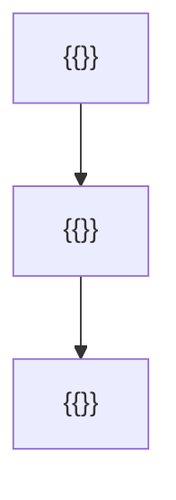
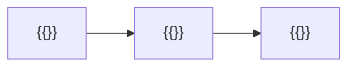

# MASTER PAPER TEMPLATE — v0.4.1 BARE SKELETON (render target only)
**No instructions. No prose. Fill every {{placeholder}}. Rules live in 02 (full version) and 10_SCORING_SPEC.**

```yaml
---
type: axiom_companion
title: "ckg_evaluation: {{clean_title}}"
paper_id: "{{slug_short_hash}}"
paper_uuid: "{{UUIDv4}}"
original_title: "{{original_title}}"
clean_title: "{{clean_title}}"
status: CANDIDATE_DRAFT
canon_status: candidate_draft
semantic_status: ai_analyzed_pending_review
template_version: CKG_RECORD_V2.0.1
taxonomy_ref: "TAG_TAXONOMY_v0.3"
source_file: "{{absolute_path_to_source}}"
source_sha256: {{source_sha256}}
captured_at: {{ISO_8601_timestamp}}
chapter: {{ONE_STORY_key_or_null}}
upstream_hashes: []
downstream_implications: []
content_type: {{ct- tag}}
reader_category: {{rc- tag}}
domain_primary: "{{}}"
domain_primary_pct: {{int}}
domain_secondary: {{null}}
domain_secondary_pct: {{null}}
domain_tertiary: {{null}}
domain_tertiary_pct: {{null}}
series: {{NONE}}
tags: []
tags_weighted:
  - tag: "{{}}"
    weight: {{int}}
framework_keys: []
governing_question: "{{}}"
one_sentence_finding: "{{}}"
claim_ids: []
topic_keys: []
paper_rating: 0
rating_awarded_by: API
evidence_status: CANDIDATE
formal_status: NOT_ESTABLISHED
lean_receipts: []
human_review: {reviewer: null, ruling: null, date: null}
status: candidate
evd_state: UNSCORED
evd_support: 0
evd_counter: 0
evd_balance: null
evd_families: 0
evd_coverage: 0.00
evd_gated: false
evd_stable: null
evd_weakest_claim: ""
evd_unassessed: 0
evd_assessors: []
coherence: null
physical_event: undecided
s01_pos: 0
s01_neg: 0
s01_net: 0
s01_ceiling: 10
s01_rules: []
s02_pos: 0
s02_neg: 0
s02_net: 0
s02_ceiling: 10
s02_rules: []
s03_pos: 0
s03_neg: 0
s03_net: 0
s03_ceiling: 10
s03_rules: []
s04_pos: 0
s04_neg: 0
s04_net: 0
s04_ceiling: 10
s04_rules: []
s05_pos: 0
s05_neg: 0
s05_net: 0
s05_ceiling: 10
s05_rules: []
s06_pos: 0
s06_neg: 0
s06_net: 0
s06_ceiling: 10
s06_rules: []
s07_pos: 0
s07_neg: 0
s07_net: 0
s07_ceiling: 10
s07_rules: []
s08_pos: 0
s08_neg: 0
s08_net: 0
s08_ceiling: 10
s08_rules: []
s09_pos: 0
s09_neg: 0
s09_net: 0
s09_ceiling: 10
s09_rules: []
s10_pos: 0
s10_neg: 0
s10_net: 0
s10_ceiling: 10
s10_rules: []
score_total: 0
score_ceiling: 100
score_class: UNCLASSIFIED
chains_loadbearing: false
chains_honesty: false
integrity_bonus: false
gated: false
build_next: ""
semantic_provider: "{{}}"
semantic_model: "{{}}"
call_routes: []
usage_tokens: {}
score: null
grade: null
canonical_rec: null
run_id: {{}}
processed_date: {{}}
---
```

## SCORECARD

| § | Section | Pos | Neg | Net | Ceiling | Chain |
|---|---------|-----|-----|-----|---------|-------|
| S01 | Classification & Routing | {{}} | {{}} | {{}} | 10 | — |
| S02 | Claim Definition | {{}} | {{}} | {{}} | {{}} | LB |
| S03 | Argument Structure | {{}} | {{}} | {{}} | {{}} | LB |
| S04 | Evidence & Support | {{}} | {{}} | {{}} | {{}} | LB |
| S05 | Objections & Survival | {{}} | {{}} | {{}} | {{}} | HON |
| S06 | Boundaries & Honesty | {{}} | {{}} | {{}} | {{}} | HON |
| S07 | Formal & Math | {{}} | {{}} | {{}} | {{}} | LB |
| S08 | Bridge Integrity | {{}} | {{}} | {{}} | {{}} | HON |
| S09 | Falsifiability & Predictions | {{}} | {{}} | {{}} | {{}} | HON |
| S10 | Audit & Provenance | {{}} | {{}} | {{}} | 10 | — |
| | **TOTAL** | {{}} | {{}} | **{{}}/100** | ceiling {{}} | chains {{}}/2 |

CLASS: {{}} · GATED: {{}} · HARD FAILS: {{}}
Build next: {{}}

---

## S01 · Classification & Routing

| Question | Answer |
|---|---|
| Domain | {{}} |
| Content type | {{}} |
| Reader level | {{}} |
| Series | {{}} |
| framework_keys | {{}} |

> score reasons: {{}}

# {{clean_title}}

> [!success] The Six
>
> | | |
> |---|---|
> | **Claim** | {{}} |
> | **Domain** | {{}} |
> | **Physical event** | {{}} |
> | **Bridge** | {{}} |
> | **What defeats it** | {{}} |
> | **Have / need / breaks if** | {{}} |

> [!important] Verdict
> {{}}

> [!success] At a Glance (expanded)
> {{}}
> `TRANSLATION: DRAFT — NOT REVIEWED`

## S02 · Claim Definition

> [!quote] Central Claim
> {{}}

- **Exact expression (Q0):** {{}}
- **Referent (Q1):** {{}}
- **Identity & distinction (Q2):** {{}}
- **Dependency floor (Q3):** {{}}

## Definitions

| Term | Plain definition | Domain | First used in |
|---|---|---|---|
| {{}} | {{}} | {{}} | {{}} |

## Open the question (Q0–Q14)

> [!quote]+ Q0 · Exact expression
> {{}}
> [!info]+ Q1 · Referent
> {{}}
> [!abstract]+ Q2 · Identity and distinction
> {{}}
> [!warning]+ Q3 · Dependency floor
> {{}}
> [!question]+ Q4 · Variation and invariance
> {{}}
> [!info]+ Q5 · Capabilities and operations
> {{}}
> [!abstract]+ Q6 · Transitions
> {{}}
> [!danger]+ Q7 · Constraints
> {{}}
> [!success]+ Q8 · Consequences and licenses
> {{}}
> [!quote]+ Q9 · Representation ladder
> {{}}
> [!caution]+ Q10 · Preservation and loss
> {{}}
> [!success]+ Q11 · If true
> {{}}
> [!danger]+ Q12 · If false / rivals
> {{}}
> [!warning]+ Q13 · Discriminating checks
> {{}}
> [!important]+ Q14 · Emergent role
> {{}}

### Path to 10

> [!important] Current Rating: +{{}} — Path to +10
>
> | Level | Score | Status | What's needed |
> |---|---|---|---|
> | **Current (API)** | +{{}} | ✅ | — |
> | **API ceiling** | +8 | {{}} | {{}} |
> | **Human review** | +9 | {{}} | {{}} |
> | **Lean receipt** | +10 | {{}} | {{}} |

> score reasons: {{}}

## S03 · Argument Structure

> [!info] System or Model
> {{}}

### Primary argument
1. {{}} `{{ORIGINAL | CLASSICAL:<src> | STANDARD}}`
2. {{}} `{{}}`
3. {{}} `{{}}`
4. {{}} `{{}}`

### Hidden premises
| ID | Hidden premise | Required by | If false, breaks | Blast radius |
|---|---|---|---|---|
| {{PAPER}}-HP001 | {{}} | {{}} | {{}} | {{}} |

### Argument strengthening
| Weak link | Why it's weak | Stronger version | Source for fix |
|---|---|---|---|
| {{}} | {{}} | {{}} | {{}} |

**Supplementary argument 1** — `CLASSICAL: {{}}` 1. {{}} 2. {{}} 3. {{}}

### Argument score assessment
| Metric | Current | Ceiling | Gap | How to close |
|---|---|---|---|---|
| Logical validity | {{}} | valid | {{}} | {{}} |
| Premise strength | {{}} | +8 | {{}} | {{}} |
| Completeness | {{}} | +8 | {{}} | {{}} |
| Originality | {{}} | — | — | {{}} |

### Extracted Truth Predicates
| # | Truth Predicate | Source Role | Modality | Formal form | Warrant |
|---|---|---|---|---|---|
| P1 | {{}} | {{}} | {{}} | {{}} | {{}} |

> Extraction completeness check: {{}} predicates / {{}} paragraphs. Zero-predicate paragraphs: {{}}.

### Terms and plain-language bridge
| Term/symbol | Exact role | Plain meaning | Analogy/example |
|---|---|---|---|
| {{}} | {{}} | {{}} | {{}} |

### Structural Map


> score reasons: {{}}

## S04 · Evidence & Support

## Claims
|ID|Version|Register|Load-bearing|Depends on|Support|Against|Balance|State|
|---|---|---|---|---|---|---|---|---|
|{{PAPER}}-C001|v1|{{}}|{{}}|{{}}|{{}}|{{}}|{{}}|{{}}|

## Evidence ledger
|Family|Cluster|Claim|Dir|Raw|Discr.|Timing|Rival|Assessor|Finding|
|---|---|---|---|---|---|---|---|---|---|
|{{F1}}|{{}}|{{}}|{{}}|{{}}|{{}}|{{}}|{{}}|{{}}|{{}}|

> [!info]- Evidence reasons
> {{}}

## Warrant Control
| Field | Fill |
|---|---|
| **Claim** | {{}} |
| **Evidence** | {{}} |
| **Proof / test** | {{}} |
| Counterevidence | {{}} |
| **Kill condition** | {{}} |
| Assumptions | {{}} |
| **Evidence strength** | {{}} |
| Evidence coverage | {{}} |
| Source independence | {{}} |
| Native grade | {{}} |
| Normalized grade | {{}} |

## Dynamics
| Dynamic | Reading |
|---|---|
| **Coherence** | {{}} |
| Degradation | {{}} |
| Measurement | {{}} |
| Threshold | {{}} |
| **Asymmetry** | {{}} |
| Restoration | {{}} |
| **Counterexample** | {{}} |

> [!warning] Evidence Chain
> **Claim**: {{}} → **Support**: {{}} → **Inference**: {{}} → **Confidence**: {{}} → **Boundary**: {{}}

> [!success] Best Evidence and Sources
> | Type | Content |
> |---|---|
> | **Primary evidence / Formal results** | {{}} |
> | **Secondary interpretation** | {{}} |
> | **Analogy / Bridge** | {{}} |
> | **Citations** | {{}} |

## Coherence & Self-Assessment
> [!abstract] Coherence Score
> {{}}

> score reasons: {{}}

## S05 · Objections & Survival

> [!danger] Strongest Objection and Negative Controls
>
> | | |
> |---|---|
> | **Objection** | {{}} |
> | **Philosophical counter** | {{}} |
> | **Negative control test** | {{}} |

### Counter-models
| Proposed counter-model | Why plausible | Breaking point | Status |
|---|---|---|---|
| {{}} | {{}} | {{}} | {{}} |

> [!success] What Survives
> {{}}

> [!success] Independent AI Review — {{}}
> {{}}

> score reasons: {{}}

## Six-Door Explanatory Lens

> [!quote]+ Human Door
> {{}}
> [!abstract]+ Metaphysical Door
> {{}}
> [!important]+ Theological Door
> {{}}
> [!info]+ Scientific Door
> {{}}
> [!warning]+ Formal Door
> {{}}
> [!question]+ External Reference Door
> {{}}

## S06 · Boundaries & Honesty

> [!caution] What This Does Not Establish
> {{}}

### Explicit boundaries
| ID | Boundary statement | Protects | Source anchor |
|---|---|---|---|
| BND-001 | {{}} | {{}} | {{}} |

> [!warning] Corrections and Revisions
> {{}}
>
> |What held|What broke|What's overstated|Defensible version|Blast radius|
> |---|---|---|---|---|
> |{{}}|{{}}|{{}}|{{}}|{{}}|

### Self-Assessment / Reputation Form
| Dimension | Self-score (0–10) | Justification |
|---|---|---|
| **Argument strength** | {{}} | {{}} |
| **Evidence quality** | {{}} | {{}} |
| **Originality** | {{}} | {{}} |
| **Bridge integrity** | {{}} | {{}} |
| **Formal readiness** | {{}} | {{}} |
| **Clarity / accessibility** | {{}} | {{}} |
| **Scope honesty** | {{}} | {{}} |
| **Kill-condition clarity** | {{}} | {{}} |

**Overall self-grade:** {{}} · **Confidence:** {{}} · **Biggest blind spot:** {{}}

> [!abstract] Implications
>
> | Domain | Implication |
> |---|---|
> | **Formal** | {{}} |
> | **Philosophical** | {{}} |
> | **Empirical** | {{}} |
> | **Semantic** | {{}} |
> | **Theological** | {{}} |

> score reasons: {{}}

## S07 · Formal & Math

### Mathematics
| Object/Equation | Term-by-term | Meaning | Status | Failure mode |
|---|---|---|---|---|
| {{}} | {{}} | {{}} | {{}} | {{}} |

- Dimensional & limiting-case checks: {{}}

> [!info]- Lean / formal checks
> | Proposed theorem or invariant | Visible premises | Status | Reader meaning | Passing establishes |
> |---|---|---|---|---|
> | {{}} | {{}} | {{}} | {{}} | {{}} |

> [!question]- Empirical / literature checks
> {{}}

> [!danger]- Adversarial checks
> {{}}

## Domain checks

> [!info]- Physics — {{}}
> {{}}
> [!quote]- History / testimony — {{}}
> {{}}
> [!important]- Theology — {{}}
> {{}}
> [!abstract]- Philosophy / metaphysics — {{}}
> {{}}
> [!warning]- Mathematics / formal — {{}}
> {{}}
> [!danger]- Cross-domain bridge — {{}}
> {{}}
> [!caution]- Reverse reconstruction B0–B8 — {{}}
> {{}}
> [!question]- Why-closure by level — {{}}
> {{}}
> [!quote]- {{}} excluded, with reasons
> {{}}

> score reasons: {{}}

## S08 · Bridge Integrity

### Bridge registry
| Bridge ID | Source · object | Target · object | Mapping type | Preserved | LOST | Word-gate | Grade | Reverse map | Countermodel |
|---|---|---|---|---|---|---|---|---|---|
| {{PAPER}}-B001 | {{}} | {{}} | {{}} | {{}} | {{}} | {{}} | {{}} | {{}} | {{}} |

### Bridge originality
| Seam (A ↔ B) | Move made | Mapping type | Preserved structure | Provenance | Nearest prior art |
|---|---|---|---|---|---|
| {{}} | {{}} | {{}} | {{}} | {{}} | {{}} |

> score reasons: {{}}

## S09 · Falsifiability & Predictions

### Falsifier registry
| Falsifier ID | Claim | Minimum kill | Status | Blast radius |
|---|---|---|---|---|
| {{PAPER}}-F001 | {{}} | {{}} | {{}} | {{}} |

### Predictions
| Pred ID | Claim | Prediction | Deadline | Check method | Outcome | Logged by | Date |
|---|---|---|---|---|---|---|---|
| {{PAPER}}-P001 | {{}} | {{}} | {{}} | {{}} | {{}} | {{}} | {{}} |

> [!danger] What would make this a 0?
> {{}}

### Explicit uncertainties
| ID | Uncertainty | Affects | Status | Next action |
|---|---|---|---|---|
| U-001 | {{}} | {{}} | {{}} | {{}} |

> [!question] Open Questions and Next Actions
>
> | | |
> |---|---|
> | **Open question** | {{}} |
> | **Next action** | {{}} |
> | **Tangent queue** | {{}} |

> score reasons: {{}}

## S10 · Audit & Provenance

## Audit
> [!danger] Audit Table
>
> |What held|What broke|What's overstated|Defensible version|Blast radius|
> |---|---|---|---|---|
> |{{}}|{{}}|{{}}|{{}}|{{}}|

### Inter-paper dependency map


### Recommended Classification and Relationships
| Relationship | Target |
|---|---|
| supports | {{}} |
| contradicts | {{}} |
| refines | {{}} |
| depends_on | {{}} |
| tests | {{}} |
| supersedes / superseded_by | {{}} |

## Audit appendix
<details>{{verbatim machine audit output}}</details>

> score reasons: {{}}

---

## Evidence dashboard
```dataview
TABLE WITHOUT ID file.link AS Sheet, evd_balance AS Balance, evd_weakest_claim AS "Weakest claim", coherence AS Coherence
WHERE type = "evidence-sheet" AND evd_state = "SCORED" SORT evd_balance ASC
```

---

## Unanswered and not applicable
`Excluded banks: {{}} — {{}}`

## Exact source, untouched
<!-- SHA-256: {{}} -->
{{}}

---

_POF 2828 · not a probability of truth · human ruling required_
