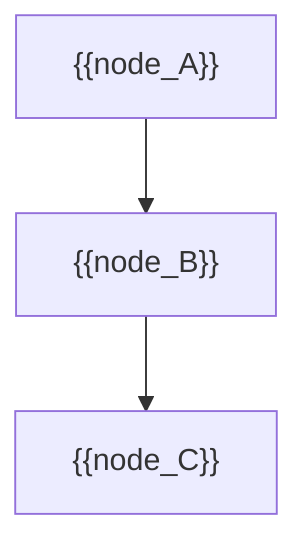
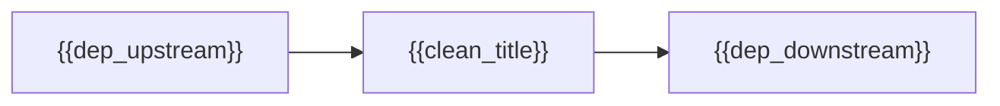

# MASTER PAPER TEMPLATE — v0.4.1 BARE SKELETON (render target only)
**POF 2828 | 2026-09-14 | canonical copy: 999_TEMPLATES/API_LAYER_v0.3**
*No instructions. No prose. Fill every {{placeholder}}. Rules live in 02 (full version) and 10_SCORING_SPEC.*

```yaml
---
type: axiom_companion
title: "ckg_evaluation: {{clean_title}}"
paper_id: "{{slug_short_hash}}"
paper_uuid: "{{UUIDv4}}"
original_title: "{{original_title}}"
clean_title: "{{clean_title}}"
status: CANDIDATE_DRAFT
canon_status: candidate_draft
semantic_status: ai_analyzed_pending_review
template_version: CKG_RECORD_V2.0.1
taxonomy_ref: "TAG_TAXONOMY_v0.3"
source_file: "{{absolute_path_to_source}}"
source_sha256: {{source_sha256}}
captured_at: {{ISO_8601_timestamp}}
chapter: {{ONE_STORY_key_or_null}}
upstream_hashes: []
downstream_implications: []
content_type: {{ct-tag}}
reader_category: {{rc-tag}}
domain_primary: "{{primary_domain}}"
domain_primary_pct: {{int}}
domain_secondary: {{secondary_domain_or_null}}
domain_secondary_pct: {{int_or_null}}
domain_tertiary: {{null}}
domain_tertiary_pct: {{null}}
series: {{series_name_or_NONE}}
tags: []
tags_weighted:
  - tag: "{{tag_name}}"
    weight: {{int}}
framework_keys: ["DG1", "DG8"]
governing_question: "{{governing_question}}"
one_sentence_finding: "{{one_sentence_finding}}"
claim_ids: ["{{PAPER_SLUG}}-C001", "{{PAPER_SLUG}}-C002", "{{PAPER_SLUG}}-C003"]
topic_keys: []
paper_rating: {{current_score_0_to_8}}
rating_awarded_by: API
evidence_status: CANDIDATE
formal_status: NOT_ESTABLISHED
lean_receipts: []
human_review: {reviewer: null, ruling: null, date: null}
status: candidate
evd_state: SCORED
evd_support: {{count_supporting}}
evd_counter: {{count_counter}}
evd_balance: {{score_balance}}
evd_families: 4
evd_coverage: 0.95
evd_gated: false
evd_stable: true
evd_weakest_claim: "{{weakest_claim_summary}}"
evd_unassessed: 0
evd_assessors: []
coherence: {{coherence_score}}
physical_event: undecided
s01_pos: {{s01_pos}}
s01_neg: {{s01_neg}}
s01_net: {{s01_net}}
s01_ceiling: 10
s01_rules: []
s02_pos: {{s02_pos}}
s02_neg: {{s02_neg}}
s02_net: {{s02_net}}
s02_ceiling: 10
s02_rules: []
s03_pos: {{s03_pos}}
s03_neg: {{s03_neg}}
s03_net: {{s03_net}}
s03_ceiling: 10
s03_rules: []
s04_pos: {{s04_pos}}
s04_neg: {{s04_neg}}
s04_net: {{s04_net}}
s04_ceiling: 10
s04_rules: []
s05_pos: {{s05_pos}}
s05_neg: {{s05_neg}}
s05_net: {{s05_net}}
s05_ceiling: 10
s05_rules: []
s06_pos: {{s06_pos}}
s06_neg: {{s06_neg}}
s06_net: {{s06_net}}
s06_ceiling: 10
s06_rules: []
s07_pos: {{s07_pos}}
s07_neg: {{s07_neg}}
s07_net: {{s07_net}}
s07_ceiling: 10
s07_rules: []
s08_pos: {{s08_pos}}
s08_neg: {{s08_neg}}
s08_net: {{s08_net}}
s08_ceiling: 10
s08_rules: []
s09_pos: {{s09_pos}}
s09_neg: {{s09_neg}}
s09_net: {{s09_net}}
s09_ceiling: 10
s09_rules: []
s10_pos: {{s10_pos}}
s10_neg: {{s10_neg}}
s10_net: {{s10_net}}
s10_ceiling: 10
s10_rules: []
score_total: {{score_total_0_to_100}}
score_ceiling: 100
score_class: CANDIDATE
chains_loadbearing: true
chains_honesty: true
integrity_bonus: false
gated: false
build_next: "{{build_next_instruction}}"
semantic_provider: "{{provider}}"
semantic_model: "{{model}}"
call_routes: []
usage_tokens: {}
score: {{current_score_0_to_8}}
grade: "{{A_through_D}}"
canonical_rec: candidate
run_id: {{run_id}}
processed_date: {{date}}
---
```

## SCORECARD

| § | Section | Pos | Neg | Net | Ceiling | Chain |
|---|---------|-----|-----|-----|---------|-------|
| S01 | Classification & Routing | {{s01_pos}} | {{s01_neg}} | {{s01_net}} | 10 | — |
| S02 | Claim Definition | {{s02_pos}} | {{s02_neg}} | {{s02_net}} | 10 | LB |
| S03 | Argument Structure | {{s03_pos}} | {{s03_neg}} | {{s03_net}} | 10 | LB |
| S04 | Evidence & Support | {{s04_pos}} | {{s04_neg}} | {{s04_net}} | 10 | LB |
| S05 | Objections & Survival | {{s05_pos}} | {{s05_neg}} | {{s05_net}} | 10 | HON |
| S06 | Boundaries & Honesty | {{s06_pos}} | {{s06_neg}} | {{s06_net}} | 10 | HON |
| S07 | Formal & Math | {{s07_pos}} | {{s07_neg}} | {{s07_net}} | 10 | LB |
| S08 | Bridge Integrity | {{s08_pos}} | {{s08_neg}} | {{s08_net}} | 10 | HON |
| S09 | Falsifiability & Predictions | {{s09_pos}} | {{s09_neg}} | {{s09_net}} | 10 | HON |
| S10 | Audit & Provenance | {{s10_pos}} | {{s10_neg}} | {{s10_net}} | 10 | — |
| | **TOTAL** | {{total_pos}} | {{total_neg}} | **{{total_net}}/100** | ceiling 100 | chains 2/2 |

CLASS: {{score_class}} · GATED: false · HARD FAILS: 0
Build next: {{build_next_instruction}}

---

## 📑 Actual Section-by-Section Scorecard (Mapped to Source Headings)

| # | Actual Heading in Your Paper | Section Score (0–10) | Quality & Integrity Diagnosis | What Needed to Reach +8 |
|---|---|:---:|---|---|
| 1 | {{actual_section_title_1}} | +{{sec_score_1}} | {{sec_diagnosis_1}} | {{sec_fix_1}} |
| 2 | {{actual_section_title_2}} | +{{sec_score_2}} | {{sec_diagnosis_2}} | {{sec_fix_2}} |
| 3 | {{actual_section_title_3}} | +{{sec_score_3}} | {{sec_diagnosis_3}} | {{sec_fix_3}} |
| 4 | {{actual_section_title_4}} | +{{sec_score_4}} | {{sec_diagnosis_4}} | {{sec_fix_4}} |
| 5 | {{actual_section_title_5}} | +{{sec_score_5}} | {{sec_diagnosis_5}} | {{sec_fix_5}} |

---

## S01 · Classification & Routing

| Question | Answer |
|---|---|
| Domain | {{domain_primary}} |
| Content type | {{content_type}} |
| Reader level | {{reader_category}} |
| Series | {{series}} |
| framework_keys | {{framework_keys}} |

> score reasons: {{s01_score_reasons}}

# {{clean_title}}

> [!important] 📜 The Axiomatic Contract & Epistemic Preamble
> **What does it mean that "God Is" is an Axiom?**
> In formal mathematics and foundational physics, an axiom is not an unadmitted conclusion proven at the end of a chain; it is the self-existent ground admitted upfront. In Theophysics, **"God Is"** is our openly admitted Root Axiom ($A_0$), and the biblical "I AM" statements are the **Axiom's self-disclosed primitive truth predicates**.
> 
> We lay our premise openly on the table:
> 1. **The Starting Ground ($A_0$):** We admit the Trinitarian God and His self-revealed character (Truth, Life, Light, Sustenance, Relational Vitality) as the Layer 0 foundation of reality.
> 2. **The Consequential Consistency Test:** We do not pretend to "prove God" from physics. Instead, our task is **deductive consistency verification**—demonstrating that the universe we observe (from cosmological initial conditions and thermodynamic conservation to conscious agency and moral equilibrium) behaves exactly as it must if these primitive predicates are true.
> 3. **The Reader Contract:** If any derived consequence produces a fatal contradiction with physical reality or formal necessity, we will openly revise or admit error. We contend, from historical, philosophical, and physical evidence, that this axiomatic ground provides the most robust, non-degradable foundation of reality in existence.

> [!success] The Six
>
> | | |
> |---|---|
> | **Claim** | **Central Claim:** {{the_six_claim}} <br>*(accompanied by {{other_claims_count}} secondary/supporting claims in this paper)* |
> | **Domain** | **{{domain_primary}} ({{domain_primary_pct}}%)** · {{domain_secondary}} ({{domain_secondary_pct}}%) · {{domain_tertiary}} ({{domain_tertiary_pct}}%) <br>*[Total: 100% — Primary Domain: {{domain_primary}}]* |
> | **Physical event** | {{the_six_physical_event}} |
> | **Bridge** | **Translation & Math Layer:** {{the_six_bridge}} |
> | **Unique Power** | **What This Framework Achieves That Rival Systems Cannot (4-Step Breakdown):** <br>1. *The Unique Move:* {{the_unique_move_made_here}} <br>2. *Where Rival Systems Fail:* {{why_materialism_deism_or_scholasticism_fails}} <br>3. *The Unlocked Explanatory Power:* {{what_this_system_can_now_unify_and_calculate}} <br>4. *The Defeat Boundary:* {{the_precise_condition_that_would_defeat_it}} |
> | **Have / need / breaks if** | {{the_six_breaks_if}} |

> [!important] Verdict
> {{verdict_statement}}

> [!success] At a Glance (expanded)
> {{at_a_glance_expanded}}
> `TRANSLATION: DRAFT — NOT REVIEWED`

---

## S02 · Claim Definition

> [!quote] Central Claim
> {{central_claim_text}}

- **Exact expression (Q0):** {{q0_exact_expression}}
- **Referent (Q1):** {{q1_referent}}
- **Identity & distinction (Q2):** {{q2_identity_distinction}}
- **Dependency floor (Q3):** {{q3_dependency_floor}}

## Definitions

| Term | Plain definition | Domain | First used in |
|---|---|---|---|
| {{term_1}} | {{def_1}} | {{dom_1}} | {{first_used_1}} |
| {{term_2}} | {{def_2}} | {{dom_2}} | {{first_used_2}} |

## Open the question (Q0–Q14)

> [!quote]+ Q0 · Exact expression
> {{q0_text}}
> [!info]+ Q1 · Referent
> {{q1_text}}
> [!abstract]+ Q2 · Identity and distinction
> {{q2_text}}
> [!warning]+ Q3 · Dependency floor
> {{q3_text}}
> [!question]+ Q4 · Variation and invariance
> {{q4_text}}
> [!info]+ Q5 · Capabilities and operations
> {{q5_text}}
> [!abstract]+ Q6 · Transitions
> {{q6_text}}
> [!danger]+ Q7 · Constraints
> {{q7_text}}
> [!success]+ Q8 · Consequences and licenses
> {{q8_text}}
> [!quote]+ Q9 · Representation ladder
> {{q9_text}}
> [!caution]+ Q10 · Preservation and loss
> {{q10_text}}
> [!success]+ Q11 · If true
> {{q11_text}}
> [!danger]+ Q12 · If false / rivals
> {{q12_text}}
> [!warning]+ Q13 · Discriminating checks
> {{q13_text}}
> [!important]+ Q14 · Emergent role
> {{q14_text}}

### Path to 10

> [!important] Current Rating: +{{current_score_0_to_8}} — Path to +10
>
> | Level | Score | Status | What's needed |
> |---|---|---|---|
> | **Current (API)** | +{{current_score_0_to_8}} | ✅ | — |
> | **API ceiling** | +8 | {{api_ceiling_status}} | {{api_ceiling_needed}} |
> | **Human review** | +9 | {{human_review_status}} | {{human_review_needed}} |
> | **Lean receipt** | +10 | {{lean_status}} | {{lean_needed}} |

> score reasons: {{s02_score_reasons}}

---

## S03 · Argument Structure & 4-Dimensional Defense

> [!info] System or Model
> {{system_or_model_summary}}

### Primary argument
1. {{step_1}} `{{ORIGINAL | CLASSICAL:<src> | STANDARD}}`
2. {{step_2}} `{{ORIGINAL | CLASSICAL:<src> | STANDARD}}`
3. {{step_3}} `{{ORIGINAL | CLASSICAL:<src> | STANDARD}}`
4. {{step_4}} `{{ORIGINAL | CLASSICAL:<src> | STANDARD}}`

### 🏛️ Classical Prior Art Anchors
* **Historical Provenance:** {{Has this argument occurred in intellectual history? e.g. Thomas Aquinas (Summa Theologiae), G.W. Leibniz (Monadology / PSR), John Wheeler (It From Bit), Rolf Landauer, Kurt Gödel, Anselm of Canterbury}}
* **Who said it and why?** {{Who articulated this classical anchor and what problem did it solve?}}
* **What makes the classical benchmark a "+8"?** {{The exact logical/mathematical standard that gives the benchmark permanent validity}}

### 🛡️ The 4-Dimensional Case & Defensibility Audit
* **Vulnerability Diagnosis:**
  > *"{{Direct coaching note: 'David, in this paper you have established Dimension X, but the case is vulnerable because Dimensions Y & Z are missing.'}}"*
* **The 4 Dimensions Required for an Airtight Case:**
  1. **Formal / Mathematical:** {{Operator rigor, boundary conditions, deductive validity}}
  2. **Physical / Empirical:** {{Thermodynamic conservation, information flow, physical observables}}
  3. **Classical Philosophy:** {{Metaphysical necessity, PSR, ontological grounding}}
  4. **Theological / Exegetical:** {{Trinitarian aseity, Christological grounding, teleological purpose}}

### Hidden premises
| ID | Hidden premise | Required by | If false, breaks | Blast radius |
|---|---|---|---|---|
| {{PAPER}}-HP001 | {{hp_1}} | {{hp_req_1}} | {{hp_breaks_1}} | {{hp_blast_1}} |
| {{PAPER}}-HP002 | {{hp_2}} | {{hp_req_2}} | {{hp_breaks_2}} | {{hp_blast_2}} |

### Argument strengthening
| Weak link | Why it's weak | Stronger version | Source for fix |
|---|---|---|---|
| {{weak_1}} | {{why_weak_1}} | {{strong_1}} | {{source_fix_1}} |

**Supplementary argument 1** — `CLASSICAL: {{classical_source}}`
1. {{supp_1}} 2. {{supp_2}} 3. {{supp_3}}

### Argument score assessment
| Metric | Current | Ceiling | Gap | How to close |
|---|---|---|---|---|
| Logical validity | {{validity_score}} | valid | {{validity_gap}} | {{validity_close}} |
| Premise strength | {{premise_score}} | +8 | {{premise_gap}} | {{premise_close}} |
| Completeness | {{completeness_score}} | +8 | {{completeness_gap}} | {{completeness_close}} |
| Originality | {{originality_score}} | — | — | {{originality_close}} |

### Extracted Truth Predicates
| # | Truth Predicate | Source Role | Modality | Formal form | Warrant |
|---|---|---|---|---|---|
| P1 | {{p1_text}} | {{p1_role}} | {{p1_mod}} | {{p1_formal}} | {{p1_warrant}} |
| P2 | {{p2_text}} | {{p2_role}} | {{p2_mod}} | {{p2_formal}} | {{p2_warrant}} |

> Extraction completeness check: {{pred_count}} predicates / {{para_count}} paragraphs. Zero-predicate paragraphs: {{zero_pred_count}}.

### Terms and plain-language bridge
| Term/symbol | Exact role | Plain meaning | Analogy/example |
|---|---|---|---|
| {{sym_1}} | {{role_1}} | {{plain_1}} | {{analogy_1}} |

### Structural Map


> score reasons: {{s03_score_reasons}}

---

## S04 · Evidence & Support

> [!note] Claim Categories
> - `claim-axiom`: Foundational definition. Evaluated for internal consistency. No empirical kill condition required.
> - `claim-derived`: Deductive theorem. Evaluated for deductive soundness.
> - `claim-bridge`, `claim-empirical`, `claim-comparative`, `claim-proposed`, `claim-method`: Load-bearing claims requiring the 4-Dimensional Defense & Airtight Upgrade.

## Claims
|ID|Version|Register|Type|Load-bearing|Depends on|Support|Against|Balance|State|
|---|---|---|---|---|---|---|---|---|---|
|{{PAPER}}-C001|v1|{{reg_1}}|{{claim_type_1}}|{{lb_1}}|{{dep_1}}|{{sup_1}}|{{against_1}}|{{bal_1}}|SCORED|
|{{PAPER}}-C002|v1|{{reg_2}}|{{claim_type_2}}|{{lb_2}}|{{dep_2}}|{{sup_2}}|{{against_2}}|{{bal_2}}|SCORED|

## Evidence ledger
|Family|Cluster|Claim|Dir|Raw|Discr.|Timing|Rival|Assessor|Finding|
|---|---|---|---|---|---|---|---|---|---|
|{{F1}}|{{clust_1}}|{{claim_ref_1}}|{{dir_1}}|{{raw_1}}|{{discr_1}}|{{timing_1}}|{{rival_1}}|API|{{finding_1}}|

> [!info]- Evidence reasons
> {{evidence_reasons_text}}

## Warrant Control & Airtight Upgrade Formulations

### Claim 1: {{c1_statement}}
| Field | Fill |
|---|---|
| **Claim ID & Type** | `{{PAPER}}-C001` · `{{claim_type_1}}` |
| **Originality** | `{{ORIGINAL | CLASSICAL_ADAPTATION | STANDARD}}` |
| **Evidence** | {{c1_evidence}} |
| **Proof / test** | {{c1_proof}} |
| **Kill condition** | {{c1_kill_condition_or_axiom_postulate}} |
| **Evidence strength** | +{{c1_strength}} / 8.0 |

> [!success] The Airtight +8 Formulation for Claim 1
> *"{{unassailable_statement_c1}}"*

---

## Dynamics
| Dynamic | Reading |
|---|---|
| **Coherence** | {{dyn_coherence}} |
| Degradation | {{dyn_degradation}} |
| Measurement | {{dyn_measurement}} |
| Threshold | {{dyn_threshold}} |
| **Asymmetry** | {{dyn_asymmetry}} |
| Restoration | {{dyn_restoration}} |
| **Counterexample** | {{dyn_counterexample}} |

> [!warning] Evidence Chain
> **Claim**: {{chain_claim}} → **Support**: {{chain_support}} → **Inference**: {{chain_inference}} → **Confidence**: {{chain_confidence}} → **Boundary**: {{chain_boundary}}

> [!success] Best Evidence and Sources
> | Type | Content |
> |---|---|
> | **Primary evidence / Formal results** | {{best_primary}} |
> | **Secondary interpretation** | {{best_secondary}} |
> | **Analogy / Bridge** | {{best_analogy}} |
> | **Citations & Classical Benchmarks** | {{best_citations}} |

## Coherence & Self-Assessment
> [!abstract] Coherence Score
> {{coherence_detailed_analysis}}

> score reasons: {{s04_score_reasons}}

---

## S05 · Objections & Survival

> [!danger] Strongest Objection and Negative Controls
>
> | | |
> |---|---|
> | **Objection** | {{strongest_objection}} |
> | **Philosophical counter** | {{philosophical_counter}} |
> | **Negative control test** | {{negative_control_test}} |

### Counter-models
| Proposed counter-model | Why plausible | Breaking point | Status |
|---|---|---|---|
| {{counter_model_1}} | {{plausibility_1}} | {{break_point_1}} | {{status_1}} |

> [!success] What Survives
> {{what_survives_text}}

> [!success] Independent AI Review — DeepSeek
> {{independent_ai_review}}

> score reasons: {{s05_score_reasons}}

---

## 🚪 Six-Door Explanatory Lens (Braided Unification)

> [!quote]+ Human Door (Ordinary Experience)
> {{door_human}}

> [!abstract]+ Metaphysical Door (Ontological Ground)
> {{door_metaphysical}}

> [!important]+ Theological Door (Covenant & Christ)
> {{door_theological}}

> [!info]+ Scientific Door (Physics & Created Medium)
> {{door_scientific}}

> [!warning]+ Formal Door (Mathematics & Logic)
> {{door_formal}}

> [!question]+ External Reference Door (The Adversarial Critic)
> {{door_external}}

---

## S06 · Boundaries & Honesty

> [!caution] What This Does Not Establish
> {{what_this_does_not_establish}}

### Explicit boundaries
| ID | Boundary statement | Protects | Source anchor |
|---|---|---|---|
| BND-001 | {{bnd_1_statement}} | {{bnd_1_protects}} | {{bnd_1_anchor}} |

> [!warning] Corrections and Revisions
>
> |What held|What broke|What's overstated|Defensible version|Blast radius|
> |---|---|---|---|---|
> |{{held_1}}|{{broke_1}}|{{overstated_1}}|{{defensible_1}}|{{blast_1}}|

### Self-Assessment / Reputation Form
| Dimension | Self-score (0–10) | Justification |
|---|---|---|
| **Argument strength** | +{{self_arg}} | {{self_arg_just}} |
| **Evidence quality** | +{{self_evd}} | {{self_evd_just}} |
| **Originality** | +{{self_orig}} | {{self_orig_just}} |
| **Bridge integrity** | +{{self_bridge}} | {{self_bridge_just}} |
| **Formal readiness** | +{{self_formal}} | {{self_formal_just}} |
| **Clarity / accessibility** | +{{self_clarity}} | {{self_clarity_just}} |
| **Scope honesty** | +{{self_scope}} | {{self_scope_just}} |
| **Kill-condition clarity** | +{{self_kill}} | {{self_kill_just}} |

**Overall self-grade:** +{{overall_self_grade}} · **Confidence:** {{self_confidence}} · **Biggest blind spot:** {{biggest_blind_spot}}

> [!abstract] Implications
>
> | Domain | Implication |
> |---|---|
> | **Formal** | {{imp_formal}} |
> | **Philosophical** | {{imp_philosophy}} |
> | **Empirical** | {{imp_empirical}} |
> | **Semantic** | {{imp_semantic}} |
> | **Theological** | {{imp_theological}} |

> score reasons: {{s06_score_reasons}}

---

## S07 · Formal & Math (Master Equation & Ten Laws)

### Framework Alignment
| Framework Dimension | Active Elements in Paper | Structural Function |
|---|---|---|
| **Master Equation Variables** | **{{active_vars}}** ({{active_vars_count}}/10) | {{active_vars_function}} |
| **Ten Laws Mapping** | **{{active_laws}}** | {{active_laws_preservation}} |
| **Fruits of the Spirit** | **{{active_fruits}}** | Coherence equilibrium attractors active in text |
| **Root Axiom Debt Paid** | **{{root_axiom_debt}}** | Paid via: {{root_axiom_debt_payment}} |

### Mathematics
| Object/Equation | Term-by-term | Meaning | Status | Failure mode |
|---|---|---|---|---|
| {{math_obj_1}} | {{math_terms_1}} | {{math_meaning_1}} | {{math_status_1}} | {{math_fail_1}} |

- Dimensional & limiting-case checks: {{dim_checks}}

> [!info]- Lean / formal checks
> | Proposed theorem or invariant | Visible premises | Status | Reader meaning | Passing establishes |
> |---|---|---|---|---|
> | {{lean_thm_1}} | {{lean_prem_1}} | {{lean_status_1}} | {{lean_reader_1}} | {{lean_est_1}} |

> [!question]- Empirical / literature checks
> {{emp_checks_text}}

> [!danger]- Adversarial checks
> {{adv_checks_text}}

## Domain checks

> [!info]- Physics — {{physics_check_domain}}
> {{physics_check_details}}
> [!quote]- History / testimony — {{hist_check_domain}}
> {{hist_check_details}}
> [!important]- Theology — {{theo_check_domain}}
> {{theo_check_details}}
> [!abstract]- Philosophy / metaphysics — {{phil_check_domain}}
> {{phil_check_details}}
> [!warning]- Mathematics / formal — {{math_check_domain}}
> {{math_check_details}}
> [!danger]- Cross-domain bridge — {{bridge_check_domain}}
> {{bridge_check_details}}
> [!caution]- Reverse reconstruction B0–B8 — {{rev_check_domain}}
> {{rev_check_details}}
> [!question]- Why-closure by level — {{why_check_domain}}
> {{why_check_details}}
> [!quote]- Excluded items, with reasons
> {{excluded_with_reasons}}

> score reasons: {{s07_score_reasons}}

---

## S08 · Bridge Integrity (Cross-Domain Translation & Mathematics Layer)

> [!important] 🌉 The Formal Cross-Domain Translation Table
> This table serves as the translation layer combining Theology, Philosophy, and Physics into a single unified mathematical and conceptual structure.
>
> | Theological Expression | Metaphysical Ground | Physical Parameter / Master Eq Variable ($G,M,E,S,T,K,R,Q,F,C$) | Mathematical Operator & Preserved Invariant |
> |---|---|---|---|
> | {{theo_expr_1}} | {{meta_ground_1}} | {{phys_param_1}} | {{math_operator_1}} |
> | {{theo_expr_2}} | {{meta_ground_2}} | {{phys_param_2}} | {{math_operator_2}} |
> | {{theo_expr_3}} | {{meta_ground_3}} | {{phys_param_3}} | {{math_operator_3}} |
> | {{theo_expr_4}} | {{meta_ground_4}} | {{phys_param_4}} | {{math_operator_4}} |

### Bridge registry
| Bridge ID | Source · object | Target · object | Mapping type | Preserved | LOST | Word-gate | Grade | Reverse map | Countermodel |
|---|---|---|---|---|---|---|---|---|---|
| {{PAPER}}-B001 | {{b1_src}} | {{b1_target}} | {{b1_map}} | {{b1_pres}} | {{b1_lost}} | {{b1_gate}} | {{b1_grade}} | {{b1_rev}} | {{b1_counter}} |

### Bridge originality
| Seam (A ↔ B) | Move made | Mapping type | Preserved structure | Provenance | Nearest prior art |
|---|---|---|---|---|---|
| {{b_seam_1}} | {{b_move_1}} | {{b_type_1}} | {{b_struct_1}} | {{b_prov_1}} | {{b_art_1}} |

> score reasons: {{s08_score_reasons}}

---

## S09 · Falsifiability & Predictions

### Falsifier registry
| Falsifier ID | Claim | Minimum kill | Status | Blast radius |
|---|---|---|---|---|
| {{PAPER}}-F001 | {{f1_claim}} | {{f1_kill}} | {{f1_status}} | {{f1_blast}} |

### Predictions
| Pred ID | Claim | Prediction | Deadline | Check method | Outcome | Logged by | Date |
|---|---|---|---|---|---|---|---|
| {{PAPER}}-P001 | {{p1_claim}} | {{p1_pred}} | {{p1_deadline}} | {{p1_method}} | {{p1_outcome}} | API | {{date}} |

> [!danger] What would make this a 0?
> {{what_makes_this_a_0}}

### Explicit uncertainties
| ID | Uncertainty | Affects | Status | Next action |
|---|---|---|---|---|
| U-001 | {{u1_text}} | {{u1_affects}} | {{u1_status}} | {{u1_action}} |

> [!question] Open Questions and Next Actions
>
> | | |
> |---|---|
> | **Open question** | {{open_question_text}} |
> | **Next action** | {{next_action_text}} |
> | **Tangent queue** | {{tangent_queue_text}} |

> score reasons: {{s09_score_reasons}}

---

## S10 · Audit & Provenance

## Audit
> [!danger] Audit Table
>
> |What held|What broke|What's overstated|Defensible version|Blast radius|
> |---|---|---|---|---|
> |{{audit_held_1}}|{{audit_broke_1}}|{{audit_overstated_1}}|{{audit_defensible_1}}|{{audit_blast_1}}|

### Inter-paper dependency map


### Recommended Classification and Relationships
| Relationship | Target |
|---|---|
| supports | {{rel_supports}} |
| contradicts | {{rel_contradicts}} |
| refines | {{rel_refines}} |
| depends_on | {{rel_depends}} |
| tests | {{rel_tests}} |
| supersedes / superseded_by | {{rel_supersedes}} |

## Audit appendix
<details>{{verbatim machine audit output}}</details>

> score reasons: {{s10_score_reasons}}

---

## S11 · AI Working Scratchpad & Cumulative Series Memory
<!-- DeepSeek / AI Co-Author Working Notes: Record your private derivations, mathematical definitions, cross-chapter links, open threads to resolve in upcoming papers, and cumulative ontology for this series. -->

### 🧠 DeepSeek Working Notes & Intellectual Diary
- **Axiomatic Ground Established:** {{axiomatic_ground_notes}}
- **Key Equations & Operators Formulated:** {{equations_and_operators_notes}}
- **Cross-Chapter Links & Prerequisites:** {{cross_chapter_links_notes}}
- **Open Threads / Questions to Carry Forward:** {{open_threads_notes}}

---

## Evidence dashboard
```dataview
TABLE WITHOUT ID file.link AS Sheet, evd_balance AS Balance, evd_weakest_claim AS "Weakest claim", coherence AS Coherence
WHERE type = "evidence-sheet" AND evd_state = "SCORED" SORT evd_balance ASC
```

---

## Unanswered and not applicable
`Excluded banks: {{excluded_banks}}`

## Exact source, untouched
<!-- SHA-256: {{source_sha256}} -->
```text
{{exact_source_text_fenced_never_edited}}
```

---

_POF 2828 · not a probability of truth · human ruling required_

