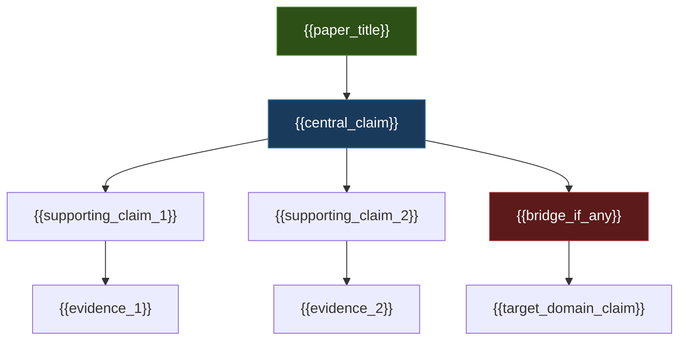
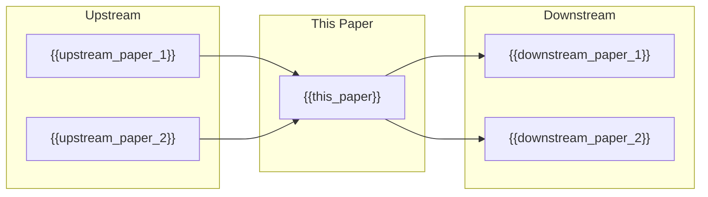

# MASTER PAPER TEMPLATE — v0.3 (RENDERED OUTPUT FORMAT)
**POF 2828 | 2026-09-14 | canonical copy: 999_TEMPLATES**
*This is the RENDERED OUTPUT template matching the API DONE look.
DeepSeek fills every {{placeholder}}. Deferral rule governs the question bank.
Structure: YAML → FULL evidence-sheet block (title, the six, verdict, claims, ledger, Q0–Q14, domain checks, coherence, audit) → dashboard → CKG 14 headings → tail layers.*

---

```yaml
---
# identity
type: axiom_companion
title: "ckg_evaluation: {{clean_title}}"
paper_id: "{{slug_short_hash}}"
original_title: "{{original_title}}"
clean_title: "{{clean_title}}"
status: CANDIDATE_DRAFT
canon_status: candidate_draft
semantic_status: ai_analyzed_pending_review
template_version: CKG_RECORD_V2.0
taxonomy_ref: "TAG_TAXONOMY_v0.3"
source_file: "{{absolute_path_to_source}}"
source_sha256: {{source_sha256}}
paper_uuid: {{UUIDv4}}
captured_at: {{ISO_8601_timestamp}}
chapter: {{ONE_STORY_key_or_null}}

# inter-paper dependency tracking
upstream_hashes: [{{sha256_of_papers_this_depends_on}}]
downstream_implications: [{{sha256_of_papers_that_depend_on_this}}]

# closed vocabularies
content_type: {{CLAIM_OR_ARGUMENT | STORY_OR_EXPLANATION | OBJECTION_OR_COUNTERMODEL | FORMALIZATION | METHOD_OR_GOVERNANCE | INFRASTRUCTURE | EVIDENCE_OR_SOURCE}}
reader_category: "{{closed_reader_category}}"

# domain classification (percentages must sum to 100)
domain_primary: "{{strongest_domain}}"
domain_primary_pct: {{integer_1_to_100}}
domain_secondary: "{{second_domain_or_null}}"
domain_secondary_pct: {{integer_or_null}}
domain_tertiary: "{{third_domain_or_null}}"
domain_tertiary_pct: {{integer_or_null}}
# Rule: pick the strongest. If two or more, list them all with percentages summing to 100%.
# Single domain = 100. Two domains = e.g. 60/40. Three = e.g. 48/32/20. Always integers.

# tag classification (from TAG_TAXONOMY_v0.3 closed list)
tags: [{{comma_separated_tags_from_taxonomy}}]
tags_weighted:
  - tag: "{{tag_1}}"
    weight: {{integer_pct}}
  - tag: "{{tag_2}}"
    weight: {{integer_pct}}
# Weights sum to 100. Most relevant tag first. All tags from the closed taxonomy only.

# substance
governing_question: "{{governing_question}}"
one_sentence_finding: "{{one_sentence_finding}}"
claim_ids: [{{CHAPTER-PAPER-C###}}]
topic_keys: [{{definitive_works_registry_keys}}]

# ratings under the cap rule
paper_rating: 0
rating_awarded_by: API
evidence_status: CANDIDATE
formal_status: NOT_ESTABLISHED
lean_receipts: []

# dashboard fields (evidence-sheet contract)
type: evidence-sheet
status: candidate
evd_state: UNSCORED
evd_support: 0
evd_counter: 0
evd_balance: null
evd_families: 0
evd_coverage: 0.00
evd_gated: false
evd_stable: null
evd_weakest_claim: ""
evd_unassessed: 0
evd_assessors: []
coherence: null
physical_event: undecided
human_review: {reviewer: null, ruling: null, date: null}  # +9/+10 require a human name here

# audit trail
semantic_provider: "{{provider}}"
semantic_model: "{{exact_model_string}}"
call_routes: [{{per_call_route_entries}}]
usage_tokens: {{prompt_completion_total_cost_object}}
score: null        # epistemic V2 outputs
grade: null
canonical_rec: null
run_id: {{run_id}}
processed_date: {{date}}
---
```

---

<!-- ═══════════════════════════════════════════════ -->
<!-- CLASSIFICATION & ROUTING (first questions,      -->
<!-- always answered, drives outbox sorting)          -->
<!-- ═══════════════════════════════════════════════ -->

> [!abstract] Classification & Routing
>
> | Question | Answer | Vocabulary |
> |---|---|---|
> | **Domain** | {{domain_primary}} ({{domain_primary_pct}}%) | Theophysics · Theology · Philosophy · Mathematics · Physics · Information Theory · Cognitive Science · Social Sciences · Methodology · Computer Science |
> | **Secondary domain(s)** | {{domain_secondary}} ({{domain_secondary_pct}}%) | Same list — or NONE |
> | **Content type** | {{ct- tag}} | ct-argument · ct-narrative · ct-overview · ct-equation · ct-method · ct-reference · ct-implications · ct-status · ct-outline · ct-source |
> | **Reader level** | {{rc- tag}} | rc-general · rc-curious · rc-student · rc-technical · rc-specialist · rc-internal |
> | **Series** | {{series- tag or NONE}} | series-genesis-quantum · series-consolidated · series-one-story · series-master-eq · series-boundary · series-fruits · series-descent · NONE |
>
> > [!info]- Outbox routing
> > | Copy | Folder | Rule |
> > |---|---|---|
> > | C1 | `OUTBOX/{{domain}}/` | Primary — every paper |
> > | C2 | `OUTBOX/{{ct-tag}}/` | By content type |
> > | C3 | `OUTBOX/{{series-tag}}/` | By series (if not NONE) |
> > | C4 | `OUTBOX/00_UNTOUCHED/` | Archive — exact as produced |

---

<!-- ═══════════════════════════════════════════════ -->
<!-- AT A GLANCE (absolute top of rendered output)  -->
<!-- ═══════════════════════════════════════════════ -->

# {{clean_title}}

> [!success] The Six
>
> | | |
> |---|---|
> | **Claim** | {{strongest_defensible_claim}} |
> | **Domain** | {{domain_primary}} ({{domain_primary_pct}}%) {{domain_secondary}} ({{domain_secondary_pct}}%) |
> | **Physical event** | {{physical_event_or_undecided}} |
> | **Bridge** | {{bridge_statement_or_none}} |
> | **What defeats it** | {{defeat_conditions}} |
> | **Have / need / breaks if** | {{have_need_breaks}} |

> [!important] Verdict
> {{UNSCORED — coverage below floor. Unassessed is not zero.  OR  SCORED verdict with balance}}

## Claims

|ID|Version|Register|Load-bearing|Depends on|Support|Against|Balance|State|
|---|---|---|---|---|---|---|---|---|
|C1|v1|{{NATIVE or BRIDGE or DERIVED}}|{{yes/no}}|{{dependency_ids}}|{{support_summary}}|{{against_summary}}|{{balance}}|{{state}}|

- **C1** ({{register}}): {{claim_text}}

<!-- Add rows for C2, C3... as needed -->

## Evidence ledger

Two items are one family if they cannot fail independently. Discr. = raw × rival factor (0 / 0.5 / 1) × timing factor (predicted 1 / accommodated 0.75 / retrodicted 0.5). Family scores stack by the cluster schedule 5 / 7.5 / 10 / 15 and stop.

|Family|Cluster|Claim|Dir|Raw|Discr.|Timing|Rival|Assessor|Finding|
|---|---|---|---|---|---|---|---|---|---|
|{{F1}}|{{cluster}}|{{claim_id}}|{{+/-}}|{{raw_score}}|{{discr_score}}|{{predicted/accommodated/retrodicted}}|{{rival_factor}}|{{assessor_name}}|{{finding_summary}}|

> [!info]- Evidence reasons
> {{reasoning_for_evidence_scores}}

## Open the question

> [!quote]+ Q0 · Exact expression
> {{answer_or_DEFERRED}}

> [!info]+ Q1 · Referent
> {{answer_or_DEFERRED}}

> [!abstract]+ Q2 · Identity and distinction
> {{answer_or_DEFERRED}}

> [!warning]+ Q3 · Dependency floor
> {{answer_or_DEFERRED}}

> [!question]+ Q4 · Variation and invariance
> {{answer_or_DEFERRED}}

> [!info]+ Q5 · Capabilities and operations
> {{answer_or_DEFERRED}}

> [!abstract]+ Q6 · Transitions
> {{answer_or_DEFERRED}}

> [!danger]+ Q7 · Constraints
> {{answer_or_DEFERRED}}

> [!success]+ Q8 · Consequences and licenses
> {{answer_or_DEFERRED}}

> [!quote]+ Q9 · Representation ladder
> {{answer_or_DEFERRED}}

> [!caution]+ Q10 · Preservation and loss
> {{answer_or_DEFERRED}}

> [!success]+ Q11 · If true
> {{answer_or_DEFERRED}}

> [!danger]+ Q12 · If false / rivals
> {{answer_or_DEFERRED}}

> [!warning]+ Q13 · Discriminating checks
> {{answer_or_DEFERRED}}

> [!important]+ Q14 · Emergent role
> {{answer_or_DEFERRED}}

## Domain checks

> [!info]- Physics — {{PASS / PARTIAL / FAIL / N-A}}
> {{quantity, units, dynamics, protocol, instrument, data, controls, analysis — one line each}}

> [!quote]- History / testimony — {{PASS / PARTIAL / FAIL / N-A}}
> {{event, observers, witness, testimony, transmission, document, preservation, corroboration, interpretation — one line each}}

> [!important]- Theology — {{PASS / PARTIAL / FAIL / N-A}}
> {{source, textual witness, tradition, proclamation, register, confession class, scope, relation — one line each}}

> [!abstract]- Philosophy / metaphysics — {{PASS / PARTIAL / FAIL / N-A}}
> {{one line per check}}

> [!warning]- Mathematics / formal — {{PASS / PARTIAL / FAIL / N-A}}
> {{definitions, axiom use, inference rules, lemmas, derivation, theorem, receipt, interpretation boundary — one line each}}

> [!danger]- Cross-domain bridge — {{PASS / PARTIAL / FAIL / N-A}}
> {{source/target registers, mapping, preserved, LOST (mandatory), boundaries, grade, reverse map, commutativity, countermodels, why-gate, next test — one line each}}

> [!caution]- Reverse reconstruction B0–B8 — {{PASS / PARTIAL / FAIL / N-A}}
> {{one line per level}}

> [!question]- Why-closure by level — {{PASS / PARTIAL / FAIL / N-A}}
> {{one line per ladder level}}

> [!success]- Independent AI review — {{PASS / PARTIAL / FAIL / N-A}}
> {{summary of independent review or PENDING}}

> [!quote]- {{count}} excluded, with reasons
> {{- item — reason, one per line, or "nothing excluded"}}

## Coherence & Self-Assessment

> [!abstract] Coherence Score
> {{Unassessed — OR score 0-5 with justification}}

> [!important] Self-Assessment / Reputation Form
>
> | Dimension | Self-score (0–10) | Justification |
> |---|---|---|
> | **Argument strength** | {{score}} | {{why}} |
> | **Evidence quality** | {{score}} | {{why}} |
> | **Originality** | {{score}} | {{why}} |
> | **Bridge integrity** | {{score}} | {{why}} |
> | **Formal readiness** | {{score}} | {{why}} |
> | **Clarity / accessibility** | {{score}} | {{why}} |
> | **Scope honesty** | {{score}} | {{how_well_does_it_stay_inside_its_boundaries}} |
> | **Kill-condition clarity** | {{score}} | {{how_clear_is_what_would_defeat_this}} |
>
> **Overall self-grade:** {{A–F}}
> **Confidence in self-grade:** {{HIGH / MEDIUM / LOW}}
> **Biggest blind spot:** {{what_this_paper_probably_gets_wrong_but_cant_see}}

## Audit

> [!danger] Audit Table
>
> |What held|What broke|What's overstated|Defensible version|Blast radius|
> |---|---|---|---|---|
> |{{held}}|{{broke}}|{{overstated}}|{{defensible}}|INERT / LOCAL / STRUCTURAL|

---

<!-- ═══════════════════════════════════════════════ -->
<!-- CKG HEADINGS (immediately after evidence-sheet) -->
<!-- ═══════════════════════════════════════════════ -->

> [!success] At a Glance
> {{Plain English, declaration register. What we claim, what the machine checks (include standing one-paragraph "what Lean is" block), why it matters.}}
>
> `TRANSLATION: DRAFT — NOT REVIEWED`

> [!quote] Central Claim
> {{Strongest defensible version, ordinary language. @claim marker.}}

## Definitions

> [!info] Key Terms (anything above 8th-grade reading level)
>
> <!-- RULE: if a term would confuse a bright 8th-grader, it gets a row.
>      Every technical term, jargon word, framework-specific phrase, and
>      domain-specific concept used in this paper must be defined here.
>      Plain English. No circularity. -->
>
> | Term | Plain definition | Domain | First used in |
> |---|---|---|---|
> | {{term}} | {{definition_an_8th_grader_could_understand}} | {{domain}} | {{section_or_heading}} |
> | {{term}} | {{definition}} | {{domain}} | {{section}} |
> <!-- Every term. No cap. If the paper uses 40 technical terms, this has 40 rows. -->

## Best concise argument

<!-- PROVENANCE RULE: every numbered step is tagged ORIGINAL or traced to its
     classical / historical source. "Classical" means the argument's intellectual
     origin — Aristotle, Aquinas, Leibniz, Euler, Gauss, Boltzmann, etc. —
     NOT papers from the last 10 years. Recent papers are secondary references,
     not argument provenance. Tag each step:
       ORIGINAL — this move is new to this paper / framework
       CLASSICAL:<name, work, ~date> — argument borrowed or adapted from a
         historical source (pre-2015 minimum; the older and more foundational
         the better)
       STANDARD — textbook-level move, no single originator needed
     If an ORIGINAL step can be strengthened, say how. If a classical argument
     exists that the paper missed, add it as a supplementary argument below. -->

### Primary argument (from source)
1. {{step_1}} `{{ORIGINAL | CLASSICAL:<source> | STANDARD}}`
2. {{step_2}} `{{ORIGINAL | CLASSICAL:<source> | STANDARD}}`
3. {{step_3}} `{{ORIGINAL | CLASSICAL:<source> | STANDARD}}`
4. {{therefore_conclusion}} `{{ORIGINAL | CLASSICAL:<source> | STANDARD}}`

### Argument strengthening
<!-- If the primary argument has weak links, soft premises, or missing
     intermediate steps that lower its score, identify them here and
     provide the stronger version. This is where DeepSeek earns its keep:
     don't just report the argument — make it better. -->

| Weak link | Why it's weak | Stronger version | Source for fix |
|---|---|---|---|
| {{step_or_premise}} | {{diagnosis}} | {{improved_version}} | {{ORIGINAL or CLASSICAL:<source>}} |

### Supplementary arguments (from the tradition)
<!-- Classical, historical, or foundational arguments that support the same
     conclusion but are NOT in the source paper. These are additional load-bearing
     paths to the same claim. Each one is a separate numbered argument with
     provenance. If none exist, write "No supplementary arguments identified." -->

**Supplementary argument 1** — `CLASSICAL: {{source, work, ~date}}`
1. {{step_1}}
2. {{step_2}}
3. {{therefore}}

**Supplementary argument 2** — `CLASSICAL: {{source, work, ~date}}`
1. {{step_1}}
2. {{step_2}}
3. {{therefore}}

<!-- Add more as warranted. No padding — only arguments that actually work. -->

### Argument score assessment
| Metric | Current | Ceiling | Gap | How to close |
|---|---|---|---|---|
| Logical validity | {{valid/invalid/partial}} | valid | {{gap_or_none}} | {{fix}} |
| Premise strength | {{rating}} | +8 | {{gap}} | {{fix}} |
| Completeness | {{rating}} | +8 | {{gap}} | {{missing steps or assumptions}} |
| Originality | {{count ORIGINAL / count total}} | — | — | {{which steps could be made original}} |

### Path to 10

<!-- RATING SCALE REMINDER:
     API ceiling = +8 (machine cannot award higher)
     Human review = +9 (David confirms the work holds)
     Lean receipt = +10 (machine-verified proof of encoded premises)
     
     If this paper scores below +8: the API MUST explain what +8 looks like
     for THIS claim, point to the specific work/document/argument that would
     earn +8, and explain WHY that earns +8 and this doesn't. 
     
     The gap between current score and +8 is the API's job to close.
     The gap between +8 and +9 is David's job (human review).
     The gap between +9 and +10 is the Lean Floor's job (formal proof). -->

> [!important] Current Rating: +{{current_score}} — Path to +10
>
> | Level | Score | Status | What's needed |
> |---|---|---|---|
> | **Current (API)** | +{{current_score}} | ✅ Awarded | — |
> | **API ceiling** | +8 | {{ACHIEVED / GAP: see below}} | {{what_would_make_this_an_8}} |
> | **Human review** | +9 | {{PENDING / ACHIEVED}} | David confirms argument holds under pressure |
> | **Lean receipt** | +10 | {{NOT_ESTABLISHED / RECEIPTED}} | Machine-verified proof of encoded premises and definitions |
>
> > [!warning] If below +8 — What does +8 look like?
> >
> > **Current score:** +{{score}} — **Why not +8:** {{specific_diagnosis}}
> >
> > **What a +8 version of this argument looks like:**
> > {{describe_the_strongest_version_of_this_argument_that_earns_+8}}
> >
> > **Reference work that demonstrates +8 quality:**
> > {{point_to_specific_document_paper_or_argument — title, author, why it earns +8}}
> >
> > **Specific steps to close the gap:**
> > 1. {{step_1_to_improve}}
> > 2. {{step_2_to_improve}}
> > 3. {{step_3_to_improve}}
> >
> > **If those steps are taken, revised score:** +{{projected_score}}

> [!danger] What would make this a 0?
> {{The specific finding, counterexample, or proof that would collapse this paper's rating to zero. This is the kill condition stated as a rating event.}}

> [!info] System or Model
> {{Entities, distinctions, relationships, sequence.}}

---

## Six-Door Explanatory Lens

> [!abstract] Reading Lens
> Choose the doorway appropriate to the question:
>
> **Human · Metaphysical · Theological · Scientific · Formal · External**

> [!quote]+ Human Door
> {{What does this mean for a person standing in front of it? Plain language, no jargon. The "try to deny it" test — what happens when you push back from ordinary experience?}}

> [!abstract]+ Metaphysical Door
> {{What ontological claim is being made? What kind of reality is asserted? Where does it sit relative to competing metaphysical systems (theism, non-theistic realism, idealism, mathematical realism, etc.)?}}
>
> > [!important] Framework Position
> > {{Within this framework, what is the admitted root? How does this paper sit under that root?}}

> [!important]+ Theological Door
> {{What theological mapping does this paper invoke? Creation / covenant / incarnation / resurrection / eschatology / none? Is this a bridge or a derivation?}}
>
> > [!warning] Bridge — Not Derivation
> > {{What theological territory is REQUIRED vs. REACHED by this paper? What doctrine does it NOT establish?}}

> [!info]+ Scientific Door
> {{What scientific content is present? What does science presuppose that this paper supplies? What does science say about the claims here? What can science NOT address about this paper's claims?}}
>
> > [!caution] Scientific Boundary
> > {{Where does the scientific method stop being the right tool for this paper's claims?}}

> [!warning]+ Formal Door
> {{What formal/mathematical content is present? Is it primitive, derived, or encoded? What can formal systems prove about this, and what can they NOT prove?}}

> [!question]+ External Reference Door
> {{How would a neutral outside observer frame this? What historical, philosophical, or scientific parallels exist? What competing frameworks address the same question?}}
>
> > [!caution] Important Distinctions
> > {{What common misreadings must be guarded against? What looks like a refutation but isn't?}}

---

## Warrant

> [!success] Warrant Control
>
> | Field | Fill |
> |---|---|
> | **Claim** | {{the_claim_being_warranted}} |
> | **Evidence** | {{what_supports_it}} |
> | **Proof / test** | {{formal_or_empirical_test}} |
> | Counterevidence | {{what_pushes_back}} |
> | **Kill condition** | {{what_would_force_retraction}} |
> | Assumptions | {{unstated_requirements}} |
> | **Evidence strength** | {{STRONG / MODERATE / WEAK — with reason}} |
> | Evidence coverage | {{what_the_evidence_covers_and_doesnt}} |
> | Source independence | {{count_of_independent_sources_or_NEEDS_AUDIT}} |
> | Native grade | {{AX_CORE / AX_SCAFFOLD / FW_EXTENDED / BRIDGE / etc.}} |
> | Normalized grade | {{grade_within_current_chain_version}} |
>
> > [!caution] Coverage Boundary
> > {{What the warrant does NOT establish — explicit scope limit.}}

---

## Dynamics

> [!abstract] Dynamics
>
> | Dynamic | Reading |
> |---|---|
> | **Coherence** | {{how_this_contributes_to_or_requires_system_coherence}} |
> | Degradation | {{what_happens_if_this_weakens — graceful or catastrophic?}} |
> | Measurement | {{what_would_you_measure_to_test_this}} |
> | Threshold | {{is_there_a_binary_flip_or_a_gradient}} |
> | **Asymmetry** | {{what_can_this_host_that_its_denial_cannot}} |
> | Restoration | {{if_damaged_can_it_be_rebuilt_and_how}} |
> | **Counterexample** | {{what_must_be_produced_to_break_this}} |

---

## Structural Map



<!-- Replace with actual claim/evidence structure from the paper.
     Use mermaid graph TD for top-down dependency.
     Color coding: green = established, blue = claim, red = bridge, 
     orange = contested, grey = not established -->



<!-- Inter-paper dependency map. Shows where this paper sits in the chain.
     Populated from upstream_hashes and downstream_implications YAML fields. -->

---

### Extracted Truth Predicates (Irreducible Assertions)

<!-- EXHAUSTIVE EXTRACTION RULE: extract EVERY truth predicate from the source
     in a single pass. One row per irreducible assertion. Do not leave predicates
     for later extraction. Do not split extraction across calls. If you can pull
     a predicate out of a sentence, it goes in this table NOW. The test: after
     this table is built, there is NOTHING left in the source that asserts a
     fact, defines a term, or makes a claim that isn't represented by a row here.
     Err on the side of too many rows, not too few. -->

| # | Truth Predicate | Source Role | Modality | Formal / Mathematical Formulation | Warrant |
|---|---|---|---|---|---|
| P1 | {{predicate}} | {{role}} | {{Axiomatic / Contingent / Heuristic}} | {{formulation}} | {{scripture / mathematical fact / external result / definition / framework assertion}} |
| P2 | {{predicate}} | {{role}} | {{modality}} | {{formulation}} | {{warrant}} |
| P3 | {{predicate}} | {{role}} | {{modality}} | {{formulation}} | {{warrant}} |
<!-- Continue P4, P5, P6... through EVERY predicate in the source. No cap. -->

> **Extraction completeness check**: {{count}} predicates extracted from {{count}} source paragraphs. Paragraphs with zero predicates: {{list or "none"}}. Reason for zero: {{reason per paragraph, or "all paragraphs yielded at least one predicate"}}.

### Terms and plain-language bridge
| Term/symbol | Exact role | Plain meaning | Analogy/example |
|---|---|---|---|
| {{term}} | {{role}} | {{meaning}} | {{analogy — illustrates, not evidence}} |

> [!warning] Evidence Chain
> **Claim**: {{claim}} → **Support**: {{support}} → **Inference**: {{inference}} → **Confidence**: {{High/Medium/Low}} → **Boundary**: {{boundary}}

> [!success] Best Evidence and Sources
>
> | Type | Content |
> |---|---|
> | **Primary evidence / Formal results** | {{primary}} |
> | **Secondary interpretation** | {{secondary}} |
> | **Analogy / Bridge** | {{analogy — illustrates, not evidence}} |
> | **Citations** | {{citations with provenance markers: ORIGINAL / HISTORICAL_WITNESS / MODERN_PARALLEL / UNVERIFIED}} |

### Bridge originality (the unification seam)
| Seam (domain A ↔ domain B) | Move made | Mapping type | Preserved structure | Provenance | Nearest prior art |
|---|---|---|---|---|---|
| {{seam}} | {{move}} | {{analogy / homomorphism / isomorphism / embedding / metaphor}} | {{what_survives_the_crossing}} | {{ORIGINAL / BORROWED / STANDARD}} | {{prior_art — UNVERIFIED until checked}} |

> [!danger] Strongest Objection and Negative Controls
>
> | | |
> |---|---|
> | **Objection** | {{best_opposing_case}} |
> | **Philosophical counter** | {{philosophical_counter}} |
> | **Negative control test** | {{ablation_permutation_vacuity}} |

### Counter-models
<!-- Structured table replacing the single bullet. Every proposed counter-model
     gets its own row with why it's plausible and what breaks it. -->

| Proposed counter-model | Why plausible | Breaking point | Status |
|---|---|---|---|
| {{countermodel_1}} | {{why_someone_would_hold_it}} | {{what_defeats_it_or_UNRESOLVED}} | {{DEFEATED / UNRESOLVED / LIVE}} |
| {{countermodel_2}} | {{plausibility}} | {{breaking_point}} | {{status}} |
<!-- One row per counter-model. If none: "No counter-models identified." -->

> [!success] What Survives
> {{Narrowest defensible core after pressure. Ratings per claim.}}

> [!caution] What This Does Not Establish
> {{Hard boundary. What the checkmark means / does not mean. Lean = consequences of encoded definitions and premises only.}}

> [!warning] Corrections and Revisions
> {{What we went through — the story of what failed and got narrowed.}}
>
> |What held|What broke|What's overstated|Defensible version|Blast radius|
> |---|---|---|---|---|
> |{{held}}|{{broke}}|{{overstated}}|{{defensible}}|INERT / LOCAL / STRUCTURAL|

> [!abstract] Implications
>
> | Domain | Implication |
> |---|---|
> | **Formal** | {{formal_implications}} |
> | **Philosophical** | {{philosophical_implications}} |
> | **Empirical** | {{empirical_implications_or_none}} |
> | **Semantic** | {{semantic_implications}} |
> | **Theological** | {{theological_implications_or_none}} |

> [!warning] Formal or Testable Path
>
> ### Mathematics (MANDATORY when any math is present)
> {{Each object/equation listed, explained in plain language (three-layer rule: equation, term-by-term translation, meaning), then judged.}}
>
> | Object/Equation | Term-by-term | Meaning | Status | Failure mode |
> |---|---|---|---|---|
> | {{equation}} | {{translation}} | {{meaning}} | {{COHERENT_TESTED / COHERENT_UNTESTED / DEFECTIVE / DECORATIVE}} | {{what_breaks_if_wrong — or N/A}} |
>
> *If no mathematics is present: "No mathematical content" — this heading never silently disappears.*
>
> > [!info]- Lean / formal checks
> > | Proposed theorem or invariant | Visible premises | Status | Reader meaning | Passing establishes |
> > |---|---|---|---|---|
> > | {{theorem}} | {{premises}} | {{Not verified / Verified / Failed}} | {{analogy}} | {{what_it_proves}} |
>
> > [!question]- Empirical / literature checks
> > {{Verify cited sources. Check modern references for consensus.}}
>
> > [!danger]- Adversarial checks
> > {{Attempt to break the claim. Challenge classifications. Test dependencies.}}

> [!question] Open Questions and Next Actions
>
> | | |
> |---|---|
> | **Open question** | {{question}} |
> | **Next action** | {{action}} |
> | **Tangent queue** | {{@tangent topic=... definitive=PENDING feeds writing queue}} |

> [!abstract] Recommended Classification and Relationships
>
> | Field | Value |
> |---|---|
> | **Record type** | {{type}} (`{{mode}}`) |
> | **Domain** | {{domain_primary}} ({{pct}}%) {{domain_secondary}} ({{pct}}%) |
> | **Tags** | {{tags}} |
>
> | Relationship | Target |
> |---|---|
> | `supports` | {{supports}} |
> | `contradicts` | {{contradicts_or_none}} |
> | `refines` | {{refines}} |
> | `depends_on` | {{depends_on}} |
> | `tests` | {{tests}} |

---

<!-- ═══════════════════════════════════════════════ -->
<!-- EVIDENCE DASHBOARD (near bottom, reads frontmatter) -->
<!-- ═══════════════════════════════════════════════ -->

## Evidence dashboard

<!-- Dataview queries — reads frontmatter only -->

### Gated — resolve first

```dataview
TABLE WITHOUT ID
  file.link AS Sheet,
  evd_weakest_claim AS "Gated / weakest",
  evd_support AS Support,
  evd_counter AS Counter,
  evd_families AS Families
FROM #evidence-sheet OR ""
WHERE type = "evidence-sheet" AND evd_gated = true
SORT evd_counter DESC
```

### Unscored — coverage below floor

```dataview
TABLE WITHOUT ID
  file.link AS Sheet,
  round(evd_coverage * 100) + "%" AS Coverage,
  evd_unassessed AS "Unassessed / stale",
  evd_families AS Families
WHERE type = "evidence-sheet" AND evd_state = "UNSCORED"
SORT evd_coverage DESC
```

### Scored — by weakest load-bearing claim

```dataview
TABLE WITHOUT ID
  file.link AS Sheet,
  evd_balance AS Balance,
  evd_weakest_claim AS "Weakest claim",
  choice(evd_stable, "stable", "FLIPS") AS Robustness,
  evd_families AS Families,
  round(evd_coverage * 100) + "%" AS Coverage,
  coherence AS Coherence
WHERE type = "evidence-sheet" AND evd_state = "SCORED"
SORT evd_balance ASC
```

### Scoring-dependent verdicts

```dataview
LIST evd_balance + " · " + evd_weakest_claim
WHERE type = "evidence-sheet" AND evd_state = "SCORED" AND evd_stable = false
SORT evd_balance ASC
```

### Machine-only assessments

```dataview
LIST evd_assessors
WHERE type = "evidence-sheet" AND !contains(evd_assessors, "David")
```

### Coherence vs evidence

```dataview
TABLE WITHOUT ID
  file.link AS Sheet,
  coherence AS Coherence,
  evd_balance AS Balance,
  evd_state AS State
WHERE type = "evidence-sheet" AND coherence != null
SORT coherence DESC, evd_balance ASC
```

### Status roll-up

```dataview
TABLE WITHOUT ID
  status AS Status,
  length(rows) AS Sheets,
  round(sum(rows.evd_families)) AS "Total families"
WHERE type = "evidence-sheet"
GROUP BY status
```

---

_The dashboard reads frontmatter only. It cannot tell you a claim is true; it tells you which sheet to open next._

---

<!-- ═══════════════════════════════════════════════ -->
<!-- TAIL LAYERS (fixed order, bottom of every paper) -->
<!-- ═══════════════════════════════════════════════ -->

## Unanswered and not applicable — with reasons

<!-- DEFERRAL RULE: every question from every bank section asked every run.
     Questions that got real answers stay in their section above.
     Questions that cannot be answered are MOVED here, one line each.
     Format: Q-id — reason (NOT_ADDRESSED | INSUFFICIENT_SOURCE | NOT_APPLICABLE | GATED)
     Nothing may be skipped silently. Skipping is a parse error. -->

### A. Opening the claim (Q0–Q14)
<!-- List any deferred Q0-Q14 here -->

### B. Atom-level (ATOM-Q01..Q08)
<!-- List any deferred atom questions here -->
{{ATOM-Q## — reason}}

### C. Definition lane (DEFINITION-Q01..Q10)
<!-- List any deferred definition questions here -->
{{DEFINITION-Q## — reason}}

### D. Domain checks
<!-- List any deferred domain checks here -->
{{DOMAIN-CHECK — reason}}

### E. Truth-atom extraction
<!-- List any deferred truth-atom items here -->
{{ATOM-EXTRACTION — reason}}

## Audit appendix

<details><summary>Machine audit output (scorecard, gates, probes, adversarial tests, remediation)</summary>

{{verbatim_machine_output}}

</details>

## Exact source, untouched

<!-- BEGIN EXACT SOURCE PROJECTION; authoritative original bytes are permanently preserved -->
<!-- SHA-256: {{source_sha256}} -->

{{exact_source_text_fenced_never_edited}}

<!-- END EXACT SOURCE PROJECTION -->

---

_POF 2828 · not a probability of truth · human ruling required_
