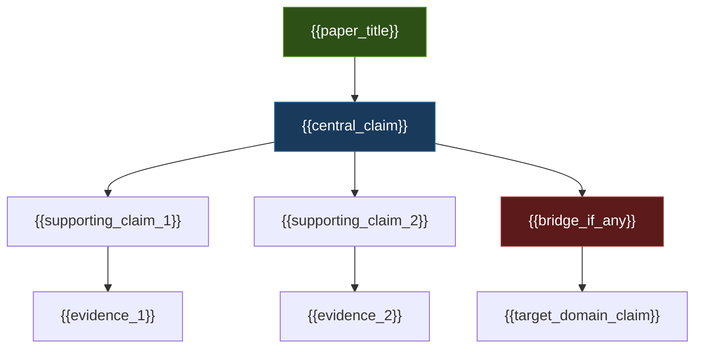
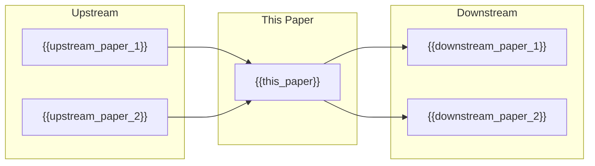

# MASTER PAPER TEMPLATE — v0.4.1 (FULL INSTRUCTION VERSION — SUPERSET)
**POF 2828 | 2026-09-14 | canonical copy: 999_TEMPLATES/API_LAYER_v0.3**
*Everything from v0.3 rendered format — Q0–Q14, domain checks, six-door lens,
warrant, dynamics, structural maps, definitions, path-to-10, self-assessment —
PLUS the v0.4 layer: scorecard at top, deterministic S01–S10 scoring, flat
SQLite keys, framework_keys. Nothing was removed; everything was placed.
Scoring rules: 10_SCORING_SPEC_v0.4 (inlined per section). Bare skeleton: 02B.*

---

## HOW TO RUN THIS (DeepSeek instructions — read first)

1. **Read the source fully before writing anything.** The exact source is
   projected at the bottom, untouched. Never edit it.
2. **Fill every {{placeholder}}.** If a block genuinely cannot be filled,
   write one line (`NOT_ADDRESSED — reason`) — headings never disappear.
3. **Triage the question bank first.** Pick which bank sections are live for
   this paper type. Live questions get real answers in their sections;
   non-live bank items are deleted from output and recorded in the tail as one
   line per excluded bank. Nothing is skipped silently — skipping is a parse error.
4. **Score as you go.** Every scored section ends with a score footer citing
   rule IDs from its scoring table. Uncited scores are parse errors.
5. **Closed vocabularies only** for domain, content_type, reader_category,
   tags, series, framework_keys. Not on the list → map it, never invent.
6. **Scores ≠ ratings.** Section score = how well-built (0–150 ceiling).
   paper_rating = standing grade under the cap rule (API ≤ +8; +9 requires a
   human name in human_review.reviewer; +10 requires a Lean receipt).
7. **Honesty rules:** analogy never promoted to identity; bridge never
   propagates as proof; UNVERIFIED stays UNVERIFIED; unfalsifiable cores
   flagged, not hidden; negative results kept, never deleted; unassessed ≠ 0.
8. **SQLite contract:** every section score lands in YAML as flat keys
   (`s02_pos`, `s02_neg`, `s02_net`, `s02_ceiling`, `s02_rules`). Stable IDs:
   claims `{{PAPER}}-C001`, bridges `-B001`, predictions `-P001`, falsifiers
   `-F001`, hidden premises `-HP001`. Arrays are JSON. One artifact, four
   consumers: DeepSeek, humans in Obsidian, the 04 parser, SQLite.

---

## YAML FRONTMATTER (complete contract)

```yaml
---
# identity
type: axiom_companion
title: "ckg_evaluation: {{clean_title}}"
paper_id: "{{slug_short_hash}}"
paper_uuid: "{{UUIDv4}}"
original_title: "{{original_title}}"
clean_title: "{{clean_title}}"
status: CANDIDATE_DRAFT
canon_status: candidate_draft
semantic_status: ai_analyzed_pending_review
template_version: CKG_RECORD_V2.0.1
taxonomy_ref: "TAG_TAXONOMY_v0.3"
source_file: "{{absolute_path_to_source}}"
source_sha256: {{source_sha256}}
captured_at: {{ISO_8601_timestamp}}
chapter: {{ONE_STORY_key_or_null}}
upstream_hashes: [{{sha256_of_papers_this_depends_on}}]
downstream_implications: [{{sha256_of_papers_that_depend_on_this}}]

# closed vocabularies — percentages sum to 100, integers
content_type: {{ct-argument | ct-narrative | ct-overview | ct-equation | ct-method | ct-reference | ct-implications | ct-status | ct-outline | ct-source}}
reader_category: {{rc-general | rc-curious | rc-student | rc-technical | rc-specialist | rc-internal}}
domain_primary: "{{strongest_domain}}"
domain_primary_pct: {{integer_1_to_100}}
domain_secondary: "{{second_domain_or_null}}"
domain_secondary_pct: {{integer_or_null}}
domain_tertiary: "{{third_domain_or_null}}"
domain_tertiary_pct: {{integer_or_null}}
series: {{series- tag or "NONE"}}
tags: [{{comma_separated_tags_from_taxonomy}}]
tags_weighted:
  - tag: "{{tag_1}}"
    weight: {{integer_pct}}
framework_keys: [{{concept groupings — closed list below}}]
# framework_keys closed list (extend only by governance):
#   master-equation · ten-laws · syzygy · grace-operator · soul-field ·
#   observer-theory · coherence-functional · compression-theory ·
#   boundary-conditions · destiny-equation · moral-physics · cosmology-gr ·
#   quantum-foundations · ai-consciousness · experimental-protocols ·
#   trinitarian-structure · logos-field · resurrection-physics

# substance
governing_question: "{{governing_question}}"
one_sentence_finding: "{{one_sentence_finding}}"
claim_ids: ["{{PAPER}}-C001", ...]
topic_keys: [{{definitive_works_registry_keys}}]

# ratings under the cap rule (STANDING — separate from section score)
paper_rating: 0
rating_awarded_by: API
evidence_status: CANDIDATE
formal_status: NOT_ESTABLISHED
lean_receipts: []
human_review: {reviewer: null, ruling: null, date: null}

# dashboard fields (evidence-sheet contract)
status: candidate
evd_state: UNSCORED
evd_support: 0
evd_counter: 0
evd_balance: null
evd_families: 0
evd_coverage: 0.00
evd_gated: false
evd_stable: null
evd_weakest_claim: ""
evd_unassessed: 0
evd_assessors: []
coherence: null
physical_event: undecided

# SECTION SCORES — flat keys; parser imports these into SQLite columns.
# s0N_rules = JSON array of every fired rule ID, e.g. ["S02-A1","S02-P2"]
s01_pos: 0
s01_neg: 0
s01_net: 0
s01_ceiling: 10
s01_rules: []
s02_pos: 0
s02_neg: 0
s02_net: 0
s02_ceiling: 10
s02_rules: []
s03_pos: 0
s03_neg: 0
s03_net: 0
s03_ceiling: 10
s03_rules: []
s04_pos: 0
s04_neg: 0
s04_net: 0
s04_ceiling: 10
s04_rules: []
s05_pos: 0
s05_neg: 0
s05_net: 0
s05_ceiling: 10
s05_rules: []
s06_pos: 0
s06_neg: 0
s06_net: 0
s06_ceiling: 10
s06_rules: []
s07_pos: 0
s07_neg: 0
s07_net: 0
s07_ceiling: 10
s07_rules: []
s08_pos: 0
s08_neg: 0
s08_net: 0
s08_ceiling: 10
s08_rules: []
s09_pos: 0
s09_neg: 0
s09_net: 0
s09_ceiling: 10
s09_rules: []
s10_pos: 0
s10_neg: 0
s10_net: 0
s10_ceiling: 10
s10_rules: []
score_total: 0
score_ceiling: 100
score_class: UNCLASSIFIED
chains_loadbearing: false
chains_honesty: false
integrity_bonus: false
gated: false
build_next: ""

# audit trail
semantic_provider: "{{provider}}"
semantic_model: "{{exact_model_string}}"
call_routes: [{{per_call_route_entries}}]
usage_tokens: {{prompt_completion_total_cost_object}}
score: null
grade: null
canonical_rec: null
run_id: {{run_id}}
processed_date: {{date}}
---
```

---

## SCORECARD (renders at the very top, immediately after YAML)

| § | Section | Pos | Neg | Net | Ceiling | Chain |
|---|---------|-----|-----|-----|---------|-------|
| S01 | Classification & Routing | {{p}} | {{n}} | {{net}} | 10 | — |
| S02 | Claim Definition | {{p}} | {{n}} | {{net}} | {{10/15}} | LB |
| S03 | Argument Structure | {{p}} | {{n}} | {{net}} | {{10/15}} | LB |
| S04 | Evidence & Support | {{p}} | {{n}} | {{net}} | {{10/15}} | LB |
| S05 | Objections & Survival | {{p}} | {{n}} | {{net}} | {{10/15}} | HON |
| S06 | Boundaries & Honesty | {{p}} | {{n}} | {{net}} | {{10/15}} | HON |
| S07 | Formal & Math | {{p}} | {{n}} | {{net}} | {{10/15}} | LB |
| S08 | Bridge Integrity | {{p}} | {{n}} | {{net}} | {{10/15}} | HON |
| S09 | Falsifiability & Predictions | {{p}} | {{n}} | {{net}} | {{10/15}} | HON |
| S10 | Audit & Provenance | {{p}} | {{n}} | {{net}} | 10 | — |
| | **TOTAL** | {{sum}} | {{sum}} | **{{net}}/100** | ceiling {{100/150}} | chains {{0-2}}/2 |

**CLASS:** {{ADMIT-CANDIDATE ≥130 · STRONG 100–129 · WORKING 70–99 · DEVELOPING 40–69 · FRAGILE 0–39 · RETRACT <0}}
**GATED:** {{yes/no}} · **HARD FAILS:** {{list or none}}
**Build next:** {{weakest section in one line — what to build, not what to feel}}

> Chain rules: LOAD-BEARING = S02,S03,S04,S07 all net ≥ 8 → those ceilings lift
> to 15. HONESTY = S05,S06,S08,S09 all net ≥ 8 → lift. Both chains AND zero
> total penalties → +5 integrity bonus. Any of S02–S05 net < 0 → GATED.

---

<!-- ═══════════════════════════════════════════════ -->
<!-- S01 · CLASSIFICATION & ROUTING                   -->
<!-- ═══════════════════════════════════════════════ -->

## S01 · Classification & Routing

> [!abstract] Classification & Routing
>
> | Question | Answer | Vocabulary |
> |---|---|---|
> | **Domain** | {{domain_primary}} ({{domain_primary_pct}}%) | Theophysics · Theology · Philosophy · Mathematics · Physics · Information Theory · Cognitive Science · Social Sciences · Methodology · Computer Science |
> | **Secondary domain(s)** | {{domain_secondary}} ({{domain_secondary_pct}}%) | Same list — or NONE |
> | **Content type** | {{ct- tag}} | ct-argument · ct-narrative · ct-overview · ct-equation · ct-method · ct-reference · ct-implications · ct-status · ct-outline · ct-source |
> | **Reader level** | {{rc- tag}} | rc-general · rc-curious · rc-student · rc-technical · rc-specialist · rc-internal |
> | **Series** | {{series- tag or NONE}} | series-genesis-quantum · series-consolidated · series-one-story · series-master-eq · series-boundary · series-fruits · series-descent · NONE |
> | **framework_keys** | {{JSON list}} | closed list in YAML above |
>
> > [!info]- Outbox routing
> > | Copy | Folder | Rule |
> > |---|---|---|
> > | C1 | `OUTBOX/{{domain}}/` | Primary — every paper |
> > | C2 | `OUTBOX/{{ct-tag}}/` | By content type |
> > | C3 | `OUTBOX/{{series-tag}}/` | By series (if not NONE) |
> > | C4 | `OUTBOX/00_UNTOUCHED/` | Archive — exact as produced |

**Scoring** — awards: S01-A1 domain+pcts +2 · S01-A2 ct +2 · S01-A3 rc +2 · S01-A4 series +1 · S01-A5 taxonomy_ref & closed tags +2 · S01-A6 routing +1. Penalties: S01-P1 invented tag −3 · S01-P2 classification contradicts YAML −2.

`> score reasons: {{rule IDs}}`

---

<!-- ═══════════════════════════════════════════════ -->
<!-- AT A GLANCE — human doorway, unscored            -->
<!-- ═══════════════════════════════════════════════ -->

# {{clean_title}}

> [!success] The Six
>
> | | |
> |---|---|
> | **Claim** | {{strongest_defensible_claim}} |
> | **Domain** | {{domain_primary}} ({{domain_primary_pct}}%) {{domain_secondary}} ({{domain_secondary_pct}}%) |
> | **Physical event** | {{physical_event_or_undecided}} |
> | **Bridge** | {{bridge_statement_or_none}} |
> | **What defeats it** | {{defeat_conditions}} |
> | **Have / need / breaks if** | {{have_need_breaks}} |

> [!important] Verdict
> {{UNSCORED — coverage below floor. Unassessed is not zero.  OR  SCORED verdict with balance}}

> [!success] At a Glance (expanded)
> {{Plain English, declaration register. What we claim, what the machine checks (include standing one-paragraph "what Lean is" block), why it matters.}}
>
> `TRANSLATION: DRAFT — NOT REVIEWED`

---

<!-- ═══════════════════════════════════════════════ -->
<!-- S02 · CLAIM DEFINITION                           -->
<!-- ═══════════════════════════════════════════════ -->

## S02 · Claim Definition

> [!quote] Central Claim
> {{Strongest defensible version, ordinary language. @claim marker.}}

- **Exact expression (Q0):** {{answer_or_NOT_ADDRESSED}}
- **Referent (Q1):** {{what physical/theological thing is claimed}}
- **Identity & distinction (Q2):** {{vs. neighboring claims}}
- **Dependency floor (Q3):** {{what must be true for this to be meaningful}}

## Definitions

> [!info] Key Terms (anything above 8th-grade reading level)
> <!-- RULE: if a term would confuse a bright 8th-grader, it gets a row.
>      Plain English. No circularity. Every technical term, no cap. -->
>
> | Term | Plain definition | Domain | First used in |
> |---|---|---|---|
> | {{term}} | {{definition_an_8th_grader_could_understand}} | {{domain}} | {{section_or_heading}} |

## Open the question (Q0–Q14 bank — live questions answered, non-live deleted to tail)

> [!quote]+ Q0 · Exact expression
> {{answer_or_excluded}}
> [!info]+ Q1 · Referent
> {{answer_or_excluded}}
> [!abstract]+ Q2 · Identity and distinction
> {{answer_or_excluded}}
> [!warning]+ Q3 · Dependency floor
> {{answer_or_excluded}}
> [!question]+ Q4 · Variation and invariance
> {{answer_or_excluded}}
> [!info]+ Q5 · Capabilities and operations
> {{answer_or_excluded}}
> [!abstract]+ Q6 · Transitions
> {{answer_or_excluded}}
> [!danger]+ Q7 · Constraints
> {{answer_or_excluded}}
> [!success]+ Q8 · Consequences and licenses
> {{answer_or_excluded}}
> [!quote]+ Q9 · Representation ladder
> {{answer_or_excluded}}
> [!caution]+ Q10 · Preservation and loss
> {{answer_or_excluded}}
> [!success]+ Q11 · If true
> {{answer_or_excluded}}
> [!danger]+ Q12 · If false / rivals
> {{answer_or_excluded}}
> [!warning]+ Q13 · Discriminating checks
> {{answer_or_excluded}}
> [!important]+ Q14 · Emergent role
> {{answer_or_excluded}}

### Path to 10 (rating ladder — standing grade, NOT the section score)

> [!important] Current Rating: +{{current_score}} — Path to +10
>
> | Level | Score | Status | What's needed |
> |---|---|---|---|
> | **Current (API)** | +{{current_score}} | ✅ Awarded | — |
> | **API ceiling** | +8 | {{ACHIEVED / GAP: see below}} | {{what_would_make_this_an_8}} |
> | **Human review** | +9 | {{PENDING / ACHIEVED}} | {{human name}} confirms argument holds under pressure |
> | **Lean receipt** | +10 | {{NOT_ESTABLISHED / RECEIPTED}} | Machine-verified proof of encoded premises |
>
> > [!warning] If below +8
> > **Why not +8:** {{specific_diagnosis}}
> > **What +8 looks like:** {{strongest version that earns +8}}
> > **Reference work at +8:** {{title, author, why it earns +8}}
> > **Steps to close:** 1. {{step}} 2. {{step}} 3. {{step}}
> > **Revised score if taken:** +{{projected_score}}

**Scoring** — awards: S02-A1 central claim +2 · S02-A2 referent +2 · S02-A3 identity/distinction +2 · S02-A4 dependency floor +2 · S02-A5 falsifier attached (cite from S09 registry) +2. Penalties: S02-P1 circular definition −4 · S02-P2 equivocation −3 · S02-P3 load-bearing claim w/o falsifier −2.

`> score reasons: {{rule IDs}}`

---

<!-- ═══════════════════════════════════════════════ -->
<!-- S03 · ARGUMENT STRUCTURE                         -->
<!-- ═══════════════════════════════════════════════ -->

## S03 · Argument Structure

> [!info] System or Model
> {{Entities, distinctions, relationships, sequence.}}

### Primary argument (from source)
<!-- PROVENANCE RULE: every step tagged ORIGINAL / CLASSICAL:<name, work, ~date>
     (pre-2015 minimum; older and more foundational is better) / STANDARD.
     Recent papers are secondary references, NOT argument provenance. -->
1. {{step_1}} `{{ORIGINAL | CLASSICAL:<source> | STANDARD}}`
2. {{step_2}} `{{ORIGINAL | CLASSICAL:<source> | STANDARD}}`
3. {{step_3}} `{{ORIGINAL | CLASSICAL:<source> | STANDARD}}`
4. {{therefore_conclusion}} `{{ORIGINAL | CLASSICAL:<source> | STANDARD}}`

### Hidden premises
| ID | Hidden premise | Required by | If false, breaks | Blast radius |
|---|---|---|---|---|
| {{PAPER}}-HP001 | {{unstated_assumption}} | {{claim_id}} | {{consequence}} | INERT / LOCAL / STRUCTURAL |

### Argument strengthening
| Weak link | Why it's weak | Stronger version | Source for fix |
|---|---|---|---|
| {{step_or_premise}} | {{diagnosis}} | {{improved_version}} | {{ORIGINAL or CLASSICAL:<source>}} |

### Supplementary arguments (from the tradition — no padding)
**Supplementary argument 1** — `CLASSICAL: {{source, work, ~date}}`
1. {{step_1}} 2. {{step_2}} 3. {{therefore}}

### Argument score assessment
| Metric | Current | Ceiling | Gap | How to close |
|---|---|---|---|---|
| Logical validity | {{valid/invalid/partial}} | valid | {{gap_or_none}} | {{fix}} |
| Premise strength | {{rating}} | +8 | {{gap}} | {{fix}} |
| Completeness | {{rating}} | +8 | {{gap}} | {{missing steps or assumptions}} |
| Originality | {{count ORIGINAL / count total}} | — | — | {{which steps could be made original}} |

### Extracted Truth Predicates (EXHAUSTIVE — every assertion gets a row; no cap)
| # | Truth Predicate | Source Role | Modality | Formal / Mathematical Formulation | Warrant |
|---|---|---|---|---|---|
| P1 | {{predicate}} | {{role}} | {{Axiomatic / Contingent / Heuristic}} | {{formulation}} | {{scripture / mathematical fact / external result / definition / framework assertion}} |

> **Extraction completeness check**: {{count}} predicates extracted from {{count}} source paragraphs. Paragraphs with zero predicates: {{list or "none"}}.

### Terms and plain-language bridge
| Term/symbol | Exact role | Plain meaning | Analogy/example |
|---|---|---|---|
| {{term}} | {{role}} | {{meaning}} | {{analogy — illustrates, not evidence}} |

### Structural Map (intra-paper)


**Scoring** — awards: S03-A1 provenance tags +2 · S03-A2 hidden premises +2 · S03-A3 strengthening +2 · S03-A4 supplements +2 · S03-A5 validity check +2. Penalties: S03-P1 circular reasoning undetected −5 · S03-P2 post-hoc as derivation −3 · S03-P3 missing lemma −2.

`> score reasons: {{rule IDs}}`

---

<!-- ═══════════════════════════════════════════════ -->
<!-- S04 · EVIDENCE & SUPPORT                         -->
<!-- ═══════════════════════════════════════════════ -->

## S04 · Evidence & Support

## Claims
|ID|Version|Register|Load-bearing|Depends on|Support|Against|Balance|State|
|---|---|---|---|---|---|---|---|---|
|{{PAPER}}-C001|v1|{{NATIVE or BRIDGE or DERIVED}}|{{yes/no}}|{{dependency_ids}}|{{support_summary}}|{{against_summary}}|{{balance}}|{{state}}|

- **C1** ({{register}}): {{claim_text}}

## Evidence ledger
Two items are one family if they cannot fail independently. Discr. = raw × rival factor (0 / 0.5 / 1) × timing factor (predicted 1 / accommodated 0.75 / retrodicted 0.5). Family scores stack by the cluster schedule 5 / 7.5 / 10 / 15 and stop.

|Family|Cluster|Claim|Dir|Raw|Discr.|Timing|Rival|Assessor|Finding|
|---|---|---|---|---|---|---|---|---|---|
|{{F1}}|{{cluster}}|{{claim_id}}|{{+/-}}|{{raw_score}}|{{discr_score}}|{{predicted/accommodated/retrodicted}}|{{rival_factor}}|{{assessor_name}}|{{finding_summary}}|

> [!info]- Evidence reasons
> {{reasoning_for_evidence_scores — cite the family independence test: "would one methodological error kill both?"}}

## Warrant Control
> [!success] Warrant
>
> | Field | Fill |
> |---|---|
> | **Claim** | {{the_claim_being_warranted}} |
> | **Evidence** | {{what_supports_it}} |
> | **Proof / test** | {{formal_or_empirical_test}} |
> | Counterevidence | {{what_pushes_back}} |
> | **Kill condition** | {{what_would_force_retraction}} |
> | Assumptions | {{unstated_requirements}} |
> | **Evidence strength** | {{STRONG / MODERATE / WEAK — with reason}} |
> | Evidence coverage | {{what_the_evidence_covers_and_doesnt}} |
> | Source independence | {{count_of_independent_sources_or_NEEDS_AUDIT}} |
> | Native grade | {{AX_CORE / AX_SCAFFOLD / FW_EXTENDED / BRIDGE / etc.}} |
> | Normalized grade | {{grade_within_current_chain_version}} |
>
> > [!caution] Coverage Boundary
> > {{What the warrant does NOT establish — explicit scope limit.}}

## Dynamics
> [!abstract] Dynamics
>
> | Dynamic | Reading |
> |---|---|
> | **Coherence** | {{how_this_contributes_to_or_requires_system_coherence}} |
> | Degradation | {{what_happens_if_this_weakens — graceful or catastrophic?}} |
> | Measurement | {{what_would_you_measure_to_test_this}} |
> | Threshold | {{binary flip or gradient}} |
> | **Asymmetry** | {{what_can_this_host_that_its_denial_cannot}} |
> | Restoration | {{if_damaged_can_it_be_rebuilt_and_how}} |
> | **Counterexample** | {{what_must_be_produced_to_break_this}} |

> [!warning] Evidence Chain
> **Claim**: {{claim}} → **Support**: {{support}} → **Inference**: {{inference}} → **Confidence**: {{High/Medium/Low}} → **Boundary**: {{boundary}}

> [!success] Best Evidence and Sources
>
> | Type | Content |
> |---|---|
> | **Primary evidence / Formal results** | {{primary}} |
> | **Secondary interpretation** | {{secondary}} |
> | **Analogy / Bridge** | {{analogy — illustrates, not evidence}} |
> | **Citations** | {{with provenance markers: ORIGINAL / HISTORICAL_WITNESS:<name> / MODERN_PARALLEL:<ref> / UNVERIFIED}}

## Coherence & Self-Assessment
> [!abstract] Coherence Score
> {{Unassessed — OR score 0-5 with justification}}

**Scoring** — awards: S04-A1 per-claim chain +2 · S04-A2 ledger w/ families +2 · S04-A3 independence test operationalized +2 · S04-A4 provenance markers +2 · S04-A5 grade [T]/[C]/[D] ≠ rating +2. Penalties: S04-P1 correlated-as-independent −4 · S04-P2 retrodicted-as-predicted −3 · S04-P3 contested source unflagged −3.

`> score reasons: {{rule IDs}}`

---

<!-- ═══════════════════════════════════════════════ -->
<!-- S05 · OBJECTIONS & SURVIVAL                      -->
<!-- ═══════════════════════════════════════════════ -->

## S05 · Objections & Survival

> [!danger] Strongest Objection and Negative Controls
>
> | | |
> |---|---|
> | **Objection** | {{best_opposing_case — steelmanned}} |
> | **Philosophical counter** | {{philosophical_counter}} |
> | **Negative control test** | {{ablation_permutation_vacuity_blinded}} |

### Counter-models
| Proposed counter-model | Why plausible | Breaking point | Status |
|---|---|---|---|
| {{countermodel_1}} | {{why_someone_would_hold_it}} | {{what_defeats_it_or_UNRESOLVED}} | {{DEFEATED / UNRESOLVED / LIVE}} |

> [!success] What Survives
> {{Narrowest defensible core after pressure. Ratings per claim.}}

> [!success] Independent AI Review — {{PASS / PARTIAL / FAIL / N-A}}
> {{summary of independent review or PENDING}}

**Scoring** — awards: S05-A1 steelman +2 · S05-A2 countermodels table +2 · S05-A3 negative controls +2 · S05-A4 what survives +2 · S05-A5 blast radius +2. Penalties: S05-P1 strawman −5 · S05-P2 known countermodel omitted −4 · S05-P3 possible control absent −2.

`> score reasons: {{rule IDs}}`

---

## Six-Door Explanatory Lens (reader layer — not separately scored; clarity feeds S03/S06)

> [!quote]+ Human Door
> {{What does this mean for a person standing in front of it? Plain language. The "try to deny it" test.}}
> [!abstract]+ Metaphysical Door
> {{What ontological claim is being made? Where does it sit relative to competing metaphysical systems?}}
> [!important]+ Theological Door
> {{What theological mapping? Bridge or derivation? What doctrine does it NOT establish?}}
> [!info]+ Scientific Door
> {{What scientific content is present? What does science presuppose here? Where does the method stop being the right tool?}}
> [!warning]+ Formal Door
> {{What formal content? Primitive, derived, or encoded? What can formal systems prove and not prove here?}}
> [!question]+ External Reference Door
> {{How would a neutral outside observer frame this? What competing frameworks address the same question? What looks like a refutation but isn't?}}

---

<!-- ═══════════════════════════════════════════════ -->
<!-- S06 · BOUNDARIES & HONESTY                       -->
<!-- ═══════════════════════════════════════════════ -->

## S06 · Boundaries & Honesty

> [!caution] What This Does Not Establish
> {{Hard boundary. What the checkmark means / does not mean. Lean = consequences of encoded definitions and premises only.}}

### Explicit boundaries (pulled from source verbatim)
| ID | Boundary statement | Protects (claim IDs) | Source anchor |
|---|---|---|---|
| BND-001 | {{boundary_statement}} | {{claim_ids_protected}} | {{verbatim_anchor}} |

> [!warning] Corrections and Revisions
> {{What we went through — the story of what failed and got narrowed.}}
>
> |What held|What broke|What's overstated|Defensible version|Blast radius|
> |---|---|---|---|---|
> |{{held}}|{{broke}}|{{overstated}}|{{defensible}}|INERT / LOCAL / STRUCTURAL|

### Self-Assessment / Reputation Form
> [!important] Self-Assessment
>
> | Dimension | Self-score (0–10) | Justification |
> |---|---|---|
> | **Argument strength** | {{score}} | {{why}} |
> | **Evidence quality** | {{score}} | {{why}} |
> | **Originality** | {{score}} | {{why}} |
> | **Bridge integrity** | {{score}} | {{why}} |
> | **Formal readiness** | {{score}} | {{why}} |
> | **Clarity / accessibility** | {{score}} | {{why}} |
> | **Scope honesty** | {{score}} | {{did it stay inside its register?}} |
> | **Kill-condition clarity** | {{score}} | {{how clear is what would defeat this?}} |
>
> **Overall self-grade:** {{A–F}} · **Confidence in self-grade:** {{HIGH / MEDIUM / LOW}}
> **Biggest blind spot:** {{what this paper probably gets wrong but can't see}}

> [!abstract] Implications
>
> | Domain | Implication |
> |---|---|
> | **Formal** | {{formal_implications}} |
> | **Philosophical** | {{philosophical_implications}} |
> | **Empirical** | {{empirical_implications_or_none}} |
> | **Semantic** | {{semantic_implications}} |
> | **Theological** | {{theological_implications_or_none}} |

**Scoring** — awards: S06-A1 does-not-establish +2 · S06-A2 verbatim boundaries +2 · S06-A3 scope honesty +2 · S06-A4 audit table +2 · S06-A5 corrections story +2. Penalties: S06-P1 overstatement standing −6 · S06-P2 register mixing undetected −4 · S06-P3 missing boundary −3.

`> score reasons: {{rule IDs}}`

---

<!-- ═══════════════════════════════════════════════ -->
<!-- S07 · FORMAL & MATH                              -->
<!-- ═══════════════════════════════════════════════ -->

## S07 · Formal & Math (MANDATORY heading; write "No mathematical content" if none)

### Mathematics (three-layer rule: equation, term-by-term translation, meaning — then judged)
| Object/Equation | Term-by-term | Meaning | Status | Failure mode |
|---|---|---|---|---|
| {{equation}} | {{translation}} | {{meaning}} | {{COHERENT_TESTED / COHERENT_UNTESTED / DEFECTIVE / DECORATIVE}} | {{what_breaks_if_wrong — or N/A}} |

*If no mathematics is present: "No mathematical content" — this heading never silently disappears.*

- Dimensional & limiting-case checks: {{report — dimensions, known-result recovery, limits}}
- If a constant is set below detection (coupling ~10⁻⁶⁹-class): flag here AND in S09. Hiding it is a double penalty.

> [!info]- Lean / formal checks
> | Proposed theorem or invariant | Visible premises | Status | Reader meaning | Passing establishes |
> |---|---|---|---|---|
> | {{theorem}} | {{premises}} | {{Not verified / Verified / Failed}} | {{analogy}} | {{what_it_proves}} |

> [!question]- Empirical / literature checks
> {{Verify cited sources. Check modern references for consensus.}}

> [!danger]- Adversarial checks
> {{Attempt to break the claim. Challenge classifications. Test dependencies.}}

## Domain checks (bank D — live checks answered, non-live deleted to tail; cross-cite results into section score reasons)

> [!info]- Physics — {{PASS / PARTIAL / FAIL / N-A}}
> {{quantity, units, dynamics, protocol, instrument, data, controls, analysis — one line each}}
> [!quote]- History / testimony — {{PASS / PARTIAL / FAIL / N-A}}
> {{event, observers, witness, testimony, transmission, document, preservation, corroboration, interpretation}}
> [!important]- Theology — {{PASS / PARTIAL / FAIL / N-A}}
> {{source, textual witness, tradition, proclamation, register, confession class, scope, relation}}
> [!abstract]- Philosophy / metaphysics — {{PASS / PARTIAL / FAIL / N-A}}
> {{one line per check}}
> [!warning]- Mathematics / formal — {{PASS / PARTIAL / FAIL / N-A}}
> {{definitions, axiom use, inference rules, lemmas, derivation, theorem, receipt, interpretation boundary}}
> [!danger]- Cross-domain bridge — {{PASS / PARTIAL / FAIL / N-A}}
> {{source/target registers, mapping, preserved, LOST, boundaries, grade, reverse map, commutativity, countermodels, why-gate, next test}}
> [!caution]- Reverse reconstruction B0–B8 — {{PASS / PARTIAL / FAIL / N-A}}
> {{one line per level}}
> [!question]- Why-closure by level — {{PASS / PARTIAL / FAIL / N-A}}
> {{one line per ladder level}}
> [!quote]- {{count}} excluded, with reasons
> {{- item — reason, one per line, or "nothing excluded"}}

**Scoring** — awards: S07-A1 three-layer +2 · S07-A2 dimensional checks +2 · S07-A3 DECORATIVE flagged +2 · S07-A4 Lean targets +2 · S07-A5 notation dictionary +2. Penalties: S07-P1 defective passed −5 · S07-P2 decorative unflagged −4 · S07-P3 dimensional inconsistency −5 · S07-P4 undefined load-bearing symbol −3.

`> score reasons: {{rule IDs}}`

---

<!-- ═══════════════════════════════════════════════ -->
<!-- S08 · BRIDGE INTEGRITY                           -->
<!-- ═══════════════════════════════════════════════ -->

## S08 · Bridge Integrity

### Bridge registry (the unification seam — LOST is MANDATORY, never blank)
| Bridge ID | Source domain · object | Target domain · object | Mapping type (analogy/homomorphism/isomorphism/embedding/metaphor) | Preserved | LOST (mandatory) | Word-gate | Grade | Reverse map | Countermodel |
|---|---|---|---|---|---|---|---|---|---|
| {{PAPER}}-B001 | {{A}} | {{B}} | {{type}} | {{what_survives}} | {{lost — or "isomorphism, justified: …"}} | {{the word that breaks it if equivocated}} | {{A-F}} | {{yes+cite / no+why}} | {{known_countermodel_or_none}} |

### Bridge originality
| Seam (A ↔ B) | Move made | Mapping type | Preserved structure | Provenance | Nearest prior art |
|---|---|---|---|---|---|
| {{seam}} | {{move}} | {{analogy / homomorphism / isomorphism / embedding / metaphor}} | {{survives_crossing}} | {{ORIGINAL / BORROWED / STANDARD}} | {{prior_art — UNVERIFIED until checked}} |

**Scoring** — awards: S08-A1 all bridges registered +2 · S08-A2 LOST filled/justified +2 · S08-A3 word-gate +2 · S08-A4 honest mapping-type grade +2 · S08-A5 reverse map/countermodel +2. Penalties: S08-P1 blank LOST −5 (HARD FAIL) · S08-P2 word-gate equivocation undetected −5 · S08-P3 analogy→identity −4 · S08-P4 bridge propagates as proof −4.

`> score reasons: {{rule IDs}}`

---

<!-- ═══════════════════════════════════════════════ -->
<!-- S09 · FALSIFIABILITY & PREDICTIONS               -->
<!-- ═══════════════════════════════════════════════ -->

## S09 · Falsifiability & Predictions

### Falsifier registry (the minimum kill per claim — not "strongest objection")
| Falsifier ID | Claim | Minimum kill (empirical/formal/logical/testimonial) | Status | Blast radius |
|---|---|---|---|---|
| {{PAPER}}-F001 | {{claim_id}} | {{what_would_kill_it}} | {{UNTESTED / TESTED_SURVIVED / TRIGGERED}} | INERT / LOCAL / STRUCTURAL |

### Predictions (LOGGED, not discussed — falsified predictions are NEVER deleted)
| Pred ID | Claim | Prediction | Deadline | Check method | Outcome | Logged by | Date |
|---|---|---|---|---|---|---|---|
| {{PAPER}}-P001 | {{claim_id}} | {{specific_testable_prediction}} | {{date_or_condition}} | {{how_to_check}} | {{PENDING / CONFIRMED / FALSIFIED / EXPIRED}} | {{API / HUMAN:<name>}} | {{date}} |

> [!danger] What would make this a 0?
> {{The specific finding, counterexample, or proof that would collapse this paper's rating to zero — the kill condition stated as a rating event. Must match a F-row above.}}

### Explicit uncertainties
| ID | Uncertainty | Affects (claim IDs) | Status | Next action |
|---|---|---|---|---|
| U-001 | {{open_or_owed}} | {{claim_ids}} | {{OPEN / IN_PROGRESS / RESOLVED}} | {{what_to_do}} |

> [!question] Open Questions and Next Actions
>
> | | |
> |---|---|
> | **Open question** | {{question}} |
> | **Next action** | {{action}} |
> | **Tangent queue** | {{@tangent topic=... definitive=PENDING feeds writing queue}} |

**Scoring** — awards: S09-A1 every claim falsifiable +2 · S09-A2 minimum-kill registry +2 · S09-A3 predictions logged w/ deadline +2 · S09-A4 pre-registered falsification criteria +2 · S09-A5 negatives kept +2. Penalties: S09-P1 unfalsifiable core unflagged −4 · S09-P2 falsified prediction deleted/softened −4 · S09-P3 load-bearing claim w/o kill condition −3.

`> score reasons: {{rule IDs}}`

---

<!-- ═══════════════════════════════════════════════ -->
<!-- S10 · AUDIT & PROVENANCE                         -->
<!-- ═══════════════════════════════════════════════ -->

## S10 · Audit & Provenance

## Audit
> [!danger] Audit Table
>
> |What held|What broke|What's overstated|Defensible version|Blast radius|
> |---|---|---|---|---|
> |{{held}}|{{broke}}|{{overstated}}|{{defensible}}|INERT / LOCAL / STRUCTURAL|

### Inter-paper dependency map


### Recommended Classification and Relationships
> [!abstract] Relationships
>
> | Field | Value |
> |---|---|
> | **Record type** | {{type}} (`{{mode}}`) |
> | **Domain** | {{domain_primary}} ({{pct}}%) {{domain_secondary}} ({{pct}}%) |
> | **Tags** | {{tags}} |
>
> | Relationship | Target |
> |---|---|
> | `supports` | {{supports}} |
> | `contradicts` | {{contradicts_or_none}} |
> | `refines` | {{refines}} |
> | `depends_on` | {{depends_on}} |
> | `tests` | {{tests}} |
> | `supersedes / superseded_by` | {{...}} |

## Audit appendix
<details><summary>Machine audit output (scorecard, gates, probes, adversarial tests, remediation)</summary>

{{verbatim_machine_output}}

</details>

**Scoring** — awards: S10-A1 exact source + hash preserved +2 · S10-A2 machine audit appendix +2 · S10-A3 assessors honest, machine-only INADMISSIBLE +2 · S10-A4 cap rule respected +2 · S10-A5 versions recorded +2. Penalties: S10-P1 source altered −4 · S10-P2 cap violated −4 (HARD FAIL) · S10-P3 machine-only as admissible −3.

`> score reasons: {{rule IDs}}`

---

<!-- ═══════════════════════════════════════════════ -->
<!-- EVIDENCE DASHBOARD (per-paper view; vault-wide lives in 08) -->
<!-- ═══════════════════════════════════════════════ -->

## Evidence dashboard (reads frontmatter only — infrastructure, not scored)

```dataview
TABLE WITHOUT ID file.link AS Sheet, evd_balance AS Balance, evd_weakest_claim AS "Weakest claim", coherence AS Coherence
WHERE type = "evidence-sheet" AND evd_state = "SCORED" SORT evd_balance ASC
```

---

<!-- ═══════════════════════════════════════════════ -->
<!-- TAIL LAYERS (fixed order)                        -->
<!-- ═══════════════════════════════════════════════ -->

## Unanswered and not applicable — with reasons

<!-- Triaged banks: one line per EXCLUDED bank. Live questions were answered
     in their sections above. Nothing skipped silently — skipping is a parse error. -->

`Excluded banks: {{A(n), B(n), C(n), D(n), E(n) or "none"}} — {{one-line reasons}}`

## Exact source, untouched

<!-- BEGIN EXACT SOURCE PROJECTION; authoritative original bytes are permanently preserved -->
<!-- SHA-256: {{source_sha256}} -->

{{exact_source_text_fenced_never_edited}}

<!-- END EXACT SOURCE PROJECTION -->

---

_POF 2828 · not a probability of truth · human ruling required_
