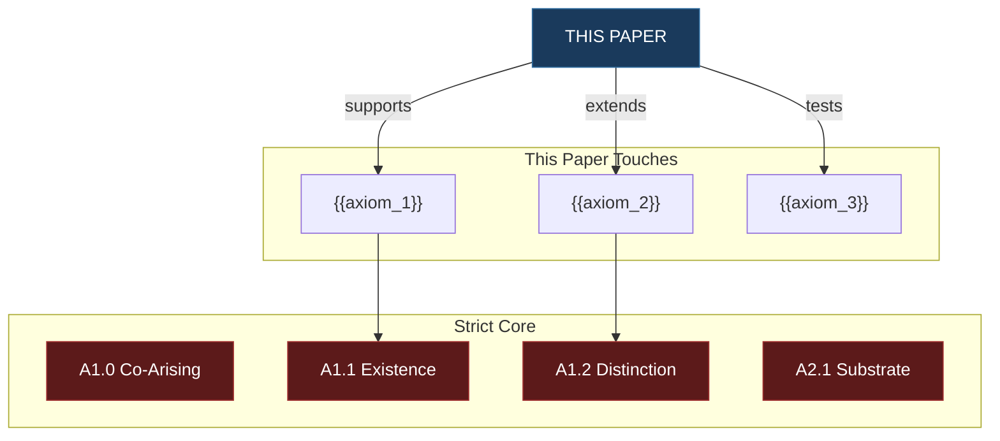

# GRADING & ALIGNMENT LAYER TEMPLATE — v0.3 (ONE PER PAPER, SEPARATE API CALL)
**POF 2828 | 2026-09-14 | canonical copy: 999_TEMPLATES/API_LAYER_v0.3**
*Framework alignment and scoring layer. Own API call under the atomicity rule.
Maps every paper against: axiom nodes, master equation (χ), fruits of the spirit,
and the full grader variable schema. Runs on EVERY paper.
Joined to its paper on source_sha256.*

*Core rule: Raw metrics are facts. Review scores are judgments. Final scores are derived summaries. Do not mix those layers too early.*

<!-- @template layer=grading version=0.3 -->

---

```yaml
---
# identity — joins to paper on source_sha256
type: grading_layer
parent_paper_id: "{{paper_id}}"
source_sha256: {{source_sha256}}
paper_uuid: {{paper_uuid}}
template_version: GRADING_LAYER_V0.3
generated_at: {{ISO_8601_timestamp}}

# audit trail (this call only)
semantic_provider: "{{provider}}"
semantic_model: "{{exact_model_string}}"
call_route: "{{call_N=model (grading+alignment)}}"
usage_tokens: {{prompt_completion_total_cost_object}}
---
```

---

<!-- ═══════════════════════════════════════════════ -->
<!-- PART 1: FRAMEWORK ALIGNMENT                    -->
<!-- ═══════════════════════════════════════════════ -->

# Framework Alignment

## Axiom Node Mapping

<!-- Which axiom nodes does this paper touch, support, extend, test, or threaten?
     Map every connection to the 191-node chain. -->

> [!abstract] Axiom Alignment
>
> | Axiom ID | Axiom name | Relationship | Strength | What this paper does to/for this axiom |
> |---|---|---|---|---|
> | {{A1.1}} | {{Existence}} | {{supports / extends / tests / depends_on / threatens / illustrates}} | {{STRONG / MODERATE / WEAK}} | {{specific_contribution}} |
> | {{A1.2}} | {{Distinction}} | {{relationship}} | {{strength}} | {{contribution}} |
> <!-- Every axiom this paper touches. If it touches 30, list 30. -->
>
> **Axioms touched:** {{count}} of 191
> **Axioms directly supported:** {{count}}
> **Axioms extended:** {{count}}
> **Axioms tested:** {{count}}
> **Axioms threatened:** {{count}} — {{list if any}}

> [!danger] Chain Impact
> **If this paper's central claim is TRUE, which axiom nodes are strengthened?**
> {{list}}
>
> **If this paper's central claim is FALSE, which axiom nodes are exposed?**
> {{list}}
>
> **Blast radius:** INERT / LOCAL / STRUCTURAL



<!-- Replace with actual axiom connections. Red = strict core. Blue = this paper. -->

---

## Master Equation (χ) Alignment

<!-- How does this paper relate to the master equation χ = f(G, M, E, S, T, K, R, Q, F, C)?
     Which variables does it address? Which does it advance? -->

> [!warning] χ Variable Coverage
>
> | χ Variable | Symbol | This paper addresses? | How | Contribution level |
> |---|---|---|---|---|
> | God / Ground | G | {{yes/no}} | {{how_it_engages_this_variable}} | {{DIRECT / INDIRECT / IMPLICIT / NONE}} |
> | Matter-Energy | M | {{yes/no}} | {{how}} | {{level}} |
> | Information-Entropy | E | {{yes/no}} | {{how}} | {{level}} |
> | Structure-Form | S | {{yes/no}} | {{how}} | {{level}} |
> | Time-Process | T | {{yes/no}} | {{how}} | {{level}} |
> | Knowledge-Coherence | K | {{yes/no}} | {{how}} | {{level}} |
> | Relation-Communion | R | {{yes/no}} | {{how}} | {{level}} |
> | Qualia-Experience | Q | {{yes/no}} | {{how}} | {{level}} |
> | Freedom-Agency | F | {{yes/no}} | {{how}} | {{level}} |
> | Consciousness | C | {{yes/no}} | {{how}} | {{level}} |
>
> **Variables directly addressed:** {{count}} of 10
> **Variables implicitly touched:** {{count}}
> **Variables not addressed:** {{list}}
>
> > [!info] Master Equation Position
> > {{Where does this paper sit in the master equation landscape? Does it advance a single variable, bridge two variables, or contribute to the equation's overall coherence?}}

---

## Fruits of the Spirit Alignment

<!-- Galatians 5:22-23. How does this paper's content, method, and conclusions
     align with or demonstrate the fruits? This is structural, not decorative.
     The fruits are a truth test: work that is true should bear good fruit. -->

> [!success] Fruits Scoring
>
> | Fruit | Present? | How demonstrated | Score (0–5) |
> |---|---|---|---|
> | **Love** (ἀγάπη) | {{yes/no}} | {{how_the_paper_demonstrates_or_serves_love}} | {{score}} |
> | **Joy** (χαρά) | {{yes/no}} | {{how}} | {{score}} |
> | **Peace** (εἰρήνη) | {{yes/no}} | {{how}} | {{score}} |
> | **Patience** (μακροθυμία) | {{yes/no}} | {{how}} | {{score}} |
> | **Kindness** (χρηστότης) | {{yes/no}} | {{how}} | {{score}} |
> | **Goodness** (ἀγαθωσύνη) | {{yes/no}} | {{how}} | {{score}} |
> | **Faithfulness** (πίστις) | {{yes/no}} | {{how}} | {{score}} |
> | **Gentleness** (πραΰτης) | {{yes/no}} | {{how}} | {{score}} |
> | **Self-control** (ἐγκράτεια) | {{yes/no}} | {{how}} | {{score}} |
>
> **Fruits total:** {{sum}} / 45
> **Fruits present:** {{count}} / 9
>
> > [!important] Fruits Boundary
> > A high fruits score does not make claims true. A low fruits score does not make claims false. But the fruits are a diagnostic: if the work is harsh, impatient, or self-serving, ask why.

---

## Law Alignment

<!-- Which of the framework's laws (L1–L10) does this paper engage? -->

> [!quote] Law Coverage
>
> | Law | Name | Engaged? | How |
> |---|---|---|---|
> | L1 | {{law_name}} | {{yes/no}} | {{how_engaged}} |
> | L2 | {{law_name}} | {{yes/no}} | {{how}} |
> | L3 | {{law_name}} | {{yes/no}} | {{how}} |
> | L4 | {{law_name}} | {{yes/no}} | {{how}} |
> | L5 | {{law_name}} | {{yes/no}} | {{how}} |
> | L6 | {{law_name}} | {{yes/no}} | {{how}} |
> | L7 | {{law_name}} | {{yes/no}} | {{how}} |
> | L8 | {{law_name}} | {{yes/no}} | {{how}} |
> | L9 | {{law_name}} | {{yes/no}} | {{how}} |
> | L10 | {{law_name}} | {{yes/no}} | {{how}} |
>
> **Laws engaged:** {{count}} / 10

---

<!-- ═══════════════════════════════════════════════ -->
<!-- PART 2: RAW METRICS (FACTS — layer 1)          -->
<!-- ═══════════════════════════════════════════════ -->

# Raw Metrics

<!-- These are FACTS. Not judgments. The grader measures them. -->

## Text Analytics

> [!info]- Basic Text Metrics
>
> | Metric | Value |
> |---|---|
> | Word count | {{word_count}} |
> | Sentence count | {{sentence_count}} |
> | Paragraph count | {{paragraph_count}} |
> | Section count | {{section_count}} |
> | Avg words/sentence | {{avg}} |
> | Avg sentences/paragraph | {{avg}} |
> | Unique word count | {{count}} |
> | Lexical diversity | {{ratio}} |
> | Type-token ratio | {{ratio}} |
> | Question count | {{count}} |
> | Quote count | {{count}} |

## Readability

> [!abstract]- Readability Scores
>
> | Metric | Score | Grade level |
> |---|---|---|
> | Flesch reading ease | {{score}} | {{interpretation}} |
> | Flesch-Kincaid grade | {{grade}} | — |
> | Gunning fog index | {{index}} | — |
> | SMOG index | {{index}} | — |
> | Coleman-Liau index | {{index}} | — |
> | Dale-Chall score | {{score}} | {{interpretation}} |
> | Avg syllables/word | {{avg}} | — |
> | Complex word ratio | {{ratio}} | — |

## Structural Analytics

> [!warning]- Structure Scores
>
> | Component | Present? | Quality |
> |---|---|---|
> | Abstract | {{yes/no}} | {{score_or_NA}} |
> | Introduction | {{yes/no}} | {{score}} |
> | Thesis statement | {{yes/no}} | {{score}} |
> | Method/approach | {{yes/no}} | {{score}} |
> | Evidence section | {{yes/no}} | {{score}} |
> | Objection section | {{yes/no}} | {{score}} |
> | Limitations | {{yes/no}} | {{score}} |
> | Conclusion | {{yes/no}} | {{score}} |
> | References | {{yes/no}} | {{score}} |
>
> | Ratio | Value | Healthy range | Status |
> |---|---|---|---|
> | Claim-to-evidence | {{ratio}} | 1:2–1:4 | {{OK / LOW / HIGH}} |
> | Equation-to-explanation | {{ratio}} | 1:3+ | {{status}} |
> | Definition-to-usage | {{ratio}} | 1:1+ | {{status}} |
> | Axiom-to-claim | {{ratio}} | varies | {{status}} |
> | Scripture-to-claim | {{ratio}} | varies | {{status}} |
> | Physics-to-theology balance | {{ratio}} | varies | {{status}} |

## NLP / Semantic Layer

> [!question]- Semantic Metrics
>
> | Metric | Value |
> |---|---|
> | Named entity count | {{count}} |
> | Topic count | {{count}} |
> | Dominant topics | {{list}} |
> | Semantic density | {{score}} |
> | Semantic drift score | {{score — how much the paper wanders}} |
> | Concept repetition score | {{score}} |
> | Concept novelty score | {{score}} |
> | Terminology consistency | {{score}} |
> | Cross-domain bridge count | {{count}} |
>
> **Entity breakdown:**
> | Domain | Count |
> |---|---|
> | Physics | {{count}} |
> | Theology | {{count}} |
> | Philosophy | {{count}} |
> | Mathematics | {{count}} |
> | Information theory | {{count}} |
> | Historical | {{count}} |

---

<!-- ═══════════════════════════════════════════════ -->
<!-- PART 3: REVIEW SCORES (JUDGMENTS — layer 2)    -->
<!-- ═══════════════════════════════════════════════ -->

# Review Scores

<!-- These are JUDGMENTS. The grader evaluates them based on the raw metrics. -->

## Claim-Level Grading

<!-- The core grader question: What claims does this paper make, what level
     has each claim reached, what supports it, what breaks it, what is
     overstated, and what exact revision would move it one level higher? -->

> [!danger] Claim Inventory & Grading
>
> | Claim ID | Claim text | Type | Strength | Support status | Overstatement risk (0–10) | Category error risk (0–10) | Falsifiable? | What breaks it | Revision to move +1 |
> |---|---|---|---|---|---|---|---|---|---|
> | CLM-0001 | {{claim}} | {{descriptive / causal / mathematical / empirical / historical / theological / metaphysical / interpretive}} | {{STRONG / MODERATE / WEAK / SPECULATIVE}} | {{supported / partial / unsupported / contradicted / framework_internal}} | {{risk_score}} | {{risk_score}} | {{yes / no / partially}} | {{kill_condition}} | {{specific_revision_that_improves_by_one_level}} |
> | CLM-0002 | {{claim}} | {{type}} | {{strength}} | {{status}} | {{risk}} | {{risk}} | {{falsifiable}} | {{breaks}} | {{revision}} |
> <!-- Every claim. No cap. -->
>
> **Claim totals:**
> | Type | Count |
> |---|---|
> | Supported | {{count}} |
> | Partially supported | {{count}} |
> | Unsupported | {{count}} |
> | Contradicted | {{count}} |
> | Framework-internal | {{count}} |
> | Overclaimed | {{count}} |
> | Speculative | {{count}} |
> | Unfalsifiable | {{count}} |

## Knowledge Graph Metrics

> [!info]- Graph Structure
>
> | Metric | Value |
> |---|---|
> | Node count | {{count}} |
> | Edge count | {{count}} |
> | Internal links | {{count}} |
> | External links | {{count}} |
> | Orphan nodes | {{count}} |
> | Hub nodes | {{count}} |
> | Bridge nodes | {{count}} |
> | Graph density | {{score}} |
> | Avg node degree | {{score}} |
> | Cycle count | {{count}} |
> | Broken links | {{count}} |
>
> **Framework nodes:**
> | Type | Count |
> |---|---|
> | Axiom nodes | {{count}} |
> | Law nodes | {{count}} |
> | Equation nodes | {{count}} |
> | Scripture nodes | {{count}} |
> | Physics nodes | {{count}} |
> | Cross-domain edges | {{count}} |

---

<!-- ═══════════════════════════════════════════════ -->
<!-- PART 4: FINAL SCORES (DERIVED — layer 3)       -->
<!-- ═══════════════════════════════════════════════ -->

# Final Scores

<!-- These are DERIVED from raw metrics + review scores. Not mixed early. -->

## Spine Variables (Summary)

> [!important] Grader Spine
>
> | Variable | Value | Notes |
> |---|---|---|
> | claim_count | {{count}} | |
> | claim_type | {{dominant_type}} | |
> | claim_strength | {{overall}} | |
> | evidence_status | {{overall}} | |
> | support_status | {{overall}} | |
> | overstatement_risk | {{avg_score}} | |
> | formal_maturity_level | {{level}} | |
> | proof_boundary | {{stated / unstated}} | |
> | source_quality | {{HIGH / MEDIUM / LOW}} | |
> | definition_clarity | {{score}} | |
> | term_stability | {{score}} | |
> | math_definedness | {{score}} | |
> | falsifiability_status | {{overall}} | |
> | coherence_score | {{0–10}} | |
> | novelty_status | {{NOVEL / ADAPTED / STANDARD}} | |
> | category_error_risk | {{avg_score}} | |
> | lean_verification_status | {{NOT_ESTABLISHED / QUEUED / RECEIPTED}} | |

## Composite Scores

> [!success] Final Grading
>
> | Dimension | Raw score | Weight | Weighted |
> |---|---|---|---|
> | Argument quality | {{0–10}} | 25% | {{weighted}} |
> | Evidence quality | {{0–10}} | 20% | {{weighted}} |
> | Formal rigor | {{0–10}} | 15% | {{weighted}} |
> | Framework alignment | {{0–10}} | 15% | {{weighted}} |
> | Clarity / accessibility | {{0–10}} | 10% | {{weighted}} |
> | Originality | {{0–10}} | 10% | {{weighted}} |
> | Scope honesty | {{0–10}} | 5% | {{weighted}} |
> | **Composite** | — | 100% | **{{final_score}}** |
>
> **Rating (under cap rule):** +{{score}} / 10
> **Awarded by:** API (cap: +8)

## Path to 10

> [!important] Rating Roadmap
>
> | Level | Score | Status | What's needed |
> |---|---|---|---|
> | **Current (API)** | +{{current}} | ✅ | — |
> | **API ceiling** | +8 | {{ACHIEVED / GAP}} | {{what_closes_the_gap}} |
> | **Human review** | +9 | PENDING | {{what_David_needs_to_confirm}} |
> | **Lean receipt** | +10 | {{NOT_ESTABLISHED / RECEIPTED}} | {{what_needs_formal_proof}} |
>
> > [!warning] If below +8
> > **What does +8 look like for this paper?**
> > {{description_of_the_+8_version}}
> >
> > **Reference work at +8 level:**
> > {{specific_work_title_author_why_its_+8}}
> >
> > **Steps to close:**
> > 1. {{step}}
> > 2. {{step}}
> > 3. {{step}}

---

## Layer Integrity

> [!warning] Completeness Checks
>
> | Check | Value |
> |---|---|
> | Axiom nodes mapped | {{count}} |
> | χ variables addressed | {{count}} / 10 |
> | Fruits scored | {{count}} / 9 |
> | Laws engaged | {{count}} / 10 |
> | Claims graded | {{count}} |
> | Claims with kill conditions | {{count}} |
> | Claims with "+1 revision" | {{count}} |
> | Overstatement risk > 5 | {{count — flag these}} |
> | Category error risk > 5 | {{count — flag these}} |
> | Unfalsifiable claims | {{count — flag these}} |
> | Composite score | {{score}} |
> | Rating awarded | +{{score}} |
> | Cap rule respected | {{yes/no}} |

---

_POF 2828 · not a probability of truth · human ruling required_

<!-- @template layer=grading version=0.3 end -->
