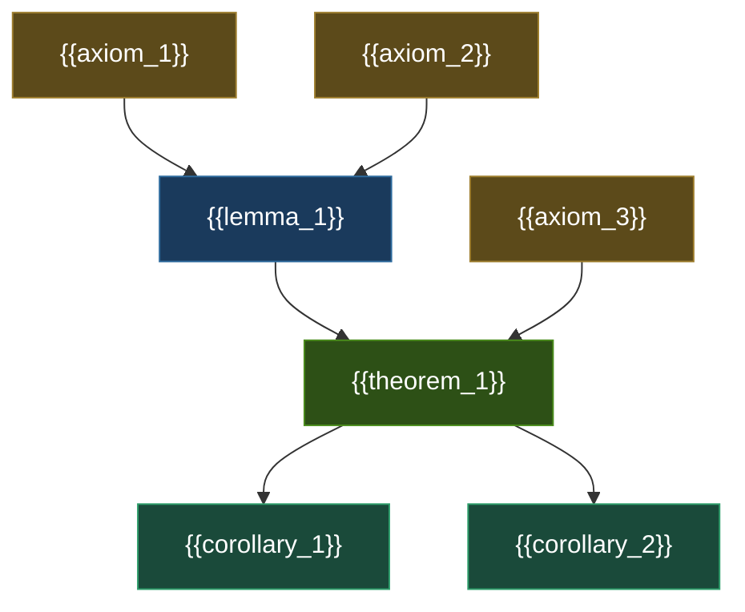
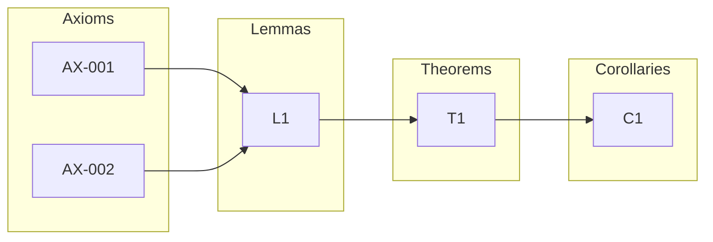

# MATH LAYER TEMPLATE — v0.3 (ONE PER MATH-HEAVY PAPER, SEPARATE API CALL)
**POF 2828 | 2026-09-14 | canonical copy: 999_TEMPLATES/API_LAYER_v0.3**
*Mathematical translation and formalization layer. Own API call under the atomicity rule.
Runs ONLY when paper has significant mathematical content (domain_primary = Mathematics,
content_type = FORMALIZATION, or paper contains equations/proofs/formal structures).
Joined to its paper on source_sha256.*

<!-- @template layer=math version=0.3 -->

---

```yaml
---
# identity — joins to paper on source_sha256
type: math_layer
parent_paper_id: "{{paper_id}}"
source_sha256: {{source_sha256}}
paper_uuid: {{paper_uuid}}
template_version: MATH_LAYER_V0.3
generated_at: {{ISO_8601_timestamp}}

# version tracking
is_update: {{true / false}}
updates_canonical: "{{canonical_id_being_updated_or_null}}"
prior_version_sha256: "{{sha256_of_prior_version_or_null}}"
version_number: {{v1 / v2 / v3...}}
change_type: {{NEW / REVISION / RATIFICATION / CORRECTION / EXTENSION}}

# originality
originality_class: {{ORIGINAL / ADAPTED / CLASSICAL / STANDARD}}
original_source: "{{if_borrowed_who_from_and_what_work}}"
adaptation_notes: "{{what_was_changed_from_the_source}}"

# canonization readiness
canonical_eligible: {{true / false}}
canonical_blockers: [{{list_of_what_prevents_canonization}}]
canonical_recommendation: {{ADMIT / HOLD / REJECT / NEEDS_LEAN / NEEDS_REVIEW}}

# audit trail (this call only)
semantic_provider: "{{provider}}"
semantic_model: "{{exact_model_string}}"
call_route: "{{call_N=model (math layer)}}"
usage_tokens: {{prompt_completion_total_cost_object}}
---
```

---

> [!abstract] Math Layer Identity
>
> | Field | Value |
> |---|---|
> | **Paper** | {{clean_title}} |
> | **Math density** | {{HIGH / MEDIUM / LOW}} — {{count}} equations, {{count}} proofs, {{count}} definitions |
> | **Originality** | {{ORIGINAL / ADAPTED / CLASSICAL / STANDARD}} |
> | **Updates canonical** | {{canonical_id or "NEW — no prior version"}} |
> | **Change type** | {{NEW / REVISION / RATIFICATION / CORRECTION / EXTENSION}} |
> | **Canonical eligible** | {{yes/no}} — {{reason}} |

---

## Axiom Inventory

<!-- What does this paper ASSUME vs. DERIVE? Every axiom, postulate, definition,
     and assumption gets one row. This is the foundation audit. -->

> [!warning] Axiom and Assumption Registry
>
> | ID | Statement | Type | Status | Originality | Source |
> |---|---|---|---|---|---|
> | AX-001 | {{axiom_text}} | {{axiom / postulate / definition / assumption / convention}} | {{PRIMITIVE / DERIVED / BORROWED / STANDARD}} | {{ORIGINAL / CLASSICAL:<source> / STANDARD}} | {{where_it_comes_from}} |
> | AX-002 | {{statement}} | {{type}} | {{status}} | {{originality}} | {{source}} |
> <!-- Every axiom. No cap. -->
>
> **Totals:** {{count}} axioms · {{count}} original · {{count}} borrowed · {{count}} standard

---

## Equation-by-Equation Breakdown (Three-Layer Rule)

<!-- MANDATORY: every equation in the paper gets the three-layer treatment.
     Layer 1: the equation itself (LaTeX).
     Layer 2: term-by-term translation (what each symbol means).
     Layer 3: plain-English meaning (what it SAYS about reality).
     Then: status and failure mode. -->

> [!info] Equation Registry
>
> ### EQ-001
>
> > [!quote] Layer 1 — Equation
> > $${{equation_latex}}$$
>
> > [!abstract] Layer 2 — Term-by-Term
> > | Symbol | Meaning | Domain | Units / Type |
> > |---|---|---|---|
> > | {{symbol}} | {{meaning}} | {{which_domain_this_lives_in}} | {{units_or_type}} |
>
> > [!success] Layer 3 — Plain English
> > {{What this equation SAYS in one sentence a non-mathematician can understand.}}
>
> | Status | Failure mode | Originality | Prior art |
> |---|---|---|---|
> | {{COHERENT_TESTED / COHERENT_UNTESTED / DEFECTIVE / DECORATIVE}} | {{what_breaks_if_wrong}} | {{ORIGINAL / ADAPTED / CLASSICAL:<source>}} | {{nearest_prior_art}} |
>
> ---
>
> ### EQ-002
>
> > [!quote] Layer 1 — Equation
> > $${{equation_latex}}$$
>
> > [!abstract] Layer 2 — Term-by-Term
> > | Symbol | Meaning | Domain | Units / Type |
> > |---|---|---|---|
> > | {{symbol}} | {{meaning}} | {{domain}} | {{units_or_type}} |
>
> > [!success] Layer 3 — Plain English
> > {{Plain meaning.}}
>
> | Status | Failure mode | Originality | Prior art |
> |---|---|---|---|
> | {{status}} | {{failure_mode}} | {{originality}} | {{prior_art}} |

<!-- Continue EQ-003, EQ-004... for every equation. No cap. -->

> **Equation completeness check**: {{count}} equations extracted. Equations in source not extracted: {{list or "none"}}.

---

## Notation Dictionary

> [!info] Complete Notation Reference
>
> | Symbol | Name | Definition | First appears | Domain |
> |---|---|---|---|---|
> | {{symbol}} | {{name}} | {{definition}} | {{EQ-### or section}} | {{domain}} |
> <!-- Every symbol used in the paper. Alphabetical. -->
>
> **Notation conflicts:** {{list any symbols used with multiple meanings, or "none"}}

---

## Proof Structure Map

<!-- The logical skeleton: what's assumed, what's proved, what follows. -->

> [!warning] Proof Architecture



<!-- Replace with actual proof structure. 
     Color: gold = axiom/assumption, blue = lemma, green = theorem, teal = corollary -->

> | Step | Type | Statement | Depends on | Status | Originality |
> |---|---|---|---|---|---|
> | L1 | Lemma | {{lemma_statement}} | AX-001, AX-002 | {{PROVED / CLAIMED / SKETCH / FAILED}} | {{ORIGINAL / CLASSICAL:<source>}} |
> | T1 | Theorem | {{theorem_statement}} | L1, AX-003 | {{status}} | {{originality}} |
> | C1 | Corollary | {{corollary_statement}} | T1 | {{status}} | {{originality}} |
> <!-- Every proof step. -->

---

## Mathematical Dependencies

<!-- Which results depend on which? If lemma 2 falls, what's exposed? -->

> [!danger] Dependency Graph
>
> | From | Relation | To | If FROM falls |
> |---|---|---|---|
> | {{result_id}} | {{requires / uses / extends / contradicts}} | {{result_id}} | {{what_breaks — INERT / LOCAL / STRUCTURAL}} |



---

## Lean Encoding Targets

<!-- What from this paper should go to the Lean Floor? -->

> [!success] Lean Pipeline
>
> | Target ID | Statement to encode | Visible premises | Encoding difficulty | Priority | Status |
> |---|---|---|---|---|---|
> | LT-001 | {{theorem_or_invariant}} | {{what_must_be_visible}} | {{EASY / MEDIUM / HARD / RESEARCH}} | {{HIGH / MEDIUM / LOW}} | {{NOT_ESTABLISHED / TARGET_QUEUED / ENCODING / PROOF_ATTEMPT / RECEIPTED / FAILED}} |
>
> > [!caution] Encoding Boundary
> > {{What CANNOT be encoded in Lean and why. What would a Lean receipt actually prove vs. what people might think it proves.}}

---

## Version History

<!-- If this is an update, what changed? -->

> [!important] Version Tracking
>
> | Version | Date | Change type | What changed | What was preserved | SHA-256 |
> |---|---|---|---|---|---|
> | v1 | {{date}} | {{NEW}} | {{original}} | — | {{sha256}} |
> | v2 | {{date}} | {{REVISION / RATIFICATION / CORRECTION}} | {{what_changed}} | {{what_stayed}} | {{sha256}} |

> [!question]- Is this a ratification?
> {{Is this paper attempting to ratify (confirm/strengthen) an existing canonical result?
> If yes: what canonical ID? What new evidence/proof does it bring?
> If no: is it novel work, or a correction/revision?}}

---

## Canonization Readiness

> [!important] Canon Gate Check
>
> | Gate | Status | Notes |
> |---|---|---|
> | **All axioms identified** | {{PASS / FAIL}} | {{notes}} |
> | **All equations three-layered** | {{PASS / FAIL}} | {{notes}} |
> | **Proof structure complete** | {{PASS / FAIL}} | {{notes}} |
> | **No DEFECTIVE equations** | {{PASS / FAIL}} | {{list any}} |
> | **No DECORATIVE equations** | {{PASS / FAIL}} | {{list any}} |
> | **Kill condition stated** | {{PASS / FAIL}} | {{notes}} |
> | **Lean target identified** | {{PASS / FAIL}} | {{notes}} |
> | **Originality marked on every step** | {{PASS / FAIL}} | {{notes}} |
> | **No unresolved notation conflicts** | {{PASS / FAIL}} | {{notes}} |
> | **Human review** | {{PENDING / PASS / FAIL}} | {{notes}} |
>
> **Canon recommendation:** {{ADMIT / HOLD / REJECT / NEEDS_LEAN / NEEDS_REVIEW}}
> **Blockers:** {{list or "none"}}

---

## Math Translation Layer

<!-- The bridge between formal content and human understanding.
     This is where we make sure the math actually SAYS something
     and isn't just symbols on a page. -->

> [!quote] Translation Summary
>
> **In one paragraph, what does the mathematics in this paper establish?**
> {{plain_language_summary_of_all_math_content}}
>
> **What can the math prove that words alone cannot?**
> {{what_formalization_adds}}
>
> **What can words say that the math cannot capture?**
> {{what_formalization_loses}}

> [!abstract] Translation Manifest
>
> | | |
> |---|---|
> | **Preserved** | {{what_survives_translation_from_informal_to_formal}} |
> | **Lost** | {{what_is_lost_in_formalization}} |
> | **Introduced** | {{what_the_formal_language_adds_that_wasnt_in_the_original}} |

---

## Layer Integrity

> [!warning] Completeness Checks
>
> | Check | Value |
> |---|---|
> | Total equations | {{count}} |
> | Equations with three-layer treatment | {{count}} |
> | Equations missing layers | {{list or "none"}} |
> | Total axioms/assumptions | {{count}} |
> | Axioms with originality marked | {{count}} |
> | Proof steps | {{count}} |
> | Proof steps with status | {{count}} |
> | Lean targets identified | {{count}} |
> | Notation conflicts | {{count or "none"}} |
> | DEFECTIVE equations | {{count or "none"}} |
> | DECORATIVE equations | {{count or "none"}} |
> | Version: is update | {{true/false}} |
> | Version: updates canonical | {{id or "N/A"}} |
> | Canon recommendation | {{recommendation}} |

---

_POF 2828 · not a probability of truth · human ruling required_

<!-- @template layer=math version=0.3 end -->
