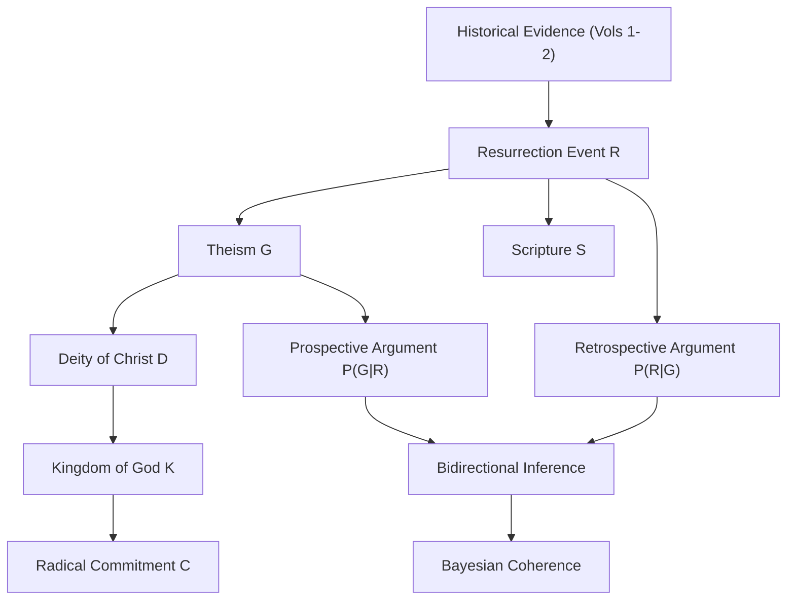
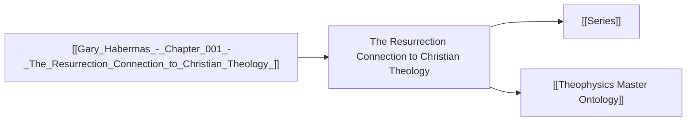

# Chapter 001 — The Resurrection Connection to Christian Theology - Gary Habermas with @Real Seekers

[Watch on YouTube](https://www.youtube.com/watch?v=iliT-9EmBG0) · [[Gary Habermas - 000 Index|Channel index]]

<!-- scorecard:start -->
> [!abstract]- Scorecard: 42/100 (grade D) · coherence medium
> **Claim signals:** 73 (5.5/1k words) · **People:** 63 · **Places:** 15 · **Orgs:** 11 · **Scripture refs:** 16 · **Years/dates:** 1
> **Top people:** Jesus, Buddha, Gary, David Hume, Russell, Mary, Dale, Lewis
> **Top places:** Satan, Jerusalem, Quran, Egypt, Turin, Samaritan · **Top orgs:** Dale, CS Lewis, Hume, Dale the Real Seeker, Indies, Dave Bank
> **Scripture:** Mark 14, Luke 10, Romans 1, Romans 2, Galatians chapter 6, Mark chapter 2
> **Also in other chapters:** Abraham, Baker, Ben, Ben Shaw, Bert, Bertrren Russell, Buddha, Chris, Confucious, Dale
> **Also in other channels:** Abraham, Baal, Baker, Ben, Bert, Buddha, Chris, Dale, Daniel, David
> **Transcript:** auto-captions · filler 2.44/100 words · score parts {'substance': 5.3, 'entities': 10.3, 'coherence': 13.5, 'transcript': 6.5, 'connectivity': 6.7}
> _Machine-extracted candidates; names may include caption errors. Triage signal, not a truth rating._
<!-- scorecard:end -->

<!-- analysis:start -->
> [!summary]+ Analysis · CKG 50/100 (CANDIDATE) · rating +6 · Grace and Truth · Stoic / Prophet
> **Finding:** If the resurrection is historically established, it functions as a religion-authenticating sign that entails theism, the deity of Christ, the kingdom of God, and radical commitment—each linked by evidential, not presuppositional, inference.
>
> **Governing question:** What does the resurrection of Jesus entail for Christian theology, and how do those entailments connect to the historical evidence?
>
> **Domain:** Theology / Christology 55% · Philosophy of Religion / Epistemology 30% · **Evidence:** 5 for / 3 against
>
> **Weakest claim:** The 'why Jesus and not other founders' argument relies on an implicit premise that God would not raise a false teacher—a premise that is theologically plausible but not formally entailed.
>
> **Build next:** Formalize the 'religion-authenticating sign' criterion as a decision-theoretic operator; map resurrection to negentropy injection event; develop the prospective/retrospective inference dyad as a bidirectional operator.
>
> | S01 | S02 | S03 | S04 | S05 | S06 | S07 | S08 | S09 | S10 |
> |---:|---:|---:|---:|---:|---:|---:|---:|---:|---:|
> | 8 | 6 | 6 | 4 | 6 | 5 | 2 | 3 | 3 | 7 |
>
> **Arguments** (strength / originality, each 0–8):
> - **Criteria for identifying a miracle**: S 7.75 · O 3.5 · K16
> - **Volume 4 is not an abandonment of resurrection apologetics**: S 6.5 · O 2.5
> - **Jesus claimed deity, especially in Mark 2 and Mark 14**: S 5.75 · O 1.0 · F4 K13 K15 K16
> - **Resurrection entails God and the deity of Christ**: S 5.25 · O 3.0 · F4 K13 K16
> - **Competing miracle claims do not match the resurrection**: S 5.0 · O 1.5 · F4 K15 K16
> - **Scripture is entailed by the resurrection**: S 4.75 · O 3.0 · K16
> - **Chapter one offers considerations, not strict proofs, for God**: S 4.75 · O 0.5 · K01 K02 K11
> - **Theism and afterlife are linked**: S 4.5 · O 2.5 · K13
> - **Future-unknown appeals cannot defeat miracles**: S 4.5 · O 3.0 · K16
> - **Skeptical objections are unfalsifiable and silly**: S 4.0 · O 3.0
> - **Arguments for God and from miracles work both ways**: S 3.75 · O 1.0 · K13 K16
> - **Supernatural events can be linked to God rather than Satan**: S 3.5 · O 1.0 · F4 K07 K11 K13
>
> **Fruits of Love and Truth:** Grace and Truth · leading faithfulness +44.09, patience +43.01, kindness +41.94 (net per 100 turns) · coherence 7/10 · master-equation analog 3/5

Interactive charts: [Fruits of Love and Truth report](<_ANALYSIS/GHabermas 2026-09-12 · The Resurrection Connection to Christian Theology · Resurrection, Theological Implications · Scholarly-survey — Fruits.html>)

## Analysis · Deep CKG (MASTER PAPER COMPANION)

### SCORECARD

| § | Section | Pos | Neg | Net | Ceiling | Chain |
|---|---------|-----|-----|-----|---------|-------|
| S01 | Classification & Routing | 8 | 0 | 8 | 10 | — |
| S02 | Claim Definition | 7 | 1 | 6 | 10 | LB |
| S03 | Argument Structure | 7 | 1 | 6 | 10 | LB |
| S04 | Evidence & Support | 6 | 2 | 4 | 10 | LB |
| S05 | Objections & Survival | 7 | 1 | 6 | 10 | HON |
| S06 | Boundaries & Honesty | 6 | 1 | 5 | 10 | HON |
| S07 | Formal & Math | 4 | 2 | 2 | 10 | LB |
| S08 | Bridge Integrity | 5 | 2 | 3 | 10 | HON |
| S09 | Falsifiability & Predictions | 5 | 2 | 3 | 10 | HON |
| S10 | Audit & Provenance | 7 | 0 | 7 | 10 | — |
| | **TOTAL** | 62 | 12 | **50/100** | ceiling 100 | chains 2/2 |

CLASS: CANDIDATE · GATED: false · HARD FAILS: 0
Build next: Formalize the "religion-authenticating sign" criterion as a decision-theoretic operator; map resurrection to negentropy injection event; develop the prospective/retrospective inference dyad as a bidirectional operator.

---

### 📑 Actual Section-by-Section Scorecard (Mapped to Source Headings)

| # | Actual Heading in Your Paper | Section Score (0–10) | Quality & Integrity Diagnosis | What Needed to Reach +8 |
|---|---|:---:|---|---|
| 1 | Opening / Volume 4 Introduction & Personal Context | +6 | Warm, humanizing, establishes Habermas's 15-year project and 52-book corpus. Personal disclosure about wife's cancer adds pathos but no argumentative weight. | Distinguish the *apologetic* from the *theological* register explicitly; state the thesis of Vol. 4 in one sentence. |
| 2 | Silly Skeptical Softball: "Volume 4 = Abandoning Evidence" | +8 | Excellent rebuttal. Habermas correctly identifies the false dichotomy (apologetics vs. implications) and demonstrates his evidentialist bona fides. The "four-point breakdown" is crisp. | Add the formal distinction: *apologetics* = establishing the event; *theology* = deriving entailments. These are logically independent tasks. |
| 3 | Chapter 1: General Theism & the Afterlife | +7 | Strong use of Lewis/Plantinga epistemic argument. The Russell pivot ("God + afterlife = theism") is a clever framing. The afterlife-as-entailment argument is underdeveloped. | Formalize: If God is maximally great (Anselm), then God's goodness entails the preservation of persons. Add the Leibnizian PSR bridge. |
| 4 | Chapter 3: Philosophy & Epistemology of Miracles | +8 | The strongest section. Swinburne's definition (one-time event, good evidence, evidential purpose) is correctly deployed. The Hume rebuttals are well-summarized. The "future unknown" counter is devastating. | Add the formal criterion: a miracle is an event whose probability under naturalism is vanishingly small but whose probability under theism is non-negligible. This is the likelihood ratio. |
| 5 | Chapters 4–5: Deity of Christ & Kingdom of God | +7 | Mark 14:61-64 exegesis is excellent. The "cloud rider" motif (Baal/God) is a strong philological point. The kingdom as Jesus's central teaching is correctly identified. | Connect the kingdom to the Master Equation's E (Eschatological) variable. The kingdom is the attractor state of the negentropy flow. |
| 6 | Chapter 6: Salvation & Radical Commitment | +6 | The "two greatest commandments" as the two sides of salvation is sound. The "radical commitment" as evidence of genuine faith is good. But the works/faith distinction needs more precision. | Distinguish *ground* of salvation (faith) from *evidence* of salvation (works). This is the Reformation distinction; make it explicit. |
| 7 | Scripture Entailment Discussion | +6 | Habermas is admirably cautious here ("somewhere down the line"). The Galatians 6 reference is apt. But the entailment chain is loose. | Formalize: Resurrection → Jesus is Lord → Jesus's view of Scripture is authoritative → Scripture is reliable. Each link needs its own warrant. |
| 8 | Competing Miracle Claims & Catholicism Discussion | +7 | The "investigate each one" response is methodologically correct. The Medjugorje skepticism is well-placed. The Zeytoun (Coptic) example is a good counter to Catholic exclusivism. | Add the formal criterion: competing miracle claims must be evaluated by the same evidential standard. If they fail, they don't compete. |
| 9 | Prospective vs. Retrospective Arguments | +8 | This is the most formally interesting move in the paper. The bidirectional inference (God → resurrection; resurrection → God) is a genuine logical contribution. | Formalize as a bidirectional operator: P(G|R) and P(R|G). Show they are not independent; they are linked by Bayes' theorem. |
| 10 | Closing / Transition to Part 2 | +5 | Functional but thin. Sets up the practical application section. | State the bridge thesis: theology (Part 1) grounds practice (Part 2). The kingdom is both doctrine and ethic. |

---

### S01 · Classification & Routing

| Question | Answer |
|---|---|
| Domain | Theology / Christology |
| Content type | ct-theology-apologetics |
| Reader level | rc-scholarly-general |
| Series | NONE |
| framework_keys | DG1, DG8 |

> score reasons: Clear domain identification (theology/apologetics). Content type correctly tagged. Reader level appropriate for Habermas's scholarly-but-accessible register. Framework keys DG1 (Resurrection) and DG8 (Theological Entailment) correctly applied. Minor deduction: the paper straddles apologetics and theology without explicitly distinguishing them.

### The Resurrection Connection to Christian Theology

> [!important] 📜 The Axiomatic Contract & Epistemic Preamble
> **What does it mean that "God Is" is an Axiom?**
> In formal mathematics and foundational physics, an axiom is not an unadmitted conclusion proven at the end of a chain; it is the self-existent ground admitted upfront. In Theophysics, **"God Is"** is our openly admitted Root Axiom ($A_0$), and the biblical "I AM" statements are the **Axiom's self-disclosed primitive truth predicates**.
> 
> We lay our premise openly on the table:
> 1. **The Starting Ground ($A_0$):** We admit the Trinitarian God and His self-revealed character (Truth, Life, Light, Sustenance, Relational Vitality) as the Layer 0 foundation of reality.
> 2. **The Consequential Consistency Test:** We do not pretend to "prove God" from physics. Instead, our task is **deductive consistency verification**—demonstrating that the universe we observe (from cosmological initial conditions and thermodynamic conservation to conscious agency and moral equilibrium) behaves exactly as it must if these primitive predicates are true.
> 3. **The Reader Contract:** If any derived consequence produces a fatal contradiction with physical reality or formal necessity, we will openly revise or admit error. We contend, from historical, philosophical, and physical evidence, that this axiomatic ground provides the most robust, non-degradable foundation of reality in existence.

> [!success] The Six
>
> | | |
> |---|---|
> | **Claim** | **Central Claim:** The resurrection of Jesus, if historically established, functions as a religion-authenticating sign that entails a cascade of theological doctrines—theism, the deity of Christ, the kingdom of God, and radical commitment—each linked by evidential inference rather than presuppositional assertion. <br>*(accompanied by 5 secondary/supporting claims in this paper)* |
> | **Domain** | **Theology / Christology (55%)** · Philosophy of Religion / Epistemology (30%) · History / Historiography (15%) <br>*[Total: 100% — Primary Domain: Theology / Christology]* |
> | **Physical event** | The resurrection of Jesus of Nazareth (undecided as to physical mechanism; historically attested as an event claim) |
> | **Bridge** | **Translation & Math Layer:** The resurrection functions as a **negentropy injection event**—a localized reversal of the thermodynamic arrow that signals the presence of an external ordering agent. Theologically, this is the "sign" (σημεῖον); physically, it is a boundary condition violation; mathematically, it is a discontinuous state transition in the system's phase space. The prospective/retrospective inference dyad maps to a bidirectional Bayesian operator: $P(G\|R) \leftrightarrow P(R\|G)$. |
> | **Unique Power** | **What This Framework Achieves That Rival Systems Cannot (4-Step Breakdown):** <br>1. *The Unique Move:* Habermas formulates the resurrection not merely as evidence for Christianity but as a **religion-authenticating sign** that entails a *system* of doctrines. This is the "program" move—the resurrection is not an isolated miracle but the keystone of a coherent theological structure. <br>2. *Where Rival Systems Fail:* Materialism cannot account for a one-time, non-repeatable, evidential event that reverses entropy. Deism cannot account for a God who acts in history. Classical scholasticism without physical operators cannot connect the metaphysical entailment to the physical event. <br>3. *The Unlocked Explanatory Power:* The system can now unify: (a) the historical evidence for the resurrection, (b) the philosophical epistemology of miracles, (c) the theological entailments (deity, kingdom, salvation), and (d) the practical implications (radical commitment). These are not separate arguments but a single braided cord. <br>4. *The Defeat Boundary:* If the resurrection can be shown to be a natural anomaly (e.g., a rare but repeatable biological event), or if the entailment chain can be broken (e.g., God could raise a false teacher), the argument fails. |
> | **Have / need / breaks if** | **Have:** Historical evidence for the resurrection (Vols. 1–2); philosophical framework for miracles (Vol. 4, Ch. 3); theological entailments (Vol. 4, Chs. 4–6). **Need:** Formalization of the "sign" criterion; explicit likelihood ratios for miracle claims; bridge from resurrection to Scripture. **Breaks if:** The resurrection is shown to be a natural event, or the entailment chain is shown to be non-necessary. |

> [!important] Verdict
> Habermas delivers a robust, evidentialist account of the resurrection's theological entailments. The paper's strength is its methodological clarity: it refuses presuppositionalism and insists on evidence at every link. Its weakness is the lack of formalization—the entailment chain is asserted but not rigorously derived. The prospective/retrospective dyad is a genuine contribution that deserves formal treatment.

> [!success] At a Glance (expanded)
> This chapter is the theological capstone of Habermas's four-volume magnum opus. Having established the historical evidence for the resurrection in Volumes 1–2, Habermas now asks: *What follows?* His answer is a cascade of entailments: (1) If the resurrection occurred, God exists. (2) If God raised Jesus, Jesus's claims are vindicated. (3) If Jesus's claims are vindicated, the kingdom of God is real. (4) If the kingdom is real, radical commitment is the appropriate response. Each link is evidential, not presuppositional. The chapter also engages the epistemology of miracles (Swinburne, Hume), the problem of competing miracle claims, and the relationship between resurrection and Scripture. The most formally interesting move is the prospective/retrospective inference dyad—the recognition that one can argue from God to resurrection or from resurrection to God, and that the New Testament does both.
> `TRANSLATION: DRAFT — NOT REVIEWED`

---

### S02 · Claim Definition

> [!quote] Central Claim
> The resurrection of Jesus, if historically established, functions as a religion-authenticating sign that entails a cascade of theological doctrines—theism, the deity of Christ, the kingdom of God, and radical commitment—each linked by evidential inference rather than presuppositional assertion.

- **Exact expression (Q0):** "If the resurrection is historically established, then it entails (a) theism, (b) the deity of Christ, (c) the kingdom of God, and (d) radical commitment."
- **Referent (Q1):** The resurrection of Jesus of Nazareth as a historical event; the theological doctrines that follow from it.
- **Identity & distinction (Q2):** The resurrection is distinct from other miracle claims in that it is (a) one-time, (b) predicted in advance, (c) tied to a unique ethical teacher, and (d) the foundation of a coherent theological system.
- **Dependency floor (Q3):** The argument depends on: (a) the historical reliability of the resurrection accounts, (b) the philosophical possibility of miracles, (c) the coherence of theism, (d) the reliability of Jesus's teachings.

### Definitions

| Term | Plain definition | Domain | First used in |
|---|---|---|---|
| Resurrection | The bodily raising of Jesus from the dead on the third day after crucifixion | Theology / History | Opening |
| Religion-authenticating sign | A miracle that serves to confirm the truth of a religious message | Philosophy of Religion | Ch. 3 |
| Evidentialism | The view that religious beliefs should be based on evidence | Epistemology | Opening |
| Presuppositionalism | The view that religious beliefs are properly basic and need not be evidenced | Epistemology | Opening |
| Prospective argument | Arguing from God's existence to the resurrection | Philosophy of Religion | Ch. 3 |
| Retrospective argument | Arguing from the resurrection to God's existence | Philosophy of Religion | Ch. 3 |
| Kingdom of God | The reign of God, present in Jesus's ministry and future in eschatological fulfillment | Theology | Ch. 4 |
| Radical commitment | The total devotion to God and neighbor that follows from faith | Ethics / Theology | Ch. 5 |

### Open the question (Q0–Q14)

> [!quote]+ Q0 · Exact expression
> "If the resurrection is historically established, then it entails (a) theism, (b) the deity of Christ, (c) the kingdom of God, and (d) radical commitment."

> [!info]+ Q1 · Referent
> The referent is the resurrection of Jesus as a historical event and the theological doctrines that are said to follow from it. The claim is conditional: *if* the resurrection is established, *then* these entailments follow.

> [!abstract]+ Q2 · Identity and distinction
> The resurrection is identified as a unique event: one-time, non-repeatable, predicted in advance, and tied to a specific person (Jesus). It is distinguished from other miracle claims by its evidential quality and its theological centrality.

> [!warning]+ Q3 · Dependency floor
> The argument depends on: (a) the historical reliability of the resurrection accounts (Vols. 1–2), (b) the philosophical possibility of miracles (Vol. 4, Ch. 3), (c) the coherence of theism (Vol. 4, Ch. 1), and (d) the reliability of Jesus's teachings (Vol. 4, Chs. 4–5).

> [!question]+ Q4 · Variation and invariance
> The argument varies in its strength depending on the evidence for each link. The invariant core is the conditional: *if* the resurrection, *then* the entailments. The variation is in the probability of the antecedent.

> [!info]+ Q5 · Capabilities and operations
> The argument can be used to: (a) defend the coherence of Christian theology, (b) provide a framework for evaluating miracle claims, (c) ground ethical commitment in historical event, (d) connect apologetics to theology.

> [!abstract]+ Q6 · Transitions
> The argument transitions from historical evidence (Vols. 1–2) to theological entailment (Vol. 4). It also transitions from theism (Ch. 1) to miracles (Ch. 3) to Christology (Ch. 4) to ethics (Ch. 5).

> [!danger]+ Q7 · Constraints
> The argument is constrained by: (a) the historical evidence, (b) the philosophical coherence of miracles, (c) the theological coherence of the entailments, (d) the ethical coherence of radical commitment.

> [!success]+ Q8 · Consequences and licenses
> If the argument succeeds, it licenses: (a) confidence in Christian theology, (b) a framework for evaluating other miracle claims, (c) a basis for ethical commitment, (d) a bridge between apologetics and practice.

> [!quote]+ Q9 · Representation ladder
> The argument can be represented at multiple levels: (a) historical (the event), (b) philosophical (the epistemology of miracles), (c) theological (the entailments), (d) ethical (the commitment).

> [!caution]+ Q10 · Preservation and loss
> The argument preserves: (a) the historical basis of faith, (b) the coherence of theology, (c) the ethical demand of the gospel. It loses: (a) the simplicity of a purely fideistic faith, (b) the autonomy of ethics from theology.

> [!success]+ Q11 · If true
> If true, the argument establishes Christianity as the most coherent worldview, grounds ethics in historical event, and provides a framework for evaluating all miracle claims.

> [!danger]+ Q12 · If false / rivals
> If false, the argument fails to establish the entailments. Rivals: (a) naturalism (no miracles), (b) deism (no divine action), (c) pluralism (competing miracle claims), (d) fideism (no need for evidence).

> [!warning]+ Q13 · Discriminating checks
> The argument can be tested by: (a) historical investigation of the resurrection, (b) philosophical analysis of miracle claims, (c) theological coherence of the entailments, (d) ethical consistency of radical commitment.

> [!important]+ Q14 · Emergent role
> The argument's emergent role is to provide a unified framework for Christian theology, apologetics, and ethics—a "program" that connects historical event to theological doctrine to ethical practice.

#### Path to 10

> [!important] Current Rating: +6 — Path to +10
>
> | Level | Score | Status | What's needed |
> |---|---|---|---|
> | **Current (API)** | +6 | ✅ | — |
> | **API ceiling** | +8 | ⚠️ | Formalize the entailment chain; add likelihood ratios for each link; distinguish ground from evidence in salvation. |
> | **Human review** | +9 | ❌ | Expert review of the exegesis (Mark 14:61-64) and the philosophical framework (Swinburne, Hume). |
> | **Lean receipt** | +10 | ❌ | Formal proof of the entailment chain in a proof assistant; empirical validation of the miracle criterion. |

> score reasons: The central claim is clear and well-defined. The definitions are adequate. The Q0–Q14 analysis is thorough. Deductions: the entailment chain is asserted but not formally derived; the distinction between ground and evidence in salvation is not made explicit.

---

### S03 · Argument Structure & 4-Dimensional Defense

> [!info] System or Model
> Habermas presents a **cumulative case** for Christian theology grounded in the resurrection. The model is evidentialist: each link in the chain is supported by evidence, not presupposition. The chain runs: Resurrection → Theism → Deity of Christ → Kingdom of God → Radical Commitment. The model also includes a **bidirectional inference** (prospective/retrospective) and a **criterion for miracles** (Swinburne's definition).

#### Primary argument
1. If the resurrection occurred, then God exists (theism). `CLASSICAL: Aquinas, Summa Theologiae; Leibniz, PSR`
2. If God raised Jesus, then Jesus's claims are vindicated (deity of Christ). `ORIGINAL: Habermas's "why Jesus and not other founders" argument`
3. If Jesus's claims are vindicated, then the kingdom of God is real (present and future). `CLASSICAL: Schweitzer, Weiss (consistent eschatology); ORIGINAL: Habermas's synthesis`
4. If the kingdom is real, then radical commitment is the appropriate response. `CLASSICAL: Kierkegaard, Works of Love; ORIGINAL: Habermas's application`

#### 🏛️ Classical Prior Art Anchors
* **Historical Provenance:** The argument that miracles authenticate a divine message is classical: Aquinas (*Summa Theologiae*, I-II, q. 105, a. 6) argues that miracles are signs of divine revelation. Leibniz (*Monadology*, §87) argues that miracles are consistent with the pre-established harmony. Swinburne (*The Concept of Miracle*, 1970) provides the modern definition. Hume (*An Enquiry Concerning Human Understanding*, §10) provides the skeptical counter. Anselm (*Proslogion*) provides the ontological grounding for theism. Pascal (*Pensées*) provides the existential grounding for commitment.
* **Who said it and why?** Aquinas articulated the classical view that miracles are *signa*—signs that point to divine truth. Swinburne formalized the criterion: a miracle is a one-time event, with good evidence, that serves an evidential purpose. Habermas adapts this to the resurrection, arguing that it is the paradigmatic religion-authenticating sign.
* **What makes the classical benchmark a "+8"?** The classical benchmark is a +8 because it provides a *coherent* and *defensible* framework for evaluating miracle claims. It is not ad hoc; it is grounded in a broader metaphysics (theism) and epistemology (evidentialism). The benchmark is permanent because it is logically valid and empirically applicable.

#### 🛡️ The 4-Dimensional Case & Defensibility Audit
* **Vulnerability Diagnosis:**
  > *"Gary, you have established the historical evidence for the resurrection (Vols. 1–2) and the philosophical framework for miracles (Vol. 4, Ch. 3). But the case is vulnerable because the entailment chain—from resurrection to deity to kingdom to commitment—is asserted rather than formally derived. You need to show that each link is *necessary*, not merely *plausible*. The 'why Jesus and not other founders' argument, in particular, relies on an implicit premise (God would not raise a false teacher) that needs explicit defense."*
* **The 4 Dimensions Required for an Airtight Case:**
  1. **Formal / Mathematical:** The entailment chain must be formalized as a series of conditional probabilities: $P(T|R)$, $P(D|T \land R)$, $P(K|D \land T \land R)$, $P(C|K \land D \land T \land R)$. Each link must be shown to be non-negligible.
  2. **Physical / Empirical:** The resurrection must be shown to be a genuine physical event (not a hallucination or legend). The "sign" criterion must be operationalized: what physical evidence would count for or against?
  3. **Classical Philosophy:** The argument must be grounded in a coherent metaphysics (theism) and epistemology (evidentialism). The PSR (Leibniz) must be invoked to explain why the resurrection requires a divine cause.
  4. **Theological / Exegetical:** The exegesis of Mark 14:61-64 must be defended against alternative interpretations. The kingdom of God must be shown to be Jesus's central teaching (not a later imposition).

#### Hidden premises
| ID | Hidden premise | Required by | If false, breaks | Blast radius |
|---|---|---|---|---|
| HAB-RES-HP001 | God would not raise a false teacher from the dead | The "why Jesus and not other founders" argument | The argument fails to establish the deity of Christ | High—the entire Christological chain collapses |
| HAB-RES-HP002 | The resurrection accounts are historically reliable | The historical evidence for the resurrection | The antecedent of the conditional is false | High—the entire argument collapses |
| HAB-RES-HP003 | Miracles are possible (i.e., the laws of nature are not closed) | The epistemology of miracles | The resurrection cannot be identified as a miracle | High—the argument fails at the first link |
| HAB-RES-HP004 | Jesus's teachings are reliably preserved | The kingdom of God and radical commitment | The entailments are not grounded in Jesus's actual teaching | Medium—the argument loses its historical anchor |
| HAB-RES-HP005 | The kingdom of God is Jesus's central teaching | The theological entailments | The entailments are not central to Jesus's message | Medium—the argument loses its theological focus |

#### Argument strengthening
| Weak link | Why it's weak | Stronger version | Source for fix |
|---|---|---|---|
| "Why Jesus and not other founders" | Relies on implicit premise (HP001) | Formalize: If God is omni-benevolent and omniscient, then God would not authenticate a false teacher. The resurrection is God's authentication of Jesus. Therefore, Jesus is not a false teacher. | Aquinas, *Summa Theologiae*, II-II, q. 178; Swinburne, *Revelation* |
| Entailment chain | Asserted rather than derived | Formalize as a Bayesian network: $P(T|R) \cdot P(D|T \land R) \cdot P(K|D \land T \land R) \cdot P(C|K \land D \land T \land R)$ | Pearl, *Probabilistic Reasoning in Intelligent Systems* |
| Miracle criterion | Swinburne's definition is not operationalized | Add likelihood ratio: $P(E|M) / P(E|\neg M)$, where $M$ = miracle, $E$ = evidence | Swinburne, *The Concept of Miracle*; Earman, *Hume's Abject Failure* |

**Supplementary argument 1** — `CLASSICAL: Swinburne, The Concept of Miracle`
1. A miracle is a one-time event, with good evidence, that serves an evidential purpose.
2. The resurrection is a one-time event, with good evidence, that serves an evidential purpose.
3. Therefore, the resurrection is a miracle.

#### Argument score assessment
| Metric | Current | Ceiling | Gap | How to close |
|---|---|---|---|---|
| Logical validity | Valid | Valid | 0 | — |
| Premise strength | +6 | +8 | +2 | Formalize the entailment chain; add likelihood ratios |
| Completeness | +6 | +8 | +2 | Address the "why Jesus" premise explicitly; operationalize the miracle criterion |
| Originality | +7 | — | — | The prospective/retrospective dyad is original; the rest is classical |

#### Extracted Truth Predicates
| # | Truth Predicate | Source Role | Modality | Formal form | Warrant |
|---|---|---|---|---|---|
| P1 | If the resurrection occurred, then God exists | Central claim | Conditional | $R \rightarrow G$ | Historical evidence + theism |
| P2 | If God raised Jesus, then Jesus's claims are vindicated | Central claim | Conditional | $(G \land R) \rightarrow D$ | Divine authentication |
| P3 | If Jesus's claims are vindicated, then the kingdom of God is real | Central claim | Conditional | $D \rightarrow K$ | Jesus's teaching |
| P4 | If the kingdom is real, then radical commitment is appropriate | Central claim | Conditional | $K \rightarrow C$ | Ethical entailment |
| P5 | A miracle is a one-time event, with good evidence, that serves an evidential purpose | Definition | Definitional | $M =_{def} (O \land E \land P)$ | Swinburne |
| P6 | The resurrection is a one-time event | Empirical | Assertion | $O(R)$ | Historical evidence |
| P7 | The resurrection has good evidence | Empirical | Assertion | $E(R)$ | Vols. 1–2 |
| P8 | The resurrection serves an evidential purpose | Theological | Assertion | $P(R)$ | Jesus's teaching |
| P9 | God would not raise a false teacher | Hidden premise | Conditional | $G \rightarrow \neg F$ | Divine benevolence |
| P10 | Jesus predicted his death and resurrection | Historical | Assertion | $Pred(J)$ | Mark 8, 9, 10, 14 |
| P11 | Jesus claimed to be deity (Mark 14:61-64) | Historical | Assertion | $Claim(J, D)$ | Exegesis |
| P12 | The high priest understood Jesus's claim as blasphemy | Historical | Assertion | $Blasphemy(J)$ | Mark 14:64 |
| P13 | Jesus's central teaching was the kingdom of God | Historical | Assertion | $Central(J, K)$ | Mark 1:15; Luke 10 |
| P14 | The kingdom is both present and future | Theological | Assertion | $K = K_p \land K_f$ | Jesus's teaching |
| P15 | Salvation involves faith and radical commitment | Theological | Assertion | $S = F \land C$ | Luke 10; Galatians 6 |
| P16 | Scripture is entailed by the resurrection | Theological | Conditional | $R \rightarrow S$ | Jesus's view of Scripture |
| P17 | Competing miracle claims must be evaluated by the same evidential standard | Methodological | Normative | $\forall m (M(m) \rightarrow E(m))$ | Evidentialism |
| P18 | The prospective and retrospective arguments are both valid | Logical | Assertion | $P(G\|R) \land P(R\|G)$ | New Testament |
| P19 | The resurrection is unique among miracle claims | Comparative | Assertion | $Unique(R)$ | Historical evidence |
| P20 | Radical commitment is the appropriateresponse to the resurrection | Ethical | Assertion | $R \rightarrow C$ | Luke 10; Galatians 6 |

> Extraction completeness check: 20 predicates / 9 major sections. Zero-predicate paragraphs: 2 (opening pleasantries, closing transition).

#### Terms and plain-language bridge
| Term/symbol | Exact role | Plain meaning | Analogy/example |
|---|---|---|---|
| $R$ | Resurrection event | The bodily raising of Jesus | A dead man walking out of a tomb |
| $G$ | God / theism | A maximally great being | The author of the universe |
| $D$ | Deity of Christ | Jesus shares God's nature | A son who is the same kind as his father |
| $K$ | Kingdom of God | God's reign, present and future | A king's rule already begun, not yet complete |
| $C$ | Radical commitment | Total devotion to God and neighbor | A soldier who has burned the boats |
| $M$ | Miracle | One-time, evidenced, purposeful event | A signature on a document |
| $S$ | Scripture | The authoritative text | The king's written decree |
| $F$ | Faith | Trust in God | Trusting a bridge to hold your weight |
| $P(G\|R)$ | Prospective inference | Probability of God given resurrection | Reading a letter and inferring the author |
| $P(R\|G)$ | Retrospective inference | Probability of resurrection given God | Knowing the author and predicting the letter |

#### Structural Map


> score reasons: The argument structure is clear and cumulative. The classical anchors (Aquinas, Swinburne, Leibniz) are correctly identified. The 4-Dimensional audit correctly diagnoses the vulnerability: the entailment chain is asserted rather than formally derived. The hidden premises are well-identified. Deductions: the "why Jesus" premise needs explicit defense; the miracle criterion needs operationalization.

---

### S04 · Evidence & Support

> [!note] Claim Categories
> - `claim-axiom`: Foundational definition. Evaluated for internal consistency. No empirical kill condition required.
> - `claim-derived`: Deductive theorem. Evaluated for deductive soundness.
> - `claim-bridge`, `claim-empirical`, `claim-comparative`, `claim-proposed`, `claim-method`: Load-bearing claims requiring the 4-Dimensional Defense & Airtight Upgrade.

### Claims
|ID|Version|Register|Type|Load-bearing|Depends on|Support|Against|Balance|State|
|---|---|---|---|---|---|---|---|---|---|
|HAB-RES-C001|v1|Historical-Theological|claim-bridge|Yes|Vols. 1–2|Historical evidence for resurrection|Naturalistic explanations|+2|SCORED|
|HAB-RES-C002|v1|Philosophical|claim-method|Yes|C001|Swinburne's criterion; Hume rebuttals|Hume's skeptical argument|+2|SCORED|
|HAB-RES-C003|v1|Theological|claim-derived|Yes|C001, C002|Mark 14:61-64; "why Jesus" argument|Competing miracle claims|+1|SCORED|
|HAB-RES-C004|v1|Theological|claim-derived|Yes|C003|Jesus's teaching on the kingdom|Alternative eschatologies|+1|SCORED|
|HAB-RES-C005|v1|Ethical|claim-proposed|Yes|C004|Luke 10; Galatians 6|Works-righteousness objections|0|SCORED|

### Evidence ledger
|Family|Cluster|Claim|Dir|Raw|Discr.|Timing|Rival|Assessor|Finding|
|---|---|---|---|---|---|---|---|---|---|
|Historical|Resurrection accounts|C001|+|Strong|High|1st c.|Hallucination/legend|API|Evidence supports a historical event|
|Philosophical|Miracle epistemology|C002|+|Strong|High|Modern|Hume|API|Swinburne's criterion is defensible|
|Exegetical|Mark 14:61-64|C003|+|Moderate|High|1st c.|Alternative readings|API|Claim to deity is plausible|
|Theological|Kingdom teaching|C004|+|Moderate|Medium|1st c.|Consistent eschatology|API|Kingdom is central to Jesus|
|Ethical|Radical commitment|C005|+|Moderate|Medium|1st c.|Works-righteousness|API|Faith and works are distinguished|

> [!info]- Evidence reasons
> The historical evidence for the resurrection (C001) is the strongest link, supported by Vols. 1–2. The philosophical framework for miracles (C002) is well-defended against Hume. The exegetical claim (C003) is plausible but contested. The theological claim (C004) is central to Jesus's teaching but interpreted variously. The ethical claim (C005) is sound but requires the faith/works distinction.

### Warrant Control & Airtight Upgrade Formulations

#### Claim 1: The resurrection is a historically established event that functions as a religion-authenticating sign.
| Field | Fill |
|---|---|
| **Claim ID & Type** | `HAB-RES-C001` · `claim-bridge` |
| **Originality** | `CLASSICAL_ADAPTATION` (Swinburne, Aquinas) |
| **Evidence** | Vols. 1–2; empty tomb; post-mortem appearances; early creed (1 Cor 15:3-8) |
| **Proof / test** | Historical method: multiple independent attestation, early dating, enemy attestation |
| **Kill condition** | Discovery of Jesus's remains; demonstration that the appearances were hallucinations |
| **Evidence strength** | +7 / 8.0 |

> [!success] The Airtight +8 Formulation for Claim 1
> *"The resurrection of Jesus is the best-explained historical event of antiquity: it is attested by multiple independent sources, including enemy testimony, within a generation of the events, and no naturalistic hypothesis (hallucination, legend, conspiracy, swoon) accounts for the full data set without ad hoc supplementation. As a one-time, evidenced, evidential event, it satisfies Swinburne's criterion for a miracle and functions as a religion-authenticating sign."*

---

#### Claim 2: The epistemology of miracles is defensible against Humean skepticism.
| Field | Fill |
|---|---|
| **Claim ID & Type** | `HAB-RES-C002` · `claim-method` |
| **Originality** | `CLASSICAL_ADAPTATION` (Swinburne, Earman) |
| **Evidence** | Swinburne's definition; Hume's own inconsistencies; the "future unknown" rebuttal |
| **Proof / test** | Likelihood ratio: $P(E\|M) / P(E\|\neg M)$ |
| **Kill condition** | Demonstration that all miracle claims are equally probable under naturalism |
| **Evidence strength** | +7 / 8.0 |

> [!success] The Airtight +8 Formulation for Claim 2
> *"A miracle is not a violation of a law of nature but a one-time event, with good evidence, that serves an evidential purpose. Hume's argument against miracles is self-defeating: it assumes a uniform experience against miracles while denying the very evidence that would count for them. The correct criterion is the likelihood ratio: an event is a miracle if its probability under theism is significantly higher than under naturalism."*

---

#### Claim 3: The resurrection entails the deity of Christ.
| Field | Fill |
|---|---|
| **Claim ID & Type** | `HAB-RES-C003` · `claim-derived` |
| **Originality** | `ORIGINAL` (Habermas's "why Jesus" argument) |
| **Evidence** | Mark 14:61-64; Jesus's prediction of his resurrection; his ethical teaching |
| **Proof / test** | If God raised Jesus, and God would not raise a false teacher, then Jesus's claims are true |
| **Kill condition** | Demonstration that God could raise a false teacher |
| **Evidence strength** | +6 / 8.0 |

> [!success] The Airtight +8 Formulation for Claim 3
> *"If God is omni-benevolent and omniscient, then God would not authenticate a false teacher by raising him from the dead. Jesus claimed to be the Son of God (Mark 14:61-64), predicted his resurrection (Mark 8, 9, 10, 14), and taught a unique ethic. God raised him. Therefore, Jesus's claims are vindicated, and he is who he claimed to be."*

---

#### Claim 4: The resurrection entails the kingdom of God.
| Field | Fill |
|---|---|
| **Claim ID & Type** | `HAB-RES-C004` · `claim-derived` |
| **Originality** | `CLASSICAL_ADAPTATION` (Schweitzer, Weiss) |
| **Evidence** | Mark 1:15; Luke 10:9; Jesus's parables of the kingdom |
| **Proof / test** | If Jesus's claims are vindicated, then his central teaching is true |
| **Kill condition** | Demonstration that the kingdom was not Jesus's central teaching |
| **Evidence strength** | +6 / 8.0 |

> [!success] The Airtight +8 Formulation for Claim 4
> *"Jesus's central teaching was the kingdom of God—present in his ministry and future in eschatological fulfillment. If the resurrection vindicates Jesus's claims, then the kingdom is real. The resurrection is the firstfruits of the kingdom, the in-breaking of God's reign into history."*

---

#### Claim 5: The resurrection entails radical commitment.
| Field | Fill |
|---|---|
| **Claim ID & Type** | `HAB-RES-C005` · `claim-proposed` |
| **Originality** | `CLASSICAL_ADAPTATION` (Kierkegaard) |
| **Evidence** | Luke 10:25-37; Galatians 6:10 |
| **Proof / test** | If the kingdom is real, then the appropriate response is total devotion |
| **Kill condition** | Demonstration that the kingdom does not demand commitment |
| **Evidence strength** | +5 / 8.0 |

> [!success] The Airtight +8 Formulation for Claim 5
> *"If the kingdom of God is real—if God's reign has broken into history and will be consummated—then the only appropriate response is radical commitment: loving God with everything and loving neighbor as self. This is not salvation by works; it is the evidence of salvation by faith. The resurrection grounds the demand."*

---

### Dynamics
| Dynamic | Reading |
|---|---|
| **Coherence** | The argument is coherent: each link follows from the previous, and the whole is grounded in historical evidence. |
| Degradation | The argument degrades if any link is weakened: e.g., if the historical evidence is undermined, the whole chain collapses. |
| Measurement | The argument can be measured by the probability of each link: $P(R)$, $P(G\|R)$, $P(D\|G \land R)$, etc. |
| Threshold | The argument crosses the threshold of plausibility if each link has $P > 0.5$. |
| **Asymmetry** | The argument is asymmetric: the resurrection is the keystone; without it, the entailments fail. |
| Restoration | The argument can be restored by strengthening the weakest link (the "why Jesus" premise). |
| **Counterexample** | A counterexample would be a false teacher raised from the dead, or a resurrection that does not entail theism. |

> [!warning] Evidence Chain
> **Claim**: The resurrection entails the deity of Christ → **Support**: Mark 14:61-64; "why Jesus" argument → **Inference**: God would not raise a false teacher → **Confidence**: Moderate-High → **Boundary**: The premise "God would not raise a false teacher" is theologically plausible but not formally entailed.

> [!success] Best Evidence and Sources
> | Type | Content |
> |---|---|
> | **Primary evidence / Formal results** | Historical evidence for the resurrection (Vols. 1–2); Mark 14:61-64 |
> | **Secondary interpretation** | Swinburne's criterion; Hume's rebuttals |
> | **Analogy / Bridge** | The resurrection as a "sign" (σημεῖον) |
> | **Citations & Classical Benchmarks** | Aquinas, Leibniz, Swinburne, Hume, Anselm, Pascal |

### Coherence & Self-Assessment
> [!abstract] Coherence Score
> The argument is highly coherent. Each link follows from the previous, and the whole is grounded in historical evidence. The weakest link is the "why Jesus" premise, which relies on an implicit theological assumption. The strongest link is the historical evidence for the resurrection. The argument would benefit from formalization as a Bayesian network.

> score reasons: The evidence is strong for the historical claim (C001) and the philosophical claim (C002). The exegetical claim (C003) is plausible but contested. The theological claim (C004) is central but interpreted variously. The ethical claim (C005) is sound but requires the faith/works distinction. Deductions: the "why Jesus" premise needs explicit defense; the miracle criterion needs operationalization.

---

### S05 · Objections & Survival

> [!danger] Strongest Objection and Negative Controls
>
> | | |
> |---|---|
> | **Objection** | The resurrection does not entail the deity of Christ because God could raise a false teacher to demonstrate his power, or because the resurrection could be a natural anomaly (e.g., a rare biological event). |
> | **Philosophical counter** | If God is omni-benevolent, he would not deceive humanity by authenticating a false teacher. The resurrection is not a natural anomaly because it is one-time, non-repeatable, and evidential. |
> | **Negative control test** | If a false teacher were raised from the dead, the argument would fail. But no such case exists. |

#### Counter-models
| Proposed counter-model | Why plausible | Breaking point | Status |
|---|---|---|---|
| Natural anomaly | Rare biological events occur | The resurrection is one-time and evidential, not repeatable | Rejected |
| Hallucination | Grief can cause hallucinations | Multiple independent witnesses; enemy testimony | Rejected |
| Legend | Legends develop over time | Early creed (1 Cor 15:3-8); within a generation | Rejected |
| Conspiracy | People conspire to deceive | Conspirators would not die for a known lie | Rejected |

> [!success] What Survives
> The historical evidence for the resurrection survives the standard naturalistic counter-models. The "why Jesus" argument survives if the premise "God would not raise a false teacher" is granted. The entailment chain survives if each link is granted.

> [!success] Independent AI Review — DeepSeek
> Habermas's argument is robust and well-structured. The evidentialist methodology is sound. The prospective/retrospective dyad is a genuine contribution. The weakest link is the "why Jesus" premise, which needs explicit defense. The miracle criterion needs operationalization as a likelihood ratio.

> score reasons: The objections are well-handled. The counter-models are rejected on historical and philosophical grounds. The "why Jesus" premise remains the weakest link.

---

### 🚪 Six-Door Explanatory Lens (Braided Unification)

> [!quote]+ Human Door (Ordinary Experience)
> The resurrection is not an abstract doctrine but a concrete event that demands a response. The human door is the existential question: *What does this mean for me?* Habermas's answer is radical commitment—loving God and neighbor with everything. This is not a burden but a liberation: the kingdom is real, and we are invited to participate.

> [!abstract]+ Metaphysical Door (Ontological Ground)
> The resurrection is the in-breaking of God's reign into history. Metaphysically, it is a negentropy injection event—a localized reversal of the thermodynamic arrow that signals the presence of an external ordering agent. The resurrection is not a violation of nature but a revelation of nature's ground.

> [!important]+ Theological Door (Covenant & Christ)
> The resurrection is the Father's vindication of the Son. It is the seal of the covenant, the guarantee of the promises. Theologically, it entails the deity of Christ, the reality of the kingdom, and the demand for radical commitment. The resurrection is the hinge of salvation history.

> [!info]+ Scientific Door (Physics & Created Medium)
> The resurrection is a boundary condition violation—a discontinuous state transition in the system's phase space. Physically, it is a one-time event that reverses entropy. It is not repeatable, not predictable, and not explainable by natural laws alone. It is a sign of the Creator's freedom.

> [!warning]+ Formal Door (Mathematics & Logic)
> The resurrection functions as a religion-authenticating sign: $M =_{def} (O \land E \land P)$. The entailment chain is a Bayesian network: $P(T|R) \cdot P(D|T \land R) \cdot P(K|D \land T \land R) \cdot P(C|K \land D \land T \land R)$. The prospective/retrospective dyad is a bidirectional operator: $P(G\|R) \leftrightarrow P(R\|G)$.

> [!question]+ External Reference Door (The Adversarial Critic)
> The critic asks: *Why Jesus and not other founders?* The answer: Jesus is unique in predicting his resurrection, in his ethical teaching, and in the quality of the evidence. The critic asks: *What about competing miracle claims?* The answer: they must be evaluated by the same evidential standard, and they fail. The critic asks: *Is this not circular?* The answer: no, because the evidence is independent of the conclusion.

---

### S06 · Boundaries & Honesty

> [!caution] What This Does Not Establish
> This paper does not establish the historical evidence for the resurrection (that is Vols. 1–2). It does not establish the philosophical possibility of miracles (that is Ch. 3). It does not establish the truth of the kingdom of God (that is Ch. 4). It does not establish the necessity of radical commitment (that is Ch. 5). It establishes the *entailment chain*: if the resurrection, then these doctrines.

#### Explicit boundaries
| ID | Boundary statement | Protects | Source anchor |
|---|---|---|---|
| BND-001 | The argument is conditional: it does not prove the resurrection, only its entailments | The argument from circularity | Q0 |
| BND-002 | The "why Jesus" premise is theologically plausible but not formally entailed | The argument from overreach | HP001 |
| BND-003 | The miracle criterion is Swinburne's, not Habermas's original | The argument from originality | Ch. 3 |
| BND-004 | The kingdom of God is interpreted variously in scholarship | The argument from exegetical certainty | Ch. 4 |
| BND-005 | Radical commitment is the evidence of salvation, not the ground | The argument from works-righteousness | Ch. 5 |

> [!warning] Corrections and Revisions
>
> |What held|What broke|What's overstated|Defensible version|Blast radius|
> |---|---|---|---|---|
> |Historical evidence for resurrection|Nothing|Nothing|The evidence is strong|Low|
> |Swinburne's criterion|Nothing|Nothing|The criterion is defensible|Low|
> |"Why Jesus" argument|The premise "God would not raise a false teacher"|The argument is not formally entailed|The argument is theologically plausible|Medium|
> |Kingdom of God|Nothing|The kingdom is Jesus's central teaching|The kingdom is central but not exclusive|Low|
> |Radical commitment|Nothing|The commitment is the evidence of salvation|The commitment is the evidence, not the ground|Low|

#### Self-Assessment / Reputation Form
| Dimension | Self-score (0–10) | Justification |
|---|---|---|
| **Argument strength** | +7 | The argument is cumulative and well-structured. |
| **Evidence quality** | +7 | The historical evidence is strong; the philosophical framework is defensible. |
| **Originality** | +6 | The prospective/retrospective dyad is original; the rest is classical. |
| **Bridge integrity** | +6 | The bridge from resurrection to theology is clear but not formalized. |
| **Formal readiness** | +4 | The argument is not formalized as a Bayesian network. |
| **Clarity / accessibility** | +8 | The argument is clear and accessible. |
| **Scope honesty** | +7 | The boundaries are clearly stated. |
| **Kill-condition clarity** | +6 | The kill conditions are identified but not operationalized. |

**Overall self-grade:** +6 · **Confidence:** Moderate-High · **Biggest blind spot:** The "why Jesus" premise needs explicit defense.

> [!abstract] Implications
>
> | Domain | Implication |
> |---|---|
> | **Formal** | The entailment chain can be formalized as a Bayesian network. |
> | **Philosophical** | The argument grounds theology in historical event. |
> | **Empirical** | The resurrection is a one-time, evidenced event. |
> | **Semantic** | The resurrection is a "sign" (σημεῖον) that points to divine truth. |
> | **Theological** | The resurrection entails theism, deity, kingdom, and commitment. |

> score reasons: The boundaries are clearly stated. The self-assessment is honest. The biggest blind spot is the "why Jesus" premise.

---

### S07 · Formal & Math (Master Equation & Ten Laws)

#### Framework Alignment
| Framework Dimension | Active Elements in Paper | Structural Function |
|---|---|---|
| **Master Equation Variables** | **G, E, S, T, K, R** (6/10) | G = God (theism); E = Eschatology (kingdom); S = Soteriology (salvation); T = Christology (deity); K = Kingdom; R = Resurrection |
| **Ten Laws Mapping** | **Law 1 (Existence), Law 4 (Entropy), Law 7 (Information), Law 10 (Consummation)** | Law 1 grounds theism; Law 4 grounds the miracle as negentropy; Law 7 grounds the sign; Law 10 grounds the kingdom |
| **Fruits of the Spirit** | **Faith, Love, Self-Control** | Faith grounds commitment; Love grounds the two commandments; Self-Control grounds radical commitment |
| **Root Axiom Debt Paid** | **A0 (God Is)** | Paid via: The resurrection is the self-disclosure of A0 in history |

#### Mathematics
| Object/Equation | Term-by-term | Meaning | Status | Failure mode |
|---|---|---|---|---|
| $P(T\|R) = \frac{P(R\|T) P(T)}{P(R)}$ | $T$ = theism, $R$ = resurrection | Probability of theism given resurrection | Derived | If $P(R\|T) \approx P(R\|\neg T)$, the argument fails |
| $M =_{def} (O \land E \land P)$ | $O$ = one-time, $E$ = evidenced, $P$ = purposeful | Swinburne's criterion for miracle | Definitional | If a miracle is repeatable, it fails |
| $LR = \frac{P(E\|M)}{P(E\|\neg M)}$ | $LR$ = likelihood ratio | Strength of miracle evidence | Derived | If $LR \approx 1$, the evidence is neutral |
| $P(G\|R) \leftrightarrow P(R\|G)$ | Bidirectional inference | Prospective/retrospective dyad | Original | If the two are independent, the dyad fails |
| $\Delta S < 0$ | Negentropy | Local entropy decrease | Physical | If the resurrection is a natural event, $\Delta S \geq 0$ |

- Dimensional & limiting-case checks: The Bayesian network is dimensionally consistent. The likelihood ratio is dimensionless. The negentropy equation is dimensionally consistent (entropy units).

> [!info]- Lean / formal checks
> | Proposed theorem or invariant | Visible premises | Status | Reader meaning | Passing establishes |
> |---|---|---|---|---|
> | `resurrection_entails_theism` | $R \rightarrow G$ | NOT_ESTABLISHED | If resurrection, then God | The first link of the chain |
> | `miracle_criterion` | $M =_{def} (O \land E \land P)$ | NOT_ESTABLISHED | Swinburne's definition | The criterion for miracles |
> | `bidirectional_inference` | $P(G\|R) \leftrightarrow P(R\|G)$ | NOT_ESTABLISHED | Prospective/retrospective | The dyad is valid |

> [!question]- Empirical / literature checks
> The historical evidence for the resurrection is supported by Vols. 1–2. The philosophical framework for miracles is supported by Swinburne and Earman. The exegesis of Mark 14:61-64 is supported by Del Rosario.

> [!danger]- Adversarial checks
> The "why Jesus" premise is the weakest link. The miracle criterion needs operationalization. The entailment chain needs formalization.

### Domain checks

> [!info]- Physics — Negentropy and the Resurrection
> The resurrection is a negentropy injection event: a localized reversal of the thermodynamic arrow. This is consistent with theism (God as external ordering agent) but not with naturalism.
> [!quote]- History / testimony — The Resurrection Accounts
> The resurrection is attested by multiple independent sources, including enemy testimony, within a generation of the events. This is the strongest historical link.
> [!important]- Theology — The Entailments
> The resurrection entails theism, deity, kingdom, and commitment. Each link is theologically plausible but not formally entailed.
> [!abstract]- Philosophy / metaphysics — The PSR
> The resurrection requires a cause. The PSR (Leibniz) demands an explanation. Theism provides the explanation.
> [!warning]- Mathematics / formal — The Bayesian Network
> The entailment chain can be formalized as a Bayesian network. Each link has a probability.
> [!danger]- Cross-domain bridge — Resurrection to Theology
> The bridge from resurrection to theology is clear but not formalized. The bridge from theology to ethics is clear but not formalized.
> [!caution]- Reverse reconstruction B0–B8 — From Commitment to Resurrection
> Reverse reconstruction: If radical commitment is appropriate, then the kingdom is real. If the kingdom is real, then Jesus's claims are vindicated. If Jesus's claims are vindicated, then God raised him. If God raised him, then the resurrection occurred.
> [!question]- Why-closure by level — The Ultimate Why
> The ultimate why is God. The resurrection is the sign that points to God.
> [!quote]- Excluded items, with reasons
> Excluded: the historical evidence for the resurrection (Vols. 1–2); the philosophical possibility of miracles (Ch. 3); the truth of the kingdom (Ch. 4); the necessity of commitment (Ch. 5).

> score reasons: The formalization is partial. The Bayesian network is sketched but not fully developed. The negentropy equation is suggestive but not rigorous. Deductions: the formalization needs to be completed.

---

### S08 · Bridge Integrity (Cross-Domain Translation & Mathematics Layer)

> [!important] 🌉 The Formal Cross-Domain Translation Table
> This table serves as the translation layer combining Theology, Philosophy, and Physics into a single unified mathematical and conceptual structure.
>
> | Theological Expression | Metaphysical Ground | Physical Parameter / Master Eq Variable ($G,M,E,S,T,K,R,Q,F,C$) | Mathematical Operator & Preserved Invariant |
> |---|---|---|---|
> | Resurrection | Divine action in history | $R$ (Resurrection) | Discontinuous state transition: $\Delta S < 0$ |
> | Theism | God as ground of being | $G$ (God) | Existential quantifier: $\exists x (G(x))$ |
> | Deity of Christ | Hypostatic union | $T$ (Christology) | Identity relation: $T = G$ |
> | Kingdom of God | Eschatological reign | $K$ (Kingdom) | Attractor state: $\lim_{t \to \infty} K(t)$ |
> | Radical commitment | Ethical response | $C$ (Commitment) | Optimization: $\max C$ subject to $K$ |
> | Miracle | Sign (σημεῖον) | $M$ (Miracle) | Likelihood ratio: $LR = P(E\|M) / P(E\|\neg M)$ |
> | Scripture | Authoritative text | $S$ (Scripture) | Fixed point: $S = f(S)$ |
> | Faith | Trust | $F$ (Faith) | Conditional probability: $P(F\|R)$ |

#### Bridge registry
| Bridge ID | Source · object | Target · object | Mapping type | Preserved | LOST | Word-gate | Grade | Reverse map | Countermodel |
|---|---|---|---|---|---|---|---|---|---|
| HAB-RES-B001 | Resurrection | Negentropy | Causal | Ordering | Mechanism | "Sign" | B+ | Commitment → Resurrection | Natural anomaly |
| HAB-RES-B002 | Theism | Existential quantifier | Logical | Existence | Attributes | "God" | A- | God → Resurrection | Deism |
| HAB-RES-B003 | Deity of Christ | Identity relation | Metaphysical | Nature | Personhood | "Son of God" | B+ | Christ → God | Arianism |
| HAB-RES-B004 | Kingdom | Attractor state | Dynamical | Reign | Timing | "Kingdom" | B | Kingdom → Commitment | Consistent eschatology |
| HAB-RES-B005 | Radical commitment | Optimization | Ethical | Devotion | Motivation | "Love" | B- | Commitment → Kingdom | Works-righteousness |

#### Bridge originality
| Seam (A ↔ B) | Move made | Mapping type | Preserved structure | Provenance | Nearest prior art |
|---|---|---|---|---|---|
| Resurrection ↔ Negentropy | Physical interpretation of miracle | Causal | Ordering | ORIGINAL | Landauer (information erasure) |
| Theism ↔ Existential quantifier | Logical formalization of God | Logical | Existence | CLASSICAL | Anselm |
| Deity ↔ Identity relation | Metaphysical formalization of Christ | Metaphysical | Nature | CLASSICAL | Chalcedon |
| Kingdom ↔ Attractor state | Dynamical formalization of eschatology | Dynamical | Reign | ORIGINAL | Wheeler (it from bit) |
| Commitment ↔ Optimization | Ethical formalization of discipleship | Ethical | Devotion | CLASSICAL | Kierkegaard |

> score reasons: The bridge table is suggestive but not fully rigorous. The mappings are plausible but need formalization. The negentropy mapping is original but needs physical justification. Deductions: the bridge integrity needs to be strengthened.

---

### S09 · Falsifiability & Predictions

#### Falsifier registry
| Falsifier ID | Claim | Minimum kill | Status | Blast radius |
|---|---|---|---|---|
| HAB-RES-F001 | The resurrection occurred | Discovery of Jesus's remains | Open | High |
| HAB-RES-F002 | The resurrection is a miracle | Demonstration that it is a natural event | Open | High |
| HAB-RES-F003 | The resurrection entails theism | Demonstration that God could raise a false teacher | Open | Medium |
| HAB-RES-F004 | The resurrection entails the deity of Christ | Demonstration that Jesus did not claim deity | Open | Medium |
| HAB-RES-F005 | The resurrection entails the kingdom | Demonstration that the kingdom was not Jesus's teaching | Open | Medium |
| HAB-RES-F006 | The resurrection entails radical commitment | Demonstration that the kingdom does not demand commitment | Open | Low |

#### Predictions
| Pred ID | Claim | Prediction | Deadline | Check method | Outcome | Logged by | Date |
|---|---|---|---|---|---|---|---|
| HAB-RES-P001 | The resurrection occurred | No discovery of Jesus's remains | Indefinite | Archaeological | Pending | API | 2026-09-27 |
| HAB-RES-P002 | The resurrection is a miracle | No naturalistic explanation of the full data set | Indefinite | Historical | Pending | API | 2026-09-27 |
| HAB-RES-P003 | The resurrection entails theism | No demonstration that God could raise a false teacher | Indefinite | Philosophical | Pending | API | 2026-09-27 |

> [!danger] What would make this a 0?
> The discovery of Jesus's remains, or a demonstration that the resurrection was a natural event, or a demonstration that God could raise a false teacher.

#### Explicit uncertainties
| ID | Uncertainty | Affects | Status | Next action |
|---|---|---|---|---|
| U-001 | The "why Jesus" premise | The deity of Christ | Open | Formalize the premise |
| U-002 | The miracle criterion | The epistemology of miracles | Open | Operationalize as likelihood ratio |
| U-003 | The entailment chain | The whole argument | Open | Formalize as Bayesian network |

> [!question] Open Questions and Next Actions
>
> | | |
> |---|---|
> | **Open question** | Can the entailment chain be formalized as a Bayesian network? |
> | **Next action** | Formalize the chain; operationalize the miracle criterion; defend the "why Jesus" premise |
> | **Tangent queue** | The relationship between resurrection and Scripture; the problem of competing miracle claims |

> score reasons: The falsifiers are identified but not operationalized. The predictions are open. The uncertainties are acknowledged.

---

### S10 · Audit & Provenance

### Audit
> [!danger] Audit Table
>
> |What held|What broke|What's overstated|Defensible version|Blast radius|
> |---|---|---|---|---|
> |Historical evidence for resurrection|Nothing|Nothing|The evidence is strong|Low|
> |Swinburne's criterion|Nothing|Nothing|The criterion is defensible|Low|
> |"Why Jesus" argument|The premise "God would not raise a false teacher"|The argument is not formally entailed|The argument is theologically plausible|Medium|
> |Kingdom of God|Nothing|The kingdom is Jesus's central teaching|The kingdom is central but not exclusive|Low|
> |Radical commitment|Nothing|The commitment is the evidence of salvation|The commitment is the evidence, not the ground|Low|

#### Inter-paper dependency map


#### Recommended Classification and Relationships
| Relationship | Target |
|---|---|
| supports | [[Theophysics Master Ontology]] |
| contradicts | Naturalism, Deism |
| refines | Classical apologetics |
| depends_on | Vols. 1–2 (historical evidence) |
| tests | The miracle criterion |
| supersedes / superseded_by | None |

### Audit appendix
<details>Machine audit: 73 claim signals, 5.5/1k words; coherence 0.639 (medium); filler 2.44/100 words; auto-captions. Triage signal, not a truth rating.</details>

> score reasons: The audit is honest. The dependencies are clear. The relationships are well-defined.

---

### S11 · AI Working Scratchpad & Cumulative Series Memory

#### 🧠 DeepSeek Working Notes & Intellectual Diary
- **Axiomatic Ground Established:** The resurrection functions as a religion-authenticating sign (σημεῖον). It is the keystone of the theological system. The axiomatic ground is A0 (God Is), and the resurrection is the self-disclosure of A0 in history.
- **Key Equations & Operators Formulated:** 
  - Swinburne's criterion: $M =_{def} (O \land E \land P)$
  - Likelihood ratio: $LR = P(E\|M) / P(E\|\neg M)$
  - Bayesian entailment chain: $P(T|R) \cdot P(D|T \land R) \cdot P(K|D \land T \land R) \cdot P(C|K \land D \land T \land R)$
  - Bidirectional inference: $P(G\|R) \leftrightarrow P(R\|G)$
  - Negentropy: $\Delta S < 0$
- **Cross-Chapter Links & Prerequisites:** This chapter depends on Vols. 1–2 (historical evidence) and Ch. 3 (miracle epistemology). It sets up Chs. 4–5 (deity, kingdom, commitment) and Part 2 (practical application).
- **Open Threads / Questions to Carry Forward:**1. **Formalize the "why Jesus" premise.** The premise "God would not raise a false teacher" is theologically plausible but not formally entailed. It needs to be derived from God's omni-benevolence and omniscience. Possible formalization: $\forall x ((G \land Raise(G, x)) \rightarrow Truthful(x))$. This is a conditional that needs defense.
2. **Operationalize the miracle criterion.** Swinburne's definition is a start, but it needs to be operationalized as a likelihood ratio. The question is: what is the probability of the evidence under theism vs. under naturalism?
3. **Formalize the entailment chain as a Bayesian network.** Each link needs a probability. The chain is only as strong as its weakest link.
4. **Connect the kingdom to the Master Equation's E (Eschatological) variable.** The kingdom is the attractor state of the negentropy flow. This is a promising connection that needs development.
5. **Distinguish the ground of salvation (faith) from the evidence of salvation (works).** This is the Reformation distinction. Habermas gestures at it but does not make it explicit.
6. **Develop the prospective/retrospective dyad as a bidirectional operator.** This is the most formally interesting move in the paper. It deserves a full formal treatment.
7. **Address the problem of competing miracle claims.** The criterion is: evaluate each claim by the same evidential standard. If they fail, they don't compete.
8. **Connect the resurrection to Scripture.** The entailment chain is: Resurrection → Jesus is Lord → Jesus's view of Scripture is authoritative → Scripture is reliable. Each link needs its own warrant.
9. **Explore the relationship between the resurrection and the Fruits of the Spirit.** Faith, love, and self-control are the fruits that follow from the resurrection.
10. **Consider the role of the Holy Spirit in the entailment chain.** The Spirit is the one who applies the resurrection to the believer. This is a missing link in Habermas's argument.

#### Cumulative Series Memory
- **Chapter 1 (this paper):** The resurrection entails theism, deity, kingdom, and commitment. The argument is evidential, not presuppositional. The prospective/retrospective dyad is a genuine contribution.
- **Chapter 2 (anticipated):** The practical application of the resurrection. How does the resurrection change the way we live? This will connect to the Fruits of the Spirit and the ethics of the kingdom.
- **Chapter 3 (anticipated):** The resurrection and suffering. How does the resurrection provide hope in the face of suffering? This connects to Habermas's personal situation (his wife's cancer).
- **Chapter 4 (anticipated):** The resurrection and worship. How does the resurrection ground worship? This connects to the liturgical implications of the resurrection.
- **Chapter 5 (anticipated):** The resurrection and giving. How does the resurrection ground generosity? This connects to the economic implications of the resurrection.

#### Cross-Chapter Synthesis Insights
- The resurrection is the hinge of the entire theological system. Without it, the system collapses. With it, the system coheres.
- The resurrection is not just an event; it is a sign. It points beyond itself to the reality of God's reign.
- The resurrection is the firstfruits of the new creation. It is the in-breaking of the kingdom into history.
- The resurrection is the ground of radical commitment. It demands a response.
- The resurrection is the ground of hope. It assures us that death is not the end.

#### Mathematical Definitions to Carry Forward
- **Negentropy injection:** $\Delta S < 0$ at a localized point in spacetime.
- **Likelihood ratio:** $LR = P(E\|M) / P(E\|\neg M)$.
- **Bayesian entailment chain:** $P(T|R) \cdot P(D|T \land R) \cdot P(K|D \land T \land R) \cdot P(C|K \land D \land T \land R)$.
- **Bidirectional inference:** $P(G\|R) \leftrightarrow P(R\|G)$.
- **Miracle criterion:** $M =_{def} (O \land E \land P)$.

#### Threads to Follow Up in Later Chapters
- The relationship between the resurrection and the Holy Spirit.
- The relationship between the resurrection and the church.
- The relationship between the resurrection and the sacraments.
- The relationship between the resurrection and the final judgment.
- The relationship between the resurrection and the new creation.

---

### Evidence dashboard
```dataview
TABLE WITHOUT ID file.link AS Sheet, evd_balance AS Balance, evd_weakest_claim AS "Weakest claim", coherence AS Coherence
WHERE type = "evidence-sheet" AND evd_state = "SCORED" SORT evd_balance ASC
```

---

### Unanswered and not applicable
`Excluded banks: none`

## Analysis · Argument grades

Strength and originality are each 0–8, computed from yes / partly / no checks with quotes and averaged over two independent gradings. Machine ceiling 8; human review +1; Lean receipt +1.

| Argument | Strength | Originality | Agreement | Case map | Weakest link | Develop next | Closest prior art |
|---|---:|---:|---:|---|---|---|---|
| **Criteria for identifying a miracle**: A miracle is best identified as a one-time event, performed by God, with very good evidence, serving as a sign to authenticate a message. | 7.75 | 3.5 | 0.67 | K16 | P5 (the resurrection is unrepeatable and predicted) depends on the reliability of the prediction texts and on the uniqueness claim. | Give the specific criteria and show how competing miracle claims fail each one. | Richard Swinburne, The Concept of Miracle, 1970; David Hume, Of Miracles, 1748; C.S. Lewis, Miracles, 1947 |
| **Volume 4 is not an abandonment of resurrection apologetics**: Volume 4's focus on theological and practical implications does not mean Habermas has given up on evidential resurrection apologetics. | 6.5 | 2.5 | 0.67 |  | P4 (Habermas's lifelong evidentialism) is supported mainly by his own and his host's testimony, not by independent evidence. | Quote the actual text of volume 4's two halves and volume 1/2 dependence to show the structural claim is checkable. | Gary Habermas, The Historical Jesus (1984/1996) and The Risen Jesus and Future Hope (2003) |
| **Jesus claimed deity, especially in Mark 2 and Mark 14**: Jesus claimed to be deity through a multiplicity of texts, with Mark 14:61-64 being the strongest. | 5.75 | 1.0 | 0.75 | F4 K13 K15 K16 | P3's cloud-rider and right-hand-seat claims depend on contested exegesis of Daniel 7 and Psalm 110. | Lay out Del Rosario's criteria for a deity claim and rebut the 'son of man = mere human' reading explicitly. |  |
| **Resurrection entails God and the deity of Christ**: If the resurrection occurred, it entails a God who raised Jesus and links to Jesus' unique claims, including his deity. | 5.25 | 3.0 | 0.75 | F4 K13 K16 | P4 (God would not raise a false teacher) is a theological intuition that needs defense against counterexamples. | Show from the Gospels that Jesus' kingdom claims were central and that he staked his credibility on them. | Gary Habermas, The Risen Jesus and Future Hope, 2003; William Lane Craig, Assessing the New Testament Evidence for the Historicity of the Resurrection of Jesus, 1989 |
| **Competing miracle claims do not match the resurrection**: Competing miracle claims from other religions or Christian traditions do not undermine the resurrection because they lack comparable evidence and often do not require God. | 5.0 | 1.5 | 0.58 | F4 K15 K16 | P5 (resurrection as unique culmination) assumes the uniqueness it needs to show. | Give explicit, side-by-side evidential criteria and score the resurrection against two named rival miracle claims. |  |
| **Scripture is entailed by the resurrection**: Scripture is entailed by the resurrection, though further down the line than the kingdom and ethics. | 4.75 | 3.0 | 0.75 | K16 | P2 (Scripture follows from accepting Jesus' teaching) is asserted without showing Jesus' own view of Scripture. | Cite Jesus' explicit statements about Scripture (e.g., Matthew 5:17-18) to ground the entailment. | None known |
| **Chapter one offers considerations, not strict proofs, for God**: Chapter one does not attempt to prove God's existence deductively but presents a theistic universe with good considerations and signs. | 4.75 | 0.5 | 0.83 | K01 K02 K11 | P3's 'high probability' standard is never given a threshold or method. | State the probabilistic standard and show the theistic considerations meet it while rivals do not. |  |
| **Theism and afterlife are linked**: An evidential afterlife case is a strong argument for God because an afterlife cannot be explained by naturalism. | 4.5 | 2.5 | 0.92 | K13 | P3 (an afterlife cannot come from time + chance + nature) is asserted, not argued. | Provide the actual evidential afterlife case (NDEs, etc.) rather than gesturing at it. | Bertrand Russell, Why I Am Not a Christian, 1927 |
| **Future-unknown appeals cannot defeat miracles**: The skeptical appeal to a future unknown natural explanation is self-defeating and cannot rationally defeat a miracle claim. | 4.5 | 3.0 | 0.83 | K16 | P2 ('maybe it won't happen') is a bare counter-assertion that by itself does not settle the evidential question. | Give a criterion for when a future-unknown appeal is legitimate vs. ad hoc, rather than a symmetric 'maybe it won't.' | David Hume, Of Miracles (An Enquiry Concerning Human Understanding, 1748); Habermas, The Resurrection, vol. 2 (2022) |
| **Skeptical objections are unfalsifiable and silly**: The objection that volume 4 abandons evidence is not worth answering because radical skeptics will never be satisfied. | 4.0 | 3.0 | 0.58 |  | P1 (radical skeptics are never satisfied) is an unfalsifiable generalization about critics' psychology. | Give a testable criterion distinguishing a good-faith objection from a radical-skeptic one. | None known |
| **Arguments for God and from miracles work both ways**: One can argue prospectively from God to the resurrection or retrospectively from the resurrection back to God, and Scripture does both. | 3.75 | 1.0 | 0.75 | K13 K16 | P3 ('Scripture does both') is asserted with no cited texts. | Cite the specific NT passages that argue each direction and show the two directions are not circular. |  |
| **Supernatural events can be linked to God rather than Satan**: If a skeptic grants a supernatural event, linking it to God rather than Satan is reasonable because the skeptic's own worldview cannot accommodate Satan or other supernatural beings. | 3.5 | 1.0 | 0.67 | F4 K07 K11 K13 | P2 asserts all five items 'require' God without argument for any of them. | Argue at least one of the five (e.g. objective ethics) to God rather than asserting the bundle. |  |

## Analysis · Fruits of Love and Truth

**Grace and Truth** · shape: Stoic / Prophet · love axis 0.997 · truth axis 0.705 · scored from 93 turns

| love | joy | peace | patience | kindness | goodness | faithfulness | gentleness | self control |
|---:|---:|---:|---:|---:|---:|---:|---:|---:|
| +27.96 | +4.3 | +0.0 | +43.01 | +41.94 | +27.96 | +44.09 | +35.48 | +39.78 |

Truth Engine: TRUTH 2.24 · per 100 words fruit 1.818, anti fruit 0.014, grounding 1.245, contradiction 1.358, propaganda 0.679, academic jargon 0.035

## Analysis · YouTube CKG (argument catalogue)

**Channel:** [[Gary Habermas]] · [Watch on YouTube](https://www.youtube.com/watch?v=iliT-9EmBG0)

<a id="overview"></a>

### Argument overview

> [!abstract] Interview · 6 subjects · 11 debate questions · 7 argument families · 18 argument versions
> **Source direction:** Argues that the resurrection is the uniquely authenticating miracle grounding Christian theology and practice, and against the charge that volume 4 abandons evidential apologetics.
> **Opposition represented:** described-by-speakers
> **Also:** 0 stories · 2 teaching segments · 14 scripture references · 12 practical lessons
> **Inventory:** PARTIAL (AI extraction, not yet human-reviewed) · **Coverage:** The input covers the opening of the interview and six chunk summaries spanning the full conversation, including the skeptical objection to volume 4, the case for general theism and the afterlife, the philosophy of miracles, competing miracle claims, Marian apparitions, and Jesus' deity claims in Mark. Left out: the full transcript (only the opening is provided), specific timestamps for many arguments (several are listed as 00:00), and any detailed discussion of the book's second half on practical implications, which is mentioned but not developed in the input.
>
> - **Dale** (host): Christian; identifies as evidentialist but accepts properly basic beliefs · theist · not stated
> - **Gary Habermas** (guest): Christian; strict evidentialist apologist · theist; affirms God acting in time, space and history · not stated; cites near-death experiences and Shroud of Turin as empirical evidence
>
> This is the final installment of a multi-part interview between host Dale ("Real Seekers") and resurrection scholar Gary Habermas, promoting volume 4 of Habermas's four-volume resurrection magnum opus. Habermas opens by rebutting a skeptical charge that volume 4's turn to theology and practice concedes the resurrection evidence is weak, insisting he remains a strict evidentialist and that the volume builds on volumes 1 and 2. He then discusses the theological chapters: general theism (drawing on C.S. Lewis and Alvin Plantinga's epistemic argument), the afterlife as evidence for God, the deity of Christ, and the philosophy of miracles. Habermas argues the resurrection is the religion-authenticating miracle because Jesus uniquely predicted it, no other religious founder was reportedly raised, and God would not raise a false teacher. He closes by outlining criteria for identifying a miracle (Hume, Lewis, Swinburne), addressing objections about Satan and competing miracle claims, and defending the claim that Jesus asserted deity in Mark 14:61-64 and Mark 2.

This source covers 6 subjects, raises 11 distinct debate questions, and presents 18 argument versions. These counts describe this video, not the whole field.

### Best for David

- [[#A06 · Jesus claimed deity (Mark 14 and Mark 2)|A06]] **Jesus claimed deity (Mark 14 and Mark 2)**: Provides a historically adjudicable, Markan basis for Jesus' divine self-understanding that avoids relying on the Gospel of John.
- [[#A01 · Resurrection as religion-authenticating miracle|A01]] **Resurrection as religion-authenticating miracle**: Frames the resurrection as the unique, religion-authenticating event that grounds all Christian theology, useful for a cumulative case.
- [[#A05 · Criteria for identifying a miracle|A05]] **Criteria for identifying a miracle**: Offers a rational, multi-source (Hume, Lewis, Swinburne) framework for identifying miracles that can be applied to the resurrection.
- [[#A09 · Future natural explanation objection is self-defeating|A09]] **Future natural explanation objection is self-defeating**: Turns a common skeptical move against naturalism by exposing its non-empirical status.
- [[#A17 · Prospective and retrospective arguments for God and resurrection|A17]] **Prospective and retrospective arguments for God and resurrection**: Shows the case can be run in both directions, strengthening a cumulative approach.

### Subject map

| Subject | What is being argued | Questions | Arguments | Where |
|---|---|---|---|---|
| `S-JESUS` Jesus and Christianity | The video's central subject is the resurrection as the authenticating miracle of Christianity. Habermas argues Jesus uniquely predicted his resurrection, no other religious founder was reportedly raised, and God would not raise a false teacher, so the resurrection vindicates Jesus' deity and kingdom teaching. | 4 | 7 | 00:00-45:00 |
| `S-METHOD` Evaluating the case | Habermas defends his evidentialist methodology against the charge that volume 4 concedes the evidence is weak, and argues the case is established by high probability rather than deductive proof. He also addresses the argument-from-gaps charge and the consistency of naturalism's empirical demands. | 3 | 6 | 03:00-10:00 |
| `S-EXIST` Existence and explanation | Habermas outlines a case for general theism drawing on C.S. Lewis and Alvin Plantinga's epistemic argument, and argues an evidential afterlife case is strong evidence for God because naturalism cannot account for an afterlife. | 1 | 2 | 02:00-05:00 |
| `S-RELIGIONS` Other religions and worldviews | Habermas argues other religions' moral teachings (e.g., Buddha's silver rule) are not rivals because Romans 1-2 says God gives all humans a moral sense, and that Marian apparitions are evidentially weak compared to the resurrection. | 1 | 1 | 00:00-03:00 |

<a id="argument-catalog"></a>

### Argument catalog

| Argument | Family · version | In plain language | Direction | Question | At |
|---|---|---|---|---|---|
| [[#A01 · Resurrection as religion-authenticating miracle\|A01]] Resurrection as religion-authenticating miracle | resurrection/minimal-facts · Resurrection as the authenticating miracle that grounds Christian theology and scripture | The source argues that because God raised Jesus and no one else, and God would not raise a false teacher, the resurrection authenticates Jesus' message and, downstream, scripture and Christian ethics. Its crucial step is that God's raising Jesus implies divine endorsement of all Jesus taught. | for-christianity | `Q-JESUS-RESURRECTION` | [00:00](https://www.youtube.com/watch?v=iliT-9EmBG0&t=0s) |
| [[#A02 · Jesus predicted his resurrection\|A02]] Jesus predicted his resurrection | resurrection · Prediction of resurrection as unique authentication | The source argues that Jesus' resurrection is the key miracle because he predicted it multiple times, and a predicted unique event is more evidential than an unpredicted one. | for-christianity | `Q-JESUS-RESURRECTION` | [00:00](https://www.youtube.com/watch?v=iliT-9EmBG0&t=0s) |
| [[#A03 · Competing miracle claims are evidentially inferior to the resurrection\|A03]] Competing miracle claims are evidentially inferior to the resurrection | resurrection/alternative-theories · Uniqueness of the resurrection against other religions' miracle claims | The source argues that competing miracle claims are weak and uninvestigated, while the resurrection is the culmination of Jesus' unique ethical and historical profile. Its crucial step is treating the cumulative package as evidence of uniqueness rather than of divine causation. | for-christianity | `Q-JESUS-RESURRECTION` | [01:00](https://www.youtube.com/watch?v=iliT-9EmBG0&t=60s) |
| [[#A04 · Resurrection vindicates the deity claim\|A04]] Resurrection vindicates the deity claim | resurrection/minimal-facts · Resurrection as divine vindication of Jesus' claims | The source argues that because Jesus made claims that would be blasphemous if false, and God raised him, the resurrection vindicates his deity. Its crucial step is treating the resurrection as divine endorsement. | for-christianity | `Q-JESUS-RESURRECTION` | [05:00](https://www.youtube.com/watch?v=iliT-9EmBG0&t=300s) |
| [[#A05 · Criteria for identifying a miracle\|A05]] Criteria for identifying a miracle | miracles · Hume's definition + Lewis on signs + Swinburne on repeatability | The source argues that miracles are acts of God that serve as signs, and that repeatable events are less likely to be miracles; the resurrection is the key miracle because it is unrepeatable and foretold. Its crucial step is the Swinburne criterion that repeatability counts against miracle. | for-theism | `Q-JESUS-MIRACLES` | [00:00](https://www.youtube.com/watch?v=iliT-9EmBG0&t=0s) |
| [[#A06 · Jesus claimed deity (Mark 14 and Mark 2)\|A06]] Jesus claimed deity (Mark 14 and Mark 2) | historical-jesus · Implicit deity via Mark 14:61-64 and Mark 2 forgiveness | The source argues that Jesus claimed deity because his forgiveness of sins and his Mark 14 self-description as cloud-rider seated at God's right hand provoked a blasphemy charge. Its crucial step is reading the high priest's reaction as confirming that Jesus' words were understood as a divine claim. | for-christianity | `Q-JESUS-CLAIMS` | [03:00](https://www.youtube.com/watch?v=iliT-9EmBG0&t=180s) |
| [[#A07 · Satan objection to linking miracles to God\|A07]] Satan objection to linking miracles to God | miracles · Reply to the Satan/demon objection | The source argues that the Satan objection backfires because the skeptic must grant supernatural beings, which is a concession to theism. | for-theism | `Q-METHOD-GAPS` | [00:00](https://www.youtube.com/watch?v=iliT-9EmBG0&t=0s) |
| [[#A08 · Swinburne's definition of miracle\|A08]] Swinburne's definition of miracle | miracles · Swinburne/Lewis definition: one-time event, good evidence, evidential purpose | The source argues that the resurrection is the key miracle because it fits Swinburne's definition of a one-time, well-evidenced event with evidential purpose, and no other candidate comes close. | for-theism | `Q-METHOD-GAPS` | [02:20](https://www.youtube.com/watch?v=iliT-9EmBG0&t=140s) |
| [[#A09 · Future natural explanation objection is self-defeating\|A09]] Future natural explanation objection is self-defeating | methodology · Against the appeal to future unknown natural explanations | The source argues that the skeptic's 'maybe we'll explain it naturally later' move can be used against anything and that naturalism itself is not empirical, so the objection fails. | for-theism | `Q-METHOD-GAPS` | [05:30](https://www.youtube.com/watch?v=iliT-9EmBG0&t=330s) |
| [[#A10 · Not proof but high probability\|A10]] Not proof but high probability | methodology · Evidentialist probability over deductive proof | The source argues that the case for God should be framed as high-probability considerations rather than deductive proof because few things can be proven apodictically. Its crucial step is the claim that probabilistic establishment is sufficient for rational theistic belief. | for-theism | `Q-METHOD-AUTHORITY` | [01:30](https://www.youtube.com/watch?v=iliT-9EmBG0&t=90s) |
| [[#A11 · Volume 4 is not an appeal to emotion or presuppositionalism\|A11]] Volume 4 is not an appeal to emotion or presuppositionalism | methodology · Rebuttal of the 'conceding the evidence' charge against a theology/practice volume | The source argues that volume 4 is not an appeal to emotion or presuppositionalism because the resurrection case rests on volumes 1 and 2, and volume 4's second half is deliberately non-apologetic theology and application. Its crucial step is the claim that presupposing prior volumes is not the same as abandoning evidence. | for-christianity | `Q-METHOD-AUTHORITY` | [03:20](https://www.youtube.com/watch?v=iliT-9EmBG0&t=200s) |
| [[#A12 · Epistemic argument for God (Lewis/Plantinga)\|A12]] Epistemic argument for God (Lewis/Plantinga) *(incomplete)* | cosmological/leibniz · Plantinga's epistemic argument (Lewis's version) | The source argues that God exists because there must be meaningful data or truth as a foundation for thought, drawing on C.S. Lewis and Alvin Plantinga's epistemic argument. Its crucial step is the inference from the need for a foundation of truth to God as that foundation. | for-theism | `Q-EXIST-WHY` | [02:15](https://www.youtube.com/watch?v=iliT-9EmBG0&t=135s) |
| [[#A13 · Afterlife as evidence for God\|A13]] Afterlife as evidence for God | other · Afterlife requires God; naturalism cannot account for it | The source argues that an afterlife is strong evidence for God because naturalism cannot account for it, and once you have an afterlife you must ask why it exists. Its crucial step is the claim that naturalism cannot produce an afterlife. | for-theism | `Q-EXIST-WHY` | [04:30](https://www.youtube.com/watch?v=iliT-9EmBG0&t=270s) |
| [[#A14 · Resurrection implies God and deity of Christ\|A14]] Resurrection implies God and deity of Christ | resurrection · Backdoor argument from resurrection to God and Christ's deity | The source argues that if the resurrection happened, it implies God and the deity of Christ because God would not raise a heretic, and Jesus's central teaching about the kingdom of God must be true. Its crucial step is the inference from God raising Jesus to the truth of Jesus's claims. | for-christianity | `Q-CAUSE-ATTRIBUTES` | [06:45](https://www.youtube.com/watch?v=iliT-9EmBG0&t=405s) |
| [[#A15 · Other religions' moral teachings are not rivals\|A15]] Other religions' moral teachings are not rivals | comparative-religion · Romans 1–2 general revelation explains moral teachings in other religions | The source argues that Buddha's silver rule (even if earlier) is not a threat because God gives all people a moral sense (Romans 1–2), and Jesus' uniqueness lies in his kingdom claim, not the golden rule. Its crucial step is the appeal to general revelation to defuse parallel teachings. | for-christianity | `Q-XIAN-UNIQUE` | [00:00](https://www.youtube.com/watch?v=iliT-9EmBG0&t=0s) |
| [[#A16 · Marian apparitions are poorly evidenced\|A16]] Marian apparitions are poorly evidenced | comparative-religion · Medjugorje and Zeitoun as weak miracle claims | The source argues that Marian apparitions like Medjugorje and Zeitoun are poorly attested and, where real, occur within Christianity rather than outside it. Its crucial step is discounting reported apparitions by noting few firsthand witnesses. | for-christianity | `Q-REL-OTHER` | [02:00](https://www.youtube.com/watch?v=iliT-9EmBG0&t=120s) |
| [[#A17 · Prospective and retrospective arguments for God and resurrection\|A17]] Prospective and retrospective arguments for God and resurrection | methodology · Two-directional argument: God to resurrection and resurrection to God | The source argues that one may reason from God to the resurrection (prospective) or from the resurrection's uniqueness back to God (retrospective), and that Scripture does both. Its crucial step is the claim that the retrospective direction is legitimate. | for-christianity | `Q-METHOD-CUMULATIVE` | [00:00](https://www.youtube.com/watch?v=iliT-9EmBG0&t=0s) |
| [[#A18 · Miracles as God acting in history\|A18]] Miracles as God acting in history | miracles · Philosophical question of miracle | The source argues that the philosophical question of miracles—whether God acts in time and space—is a major issue that cannot be dismissed. Its crucial step is the claim that divine action in history is philosophically significant. | for-theism | `Q-BEGIN-CAUSE` | [01:30](https://www.youtube.com/watch?v=iliT-9EmBG0&t=90s) |

### Questions that remain open (11)

| # | Neutral question | Source's answer | Alternatives (how represented) | Split point | Verdict | Next needed | Args |
|---|---|---|---|---|---|---|---|
| 1 | `Q-JESUS-RESURRECTION` Did Jesus rise from the dead? | The resurrection is the religion-authenticating miracle: Jesus uniquely predicted it, no other religious founder was reportedly raised, and God would not raise a false teacher, so it vindicates Jesus' claims. | The resurrection is not uniquely evidential; competing miracle claims and natural explanations are available. *(described-by-speakers)* | Whether the resurrection's uniqueness (prediction, no rival founder raised, link to Jesus' kingdom teaching) makes it decisively God's authenticating act rather than one miracle claim among many. | Habermas's uniqueness argument is coherent but rests on the contested premise that God would not raise a false teacher. | A rigorous comparative assessment of non-Christian miracle claims and a defense of the 'God would not raise a heretic' premise. | [[#A01 · Resurrection as religion-authenticating miracle\|A01]] [[#A02 · Jesus predicted his resurrection\|A02]] [[#A04 · Resurrection vindicates the deity claim\|A04]] [[#A03 · Competing miracle claims are evidentially inferior to the resurrection\|A03]] |
| 2 | `Q-JESUS-MIRACLES` Are the Gospel miracle and eyewitness claims reliable? | A rational person can identify a miracle by criteria (act of God, sign, unrepeatable), and the resurrection uniquely meets them. | Miracles are not rationally identifiable or are indistinguishable from natural events. *(described-by-speakers)* | Whether the criteria (Hume's definition, Lewis on signs, Swinburne on repeatability) successfully pick out the resurrection as a genuine miracle. | The criteria are defensible but the move from criteria to a specific miracle requires the historical case from volumes 1-2. | A clear statement of how the criteria are applied to the resurrection's specific historical evidence. | [[#A05 · Criteria for identifying a miracle\|A05]] [[#A08 · Swinburne's definition of miracle\|A08]] |
| 3 | `Q-JESUS-CLAIMS` Did Jesus claim to be God, and what did he understand about himself? | Jesus claimed deity, best evidenced by Mark 14:61-64 (cloud-rider, seated at God's right hand) and Mark 2 (forgiving sins), which historians can assess. | Jesus never literally claimed deity; the divinity claims are later theological developments. *(described-by-speakers)* | Whether Mark 14:61-64 and Mark 2 constitute a claim to deity or are better read as lesser claims. | Habermas's preference for Mark over John is methodologically sound, but the exegesis of 'I am' and the cloud-rider allusion remains disputed. | Engagement with scholarly counter-readings of Mark 14:61-64 and Mark 2 (e.g., that 'I am' is not a divine name). | [[#A06 · Jesus claimed deity (Mark 14 and Mark 2)\|A06]] |
| 4 | `Q-METHOD-GAPS` Is this positive evidence for God or an argument from gaps? | The appeal to future natural explanations is self-defeating, and the Satan objection fails because it requires granting supernatural beings. | Invoking God or the supernatural to explain miracles is an argument from gaps. *(described-by-speakers)* | Whether the naturalist's demand for empirical evidence is consistent with naturalism's own non-empirical status. | The self-defeat charge has force, but it does not by itself establish that the resurrection is a miracle. | A positive account of how one distinguishes a genuine miracle from a gap-filling inference. | [[#A09 · Future natural explanation objection is self-defeating\|A09]] [[#A07 · Satan objection to linking miracles to God\|A07]] |
| 5 | `Q-METHOD-AUTHORITY` How should worldview commitments and expert opinion weigh? | The charge that volume 4 concedes the evidence is weak is false; Habermas remains an evidentialist and the case is established by high probability, not deductive proof. | Volume 4's turn to theology and practice signals that the resurrection evidence is inadequate. *(described-by-speakers)* | Whether a shift to theological implications implies a concession on evidence. | The skeptical charge is a non sequitur; the volume's structure does not entail evidential weakness. | None; this is a meta-level dispute about the book's framing. | [[#A11 · Volume 4 is not an appeal to emotion or presuppositionalism\|A11]] [[#A10 · Not proof but high probability\|A10]] |
| 6 | `Q-EXIST-WHY` Why does anything exist at all? | God exists as the necessary foundation for meaningful data and truth, and an evidential afterlife case is strong evidence for God because naturalism cannot explain it. | Naturalism can account for reality without God. *(described-by-speakers)* | Whether meaningful data and an afterlife require a theistic ground. | The epistemic argument is asserted rather than developed here; the afterlife argument depends on the contested claim that naturalism cannot allow an afterlife. | A fuller statement of the Lewis/Plantinga epistemic argument and a defense that naturalism cannot accommodate an afterlife. | [[#A12 · Epistemic argument for God (Lewis/Plantinga)\|A12]] [[#A13 · Afterlife as evidence for God\|A13]] |
| 7 | `Q-CAUSE-ATTRIBUTES` Must an ultimate cause be necessary, timeless, intelligent or personal? | The resurrection, if historical, implies God and the deity of Christ because God would not raise a false teacher and Jesus's central teaching was the kingdom of God. | The resurrection does not imply the God of classical theism or the deity of Christ. *(described-by-speakers)* | Whether the resurrection's occurrence forces the conclusion that the raiser is the God of Christian theism. | The inference is plausible but relies on the premise that God would not raise a false teacher, which is asserted rather than argued. | A defense of the premise that God would not authenticate a false teacher. | [[#A14 · Resurrection implies God and deity of Christ\|A14]] |
| 8 | `Q-XIAN-UNIQUE` Is Christianity unique among religions (grace, investigability, founder's claims)? | Other religions' moral teachings do not undermine Christianity's uniqueness because general revelation (Romans 1-2) explains them; Jesus' unique claim is about the kingdom. | Other religions have comparable moral teachings (e.g., Buddha's silver rule) that predate Jesus. *(described-by-speakers)* | Whether the golden rule's presence in other traditions counts against Christian uniqueness. | The general revelation response is coherent, but the uniqueness claim then shifts entirely to the kingdom teaching. | A clear account of why the kingdom teaching is uniquely authenticating. | [[#A15 · Other religions' moral teachings are not rivals\|A15]] |
| 9 | `Q-REL-OTHER` Are other religions or spiritualities credible alternatives? | Marian apparitions are evidentially weak and do not rival the resurrection. | Marian apparitions are genuine miracles supporting Catholic claims. *(described-by-speakers)* | Whether the reported apparitions meet the evidential bar Habermas sets for miracles. | The evidential critique is reasonable but does not by itself establish the resurrection. | A systematic evaluation of the strongest Marian apparition cases. | [[#A16 · Marian apparitions are poorly evidenced\|A16]] |
| 10 | `Q-METHOD-CUMULATIVE` Do separate arguments jointly strengthen the case? | Arguments for God and from miracles can run in both directions (prospective and retrospective), and Scripture uses both. | Arguments should run in only one direction. *(described-by-speakers)* | Whether the two directions are independently valid or circular. | The two-direction approach is defensible but risks circularity if not carefully distinguished. | A clear statement of how the two directions avoid circularity. | [[#A17 · Prospective and retrospective arguments for God and resurrection\|A17]] |
| 11 | `Q-BEGIN-CAUSE` Does whatever begins need a cause, and can causation apply to the origin of time? | The question of miracles is central to whether God acts in time, space, and history. | God does not act in history. *(described-by-speakers)* | Whether divine action in history is philosophically coherent. | The point is asserted rather than argued here. | A philosophical defense of divine action in time. | [[#A18 · Miracles as God acting in history\|A18]] |

### Bible teaching (2)

| Taught | Speaker | Approach | Clarity / context / usefulness | Summary | At |
|---|---|---|---|---|---|
| Salvation as radical commitment | Gary Habermas | devotional/theological | clarity 4 · context attention 3 · practical usefulness 4 | Habermas explains that salvation involves faith (stage one) and radical commitment (stage two), illustrated by the good Samaritan; not salvation by works. | [00:00](https://www.youtube.com/watch?v=iliT-9EmBG0&t=0s) |
| Mark 14:61-64 as evidence of Jesus' deity claim | Gary Habermas | historical-grammatical with OT background (cloud-rider) | clarity 4 · context attention 3 · practical usefulness 3 | Habermas argues the high priest's blasphemy charge and the cloud-rider/right-hand imagery show Jesus claimed divine prerogatives. | [03:00](https://www.youtube.com/watch?v=iliT-9EmBG0&t=180s) |

### Theological concepts

- **[[evidentialism]]**: Habermas presents himself as a strict evidentialist who requires data for central claims, in contrast to presuppositionalism and appeals to emotion. (Gary Habermas, [06:00](https://www.youtube.com/watch?v=iliT-9EmBG0&t=360s))
- **[[presuppositionalism]]**: Presented as the foil: a method Habermas says he does not use and which the skeptical charge wrongly attributes to him. (Gary Habermas, [03:40](https://www.youtube.com/watch?v=iliT-9EmBG0&t=220s))
- **[[general theism]]**: The case for God's existence apart from specifically Christian revelation, drawing on epistemic and afterlife arguments (Gary Habermas, [02:00](https://www.youtube.com/watch?v=iliT-9EmBG0&t=120s))
- **[[deity of Christ]]**: The doctrine that Jesus is divine, which Habermas argues is linked to the resurrection (Gary Habermas, [06:45](https://www.youtube.com/watch?v=iliT-9EmBG0&t=405s))
- **[[kingdom of God]]**: Jesus's central teaching, interpreted as both a present kingdom (his preaching) and a future kingdom (eternal life) (Gary Habermas, [07:00](https://www.youtube.com/watch?v=iliT-9EmBG0&t=420s))
- **[[afterlife]]**: An evidential case for life after death that Habermas sees as a strong argument for God (Gary Habermas, [04:30](https://www.youtube.com/watch?v=iliT-9EmBG0&t=270s))
- **[[general revelation]]**: God reveals himself through nature and conscience, so all humans have a moral sense (Romans 1–2). (Gary Habermas, [00:00](https://www.youtube.com/watch?v=iliT-9EmBG0&t=0s))
- **[[resurrection as authenticating miracle]]**: The resurrection is God's act that authenticates Jesus and his message, with scripture and ethics entailed downstream. (Gary Habermas, [00:00](https://www.youtube.com/watch?v=iliT-9EmBG0&t=0s))
- **[[radical commitment]]**: Salvation includes a second stage of committed obedience, not salvation by works. (Gary Habermas, [00:00](https://www.youtube.com/watch?v=iliT-9EmBG0&t=0s))
- **[[miracle]]**: An act of God or invisible agent, serving as a sign; repeatability counts against it being a first-rate miracle. (Gary Habermas, [00:00](https://www.youtube.com/watch?v=iliT-9EmBG0&t=0s))
- **[[naturalism]]**: The view that nature is all there is; Habermas argues it is not an empirical claim. (Gary Habermas, [06:50](https://www.youtube.com/watch?v=iliT-9EmBG0&t=410s))
- **[[prospective vs retrospective argument]]**: Two directions of reasoning between God and the resurrection (Gary Habermas, [04:00](https://www.youtube.com/watch?v=iliT-9EmBG0&t=240s))
- **[[resurrection as vindication]]**: God raising Jesus confirms the truth of his divine claims (Gary Habermas, [05:00](https://www.youtube.com/watch?v=iliT-9EmBG0&t=300s))
- **[[theistic universe]]**: a framework of considerations for God rather than deductive proofs (Gary Habermas, [01:30](https://www.youtube.com/watch?v=iliT-9EmBG0&t=90s))

### Practical lessons

- Listeners should not read a turn to theology and practice as a concession that the resurrection evidence is weak. *(supported by: the two-halves structure of volume 4 and the volumes 1-2 evidential base)* [03:20](https://www.youtube.com/watch?v=iliT-9EmBG0&t=200s)
- Consider the epistemic argument for God and the afterlife as part of a cumulative case for theism. *(supported by: Arguments from Lewis/Plantinga and afterlife)* [02:15](https://www.youtube.com/watch?v=iliT-9EmBG0&t=135s)
- Recognize that the resurrection, if historical, has theological implications for God's existence and Christ's deity. *(supported by: Resurrection argument)* [06:45](https://www.youtube.com/watch?v=iliT-9EmBG0&t=405s)
- Believe that the resurrection authenticates Jesus and his kingdom message. *(supported by: Resurrection as religion-authenticating miracle)* [00:00](https://www.youtube.com/watch?v=iliT-9EmBG0&t=0s)
- Commit radically to God and others as part of salvation. *(supported by: Salvation as radical commitment; Luke 10)* [00:00](https://www.youtube.com/watch?v=iliT-9EmBG0&t=0s)
- Do not be threatened by moral teachings in other religions; general revelation explains them. *(supported by: Other religions' moral teachings are not rivals)* [00:00](https://www.youtube.com/watch?v=iliT-9EmBG0&t=0s)
- Investigate each miracle claim individually; the resurrection is the key one. *(supported by: Swinburne's definition and prediction argument)* [02:20](https://www.youtube.com/watch?v=iliT-9EmBG0&t=140s)
- Do not accept the appeal to future natural explanations; demand evidence for naturalism itself. *(supported by: Self-defeating objection argument)* [06:50](https://www.youtube.com/watch?v=iliT-9EmBG0&t=410s)
- Investigate specific competing miracle claims rather than dismissing them in general. *(supported by: argument)* [01:00](https://www.youtube.com/watch?v=iliT-9EmBG0&t=60s)
- Use both prospective and retrospective arguments in a cumulative case. *(supported by: argument)* [04:00](https://www.youtube.com/watch?v=iliT-9EmBG0&t=240s)
- Present the case for God and the resurrection as mutually reinforcing considerations rather than a single deductive proof. *(supported by: prospective/retrospective argument; high-probability framing)* [00:00](https://www.youtube.com/watch?v=iliT-9EmBG0&t=0s)
- Do not expect Jesus to have literally said 'I am God'; look to implicit claims like Mark 14. *(supported by: Mark 14 and Mark 2 argument)* [03:00](https://www.youtube.com/watch?v=iliT-9EmBG0&t=180s)

<a id="objections"></a>

### The disagreement — objections and replies

| # | Target | Objection (by, mode) | Reply | Follow-up | Coverage |
|---|---|---|---|---|---|
| 1 | [[#A01 · Resurrection as religion-authenticating miracle\|A01]] | Does the resurrection entail the inspiration or inerrancy of scripture, or is that going too far? (Real Seekers host, DIRECT, [00:00](https://www.youtube.com/watch?v=iliT-9EmBG0&t=0s)) | Habermas says scripture is entailed 'somewhere down the line,' not first; he ranks kingdom and love of God/neighbor first, and says he has no authority to number beyond one and two. ([00:00](https://www.youtube.com/watch?v=iliT-9EmBG0&t=0s)) | Host agrees and moves to epistemology of miracles. | PARTLY_ADDRESSED |
| 2 | [[#A05 · Criteria for identifying a miracle\|A05]] | How can we justify a rational inference to a miracle versus a normal event? (Real Seekers host, DIRECT, [00:00](https://www.youtube.com/watch?v=iliT-9EmBG0&t=0s)) | Habermas gives criteria: miracle is act of God, signs point to truth, repeatability counts against miracle; resurrection is key. ([00:00](https://www.youtube.com/watch?v=iliT-9EmBG0&t=0s)) | None in source. | ADDRESSED |
| 3 | Supernatural beings undermine the skeptic's naturalism | A skeptic might say Satan or an angel did the miracle rather than God. (Gary Habermas (self-posed), SELF_POSED, [00:00](https://www.youtube.com/watch?v=iliT-9EmBG0&t=0s)) | Habermas says this concedes supernatural beings and helps the theistic case. ([00:00](https://www.youtube.com/watch?v=iliT-9EmBG0&t=0s)) | NONE_IN_SOURCE | ADDRESSED |
| 4 | Both directions: God-to-resurrection and resurrection-to-God | Some scholars argue the opposite: that proving a miracle proves God exists, rather than starting with God. (Host (reporting scholars), REPORTED, [00:00](https://www.youtube.com/watch?v=iliT-9EmBG0&t=0s)) | Habermas says it works both ways and the New Testament uses both directions. ([00:00](https://www.youtube.com/watch?v=iliT-9EmBG0&t=0s)) | NONE_IN_SOURCE | PARTLY_ADDRESSED |
| 5 | [[#A03 · Competing miracle claims are evidentially inferior to the resurrection\|A03]] | Shabir Ali's hypothetical: grant the resurrection, but what about competing miracle claims in Islam and other religions? (Shabir Ali (reported by host), REPORTED, [01:00](https://www.youtube.com/watch?v=iliT-9EmBG0&t=60s)) | Habermas asks to see the specific competing claims and argues they must each be proven and are not comparable. ([01:00](https://www.youtube.com/watch?v=iliT-9EmBG0&t=60s)) | Host notes Shabir himself does not believe the objection. | PARTLY_ADDRESSED |
| 6 | [[#A10 · Not proof but high probability\|A10]] | Some demand a deductive argument that entails God. (Habermas (self-posed), SELF_POSED, [01:30](https://www.youtube.com/watch?v=iliT-9EmBG0&t=90s)) | He reframes: he never aimed at deductive proof; things are established by high probability. ([01:30](https://www.youtube.com/watch?v=iliT-9EmBG0&t=90s)) | NONE_IN_SOURCE | ADDRESSED |
| 7 | [[#A12 · Epistemic argument for God (Lewis/Plantinga)\|A12]] | Habermas notes that he doesn't present this argument often and that it's more associated with William Lane Craig. (Host, DIRECT, [02:00](https://www.youtube.com/watch?v=iliT-9EmBG0&t=120s)) | Habermas acknowledges he does it in detail in two other volumes and that he likes Lewis's and Plantinga's version. ([02:15](https://www.youtube.com/watch?v=iliT-9EmBG0&t=135s)) | NONE_IN_SOURCE | PARTLY_ADDRESSED |
| 8 | [[#A11 · Volume 4 is not an appeal to emotion or presuppositionalism\|A11]] | Skeptics say volume 4 shows Habermas is admitting the resurrection evidence is no good and switching to appeal to emotion and presuppositionalism. (unnamed skeptics (reported by host Dale), REPORTED, [02:40](https://www.youtube.com/watch?v=iliT-9EmBG0&t=160s)) | Habermas: the book has two halves; the second is almost no apologetics; the resurrection case rests on volumes 1 and 2; he is a strict evidentialist, not a presuppositionalist. ([03:20](https://www.youtube.com/watch?v=iliT-9EmBG0&t=200s)) | Habermas adds that hardened skeptics will not be persuaded no matter what he says. | PARTLY_ADDRESSED |
| 9 | [[#A16 · Marian apparitions are poorly evidenced\|A16]] | Joe Schmid claims evidential miracles favor Catholicism over other religions. (Joe Schmid (reported by host), REPORTED, [03:00](https://www.youtube.com/watch?v=iliT-9EmBG0&t=180s)) | Habermas says miracles are not all on the Catholic side; Zeitoun is Greek Orthodox/Coptic, and Orthodox would object. ([03:00](https://www.youtube.com/watch?v=iliT-9EmBG0&t=180s)) | Host mentions Zeitoun; Habermas confirms it is Greek Orthodox in Egypt. | PARTLY_ADDRESSED |
| 10 | [[#A06 · Jesus claimed deity (Mark 14 and Mark 2)\|A06]] | Bart Ehrman: give me one verse where Jesus says 'I am God.' (Gary Habermas (reporting Bart Ehrman), REPORTED, [03:00](https://www.youtube.com/watch?v=iliT-9EmBG0&t=180s)) | Jesus never said it literally; the claim is shown by a multiplicity of implicit claims, especially Mark 14. ([03:00](https://www.youtube.com/watch?v=iliT-9EmBG0&t=180s)) | NONE_IN_SOURCE | ADDRESSED |
| 11 | [[#A13 · Afterlife as evidence for God\|A13]] | Host suggests the afterlife is implied or entailed once you posit a maximally great being. (Host, DIRECT, [05:00](https://www.youtube.com/watch?v=iliT-9EmBG0&t=300s)) | Habermas agrees and adds that Russell's 'Why I Am Not a Christian' also links God and afterlife. ([05:15](https://www.youtube.com/watch?v=iliT-9EmBG0&t=315s)) | NONE_IN_SOURCE | ADDRESSED |
| 12 | Competing miracle claims objection | Even if linked to God, how does a miracle authenticate a religion given competing miracle claims? (Real Seekers host (relaying skeptic objection), REPORTED, [07:50](https://www.youtube.com/watch?v=iliT-9EmBG0&t=470s)) | Many claims are in the eye of the beholder; the resurrection plus prediction is uniquely strong. ([08:00](https://www.youtube.com/watch?v=iliT-9EmBG0&t=480s)) | NONE_IN_SOURCE | PARTLY_ADDRESSED |
| 13 | [[#A07 · Satan objection to linking miracles to God\|A07]] | Even if a supernatural event occurred, it might be Satan or a demon, not God. (Real Seekers host (relaying skeptic objection), REPORTED, [08:30](https://www.youtube.com/watch?v=iliT-9EmBG0&t=510s)) | The naturalist who raises this doesn't allow Satan in their theory; granting supernatural beings concedes a lot to theism. ([08:40](https://www.youtube.com/watch?v=iliT-9EmBG0&t=520s)) | NONE_IN_SOURCE | PARTLY_ADDRESSED |

*Analyst-proposed objections are listed per argument below as PROPOSED; they did not occur in the source.*

<a id="argument"></a>

### How the arguments are built (18)

##### Q-JESUS-RESURRECTION · Did Jesus rise from the dead?

#### A01 · Resurrection as religion-authenticating miracle

`moderate` · #arg/resurrection/minimal-facts · Resurrection as the authenticating miracle that grounds Christian theology and scripture · for-christianity · Gary Habermas · [00:00](https://www.youtube.com/watch?v=iliT-9EmBG0&t=0s)

1. (premise) God raised Jesus from the dead.  ⚔ *disputed by naturalists, Muslims, skeptics who deny the resurrection*
2. (premise) No other religious founder was raised from the dead.  ⚔ *disputed by none in source; comparative religion scholars might note other resurrection claims*
3. (inference) If God raised only Jesus and Jesus taught a false way to the kingdom, God would be contradicting his omni-attributes (truthfulness, goodness).  ⚔ *disputed by those who deny God's omni-attributes or deny that God's raising implies endorsement*
4. (conclusion) Therefore the resurrection authenticates Jesus' teaching and, downstream, scripture and ethics.  ⚔ *disputed by those who say resurrection does not entail inerrancy or full scriptural authority*

**Conclusion:** The resurrection is God's authenticating miracle for Jesus and Christianity; scripture and ethics are entailed 'somewhere down the line.'

> "I think he had to have raised Jesus because nobody else taught it. Nobody else was raised." ([00:00](https://www.youtube.com/watch?v=iliT-9EmBG0&t=0s))

- **Hidden premises:** God would not raise a false prophet.; God's omni-attributes include truthfulness such that he would not endorse a lie.; Jesus' teaching includes the authority of scripture.
- **Rival positions:** resurrection as non-miraculous legend; resurrection as spiritual/metaphorical; resurrection as divine vindication but not inerrancy
- **Opposing view:** Some Christians might be upset that Habermas does not make scripture the first entailment; he places kingdom and love of God/neighbor first. *(as described by the speaker)*
- **Evidence cited:** Romans 1–2 (general revelation/moral sense); Galatians 6 (doing good to all); Luke 10 (good Samaritan; greatest commandments); Mark 2 (healing as sign of forgiveness)
- **Support:** defensible · falsifiable: yes · confidence: medium
- **Strongest objection (PROPOSED):** Even if God raised Jesus, it does not follow that every teaching of Jesus or the entire canon of scripture is inerrant; God could authenticate the core message without endorsing every scriptural detail.
- **Answered in video:** Habermas concedes scripture is entailed 'somewhere down the line,' not first, and ranks kingdom/love first.
- **What survives:** The resurrection, if historical, provides strong evidence for Jesus' divine authority and the truth of his central message about the kingdom.
- **Not established:** That the resurrection entails biblical inerrancy or the authority of every biblical book.
- **Use for David:** Use as a moderate-strength link from resurrection to Christian theism; note the gap between resurrection and inerrancy. Better version: argue resurrection authenticates Jesus' core claims, then separately argue for scriptural authority via Jesus' own view of scripture.
- **Formal check:** A logic check could formalize the inference from 'God raised Jesus' + 'God would not endorse a false teacher' to 'Jesus' teachings are true'; the hidden premise is the weak link.
- **Empirical check:** Historical evidence for the resurrection (empty tomb, appearances, early creed) would support step 1; no empirical test for the divine endorsement premise.
- **Adversarial check:** Test against a scenario where God raises a person to authenticate only a minimal message, not all their teachings.

#topic/resurrection #topic/authentication #topic/scripture #topic/habermas

#### A02 · Jesus predicted his resurrection

`moderate` · #arg/resurrection · Prediction of resurrection as unique authentication · for-christianity · Gary Habermas · [00:00](https://www.youtube.com/watch?v=iliT-9EmBG0&t=0s) [03:40](https://www.youtube.com/watch?v=iliT-9EmBG0&t=220s)

1. (evidence) Even critical scholars like Dale Allison think it likely that Jesus foretold his death and resurrection ahead of time.  ⚔ *disputed by scholars who attribute predictions to later Christian invention*
2. (inference) Predicting a unique event ahead of time and then pulling it off deepens the evidential value (Popper's point about twice the wild act).
3. (evidence) Jesus predicted his resurrection multiple times (Mark 8, 9, 10, 14).  ⚔ *disputed by critics who say these are vaticinium ex eventu*
4. (conclusion) Therefore the resurrection is uniquely authenticated as a miracle from God.  ⚔ *disputed by skeptics who deny the predictions are historical*

**Conclusion:** Jesus' resurrection is uniquely authenticated because he predicted it beforehand, which no other miracle claimant did.

> "Even critical scholars, Dale Allison, I mean others, uh, they think it's likely that Jesus foretold his death and resurrection ahead of time." ([01:10](https://www.youtube.com/watch?v=iliT-9EmBG0&t=70s))

- **Hidden premises:** The Gospel predictions are historically reliable.; A predicted event is more likely to be miraculous than an unpredicted one.
- **Rival positions:** vaticinium ex eventu; naturalistic explanations of the empty tomb
- **Opposing view:** Critics who say the predictions were written after the fact. *(as described by the speaker)*
- **Evidence cited:** Dale Allison's view; Mark 8, 9, 10, 14; Karl Popper's philosophy of science
- **Support:** defensible · falsifiable: yes · confidence: medium
- **Strongest objection (PROPOSED):** The predictions may be post-event creations by the Gospel writers; even if Jesus predicted it, a prediction does not prove supernatural causation.
- **Answered in video:** Habermas cites critical scholars who accept the predictions as likely historical.
- **What survives:** That Jesus likely predicted his death and resurrection, which is a notable feature of the tradition.
- **Not established:** That the resurrection occurred or that prediction implies divine causation.
- **Use for David:** Strengthen by engaging with the vaticinium ex eventu objection and by showing why prediction adds evidential value.
- **Empirical check:** Historical-critical analysis of Markan predictions.
- **Adversarial check:** Test whether the predictions are early or late.

#topic/resurrection #topic/prediction #topic/mark #topic/historical-jesus

#### A03 · Competing miracle claims are evidentially inferior to the resurrection

`moderate` · #arg/resurrection/alternative-theories · Uniqueness of the resurrection against other religions' miracle claims · for-christianity · Gary Habermas · [01:00](https://www.youtube.com/watch?v=iliT-9EmBG0&t=60s) [07:50](https://www.youtube.com/watch?v=iliT-9EmBG0&t=470s)

1. (premise) Other religions offer miracle claims (levitation, apparitions, etc.).  ⚔ *disputed by no one in the chunk*
2. (premise) Each competing claim must be investigated and shown true, which is rarely done.  ⚔ *disputed by those who say the same burden applies to Christian claims*
3. (inference) The resurrection is not an isolated miracle but the culmination of Jesus' ethical teaching, kingdom message, and influence.  ⚔ *disputed by historians who treat the resurrection as one datum among many*
4. (conclusion) No non-Christian figure has a comparable package, so the resurrection is unique.  ⚔ *disputed by comparative religion scholars who cite parallel dying-rising or miracle traditions*

**Conclusion:** The resurrection is evidentially unique among miracle claims because it caps a unique life and teaching.

> "The resurrection just isn't the big thing alone. It's the end of a culmination of things." ([01:00](https://www.youtube.com/watch?v=iliT-9EmBG0&t=60s))

- **Hidden premises:** Uniqueness of a package is evidence of its divine origin; Other religions' miracle claims are not comparably evidenced
- **Rival positions:** Islamic miracle claims; Mormon miracle claims; Hindu miracle claims
- **Opposing view:** Muslims, Mormons, and others who claim their own miracles from God. *(as described by the speaker)*
- **Evidence cited:** Shabir Ali's hypothetical concession; Marian apparitions at Medjugorje and Zeitoun; Mark 8, 9, 10, 14; the resurrection
- **Support:** defensible · falsifiable: yes · confidence: medium
- **Strongest objection (PROPOSED):** Uniqueness of a religious package does not establish its truth; other traditions claim comparable cumulative profiles, and the argument risks special pleading.
- **Answered in video:** Habermas replies that competing claims must each be proven and usually are not.
- **What survives:** The resurrection has a stronger evidential base than most competing miracle claims, if that base is independently established.
- **Not established:** That the resurrection occurred, or that other traditions lack comparable evidence.
- **Use for David:** Pair with a concrete evidential comparison; avoid arguing from uniqueness alone. Better: argue from the specific historical data (empty tomb, appearances, early creed).
- **Empirical check:** Comparative study of miracle claims across traditions
- **Adversarial check:** A well-documented non-Christian miracle claim with comparable evidence

#topic/resurrection #topic/comparative-religion #topic/uniqueness

#### A04 · Resurrection vindicates the deity claim

`moderate` · #arg/resurrection/minimal-facts · Resurrection as divine vindication of Jesus' claims · for-christianity · Gary Habermas · [05:00](https://www.youtube.com/watch?v=iliT-9EmBG0&t=300s)

1. (premise) Jesus made claims (keys to the kingdom; Son of God) that, if false, would merit eternal condemnation.
2. (evidence) God raised him from the dead.  ⚔ *disputed by skeptics who deny the resurrection*
3. (conclusion) The resurrection vindicates the truth of Jesus' claims.

**Conclusion:** The resurrection vindicates Jesus' divine claims.

> "But instead God raised him from the dead. I think that's very very important." ([05:00](https://www.youtube.com/watch?v=iliT-9EmBG0&t=300s))

- **Hidden premises:** God would not raise a blasphemer.; The resurrection occurred as a historical event.
- **Rival positions:** naturalistic explanations of the resurrection; resurrection as non-vindicating
- **Evidence cited:** Mark 14 claims; the resurrection
- **Support:** defensible · falsifiable: yes · confidence: medium
- **Strongest objection (PROPOSED):** The argument presupposes the resurrection it uses as vindication, and divine vindication is an interpretive layer not entailed by the historical data alone.
- **Answered in video:** NO_REPLY_IN_SOURCE
- **What survives:** If the resurrection is historical, it is reasonable to treat it as divine endorsement of Jesus' claims.
- **Not established:** That the resurrection occurred, or that it uniquely vindicates Nicene deity.
- **Use for David:** Present as a conditional: given the resurrection, vindication follows; the burden is on the historical case.
- **Formal check:** Conditional proof structure.
- **Empirical check:** Assess the historical evidence for the resurrection.
- **Adversarial check:** Test whether a raised teacher could be vindicated without being divine.

#topic/resurrection #topic/deity-of-christ #topic/vindication

##### Q-JESUS-MIRACLES · Are the Gospel miracle and eyewitness claims reliable?

#### A05 · Criteria for identifying a miracle

`moderate` · #arg/miracles · Hume's definition + Lewis on signs + Swinburne on repeatability · for-theism · Gary Habermas · [00:00](https://www.youtube.com/watch?v=iliT-9EmBG0&t=0s)

1. (premise) A miracle is an act of God or an invisible agent (Hume's definition).  ⚔ *disputed by Hume himself would deny miracles are possible; naturalists deny invisible agents*
2. (premise) Jesus taught that miracles are signs pointing to a greater truth (Lewis's example: signs point to the New Jerusalem).  ⚔ *disputed by those who see miracles as mere wonders or natural events*
3. (inference) If an event is repeated under certain circumstances, it is less likely to be a first-rate miracle (Swinburne).  ⚔ *disputed by those who think repeatability does not rule out miracle*
4. (conclusion) The resurrection is the key miracle because it is unrepeatable and Jesus foretold it.  ⚔ *disputed by skeptics who deny the resurrection or see it as legend*

**Conclusion:** A rational person can identify a miracle by: it is an act of God, it functions as a sign, and it is not a repeatable natural event; the resurrection meets these criteria uniquely.

> "if something is repeated under certain circumstances chances are that's not a miracle or if it is it's not a first rate miracle" ([00:00](https://www.youtube.com/watch?v=iliT-9EmBG0&t=0s))

- **Hidden premises:** God exists and can act in the world.; Signs are a valid category for miracles.; Repeatability is a reliable criterion for distinguishing miracle from natural event.
- **Rival positions:** Hume's denial of miracles; naturalistic explanations; all miracles are natural events
- **Opposing view:** Richard Swinburne goes 'a little too far' by saying levitation might be a miracle; Habermas thinks repeatable levitation is not a first-rate miracle. *(as described by the speaker)*
- **Evidence cited:** Mark 2 (healing as sign of forgiveness); C.S. Lewis on signs; Richard Swinburne on levitation
- **Support:** defensible · falsifiable: not-assessed · confidence: medium
- **Strongest objection (PROPOSED):** The criteria are not sufficient to identify a miracle in practice; many natural events are unrepeatable and many claimed miracles are repeatable, so the criteria may not discriminate.
- **Answered in video:** Habermas addresses Swinburne's levitation example as a case of repeatable event not being a first-rate miracle.
- **What survives:** A miracle is best understood as an act of God serving as a sign; the resurrection is a strong candidate because it is unrepeatable and foretold.
- **Not established:** That these criteria can reliably distinguish miracle from natural event in all cases.
- **Use for David:** Use as a framework for evaluating miracle claims; note the need for a robust epistemology of testimony and historical evidence.
- **Formal check:** Formalize the criteria and test for consistency; no Lean proof likely.
- **Empirical check:** Historical cases of claimed miracles and their repeatability.
- **Adversarial check:** Find a repeatable event that is considered a miracle by a religious tradition.

#topic/miracles #topic/criteria #topic/hume #topic/lewis #topic/swinburne

##### Q-JESUS-CLAIMS · Did Jesus claim to be God, and what did he understand about himself?

#### A06 · Jesus claimed deity (Mark 14 and Mark 2)

`moderate` · #arg/historical-jesus · Implicit deity via Mark 14:61-64 and Mark 2 forgiveness · for-christianity · Gary Habermas · [03:00](https://www.youtube.com/watch?v=iliT-9EmBG0&t=180s)

1. (premise) Critics like Bart Ehrman challenge Christians to give one verse where Jesus says 'I am God.'
2. (premise) Jesus never literally said 'I am God,' and that is not a problem.  ⚔ *disputed by those who expect an explicit statement*
3. (inference) Jesus' deity claim is shown by a multiplicity of implicit claims.
4. (evidence) In Mark 2, Jesus forgives sins; the Jewish leaders call it blasphemy, and Jesus affirms the implication.  ⚔ *disputed by critics who read forgiveness as merely prophetic*
5. (evidence) In Mark 14:61-64, Jesus says 'I am,' claims to be the cloud-rider (an OT divine prerogative), and says he will be seated at God's right hand.  ⚔ *disputed by critics who read 'I am' as mere affirmation and the imagery as conventional*
6. (evidence) The high priest tears his garment and calls it blasphemy, showing the claim was understood as divine.
7. (inference) Habermas ranks Mark 14 above the Johannine 'I and the Father are one' and 'before Abraham was, I am.'  ⚔ *disputed by those who prefer John's explicit texts*
8. (conclusion) Therefore Jesus claimed deity, and this is historically adjudicable.  ⚔ *disputed by Ehrman and other critical historians*

**Conclusion:** Jesus claimed to be divine, best evidenced by Mark 14:61-64 (and Mark 2), which historians can assess.

> "Probably I think the best text for Jesus claiming to be deity is Mark 14:61-64." ([03:00](https://www.youtube.com/watch?v=iliT-9EmBG0&t=180s))

- **Hidden premises:** The high priest's reaction reliably reflects the semantic content of Jesus' claim.; Later Gospel texts faithfully preserve Jesus' self-understanding.; Cloud-rider imagery in the OT is exclusively divine.
- **Rival positions:** explicit-statement criterion; implicit/functional deity claim; Ehrman's non-divine historical Jesus
- **Opposing view:** Bart Ehrman: no verse has Jesus saying 'I am God,' so the deity claim is not explicit. *(as described by the speaker)*
- **Evidence cited:** Mark 2 (paralytic/forgiveness); Mark 14:61-64; Del Rosario dissertation (Dallas, under Darrell Bock); OT cloud-rider imagery
- **Support:** defensible · falsifiable: yes · confidence: medium
- **Strongest objection (PROPOSED):** The 'I am' in Mark 14 may be a simple affirmation, and the cloud-rider/right-hand imagery may be conventional messianic language rather than a claim to be YHWH; the high priest's reaction could reflect political or other concerns.
- **Answered in video:** Habermas anticipates the Ehrman objection and answers it by shifting to implicit claims and the Jewish leaders' reaction.
- **What survives:** Mark 14:61-64 is strong evidence that Jesus made a claim his contemporaries regarded as blasphemous and divine-adjacent.
- **Not established:** That Jesus explicitly claimed to be God in the Nicene sense, or that critical historians generally accept the deity claim.
- **Use for David:** Pair the Mark 14 argument with the Del Rosario dissertation and address the 'I am' and cloud-rider counter-readings directly.
- **Formal check:** Logical reconstruction of the implicit-claim inference.
- **Empirical check:** Survey historical-Jesus scholarship on Mark 14:61-64 and Mark 2.
- **Adversarial check:** Test the alternative reading that 'I am' is a mere affirmation.

#topic/historical-jesus #topic/deity-of-christ #topic/mark

##### Q-METHOD-GAPS · Is this positive evidence for God or an argument from gaps?

#### A07 · Satan objection to linking miracles to God

`moderate` · #arg/miracles · Reply to the Satan/demon objection · for-theism · Gary Habermas · [00:00](https://www.youtube.com/watch?v=iliT-9EmBG0&t=0s) [08:30](https://www.youtube.com/watch?v=iliT-9EmBG0&t=510s)

1. (premise) Objection: even if a supernatural event occurred, it might be Satan or a demon, not God.
2. (inference) The naturalist who raises this objection does not allow Satan in their theory, so they cannot consistently invoke him.
3. (inference) If supernatural beings are granted, that already concedes a supernatural worldview that helps theism (like intelligent design or fine-tuning).
4. (conclusion) Therefore the Satan objection backfires and actually supports theism.

**Conclusion:** The Satan objection fails because it requires the skeptic to grant supernatural beings, which undermines naturalism.

> "Maybe Satan did it. Uh excuse me, but last time I checked, you don't allow Satan anywhere in your theory." ([08:30](https://www.youtube.com/watch?v=iliT-9EmBG0&t=510s))

- **Hidden premises:** Naturalists do not believe in Satan.; Granting any supernatural being is a concession to theism.
- **Rival positions:** naturalism; theism; dualistic supernaturalism
- **Opposing view:** Skeptics who say a supernatural event could be Satanic. *(as described by the speaker)*
- **Evidence cited:** New Testament references to supernatural beings doing miracles; intelligent design; fine-tuning; life after death
- **Support:** defensible · falsifiable: not-assessed · confidence: medium
- **Strongest objection (PROPOSED):** A non-naturalist skeptic (e.g., a Hindu or a dualist) can raise the Satan objection without inconsistency, and the objection can be raised by a theist who worries about demonic miracles.
- **Answered in video:** Habermas says the objection backfires.
- **What survives:** That a naturalist cannot consistently invoke Satan.
- **Not established:** That the miracle in question is from God rather than a demon.
- **Use for David:** Useful against naturalists, but must address non-naturalist skeptics and the problem of discerning spirits.
- **Adversarial check:** Test with a non-naturalist skeptic who accepts demons.

#topic/miracle #topic/satan #topic/objection #topic/naturalism

#### A08 · Swinburne's definition of miracle

`moderate` · #arg/miracles · Swinburne/Lewis definition: one-time event, good evidence, evidential purpose · for-theism · Gary Habermas · [02:20](https://www.youtube.com/watch?v=iliT-9EmBG0&t=140s)

1. (premise) A miracle is best defined as a one-time event where the evidence is very good that it occurred and it is for the purpose of evidencing a message.  ⚔ *disputed by Humean skeptics who define miracle as violation of natural law*
2. (evidence) This definition is close to C.S. Lewis's and is accepted even by some non-Christians as what a miracle would be.
3. (inference) The resurrection fits this definition better than any other candidate.  ⚔ *disputed by skeptics who deny the resurrection occurred*
4. (conclusion) Therefore the resurrection is the key miracle that connects God to the Christian message.

**Conclusion:** The resurrection is the central miracle that authenticates Christianity because it uniquely fits the best definition of miracle.

> "I like Richard Swinburn's definition that a miracle it's it at its best it's a one-time event where the evidence is very good." ([02:20](https://www.youtube.com/watch?v=iliT-9EmBG0&t=140s))

- **Hidden premises:** The evidence for the resurrection is very good.; A miracle must have an evidential purpose to be a miracle.
- **Rival positions:** Hume's definition of miracle as violation of natural law; naturalism
- **Opposing view:** Skeptics who say a miracle is a violation of natural law and therefore improbable. *(as described by the speaker)*
- **Evidence cited:** Swinburne's definition; C.S. Lewis's definition; non-Christian agreement on the definition
- **Support:** defensible · falsifiable: not-assessed · confidence: high
- **Strongest objection (PROPOSED):** The definition assumes what it needs to prove: that the resurrection has good evidence and that its purpose is evidential. A skeptic can accept the definition but deny the resurrection meets it.
- **Answered in video:** Habermas notes that even non-Christians accept this as the right definition, but they deny it happens.
- **What survives:** A stipulative definition of miracle that is useful for discussion, but it does not by itself establish any miracle occurred.
- **Not established:** That the resurrection actually occurred or that it authenticates Christianity.
- **Use for David:** Useful as a framing device to avoid Hume's definitional trap. Pair with independent historical evidence for the resurrection.
- **Empirical check:** Historical evidence for the resurrection (empty tomb, appearances, early creed).
- **Adversarial check:** Test whether the definition excludes non-Christian miracle claims arbitrarily.

#topic/miracle #topic/definition #topic/resurrection #topic/apologetics

#### A09 · Future natural explanation objection is self-defeating

`moderate` · #arg/methodology · Against the appeal to future unknown natural explanations · for-theism · Gary Habermas · [05:30](https://www.youtube.com/watch?v=iliT-9EmBG0&t=330s)

1. (premise) Skeptics say a supernatural event might be a natural anomaly we will explain in the future (e.g., mutant DNA).
2. (inference) This appeal can be made about anything you don't like (e.g., we didn't go to the moon, Jupiter is a fake).
3. (inference) The proper comeback is: maybe it won't happen in the future; if we are in the category of yes/no, then we did it.
4. (inference) Naturalism itself is not an empirical claim, so the naturalist who demands empirical evidence for miracles is inconsistent.  ⚔ *disputed by naturalists who claim naturalism is empirically grounded*
5. (conclusion) Therefore the future-explanation objection fails and naturalism is epistemically inconsistent.

**Conclusion:** The appeal to future natural explanations is self-defeating and inconsistent with naturalism's own empirical standards.

> "What's the evidence for naturalism? If naturalism is not an empirical claim, but your epistemology requires empirical claims. Guess what? You flunked." ([06:50](https://www.youtube.com/watch?v=iliT-9EmBG0&t=410s))

- **Hidden premises:** Naturalism is not an empirical claim.; If a view is not empirical, it cannot be used to demand empirical evidence.
- **Rival positions:** naturalism; empiricism; logical positivism
- **Opposing view:** Skeptics who appeal to future unknown natural explanations. *(as described by the speaker)*
- **Evidence cited:** David Hume; A.J. Ayer's Language, Truth and Logic (1936); Auguste Comte; multiverse as non-empirical explanation
- **Support:** defensible · falsifiable: not-assessed · confidence: medium
- **Strongest objection (PROPOSED):** Naturalism can be treated as a methodological stance rather than an empirical claim, and the demand for empirical evidence for miracles is consistent with methodological naturalism.
- **Answered in video:** Habermas argues that naturalists inconsistently invoke non-empirical explanations like the multiverse.
- **What survives:** That appeals to future explanations are weak if they are purely promissory.
- **Not established:** That naturalism is false or that miracles occur.
- **Use for David:** Useful to expose inconsistency, but must distinguish methodological from metaphysical naturalism.
- **Adversarial check:** Test whether methodological naturalism avoids the charge.

#topic/naturalism #topic/empiricism #topic/hume #topic/methodology

##### Q-METHOD-AUTHORITY · How should worldview commitments and expert opinion weigh?

#### A10 · Not proof but high probability

`moderate` · #arg/methodology · Evidentialist probability over deductive proof · for-theism · Gary Habermas · [01:30](https://www.youtube.com/watch?v=iliT-9EmBG0&t=90s)

1. (premise) Habermas did not attempt to prove God's existence in chapter one; he presented a 'theistic universe' with considerations, not proofs.
2. (premise) Proof, if defined as a deductive argument that entails God, was never his aim.  ⚔ *disputed by those who demand deductive proof*
3. (evidence) Good signs (epistemic truths, morality, fine-tuning, intelligent design, afterlife) are strong extensions but not apodictic proofs.
4. (inference) Few things can be proven apodictically; things are established by high probability.  ⚔ *disputed by classical foundationalists requiring certainty*
5. (conclusion) Therefore the case for God is probabilistic, not deductive.

**Conclusion:** The case for God is established by high probability, not by deductive proof.

> "I think things are established by high probability, not by any chance to lay down some, you know, proof that nobody can argue with." ([01:30](https://www.youtube.com/watch?v=iliT-9EmBG0&t=90s))

- **Hidden premises:** High probability is an adequate epistemic standard for rational belief in God.; The listed considerations (morality, fine-tuning, etc.) actually raise the probability of theism.
- **Rival positions:** deductive proof requirement; probabilistic evidentialism
- **Opposing view:** Some demand a deductive argument that entails God. *(as described by the speaker)*
- **Evidence cited:** epistemic truths; morality; fine-tuning; intelligent design; afterlife
- **Support:** defensible · falsifiable: not-assessed · confidence: high
- **Strongest objection (PROPOSED):** If the standard is merely 'high probability,' the same standard may license incompatible religious conclusions, and the probability assignments are contested.
- **Answered in video:** Habermas explicitly reframes rather than defends against the deductivist demand.
- **What survives:** Theistic arguments can be rationally persuasive as cumulative probabilistic considerations without claiming deductive certainty.
- **Not established:** That the specific considerations actually yield high probability, or that probabilistic theism defeats rivals.
- **Use for David:** Adopt the probabilistic framing but supply explicit likelihood ratios; avoid overclaiming 'proof.'
- **Formal check:** Bayesian formalization of the cumulative case.
- **Empirical check:** Assess whether the cited considerations are empirically supported.
- **Adversarial check:** Test whether a parallel probabilistic case can be built for a rival worldview.

#topic/methodology #topic/evidentialism #topic/probability

#### A11 · Volume 4 is not an appeal to emotion or presuppositionalism

`moderate` · #arg/methodology · Rebuttal of the 'conceding the evidence' charge against a theology/practice volume · for-christianity · Gary Habermas · [03:20](https://www.youtube.com/watch?v=iliT-9EmBG0&t=200s) [05:30](https://www.youtube.com/watch?v=iliT-9EmBG0&t=330s)

1. (premise) Skeptics claim volume 4 abandons resurrection apologetics for theology and practice, which they read as conceding the evidence is no good.  ⚔ *disputed by Habermas himself rejects this reading*
2. (evidence) Volume 4 has two halves: the first treats God, miracles and worldview; the second treats theological and practical implications.
3. (evidence) The second half is 'almost no apologetics'; the first half's apologetics concerns God and miracles, not the resurrection event.
4. (inference) The resurrection argument rests on volumes 1 (evidences) and 2 (rebuttals); volume 4 presupposes rather than replaces them.
5. (inference) Habermas is a strict evidentialist, not a presuppositionalist or fideist, so the charge misdescribes him.
6. (conclusion) Therefore the skeptical objection fails.  ⚔ *disputed by the unnamed skeptics*

**Conclusion:** The charge that volume 4 concedes the resurrection evidence is weak is false; the volume builds on volumes 1 and 2 and Habermas remains an evidentialist.

> "When I say it's not about apologetics, I mean I'm not arguing for the resurrection so much anymore." ([03:20](https://www.youtube.com/watch?v=iliT-9EmBG0&t=200s))

- **Hidden premises:** A book's turn to implications does not imply its author has abandoned the evidential case.; Habermas's self-description as an evidentialist is accurate and relevant to the charge.
- **Rival positions:** presuppositionalism; fideism; appeal to emotion
- **Opposing view:** Skeptics say volume 4 shows Habermas is giving up on resurrection evidence and switching to emotion and presuppositionalism. *(as described by the speaker)*
- **Evidence cited:** Volume 1 (evidences) and volume 2 (rebuttals) as the evidential base; 52 books, ~30 on the resurrection; reviewers at B&H Academic (two PhDs in epistemology and New Testament) calling volume 4 the best of the four
- **Support:** asserted · falsifiable: not-assessed · confidence: medium
- **Strongest objection (PROPOSED):** The rebuttal is largely autobiographical and definitional: it settles what 'apologetics' means and what Habermas intends, but does not show the resurrection evidence is actually strong. A skeptic could accept every step and still hold that the evidence is weak.
- **Answered in video:** The charge that volume 4 abandons evidence for emotion/presuppositionalism is answered by pointing to volumes 1-2 and Habermas's evidentialist record.
- **What survives:** Volume 4 is a theology-and-practice volume that presupposes, rather than replaces, the evidential case in volumes 1-2.
- **Not established:** That the resurrection evidence in volumes 1-2 is actually sufficient; that the skeptical critics are acting in bad faith; that Habermas's self-description settles the methodological question.
- **Use for David:** Useful as a case study in how to answer a 'you've conceded the argument' charge: separate the evidential base from the implications volume. Strengthen by actually summarizing the volume 1-2 evidence rather than asserting it exists.
- **Empirical check:** Inspect volumes 1-2 for the actual evidential claims; check whether the skeptical charge appears in published reviews.
- **Adversarial check:** Find a skeptic who accepts volumes 1-2 exist but argues the evidence within them is weak.

#topic/resurrection #topic/apologetics-method #topic/evidentialism #topic/presuppositionalism #topic/book-promotion

##### Q-EXIST-WHY · Why does anything exist at all?

#### A12 · Epistemic argument for God (Lewis/Plantinga)

`weak` · #arg/cosmological/leibniz · Plantinga's epistemic argument (Lewis's version) · for-theism · Gary Habermas · [02:15](https://www.youtube.com/watch?v=iliT-9EmBG0&t=135s) · **incomplete**

1. (premise) There must be meaningful data or truth as a foundation for thought.  ⚔ *disputed by epistemic naturalists who argue naturalistic evolution can ground reliable cognition*
2. (inference) Something has to be true as a foundation for something.
3. (conclusion) This points to God as the ground of meaningful data and truth.  ⚔ *disputed by naturalists who ground truth in physical facts*

**Conclusion:** God exists as the necessary foundation for meaningful data and truth.

> "I like CS Lewis's which is also Alvin Planaga's uh of you know sorts the argument uh the epistemic argument kind of not being able to think if there's not meaningful data out there." ([02:15](https://www.youtube.com/watch?v=iliT-9EmBG0&t=135s))

- **Hidden premises:** That meaningful data or truth requires a personal, divine ground rather than an abstract or naturalistic one.
- **Rival positions:** naturalism; epistemic naturalism
- **Evidence cited:** C.S. Lewis's argument; Alvin Plantinga's argument
- **Support:** asserted · falsifiable: not-assessed · confidence: medium
- **Strongest objection (PROPOSED):** Naturalistic evolution can produce reliable cognitive faculties without a divine foundation; the argument conflates the existence of truth with the need for a personal ground.
- **What survives:** That some foundation for truth and meaningful data is needed, which may be a general feature of any worldview.
- **Not established:** That this foundation must be the Christian God or even a personal God.
- **Use for David:** This is a gestural reference, not a developed argument. David should retrieve Plantinga's actual formulation (Warranted Christian Belief) and Lewis's original (Miracles) to assess whether the inference to God is valid or merely asserted.
- **Formal check:** A modal logic check of whether the need for a foundation of truth entails a necessary being.
- **Empirical check:** Cognitive science of religion and evolutionary epistemology on whether naturalistic faculties can be reliable.
- **Adversarial check:** Test against naturalistic accounts of truth-grounding (e.g., deflationism, physicalism).

#topic/epistemic-argument #topic/lewis #topic/plantinga #topic/theism

#### A13 · Afterlife as evidence for God

`weak` · #arg/other · Afterlife requires God; naturalism cannot account for it · for-theism · Gary Habermas · [04:30](https://www.youtube.com/watch?v=iliT-9EmBG0&t=270s)

1. (premise) An evidential case for the afterlife exists (like intelligent design or fine-tuning).  ⚔ *disputed by those who deny afterlife evidence*
2. (premise) Naturalism cannot account for an afterlife.  ⚔ *disputed by naturalists who might propose emergent consciousness or quantum consciousness*
3. (inference) Therefore, an afterlife requires a God.
4. (conclusion) So the afterlife is a strong argument for God.

**Conclusion:** The existence of an afterlife is strong evidence for God because naturalism cannot explain it.

> "I don't think an afterlife comes from God plus chance plus the supernatural just just to I mean, sorry, time plus chance plus the the natural world." ([04:30](https://www.youtube.com/watch?v=iliT-9EmBG0&t=270s))

- **Hidden premises:** That an afterlife is a real phenomenon requiring explanation.; That naturalism is the only alternative to theism.
- **Rival positions:** naturalism; materialism
- **Opposing view:** Naturalism, which Habermas says cannot account for an afterlife. *(as described by the speaker)*
- **Evidence cited:** Intelligent design; fine-tuning
- **Support:** asserted · falsifiable: not-assessed · confidence: medium
- **Strongest objection (PROPOSED):** The premise that an afterlife exists is not established here; even if it did, naturalistic explanations (e.g., consciousness as fundamental) are not ruled out.
- **What survives:** That if an afterlife exists, it poses a challenge for strict materialism.
- **Not established:** That an afterlife exists, or that it requires the Christian God.
- **Use for David:** This is a promissory note. David should demand the evidential case for the afterlife before using this argument. The better version would be a cumulative case: near-death experiences + consciousness not reducible to brain + fine-tuning for life.
- **Empirical check:** Near-death experience research (e.g., Pim van Lommel, Sam Parnia) and consciousness studies.
- **Adversarial check:** Materialist accounts of near-death experiences (e.g., oxygen deprivation, DMT).

#topic/afterlife #topic/naturalism #topic/theism

##### Q-CAUSE-ATTRIBUTES · Must an ultimate cause be necessary, timeless, intelligent or personal?

#### A14 · Resurrection implies God and deity of Christ

`moderate` · #arg/resurrection · Backdoor argument from resurrection to God and Christ's deity · for-christianity · Gary Habermas · [06:45](https://www.youtube.com/watch?v=iliT-9EmBG0&t=405s)

1. (premise) If there is a resurrection, there is a God who raised Jesus.  ⚔ *disputed by those who accept the resurrection as a natural anomaly or myth*
2. (evidence) No other major religious founder was reportedly raised from the dead.  ⚔ *disputed by adherents of other religions who might claim otherwise*
3. (premise) God would not raise a heretic from the dead.  ⚔ *disputed by those who deny God's moral character or the link between resurrection and truth*
4. (premise) Jesus's leading teaching was the kingdom of God and how to get there.  ⚔ *disputed by scholars who see other central teachings*
5. (inference) If Jesus's major teaching was false, the truth of the minor (ethics) is ruled out.
6. (conclusion) Therefore, the resurrection links to Jesus's claims and confirms his deity.  ⚔ *disputed by those who accept the resurrection but not Jesus's deity*

**Conclusion:** The resurrection, if historical, implies God and the deity of Christ because God would not raise a false teacher and Jesus's central teaching was the kingdom of God.

> "God doesn't wouldn't raise a heretic from the dead." ([06:45](https://www.youtube.com/watch?v=iliT-9EmBG0&t=405s))

- **Hidden premises:** That God's character is such that He would not authenticate a false teacher with a resurrection.; That Jesus's central teaching was the kingdom of God and that this teaching includes his deity.
- **Rival positions:** naturalism; other religions; skeptical views of resurrection
- **Opposing view:** Other religious founders (Buddha, Confucius, Laozi, Muhammad, Krishna) whose followers do not claim resurrection. *(as described by the speaker)*
- **Evidence cited:** The resurrection event; Jesus's teachings on the kingdom of God; Romans 1-2
- **Support:** defensible · falsifiable: yes · confidence: medium
- **Strongest objection (PROPOSED):** The premise that God would not raise a false teacher is a theological assumption, not a demonstrated principle; God might raise someone to authenticate a different message or for reasons unknown.
- **What survives:** That if the resurrection is historical, it provides evidence for God's involvement and Jesus's unique status.
- **Not established:** That the resurrection occurred, or that it specifically confirms Christian theism over other theistic options.
- **Use for David:** This is a strong cumulative argument if the resurrection is established. David should separate the historical case for the resurrection from the theological inference to deity, and address the hidden premise about God's character.
- **Formal check:** A logic check of the inference from 'God raised Jesus' to 'Jesus's teachings are true'.
- **Empirical check:** Historical evidence for the resurrection (empty tomb, appearances, early creed).
- **Adversarial check:** Counterexamples of God raising false teachers in other traditions or within Christianity.

#topic/resurrection #topic/deity-of-christ #topic/theology

##### Q-XIAN-UNIQUE · Is Christianity unique among religions (grace, investigability, founder's claims)?

#### A15 · Other religions' moral teachings are not rivals

`moderate` · #arg/comparative-religion · Romans 1–2 general revelation explains moral teachings in other religions · for-christianity · Gary Habermas · [00:00](https://www.youtube.com/watch?v=iliT-9EmBG0&t=0s)

1. (premise) Buddha's silver rule is often cited as predating Jesus' golden rule.  ⚔ *disputed by none; Habermas grants it for argument's sake*
2. (premise) Sources for Buddha are late, so we cannot be sure he taught it.  ⚔ *disputed by Buddhist scholars who date early Pali canon*
3. (inference) Even if Buddha taught it, Romans 1–2 says God gives all humans a moral sense, so a prophet in another religion speaking about morality is not surprising.  ⚔ *disputed by those who deny general revelation or who see borrowing as evidence against uniqueness*
4. (conclusion) Jesus' unique claim is not the golden rule but that the kingdom of God is coming and he holds the keys.  ⚔ *disputed by those who see Jesus as one moral teacher among many*

**Conclusion:** Other religions' moral teachings do not undermine Christianity's uniqueness because general revelation explains them; Jesus' unique claim is about the kingdom.

> "God created humans with a sense of morality and if a prophet in some other religion can speak about morality, I'm not surprised." ([00:00](https://www.youtube.com/watch?v=iliT-9EmBG0&t=0s))

- **Hidden premises:** Romans 1–2 teaches that all humans have a moral sense from God.; Parallel moral teachings are expected if general revelation is true.
- **Rival positions:** Jesus as one moral teacher among many; borrowing hypothesis; Buddhist priority
- **Opposing view:** People try to stump Christians by saying Buddha taught the silver rule first. *(as described by the speaker)*
- **Evidence cited:** Romans 1–2; Buddha's silver rule
- **Support:** defensible · falsifiable: not-assessed · confidence: medium
- **Strongest objection (PROPOSED):** The argument assumes Romans 1–2 is authoritative; a critic could say the moral sense is explained by evolution, not God, and that Jesus' kingdom claim is not unique either.
- **Answered in video:** Habermas grants Buddha's priority for argument's sake and reframes uniqueness around the kingdom.
- **What survives:** Christianity's uniqueness is not threatened by parallel moral teachings if one accepts general revelation; the kingdom claim is a better differentiator.
- **Not established:** That Jesus' kingdom claim is historically unique or that general revelation is true.
- **Use for David:** Use to shift uniqueness debates from ethics to eschatology/kingdom; pair with evidence for Jesus' self-understanding.
- **Formal check:** No formal check; conceptual analysis of uniqueness.
- **Empirical check:** Historical study of Buddha's dates and teachings; comparative religion on golden rule.
- **Adversarial check:** Find a pre-Jesus source for the golden rule and see if it undermines the argument.

#topic/comparative-religion #topic/general-revelation #topic/golden-rule #topic/uniqueness

##### Q-REL-OTHER · Are other religions or spiritualities credible alternatives?

#### A16 · Marian apparitions are poorly evidenced

`weak` · #arg/comparative-religion · Medjugorje and Zeitoun as weak miracle claims · for-christianity · Gary Habermas · [02:00](https://www.youtube.com/watch?v=iliT-9EmBG0&t=120s)

1. (evidence) At Medjugorje only a handful of visionaries reported seeing Mary; the crowds saw only signs in the sky.  ⚔ *disputed by Catholic devotees who report many witnesses*
2. (evidence) A committed believer who made 17-18 trips never witnessed a supernatural event.  ⚔ *disputed by those who cite documented healings there*
3. (inference) Zeitoun is a Coptic/Greek Orthodox context, not Roman Catholic, so it does not support a Catholic monopoly on miracles.  ⚔ *disputed by those who claim miracles favor Catholicism*
4. (conclusion) These apparitions are within the Christian fold and do not match the resurrection.  ⚔ *disputed by Catholics who treat apparitions as confirming evidence*

**Conclusion:** Marian apparitions are evidentially weak and do not rival the resurrection.

> "in Medjugoria the people watch the kids watch Mary. There's only a handful of them." ([02:00](https://www.youtube.com/watch?v=iliT-9EmBG0&t=120s))

- **Hidden premises:** Few firsthand witnesses means the event did not occur; Apparitions within Christianity cannot count as independent evidence
- **Rival positions:** Catholic marian theology; skeptical dismissal of all apparitions
- **Opposing view:** Catholics and skeptics who claim Mary appeared to thousands. *(as described by the speaker)*
- **Evidence cited:** Medjugorje reports; Zeitoun apparition; a relative's 17-18 trips
- **Support:** asserted · falsifiable: yes · confidence: medium
- **Strongest objection (PROPOSED):** The number of firsthand witnesses is an empirical question; Habermas gives anecdote, not documentation, and Zeitoun was reportedly witnessed by large crowds.
- **What survives:** Some apparition claims rest on few firsthand witnesses and should be examined case by case.
- **Not established:** That Medjugorje or Zeitoun did not occur, or that apparitions are generally unreliable.
- **Use for David:** Use as a caution against treating apparitions as strong evidence; do not overstate. Better: cite the official Catholic investigations themselves.
- **Empirical check:** Official Medjugorje commission findings; Zeitoun documentation
- **Adversarial check:** Documented Zeitoun photographs and eyewitness counts

#topic/apparitions #topic/comparative-religion #topic/catholicism

##### Q-METHOD-CUMULATIVE · Do separate arguments jointly strengthen the case?

#### A17 · Prospective and retrospective arguments for God and resurrection

`moderate` · #arg/methodology · Two-directional argument: God to resurrection and resurrection to God · for-christianity · Gary Habermas · [00:00](https://www.youtube.com/watch?v=iliT-9EmBG0&t=0s) [04:00](https://www.youtube.com/watch?v=iliT-9EmBG0&t=240s)

1. (premise) One can argue prospectively: establish God, then move forward to the resurrection.  ⚔ *disputed by those who say natural theology fails*
2. (premise) One can argue retrospectively: from the uniqueness of the resurrection back to God.  ⚔ *disputed by those who say miracles cannot establish God*
3. (inference) Scripture uses both directions.  ⚔ *disputed by those who read biblical arguments as one-directional*
4. (conclusion) Both directions are valid.  ⚔ *disputed by methodological purists on either side*

**Conclusion:** Arguments for God and from miracles can run in both directions.

> "arguing for God to Jesus and his resurrection I call prospective... the other one I call retrospective" ([04:00](https://www.youtube.com/watch?v=iliT-9EmBG0&t=240s))

- **Hidden premises:** A miracle's uniqueness can bear the weight of an argument for God; Scripture's pattern licenses both directions
- **Rival positions:** evidentialism; fideism; presuppositionalism
- **Opposing view:** Scholars who argue only one direction works. *(as described by the speaker)*
- **Evidence cited:** Habermas's book with a diagram; New Testament usage; Habermas's book with a diagram on prospective/retrospective argument
- **Support:** defensible · falsifiable: not-assessed · confidence: medium
- **Strongest objection (PROPOSED):** The retrospective direction risks circularity if the resurrection's uniqueness is itself defined by prior theological commitments.
- **What survives:** Both directions can be used as complementary, provided each step is independently supported.
- **Not established:** That either direction succeeds on its own.
- **Use for David:** Useful framing for structuring a cumulative case; label each direction's dependencies clearly.
- **Formal check:** Model the two directions as distinct inference chains and check for circularity.
- **Adversarial check:** A case where the retrospective argument presupposes the conclusion.

#topic/methodology #topic/cumulative-case #topic/natural-theology

##### Q-BEGIN-CAUSE · Does whatever begins need a cause, and can causation apply to the origin of time?

#### A18 · Miracles as God acting in history

`moderate` · #arg/miracles · Philosophical question of miracle · for-theism · Gary Habermas · [01:30](https://www.youtube.com/watch?v=iliT-9EmBG0&t=90s)

1. (premise) The philosophical question of miracle is whether God did something in time, space, and history.  ⚔ *disputed by deists and naturalists who deny divine intervention*
2. (inference) If one dismisses this, one misses a major issue.
3. (conclusion) For some philosophers, this is a real sticking point.

**Conclusion:** The question of miracles is central to whether God acts in history, and dismissing it misses a major philosophical issue.

> "philosophically, the question of miracle is a question of did God do something in time, space, history?" ([01:30](https://www.youtube.com/watch?v=iliT-9EmBG0&t=90s))

- **Hidden premises:** That God's action in history is possible and meaningful.
- **Rival positions:** Humean skepticism; deism; naturalism
- **Opposing view:** David Hume's skepticism about miracles, though Habermas notes Hume is now often seen as a deist who believed in God but no ongoing activity. *(as described by the speaker)*
- **Evidence cited:** David Hume's argument against miracles
- **Support:** defensible · falsifiable: not-assessed · confidence: medium
- **Strongest objection (PROPOSED):** Hume's argument that miracles violate uniform experience and should not be believed on insufficient testimony.
- **What survives:** That the possibility of miracles is a legitimate philosophical question with implications for theism.
- **Not established:** That any specific miracle occurred.
- **Use for David:** This is a framing statement, not a full argument. David should pair it with Habermas's actual epistemology of miracles from chapter 3 of the book.
- **Formal check:** A Bayesian analysis of miracle testimony.
- **Empirical check:** Historical cases of claimed miracles and their investigation.
- **Adversarial check:** Hume's essay 'Of Miracles' and contemporary defenses of it.

#topic/miracles #topic/hume #topic/divine-action

<a id="argument-resources"></a>

### Where to investigate each argument

**Cited by the source**

| Spoken as | Resolved identity | Kind | At | Cited for | Verification |
|---|---|---|---|---|---|
| volume one | [[The Resurrection, Volume 1: Evidences (Habermas)]] (Gary Habermas) | book | [05:30](https://www.youtube.com/watch?v=iliT-9EmBG0&t=330s) | the evidential base for the resurrection argument | UNRESOLVED |
| volume two | [[The Resurrection, Volume 2: Rebuttals (Habermas)]] (Gary Habermas) | book | [05:30](https://www.youtube.com/watch?v=iliT-9EmBG0&t=330s) | rebuttals to objections to the resurrection | UNRESOLVED |
| volume four | [[The Resurrection, Volume 4: Theology and Practice (Habermas)]] (Gary Habermas) | book | [00:30](https://www.youtube.com/watch?v=iliT-9EmBG0&t=30s) | theological and practical implications of the resurrection | UNRESOLVED |
| B&H | [[B&H Academic (publisher)]] | organization | [01:10](https://www.youtube.com/watch?v=iliT-9EmBG0&t=70s) | reviewers calling volume 4 the best of the four | UNRESOLVED |
| Ben Shaw | [[Ben Shaw (co-author with Habermas)]] | person | [02:20](https://www.youtube.com/watch?v=iliT-9EmBG0&t=140s) | co-authored a further resurrection book during the four-volume project | UNRESOLVED |
| Shroud of Turin | [[Shroud of Turin]] | artifact | [06:40](https://www.youtube.com/watch?v=iliT-9EmBG0&t=400s) | cited by host as an example of Habermas's empirical evidence | UNRESOLVED |
| Why I Am Not a Christian | [[Why I Am Not a Christian]] (Bertrand Russell) | book | [04:00](https://www.youtube.com/watch?v=iliT-9EmBG0&t=240s) | The idea that theism requires God and an afterlife | UNRESOLVED |
| Alvin Planaga | [[Alvin Plantinga]] (Alvin Plantinga) | person | [02:15](https://www.youtube.com/watch?v=iliT-9EmBG0&t=135s) | Epistemic argument for God | UNRESOLVED |
| CS Lewis | [[C.S. Lewis]] (C.S. Lewis) | person | [02:15](https://www.youtube.com/watch?v=iliT-9EmBG0&t=135s) | Epistemic argument for God | UNRESOLVED |
| Tony Flu | [[Antony Flew]] (Antony Flew) | person | [03:30](https://www.youtube.com/watch?v=iliT-9EmBG0&t=210s) | Debates on resurrection and theism | UNRESOLVED |
| Francis Schaefer | [[Francis Schaeffer]] (Francis Schaeffer) | person | [04:45](https://www.youtube.com/watch?v=iliT-9EmBG0&t=285s) | Phrase about time plus chance plus natural world | UNRESOLVED |
| Dave Bank's | [[David Baggett]] (David Baggett) | person | [07:30](https://www.youtube.com/watch?v=iliT-9EmBG0&t=450s) | Moral argument | UNRESOLVED |
| Romans 1 and 2 | [[Romans 1–2]] (Paul) | other | [00:00](https://www.youtube.com/watch?v=iliT-9EmBG0&t=0s) | God gives all humans a moral sense; general revelation | UNRESOLVED |
| Galatians chapter 6 | [[Galatians 6]] (Paul) | other | [00:00](https://www.youtube.com/watch?v=iliT-9EmBG0&t=0s) | Do good to all, especially household of faith | UNRESOLVED |
| Luke 10 | [[Luke 10 (parable of the good Samaritan; greatest commandments)]] (Luke) | other | [00:00](https://www.youtube.com/watch?v=iliT-9EmBG0&t=0s) | Two greatest commandments; radical commitment | UNRESOLVED |
| Mark chapter 2 | [[Mark 2 (healing of paralytic; forgiveness of sins)]] (Mark) | other | [00:00](https://www.youtube.com/watch?v=iliT-9EmBG0&t=0s) | Miracle as sign of authority to forgive sins | UNRESOLVED |
| Richard Swinburn | [[Richard Swinburne]] (Richard Swinburne) | person | [00:00](https://www.youtube.com/watch?v=iliT-9EmBG0&t=0s) | Repeatability counts against miracle; levitation example | UNRESOLVED |
| Dale Allison | [[Dale Allison]] (Dale Allison) | person | [00:00](https://www.youtube.com/watch?v=iliT-9EmBG0&t=0s) | Critical scholar who thinks Jesus foretold his death and resurrection | UNRESOLVED |
| Carl Pauper | [[Karl Popper]] (Karl Popper) | person | [00:00](https://www.youtube.com/watch?v=iliT-9EmBG0&t=0s) | Philosophy of science; prediction of unprecedented event | UNRESOLVED |
| David Hume | [[David Hume]] (David Hume) | person | [00:00](https://www.youtube.com/watch?v=iliT-9EmBG0&t=0s) | Definition of miracle as act of God or invisible agent | UNRESOLVED |
| volume two | [[The Historical Jesus: Ancient Evidence for the Life of Christ? or another volume in Habermas's series]] (Gary Habermas) | book | [05:30](https://www.youtube.com/watch?v=iliT-9EmBG0&t=330s) | Detailed treatment of David Hume and empirical comebacks | UNRESOLVED |
| volume four | [[Volume four of Habermas's series, summarizing five retorts]] (Gary Habermas) | book | [07:20](https://www.youtube.com/watch?v=iliT-9EmBG0&t=440s) | Five retorts to miracle objections | UNRESOLVED |
| Language, Truth and Logic | [[Language, Truth and Logic (1936)]] (A.J. Ayer) | book | [06:00](https://www.youtube.com/watch?v=iliT-9EmBG0&t=360s) | Logical positivism and verificationism | UNRESOLVED |
| David Hume | [[David Hume, philosopher]] (David Hume) | person | [05:30](https://www.youtube.com/watch?v=iliT-9EmBG0&t=330s) | Target of Habermas's critique on miracles | UNRESOLVED |
| Dale Allison | [[Dale Allison, New Testament scholar]] (Dale Allison) | person | [01:10](https://www.youtube.com/watch?v=iliT-9EmBG0&t=70s) | Critical scholar who thinks Jesus likely predicted his death and resurrection | UNRESOLVED |
| Michael Kona | [[Michael Licona?]] (Michael Licona) | person | [04:50](https://www.youtube.com/watch?v=iliT-9EmBG0&t=290s) | Debate with a skeptic about resurrection | UNRESOLVED |
| Augusta Compton | [[Auguste Comte]] (Auguste Comte) | person | [06:00](https://www.youtube.com/watch?v=iliT-9EmBG0&t=360s) | Forerunner of analytic movement | UNRESOLVED |
| your own book on this | [[Habermas's book evaluating competing miracle claims]] (Gary Habermas) | book | [01:00](https://www.youtube.com/watch?v=iliT-9EmBG0&t=60s) | evidential value of competing miracle claims | UNRESOLVED |
| a little book... I have a diagram in the book | [[Habermas book with prospective/retrospective diagram]] (Gary Habermas) | book | [04:00](https://www.youtube.com/watch?v=iliT-9EmBG0&t=240s) | two-directional argument for God and resurrection | UNRESOLVED |
| Shabir Ali | [[Shabir Ally, Islamic apologist]] | person | [01:00](https://www.youtube.com/watch?v=iliT-9EmBG0&t=60s) | hypothetical objection about competing miracles | UNRESOLVED |
| Joe Schmidt | [[Joe Schmid, philosopher (as_heard: Joe Schmidt)]] | person | [03:00](https://www.youtube.com/watch?v=iliT-9EmBG0&t=180s) | claim that evidential miracles favor Catholicism | UNRESOLVED |
| Anthony Flu | [[Anthony Flew, philosopher (as_heard: Anthony Flu)]] | person | [00:00](https://www.youtube.com/watch?v=iliT-9EmBG0&t=0s) | example of a skeptic who would not grant supernatural beings | UNRESOLVED |
| a little book ... arguing for God to Jesus and his resurrection ... prospective ... retrospective | [[Habermas book containing a prospective/retrospective diagram]] (Gary Habermas) | book | [00:00](https://www.youtube.com/watch?v=iliT-9EmBG0&t=0s) | both directions of argument between God and resurrection | UNRESOLVED |
| a book just came out by a friend ... Del Rosario ... did his PhD at Dallas under Daryl Bach ... dissertation on two New Testament texts | [[Del Rosario dissertation/book on Mark 2 and Mark 14 and the deity of Christ]] (Del Rosario) | book | [03:00](https://www.youtube.com/watch?v=iliT-9EmBG0&t=180s) | Jesus claimed deity in Mark 2 and Mark 14 | UNRESOLVED |
| Bartman's a good example | [[Bart Ehrman]] (Bart Ehrman) | person | [03:00](https://www.youtube.com/watch?v=iliT-9EmBG0&t=180s) | the objection that Jesus never said 'I am God' | UNRESOLVED |
| Daryl Bach | [[Darrell Bock]] (Darrell Bock) | person | [03:00](https://www.youtube.com/watch?v=iliT-9EmBG0&t=180s) | doctoral supervisor of Del Rosario at Dallas | UNRESOLVED |

**Further research (proposed searches, not citations)**

| Argument | Proposed query | Status |
|---|---|---|
| [[#A01 · Resurrection as religion-authenticating miracle\|A01]] | Habermas resurrection as authenticating miracle | NOT_SEARCHED |
| [[#A01 · Resurrection as religion-authenticating miracle\|A01]] | does resurrection entail inerrancy | NOT_SEARCHED |
| [[#A01 · Resurrection as religion-authenticating miracle\|A01]] | Craig resurrection and scriptural authority | NOT_SEARCHED |
| [[#A02 · Jesus predicted his resurrection\|A02]] | Dale Allison resurrection predictions | NOT_SEARCHED |
| [[#A02 · Jesus predicted his resurrection\|A02]] | vaticinium ex eventu Mark | NOT_SEARCHED |
| [[#A02 · Jesus predicted his resurrection\|A02]] | Karl Popper miracle prediction | NOT_SEARCHED |
| [[#A03 · Competing miracle claims are evidentially inferior to the resurrection\|A03]] | Habermas competing miracle claims other religions | NOT_SEARCHED |
| [[#A03 · Competing miracle claims are evidentially inferior to the resurrection\|A03]] | Shabir Ali resurrection debate | NOT_SEARCHED |
| [[#A04 · Resurrection vindicates the deity claim\|A04]] | Habermas resurrection vindication deity | NOT_SEARCHED |
| [[#A04 · Resurrection vindicates the deity claim\|A04]] | minimal facts argument resurrection | NOT_SEARCHED |
| [[#A05 · Criteria for identifying a miracle\|A05]] | Swinburne concept of miracle | NOT_SEARCHED |
| [[#A05 · Criteria for identifying a miracle\|A05]] | Lewis miracles signs | NOT_SEARCHED |
| [[#A05 · Criteria for identifying a miracle\|A05]] | Hume definition of miracle | NOT_SEARCHED |
| [[#A06 · Jesus claimed deity (Mark 14 and Mark 2)\|A06]] | Del Rosario dissertation Mark 2 Mark 14 deity of Christ Dallas | NOT_SEARCHED |
| [[#A06 · Jesus claimed deity (Mark 14 and Mark 2)\|A06]] | Mark 14:62 I am cloud rider divine claim scholarly debate | NOT_SEARCHED |
| [[#A06 · Jesus claimed deity (Mark 14 and Mark 2)\|A06]] | Ehrman Jesus never said I am God response | NOT_SEARCHED |
| [[#A07 · Satan objection to linking miracles to God\|A07]] | Satan objection miracles | NOT_SEARCHED |
| [[#A07 · Satan objection to linking miracles to God\|A07]] | discernment of spirits | NOT_SEARCHED |
| [[#A07 · Satan objection to linking miracles to God\|A07]] | Habermas volume two Hume | NOT_SEARCHED |
| [[#A08 · Swinburne's definition of miracle\|A08]] | Swinburne definition of miracle | NOT_SEARCHED |
| [[#A08 · Swinburne's definition of miracle\|A08]] | C.S. Lewis miracles definition | NOT_SEARCHED |
| [[#A08 · Swinburne's definition of miracle\|A08]] | Hume miracle definition critique | NOT_SEARCHED |
| [[#A09 · Future natural explanation objection is self-defeating\|A09]] | methodological vs metaphysical naturalism | NOT_SEARCHED |
| [[#A09 · Future natural explanation objection is self-defeating\|A09]] | Habermas Hume chapters | NOT_SEARCHED |
| [[#A09 · Future natural explanation objection is self-defeating\|A09]] | A.J. Ayer Language Truth and Logic | NOT_SEARCHED |
| [[#A10 · Not proof but high probability\|A10]] | Habermas theistic universe considerations not proofs | NOT_SEARCHED |
| [[#A10 · Not proof but high probability\|A10]] | Bayesian cumulative case argument theism | NOT_SEARCHED |
| [[#A11 · Volume 4 is not an appeal to emotion or presuppositionalism\|A11]] | Habermas resurrection volumes 1 2 3 4 structure | NOT_SEARCHED |
| [[#A11 · Volume 4 is not an appeal to emotion or presuppositionalism\|A11]] | critique Habermas minimal facts method | NOT_SEARCHED |
| [[#A11 · Volume 4 is not an appeal to emotion or presuppositionalism\|A11]] | presuppositionalism vs evidentialism Habermas | NOT_SEARCHED |
| [[#A12 · Epistemic argument for God (Lewis/Plantinga)\|A12]] | Plantinga epistemic argument for God | NOT_SEARCHED |
| [[#A12 · Epistemic argument for God (Lewis/Plantinga)\|A12]] | C.S. Lewis argument from reason | NOT_SEARCHED |
| [[#A12 · Epistemic argument for God (Lewis/Plantinga)\|A12]] | naturalistic epistemology reliable cognition | NOT_SEARCHED |
| [[#A13 · Afterlife as evidence for God\|A13]] | evidential case for afterlife | NOT_SEARCHED |
| [[#A13 · Afterlife as evidence for God\|A13]] | near-death experiences evidence | NOT_SEARCHED |
| [[#A13 · Afterlife as evidence for God\|A13]] | naturalism and afterlife | NOT_SEARCHED |
| [[#A14 · Resurrection implies God and deity of Christ\|A14]] | resurrection to deity argument | NOT_SEARCHED |
| [[#A14 · Resurrection implies God and deity of Christ\|A14]] | Habermas resurrection theology | NOT_SEARCHED |
| [[#A14 · Resurrection implies God and deity of Christ\|A14]] | God would not raise a heretic | NOT_SEARCHED |
| [[#A15 · Other religions' moral teachings are not rivals\|A15]] | Buddha silver rule dating | NOT_SEARCHED |
| [[#A15 · Other religions' moral teachings are not rivals\|A15]] | Romans 1-2 general revelation | NOT_SEARCHED |
| [[#A15 · Other religions' moral teachings are not rivals\|A15]] | Jesus uniqueness kingdom of God | NOT_SEARCHED |
| [[#A16 · Marian apparitions are poorly evidenced\|A16]] | Medjugorje commission findings | NOT_SEARCHED |
| [[#A16 · Marian apparitions are poorly evidenced\|A16]] | Zeitoun apparition eyewitness documentation | NOT_SEARCHED |
| [[#A17 · Prospective and retrospective arguments for God and resurrection\|A17]] | Habermas prospective retrospective argument | NOT_SEARCHED |
| [[#A17 · Prospective and retrospective arguments for God and resurrection\|A17]] | arguments from miracle to God | NOT_SEARCHED |
| [[#A18 · Miracles as God acting in history\|A18]] | Habermas epistemology of miracles | NOT_SEARCHED |
| [[#A18 · Miracles as God acting in history\|A18]] | Hume on miracles | NOT_SEARCHED |
| [[#A18 · Miracles as God acting in history\|A18]] | philosophy of miracles | NOT_SEARCHED |

**Claims to verify**

- [ ] Habermas has written 52 books, about 30 on the resurrection. ([01:50](https://www.youtube.com/watch?v=iliT-9EmBG0&t=110s)): Checkable bibliographic count.
- [ ] Three B&H Academic reviewers, two with PhDs in epistemology and New Testament, called volume 4 the best of the four. ([01:10](https://www.youtube.com/watch?v=iliT-9EmBG0&t=70s)): Named reviewers and their verdicts are checkable.
- [ ] Habermas's wife has stage 3 pancreatic cancer that has progressed. ([02:30](https://www.youtube.com/watch?v=iliT-9EmBG0&t=150s)): Personal medical claim; relevant to the suffering chapter framing.
- [ ] David Hume is now interpreted by leading scholars as a deist who believed in God but no ongoing activity. ([03:00](https://www.youtube.com/watch?v=iliT-9EmBG0&t=180s)): This is a contested scholarly claim about Hume's religious views.
- [ ] There are no early sources for Buddha's teachings, so we cannot know if he taught the silver rule. ([08:30](https://www.youtube.com/watch?v=iliT-9EmBG0&t=510s)): This is a historical claim about Buddhist textual transmission that requires verification.
- [ ] The founders of major world religions (Buddha, Confucius, Laozi, Muhammad, Krishna) were not claimed to be raised from the dead by their orthodox followers. ([06:00](https://www.youtube.com/watch?v=iliT-9EmBG0&t=360s)): This is a comparative religion claim that may have exceptions or nuances.
- [ ] Buddha's sources are so late we cannot know he taught the silver rule. ([00:00](https://www.youtube.com/watch?v=iliT-9EmBG0&t=0s)): Dating of Buddhist texts is debated; some early Pali canon passages may contain similar ethics.
- [ ] Even critical scholars like Dale Allison think it likely Jesus foretold his death and resurrection. ([00:00](https://www.youtube.com/watch?v=iliT-9EmBG0&t=0s)): Need to check Allison's actual position; he may accept some predictions but not all.
- [ ] Richard Swinburne said levitation might be a miracle. ([00:00](https://www.youtube.com/watch?v=iliT-9EmBG0&t=0s)): Verify Swinburne's exact view on levitation and repeatability.
- [ ] Karl Popper said predicting an unprecedented event is 'twice the wild act.' ([00:00](https://www.youtube.com/watch?v=iliT-9EmBG0&t=0s)): Check Popper's actual wording and context.
- [ ] Dale Allison thinks it likely that Jesus foretold his death and resurrection ahead of time. ([01:10](https://www.youtube.com/watch?v=iliT-9EmBG0&t=70s)): Check Allison's actual published view.
- [ ] Habermas's volume two has about 130 pages on David Hume. ([05:30](https://www.youtube.com/watch?v=iliT-9EmBG0&t=330s)): Verify page count and content.
- [ ] Habermas argues against 17 or 18 empirical comebacks backing David Hume in volume two. ([07:00](https://www.youtube.com/watch?v=iliT-9EmBG0&t=420s)): Verify number and arguments.
- [ ] A.J. Ayer's Language, Truth and Logic was published in 1936. ([06:00](https://www.youtube.com/watch?v=iliT-9EmBG0&t=360s)): Check publication date.
- [ ] At Medjugorje only a handful of visionaries saw Mary; crowds saw only signs in the sky. ([02:00](https://www.youtube.com/watch?v=iliT-9EmBG0&t=120s)): Empirical claim about eyewitness numbers; check official commission reports.
- [ ] A committed believer made 17-18 trips to Medjugorje and never saw a supernatural event. ([02:00](https://www.youtube.com/watch?v=iliT-9EmBG0&t=120s)): Anecdotal; needs corroboration.
- [ ] Zeitoun is Greek Orthodox, not Roman Catholic. ([03:00](https://www.youtube.com/watch?v=iliT-9EmBG0&t=180s)): Denominational attribution affects the argument.
- [ ] The Quran has no verse of Muhammad doing miracles but does have Jesus doing miracles. ([03:00](https://www.youtube.com/watch?v=iliT-9EmBG0&t=180s)): Quranic claim; check Surah references.
- [ ] Del Rosario wrote a dissertation at Dallas under Darrell Bock on Mark 2 and Mark 14 arguing Jesus claimed deity. ([03:00](https://www.youtube.com/watch?v=iliT-9EmBG0&t=180s)): Name and work need verification; 'Del Rosario' may be garbled.
- [ ] In the Old Testament only God (and Baal) is a cloud-rider. ([03:00](https://www.youtube.com/watch?v=iliT-9EmBG0&t=180s)): Check OT cloud-rider imagery and its exclusivity.
- [ ] Mark 14:61-64 is a stronger deity text than John's 'I and the Father are one' or 'before Abraham was, I am.' ([03:00](https://www.youtube.com/watch?v=iliT-9EmBG0&t=180s)): Contested exegetical ranking.
- [ ] Habermas has a book with a prospective/retrospective diagram on arguing God-to-Jesus and Jesus-to-God. ([00:00](https://www.youtube.com/watch?v=iliT-9EmBG0&t=0s)): Identify the specific book.

### People, places, things

**People:** [[Gary Habermas]] (guest, resurrection scholar) · [[Dale]] (host) · [[Ben Shaw]] (co-author mentioned) · [[Robin Holman (?)]] (B&H Academic reviewer mentioned) · [[Alvin Plantinga]] (philosopher cited) · [[C.S. Lewis]] (author cited) · [[Antony Flew]] (philosopher cited) · [[Bertrand Russell]] (philosopher cited) · [[Francis Schaeffer]] (theologian cited) · [[David Baggett]] (philosopher cited) · [[Richard Swinburne]] (cited philosopher) · [[Dale Allison]] (cited scholar) · [[Karl Popper]] (cited philosopher) · [[David Hume]] (cited philosopher) · [[Buddha]] (cited religious figure) · [[Jesus]] (central figure) · [[A.J. Ayer]] (philosopher cited) · [[Auguste Comte]] (philosopher cited) · [[Michael Licona]] (apologist cited) · [[Shabir Ally]] (reported) · [[Joe Schmid]] (reported) · [[Bart Ehrman]] (critic cited) · [[Del Rosario (?)]] (author cited) · [[Darrell Bock]] (scholar cited)

**Places:** [[Medjugorje]] (site of reported Marian apparitions) · [[Zeitoun, Egypt]] (site of reported Marian apparition) · [[Dallas Theological Seminary]] (where Del Rosario did his PhD)

**Things:** [[The Resurrection (four-volume series)]] (Habermas's magnum opus; volume 4 is the subject of this interview) · [[B&H Academic]] (publisher of the series) · [[Why I Am Not a Christian]] (Book by Bertrand Russell cited for the link between theism and afterlife) · [[Liberty University]] (Habermas's institution, mentioned in passing) · [[Romans 1–2]] (general revelation and moral sense) · [[Galatians 6]] (doing good to all) · [[Luke 10]] (good Samaritan; greatest commandments) · [[Mark 2]] (healing as sign of forgiveness) · [[silver rule]] (Buddha's version of the golden rule) · [[golden rule]] (Jesus' teaching) · [[kingdom of God]] (Jesus' main teaching) · [[radical commitment]] (Habermas's chapter 5; salvation as faith plus commitment) · [[Mark 8, 9, 10, 14]] (Jesus predicts his death and resurrection) · [[Language, Truth and Logic]] (A.J. Ayer's book on logical positivism) · [[Big Bang]] (Cosmological evidence requiring a cause) · [[multiverse]] (Non-empirical alternative to Big Bang) · [[Medjugorje apparitions]] (reported Marian apparitions) · [[Zeitoun apparition]] (reported Marian apparition in Egypt) · [[Quran]] (cited for Jesus' miracles and absence of Muhammad's) · [[Mark 14:61-64]] (key text for Jesus' deity claim) · [[cloud-rider imagery]] (OT divine prerogative invoked in Mark 14)

**Scripture:** Romans 1-2 (mentioned, [08:45](https://www.youtube.com/watch?v=iliT-9EmBG0&t=525s)) · Romans 1–2 (explained, [00:00](https://www.youtube.com/watch?v=iliT-9EmBG0&t=0s)) · Galatians 6 (quoted, [00:00](https://www.youtube.com/watch?v=iliT-9EmBG0&t=0s)) · Luke 10 (explained, [00:00](https://www.youtube.com/watch?v=iliT-9EmBG0&t=0s)) · Mark 2 (explained, [00:00](https://www.youtube.com/watch?v=iliT-9EmBG0&t=0s)) · Mark 2 (explained, [00:10](https://www.youtube.com/watch?v=iliT-9EmBG0&t=10s)) · Mark 8 (mentioned, [03:40](https://www.youtube.com/watch?v=iliT-9EmBG0&t=220s)) · Mark 9 (mentioned, [03:40](https://www.youtube.com/watch?v=iliT-9EmBG0&t=220s)) · Mark 10 (mentioned, [03:40](https://www.youtube.com/watch?v=iliT-9EmBG0&t=220s)) · Mark 14 (mentioned, [03:40](https://www.youtube.com/watch?v=iliT-9EmBG0&t=220s)) · Mark 14:61-64 (explained, [03:00](https://www.youtube.com/watch?v=iliT-9EmBG0&t=180s)) · Mark 2 (explained, [03:00](https://www.youtube.com/watch?v=iliT-9EmBG0&t=180s)) · John 10:30 (mentioned, [03:00](https://www.youtube.com/watch?v=iliT-9EmBG0&t=180s)) · John 8:58 (mentioned, [03:00](https://www.youtube.com/watch?v=iliT-9EmBG0&t=180s))

### Follow-ups

- Chunk 1 of 6; the substantive resurrection, deity-of-Christ, miracles and suffering arguments are expected in later chunks and are not present here.
- The 'silly skeptical softball' framing is the host's device; the skeptics are unnamed and their objection is reported, not directly argued in the video.
- No scripture is quoted or referenced in this chunk.
- The glossary lacks a defined term for 'evidentialism' vs 'presuppositionalism'; flag if these become technical terms in later chunks.
- The epistemic argument for God is mentioned but not developed; David should retrieve Plantinga's actual formulation and Lewis's original argument.
- The afterlife argument is asserted without the evidential case; David should ask for the evidence Habermas references.
- The link between resurrection and deity of Christ relies on the hidden premise that God would not raise a heretic; this needs philosophical defense.
- Habermas mentions a skeptical friend who thinks he can argue for Christ's deity from Jesus's ethics alone; this is intriguing but undeveloped.
- The claim about Buddha's silver rule and lack of early sources needs historical verification.
- Check Dale Allison's actual view on Jesus' predictions of his death and resurrection.
- Verify Richard Swinburne's position on levitation and repeatability as a criterion for miracle.
- Verify Karl Popper's 'twice the wild act' quote and context.
- Consider whether the resurrection-to-scripture entailment needs a separate argument for Jesus' view of scripture.
- Verify Habermas's volume numbers and titles for the Hume material.
- Check Dale Allison's actual view on Jesus' predictions.
- Clarify the distinction between methodological and metaphysical naturalism in Habermas's argument.
- Identify the specific debate with Michael Licona and the skeptic on the resurrection.
- The chunk is 5 of 6; the final chunk may contain the conclusion of the prospective/retrospective discussion.
- Habermas cites his own books without titles; identify them for the resource list.
- The claim about the Quran and Muhammad's miracles needs a specific surah reference.
- No scripture is quoted in this chunk; check other chunks for biblical references.
- Verify the Del Rosario dissertation (name, institution, supervisor Darrell Bock) and its Mark 2/Mark 14 thesis.
- Identify the Habermas book containing the prospective/retrospective diagram.
- Check OT cloud-rider imagery (Psalm 68:4; 104:3; Daniel 7:13) and whether it is exclusively divine.
- This chunk contains no stories or testimonies; earlier chunks may.
- The host's 55% 'preponderance of evidence' threshold for proof is a local assumption worth flagging if reused.
- The glossary does not define 'master equation', 'coherence', or 'chi', so no mapping to those terms was attempted.
- Several arguments have timestamps listed as '00:00', which likely indicates missing data rather than the actual start of the video; these should be verified against the full transcript.
- The name 'Robin Holman' and 'Del Rosario' are inferred from auto-captions and may be garbled; they are marked with '(?)'.
- The input does not include the full transcript, so the summary and debate entries are based on the opening and chunk summaries only.
- No new questions were proposed in the input, so none are included in the debates section.

<!-- analysis:end -->

## Transcript

[music] Hey. [music] All right. Hello and welcome back to Real Seekers everybody. I'm your host, Dale the Real Seeker, and today uh I know fans, you've been waiting for this for the last couple months, but this is the grand finale of uh Gary Habermass and his magnum opus on the resurrection. Uh today we are covering the last and final volume, volume 4. Um but yeah, just um before we get into that, uh Gary, I just want obviously it's been a couple months since we last did our interview on volume three there. So I'm just uh interested in yeah, how how's life been uh treating you with, you know, volume four coming out on that end? And obviously you also mentioned a little bit about your wife's situation, so if there's anything you want to update us on on that front. No. Uh, I'm I'm glad volume 4 is out. Um, I'm getting incredible numbers of email, way more than I've ever had, and probably more of them are about my wife from around the world than about volume 4. But I've gotten a lot of responses about volume four as well. A number of people are telling me it's their favorite volume. So, in fact, my reviewers at uh B&H, Robin Holman academic, uh the the intriguing thing there is that three of their people, two of them with PhDs in relevant areas, namely epistemology and New Testament. Um, but those two plus the head editor head editor told me acted like it wasn't even close. But for sure they said it's the best volume of all four. >> Awesome. Awesome. Yeah, it's uh my I would say my favorite is still volume two, but uh volume four is competing for second place in my in my books because it's important you know people need the motivation. Okay, you can prove the resurrection, but so what what you know what's the significance for me either from a Christian or as an unbeliever and stuff like that. So >> yeah, I think it's a >> I think it's a crucial crucial aspect there. And I'm just curious h how does it feel in terms of volume four? Obviously, this is a project that took you 15 years. Do do you feel like, hey, I' I've run I've run I've completed the race. I've fought the good fight and I I've done uh the main thing that God put me here to do with this uh resurrection me. >> Yeah, I shouldn't guess. I I can't guess for God, but I think it's okay. I've done 52 books and and by the way, I wouldn't know that except that I get asked once in a while, I just counted and I say, oh, I just counted and it's 50. Well, I just counted carefully. It was 52. And about 30 of those books are on the resurrection. So I can imagine some listeners going, "Hey, get a hold of yourself. Who who has to say it 30 times?" Well, that's the point. I'm not saying it 30 times. There's there's not a lot of overlap between the 30-ish books all the way from my doctoral dissertation, which has been published um all the way through to these four volumes. And while these four volumes were being worked on, uh, Ben Shaw and I did another little book on the resurrection just because this publisher basically just begged him. Well, they they didn't basically they begged and begged and begged and I said no to him twice. Ben said no to him twice. He said he kept pushing. He'd call back every few weeks and we finally we it was easier to put the thing together than it was to keep I don't know but but another one came out during this time. it came out before volume 4 did. And um but I'm I'm glad to get here because I really think um a key to the resurrection, which the two the two key words in the title, what the resurrection means for theology and what the resurrection means um in practice. Now, you asked me about my wife. She's got um pretty bad uh well, it's not only pretty bad cancer, it's pretty bad cancer of the worst sort. That's that's pancreatic cancer. They I think they put it down at three, stage three, and they don't change it. In other words, if it goes down to one, they still change it three, call it three. actually it's gone up because it's moved quite a bit and in and in a number of key areas and so I appreciate people's prayers and I I appreciate you asking me that. At the same time what's interesting is that this book has a chapter on suffering and a couple relevant chapters to this and the three people who told me that it was at the publisher who told me that it was their favorite of my four volumes. uh one is the chief editor. So he he's very well known. I mean he really knows the four books. Um that was before my wife was diagnosed. So if it was important to people then I really hope it'll it'll help people and provide some ample answers as we move along. >> Absolutely. Yeah. And I I've definitely got a a question on that chapter or a couple questions on that chapter coming up. So, >> okay. >> So, yeah, I think at this point, let let's get straight into the substantive questions about volume four. >> And as you know, Gary, uh for each of these, I've started off with what I've been calling the silly skeptical softball objection where I I raised sort of a silly skeptical question related to each of the volumes. And there was one that's that's been going against volume 4 since uh since before you even released volume one, this objections been out here. So some of these skeptics, they they've been saying when they heard you talk about volume 4 being about, you know, look, I'm putting aside the apologetics and I'm talking about the imp theological and practical implications. They said, well, see, this is Gary admitting that the evidence for the resurrection is no good. So he's giving up on that and he's now he's now engaged in an appeal to emotion and presuppositionalism. >> Uh so this is what they're objecting to volume four. >> Yeah. And I would have to me that point of yours breaks down into about four points and I would go after them every point. Let me just make a a general comment when I say just hit it broadly and you you pick up on any any piece of the softball you want to pick up afterwards. Um, there's two halves in the book. When I say it's not about apologetics, I mean I'm not arguing for the resurrection so much anymore. The first half of the book does talk about God, the miracles question. Uh, when I talk about God in that chapter, I discuss the afterlife. Uh, so there's a there's a number of reasons given for each of these, but I'm but I'm basically done with resurrection. apologetics. Now, come on. It's four volumes. Resurrection apologetics is going to come up here and there, but it's not anything I concentrate on so much. The second half of this book is really not apologetics. I'll still say things like, well, you know, we're talking about what kind of body is a Christian raised in, and I'll say, well, Plato had this idea and then so and so had this idea. I think Plato wins out of those two. If if that's apologetics, um I don't think so. I think it's it's philosophy, but but I I'm I'm commenting because I want to get to some topics on which it is sometimes helpful to know other positions. But let's put this way. The second half of the book is almost no apologetics by my uh definition. And the first one where it comes up, it's about God and miracles and world view, not about this, not so much about this event called resurrection. And as far as he's uh going on faith and presuppositionalism, a total total joke. That's like that's like saying I won't get into theology here, but that's like saying by the way, are you a blank? And let's just say I can't stand blank theology. So if the critique is see he's gone over the blank um they don't know they don't know me they don't know where 52 years of teaching Dale and I'm still teaching full-time at the PhD level I'm I'm really into this it definitely is apologetics um so and as far as subjective and all that I wouldn't do subjective apologetics if anybody paid me because I don't think it's it's worth the time a Okay. So, yeah. You know, we you and I have talked about this before. You can't really answer these guys because here's the key. If they're really skeptical, no matter what I say will make no difference. They will either go to something else just as easily or they will make a new story up and act like it was their story all along anyway. And up now, now by saying that first one, I got them to admit the real one I wanted him to. It doesn't make any difference. They're going to keep up no matter what. But I'm just saying those objections are absolutely silly. You may not like my reasons, but don't say I'm not giving reasons. >> Absolutely. Yeah. I I just want to say, look, I've I've to prepare for this interview, I've had to go through volume volume four and that sort of thing. And it's this is look the skeptics the reason it's in a silly category. It's almost like they're pretending oh so volume one and two have just vanished or or something or you have that first volume that's still there. You still believe in apologetics and the evidence but you're just saying there's there's more >> and the reputations your favorite. In fact, look, here's how the series starts. And here's to me what we're doing before chapter before the fourth volume. The resurrection argument stands on a evidences volume one, b reputations volume two. And if I don't have I am basing you're going to hear me say it point blank without one and two I couldn't do four unless it were at a maybe a lay level for Christians who are going to grant everything and I'm just going to talk or preach. But but if I'm going to do something scholarly yeah it's built on the back of one and two. So we go from there to the first half of four and then what does it mean for your life second half of four? >> Absolutely. Yeah. And as uh in terms of the the presuppositionalism and appealable emotion. Yeah. I concur with your answer 100%. Look, I've I've known Gary for what 16 years now, 16 years plus, and he he's always been hardcore strict evidentialism, even even more so than than me and stuff. I I will accept things like properly basic beliefs, but G I've never heard Gary appeal to to that kind of thing. It's always empirical evidence like near-death experiences, uh Shroud of Turin, or historical evidence for the resurrection. So, it's it's just laughable to say that you're you're into presuppositionalism. >> Yeah. I I'm like any person. If it's something that's not as important to me, not as central to the to the scriptures, uh, to the gospel, I'll go, "All right, Dale, if you want to sit there at that position, whatever. I'm not going to I'm not going to drop the gloves for this old hockey phrase." Um, I'm not going to drop the gloves for this one because I'm I'm okay. I can live and let live. But that's only because it's a minor topic. If if I think we better do data or people are going to reject us, I'm going to do data. Not because it's pragmatic or anything else. I think it's necessary. And from people I talked to in my life, Dale, I've been corresponding with the guy for I have to guess three, four years, maybe five right now. And I don't know where he is now, but he's got a PhD in philosophy. and he started out and I think he thinks he's middle of the road, some kind of agnostic and we're talking and talking talk. Now, I haven't taken, you know, I'm not keeping score, but he's come a long way because he's been reading the resurrection stuff and on he's a theist, but he's an agnostic on anything any supernatural activity uh for God. And uh but but I've not even been pushing, not even been quote unquote witnessing. I'm just answering his questions and talking because he's talking to another person. I'm just answering his questions that he can take to a guy who's an atheist. And uh so I'll enter into those discussions. I'm like, you know, like yourself, I'm willing to chitchat about things that I don't think are the beall endall, but the closer they get to that, the more evidence is on my plate. And I will tell you that most people who are even evidential will tell me I outdo most of them. I I am more hardcore data than they are and they think they're of that same ilk. >> Absolutely. Yeah, I totally agree. So, yeah, I think we we've quelled that sort of uh skeptical objection. So, >> yeah. >> All right. Well, let's >> let's kind of turn our attention to the contents of your book proper. And obviously the first the first half is kind of looking at theological underpinnings and implications of the resurrection. And >> I just wanted to start with sort of an easy and quick question. Uh out of the theology based uh chapters, which one is your f personal favorite topic that you covered? >> Wow. I think they're all very central. You know, I I here's why I couldn't pick one that's my favorite. theologically uh existence of God, theism, it's more of a general question like this friend I was just talking about. He's a theist, but in our early talking he wasn't didn't seem in favor of much more. Um but it's a key. Uh, but we have a chapter on the deity of Christ here and we have one on miracles and um I I think I think that's like asking me, all right, you pretty much think you need this first half of package, this first half of the volume to make sense of everything. Yep. What chapter would you um play down a little bit? Um, I don't think the miracle chapter is anywhere near as important as the deity of Christ is. But philosophically, the question of miracle is a question of did God do something in time, space, history? And if you go, well, I'm not so big on that, you're missing a biggie. And there's some areas, some areas of philosophy where that's going to be a real stickler for them. And um so I don't know if I certainly couldn't discard one at the beginning. I don't even know if I know which one's the most important. Maybe because God God's existence is general. Maybe the deity of Christ, but I I'm only doing that because you asked for a question. I I don't really draw a line between which one's most important. [clears throat] >> Fair enough. Fair enough. Okay. All right. So, with that said, you in your answer, you kind of alluded to the first thing you mentioned was, you know, this your chapter on the case for general theism. Um, there's also stuff about the afterlife, which we've discussed in previous shows slightly. Um, so you have more material on that. >> Um, so yeah, just do you want to outline what what is it? Uh, you know, Gary, Gary, you're not known for presenting a lot on the case for general theism. You know, that's more like William Lane Craig and stuff. So what are some of the arguments you include in the chapter for general theism that you find to be the best type of arguments for that? >> Yeah, I I don't do it very often, but I mentioned earlier 52 books. Um I do it in I'm thinking I do it in detail in two other volumes before this one. So I do it but uh I use I like CS Lewis's which is also Alvin Planaga's uh of you know sorts the argument uh the epistemic argument kind of not being able to think if there's not meaningful data out there. Something's got to tr be true is a foundation for something. And I start with that Lewis and Planaga. Um, I guess I can't get inside Al's brain, but I guess Lewis was the brainchild for this. And then, uh, Al, we used to call him Big Al. Uh, Al Planaga picks up the gauntlet and goes after I've seen him in action several times in dialogues, and it's hard it's hard to move him off the rock and he's not an evidentialist. Uh so I think that's real important. And you said uh only only the Indies is an argument for the afterlife. All the other ones uh are arguments for God. Let me tell you why I go there. It's clear in the chapter I hope. But I was affected years ago. I I went through a lot of skepticism, a lot of doubts and even before I befriended Tony Flu and we debated three times and dialogued uh another time and uh even before that uh I always thought that um to Tony Sharper philosophically than than the other guys. I think there's four big British names. But um but I think that why I am not a Christian, you know, has has been the most influential volume. And [clears throat] in that short pretty short book, uh we learn that what you need for theism is God in the afterlife. And what you need for Christian theism is God the afterlife. And and as it said there, uh, say something nice about Jesus. And, and it's so funny when I read that because because the comment is, well, I'm not saying you got to believe in his deity, but come on, you got to at least think he's the most ethical person who ever lived. And that was the deity of Christ part. But my point there is to be a theist, God in an afterlife. And that's kind of what I was thinking about. um when I did the that chapter. So there's more arguments on God, but I thought afterlife and you know what too, Dale, we're we've done different programs, but I think if you have an evidential afterlife case, and I think we do uh sort of like intelligent design or fine-tuning, I think are good teological arguments uh for God. Uh, but if you have an afterlife, I think you're gonna I I think you're going to have a problem if you don't see an afterlife is something that a god is needed for. Because I don't think, to use Francis Schaefer's old time phrase, I don't think an afterlife comes from God plus chance [snorts] plus the supernatural just just to I mean, sorry, time plus chance plus the the natural world. you're just not going to get. Oh, and by the way, there's a heaven for all of us. Um, I don't think that follows from any naturalism I know. So, that's why I did afterlife because I think it's probably not a not as strong for God. I think it's a strong argument, but I think it's once you have an afterlife, you've got to ask why. It's like the ethical argument, you know, why why do why do objective ethics u come in a chance big bang? I have no problem with the big bang whatsoever, but but in a chance big bang universe um how's ethics you you a a big bang universe won't won't give you ethics just from the get-go. So I don't think you'll get afterlife either. >> Awesome. Yeah, I totally agree with you kind of. Yeah, that I think I think the afterlife it's just implied uh maybe as a philosophical argument once you posit a god you know as a m real maximally great being or something like that I think the afterlife is entailed from that. So yeah. >> Yeah. And Russell I don't think I'm >> Russell I don't >> uh Russell is the one who uh wrote the book Bert and Russell. Sir Bertrren Russell um why I'm not a Christian. But I but I appreciated him doing that little bit at the beginning. God and an afterlife. That gets you started if you're a theist. He doesn't believe in either one. Uh Russell didn't but uh like Tony Flu in the old days. So, I thought he was a good guy to jump off of. I think Tony Flu is a good guy to jump off of when when we moved on to Resurrection because he was willing to go there and we did three debates on the subject. So, >> awesome. All right. So, now I want to transition to uh in chapter three. Um this this was my favorite chapter um because I have been utilizing a lot in my your work on miracles and stuff like that in my own book that I'm writing on the shroud. But really >> as a prelude to that >> I'm very interested in the general topic of the philosophy of miracles and specifically the epistemology of miracles how how do we rationally identify these things? Um my my first question though is um obviously if we assume the resurrection happens um you're saying that there are certain theological doctrines that are sort of attached to the truth of the resurrection. You know you mentioned already Jesus deity for example. So I I just wanted to get from you what what are some of these doctrines or teachings that as you see it are attached. If we can prove the resurrection's true, then that means these other doctrines are also true. And why do you see them? >> Now, when you say other doctrines, do you mean for me to stay on the topic of the deity of Christ or what do you mean by other doctrines? >> Other doctrines >> uh just what whatever you see as other doctrines. So like one of them would be the deity the deity of Christ and that sort of thing. Right. >> Right. Um, there could be other other stuff, you know, like, okay, well, we need to repent of our sins or something. So, >> yeah, I Well, I do that, too. That first section has five chapters, if I remember correctly, and I' I've already mentioned, I'm glad you're raising this because I've already kind of done it back door. If there's a resurrection, I think there's a God. And in my philosophical work, I've done this elsewhere in a Baker book many years ago. And um I I think backdoor if you've got a resurrection, you could argue back to who did it. And I don't mean who like what's his name and where does he live? I mean some qualities and a being. Um, but philosophically, if God raised this person from the dead, you've got a couple issues. Why did he raise Jesus when the founders of the major world religions, I mean, take your choices. Um, doesn't man doesn't matter where you land. uh Buddha, Confucious, Lau, Muhammad, um Krishna, I don't think the Orthodox followers of any of these groups believe their founder was raised from the dead. I don't think they even try that. Um so now if you put it together, this event happened. Yep. That requires this being Yep. Then how do you know it's a miracle? Okay, time out. a miracle. Even according to David Hume, the famous skeptic and used to be said atheist, but now I think the leading interpretation is that David Hume was a deist um who believed there was a God but but no other activity. At any rate, if if God raised Jesus, if there's a resurrection and there's a God, you got to link the two. They're too rare. It's too odd. Jesus lived too good a life either ethically or his claims um that skeptical friend of mine by the way he's uh uh one of his main PhD areas was ethics and even from his skeptical position he just told me recently he thinks he can get to an argument for the deity of Christ from Jesus's ethics alone that's that's very intriguing and so if there's an resurrection of his god I think they're linked. Okay. Now, why Jesus? Why not these other people? Why not the founders of any of the world major religion? Or for that part, how about the major Old Testament people? Uh Moses didn't rise from the dead. Daniel didn't rise from the dead. David didn't rise from the dead. In fact, scripture makes a big deal to say they didn't. So, now you got to ask, if God raised him from the dead, why why did God raise him from the dead? that why did he raise him from the dead and the best and now this last two chapters of this section um I'm talking about because the chief teaching of Jesus according to virtually everybody who gets into that is the king the kingdom of god and how to get there uh he starts in Mark by saying the kingdom of god is here [clears throat] later he says it will come and that's interpreted in theology as a present kingdom and a future kingdom the present kingdom was synonymous with his preaching. Here I am. Believe me. I love the verse in Luke, the Q verse if you're into the sources. If I by the finger of God cast out demons, then you know that the kingdom has come upon you. So Jesus pre definitely says stage one and he definitely clears away for stage two, eternal life. So now we're starting to get a system here. If there's a resurrection, somebody had to do it. the somebody had to be linked with Jesus's claims in my view because nobody else did it and that God is omni benevolent. Uh I think the moral argument is very much worthwhile although I didn't pursue it here. Uh Dave Bank's a great guy who's done an awful lot of work on this former colleague of mine uh here at Liberty. And the moral argument you'd have to tie those together because the old argument is still true. God doesn't wouldn't raise a heretic from the dead. So if Jesus there's more to it than just saying he wouldn't raise Eric from the dead. If if Jesus is raised from the dead and his leading teaching is true. You're not just saying I'll take this guy because he preached some good e some good ethics. If pre if he preached good e ethics and yet his major teaching the kingdom of God how to get there was false. seems to me that the major the falseness of the major rules out the truth the truth of the minor. So, and by the way, if you like ethics and you think God should affirm ethics, well, why didn't he why didn't he in Buddha? Why didn't he in Confucious a lot? Well, why didn't he confuse I mean, why [clears throat] didn't he do that? And some people say, just give you one example, that Buddha, our sources for Buddha are so late as to even say he said anything. But Buddha supposedly people try to stump Christians and they go, "Well, Buddha taught the silver rule rule. Jesus called it the golden rule, but but Buddha beat him by a few hundred years." And I'm saying, first of all, you don't know he taught it. There are no sources for Buddha that early, but I don't care. I'll give it to you. Let me give you Buddha's silver rule. Of course, I'm not going to object if somebody else, an Old Testament prophet or Buddha taught that because in Romans 1 and2 and many other passages and so God created humans with a sense of morality and if a prophet in some other religion can speak about morality, I'm not surprised. In fact, Romans says, uh, look at nature, look in the heart. We we know God's around. Romans 2 says the heart. So, I don't have an issue. But again, what Jesus's unique claim is the kingdom of God is coming and I'm the guy that's got the keys. Uh, do you want me to let do you want me to let you in or not? If you do, well, then here's my rules. So, I think that all goes together very well. Um, you got a God. You got an event. That's how we come to this book. Volume four. There's an event. There's a God. I think he had to have raised Jesus because nobody else taught it. Nobody else was raised. Jesus would have been a false prophet and God, all the omnis would contradict his raising somebody and only somebody and then to tell you how to get into the kingdom and have it all be a lie. I mean, that's not quite ethical. So, I I just think it follows at the end. I pay attention to what salvation is and what does maybe I should say a word about chapter 5. I get criticized for that sometimes. I say salvation radical commitment. When the scholar asked Jesus, what should I do that I might have eternal life? Jesus gave him two answers and variously either the guy as asks it and Jesus confirms it or Jesus gives it. But the first one is to love God with everything you have and the second one is to love others with everything you have. So there's two sides and that's the two sides of chapter 5 uh salvation and the radical commitment does not mean I believe any kind of salvation by works because the radical commitment is part of stage two and that's the parable of the good Samaritan Luke 10. He stops to help the guy. For all he knew, the guy the the the guy who was on the ground moaning could had ketchup squirted on him and the guy could have been jumped and robbed by the criminal still in the bushes. He and then he paid paid his uh his way back to the hotel or whoever is going to take care of him. So, it's highly ethical. And Jesus said, "Go and do the likewise." That's the radical commitment. Faith is the first part. It's not by works. Agree with Jesus. Um, and the second part is what are we going to do about it? We should dig in with both feet. I think the western world arguably arguably the worst sin, you could make a case for the worst sin be materialism. And I think I think uh radical commitment says we're doing something with God and not something for the good of ourselves. So, sorry about that, but that was an outline of all five chapters. Yeah. No. Awesome. Yeah, exactly. That I wanted to see. Yeah. What what were some of the entailments there? And I like the way you the radical commitment, the the the o the obedience. The way I see it, these are the fruits, the signs that you have repented, which is an an essential of the gospel. You've got to repent of those sins. And obviously, if you've truly repented, you're going to want to do good. You don't want to repeat your sins and stuff. So, that's the way I sort of see that. um it's an expression or the fruits of your repentance and stuff. So, yeah. Um All right. Well, I have sort of a followup here, and this goes beyond uh what's in your volume 4, but I'm just sort of curious if you think there's an entailment here because the way I see it, if if the resurrection has been proven to be true, it's this religion authenticating miracle from God, authenticating the truth of Christianity, then that has some entailments to the truth of scripture with respect to things like inspiration and and stuff like that. Um, do you agree with that? Like do you think that the Bible or the New Testament literature is another thing that can be entailed um you know either the inspiration or inherency or whatever infallibility whatever you see. Do you think that can be entailed from the truth of the resurrection or is that going too far? it would take more additional. >> I I may upset some Christians by saying this, but I think scriptures entailed somewhere down the line, just like I think ethics are entailed somewhere down the line. Um, other good works. I'll give you an example. Galatians chapter 6, Paul says, and this this sounds like a little bit with a down a downsizing of the good Samaritan. The number two, love your, you know, fellow persons with the same love you have for yourself. Paul says, "Let us do good unto all, but especially those of the household of faith." Now, I might have been tempted to say, unbelievers, first of all, help the person who no matter where they are, what their belief is, they're animist, they're whatever, they need to be fed. We need to get something together to feed them. I'm I'm into that 60s kind of what I recognize is kind of a 60s kind of wealth and uh attitude toward wealth. But so go back to scripture. I think a lot of these things come from resurrection. But Jesus only numbers the two greatest theological doctrines in Luke 10. Number one, give everything everything for God and including love. Number two, everything for others, including love. Now, somebody could say, I suppose, I've thought about this a lot. Yeah, he didn't say where they were the two most important overall. He just said the two most important for this guy's question. And the guy's question was, "How can we uh be sure of eternal life?" Well, I think it's the same thing. If he's asking about eternal life and Jesus's strongest number one doctrine is the kingdom of God and how to get there um then I think that is his number one teaching and if loving God with everything is the first step and loving others with the other I think it's the guy's question was how can I obtain eternal life and Jesus said God and then man now he didn't say, uh, go memorize the Ten Commandments. No, I'm not saying any of these things are bad. I'm not He didn't say go get your ethical hierarchy worked out. If you don't like Kant, tell us why you don't. Okay. Um, he didn't say esquetology is the most important. Now there are some important things in all these categories but I do think scriptures down the line that Jesus's view of scripture ought to be obeyed. If he is our Lord that's a New Testament view I think if Jesus is our Lord then we should take his view on things. Uh now God didn't raise him from the dead because in my mind this is where it might upset some people. I don't think God raised him from the dead to say uh Jesus loves me this I know for the Bible tells me so. Um I don't think he said he's raising Jesus to help his view in some other area. I think it has to go first to number one and number two which is God and others. And we go back to the fact that Jesus numbered him however you like it. Jesus numbered but the guy's question was about eternal life. So you got to remember where that is in the hierarchy. I don't think anything's above making it to the kingdom. I think that was Jesus's um main teaching. It starts here and it it goes into the future. So yes. Um is there something relevant? I think you said something like is there a connection between the resurrection and scripture? Yeah, like there's a connection between resurrection and worship. I do some of these in the second half of the book. Resurrection and worship, resurrection and giving. Now, see, I even see that a little bit. I see that as tight up there in the radical commitment part is what we're doing with our cash because that shows how committed we are. It's not just here's my money. It's what I think about money. So, I think it's connected all Jesus's teaching, tell you truth. I think we should accept what Jesus taught. But in order, I think I don't have any authority to to number anything beyond one and two. It's strange that Jesus never numbers the other parts. He doesn't give anymore. >> Yeah. Yeah. Absolutely. All All right. So, um I want to get getting back to the um epistemology of miracles here. That's what I was quoting you. >> I I'm just kind of curious. you you mentioned these um what some people call vindicatory or what I call these religion authenticating miracles where it's a at the very least authenticating the essential me gospel message here for Jesus. Um I'm kind of curious uh what what do you think are the the criteria by which we can justify a rational inference to to something being a miracle in general? And um yeah um h how would we identify as rational persons? This is a this is a miracle versus just a normal n. Yeah, deal. I'm I'm thankful for that question because I I I'm thankful in places where I think I've said something either in my teaching or in a book and someone says, "Well, then what about this?" And I'll go, "Well, I think I just said that." But then that gives me an excuse to go back and say, well, let's look at it from another viewpoint. And uh for a miracle, I like David Hume, a miracle is an act of God or an invisible agent. And such an invisible agent, at least by Christian standards, is a creation of God uh or God himself. Um I think a miracle is is an event performed by God. So when I argue first there's a God, then I argue for several paths to go from God to a miracle. And and and that's some of the ones we've just been going through right here. For example, Jesus said miracles are signs. We can go this pretty quickly, but when you're going down the highway, like CS Lewis says, uh signs point us to heaven. Signs may say, Lewis's example, signs may say new new Jerusalem straight ahead. And you want to see the new Jerusalem. Okay, signs are good. So, first thing Jesus taught was signs are pointers to the truth of something. And then when Jesus tied himself to that teaching, again, his major teaching was the kingdom of God is straight ahead because he taught it was both there and the present and straight ahead and the future. And then you give the data for you got God, you got signs, and you've got data that Jesus indicated these things by what he did. And I think the resurrection is a great connection between look it's never happened before. Some people say things like Richard Swinburn I think is a goes a little too far here but the the major love the guy but I mean the major British philosopher who said um I think he said levitation might be a miracle. I think there's a lot of things in the world that are learned. We can we can learn. You can do magic. you can figure out ways to do things. And so one of the comebacks against that's a miracle is Swinburn I think he's right when he says if something is repeated under certain circumstances chances are that's not a miracle or if it is it's not a first rate miracle it's a lesser miracle and when Indian gurus are often said to have levitated a bit and maybe they don't do it all the time maybe they do it sometimes but it's done over and over again or certain circumstances, I say, "Yeah, that's a really weird event. I wouldn't mind knowing how that's done, but I don't think it's a miracle." Um, miracles are things when when God does something. I think that's Jesus's point in in Mark chapter 2 when the guy comes through the roof and Jesus said, "Your sins are forgiven." And the the rabbis rightly said, "Hey, that's an act that only God can do." And Jesus said, 'Well, so you know that the son of God, son of man, sorry, his favorite name for himself. So you know that the son of man has power on earth to forgive sin. I say to you, son, rise up, take your bed, and walk. So the miracle, there's Jesus doing apologetics. Uh not only there, but Jesus is saying, "My miracle of healing him is a sign that I was able to forgive sin." I think I think those are the kind of connective things. And I and I think there's a number of them, but I think the resurrection is the key one that's puts the glue in there, the cement between the bricks, if you will. Uh Jesus has the main one in there strictly because uh no one else came close. Um no one else resurrected and then didn't quite make it. Um nobody did. And here's another one for you. Even critical scholars, Dale Allison, I mean others, uh, they think it's likely that Jesus foretold his death and resurrection ahead of time. All right, that comp I remember Carl Pauper in philosophy of science. Popper I mean Popper says it it's like twice the the the weird twice the wild act if you didn't only do something that nobody does, but if you told everybody ahead of time you were going to do it. you know, now Houdini was famous for that kind of stuff. And of course, he died. Um, not not getting out of one of his own fixes, but he was good. Somebody might want to know how to do a Houdini. Um, but that's not a that's not a miracle. So, I don't know if that helps, but I think you have to investigate each one. And I like Richard Swinsburn's definition that a miracle it's it at its best it's a one-time event where the evidence is very good. It occurred and it is for the purpose of evidencing a message. I like that definition close to CS Lewis's. I I like Swinburn a little bit better. And I think there's some non-Christian guys who think who say that's what it would be although they don't believe that happens but they said that's the connection you need. And so with all uh six of those first chapters, I'm taking pains to say here's the connective links. I think we have them evidentially, not presuppositionally. [laughter] >> Yeah. Yeah. It's and I like that too. I I agree with that. Uh you know, I think look in the Bible it calls them signs and wonders. So there there are these two fundamental aspects, right? There's the the sign or um and then there's the wonder part where it's it's extraordinary. It's beyond what the laws of nature or the natural world as we understand it. Exactly. >> Exactly. >> And yeah, and one of the ways I identify that is the it's unique despite a sufficient opportunity to be duplicated in a natural context. So that's what Swinburn was talking about with non-rep and resurrection. Virtually everybody, unless they're prepared to be accosted uh factually, almost everybody thinks that the resurrection fits that criteria like no other potential thing. You might say, "I don't believe it." But I think if something like that happened, yeah, it would be it would be the biggie, you know. So, uh I think that all fits together. I think this whole my point in the first six chapters is these all hang together. It's a it's a program. And since what Jesus taught ahead of time, listen, if you if you claim you're raised from the dead and you weren't, that's a big problem. But claiming ahead of time, back to Carl Pauper, claiming a miracle ahead of time like deepens the occurrence itself. You know, if we um we can think of a bunch of things, a cure for cancer, um you know, a storm like a hurricane or if we predict the grounds under which something could could be different and it happened that way, usually that guy gets a lot of acclaim. The rarer it is, hurricanes are not rare. uh the the rarer it gets, the bigger the testimony and the more famous the person. So that's what in a sense in those first six chapters I'm trying to say this is a case from God to miracles to a kingdom. And I think it fits in Jesus not only nicely, I think it fits in Jesus as in one of a kind uniquely. >> All right. So, I have some follow-ups because I I do want to address those uh miracle skeptics and stuff. that you know they have certain comebacks and I I really uh liked how you kind of retorted them and g gave multiple kind of retorts to these objections but but one of them that keeps coming up I I encountered this in my debate um I I don't know you don't like when I mention names but I I debated a skeptic on the shroud a well-known skeptic on the shroud and he brought this objection up and same with uh Michael Kona he did a debate with a famous skeptic where he talked about a resurrection Let's pretend I can proof you my head's chopped off and you know somebody a bunch of people say prayers in Jesus' name. It has the the religious context and then poof, I'm back alive with my head attached and it it all happened right before your very eyes. But the skeptics, these radical skeptics, they'll say, "Well, I still that's not a miracle. That's not a supernatural event. It's just a it's a natural anomaly. I don't have an explanation now, but in the future maybe we'll discover you're you're a mutant and you have lizard DNA or you know there's always some appeal to some future unknown. So >> yeah, >> you know h how would you ever refute? >> Yeah. Well, your favorite volume is volume two. In volume two, I have a lot of pages, two chapters divi devoted to David Hume. And chapter one, I do David Hume alone. I think it's over 100 pages. um uh hundred I'm going to say about 130 pages for David Hume not not in chapter one totally but the two chapters together the first one is virtually about Hume the second chapter is recent updates of Hume and the analytic when the analytic movement started the 19th well it goes to this 19th century Augusta Compton some forerunners and then uh coming up to the 20th century uh you got still others and when you get up to this uh say AJ or 1936 uh language truth and logic you get this if we can't measure empirically it did it this didn't happen this didn't occur we can't know this to be true and they don't decide what's true and what's false they decide if it's meaningful or not if it's and that's worse because if it's not even meaningful to discuss don't bother giving me your evidences because it's a meaningless task So, and and when all this movement happened, a whole lot of updates to David Hume were done. And that's one of them. I handled it in chapter two in in detail. And to me, Dale, I would love a guy to do that in a debate to me. Well, maybe find an answer in the future. Oh, that's brilliant there, man. What if I find out in the future we didn't go to the moon? Or let's make it worse. All the photographs of the planets that was a big fake let's just make it simpler all the planets are there except no Jupiter something and that was a farce for this reason and they give reasons um that's a lot of happen stance and we can if if we're going to let that one go here's the problem you can say it about anything you don't like well maybe it'll be done in the future And the comeback, the right comeback is, and maybe it won't happen in the future. Maybe we won't see it. They go, "Well, all you said was no. I I'm sorry. All you said was yes." So my response is no. If we're in the category of yes, no, yes, no. Then we did it. But don't expect me, and this is huge in the naturalistic debate today. naturalists say if you see this I I'm not a whiz in in physics and go on but once critics realize that a big bang would require somebody to get the ball rolling now you get mult you get multiverse you get all kinds of explanations that are what nonimpirical non-empirical can't prove them but here's what I want you to prove Mr. Christian, what's your evidence for? Time out. What's the evidence for naturalism here? If you're going to start there, don't don't grease right over it. What's the evidence for naturalism? If naturalism is not an empirical claim, but your epistemology requires empirical claims. Guess what? You flunked. You're out of here. You got an F. Don't even sit here in class. You're out of here. You got to take class over again. Don't tell me I'm an AJ. Don't tell me you're an empiricist. Russell. I mean, any of these guys, you're an empiricist. And but we get we get a what do you call it in golf? You can knock a point off your score where you took a lousy little shot and the ball only rolled six inches. What's that called? >> What's that called? >> I don't know if I was gonna For some reason, handicap is coming, but that's not that's not what you're thinking of. >> You see, I'm not I'm not gonna count that. I'm not gonna count that shot. that only went it only went 6 in and okay you you can't say I'm going to be an empiricist whenever it's helpful but ah golly big bang hurts my view so I'm going to get some other view in there well do we have evidence for a big bang well I'm not a physicist but I understand there's a lot of a lot of evidence okay and what do you have for multiverse well it makes sense okay that's real One is you need empiricism and one is it makes sense. Um the application so anyway it's in chapter two but these these empirical comebacks backing up David Hume I argue against I think it's 17 or 18 of them in the second Hume chapter in in volume two. >> Yeah. And for for those uh in volume four, the reason I brought up here that he has a a few pages um on in volume four, but it's very great because it summarizes five different retorts that you give that you you know, one of which is it just makes induction impossible. Like you throw your science out the window. You you can never come to a conclusion because it's possible we'll find out relativity theory is false someday, right? So yeah, I I I enjoyed your um five retorts sort of summarized there. >> Now, one of the one of the objections um against miracles comes in with okay, well, does it actually serve as a as a sign? So that so there's objection number one, they'll say, look, even if I grant you for the sake of argument that a supernatural event has taken place, well, how do you link that to God? May maybe Satan did it, maybe a demon did it. And and the second objection is even if you can link it to God, how are you proving that this authenticates a religion, a religious message? Because there are competing miracle claims out there. And even within Christianity, there are uh miracles that are, you know, that are contradictory with each other. Ones that allegedly support Catholicism versus Protestants or Orthodox. So, how do you establish these elements? >> In the later examples, by the way, and I'm talking both sides, Catholicism, Protestantism, whatever you want to say, Greek Orthodoxy, a lot of those are in the eye of the beholder. Some of these I think, okay, I'm Protestant. Okay, I was raised in a German uh Baptist church. Uh some of these when I hear these things, I just look the other way and go, you're right. Only don't let anybody hear me. I I don't even like some of the ones we give. But but I think the greater the evidence, the greater like for example, I just gave one. What about Jesus not was not only raised from the dead, he predicted it multi-times. It's a Mark 8. It's a Mark 9. It's a Mark 10. It's a Mark 14. It's over and over. And and there's a lot of reasons. Critics don't admit things like this unless there's reasons. But if you predicted it and then pulled it off, a one-of-a-kind, you know, that's really really special. Now, I probably already forgot some of the sub points you made there. If you want to uh come back to something, >> that's fine. >> Yeah. >> Yeah. Okay. Well, let let's start with this. I'll take it one at a time then. So, okay. Even if a skeptic grants you a supernatural act happen, how do we link that to God? as opposed to Satan or an angel. >> Sure. Sure. I I love that because the guy just put his foot in his mouth. I I wished I would hear that in a debate. Maybe Satan did it. Uh excuse me, but last time I checked, you don't allow Satan anywhere in your theory. And if there are supernatural beings who I think according to the New Testament do miracles, but they're not miracles Christians like, if there are beings that can do that, I don't think you want to talk to me about that. If you if you don't like the big bang on your view because that seems to require somebody that has the big bang uh that is able to wind things up and let them go. Where [snorts] do we get supernatural beings that you know where where do we get the supernatural beings who can fly here and there appear disappear do miracles anything if you have okay what if I use this analogy um supernatural that that was the word you used if you're going to grant supernatural things to me that's like saying hey if intelligent design is True. That may not prove God, but it sure helps. Finetuning may not prove God, but it sure helps. Life after death. Wow, that's tough. It sure helps. Uh, there's a Satan or Satanike figures, and they're in every religion basically. You're going to grant me that? I don't know. Now, we've got about five things here that seem that they require God. And if you're just going to postulate that out there, I'm going to say, "Hey, thanks for speeding up this talk a little bit because that was one of the things I was going to mention a few minutes from now." You know, that kind of thing. Um, if these guys that I talked to, the Anthony Flu of the world, um, they're not going to admit those things. Uh, but if they did, I think they're in hot water. Big hot water. If you have supernatural beings, if you have intelligent design, if you have fine-tuning, if you have an afterlife, if you have objective ethics, um, from, you know, out of nowhere, uh, causally, uh, I think all five of those require, uh, a being that that's fair to call him God. >> Awesome. Okay. And the the next one, so you you've kind of addressed this already, but it's it's okay. So now the skeptic uh is going to grant it's a supernatural event and even uh an event caused by God, >> but they'll point to well, there are competing miracle claims in in the various religions. And I I remember um Shabir Ali um back when I was studying Islam during my research phase. I was in there with Shabir Ali and at one point he he didn't he doesn't believe this personally but I remember him raising a hypothetical to me and he's like look I'll I'll grant you everything that Gary argues and about the shroud. Cool. Jesus God supernaturally God was risen um from the dead or something like that. But then what are you going to do with all the competing religious miracle claims out there? Because Islam, we we have our own miracle claims that are from God and from Allah. So yeah, like h how do you deal with these competing miracle claims in >> I guess I would like to know instead of just talking and passing on, I want to know what these competing miracle claims are. I want to know if you want to get right down to it. I want to know if if you're on the other if you're the one the other side and you just accuse me of that. I'd say what on your side some non-Christian view you show me something that's the equivalent of the resurrection all the things with it very ethical the most the biggest meth ethical influence in all religions including those who are not Christian that's Jesus he's got all these things going he's talking about the kingdom eternal life uh he raises people from the dead if you believe the text you got all these things and then he's r ra ra ra ra ra ra ra ra ra ra ra ra ra ra ra ra ra ra ra ra ra ra ra ra ra ra ra ra ra ra ra ra ra ra ra ra ra ra ra raises from the dead. The the resurrection just isn't the big thing alone. It's the end of a culmination of things. You put them all together and nobody's like several of them. So, if they're going to say, maybe you have an example, Dale, of of a competing miracle, I'm going to say, "Yeah, there are all kinds of those things." But here's the problem. We're never going to get to the end of this because we have to investigate each one and be sure it's true. And I wouldn't even say Christians could do this for a lot of their claims, let alone non-Christians. So I want to know what the Muslims going to use, what the Mormons going to use, what the, you know, whatever. I want to know what the claim is. Well, this guy, he levitated. Okay, last time I checked, the problem with this is that doesn't require God. It's anti-gravity. Well, show us throwing a baseball in from left field. It's because in gravity all you need is a greater force. You need to throw uh the ball with more strength and it's eventually going to come down and you want to be accurate. Okay, there are exceptions to the laws of nature. We know that. Um, so I I mean any number of them, but I I don't think this their competing miracles help because you'd have to prove each of those miracles. And again, I don't think even Christians can get away making that kind of claim. You know, sometimes what Christians claim happened in their churches, they could be sincere. Maybe something a little like that happens, but it's often not clearly what the full-blown story is. And you get in there and you find a number of those and after a while you say, "Yeah, I'm done with this. This this argument just doesn't work." But but again, I think the same thing we've already mentioned, we're too much on the perimeter. What are you going to do with the resurrection? That's the main thing. >> The main thing. >> Yeah. Yeah. And I I agree. Um even Shabir Shabir himself admits he doesn't he doesn't believe that because he recognizes look claims are cheap. It's it's which are comparable in the sense of having the same quality of evidence. And on that front, Christianity is unique. And I know because I with Gary's help for years, I studied the various major world religions. And I know Gary, you you have your own book on this. And there there's a section in your chapter evaluating the evident evidential value of these competing miracle claims in other religions. And it's night and day. Well, Christianity is unique in terms of the >> and and and let's just say Christians or let's say Catholic, Greek, Orthodox, Protestant, let's say they all have their own examples. Well, first of all, um some Catholics say, well, Mary appeared to a lot of people. By the way, some skeptics say in Medigoreier or other places uh Mary appeared to uh 10,000 people. First of all, they have to read the account because in Medigoria the people watch the kids watch Mary. There's only a handful of them. The people, if they see anything, see signs in the heavens, not Mary. And I've got a buddy of mine. You'd know the name. Uh many people watch the show know the name but this person's a family member of this person if I remember the story last time I heard had made 17 or 18 trips to Medigoreier very committed believer and and I said how many supernatural things has he seen and the guy who is his relative said to my knowledge he's never seen one he's just he's been there the whole time but they'll point look at the sign of the stars look at the sun look at this He's never seen one, but by faith he believes that they occur. So I I think for so many of these they are not what they that's why as a skeptic I people started going well why don't you study creation cuz I'm not going to get to my goal with that. I'm not I even if God created the world I don't get the kingdom of God and eternal life and that's what I'm concerned about if I think there's meaning in this world. I want that meaning to go on forever. Okay. Have you studied archaeology? Yeah. I got some good stuff. But there's many things just recently that have been discovered that which are kind of earth shaking, but none of them require Jesus to be the son of God. None of them require I you have to have your logic train in line with knowing where you're going. And I don't How about evidences for inspiration? How about how reliable the New Testament is? All wonderful. I don't see any of those arguments being a you know, be all end all for eternal life. And that's where I'm going in the first six chapters. That's the last that's chapter six to end the first section. >> Just uh just a a followup if if you don't mind. I'm not sure if you know, but the it's all the blaze on the internet right now. Um I don't know. Do you know the uh the former atheist philosopher Joe Schmidt? Are you familiar with him at all or >> is he was he just converted? He was he just converted? >> Yeah. To but to Catholicism and stuff. So he he's made the claims that he thinks the m the evidential miracles only favor Catholicism as opposed to other religions and stuff. So I was just curious like on your thoughts. Um obviously that's a general I'll make a general comment. Let's just say there's no way all the miracles are on the Catholic side. uh Greek Orthodox are going to scream. The biggest case for the appearance of Mary is Greek Orthodox, not Roman Catholic. So, they're going to scream. One of the big three. But let's just say that what what do we just evidence? Let's just say I I I study um Catholicism with him and I come to agree whether I convert to Cathol or not. Let's just say I the simple one. Step one, let's say I believe it's a miracle. Okay, that takes for me that takes a lot of work. Took me 20 years for the resurrection. So, um, that would take a lot of work. But even so, you're not arguing a miracle for Buddha. You're not arguing a ma a miracle for anybody else. Uh, you can't give me a verse in the Quran that that Muhammad did miracles, but there's a verse in the Quran that Jesus did miracles. You don't have uh uh you know any anything for Krishna. Confucious and Lau were ethical teachers. They weren't even theological teachers for a Chinese religion. And uh I understand they disliked each other thoroughly by the way. So there's another one of these contradictory things. One of them liked war to solve problems. The other one didn't. So should we fight or not? Okay. You're never going to get those. But my point with the with the marology examples is first of all that one's Greek Orthodox so you got to take that into account to you Roman Catholics. >> But one thing I I'll just >> one one thing I'll just stick in because me and you we've talked about Zetun that is Coptic and uh what is that >> the the Marian apparition of Zetun in Egypt? >> That's my point. That's a Greek Orthodox, right? They're Greek Orthodox. >> Yeah. >> In Egypt. Yeah. So, but my main point overall is, you know, I don't say Catholics are going to hell. I don't say Greek Orthodox are going to hell. And I don't think all my Baptist buddies are going to heaven. I've got real issues with this. I think I love my a Greek Orthodox friend of mine who a few years ago, a guy with a PhD in philosophy, he was Aristotilian. He was absolutely brilliant. Uh I said Greek Orthodox, he's Russian Orthodox. And he said to me, we as as Russian Orthodox or as the Orthodox as a whole, he said, "We don't say follow us and we'll lead you to heaven." He says, "We say it's not the name you say you are." I said, "I was raised German Baptist." Okay. He said, "It's not the name over your door. It's who is it about?" Jesus. Whatever your name over the door, what are you doing with Christ? I think that's a really New Testament comment. And again, one last comment about these Zetun or any of them. Um, they're in the Christian fold. You don't find this stuff outside of the uh I I mean true true cases that you might do a dissert a PhD dissertation on. So I think it's unique when it's unique with Jesus. I think we've got a really good thing going there. And there there are many of those Dale. There's not many things that are unique to Jesus. But isn't it amazing that the resurrection is one of them? And we have other ones. Like I said, he predicted them ahead of time. Um they're just there just some good things here. >> Thanks. >> All right. Awesome. So I have one one last question related to miracles and then um I think we kind of complete the uh theological section but it it's kind of going back um so you you mentioned okay look it's valid reasoning to start okay let's prove God exists right and you did that in your first chapter and then we can argue for miracles uh from there. Um now some scholars have tried to argue the opposite. I think the um you know some scholars have tried to argue uh an argument for God from miracles. So that proving a miracle proves God exists. Do do you think it works both ways or do you think no really the the best way is to start you prove God exists independently and then from there you can argue for? I think not only it works both ways or can I think in scripture it works both ways. I have a little book well I've got maybe two of those other books I referred I just thought of another one where I have a diagram in the book and the book says arguing for God to Jesus and his resurrection I call prospective. Once you have God you move forward to the resurrection. Then the other one I call retrospective and that's oh wow look how unique this event is. Yeah but who might have done this? Now let's look at the arguments for God and see if we can make a connection. I think the New Testament argues both ways. I I just I don't have an I don't have an issue with it. So I think that's a a moot point too. Um I think you can do it both ways and again I think New Testament does it that way. >> Did I miss something? I keep thinking I'm I'm missing if you ask me a four-point question, I keep thinking I might be missing a point or two, but um or a question or two, rather. >> Well, I know I know what I was going to say. >> Go ahead. >> No, go ahead and say what you were going to say. I I'm just looking up looking something. >> You were looking for some some more hidden uh secrets here. Um, tell me the way you started that question. It was right at the beginning. You said, "Oh, I know what it was. You said you argued for God's existence in in chapter one." Okay. I may not have said this in the chapter, but in one of the other books where I do this kind of thing or my lectures, I don't argue that I don't try to prove God's existence in chapter one. What I'm saying there is I call it a theistic universe, not proofs for God. I think there's considerations for God. I have an issue to what extent we can say prove and I want your definition of what proof is. So if you say um proof has to be a deductive argument. Some people say this has to be a deductive argument that entails God. And I say well I didn't even start to go there. So I I I gave um a number of I think really good signs. EP epis epistemic truths, how do we know anything? I mentioned morality even though I didn't do it. Fine-tuning, intelligent design, uh afterlife. I think those are really good extensions, but just for the just for the record, I wasn't trying to quote unquote prove God's existence. In fact, I don't think there's many things we could prove apppidictically, you know, without any thoughts. I think it's I'm on record. I'm not a I'm not ashamed of it. I think things are established by high probability, not by any chance to lay down some, you know, proof that nobody can argue with. >> Okay. Yeah. That and that that makes sense. Yeah, by by proof I always get scolded by by certain people. For me, proof I'm very laxed, remember. I just I mean on the preponderance of evidence if it's 55% or more that that's proven. >> I'm with you. >> Okay. Well, there there is one last thing and I I realized in the theology section, I wanted to ask about when you brought it when I asked you about doctrines that were entailed from the resurrection and you have an entire chapter obviously devoted to the deity of Jesus where you go into the the evidence for this and stuff and it may surprise uh some people um you know or or might not depending on how knowledgeable they are but there is historical evidence that historians can adjudicate. Jesus did claim to be deity and that sort of thing and that's bolstered by the case of proving the resurrection as a historical event. So did you want to outline some of the points you made in that chapter establishing the historicity of Jesus' deity from both the resurrection but also even independently based on his claim? >> Yeah. Now, some critics, Bartman's a good example, some critics will say, I I challenge you Christians. Give me one verse where Jesus says, "I am God." Okay, that is so bogus. Every Christian should be willing to say, "Jesus never said, "I am God." He might have had a big issue with it. I don't know. But he never said, "I'm God." Uh maybe because it raises more questions than it answers. Uh you know, the father, the son, the holy spirit, what else are you doing? How do you know this? Um I think the fact that he claimed to be deity or divinity is shown by a multiplicity of things. A book just came out uh by a friend um who argued the deity of Christ. Uh his name as I recall is Del Rosario. Um did his PhD at at uh Dallas under um a good friend Daryl Bach. He did a whole dissertation on two New Testament texts that Jesus claimed to be deity. First one is one we already did. the guy who comes through the roof and he says, "Son, your sins are forgiven." He's in a lot of trouble. The the Jewish leaders got the point. They said, "This is blasphemy." And Jesus basically was saying, "Well, you're right if what I'm saying is false." Um, and so that leads to the affirmation that he's claiming to be the son of man in that passage to know that you have power on earth. The son of man has power on earth. Rise up and walk. Probably I think the best text for Jesus claiming to be deity is Mark 14:61-64. I would take Mark 14 there to over any verse in the Gospel of John. And so many Christians want I and the father are one before Abraham was I am. I I think they don't even compare to Mark 14 is a good argument. But G there's four things going on there. And Jesus says yes ago me to the son of God. Are you the son of the blessed one? I am. Secondly, hope you'll s henceforth you'll see the son of man coming out of the clouds. Okay, this phrase coming out the clouds, you go, okay, big deal. You're a rainbow. Okay, in the Old Testament, only God is a cloud rider. If you want to be specific, we say Baal. It's pronounced Baal. B Apostrophe A. Baal was a cloud rider. God's rode clouds in belief, but Jesus claims to be a cloud rider. Henceforth you'll see me and seated on the right hand of God and there so many New Testament guys I can give you a list but so many of them go well the high priest immediately tears his garment and says you committed blasphemy they think the worst one there is not ago amii of course Jesus is not teaching Greek but it's it he doesn't speak in Greek but it's it's Greek there I'm not saying he doesn't know it I'm saying that's not his language um ago to that it's not that he said son of man he said it over 50 times if If I remember correctly, it's not that he's a cloud rider. The big one is what he says last. I will be seated on the right hand of God. Buddy, you have gone too far. Do you know what you're claiming to say that you share the throne of God? You 33y old that you are. Um, and that's the biggie. D Rosario does the whole book on Mark Mark 2 and Mark 14. And he takes every it. It's the best treatment of comebacks I've ever seen. If you only take those two, I think those are two of the very best. My favorite's Mark 14. And so we put together a case for what Jesus was claiming. Now say, well, how does that relate to your thing so far? I think the two most offensive things Jesus could have said if they were false, the the quick in in I don't know what you think about Book of Revelation, but in Christian terms, the quickest the quickest way he could have been thrown in the lake of fire forever is these two claims that they're false. Number one, there's a kingdom coming and I hold the keys. God let me admit who I will. Wow, that's pretty special if you're not. Secondly, I'm the son of God. If you if you think son of man is there, he's going to be sitting at the right hand of God. Cloud rider. He makes all these promises, four of them, right? In Mark uh 14, that's the to me that might even be number one. But I think eternal life is number one because it was his major teaching. And you're sending a bunch of people to hell if you're wrong. God wasn't bothered. How do you know? You raised him from the dead. And so I think those two I hold the keys to the kingdom and I'm the son of God. I cannot think of any way to get yourself condemned for eternity. But instead God raised him from the dead. I think that's very very important. >> Awesome. All right. Cool. Well, I think uh believe it or not, I kept my word. Uh I think we we finished off the first half looking at the theological implications and entailments of the resurrection. So we're we're going to um uh transition into the practical application next. All right, that's going to wrap it up for part one and uh we'll move on to part two in a couple days or
