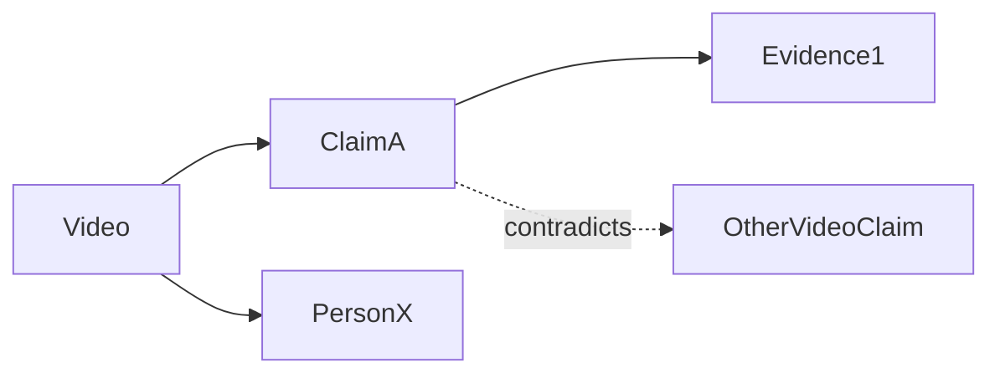

# ADDENDUM 2 — NLP station chain, one-page summary, watcher pop-up + idle scheduling

Read after `CODEX_BUILD_SPEC.md`, `CODEX_BUILD_SPEC_ADDENDUM.md`, and `docs/openintel/OPENINTEL_RECONCILIATION.md`.
All facts go to the ledger first; notes are generated views (Addendum §G).

## 1. Station chain — one small job per pass, per video

Each station reads the ledger + transcript, writes its own records, marks itself done in `STATE/`.
A station can be re-run alone (`breakdown.py station <name> --video <id>`). Order matters only where noted.

| # | Station | Engine | Writes |
|---|---|---|---|
| S0 | **Intake & split** | none | `sources`, chapter file, raw transcript |
| S1 | **Clean & chunk** | none | cleaned paragraphs, chunk table with `t=`/`L###` spans |
| S2 | **Names, places, orgs** | NAS `/ner` (+ GLiNER later) | `statements`-linked entity mentions → `CANDIDATE` entities |
| S3 | **Entity resolution** | rapidfuzz + alias table (+ Wikidata optional) | canonical `ENT-` IDs, aliases, `REVIEW` for ambiguous |
| S4 | **Dates & events** | regex + dateparser + LLM for fuzzy ("after the war") | `events` with statement date vs event date |
| S5 | **Statements & claims** | LLM (Ollama → API fallback) | `statements` (ATTR HIGH/MED/LOW), `CANDIDATE` claims |
| S6 | **Themes** | NAS `/zeroshot` against profile theme list | theme tags + confidence per chunk |
| S7 | **Scripture & citations** (profile: christian) | regex + LLM | `scripture_refs`, `scholars_cited`, works cited |
| S8 | **Cross-check ("check backs")** | NAS `/nli` + `/embed` | `CONTRA-`/`SUPPORTS` candidates vs same channel + existing vault; machine `HUNCH`es |
| S9 | **Validate** | JSON schema + rules | pass → S10; fail → `REVIEW/` with reason |
| S10 | **Project to Obsidian** | templates | chapter note, entity/theme notes, index, one-page summary |

Profiles switch stations on/off and add fields (`christian` enables S7; `conspiracy` adds claimed-evidence and
counterclaim fields to S5). New station = one file in `SCRIPTS/stations/` + one line in `PREFS`.

## 2. One-page summary per video — "CKG card" (Compact Knowledge Graph)

Generated in S10 as `<Channel> - Chapter NNN - <title> — CKG.md`. Fits on one screen.

```markdown
# <title>
**Channel:** … · **Date:** … · **Length:** … · [Watch](url) · [Transcript](chapter note)

## What this is
2–3 sentences: format (lecture / interview / debate), who speaks, the question addressed.

## What it means
The central argument in plain language + the 3–5 key claims (each linked to CLM- and a timestamp).

## How it connects
- **Inside this channel:** closest other videos (embedding neighbours) and what they add
- **To the vault:** matching axioms / papers / cases (S8 results), with link type (SUPPORTS / CONTRADICTS / ANALOGY_TO)
- **Tensions:** contradiction candidates, earlier-vs-later statements by the same speaker

## Mini graph

(top ~12 nodes only: speaker, key people, key claims, strongest cross-links)

## Open threads
Machine hunches + unanswered questions + what to acquire next.
```

### Christian lens section (profile `christian`, appended to the same card)
- **Scripture used:** references + how each is used (proof text / background / illustration)
- **Doctrine touched:** resurrection, atonement, canon, etc.
- **Apologetic argument type:** historical / philosophical / experiential / prophetic
- **Strength & weak points:** where the argument is strongest; what a skeptic would press
- **Theophysics bridge:** candidate links to axioms, with domain label (HISTORICAL / THEOLOGICAL / ANALOGICAL)

### Channel-level card
After all videos: `<Channel> — CKG.md` rolling up top claims, most-cited people/works, theme map,
how the speaker's position changed over time, strongest cross-vault connections, open threads.

## 3. Watcher → pop-up → run now or when idle

When the watcher detects a finished download (file stable, not already seen):

**Pop-up (Tkinter, always on top, non-blocking to the watcher):**

```
New download detected
  Gary Habermas — 359 videos (channel)
  Estimated: ~6 h on NAS CPU · profile: christian (change ▾)

  [ Run now ]  [ When PC idle 30 min ▾ ]  [ Tonight at 1:00 ]  [ Only split, no NLP ]  [ Skip ]
  ☐ Remember this choice for this channel
```

- No answer in 5 minutes → default from `PREFS.default_trigger` (default: `idle`).
- Choice is written to `STATE/queue.json` (job id, file, profile, trigger, created_at).

**Scheduler (`SCRIPTS/scheduler.py`, started by `START.bat` alongside the watcher):**
- `idle` = no keyboard/mouse input for N minutes (Windows `GetLastInputInfo` via ctypes) **and**
  desktop CPU < 30% **and** no fullscreen app. Configurable N (default 30).
- Runs stations one video at a time; checks idle between videos. **When the user comes back, pause after the
  current video** (resume later from `STATE/`). NAS-only stations may keep running if `PREFS.nas_runs_while_busy`.
- `tonight` = start at a set time, stop at `PREFS.stop_hour` (like prior-art-sweep's `night_stop_hour`).
- Tray icon (pystray) or `LAUNCH.bat` menu shows: queue, current video, % done, pause/resume, open last CKG.
- On completion: Windows toast "Gary Habermas done — 351 notes, 12 in review" + `_RUN_COMPLETE.json` + READY signal.

## 4. Acceptance tests (add to earlier list)
13. Drop a channel file → pop-up appears within 30 s; choosing "When PC idle" queues without running.
14. Simulated idle (test hook) starts the job; simulated input pauses after current video; resume completes with no duplicates.
15. Each station can be run alone on one video and is idempotent.
16. Every video with a transcript gets a CKG card with all five sections (empty sections say "none found", never omitted).
17. `christian` profile adds the Christian lens section; `general` does not.
